# Software Requirements Specification (SRS) pour PyStudio Mobile

*Conforme aux normes IEEE 830 et ISO/IEC/IEEE 29148*

## Table des Matières

- [1. Introduction](#1-introduction)
  - [1.1 Objectif](#11-objectif)
  - [1.2 Portée](#12-portée)
  - [1.3 Définitions, Acronymes et Abréviations](#13-définitions-acronymes-et-abréviations)
  - [1.4 Références](#14-références)
  - [1.5 Vue d'ensemble](#15-vue-densemble)
- [2. Description Générale](#2-description-générale)
  - [2.1 Perspective du Produit](#21-perspective-du-produit)
  - [2.2 Fonctions du Produit](#22-fonctions-du-produit)
  - [2.3 Caractéristiques des Utilisateurs](#23-caractéristiques-des-utilisateurs)
  - [2.4 Contraintes](#24-contraintes)
- [3. Exigences Spécifiques](#3-exigences-spécifiques)
  - [3.1 Exigences d'Architecture](#31-exigences-darchitecture)
  - [3.2 Exigences Fonctionnelles](#32-exigences-fonctionnelles)
  - [3.3 Exigences d'Interfaces Externes](#33-exigences-dinterfaces-externes)
  - [3.4 Exigences de Performances](#34-exigences-de-performances)
  - [3.5 Exigences de Sécurité](#35-exigences-de-sécurité)
- [4. Annexes](#4-annexes)
  - [4.1 Index des Exigences (Références Croisées)](#41-index-des-exigences-références-croisées)


## 1. Introduction
### 1.1 Objectif
Ce document fusionne toutes les spécifications de PyStudio Mobile.
### 1.2 Portée
L'ensemble du système PyStudio Mobile, incluant l'architecture, l'interface utilisateur, le runtime Python, etc.
### 1.3 Définitions, Acronymes et Abréviations
Voir les sections spécifiques.
### 1.4 Références
- Spécifications individuelles générées précédemment.
- IEEE 830-1998
- ISO/IEC/IEEE 29148:2018
### 1.5 Vue d'ensemble
Ce document est structuré selon les catégories d'exigences (Architecture, Fonctionnelles, Interfaces, Performances, Sécurité).

## 2. Description Générale
### 2.1 Perspective du Produit
PyStudio Mobile est un environnement de développement Python complet sur Android.
### 2.2 Fonctions du Produit
Voir la section 3.
### 2.3 Caractéristiques des Utilisateurs
Développeurs, data scientists, apprenants sur mobile.
### 2.4 Contraintes
Limites matérielles des appareils mobiles Android, sécurité du système de fichiers Android.

## 3. Exigences Spécifiques

### 3.1 Exigences d'Architecture
#### [REQ-ARCH-0001] PyStudio Mobile — Spécification d'Architecture

**Type de document :** Spécification technique d'architecture logicielle
**Version :** 1.0
**Date :** 12 juillet 2026
**Portée :** Application Android complète (IDE Python + C/C++), runtime embarqué, couche native, sécurité, performance, scalabilité

---

##### [REQ-ARCH-0002] Table des matières

0. Principes directeurs
1. Résumé exécutif
2. Architecture globale
3. Frontend — React Native / TypeScript
4. Couche de services applicatifs (« Backend » embarqué)
5. Runtime Python — CPython embarqué
6. Couche native — Kotlin / NDK / C++ / JNI
7. Support natif C/C++ (fonctionnalité de premier niveau)
8. Flux de données
9. Communication entre modules
10. Sécurité
11. Performances
12. Scalabilité & Marketplace
13. APIs internes
14. Structures de données
15. Arborescence du monorepo
16. Risques techniques & mitigations
17. Roadmap technique
18. Glossaire

---

##### [REQ-ARCH-0003] 0. Principes directeurs

| Principe | Description | Implication technique |
|---|---|---|
| **Offline-first** | Toute fonctionnalité cœur (édition, exécution, build, debug, Git local) fonctionne sans réseau | Toolchains, interpréteurs, index LSP et données ML embarqués ou mis en cache localement |
| **Android-first** | L'expérience est pensée pour le tactile, l'autonomie et les contraintes mémoire mobiles, avant toute portabilité future (iOS/Desktop) | Utilisation poussée du NDK, des services isolés Android, de Scoped Storage |
| **Parité Python / C++** | Le C/C++ n'est pas un "plugin" mais un citoyen de première classe au même titre que Python | Toolchains Clang/LLVM, CMake et LLDB embarqués au même niveau que CPython |
| **Séparation stricte des couches** | UI, orchestration, runtime et stockage sont découplés par des interfaces stables | Bridges typés, API internes versionnées (cf. §13) |
| **Isolation & résilience** | Un crash de code utilisateur (Python ou natif) ne doit jamais tuer l'IDE | Exécution en process Android isolé (`android:isolatedProcess`), communication par Binder/AIDL |
| **Sécurité par design** | Code tiers (marketplace, packages) et code utilisateur sont sandboxés et vérifiés | Signature cryptographique, permissions granulaires, Keystore Android |
| **Extensibilité** | L'IDE doit pouvoir grandir via un marketplace de packages, templates, plugins et thèmes | Registre versionné, API plugin stable, sandbox JS pour extensions tierces |
| **Performance perçue "desktop"** | Démarrage rapide, autocomplétion réactive, builds incrémentaux | Hermes, cache de compilation, indexation incrémentale, pooling de process |

---

##### [REQ-ARCH-0004] 1. Résumé exécutif

PyStudio Mobile est un IDE Android complet, inspiré de VS Code, permettant d'écrire, exécuter, déboguer et packager du code **Python** et **C/C++** directement sur un smartphone ou une tablette, sans connexion réseau obligatoire. L'application embarque un runtime **CPython** cross-compilé pour Android, une toolchain **Clang/LLVM + CMake + LLDB** complète, ainsi que les bibliothèques scientifiques et ML majeures (PyTorch, TensorFlow/TFLite, OpenCV, NLTK, scikit-learn). Elle intègre un client **Git** natif, un moteur de notebooks **Jupyter**, un **assistant IA** contextuel, et un **marketplace** de packages/plugins/templates.

L'architecture repose sur quatre strates : une couche de présentation React Native/TypeScript, une couche de bridge typée (JSI/TurboModules), une couche de services d'orchestration en Kotlin, et un cœur natif en C++ exposé via JNI qui héberge les runtimes embarqués (CPython, LLVM/Clang, CMake, LLDB, moteurs ML). Le C/C++ est traité comme une fonctionnalité de premier niveau : création de projets, compilation croisée multi-ABI (arm64-v8a, armeabi-v7a, x86_64), génération de bibliothèques `.so`, build CMake, débogage LLDB, et intégration bidirectionnelle avec Python via des extensions natives (C-API, pybind11, Cython, ctypes/cffi).

---

##### [REQ-ARCH-0005] 2. Architecture globale

Le système intègre désormais un support natif pour le calcul scientifique et la visualisation de données via la **PyStudio Visualization Layer**, qui vient s'ajouter aux couches de base existantes.

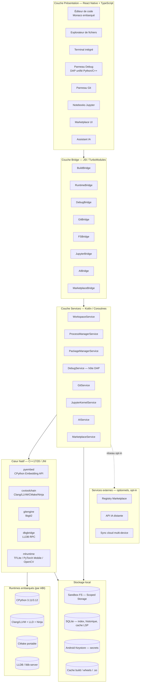

###### [REQ-ARCH-0006] 2.1 Vue par couches

| # | Couche | Technologies | Rôle |
|---|---|---|---|
| 1 | Présentation | React Native, TypeScript, Hermes, WebView Monaco | Interface desktop-like, tactile-first |
| 2 | Bridge | JSI, TurboModules, EventEmitter | Communication faible latence JS ↔ Native, streaming logs |
| 3 | Services | Kotlin, Coroutines, AIDL, WorkManager | Orchestration métier, cycle de vie, isolation process |
| 4 | Cœur natif | C++17/20, JNI, CMake, Ninja | Logique lourde, wrapping des toolchains |
| 5 | Runtimes | CPython, Clang/LLVM, CMake, LLDB | Exécution et outillage des langages supportés |
| 6 | Stockage | Scoped Storage, SQLite, EncryptedSharedPreferences | Persistance locale, cache, secrets |

###### [REQ-ARCH-0007] 2.2 Note sur le « Backend »

PyStudio Mobile étant **offline-first**, il n'existe pas de backend serveur obligatoire. Le terme « backend » désigne ici la **couche de services embarqués** (Kotlin, §4) qui orchestre les runtimes locaux. Un backend cloud existe uniquement pour des fonctions **opt-in** : registre marketplace, synchronisation multi-device, et appel à un modèle d'IA distant plus puissant que le modèle on-device.

---

##### [REQ-ARCH-0008] 3. Frontend — React Native / TypeScript

###### [REQ-ARCH-0009] 3.1 Arborescence fonctionnelle

| Module UI | Responsabilité |
|---|---|
| `editor/` | Édition de code, coloration syntaxique, LSP client (Python + C/C++), multi-onglets, split-view |
| `explorer/` | Arborescence de fichiers/projets, drag & drop, recherche full-text |
| `terminal/` | Émulateur de terminal (pty virtuel) relié au shell embarqué |
| `debugger-ui/` | Panneau de debug unifié (DAP) : breakpoints, variables, pile d'appels, watch |
| `git-panel/` | Diff viewer, staging, commit, branches, merge, historique |
| `jupyter-notebook-ui/` | Rendu de cellules (code/markdown), sorties riches (images, dataframes, plots) |
| `marketplace-ui/` | Recherche, fiche produit, installation, gestion des mises à jour |
| `ai-assistant-ui/` | Chat contextuel, suggestions inline, application de patchs |
| `settings/` | Préférences, gestion des toolchains, thèmes, raccourcis |

###### [REQ-ARCH-0010] 3.2 Éditeur de code

L'éditeur repose sur **Monaco Editor** hébergé dans une WebView optimisée (communication par `postMessage` sérialisé, pas de rechargement de page), choisi pour sa fidélité à l'expérience desktop (multi-curseurs, minimap, pliage de code, diff inline). Une grammaire TextMate dédiée est fournie pour Python et C/C++. L'éditeur se connecte à des serveurs de langage locaux :

- **Python** → `pylsp`/`pyright` embarqué (process isolé)
- **C/C++** → `clangd` embarqué (même toolchain LLVM que la compilation, §7.10)

###### [REQ-ARCH-0011] 3.3 Gestion d'état

- **Zustand** pour l'état global léger (onglets ouverts, thème, session courante)
- **Pattern query/async** type RTK Query pour les appels au Bridge (cache, invalidation, statut `loading/error/success`)
- Persistance de l'état de workspace en SQLite via `WorkspaceService`

###### [REQ-ARCH-0012] 3.4 Bridge Frontend ↔ Natif

| Type d'appel | Mécanisme | Cas d'usage |
|---|---|---|
| Synchrone rapide | JSI (accès direct mémoire) | Vérification d'existence de fichier, lecture de petite config |
| Asynchrone (Promise) | TurboModules | Build, exécution, opérations Git, installation marketplace |
| Streaming continu | EventEmitter natif → JS | Logs de build, stdout/stderr d'exécution, événements de debug (DAP), sorties de cellules Jupyter |

---

##### [REQ-ARCH-0013] 4. Couche de services applicatifs (« Backend » embarqué, Kotlin)

| Service | Responsabilité | Technologies clés |
|---|---|---|
| `WorkspaceService` | Cycle de vie des projets/workspaces, indexation, persistance | Kotlin Coroutines, SQLite |
| `FileSystemService` | Accès fichiers sandboxé, watch de fichiers, gestion des permissions | Scoped Storage, `FileObserver` |
| `ProcessManagerService` | Spawn et supervision des process isolés (Python, Clang, CMake, LLDB, Git) | `android:isolatedProcess`, AIDL, WorkManager |
| `PackageManagerService` | Résolution de dépendances Python (pip offline/online) et bibliothèques C/C++ | Résolveur de dépendances custom, cache de wheels |
| `GitService` | Opérations Git complètes (clone, commit, branch, merge, rebase, diff) | libgit2 via JNI |
| `JupyterKernelService` | Hébergement d'un kernel `ipykernel` in-process | CPython embarqué, protocole Jupyter simplifié en mémoire |
| `DebugService` | Hôte du protocole DAP, pont vers `debugpy` (Python) et LLDB (C/C++) | Debug Adapter Protocol |
| `AIService` | Construction de contexte, appel modèle (local ou distant), application de suggestions | ContextBuilder, client API |
| `MarketplaceService` | Recherche, téléchargement, vérification et installation de packages/plugins/templates | Vérification de signature, quarantaine |
| `TelemetryService` | Télémétrie anonymisée opt-in (crash reports, usage agrégé) | Stockage local avant envoi différé |

---

##### [REQ-ARCH-0014] 5. Runtime Python — CPython embarqué

###### [REQ-ARCH-0015] 5.1 Stratégie de build

CPython est **cross-compilé** pour Android via le NDK, pour chaque ABI cible, produisant `libpython3.x.so`, les modules d'extension standards (`.so`) et une bibliothèque standard packagée en zip (`python3xx.zip`) pour réduire le nombre de fichiers et accélérer les imports (`zipimport`).

###### [REQ-ARCH-0016] 5.2 Gestion multi-version et environnements

Chaque workspace référence une version de CPython (3.11 ou 3.12) et un environnement isolé, émulant le comportement `venv` par redirection de `PYTHONHOME`/`PYTHONPATH` vers un dossier sandboxé par projet (`/data/user/0/com.pystudio/files/envs/<envId>/`), sans dépendre de `fork()` (non fiable sur Android post-Zygote).

###### [REQ-ARCH-0017] 5.3 Bibliothèques scientifiques et ML — stratégie d'intégration

| Bibliothèque | Stratégie Android | Contraintes principales |
|---|---|---|
| **PyTorch** | Wheels précompilées (PyTorch Mobile / LibTorch Lite) cross-buildées NDK ; délégation possible vers ExecuTorch | Taille (~100–300 Mo), pas de CUDA, exécution CPU + délégués NNAPI/Vulkan |
| **TensorFlow** | Priorité à **TensorFlow Lite** (interpréteur + délégués NNAPI/GPU) ; TF complet disponible en wheel allégée si nécessaire | Pas de GPU CUDA, conversion `.tflite` recommandée pour l'inférence |
| **OpenCV** | `opencv-python` cross-compilé NDK, ou OpenCV Android SDK exposé via JNI + binding Python | Modules `contrib` optionnels (téléchargement à la demande) |
| **NLTK** | Pur Python, corpora (`nltk_data`) téléchargés à la demande et mis en cache local | Dépendance réseau au premier usage (bundle offline optionnel) |
| **scikit-learn** | `numpy`/`scipy` cross-compilés avec **OpenBLAS** (NDK), wheels distribuées via le registre interne | Chaîne BLAS/LAPACK complexe, temps de build long → wheels précompilées en cache |

###### [REQ-ARCH-0018] 5.4 Isolation d'exécution

Android interdisant l'usage classique de `fork()` après le démarrage de la Zygote, chaque exécution de code utilisateur est confiée à un **service Android isolé** (`android:process=":runner"`, `android:isolatedProcess="true"`), communiquant avec le process principal via **Binder/AIDL**. Ce service héberge une instance CPython dédiée, ce qui garantit qu'un crash du code utilisateur n'affecte jamais l'UI.

###### [REQ-ARCH-0019] 5.5 Concurrence

Le GIL de CPython limite le parallélisme intra-interpréteur ; le parallélisme réel est obtenu par plusieurs interpréteurs sous-processus isolés (pattern multiprocessing adapté à Android) plutôt que par le threading classique pour les charges CPU-bound (ex. entraînement ML).

---

##### [REQ-ARCH-0020] 6. Couche native — Kotlin / NDK / C++ / JNI

###### [REQ-ARCH-0021] 6.1 Modules Kotlin

- **Services Android** (Foreground Service pour builds longues et sessions de debug, afin d'éviter le kill par le système)
- **ContentProvider** dédié pour l'accès contrôlé aux fichiers du marketplace
- **WorkManager** pour les tâches différables (téléchargement de toolchains, indexation de gros projets)

###### [REQ-ARCH-0022] 6.2 Bridge JNI

Convention : chaque service Kotlin expose une interface `Native*Service`, implémentée via `System.loadLibrary`, avec gestion rigoureuse des références locales/globales JNI et libération explicite (`DeleteLocalRef`) pour éviter les fuites sur les sessions longues (builds, debug).

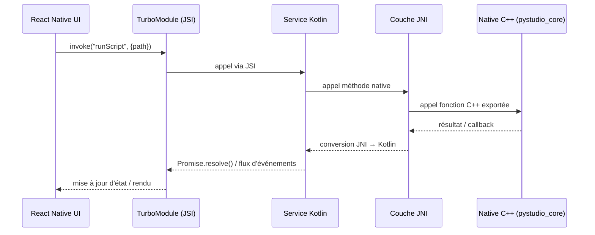

###### [REQ-ARCH-0023] 6.3 Modules du cœur natif C++

| Module | Rôle | Dépendances externes |
|---|---|---|
| `pystudio_core` | Orchestrateur C++ partagé, registre de services natifs | — |
| `pyembed` | Wrapper de l'API d'embedding CPython | CPython |
| `cxxtoolchain` | Wrapper Clang/LLVM libTooling, pilotage CMake/Ninja | LLVM, CMake, Ninja |
| `gitengine` | Wrapper libgit2 | libgit2 |
| `dbgbridge` | Pont RPC vers LLDB (protocole DAP) | LLDB |
| `mlruntime` | Dispatch vers TFLite / PyTorch Mobile / OpenCV | TFLite, LibTorch, OpenCV |

---

##### [REQ-ARCH-0024] 7. Support natif C/C++ — fonctionnalité de premier niveau

Le C/C++ dispose du **même statut que Python** : création de projet dédiée, toolchain complète embarquée, build system, débogueur natif, et intégration bidirectionnelle avec l'écosystème Python.

###### [REQ-ARCH-0025] 7.1 Modèle de projet C/C++

Templates disponibles à la création :

| Template | Sortie | Cas d'usage |
|---|---|---|
| Exécutable natif | binaire ELF | Programmes autonomes, exercices, algorithmique |
| Bibliothèque statique | `.a` | Composants réutilisables au sein d'un projet |
| Bibliothèque partagée | `.so` | Composants dynamiques, plugins |
| Bibliothèque Android NDK | `.so` + `.aar` | Intégration dans une app Android tierce |
| Extension Python native | `.so` (tag ABI `cpython-3xx-android-<abi>`) | Accélération de code Python, binding C/C++ |

Structure standard générée :

```
mon-projet-cpp/
├── CMakeLists.txt
├── CMakePresets.json
├── src/
│   └── main.cpp
├── include/
│   └── mon_projet/
├── tests/
├── .pystudio/
│   ├── build/            # répertoires de build par preset (généré, ignoré du VCS)
│   └── compile_commands.json
└── README.md
```

###### [REQ-ARCH-0026] 7.2 Toolchain Clang/LLVM embarquée

Le compilateur **Clang/LLVM tourne nativement sur le device** (hôte ARM64 ou x86_64 selon l'appareil) et effectue de la **cross-compilation** vers les trois ABI cibles, grâce à un sysroot NDK embarqué (headers + bibliothèques par ABI). Ce sysroot peut être livré avec l'APK ou téléchargé à la demande (Play Feature Delivery) afin de limiter la taille initiale, avec vérification de checksum SHA-256 avant activation.

| Composant | Rôle |
|---|---|
| `clang` / `clang++` | Compilation C / C++ |
| `lld` | Éditeur de liens LLVM (rapide, faible RAM) |
| `llvm-ar` | Création d'archives statiques |
| `llvm-strip` | Suppression des symboles en build release |
| `llvm-objdump`, `llvm-nm` | Inspection binaire (debug avancé) |
| `clangd` | Serveur de langage (autocomplétion, diagnostics) |
| `clang-format`, `clang-tidy` | Formatage et analyse statique |

###### [REQ-ARCH-0027] 7.3 Système de build CMake

**CMake** (porté pour tourner directement sur le device) pilote la génération avec **Ninja** comme générateur, choisi pour sa rapidité et sa faible empreinte mémoire — critique sur mobile. Le toolchain file standard `android.toolchain.cmake` (fourni par le NDK embarqué) est utilisé pour chaque ABI, avec des presets prédéfinis :

```json
// CMakePresets.json (généré automatiquement)
{
  "version": 6,
  "configurePresets": [
    {
      "name": "arm64-v8a-debug",
      "generator": "Ninja",
      "binaryDir": "${sourceDir}/.pystudio/build/arm64-v8a-debug",
      "cacheVariables": {
        "CMAKE_TOOLCHAIN_FILE": "$env{NDK_HOME}/build/cmake/android.toolchain.cmake",
        "ANDROID_ABI": "arm64-v8a",
        "ANDROID_PLATFORM": "android-21",
        "CMAKE_BUILD_TYPE": "Debug"
      }
    },
    {
      "name": "armeabi-v7a-release",
      "generator": "Ninja",
      "binaryDir": "${sourceDir}/.pystudio/build/armeabi-v7a-release",
      "cacheVariables": {
        "CMAKE_TOOLCHAIN_FILE": "$env{NDK_HOME}/build/cmake/android.toolchain.cmake",
        "ANDROID_ABI": "armeabi-v7a",
        "ANDROID_PLATFORM": "android-21",
        "CMAKE_BUILD_TYPE": "Release"
      }
    }
  ]
}
```

###### [REQ-ARCH-0028] 7.4 Génération de bibliothèques `.so` multi-ABI

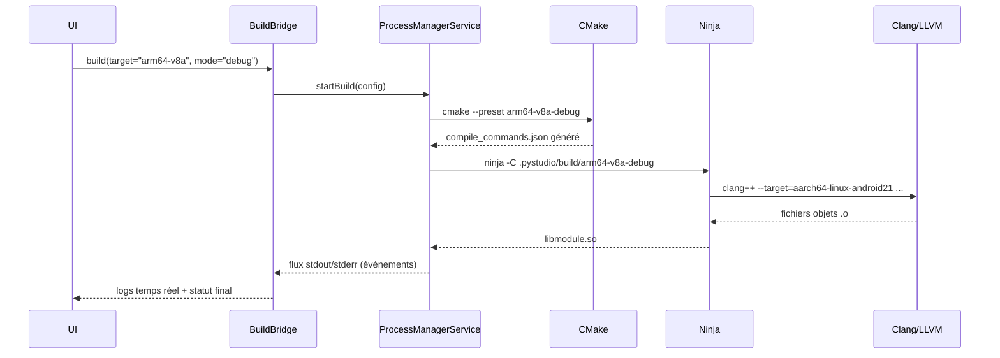

Un **build "fat"** compile en parallèle (pool de threads borné pour limiter l'échauffement CPU) les trois ABI, puis fusionne les artefacts dans une structure `jniLibs/<abi>/lib*.so` prête à l'intégration ou à l'export. En mode debug, les symboles DWARF sont conservés dans un fichier `.so.debug` séparé (non embarqué en release) pour permettre le débogage LLDB sans alourdir les artefacts distribués.

###### [REQ-ARCH-0029] 7.5 Débogage LLDB

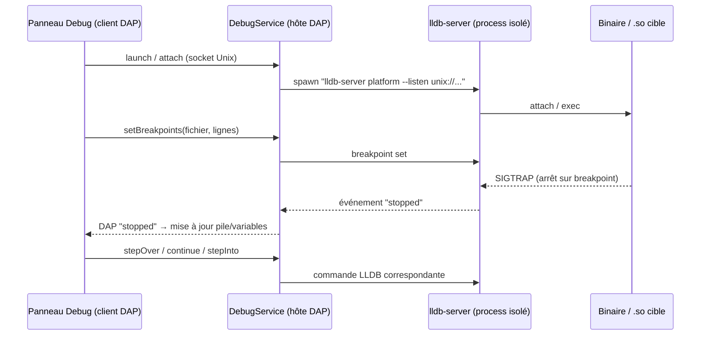

`lldb-server` s'exécute en process isolé, communiquant exclusivement par **socket Unix local** (jamais de port TCP exposé), avec vérification d'UID pour empêcher toute autre application du device d'y accéder. Le panneau de debug de l'UI est **unifié** avec celui utilisé pour Python (protocole DAP commun), offrant la même expérience (breakpoints, watch, pile d'appels, inspection mémoire/registres) pour les deux langages.

###### [REQ-ARCH-0030] 7.6 Intégration C/C++ ↔ Python — extensions natives

Quatre méthodes sont supportées, du plus bas niveau au plus haut niveau :

| Méthode | Complexité | Performance | Cas d'usage typique |
|---|---|---|---|
| Python C-API pur (`Python.h`) | Élevée | Maximale | Contrôle fin, zéro dépendance additionnelle |
| **pybind11** (recommandé) | Moyenne | Très bonne | Binding C++ moderne : classes, templates, STL |
| **Cython** | Moyenne | Bonne | Hybride Python/C typé progressivement |
| **ctypes / cffi** | Faible | Bonne (overhead de marshaling) | Réutiliser un `.so` existant sans recompiler l'interpréteur |

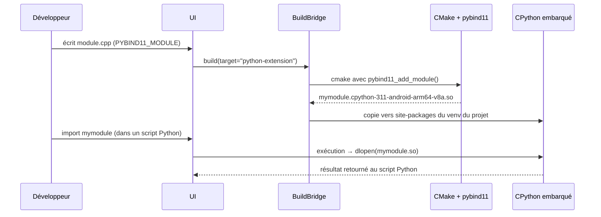

Le toolchain Clang reçoit automatiquement un sysroot additionnel « Python » (headers `Python.h` + `libpython3.x.so` issus du runtime embarqué), garantissant la compatibilité ABI (tag `cpython-3xx-android-<abi>`) entre l'extension compilée et l'interpréteur qui l'importera.

```cmake
# Exemple : CMakeLists.txt d'une extension Python via pybind11
cmake_minimum_required(VERSION 3.22)
project(mymodule LANGUAGES CXX)

set(CMAKE_CXX_STANDARD 20)
set(CMAKE_CXX_STANDARD_REQUIRED ON)

find_package(pybind11 REQUIRED)
pybind11_add_module(mymodule src/binding.cpp src/core.cpp)
target_include_directories(mymodule PRIVATE include)

if(CMAKE_BUILD_TYPE STREQUAL "Debug")
    target_compile_options(mymodule PRIVATE -fsanitize=address,undefined -g)
    target_link_options(mymodule PRIVATE -fsanitize=address,undefined)
endif()
```

###### [REQ-ARCH-0031] 7.7 SDK NDK intégré — bibliothèques Android natives

PyStudio Mobile permet de créer des **bibliothèques Android NDK** structurellement compatibles avec un projet Gradle/Android Studio externe (interopérabilité), avec génération automatique des stubs JNI depuis des interfaces Kotlin annotées, et export final sous forme d'**AAR** (contenant les `.so` multi-ABI + headers publics), publiable directement sur le Marketplace interne.

###### [REQ-ARCH-0032] 7.8 Matrice de compilation multi-cibles

| ABI | Triple Clang | API level min | Usage principal |
|---|---|---|---|
| **arm64-v8a** | `aarch64-linux-android21` | 21 | Cible principale — majorité des devices depuis 2018 |
| **armeabi-v7a** | `armv7a-linux-androideabi21` | 21 | Devices d'entrée de gamme / legacy |
| **x86_64** | `x86_64-linux-android21` | 21 | Émulateurs, tablettes/Chromebooks x86 |

###### [REQ-ARCH-0033] 7.9 Diagnostics et sanitizers

Les runtimes **ASan** (AddressSanitizer) et **UBSan** (UndefinedBehaviorSanitizer) fournis par le NDK sont activables par un simple bouton dans les paramètres du projet pour les builds *debug*, aidant à détecter fuites mémoire, dépassements de buffer et comportements indéfinis directement sur device.

###### [REQ-ARCH-0034] 7.10 Autocomplétion et analyse statique (LSP)

`clangd` (même toolchain LLVM que la compilation) s'exécute en process isolé et communique en LSP (JSON-RPC sur stdio) avec l'éditeur, en s'appuyant sur le `compile_commands.json` généré automatiquement par CMake à chaque configuration — garantissant que l'autocomplétion reflète exactement les flags de compilation réels du projet.

###### [REQ-ARCH-0035] 7.11 Vue d'ensemble du pipeline C/C++

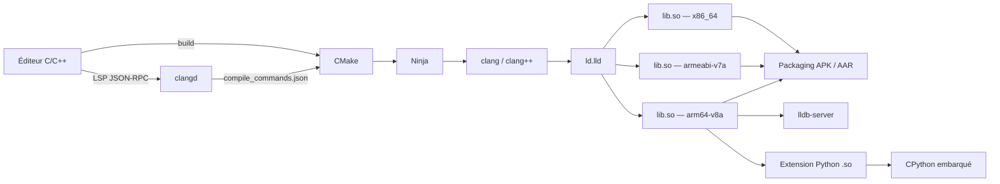

---

##### [REQ-ARCH-0036] 8. Flux de données

###### [REQ-ARCH-0037] 8.1 Exécution d'un script Python

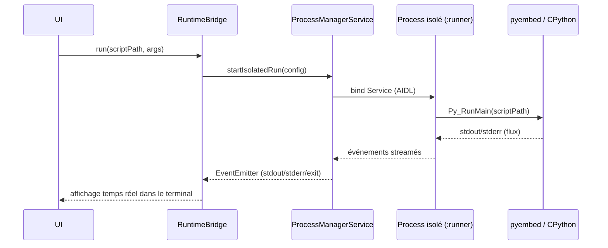

###### [REQ-ARCH-0038] 8.2 Session de débogage unifiée (Python et C++)

Le panneau de debug utilise un **client DAP unique** ; selon le langage du fichier actif, `DebugService` route vers `debugpy` (Python, in-process avec l'interpréteur embarqué) ou vers `dbgbridge`/LLDB (natif, cf. §7.5), en normalisant les événements (`stopped`, `breakpoint`, `variables`, `stackTrace`) dans un format commun pour l'UI.

###### [REQ-ARCH-0039] 8.3 Exécution Jupyter

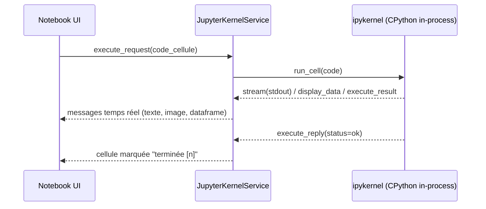

###### [REQ-ARCH-0040] 8.4 Requête à l'assistant IA

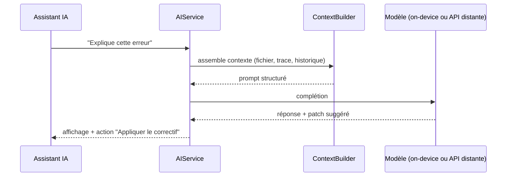

###### [REQ-ARCH-0041] 8.5 Installation depuis le Marketplace

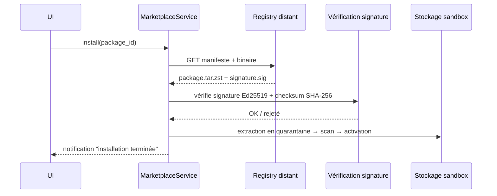

---

##### [REQ-ARCH-0042] 9. Communication entre modules

###### [REQ-ARCH-0043] 9.1 Protocoles internes standardisés

| Protocole | Usage | Transport | Format |
|---|---|---|---|
| **DAP** (Debug Adapter Protocol) | Debug Python et C++ unifié | Socket Unix local | JSON-RPC |
| **LSP** (Language Server Protocol) | Autocomplétion, diagnostics (pylsp, clangd) | stdio du process isolé | JSON-RPC |
| **AIDL/Binder** | IPC inter-process Android (UI ↔ process isolé d'exécution) | Binder kernel Android | Parcelable |
| **JSI/TurboModules** | Bridge JS ↔ Kotlin | Mémoire partagée / appel direct | Objets typés TS/Kotlin |
| Protocole kernel Jupyter simplifié | Exécution de cellules notebook | En mémoire (in-process) | Messages typés (struct) |

###### [REQ-ARCH-0044] 9.2 Bus d'événements interne

Un **Event Bus** (Kotlin `SharedFlow`) centralise les événements transverses (fin de build, résultat Git, notification marketplace) consommés par plusieurs services simultanément sans couplage direct.

| Topic | Émetteur | Consommateurs typiques |
|---|---|---|
| `build.completed` | ProcessManagerService | UI (BuildBridge), AIService (diagnostic d'erreurs) |
| `debug.stopped` | DebugService | UI (DebugBridge) |
| `git.status.changed` | GitService | UI (GitBridge), WorkspaceService (indexation) |
| `marketplace.installed` | MarketplaceService | WorkspaceService, PackageManagerService |
| `fs.changed` | FileSystemService | Editeur (rechargement), LSP (réindexation) |

---

##### [REQ-ARCH-0045] 10. Sécurité

| Menace | Mitigation |
|---|---|
| Exécution de code arbitraire (Python/C++ utilisateur ou packages tiers) | Process Android isolé (`isolatedProcess`), Scoped Storage, aucun accès réseau par défaut pour le code utilisateur (opt-in explicite) |
| Supply chain du Marketplace | Signature Ed25519 des packages, vérification de checksum, installation en quarantaine, scan heuristique statique avant activation |
| Stockage de secrets (tokens Git, clés API) | Android Keystore / `EncryptedSharedPreferences` |
| Intégrité des toolchains téléchargées (LLVM, sysroot NDK) | Vérification SHA-256 systématique avant activation |
| Permissions runtime | Modèle de permissions granulaire par projet (réseau, capteurs, fichiers hors sandbox) |
| Communication IPC | Sockets Unix locaux avec vérification d'UID ; aucun port TCP loopback exposé |
| Débogueur natif | `lldb-server` lié en local uniquement ; debug distant désactivé par défaut, activable avec appairage chiffré explicite |

---

##### [REQ-ARCH-0046] 11. Performances

| Métrique | Cible |
|---|---|
| Démarrage à froid de l'application | < 2 s |
| Ouverture d'un fichier < 1 Mo | < 100 ms |
| Latence d'autocomplétion (LSP) | < 150 ms (p50) |
| Build incrémental C++ (petit projet) | < 3 s |
| Résolution d'environnement Python (cache chaud) | < 5 s |
| Démarrage d'un kernel Jupyter | < 1,5 s |
| Attache du débogueur LLDB | < 2 s |

**Stratégies :** moteur JS Hermes, chargement différé des modules UI non critiques, `mmap` pour l'ouverture de gros fichiers, indexation incrémentale (cache LSP en SQLite), cache de compilation type *ccache* pour Clang, pool de process d'exécution « chauds » pour réduire la latence de démarrage d'un script, limitation dynamique du parallélisme de build selon la température/charge CPU du device.

---

##### [REQ-ARCH-0047] 12. Scalabilité & Marketplace

###### [REQ-ARCH-0048] 12.1 Types d'objets du Marketplace

| Type | Description |
|---|---|
| Package Python | Wheel précompilée (notamment pour les libs ML lourdes à build long) |
| Bibliothèque C/C++ précompilée | `.so`/`.a` multi-ABI + headers |
| Template de projet | Structure de départ (Python, C++, mixte) |
| Plugin UI/thème | Extension sandboxée de l'interface |
| Snippet / preset IA | Prompt ou configuration réutilisable pour l'assistant |

###### [REQ-ARCH-0049] 12.2 Extensibilité plugin

Les extensions tierces s'exécutent dans un **contexte JS sandboxé** (moteur type QuickJS isolé), sans accès direct au natif : elles ne peuvent invoquer que les capacités explicitement déclarées et validées dans leur manifeste (principe du moindre privilège).

###### [REQ-ARCH-0050] 12.3 Registre distribué

Le registre marketplace combine un **CDN** pour la distribution des binaires et un **cache local avec synchronisation différée**, permettant la consultation et la réinstallation de packages déjà téléchargés en mode totalement hors-ligne.

---

##### [REQ-ARCH-0051] 13. APIs internes

###### [REQ-ARCH-0052] 13.1 Interface TypeScript exposée à la Présentation

```typescript
export interface BuildOptions {
  projectId: string;
  target: 'python' | 'cpp' | 'python-extension' | 'ndk-library';
  abi?: 'arm64-v8a' | 'armeabi-v7a' | 'x86_64' | 'all';
  mode: 'debug' | 'release';
  cmakeArgs?: string[];
}

export interface BuildResult {
  success: boolean;
  artifacts: string[];   // chemins des .so / exécutables générés
  durationMs: number;
  logId: string;          // référence au flux de logs streamés
}

export interface PyStudioBuildBridge {
  build(options: BuildOptions): Promise<BuildResult>;
  cancelBuild(buildId: string): Promise<void>;
  onBuildLog(callback: (chunk: BuildLogChunk) => void): () => void; // unsubscribe
}

export interface BuildLogChunk {
  buildId: string;
  stream: 'stdout' | 'stderr';
  text: string;
  timestamp: number;
}
```

###### [REQ-ARCH-0053] 13.2 Interface Kotlin (côté service)

```kotlin
interface NativeBuildService {
    suspend fun build(options: BuildOptions): BuildResult
    suspend fun cancelBuild(buildId: String)
    fun logsFlow(buildId: String): Flow<BuildLogChunk>
}

data class BuildOptions(
    val projectId: String,
    val target: BuildTarget,     // PYTHON, CPP, PYTHON_EXTENSION, NDK_LIBRARY
    val abi: Abi = Abi.ARM64_V8A,
    val mode: BuildMode = BuildMode.DEBUG,
    val cmakeArgs: List<String> = emptyList()
)
```

###### [REQ-ARCH-0054] 13.3 En-tête JNI (C++)

```cpp
// pystudio_core_jni.h
extern "C" {

JNIEXPORT jobject JNICALL
Java_com_pystudio_core_NativeBuildService_nativeBuild(
    JNIEnv* env, jobject thiz, jobject buildOptions);

JNIEXPORT void JNICALL
Java_com_pystudio_core_NativeBuildService_nativeCancelBuild(
    JNIEnv* env, jobject thiz, jstring buildId);

JNIEXPORT jobject JNICALL
Java_com_pystudio_core_PyEmbed_nativeRunScript(
    JNIEnv* env, jobject thiz, jstring scriptPath, jobjectArray args);

} // extern "C"
```

###### [REQ-ARCH-0055] 13.4 Table récapitulative des modules de bridge

| Module JS (`NativeModules.X`) | Service natif associé | Type d'appel | Description |
|---|---|---|---|
| `BuildBridge` | ProcessManagerService + cxxtoolchain | async + stream | Build Python / C / C++ |
| `RuntimeBridge` | pyembed | async + stream | Exécution de scripts Python |
| `DebugBridge` | DebugService (DAP) | async + stream | Sessions de debug Python/C++ |
| `GitBridge` | GitService (libgit2) | async | Opérations Git |
| `FSBridge` | WorkspaceService | sync (JSI) + async | Accès fichiers sandbox |
| `JupyterBridge` | JupyterKernelService | async + stream | Notebooks |
| `AIBridge` | AIService | async + stream | Assistant IA |
| `MarketplaceBridge` | MarketplaceService | async | Installation packages/plugins |

---

##### [REQ-ARCH-0056] 14. Structures de données

###### [REQ-ARCH-0057] 14.1 `project.json`

```json
{
  "id": "proj_8f2a",
  "name": "mon-projet-cv",
  "type": "mixed",
  "languages": ["python", "cpp"],
  "pythonVersion": "3.11",
  "cppStandard": "c++20",
  "targets": [
    { "name": "core-native", "kind": "shared-library", "abi": ["arm64-v8a", "armeabi-v7a", "x86_64"] },
    { "name": "app-script", "kind": "python-entrypoint", "entry": "main.py" }
  ],
  "dependencies": {
    "python": ["numpy==1.26.4", "opencv-python", "scikit-learn"],
    "native": ["pybind11@2.12.0"]
  },
  "createdAt": "2026-05-01T10:00:00Z"
}
```

###### [REQ-ARCH-0058] 14.2 Autres schémas (champs principaux)

| Fichier | Champs clés | Rôle |
|---|---|---|
| `workspace.json` | `openTabs`, `activeProjectId`, `layout`, `theme` | État de session persistant |
| `build-target.json` | `abi`, `mode`, `cmakePreset`, `lastBuildStatus`, `artifacts[]` | Configuration et historique d'une cible de build |
| `pystudio.lock` | `resolvedPackages[]`, `hashes{}`, `pythonVersion` | Verrouillage reproductible des dépendances |
| Session de debug | `sessionId`, `language`, `breakpoints[]`, `callStack[]`, `variables{}` | État temps réel d'une session DAP |
| Contexte IA | `activeFile`, `selection`, `diagnostics[]`, `recentEdits[]` | Contexte assemblé avant appel modèle |

---

##### [REQ-ARCH-0059] 15. Arborescence du monorepo

```
pystudio-mobile/
├── apps/
│   └── mobile/                     # Application React Native
│       ├── src/
│       │   ├── screens/
│       │   ├── components/
│       │   ├── state/
│       │   └── bridges/
│       └── android/
│           └── app/src/main/
│               ├── kotlin/com/pystudio/services/
│               └── jni/
├── native/
│   ├── pystudio-core/               # Orchestrateur C++ partagé
│   ├── pyembed/
│   ├── cxxtoolchain/
│   ├── gitengine/
│   ├── dbgbridge/
│   └── mlruntime/
├── runtimes/
│   ├── cpython-android/             # scripts de cross-compilation CPython
│   ├── llvm-android/                # scripts de packaging Clang/LLVM
│   └── cmake-android/               # portage CMake on-device
├── services/
│   └── marketplace-registry/        # backend cloud optionnel
├── packages/
│   └── shared-types/                # types TS partagés Bridge ↔ UI
└── tools/
    └── build-scripts/
```

---

##### [REQ-ARCH-0060] 16. Risques techniques & mitigations

| Risque | Impact | Mitigation |
|---|---|---|
| Taille d'APK excessive (toolchains embarquées) | Élevé | Téléchargement à la demande (Play Feature Delivery), modules dynamiques par ABI |
| Fragmentation Android (versions OS, RAM disponible) | Moyen | Matrice de compatibilité explicite, dégradation gracieuse des fonctionnalités lourdes |
| Compilation C++ intensive sur mobile (CPU/RAM/chaleur) | Élevé | Cache incrémental agressif, parallélisme borné, throttling thermique adaptatif |
| Sécurité du Marketplace (code malveillant) | Élevé | Signature cryptographique, sandbox d'installation, revue statique automatique |
| Consommation batterie (builds, inférence ML) | Moyen | Planification via WorkManager, limitation stricte en arrière-plan |

---

##### [REQ-ARCH-0061] 17. Roadmap technique

| Phase | Contenu | Horizon indicatif |
|---|---|---|
| Phase 1 | Éditeur, FS sandboxé, exécution Python basique, Git minimal | T0 – T3 |
| Phase 2 | Support C/C++ complet (CMake, Clang/LLVM, LLDB, extensions Python) | T3 – T6 |
| Phase 3 | Bibliothèques ML (TFLite, OpenCV, scikit-learn), notebooks Jupyter | T6 – T9 |
| Phase 4 | Marketplace, plugins tiers, thèmes | T9 – T11 |
| Phase 5 | Assistant IA intégré, optimisations de performance avancées | T11 – T14 |

---

##### [REQ-ARCH-0062] 18. Glossaire

| Terme | Définition |
|---|---|
| **ABI** | Application Binary Interface — ici, l'architecture CPU cible (arm64-v8a, armeabi-v7a, x86_64) |
| **DAP** | Debug Adapter Protocol — protocole standardisé de communication avec un débogueur |
| **JNI** | Java Native Interface — pont d'appel entre code JVM/Kotlin et code natif C/C++ |
| **JSI** | JavaScript Interface — mécanisme React Native d'appel direct natif à faible latence |
| **LSP** | Language Server Protocol — protocole d'autocomplétion/diagnostics utilisé par les éditeurs |
| **NDK** | Native Development Kit — kit Android pour compiler du code natif C/C++ |
| **Sysroot** | Ensemble de headers et bibliothèques définissant l'environnement de compilation cible |
| **Offline-first** | Principe de conception où toute fonctionnalité cœur fonctionne sans réseau |

---

*Fin de la spécification.*


##### [REQ-ARCH-0063] 13. Architecture de Visualisation Scientifique

Afin d'assurer des performances optimales et une intégration native sur Android, l'architecture de visualisation repose sur le flux de rendu suivant, de haut en bas :

1. **Couches Applicatives (Python) :** Matplotlib / Seaborn / Plotly / Bokeh
   ↓
2. **Couche d'Interface :** PyStudio Visualization Layer (Intercepte les appels de rendu Python)
   ↓
3. **Couche de Rendu Android :** Android Rendering Layer (Traduit les primitives en composants système)
   ↓
4. **Couche Matérielle :** Canvas Android / OpenGL ES / Vulkan (Accélération matérielle native)


### 3.2 Exigences Fonctionnelles
#### [REQ-FUNC-0064] PyStudio Mobile — Spécification du Runtime Python

**Type de document :** Spécification technique — Runtime Python embarqué
**Auteur :** Principal Python Runtime Engineer
**Version :** 1.0
**Date :** 12 juillet 2026
**Portée :** CPython embarqué, cycle de démarrage, gestion mémoire, système d'import, packages, wheels, cache, concurrence, profilage, optimisations natives (ARM64/NEON/LTO/PGO/Vulkan/NNAPI)
**Dépend de :** `PyStudio_Mobile_Architecture_Specification.md` (§5 Runtime Python, §7.6 intégration C/C++, §13 APIs internes)
**Complète :** l'ADR-1 (isolation par `isolatedProcess`) de la spécification d'architecture

---

##### [REQ-FUNC-0065] Table des matières

0. Principes directeurs du runtime
1. Résumé exécutif
2. CPython embarqué — stratégie de build & versions cibles
3. Cycle de démarrage (cold start / warm start)
4. Gestion mémoire
5. Système d'import
6. Gestion des packages (résolveur de dépendances)
7. Wheels — format, tags, pipeline
8. Cache multi-niveaux
9. Multithreading & concurrence
10. Profilage
11. Optimisations natives
12. APIs internes (contrats)
13. Risques & ADRs runtime
14. Glossaire

---

##### [REQ-FUNC-0066] 0. Principes directeurs du runtime

| Principe | Description | Implication technique |
|---|---|---|
| **S'appuyer sur l'amont, ne pas le réinventer** | Depuis la PEP 738, Android est une plateforme Tier 3 officiellement supportée par CPython | Le build CPython part des scripts officiels (`Android/` dans le dépôt CPython), pas d'un pipeline de cross-compilation entièrement maison |
| **Démarrage perçu instantané** | L'utilisateur ne doit jamais attendre l'initialisation de l'interpréteur | Pool d'interpréteurs pré-chauffés, bytecode précompilé, import paresseux |
| **Mémoire disciplinée** | L'app cohabite avec le Low Memory Killer d'Android | Libération d'arènes, réaction à `onTrimMemory`, budgets explicites |
| **Isolation avant vitesse** | Le crash du code utilisateur ne doit jamais dégrader la fiabilité du runtime | Cohérent avec `isolatedProcess` (ADR-1) ; tout gain de perf (pool, sous-interpréteurs) est subordonné à cette contrainte |
| **Parité build officiel / build mobile** | Un package qui fonctionne sur desktop doit pouvoir tourner sur PyStudio sans patch ad hoc | Tags de wheel standard (PEP 738), résolveur conforme aux spécifications PyPA |
| **Mesurer avant d'optimiser** | Toute optimisation native (LTO/PGO/NEON/Vulkan/NNAPI) doit être justifiée par un profil réel | Chaîne de profilage bas-overhead systématiquement disponible (§10) |

---

##### [REQ-FUNC-0067] 1. Résumé exécutif

Ce document spécifie le runtime Python de PyStudio Mobile : la manière dont CPython est construit, démarré, exécuté, débogué et optimisé sur Android. Il s'appuie sur un changement de contexte majeur intervenu depuis la rédaction de la spécification d'architecture : **la PEP 738 (« Adding Android as a supported platform »)** a été acceptée et Android est une **plateforme Tier 3 officiellement supportée par CPython depuis la version 3.13**, avec des tags de wheel standardisés (`android_<api-level>_<abi>`) acceptés par PyPI, une chaîne d'outillage officielle (`cibuildwheel`), et un comportement runtime documenté (`sys.platform == "android"`, redirection stdout/stderr vers Logcat, absence d'exécutable `python3.x` — seul l'embarquement de `libpython3.x.so` est supporté).

Ce changement de fondation a trois conséquences architecturales majeures détaillées dans ce document :

1. **Le couple de versions cible (3.11/3.12) fixé dans la spécification d'architecture doit être révisé** — ces versions précèdent le support officiel Android et ne bénéficient pas de l'outillage upstream. Voir **ADR-2** (§13).
2. **La stratégie « cross-compilation NDK maison » du §5.1 de l'architecture doit être remplacée** par un build partant des scripts officiels CPython pour Android, réduisant la dette de maintenance.
3. **Le modèle hybride de wheels doit intégrer PyPI comme source primaire** pour tout package ayant déjà publié un wheel `android_<api>_<abi>` officiel, le registre privé PyStudio devenant un **complément** (packages non encore portés) plutôt que le chemin principal.

Par ailleurs, l'écosystème d'accélération matérielle a évolué : **NNAPI est déprécié depuis Android 15**, au profit de LiteRT (ex-TensorFlow Lite) avec délégué GPU (Vulkan) et délégués vendeur (Qualcomm QNN, etc.). Ce document en tient compte dans la section Optimisations (§11.6).

---

##### [REQ-FUNC-0068] 2. CPython embarqué — stratégie de build & versions cibles

###### [REQ-FUNC-0069] 2.1 Fondation officielle (PEP 738)

CPython fournit, depuis la 3.13, un support Tier 3 natif d'Android : scripts de build (`Android/README.md` dans le dépôt CPython), releases officielles téléchargeables sur `python.org/downloads/android/`, et une documentation runtime dédiée (`docs.python.org/3/using/android.html`). Le mode d'usage officiellement recommandé et le seul supporté est l'**embarquement de `libpython3.x.so` dans le process principal de l'app** via l'API d'embedding — il n'existe pas et il n'y aura pas d'exécutable `python3.x` autonome sur Android. Cela **confirme** l'approche déjà retenue dans l'architecture (`pyembed`, JNI, §6.3) : aucune correction nécessaire de ce côté, mais la base du build doit changer.

###### [REQ-FUNC-0070] 2.2 Révision de la stratégie de build (corrige §5.1 de l'architecture)

| Approche | Description | Verdict |
|---|---|---|
| **A — Cross-compilation NDK maison** (approche initiale de l'architecture) | Écrire son propre pipeline `configure`/patches à partir des sources CPython génériques | ❌ Abandonnée : réinvente un travail que CPython amont maintient déjà, dette de maintenance à chaque version mineure |
| **B — Partir des scripts officiels `Android/`** | Utiliser `Android/android-env.sh` + `Android/build_python.py` du dépôt CPython, qui pilotent `configure --host=<triple>` avec les bonnes options Android déjà validées par l'équipe cœur | ✅ **Retenue** — même mécanisme `configure`/Makefile POSIX que les autres plateformes, testé par la CI CPython elle-même |
| **C — Réutiliser les artefacts officiels `python.org/downloads/android/`** | Télécharger directement le préfixe (headers + `libpython3.x.so`) publié par python.org plutôt que de builder | ⚠️ Complémentaire à B, mais insuffisant seul : PyStudio a besoin d'options de build spécifiques (LTO, PGO/AutoFDO, désactivation de `Py_DEBUG`, choix des modules stdlib) que les artefacts génériques ne couvrent pas nécessairement pour les trois ABI |

**Décision :** pipeline CI basé sur **B**, avec les artefacts **C** utilisés comme référence de non-régression (le build interne doit produire un binaire fonctionnellement équivalent, testé par le test-suite CPython officiel via le projet `testbed` Gradle qu'expose le dépôt CPython).

###### [REQ-FUNC-0071] 2.3 Matrice ABI (inchangée, héritée de l'architecture §7.8)

| ABI | Triple | API level min | Usage |
|---|---|---|---|
| arm64-v8a | `aarch64-linux-android21` | 21 | Cible principale |
| armeabi-v7a | `armv7a-linux-androideabi21` | 21 | Entrée de gamme / legacy |
| x86_64 | `x86_64-linux-android21` | 21 | Émulateurs, tablettes x86 |

###### [REQ-FUNC-0072] 2.4 Packaging — `python3xx.zip` et bibliothèque standard

La bibliothèque standard est packagée en zip (`python3xx.zip`) pour réduire le nombre de fichiers ouverts au démarrage (`zipimport`) — décision héritée et confirmée. Une optimisation supplémentaire, utilisée par Chaquopy et directement applicable ici : **stocker les entrées du zip non compressées (`ZIP_STORED`)**. Cela permet de `mmap()` directement les fichiers `.pyc` depuis le zip sans étape de décompression ni copie vers le stockage privé de l'app, réduisant le temps de premier lancement après une mise à jour.

```
+----------------------------------------------------------+
| python3xx.zip (ZIP_STORED, embarqué dans l'APK)          |
|  ├─ importlib/__pycache__/*.pyc   (précompilés niveau 2) |
|  ├─ encodings/__pycache__/*.pyc                           |
|  ├─ collections/__pycache__/*.pyc                         |
|  └─ ... (stdlib pure Python uniquement)                   |
+----------------------------------------------------------+
| Modules d'extension stdlib (_ssl, _hashlib, _sqlite3...)  |
|  → livrés en .so séparés par ABI, jamais dans le zip      |
|    (dlopen ne fonctionne pas sur un fichier compressé)    |
+----------------------------------------------------------+
```

###### [REQ-FUNC-0073] 2.5 Environnements par projet

Chaque workspace référence une version de CPython et un environnement isolé émulant `venv` par redirection de `PYTHONHOME`/`PYTHONPATH` vers `/data/user/0/com.pystudio/files/envs/<envId>/` — décision héritée, cohérente avec la révision de version (§13, ADR-2).

---

##### [REQ-FUNC-0074] 3. Cycle de démarrage (cold start / warm start)

###### [REQ-FUNC-0075] 3.1 Séquence de démarrage à froid

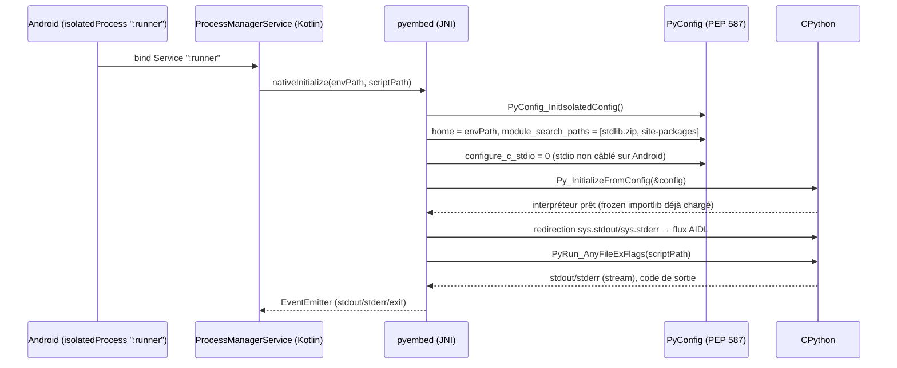

###### [REQ-FUNC-0076] 3.2 Pseudo-code d'initialisation (C++, `pyembed`)

```cpp
// pyembed/init.cpp — initialisation d'un interpréteur pour un run isolé
PyStatus PyEmbedInit(const RunConfig& cfg) {
    PyConfig config;
    PyConfig_InitIsolatedConfig(&config);   // pas de site-packages système, pas d'env vars hôte

    config.home = towstr(cfg.envHome);                       // PYTHONHOME du venv projet
    config.write_bytecode = 0;                                // stdlib zip déjà pré-compilée en lecture seule
    config.buffered_stdio = 0;
    config.configure_c_stdio = 0;                              // Android : pas de tty, on redirige nous-mêmes

    PyWideStringList_Append(&config.module_search_paths, towstr(cfg.stdlibZipPath));
    PyWideStringList_Append(&config.module_search_paths, towstr(cfg.envSitePackages));
    config.module_search_paths_set = 1;

    PyStatus status = Py_InitializeFromConfig(&config);
    PyConfig_Clear(&config);
    if (PyStatus_Exception(status)) return status;

    InstallStdRedirect(cfg.aidlChannel);   // remplace sys.stdout / sys.stderr par un objet fichier
                                            // qui pousse chaque write() sur le canal AIDL (§8.1 archi)
    return PyStatus_Ok();
}
```

###### [REQ-FUNC-0077] 3.3 Optimisations de démarrage

| Technique | Effet | Détail |
|---|---|---|
| **`.pyc` pré-compilés niveau 2 (`-OO`)** dans le zip | Élimine la compilation à la volée + supprime docstrings/assertions | Le zip ne contient que les `.pyc`, jamais les `.py` sources (sauf mode debug pédagogique où les sources restent lisibles) |
| **Hash-based `.pyc` non vérifiés (PEP 552, mode `UNCHECKED_HASH`)** | Élimine le `stat()` de vérification de fraîcheur à chaque import | Sûr car le zip stdlib est en lecture seule et versionné avec le binaire — jamais modifié à chaud |
| **`-S` (skip `site`) + `sitecustomize` minimal explicite** | Évite le scan de tous les `.pth` et chemins candidats que fait le module `site` | Réduit les appels `stat()`/`access()` coûteux sur le stockage FUSE-émulé d'Android |
| **Pool d'interprètes pré-chauffés** | Amortit le coût de `Py_InitializeFromConfig` (~50–150 ms mesurés selon device) | Voir §3.4 |
| **`gc.freeze()` juste après le warm-up** | Sort les objets créés à l'init (modules stdlib) du scanning du GC cyclique | Voir §4.5 |

###### [REQ-FUNC-0078] 3.4 Pool d'interprètes pré-chauffés

Contrainte : chaque exécution utilisateur doit rester dans un process Android isolé (`isolatedProcess`, ADR-1) pour la sûreté — on ne peut donc pas simplement garder un unique interpréteur partagé entre exécutions successives sans perdre l'isolation en cas de crash. La solution retenue est un **pool de process de secours pré-spawnés**, chacun avec CPython déjà initialisé et bloqué en attente d'un appel AIDL, consommé puis recyclé en tâche de fond par un nouveau process chaud :

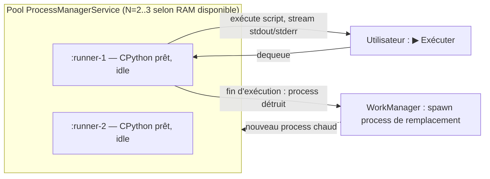

Le nombre de process chauds maintenus est adaptatif : réduit à 1 (voire 0) sous pression mémoire (`onTrimMemory`, §4.4), remonté à 2–3 quand l'app est au premier plan et la RAM disponible confortable.

---

##### [REQ-FUNC-0079] 4. Gestion mémoire

###### [REQ-FUNC-0080] 4.1 Hiérarchie de l'allocateur

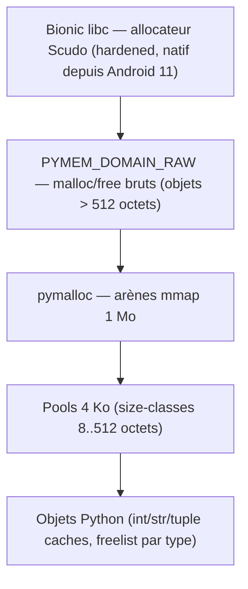

**Décision :** ne pas réimplémenter d'allocateur custom. Depuis Android 11, Bionic utilise **Scudo** (allocateur durci) par défaut — `pymalloc` en hérite gratuitement via ses appels `malloc()`/`free()` sous-jacents pour les blocs hors arène. Aucune action requise, juste une vérification en CI que le lien se fait bien contre la libc Bionic standard (pas de libc alternative statique qui contournerait Scudo).

###### [REQ-FUNC-0081] 4.2 Libération d'arènes

Depuis CPython 3.9 (bpo-40072), les arènes `pymalloc` vides sont rendues à l'OS au lieu d'être conservées indéfiniment — comportement dont PyStudio dépend directement étant donné les contraintes mémoire mobiles. Ce point est un critère de non-régression explicite lors du choix de version (§13, ADR-2) : toute version candidate doit conserver ce comportement (c'est le cas pour 3.11 à 3.14).

###### [REQ-FUNC-0082] 4.3 Réglage du GC cyclique

| Paramètre | Défaut CPython | Recommandation PyStudio | Justification |
|---|---|---|---|
| `gc.get_threshold()` gen0 | 700 | **mesuré par profil, pas de valeur figée a priori** | Baisser réduit la mémoire de pointe mais augmente les réveils CPU (donc la conso batterie) ; à trancher par `tracemalloc`/`gc.get_stats()` sur des scripts représentatifs (§10) |
| `gc.freeze()` | non appelé | **appelé juste après le warm-up de l'interpréteur** (§3.4) | Les objets stdlib créés à l'init sont immuables pour la durée de vie du process — les exclure du scan cyclique réduit le coût de chaque collecte sans risque de fuite (ils ne référencent pas le code utilisateur) |

###### [REQ-FUNC-0083] 4.4 Réaction à la pression mémoire Android

```kotlin
// ProcessManagerService.kt
override fun onTrimMemory(level: Int) {
    when {
        level >= ComponentCallbacks2.TRIM_MEMORY_RUNNING_CRITICAL -> {
            warmPool.shrinkTo(0)                  // détruit tous les process chauds
            nativeRuntimeBridge.forceGcCollect()   // gc.collect() + libération d'arènes
        }
        level >= ComponentCallbacks2.TRIM_MEMORY_RUNNING_LOW -> {
            warmPool.shrinkTo(1)
        }
    }
}
```

```python
# côté runtime, exposé via RuntimeBridge.forceGcCollect()
import gc

def force_gc_collect() -> None:
    gc.collect()
    # NB : Python n'expose pas nativement un équivalent malloc_trim() portable ;
    # l'effet réel de la libération d'arènes dépend de la version de Bionic/Scudo.
    # À valider empiriquement par device sous test avant d'en faire une garantie documentée.
```

###### [REQ-FUNC-0084] 4.5 Budgets mémoire indicatifs

| Composant | Budget cible |
|---|---|
| Interpréteur CPython au repos (post warm-up, stdlib importée) | < 15 Mo par process |
| Pool de 2 process chauds | < 35 Mo cumulés |
| Cache wheels sur disque | 500 Mo par défaut, configurable (LRU, §8) |

---

##### [REQ-FUNC-0085] 5. Système d'import

###### [REQ-FUNC-0086] 5.1 Ordre d'assemblage de `sys.path`


###### [REQ-FUNC-0087] 5.2 `sys.platform` et marqueurs d'environnement

Depuis la PEP 738, CPython rapporte correctement `sys.platform == "android"` (au lieu de `"linux"` comme le faisaient les portages communautaires historiques). Les marqueurs d'environnement PEP 508 (`sys_platform == "android"`) fonctionnent donc **nativement**, sans hack de résolveur — ceci corrige une hypothèse initialement envisagée (nécessité d'un marqueur custom) qui n'est plus fondée depuis le support officiel.

###### [REQ-FUNC-0088] 5.3 Chargement des modules d'extension (`.so`) — options et décision

Le chargeur standard de CPython (`ExtensionFileLoader`) appelle `dlopen()` directement sur le chemin du `.so`. Sur Android, cela pose une contrainte réelle : le système impose des restrictions sur l'exécution de code depuis certains chemins (namespaces de linker, politiques SELinux variables selon OEM). Trois options :

| Option | Mécanisme | Robustesse | Flexibilité |
|---|---|---|---|
| **A — Tout embarquer dans `nativeLibraryDir` à la compilation de l'APK** | Modules d'extension stdlib et packages "cœur" livrés dans l'APK, chargés par le linker Android standard | ✅ Maximale (chemin officiellement supporté par le système) | ❌ Impossible d'ajouter un module après l'installation (marketplace, `pip install` dynamique) |
| **B — `dlopen()` direct depuis le stockage privé de l'app pour les `.so` installés dynamiquement** | Extraction du wheel vers `files/`, `dlopen()` par le chargeur Python standard | ⚠️ Fonctionne sur AOSP stock, mais dépend de politiques SELinux/OEM non garanties sur toutes les ROMs | ✅ Totale |
| **C — Chargement via `System.load(cheminAbsolu)` côté Kotlin/JNI, puis enregistrement manuel du module Python** | Le chemin officiellement documenté par Android pour charger une bibliothèque native depuis le stockage privé de l'app (mécanisme déjà utilisé par Chaquopy et les plugins Flutter natifs) ; le module Python est ensuite exposé via `PyModule_Create` appelé manuellement plutôt que de laisser `ExtensionFileLoader` faire son propre `dlopen()` | ✅ Chemin officiellement sanctionné, indépendant des variations OEM | ✅ Totale |

**Décision : Option C** comme mécanisme par défaut pour tout module installé après le build de l'APK (marketplace, wheels téléchargés) ; **Option A** conservée pour les extensions stdlib figées au moment du build (`_ssl`, `_hashlib`, `_sqlite3`...). L'option B est explicitement écartée en production (fragilité inter-OEM non acceptable) mais peut rester un mode de secours documenté pour le développement local.

###### [REQ-FUNC-0089] 5.4 Pseudo-code du chargeur custom

```python
# pystudio_runtime/_extension_loader.py
import sys, importlib.abc, importlib.util

class PyStudioExtensionLoader(importlib.abc.Loader):
    """Charge un module d'extension .so via System.load() (option C, §5.3)
    plutôt que via ExtensionFileLoader.dlopen() natif de CPython."""

    def __init__(self, name: str, so_path: str):
        self._name = name
        self._so_path = so_path

    def create_module(self, spec):
        handle = _native_bridge.system_load(self._so_path)   # appel JNI → System.load()
        return _native_bridge.pymodule_create_from_handle(handle, self._name)

    def exec_module(self, module):
        pass  # l'initialisation a déjà eu lieu côté natif (PyInit_<module>)


class PyStudioExtensionFinder(importlib.abc.MetaPathFinder):
    def find_spec(self, fullname, path, target=None):
        so_path = _registry.resolve_installed_extension(fullname)   # PackageManagerService
        if so_path is None:
            return None
        return importlib.util.spec_from_loader(
            fullname, PyStudioExtensionLoader(fullname, so_path)
        )

sys.meta_path.insert(0, PyStudioExtensionFinder())
```

---

##### [REQ-FUNC-0090] 6. Gestion des packages (résolveur de dépendances)

###### [REQ-FUNC-0091] 6.1 Entrées du résolveur

- `requirements.txt` ou table `[project.dependencies]` d'un `pyproject.toml`
- Contraintes de version PEP 440 (`numpy>=1.26,<2.0`)
- Marqueurs d'environnement PEP 508 (désormais fiables sur Android, §5.2)
- Verrou existant (`pystudio.lock`), pour une résolution incrémentale plutôt que complète à chaque `pip install`

###### [REQ-FUNC-0092] 6.2 Algorithme (PubGrub simplifié)

Le résolveur suit le même principe que celui de `pip` (≥ 20.3) et de `Poetry` — un solveur de type **PubGrub** (satisfaction de contraintes avec explications d'incompatibilité), plutôt qu'un algorithme glouton naïf de première version compatible, qui échoue silencieusement ou boucle sur des cas de dépendances diamant.

```python
# package_resolver/solve.py — squelette de l'algorithme (simplifié)
def resolve(root_requirements: list[Requirement]) -> dict[str, Version]:
    partial_solution: dict[str, Version] = {}
    incompatibilities: list[Incompatibility] = derive_initial(root_requirements)

    while True:
        term = next_undecided_term(partial_solution, incompatibilities)
        if term is None:
            return partial_solution   # solution complète trouvée

        candidate = select_candidate_version(term, registry_index=WHEEL_INDEX)
        if candidate is None:
            conflict = build_conflict_clause(term, incompatibilities)
            incompatibilities.append(conflict)
            if is_root_conflict(conflict):
                raise ResolutionImpossible(explain(incompatibilities))
            backtrack(partial_solution, conflict)
            continue

        partial_solution[term.package] = candidate
        incompatibilities += derive_from_metadata(candidate)  # dépendances transitives
```

###### [REQ-FUNC-0093] 6.3 Ordre des index consultés

1. Verrou local (`pystudio.lock`) si présent et compatible avec les contraintes déclarées → résolution instantanée, aucun réseau
2. Registre PyPI officiel (wheels `android_<api>_<abi>`, §7)
3. Registre privé PyStudio (packages non encore portés officiellement, §7.3)
4. Compilation on-device via la toolchain Clang/CMake (dernier recours, coûteux, §7 architecture)

---

##### [REQ-FUNC-0094] 7. Wheels — format, tags, pipeline

###### [REQ-FUNC-0095] 7.1 Tag standard (PEP 738)

```
{distribution}-{version}-{python_tag}-{abi_tag}-android_{api_level}_{abi}.whl

# Exemple :
numpy-1.26.4-cp313-cp313-android_21_arm64_v8a.whl
```

Ce tag est **officiellement reconnu par PyPI** depuis l'acceptation de la PEP 738 — corrige l'hypothèse initiale d'un tag privé nécessitant un index maison exclusif. Un `android_<N>_<abi>` donné est compatible avec toute app ciblant l'API level `N` ou plus ancien (même logique que les tags macOS versionnés).

###### [REQ-FUNC-0096] 7.2 Pipeline de build des wheels

**Outil retenu : `cibuildwheel`**, qui supporte officiellement la cross-compilation Android depuis l'acceptation de la PEP 738 — pas de `crossenv` ni de faux-Python maison à maintenir.

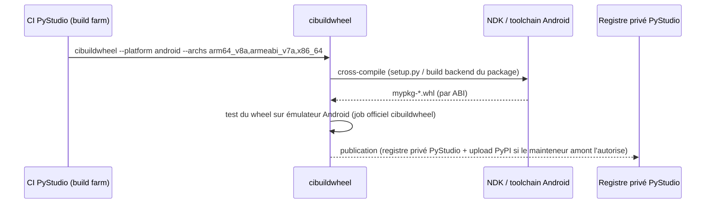

###### [REQ-FUNC-0097] 7.3 Priorité de résolution (corrige le modèle hybride de l'architecture §5.3)

| Rang | Source | Condition |
|---|---|---|
| 1 | **PyPI officiel**, wheel `android_<api>_<abi>` publié par le mainteneur amont | Le package a été porté à l'écosystème Android (couverture croissante mais encore partielle mi-2026, en particulier pour les piles numériques lourdes) |
| 2 | **Registre privé PyStudio** (miroir CDN + cache local différé, §12.3 architecture) | Package non encore porté officiellement — wheel construit et maintenu par l'équipe PyStudio via le pipeline §7.2 |
| 3 | **Compilation on-device** (Clang/CMake embarqués, §7 architecture) | Dernier recours : package pur source sans wheel disponible ni sur PyPI ni sur le registre privé |

Cette hiérarchie doit remplacer la formulation actuelle de l'architecture (« registre cloud prébuilt en chemin primaire ») par une consultation PyPI-first, le registre privé devenant un filet de sécurité plutôt que la source par défaut.

---

##### [REQ-FUNC-0098] 8. Cache multi-niveaux

| Niveau | Contenu | Invalidation |
|---|---|---|
| **Bytecode** | `.pyc` par fichier utilisateur (`__pycache__`) | Hash-based **checked** (PEP 552) pour le code utilisateur (peut changer), **unchecked** pour la stdlib zip en lecture seule (§3.3) |
| **Wheels** | `files/cache/wheels/<sha256>.whl` | LRU, budget configurable (500 Mo par défaut, §4.5) |
| **Build natif** | `ccache`-équivalent, partagé entre builds C++ utilisateur et extensions Python natives (toutes deux compilées par le même Clang, cf. architecture §11) | Clé = hash des sources + flags de compilation |
| **Index LSP** | SQLite (hérité de l'architecture §3.3) | Invalidé par `fs.changed` (bus d'événements, architecture §9.2) |

---

##### [REQ-FUNC-0099] 9. Multithreading & concurrence

###### [REQ-FUNC-0100] 9.1 Contrainte de base : pas de `fork()` fiable

Android interdit l'usage classique de `fork()` post-Zygote (hérité, confirmé). Le `multiprocessing` standard de CPython (mode `fork`) est donc **inutilisable tel quel**.

###### [REQ-FUNC-0101] 9.2 État du GIL selon version cible (2026)

| Build | Statut | Coût | Pertinence PyStudio |
|---|---|---|---|
| **CPython standard (GIL actif)** | Stable, tout l'écosystème compatible | — | ✅ Défaut recommandé |
| **CPython free-threaded (`3.14t`, PEP 703 + PEP 779)** | Officiellement supporté depuis 3.14 (phase II), **pas encore le build par défaut** | Surcoût mono-thread ~5–10 %, mémoire +15–20 % (en-tête `PyObject` élargi) ; nombreuses extensions C tierces se réactivent en mode GIL faute d'opt-in explicite | ⚠️ Trop tôt pour un défaut mobile : le surcoût mémoire est significatif sur devices contraints et la couverture des wheels ML (numpy/PyTorch mobile/TFLite) en variante libre de GIL n'est pas encore garantie. À proposer en **toolchain optionnelle avancée**, jamais par défaut |

###### [REQ-FUNC-0102] 9.3 Sous-interpréteurs — `concurrent.interpreters` (PEP 734, stable en 3.14)

Alternative légère à un vrai `multiprocessing` : depuis la 3.14, le module stdlib **`concurrent.interpreters`** expose au niveau Python le mécanisme de sous-interpréteurs à GIL isolé par interpréteur (bâti sur la PEP 684, dont l'infrastructure C existait déjà en 3.12). Chaque sous-interpréteur a son propre GIL, sa propre table de modules, son propre état — isolation mémoire proche d'un process, sans le coût d'IPC ni le besoin d'`isolatedProcess` séparé.

```python
# Exemple d'usage pour un calcul CPU-bound pur Python (pas d'extension C incompatible)
from concurrent.interpreters import create, InterpreterPoolExecutor

with InterpreterPoolExecutor(max_workers=4) as pool:
    results = pool.map(compute_heavy_chunk, chunks)
```

**Positionnement dans PyStudio :** utile pour paralléliser un notebook Jupyter multi-cellules ou un script pur Python CPU-bound **au sein d'un même process isolé**, sans dupliquer tout l'overhead d'un nouveau `isolatedProcess` Android. Ne remplace pas l'isolation `isolatedProcess` pour l'exécution du code utilisateur principal (celle-ci reste motivée par la sûreté face aux crashs natifs, pas seulement la performance).

###### [REQ-FUNC-0103] 9.4 Recommandation pragmatique — ne pas sur-investir dans le multiprocessing

Pour l'essentiel des charges mobiles réelles (NumPy, OpenCV, TFLite), le GIL n'est **pas** le facteur limitant : ces bibliothèques relâchent le GIL pendant leurs sections C/C++ lourdes, et le vrai parallélisme est déjà obtenu par leurs pools de threads natifs internes. Un `multiprocessing` complet au-dessus d'AIDL n'est justifié que pour du code CPU-bound **pur Python**, cas plus rare dans un IDE à vocation d'apprentissage/scripting. **Décision : ne pas construire de couche `multiprocessing`-sur-AIDL en phase 1** ; offrir `threading` + logique C qui relâche le GIL comme outil principal, et `concurrent.interpreters` (§9.3) comme option légère pour le pur Python parallèle. Un vrai backend multiprocessing par service Android reste en roadmap (backlog), à ne construire que si un besoin concret et mesuré apparaît.

---

##### [REQ-FUNC-0104] 10. Profilage

###### [REQ-FUNC-0105] 10.1 Panorama des outils

| Outil | Nature | Overhead | Cas d'usage |
|---|---|---|---|
| `cProfile` | Déterministe, par fonction | Modéré | Profil général d'un script |
| `tracemalloc` | Traçage des allocations | Faible-modéré | Fuites mémoire, pics d'allocation |
| **`sys.monitoring` (PEP 669, stable 3.12+)** | API de monitoring bas-overhead (remplace `sys.settrace`, ~10× plus lent) | Faible | Step-debugging et profil ligne-par-ligne dans le panneau Debug de l'IDE |
| **Perf trampoline natif (`sys.activate_stack_trampoline("perf")`, 3.12+)** | Expose les frames Python à un profileur natif via des trampolines assembleur | Faible | Corrélation Python ↔ natif (cf. ci-dessous) |

###### [REQ-FUNC-0106] 10.2 Flamegraphs mixtes Python + natif via `simpleperf`

Point de valeur fort pour un IDE qui traite Python et C/C++ à parité (principe directeur de l'architecture) : `simpleperf` (outil de profiling NDK, équivalent Android de `perf`) peut, combiné au trampoline CPython, produire un flamegraph unique mêlant les frames Python et les frames C/C++ natives — précieux pour diagnostiquer une extension pybind11 lente sans changer d'outil entre les deux langages.

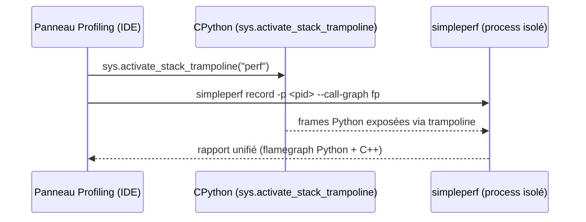

###### [REQ-FUNC-0107] 10.3 Point d'attention UX (croise la spécification UI/UX)

Aucun écran « Profiling » n'apparaît dans les neuf écrans de la spécification UI/UX. Recommandation : une sous-vue du panneau Débogage (onglet supplémentaire à côté de Variables/Pile d'appels/Points d'arrêt) plutôt qu'un dixième écran dédié, pour ne pas alourdir l'Activity Bar. À trancher avec le propriétaire UX.

---

##### [REQ-FUNC-0108] 11. Optimisations natives

###### [REQ-FUNC-0109] 11.1 ARM64

`arm64-v8a` est la cible principale (triple `aarch64-linux-android21`, hérité). Options de `configure` pertinentes pour le build CPython lui-même (fait en CI, jamais sur device) :

```
--enable-optimizations       # active la passe PGO du build officiel (voir §11.4)
--with-lto                   # LTO au niveau du linker final (voir §11.3)
--with-computed-gotos        # dispatch du bytecode par goto calculé — gain mesuré ~15-20%,
                              # activé par défaut sur Clang/GCC modernes, à vérifier explicitement en CI
--disable-test-modules       # réduit la taille du binaire embarqué (modules de test stdlib exclus)
```

###### [REQ-FUNC-0110] 11.2 NEON

**Nuance importante :** NEON n'accélère pas directement la boucle de dispatch de l'interpréteur CPython (non vectorisable par nature — un bytecode à la fois). Son bénéfice réel se situe à deux niveaux :

1. **Indirect, via le compilateur** : auto-vectorisation par Clang de certaines routines C internes (comparaisons mémoire, opérations Unicode/UTF-8, `siphash`).
2. **Direct, dans la pile numérique** : c'est là que NEON compte vraiment — OpenBLAS (scikit-learn, NumPy) et OpenCV embarquent des noyaux NEON explicites, déjà couverts par l'architecture (§5.3 archi). Ne pas présenter NEON comme un levier d'optimisation de l'interpréteur lui-même serait trompeur.

###### [REQ-FUNC-0111] 11.3 LTO

Le LTO s'applique à **deux niveaux distincts, à ne pas confondre** :

| Niveau | Où | Quand | Réglage |
|---|---|---|---|
| CPython lui-même + stdlib C-extensions | Build farm CI (cross-compilation) | À chaque release du binaire embarqué | **ThinLTO** (via `lld`) — parallélisable, plus rapide qu'un LTO monolithique classique sur une build farm |
| Projets utilisateur (C/C++, extensions Python natives) | On-device, via CMake (architecture §7.3) | Uniquement en configuration **Release/export**, jamais en Debug | Opt-in par preset CMake (`CMAKE_INTERPROCEDURAL_OPTIMIZATION ON`) — coût CPU/thermique on-device trop élevé pour l'activer par défaut en Debug |

###### [REQ-FUNC-0112] 11.4 PGO / AutoFDO

Le PGO classique (`--enable-optimizations` de CPython) suppose de **faire tourner un binaire instrumenté sur l'architecture cible pendant le build** — problème classique de cross-compilation (le host CI est x86_64, la cible est ARM64). Trois options :

| Option | Mécanisme | Trade-off |
|---|---|---|
| **A — QEMU user-mode** | Exécuter le binaire ARM64 instrumenté sous émulation sur le host CI x86_64 | Automatisable, aucune infra device, mais profil moins fidèle (émulation) et plus lent |
| **B — Ferme de devices/émulateurs ARM64 réels** | Faire tourner l'instrumentation sur du matériel réel | Profil fidèle, mais coût d'infrastructure CI non négligeable |
| **C — AutoFDO / BOLT à partir de traces `simpleperf` de production (opt-in)** | Post-optimisation du binaire lié à partir d'échantillons collectés en usage réel (télémétrie opt-in déjà prévue par l'architecture, `TelemetryService`) | Élimine le problème d'œuf-et-poule de la cross-compilation, s'améliore en continu avec l'usage réel, respecte le principe offline/opt-in ; nécessite l'intégration de l'outillage BOLT dans le pipeline de release |

**Décision : A pour établir une base PGO dès la première release (rapide à mettre en place, aucune dépendance à des données de terrain) ; C en amélioration continue post-lancement**, une fois la télémétrie opt-in en place — cohérent avec le principe « offline-first / opt-in » de l'architecture. L'option B reste une option de secours si la fidélité de A s'avère insuffisante en pratique.

###### [REQ-FUNC-0113] 11.5 Vulkan

Vulkan n'est pas consommé directement par du code Python : il intervient comme **délégué de calcul GPU pour l'inférence ML**, au niveau du module natif `mlruntime` (architecture §6.3), exposé côté Python via le binding pybind11 du runtime ML.

```python
# Exposition côté Python (via mlruntime, binding pybind11)
interpreter = mlruntime.Interpreter(model_path="model.tflite", delegate="gpu")  # délégué GPU = Vulkan sous LiteRT
output = interpreter.run(input_tensor)
```

Point d'attention : la disponibilité et la performance du délégué GPU varient selon le vendeur/pilote — une vérification de capacité au runtime avec repli automatique (GPU → XNNPACK CPU) est nécessaire, cohérent avec le principe de dégradation gracieuse déjà présent dans l'architecture (§16, risques).

###### [REQ-FUNC-0114] 11.6 NNAPI — statut révisé (déprécié depuis Android 15)

**Correction majeure par rapport à la demande initiale :** NNAPI est officiellement **déprécié depuis Android 15**. Google recommande la migration vers **TensorFlow Lite / LiteRT en Google Play Services**, avec délégué GPU (Vulkan, §11.5) ou délégués spécifiques au vendeur (par ex. Qualcomm QNN) pour l'accélération NPU — LiteRT en Play Services ne fournit d'ailleurs **plus de délégué NNAPI du tout**.

| Chemin | Statut | Recommandation |
|---|---|---|
| **NNAPI direct** | Déprécié Android 15+, maintenu pour compatibilité descendante uniquement | ❌ À ne pas utiliser comme chemin principal pour du nouveau code |
| **LiteRT GPU delegate (Vulkan)** | Chemin recommandé actuel | ✅ Délégué par défaut pour l'accélération matérielle |
| **Délégués vendeur (Qualcomm QNN, etc.)** | Support NPU spécifique par SoC, en expansion | ✅ Optionnel, sélection automatique si le SoC est reconnu |
| **NNAPI en repli legacy** | Pour les devices anciens (API < 30) où le délégué GPU serait absent ou peu performant | ⚠️ Acceptable uniquement en repli explicite, jamais comme chemin par défaut |

**Décision :** la chaîne de délégués de `mlruntime` doit essayer, dans l'ordre : **GPU (Vulkan/LiteRT) → délégué vendeur si détecté → NNAPI (repli legacy, devices anciens) → XNNPACK CPU (repli final garanti)**. Ce point doit être remonté comme correction à la matrice d'optimisation initialement demandée par le produit, qui plaçait NNAPI au même niveau que Vulkan sans tenir compte de sa dépréciation.

---

##### [REQ-FUNC-0115] 12. APIs internes (contrats)

###### [REQ-FUNC-0116] 12.1 Extension de `RuntimeBridge` (TypeScript, complète l'archi §13.1)

```typescript
export interface PyStudioRuntimeBridge {
  run(scriptPath: string, options?: RunOptions): Promise<RunResult>;
  onOutput(callback: (chunk: OutputChunk) => void): () => void;
  poolStatus(): Promise<WarmPoolStatus>;          // nouveau
  forceGcCollect(envId: string): Promise<void>;    // nouveau — cf. §4.4
}

export interface RunOptions {
  pythonVersion: '3.13' | '3.14' | '3.14t';   // '3.14t' = build libre de GIL, opt-in explicite (§9.2)
  useWarmPool?: boolean;                        // défaut true
}

export interface WarmPoolStatus {
  warmProcesses: number;
  targetSize: number;
  lastShrinkReason?: 'memory_pressure' | 'background' | null;
}
```

###### [REQ-FUNC-0117] 12.2 Interface Kotlin du résolveur de packages

```kotlin
interface PackageResolverService {
    suspend fun resolve(requirements: List<Requirement>, lockFile: LockFile?): ResolvedSet
    suspend fun fetchWheel(pkg: ResolvedPackage): WheelArtifact   // ordre §7.3 : PyPI → registre privé → build local
}

data class ResolvedPackage(
    val name: String,
    val version: String,
    val source: WheelSource   // PYPI_OFFICIAL | PYSTUDIO_REGISTRY | LOCAL_BUILD
)
```

###### [REQ-FUNC-0118] 12.3 Table récapitulative (étend la table §13.4 de l'architecture)

| Module JS | Service natif associé | Nouveauté vs architecture |
|---|---|---|
| `RuntimeBridge` | `pyembed` + `ProcessManagerService` (pool chaud) | Ajout `poolStatus`, `forceGcCollect`, sélection de version incluant `3.14t` |
| `PackageBridge` *(nouveau)* | `PackageResolverService` | Résolveur PubGrub, ordre de source PyPI-first |
| `ProfilingBridge` *(nouveau)* | `sys.monitoring` + pont `simpleperf` | Flamegraphs mixtes Python/natif (§10.2) |

---

##### [REQ-FUNC-0119] 13. Risques & ADRs runtime

###### [REQ-FUNC-0120] ADR-2 : Versions CPython cibles — révision de 3.11/3.12 vers 3.13/3.14

**Contexte :** la spécification d'architecture fixait initialement 3.11/3.12 comme versions supportées. Or le support officiel Android (PEP 738, Tier 3) démarre à la **3.13**. Utiliser 3.11/3.12 signifierait s'appuyer sur des patches communautaires non upstreamés (approche historique Chaquopy/BeeWare) plutôt que sur l'outillage officiel — cela va à l'encontre du principe directeur « s'appuyer sur l'amont » (§0).

**Décision :** cibler **3.13 (baseline stable, LTS de facto de l'écosystème Android/PEP 738)** et **3.14 (dernière version, `concurrent.interpreters` stable, JIT expérimental, free-threading phase II)**. Le build `3.14t` (libre de GIL) est proposé en toolchain **opt-in avancée**, jamais par défaut (§9.2). 3.11/3.12 ne sont **pas** retenues, y compris en compatibilité descendante, sauf demande explicite motivée par un cas d'usage précis.

**Conséquence :** à répercuter sur la spécification d'architecture (§5.2 « 3.11 ou 3.12 ») et sur l'écran Paramètres de la spécification UI/UX (§4.9, sélecteur de version Python).

###### [REQ-FUNC-0121] Autres risques

| Risque | Impact | Mitigation |
|---|---|---|
| Couverture encore partielle des wheels Android officiels pour les packages numériques lourds (PyTorch, TensorFlow complet) | Moyen | Registre privé PyStudio en filet de sécurité (§7.3, rang 2) |
| Variabilité SELinux/OEM pour le chargement dynamique de `.so` (option B, §5.3, écartée en prod) | Faible (déjà mitigé par le choix de l'option C) | Tests CTS/VTS-like sur matrice d'OEM représentative avant chaque release |
| Immaturité de l'écosystème d'extensions compatibles free-threading | Moyen (si `3.14t` était poussé par défaut, ce qui n'est pas la décision retenue) | Statut opt-in strict (§9.2), aucune promesse de compatibilité universelle |
| Fiabilité empirique de la libération mémoire post-`gc.collect()` sur Bionic/Scudo | Faible | À valider par device réel avant d'en faire une garantie documentée (§4.4) |

---

##### [REQ-FUNC-0122] 14. Glossaire

| Terme | Définition |
|---|---|
| **PEP 738** | Proposition d'évolution CPython ayant fait d'Android une plateforme Tier 3 officiellement supportée (à partir de la 3.13) |
| **PEP 703 / 779** | Rendent le GIL optionnel (« free-threaded » build), passé en support officiel (phase II) avec la 3.14 |
| **PEP 734** | Ajoute le module stdlib `concurrent.interpreters` (sous-interpréteurs à GIL isolé), stable en 3.14 |
| **PEP 669** | `sys.monitoring` — API de traçage/profilage bas-overhead, stable depuis 3.12 |
| **PEP 552** | `.pyc` basés sur un hash du source plutôt que sur le mtime, pour un cache reproductible |
| **Tier 3** | Niveau de support CPython : la plateforme fait partie de l'amont officiel mais sans garantie de CI systématique à chaque commit |
| **Sous-interpréteur** | Instance CPython isolée (modules, état, GIL propre) au sein d'un même process OS |
| **AutoFDO / BOLT** | Optimisation post-lien d'un binaire à partir d'échantillons de profilage réels, sans nécessiter de build instrumenté séparé |
| **LiteRT** | Nom actuel de TensorFlow Lite, runtime d'inférence on-device recommandé par Google en remplacement du chemin NNAPI |

---

*Fin de la spécification.*


##### [REQ-FUNC-0123] Support Graphique et Redirection Matplotlib

La bibliothèque **Matplotlib** est officiellement supportée. PyStudio Mobile intègre un backend graphique natif qui remplace le backend par défaut de Matplotlib lors de l'initialisation du runtime.

**Comportement de `plt.show()` :**
Lorsqu'un utilisateur exécute le code suivant :
```python
import matplotlib.pyplot as plt
plt.show()
```
1. L'appel à `plt.show()` est intercepté par le backend personnalisé du Runtime Python.
2. Les instructions de tracé sont sérialisées et transmises à la couche d'interface native.
3. Cette action déclenche l'ouverture automatique d'une **vue graphique intégrée** (panneau de visualisation) au sein de PyStudio Mobile.
4. L'exécution du script n'est pas bloquée inutilement et le rendu est géré de façon asynchrone par l'interface Android.

#### [REQ-FUNC-0124] PyStudio Mobile — Spécification du Gestionnaire Python (« py »)

**Type de document :** Spécification technique — Gestionnaire de packages & environnements Python
**Auteur :** Package Manager Architect
**Version :** 1.0
**Date :** 12 juillet 2026
**Portée :** Commandes `py install / uninstall / update / build / search / list` — résolution des dépendances, gestion des versions, environnements, cache, sécurité
**Dépend de :**
- `PyStudio_Mobile_Architecture_Specification.md` (§6-7 pyembed/cxxtoolchain, §13 API internes)
- `PyStudio_Mobile_Python_Runtime_Specification.md` (§6 résolveur PubGrub, §7 wheels, §12 PackageResolverService, ADR-2 CPython 3.13/3.14)
- `PyStudio_Mobile_Android_Package_Builder_Specification.md` (pipeline de build local, cache multi-niveaux L1-L4, taxonomie d'erreurs)
- `PyStudio_Mobile_Package_Registry_Specification.md` (API Simple Repository, signature registre, recherche)

---

##### [REQ-FUNC-0125] Table des matières

0. Principes directeurs
1. Résumé exécutif
2. Architecture globale
3. Commandes
4. Résolution des dépendances
5. Gestion des versions
6. Environnements
7. Cache
8. Sécurité
9. Formats de fichiers
10. API interne (contrats)
11. Gestion des erreurs
12. Diagrammes de séquence
13. Performances
14. Risques & mitigations
15. Glossaire

---

##### [REQ-FUNC-0126] 0. Principes directeurs

| Principe | Description | Implication technique |
|---|---|---|
| **Une seule source de vérité par projet** | Chaque projet a un fichier de verrouillage (`pystudio.lock`) qui fixe exactement ce qui est installé | Toute commande qui modifie l'état passe par une réécriture atomique du lockfile |
| **Reproductibilité stricte** | `py install` sur un projet verrouillé doit produire un environnement identique sur n'importe quel appareil | Résolution déterministe (hash des entrées, tri stable), pas de résolution "au mieux" silencieuse |
| **Hors-ligne d'abord** | Le gestionnaire doit fonctionner sans réseau si le lockfile et le cache le permettent | Toute commande réseau a un mode dégradé explicite (`--offline`), jamais un échec silencieux |
| **Environnements isolés par défaut** | Deux projets ne partagent jamais un environnement sauf demande explicite | Un environnement = un répertoire dédié, un identifiant, un `site-packages` propre |
| **Sécurité non contournable** | Aucune installation sans vérification de signature ou consentement explicite et journalisé | Cohérent avec Registry §6 et Package Builder §8.3 |
| **Transparence des actions** | Toute commande modifiant l'état affiche un plan avant exécution (diff des packages) | `py install`/`update` affichent un résumé "à ajouter / à mettre à jour / à supprimer" avant confirmation (sauf `--yes`) |
| **Compatibilité d'écosystème** | Le vocabulaire et les formats doivent rester proches de `pip`/`poetry`/`uv` pour ne pas dérouter les développeurs Python | Lockfile inspiré de PEP 665/751, tags de wheel `android_<api>_<abi>` (runtime §1) |

---

##### [REQ-FUNC-0127] 1. Résumé exécutif

**`py`** est le gestionnaire de packages et d'environnements Python intégré à PyStudio Mobile, exposé à la fois comme commande dans le terminal intégré de l'IDE et comme service backend consommé par l'UI (Package Manager, Marketplace). Il orchestre six commandes (`install`, `uninstall`, `update`, `build`, `search`, `list`) au-dessus des composants déjà spécifiés : le résolveur PubGrub et le `PackageResolverService` (runtime §6, §12.2), le pipeline de construction locale (Package Builder), et l'API du registre cloud (Registry). Sa valeur ajoutée propre est la couche de **résolution de dépendances**, de **gestion de versions et d'environnements multiples**, de **cache unifié**, et de **sécurité à l'installation** — le tout pensé pour un contexte mobile où le réseau est intermittent et les ressources (CPU, batterie, stockage) sont contraintes.

`py` s'appuie sur un fichier de configuration déclaratif par projet (`pystudio.toml`, dépendances voulues) et un fichier de verrouillage dérivé (`pystudio.lock`, résolution exacte figée) — modèle éprouvé (Poetry/uv/Cargo) adapté aux contraintes Android : wheels taguées par ABI/API level, résolution qui doit tenir compte de l'appareil cible réel, et environnements légers car le stockage mobile reste précieux.

---

##### [REQ-FUNC-0128] 2. Architecture globale

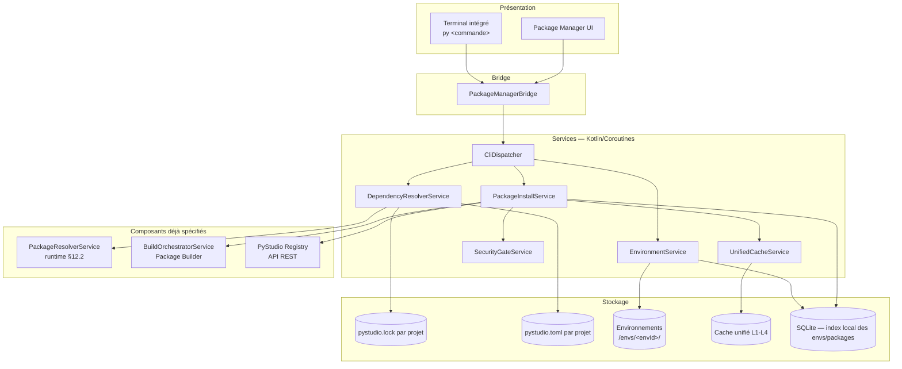

###### [REQ-FUNC-0129] 2.1 Positionnement

`py` est une couche d'orchestration **au-dessus** du `PackageResolverService` (déjà défini côté runtime pour la résolution brute PubGrub) et du `BuildOrchestratorService` (Package Builder, pour la construction locale quand aucune wheel précompilée n'est disponible). Elle ajoute ce qui manquait : la notion de **projet** (`pystudio.toml`/`pystudio.lock`), d'**environnement nommé**, de **cache unifié inter-projets**, et une **interface de commande** cohérente pour l'utilisateur final.

---

##### [REQ-FUNC-0130] 3. Commandes

###### [REQ-FUNC-0131] 3.1 `py install`

```
py install [package[==version]] [--dev] [--env <nom>] [--offline] [--yes]
```

| Cas | Comportement |
|---|---|
| Sans argument | Installe l'intégralité des dépendances figées dans `pystudio.lock` dans l'environnement actif |
| Avec `package` | Ajoute la dépendance à `pystudio.toml`, ré-exécute la résolution (§4), met à jour `pystudio.lock`, installe |
| `--dev` | Ajoute en dépendance de développement (non incluse dans un build `release`) |
| `--env <nom>` | Cible un environnement spécifique plutôt que celui actif (§6) |
| `--offline` | N'utilise que le cache local (L1-L4) et le registre local ; échoue explicitement (`NET_REQUIRED_OFFLINE`) si une donnée manquante nécessiterait le réseau |
| `--yes` | Saute la confirmation du plan d'installation |

###### [REQ-FUNC-0132] 3.2 `py uninstall`

```
py uninstall <package> [--env <nom>] [--yes]
```

Retire le package de `pystudio.toml`, recalcule si des dépendances transitives deviennent orphelines (plus référencées par aucun autre package), propose leur suppression, purge l'entrée du `site-packages` de l'environnement et invalidate le cache d'import.

###### [REQ-FUNC-0133] 3.3 `py update`

```
py update [package] [--env <nom>] [--dry-run]
```

| Cas | Comportement |
|---|---|
| Sans argument | Recalcule la résolution pour toutes les dépendances en respectant les contraintes de `pystudio.toml`, propose les mises à jour compatibles (respect SemVer/PEP 440 des bornes déclarées) |
| Avec `package` | Cible la mise à jour d'un seul package (et ses dépendants si nécessaire) |
| `--dry-run` | Affiche le plan de mise à jour sans l'appliquer ni modifier le lockfile |

###### [REQ-FUNC-0134] 3.4 `py build`

```
py build [--target <package-ou-projet>] [--abi <abi,...>] [--mode debug|release|profile]
```

Délègue directement au **Android Package Builder** (`packageBuild`, cf. sa spécification §12.1) pour compiler des extensions natives locales et produire une wheel installable dans l'environnement courant. `py build` sans `--target` construit le projet courant lui-même (cas d'un projet C/C++ ou d'une extension Python native en développement).

###### [REQ-FUNC-0135] 3.5 `py search`

```
py search <mot-clé> [--abi <abi>] [--category <cat>] [--json]
```

Interroge l'API de recherche du **Registry** (§7 de sa spécification) ; en mode `--offline`, se limite à une recherche par préfixe dans le cache local des métadonnées déjà résolues (moins riche mais fonctionnelle sans réseau).

###### [REQ-FUNC-0136] 3.6 `py list`

```
py list [--env <nom>] [--outdated] [--tree] [--json]
```

| Option | Comportement |
|---|---|
| (aucune) | Liste à plat les packages installés dans l'environnement actif (nom, version, taille) |
| `--outdated` | N'affiche que les packages ayant une version plus récente disponible (nécessite réseau ou cache récent) |
| `--tree` | Affiche l'arbre de dépendances (qui dépend de quoi) |
| `--json` | Sortie machine-lisible pour l'UI Package Manager |

###### [REQ-FUNC-0137] 3.7 Table récapitulative

| Commande | Réseau requis | Modifie le lockfile | Modifie l'environnement |
|---|---|---|---|
| `install` | Non si tout est en cache | Oui (si nouvelle dépendance) | Oui |
| `uninstall` | Non | Oui | Oui |
| `update` | Oui (sauf `--offline`, limité) | Oui | Oui |
| `build` | Non (sources déjà locales) | Non (sauf si `--install` implicite) | Oui si installé après build |
| `search` | Oui (sauf `--offline`, dégradé) | Non | Non |
| `list` | Non (sauf `--outdated`) | Non | Non |

---

##### [REQ-FUNC-0138] 4. Résolution des dépendances

###### [REQ-FUNC-0139] 4.1 Réutilisation du résolveur existant

`DependencyResolverService` **n'implémente pas** son propre solveur : il construit le problème de contraintes à partir de `pystudio.toml` et le délègue au `PackageResolverService` (résolveur **PubGrub**, déjà défini côté runtime §6) qui gère la résolution des versions selon PEP 440. La valeur ajoutée de `py` à ce niveau est la **construction du contexte de résolution** propre à Android :

- Filtrage des candidats par **ABI de l'appareil cible** (ou ABI(s) demandée(s) explicitement via `--abi` pour un `py build` multi-cible).
- Filtrage par **niveau d'API Android** minimal du projet.
- Filtrage par **version Python cible** du projet (3.13/3.14/3.14t, runtime ADR-2).
- Prise en compte des **dépendances déjà satisfaites** par le cache local (préférence de résolution vers ce qui est déjà téléchargé, pour limiter le réseau, sans violer les contraintes de version).

###### [REQ-FUNC-0140] 4.2 Algorithme (vue d'ensemble)

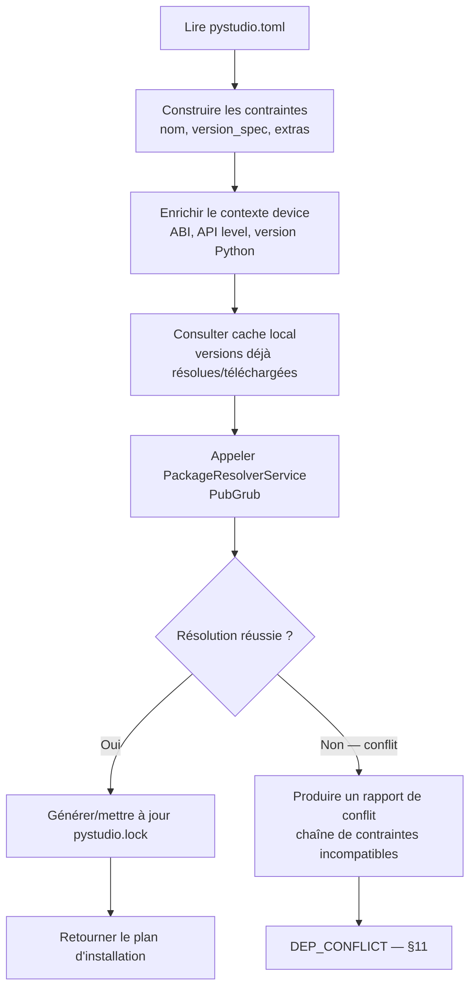

###### [REQ-FUNC-0141] 4.3 Ordre de résolution des sources d'un package (hérité, runtime §7)

`PyPI officiel (android_*_* tag) → PyStudio Registry → Build local (py build)`

`py install` applique cet ordre automatiquement ; `py build` court-circuite intentionnellement vers le build local, y compris si une wheel précompilée existe (cas du développement actif d'une extension).

###### [REQ-FUNC-0142] 4.4 Rapport de conflit

En cas d'échec de résolution, le rapport (inspiré du format lisible de PubGrub/Cargo) explique **pourquoin** aucune solution n'existe, sous forme de chaîne d'incompatibilités, plutôt qu'un simple message "no matching version" :

```
Résolution impossible :
  - projet requiert numpy>=2.0,<3.0
  - opencv-android 4.10.0 requiert numpy>=1.26,<2.0
  - projet requiert opencv-android==4.10.0
  → aucune version de numpy ne satisfait simultanément ces contraintes
Suggestion : assouplir la contrainte sur numpy ou choisir opencv-android<4.10.0
```

###### [REQ-FUNC-0143] 4.5 Extras et dépendances optionnelles

`pystudio.toml` supporte des groupes de dépendances nommés (`[dependencies]`, `[dev-dependencies]`, `[extras.ml]`) ; la résolution est effectuée **par environnement actif** (§6), un environnement ne matérialisant que les groupes qu'il a explicitement activés.

---

##### [REQ-FUNC-0144] 5. Gestion des versions

###### [REQ-FUNC-0145] 5.1 Contraintes supportées (PEP 440)

| Syntaxe | Exemple | Sémantique |
|---|---|---|
| Exacte | `==4.10.0` | Version unique |
| Compatible | `~=4.10` | `>=4.10, ==4.*` |
| Plage | `>=1.26,<2.0` | Intervalle |
| Exclusion | `!=4.9.1` | Exclut une version précise (ex. régression connue) |
| Non bornée | (aucune) | Dernière version compatible avec le reste du graphe |

###### [REQ-FUNC-0146] 5.2 Versions Python cibles du projet

Déclarées dans `pystudio.toml` (`requires-python = ">=3.13"`), cohérent avec l'ADR-2 du runtime. `py install`/`build` refusent une wheel dont le tag Python (`cp313`, `cp314`, `cp314t`) est incompatible, avec message explicite plutôt qu'un échec d'import différé au runtime.

###### [REQ-FUNC-0147] 5.3 Retrait logique (yank) côté Registry

Si une version consommée est marquée `yanked` côté **Registry** (§3.2 de sa spécification, PEP 592), `py update` ne la propose plus par défaut pour une nouvelle résolution, mais `py install` sur un lockfile existant qui la référence déjà continue de fonctionner (reproductibilité, §0) avec un avertissement non-bloquant.

###### [REQ-FUNC-0148] 5.4 Gestion de version de Python elle-même

`py` ne gère pas l'installation de multiples interpréteurs CPython arbitraires comme `pyenv` : le runtime embarqué (3.13/3.14/3.14t) est fourni par l'application PyStudio elle-même (runtime §0). `pystudio.toml` déclare simplement la contrainte de compatibilité, vérifiée à la résolution.

---

##### [REQ-FUNC-0149] 6. Environnements

###### [REQ-FUNC-0150] 6.1 Modèle

Un **environnement** (`env`) est l'équivalent mobile d'un `venv` : un répertoire isolé contenant un `site-packages` propre, un `pystudio.lock` associé, et une référence à une version de runtime Python. Un projet peut avoir plusieurs environnements (ex. `default`, `test`, `experimental-py314t`).

```
/data/user/0/com.pystudio/files/envs/<envId>/
├── env.json                  # métadonnées : version Python, ABI, date de création
├── site-packages/
│   └── <package>/...
├── pystudio.lock             # copie figée liée à cet environnement
└── bin/                      # scripts d'entrée si applicable
```

###### [REQ-FUNC-0151] 6.2 Commandes de gestion d'environnement (extension naturelle, non listée en §3 mais nécessaire)

```
py env create <nom> [--python 3.13|3.14|3.14t]
py env list
py env use <nom>
py env delete <nom>
```

###### [REQ-FUNC-0152] 6.3 Isolation

Chaque environnement a son propre `site-packages` — aucun package n'est partagé par défaut entre environnements, **mais** le cache de wheels (§7, niveau L3) est **partagé globalement** : créer un second environnement avec des dépendances qui se recoupent ne nécessite aucun re-téléchargement, seulement une ré-extraction locale (rapide, opération disque uniquement).

###### [REQ-FUNC-0153] 6.4 Environnement actif

Un seul environnement est « actif » par fenêtre de projet ouverte dans l'IDE (cohérent avec le modèle « un environnement par projet » par défaut décrit dans le runtime). Le terminal intégré affiche l'environnement actif dans son prompt (`(default) $`).

###### [REQ-FUNC-0154] 6.5 Résolution par environnement vs par projet

`pystudio.toml` est **par projet** (déclaratif, une seule vérité sur les dépendances voulues) ; `pystudio.lock` peut différer légèrement **par environnement** si des groupes optionnels (§4.5) sont activés différemment (ex. `test` active `[dev-dependencies]`, `default` ne les active pas).

---

##### [REQ-FUNC-0155] 7. Cache

###### [REQ-FUNC-0156] 7.1 Réutilisation du cache multi-niveaux existant

`py` **réutilise intégralement** le cache L1-L4 déjà défini dans la spécification du Package Builder (sources / objets de compilation / wheels résolues / artefacts signés) via `UnifiedCacheService` — il n'introduit pas un cache parallèle mais une **vue supplémentaire** orientée "packages installés" :

| Niveau ajouté par `py` | Contenu | Portée |
|---|---|---|
| **L5 — Résolutions** | Résultats de résolution PubGrub déjà calculés (clé = hash du `pystudio.toml` + contexte device) | Par projet, invalidé si `pystudio.toml` change |
| **L6 — Extractions d'environnement** | `site-packages` déjà matérialisés pour une combinaison exacte de packages | Partagé entre environnements ayant un lockfile identique (hash du lockfile) |

###### [REQ-FUNC-0157] 7.2 Bénéfice pour `py install`

Un `py install` sur un projet déjà résolu et déjà présent en cache L3 (wheels) et L6 (extraction) devient une opération **quasi instantanée et hors-ligne** : aucun appel réseau, aucune résolution PubGrub recalculée, simple lien/copie de `site-packages` déjà matérialisé.

###### [REQ-FUNC-0158] 7.3 Politique d'éviction

Alignée sur Package Builder §10.3 : L5/L6 sont évincés en priorité (peu coûteux à recalculer/réextraire) avant L3 (wheels, coûteuses à re-télécharger/reconstruire), jamais avant L1 (sources brutes, les moins critiques).

###### [REQ-FUNC-0159] 7.4 Commande de maintenance

```
py cache info                 # tailles par niveau, statistiques de hit
py cache clean [--level L1-L6] [--older-than <durée>]
```

---

##### [REQ-FUNC-0160] 8. Sécurité

###### [REQ-FUNC-0161] 8.1 Vérification à l'installation

Toute installation (`py install`, `py update`) applique la chaîne de vérification déjà définie côté Registry/Package Builder avant d'écrire quoi que ce soit dans `site-packages` :

1. Vérification du hash SHA-256 de l'artefact contre le `pystudio.lock` (si le package y figure déjà) ou contre la réponse de résolution (nouvelle dépendance).
2. Vérification de la signature du registre (obligatoire, non contournable — Registry §6.1).
3. Vérification de la signature développeur si présente (affichage du niveau de confiance dans `py install --verbose`, jamais bloquant en soi).
4. Pour une wheel construite localement (`py build`), vérification que l'artefact provient bien du `BuildOrchestratorService` de la session courante (référence de `buildId` dans le manifeste, Package Builder §7.3).

###### [REQ-FUNC-0162] 8.2 Politique de confiance configurable

| Réglage (`pystudio.toml [security]`) | Défaut | Effet |
|---|---|---|
| `allow_unsigned_local_build` | `true` | Les artefacts de `py build` sans signature développeur restent installables (usage local, cohérent Package Builder §8.1) |
| `allow_unsigned_registry` | `false`, non modifiable | La signature registre est **toujours** obligatoire, ce réglage n'existe pas comme option désactivable — seule une action explicite hors `pystudio.toml` (flag `--i-understand-the-risk`, journalisée) permet un contournement en développement pur |
| `require_developer_signature` | `false` | Si activé, refuse l'installation de tout package du Registry sans signature développeur en plus de celle du registre |

###### [REQ-FUNC-0163] 8.3 Sandbox d'installation

L'extraction d'une wheel (y compris exécution de scripts `.dist-info` légitimes comme entry points) se fait dans un répertoire temporaire avant `rename()` atomique (Package Builder §9.2) — aucune exécution de code arbitraire pendant l'installation elle-même ; `py` n'exécute jamais de `setup.py` arbitraire (modèle wheel uniquement, pas de build à l'installation côté device, cohérent avec le choix wheels-first du runtime).

###### [REQ-FUNC-0164] 8.4 Détection d'anomalies locales

`py list --outdated` et `py update` signalent si un package installé ne correspond plus au hash attendu par le `pystudio.lock` (corruption ou modification manuelle du `site-packages`), avec proposition de réparation (`py install --repair`).

###### [REQ-FUNC-0165] 8.5 Journalisation

Toute opération de sécurité significative (contournement de signature, résolution avec avertissement de version yankée, réparation d'environnement corrompu) est journalisée dans un fichier d'audit local (`pystudio-security.log`), consultable mais non modifiable par l'utilisateur depuis l'IDE.

---

##### [REQ-FUNC-0166] 9. Formats de fichiers

###### [REQ-FUNC-0167] 9.1 `pystudio.toml` (déclaratif, édité par l'utilisateur)

```toml
[project]
name = "mon-app-vision"
requires-python = ">=3.13"

[dependencies]
opencv-android = "~=4.10"
numpy = ">=1.26,<2.0"

[dev-dependencies]
pytest = "*"

[extras.ml]
torch-mobile = ">=2.4"

[security]
allow_unsigned_local_build = true
require_developer_signature = false
```

###### [REQ-FUNC-0168] 9.2 `pystudio.lock` (généré, ne pas éditer manuellement)

```json
{
  "lock_version": 1,
  "generated_at": "2026-07-12T08:00:00Z",
  "python_target": "3.13",
  "resolution_context": {
    "abi": "arm64-v8a",
    "api_level": 34
  },
  "packages": [
    {
      "name": "opencv-android",
      "version": "4.10.0",
      "source": "pystudio_registry",
      "sha256": "e3b0c4...",
      "wheel_tag": "cp313-cp313-android_21_arm64_v8a",
      "signature_verified": true,
      "dependencies": ["numpy"]
    },
    {
      "name": "numpy",
      "version": "1.26.4",
      "source": "pypi_official",
      "sha256": "af12ab...",
      "wheel_tag": "cp313-cp313-android_21_arm64_v8a",
      "signature_verified": true,
      "dependencies": []
    }
  ]
}
```

###### [REQ-FUNC-0169] 9.3 `env.json` (par environnement)

```json
{
  "env_id": "default",
  "python_version": "3.13.2",
  "target_abi": "arm64-v8a",
  "created_at": "2026-06-01T09:00:00Z",
  "lockfile_hash": "b7e2..."
}
```

---

##### [REQ-FUNC-0170] 10. API interne (contrats)

###### [REQ-FUNC-0171] 10.1 Bridge TypeScript

```typescript
export interface PyStudioPackageManagerBridge {
  runCommand(command: PyCommand): Promise<PyCommandResult>;
  onCommandOutput(callback: (chunk: PyOutputChunk) => void): () => void;

  createEnv(options: CreateEnvOptions): Promise<EnvInfo>;
  listEnvs(): Promise<EnvInfo[]>;
  useEnv(envId: string): Promise<void>;
  deleteEnv(envId: string): Promise<void>;
}

export type PyCommand =
  | { type: 'install'; package?: string; dev?: boolean; env?: string; offline?: boolean; yes?: boolean }
  | { type: 'uninstall'; package: string; env?: string; yes?: boolean }
  | { type: 'update'; package?: string; env?: string; dryRun?: boolean }
  | { type: 'build'; target?: string; abis?: Abi[]; mode?: 'debug' | 'release' | 'profile' }
  | { type: 'search'; query: string; abi?: Abi; category?: string }
  | { type: 'list'; env?: string; outdated?: boolean; tree?: boolean };

export interface PyCommandResult {
  success: boolean;
  plan?: InstallPlan;             // résumé avant confirmation (install/update/uninstall)
  packages?: PackageSummary[];    // pour list/search
  lockfileChanged: boolean;
  errorCode?: PyErrorCode;        // cf. §11
}

export interface InstallPlan {
  toAdd: PackageSummary[];
  toUpdate: { from: PackageSummary; to: PackageSummary }[];
  toRemove: PackageSummary[];
}

export interface PackageSummary {
  name: string;
  version: string;
  source: 'pypi_official' | 'pystudio_registry' | 'local_build';
  sizeBytes: number;
  signatureVerified: boolean;
}

export interface EnvInfo {
  envId: string;
  pythonVersion: string;
  targetAbi: Abi;
  active: boolean;
}
```

###### [REQ-FUNC-0172] 10.2 Interface Kotlin (services)

```kotlin
interface DependencyResolverService {
    suspend fun resolve(projectToml: PystudioToml, context: ResolutionContext): ResolutionOutcome
}

sealed class ResolutionOutcome {
    data class Success(val lockfile: PystudioLock) : ResolutionOutcome()
    data class Conflict(val report: ConflictReport) : ResolutionOutcome()
}

interface EnvironmentService {
    suspend fun create(name: String, pythonVersion: PythonVersion, abi: Abi): EnvInfo
    suspend fun activate(envId: String)
    suspend fun delete(envId: String)
    suspend fun list(): List<EnvInfo>
}

interface PackageInstallService {
    suspend fun install(plan: InstallPlan, envId: String): InstallOutcome
    suspend fun uninstall(packageName: String, envId: String): InstallOutcome
}

interface SecurityGateService {
    suspend fun verify(artifact: ArtifactRef): VerificationResult
}
```

###### [REQ-FUNC-0173] 10.3 Table récapitulative des délégations

| Commande `py` | Service `py` | Délègue à |
|---|---|---|
| `install` (résolution) | `DependencyResolverService` | `PackageResolverService` (runtime §12.2) |
| `install` (téléchargement) | `PackageInstallService` | API Registry (`GET /simple/{name}/`) + CDN |
| `build` | `PackageInstallService` | `BuildOrchestratorService.packageBuild` (Package Builder §12.1) |
| `install`/`update` (vérification) | `SecurityGateService` | Vérification signature (Registry §6, Package Builder §8) |
| `search` | — | API Registry `GET /v1/search` |

---

##### [REQ-FUNC-0174] 11. Gestion des erreurs

###### [REQ-FUNC-0175] 11.1 Taxonomie des codes d'erreur

| Code | Commande | Cause typique | Recoverable |
|---|---|---|---|
| `DEP_CONFLICT` | install/update | Contraintes de version incompatibles (§4.4) | Oui — assouplir contraintes, rapport fourni |
| `DEP_NOT_FOUND` | install/search | Package inexistant sur aucune source | Non |
| `NET_REQUIRED_OFFLINE` | install/update/search | Donnée manquante en cache alors que `--offline` est actif | Oui — relancer sans `--offline` |
| `SIG_VERIFICATION_FAILED` | install/update | Signature registre invalide (Registry §6, Package Builder §8.3) | Non (sauf override explicite journalisé) |
| `HASH_MISMATCH` | install | Corruption réseau ou cache | Oui — invalider cache, re-télécharger |
| `ENV_NOT_FOUND` | toutes (avec `--env`) | Environnement inexistant | Oui — `py env create` |
| `ENV_LOCK_CORRUPTED` | install/list | `pystudio.lock` illisible ou incohérent avec `env.json` | Oui — `py install --repair` |
| `BUILD_FAILED` | build | Échec du pipeline Package Builder (codes détaillés dans sa propre spec §13.2) | Dépend du sous-code remonté |
| `WHEEL_TAG_INCOMPATIBLE` | install | Wheel trouvée mais ABI/version Python incompatible avec le projet | Non — changer de version ou de contrainte |
| `YANKED_VERSION_WARNING` | install/update | Version verrouillée marquée `yanked` côté Registry | Oui (avertissement non-bloquant) |

###### [REQ-FUNC-0176] 11.2 Principe de remontée

Toute erreur provenant d'un service délégué (`PackageResolverService`, `BuildOrchestratorService`, API Registry) est **traduite** en un code `Py*`/réutilisé tel quel si déjà suffisamment explicite (ex. les codes du Package Builder §13.2 remontent directement pour `py build`), afin que l'utilisateur du terminal voie toujours un message actionnable plutôt qu'une erreur réseau ou un code de sortie de processus brut.

---

##### [REQ-FUNC-0177] 12. Diagrammes de séquence

###### [REQ-FUNC-0178] 12.1 `py install <package>` — cas nominal avec cache partiel

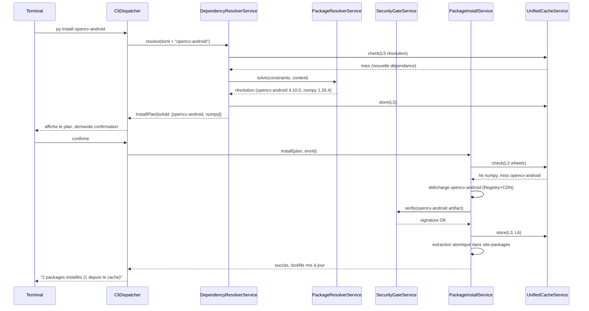

###### [REQ-FUNC-0179] 12.2 `py build` puis installation locale

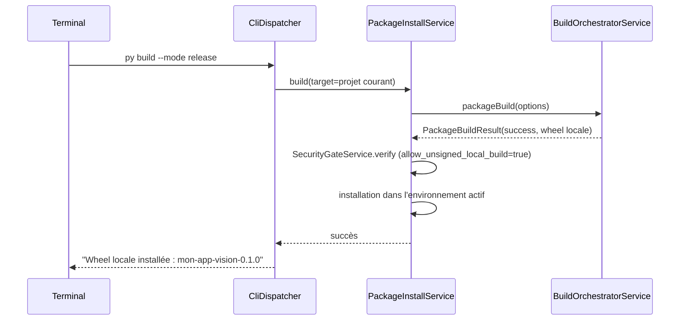

###### [REQ-FUNC-0180] 12.3 Conflit de résolution

```mermaid
sequenceDiagram
    participant U as Terminal
    participant RES as DependencyResolverService
    participant PRS as PackageResolverService

    U->>RES: py update
    RES->>PRS: solve(nouvelles bornes)
    PRS-->>RES: échec — incompatibilité numpy
    RES-->>U: DEP_CONFLICT + rapport lisible (§4.4)
    Note over U: Ajuste pystudio.toml
    U->>RES: py update (relance)
    RES->>PRS: solve(bornes ajustées)
    PRS-->>RES: succès
    RES-->>U: plan de mise à jour affiché
```

---

##### [REQ-FUNC-0181] 13. Performances

| Levier | Détail |
|---|---|
| **Résolution incrémentale** | Le cache L5 évite de relancer PubGrub si `pystudio.toml` et le contexte device n'ont pas changé depuis la dernière résolution réussie |
| **Extraction partagée (L6)** | Deux environnements avec un lockfile identique (hash) partagent l'extraction physique via lien dur/copie-sur-écriture plutôt qu'une duplication complète sur disque |
| **Téléchargements parallèles** | `py install` télécharge les artefacts manquants en parallèle borné (cohérent avec le throttling thermique/réseau déjà défini côté Package Builder) |
| **Feedback progressif** | `onCommandOutput` diffuse la progression en flux (résolution → téléchargement → vérification → extraction) plutôt qu'un blocage silencieux jusqu'au résultat final |
| **`list`/`search` en local** | Répond depuis l'index SQLite local sans réseau dans le cas commun (liste des packages installés), réseau uniquement pour `--outdated`/recherche registre |

---

##### [REQ-FUNC-0182] 14. Risques & mitigations

| Risque | Impact | Mitigation |
|---|---|---|
| Résolution PubGrub lente sur un graphe de dépendances profond (ex. stack ML complète) | Moyen | Cache L5 agressif, réutilisation des résolutions précédentes comme point de départ heuristique |
| Divergence entre `pystudio.lock` et l'état réel du `site-packages` (édition manuelle, crash pendant install) | Moyen | Vérification de hash à `py list`/`install --repair` (§8.4) |
| Explosion du nombre d'environnements sur un device au stockage limité | Faible-moyen | Cache L6 partagé par hash de lockfile, commande `py env delete` mise en avant dans l'UI Package Manager |
| Confusion utilisateur entre `py install <pkg>` (Registry/PyPI) et `py build` (local) pour un même nom de package en développement actif | Faible | Message explicite si une version locale plus récente que celle du Registry est détectée, proposant `py build` comme alternative |
| Dépendance à la disponibilité du Registry pour `py search`/`update` | Faible (device reste fonctionnel offline-first, cf. Registry §0) | Mode `--offline` explicite, cache de métadonnées de recherche best-effort |

---

##### [REQ-FUNC-0183] 15. Glossaire

| Terme | Définition |
|---|---|
| **`pystudio.toml`** | Fichier déclaratif des dépendances voulues par un projet (édité par l'utilisateur) |
| **`pystudio.lock`** | Fichier généré figeant la résolution exacte (versions, hash, source) — reproductibilité |
| **PubGrub** | Algorithme de résolution de dépendances utilisé par le `PackageResolverService` (runtime §6) |
| **Environnement (`env`)** | Espace isolé (site-packages propre) associé à un projet, équivalent mobile d'un `venv` |
| **Extra** | Groupe de dépendances optionnelles activable sélectivement par environnement |
| **Yank** | Retrait logique d'une version côté Registry (PEP 592) — n'empêche pas les lockfiles existants de continuer à fonctionner |
| **L5/L6** | Niveaux de cache ajoutés par `py` au-dessus du cache L1-L4 du Package Builder (résolutions et extractions d'environnement) |

---

*Fin de la spécification.*

#### [REQ-FUNC-0184] PyStudio Mobile — Spécification du Registre de Packages (« PyStudio Registry »)

**Type de document :** Spécification technique — Service cloud (registre de packages type PyPI)
**Auteur :** Cloud Architect
**Version :** 1.0
**Date :** 12 juillet 2026
**Portée :** Publication, authentification, signature, recherche, CDN, réplication, monitoring — service cloud opt-in complétant le registre privé PyStudio déjà référencé dans l'architecture (§2, §12) et le runtime (§7, ordre de résolution PyPI → registre privé → build local)
**Dépend de :** `PyStudio_Mobile_Architecture_Specification.md` (§12 Scalabilité & Marketplace, §13 APIs internes), `PyStudio_Mobile_Python_Runtime_Specification.md` (§7 Wheels, tags `android_<api>_<abi>`), `PyStudio_Mobile_Android_Package_Builder_Specification.md` (§7-8 construction et signature des wheels, produites côté device puis publiées ici)

---

##### [REQ-FUNC-0185] Table des matières

0. Principes directeurs
1. Résumé exécutif
2. Architecture globale
3. Modèle de données
4. Publication de packages
5. Authentification & autorisation
6. Signature & chaîne de confiance
7. Recherche
8. CDN & distribution
9. Réplication & haute disponibilité
10. Monitoring & observabilité
11. API REST
12. Sécurité transverse
13. Scalabilité & capacité
14. Risques techniques & mitigations
15. Glossaire

---

##### [REQ-FUNC-0186] 0. Principes directeurs

| Principe | Description | Implication technique |
|---|---|---|
| **Complément, jamais dépendance bloquante** | Le device fonctionne offline-first (architecture §0) ; le registre est un service opt-in qui enrichit l'expérience sans jamais être un point de blocage | Cache local complet côté device (Package Builder §10), dégradation gracieuse si le registre est inaccessible |
| **Confiance vérifiable, pas supposée** | Aucun artefact n'est installable sans preuve cryptographique de provenance | Signature obligatoire à la publication, vérification obligatoire à l'installation (cohérent Package Builder §8.3) |
| **PyPI-compatible en surface, spécialisé en profondeur** | Les développeurs et outils existants (`pip`, `cibuildwheel`) doivent pouvoir interagir avec des concepts familiers | API respectant autant que possible le **Simple Repository API** (PEP 503/691) en plus de l'API REST enrichie propre à PyStudio |
| **Séparation lecture/écriture** | Les opérations de lecture (recherche, téléchargement) dominent largement en volume sur l'écriture (publication) | Architecture read-heavy : CDN agressif en lecture, chemin d'écriture isolé et plus strict |
| **Multi-région par défaut** | Les utilisateurs mobiles sont globalement distribués et sensibles à la latence et à la donnée mobile | Réplication multi-région, CDN en périphérie, réplicas en lecture proches de l'utilisateur |
| **Observabilité de bout en bout** | Un incident de disponibilité du registre affecte directement l'expérience offline-first du device (résolution de dépendances) | Monitoring corrélé publication → CDN → device, alerting proactif avant dégradation perçue |
| **Idempotence des publications** | Republier un même artefact (même hash) ne doit jamais créer d'état incohérent | Clé de version immuable, `PUT`-like idempotent, rejet explicite des re-publications avec contenu différent sous même version |

---

##### [REQ-FUNC-0187] 1. Résumé exécutif

**PyStudio Registry** est le service cloud opt-in qui héberge, indexe, sert et sécurise les packages (wheels Android taguées `android_<api>_<abi>`, plugins, thèmes, templates) que le **Android Package Builder** produit côté device et que l'IDE consomme via le **Marketplace**. Il joue le rôle de « registre privé PyStudio » déjà positionné en second rang après PyPI officiel dans l'ordre de résolution du runtime (`PYPI_OFFICIAL → PYSTUDIO_REGISTRY → LOCAL_BUILD`), et sert également l'ensemble non-Python du marketplace (plugins JS sandboxés, thèmes, templates de projet).

L'architecture retenue est un service multi-région composé de : une **API de publication** (chemin d'écriture strict, authentification forte, signature obligatoire), un **index de métadonnées** compatible Simple Repository API (PEP 503/691) pour l'interopérabilité `pip`, un **moteur de recherche** dédié pour l'expérience Marketplace de l'IDE, un **CDN** en périphérie pour la distribution des artefacts binaires, une **réplication multi-région** avec promotion de leader automatisée, et une chaîne complète de **monitoring** couvrant la publication, la propagation CDN et la consommation côté device. Le tout est conçu pour un ratio lecture/écriture très asymétrique typique d'un registre de packages (des millions de téléchargements pour quelques milliers de publications quotidiennes).

---

##### [REQ-FUNC-0188] 2. Architecture globale

```mermaid
graph TB
    subgraph CLIENT["Clients"]
        DEV[CLI développeur<br/>pystudio-publish]
        IDE[PyStudio Mobile<br/>Marketplace UI]
        PIP[pip / cibuildwheel<br/>compat Simple API]
    end

    subgraph EDGE["Périphérie — Multi-région"]
        CDN[CDN — artefacts binaires<br/>wheels, .so, plugins]
        WAF[WAF / API Gateway]
    end

    subgraph API["Couche API — Région primaire + réplicas"]
        PUB[Publish Service]
        AUTH[Auth Service]
        SIGN[Signing Service]
        SEARCH[Search Service]
        META[Metadata API<br/>Simple Repository API]
        MON[Monitoring Gateway]
    end

    subgraph ASYNC["Traitement asynchrone"]
        Q[Message Queue<br/>Kafka/Pub-Sub]
        SCAN[Static Analysis Worker]
        INDEX[Indexer Worker]
        REPL[Replication Worker]
    end

    subgraph DATA["Données"]
        PG[(PostgreSQL primaire<br/>métadonnées, comptes)]
        PGR[(Réplicas PostgreSQL<br/>lecture, multi-région)]
        ES[(Moteur de recherche<br/>Elasticsearch/OpenSearch)]
        OBJ[(Object Storage<br/>S3-compatible, artefacts)]
        KMS[(KMS / HSM<br/>clés de signature)]
        TS[(Time-series DB<br/>métriques)]
    end

    DEV -->|publish| WAF --> AUTH --> PUB
    IDE -->|search/install| WAF --> SEARCH
    IDE -->|download| CDN
    PIP -->|GET simple index| WAF --> META
    PIP -->|download| CDN

    PUB --> SIGN --> KMS
    PUB --> PG
    PUB --> OBJ
    PUB --> Q

    Q --> SCAN --> PG
    Q --> INDEX --> ES
    Q --> REPL --> PGR
    Q --> REPL --> OBJ

    OBJ --> CDN
    META --> PG
    META --> PGR
    SEARCH --> ES

    PUB -.-> MON
    AUTH -.-> MON
    CDN -.-> MON
    MON --> TS
```

###### [REQ-FUNC-0189] 2.1 Vue par couches

| # | Couche | Technologies indicatives | Rôle |
|---|---|---|---|
| 1 | Périphérie | CDN multi-CDN (origin shield), WAF/API Gateway | Distribution des artefacts, protection DDoS/abus |
| 2 | API | Services stateless conteneurisés (Kubernetes), autoscaling horizontal | Publication, auth, signature, recherche, métadonnées |
| 3 | Asynchrone | Message queue durable, workers autoscalés | Scan de sécurité, indexation, réplication différée |
| 4 | Données | PostgreSQL (source de vérité), Object Storage (binaires), moteur de recherche, KMS/HSM, TSDB | Persistance, recherche, secrets, métriques |

###### [REQ-FUNC-0190] 2.2 Positionnement vis-à-vis des specs existantes

Le Registry est le service qui **reçoit** les artefacts produits par l'étape 4 (construction wheel) et 5 (signature locale optionnelle) du Package Builder, et qui **ré-signe ou co-signe** avec la clé de confiance du registre avant publication effective (§6). Côté device, le `PackageResolverService` (runtime §12.2) et le `PackageBridge` interrogent ce service en second rang après PyPI officiel — aucune modification de leurs contrats n'est nécessaire, le Registry expose une API compatible.

---

##### [REQ-FUNC-0191] 3. Modèle de données

###### [REQ-FUNC-0192] 3.1 Schéma relationnel (PostgreSQL — source de vérité)

```mermaid
erDiagram
    ACCOUNT ||--o{ API_TOKEN : possede
    ACCOUNT ||--o{ PACKAGE : maintient
    ACCOUNT ||--o{ SIGNING_KEY : possede
    PACKAGE ||--o{ PACKAGE_VERSION : a
    PACKAGE ||--o{ PACKAGE_MAINTAINER : a
    ACCOUNT ||--o{ PACKAGE_MAINTAINER : est
    PACKAGE_VERSION ||--o{ ARTIFACT : contient
    ARTIFACT ||--|| SIGNATURE : a
    ARTIFACT ||--o{ SCAN_RESULT : a
    PACKAGE_VERSION ||--o{ DEPENDENCY : declare
    PACKAGE ||--o{ DOWNLOAD_EVENT : genere
    ACCOUNT ||--o{ AUDIT_LOG : genere

    ACCOUNT {
        uuid id PK
        string username UK
        string email UK
        string password_hash
        boolean mfa_enabled
        timestamp created_at
        string status
    }
    API_TOKEN {
        uuid id PK
        uuid account_id FK
        string token_hash
        string scope
        string package_scope_pattern
        timestamp expires_at
        timestamp last_used_at
        boolean revoked
    }
    PACKAGE {
        uuid id PK
        string name UK
        string description
        string homepage_url
        string license
        string category
        boolean is_native
        timestamp created_at
    }
    PACKAGE_MAINTAINER {
        uuid package_id FK
        uuid account_id FK
        string role
    }
    PACKAGE_VERSION {
        uuid id PK
        uuid package_id FK
        string version
        string python_version_tag
        string status
        text changelog
        timestamp published_at
        boolean yanked
        string yanked_reason
    }
    ARTIFACT {
        uuid id PK
        uuid version_id FK
        string filename
        string artifact_type
        string abi_tag
        string api_level
        bigint size_bytes
        string sha256
        string storage_path
        timestamp uploaded_at
    }
    SIGNATURE {
        uuid id PK
        uuid artifact_id FK
        uuid signing_key_id FK
        text signature_blob
        string algorithm
        timestamp signed_at
        boolean verified
    }
    SIGNING_KEY {
        uuid id PK
        uuid account_id FK
        string public_key_fingerprint
        string kms_key_ref
        timestamp created_at
        timestamp revoked_at
    }
    SCAN_RESULT {
        uuid id PK
        uuid artifact_id FK
        string scan_type
        string status
        jsonb findings
        timestamp scanned_at
    }
    DEPENDENCY {
        uuid id PK
        uuid version_id FK
        string dependency_name
        string version_spec
    }
    DOWNLOAD_EVENT {
        uuid id PK
        uuid package_id FK
        uuid version_id FK
        string region
        string abi
        timestamp occurred_at
    }
    AUDIT_LOG {
        uuid id PK
        uuid account_id FK
        string action
        jsonb metadata
        timestamp occurred_at
    }
```

###### [REQ-FUNC-0193] 3.2 Notes sur les tables clés

| Table | Points d'attention |
|---|---|
| `PACKAGE_VERSION` | `(package_id, version)` unique. Le champ `yanked` implémente le retrait logique (PEP 592) : une version « yankée » reste installable explicitement mais n'est plus proposée par défaut par le résolveur |
| `ARTIFACT` | `sha256` unique par artefact — garantit l'idempotence de publication (§0) ; un upload avec même nom de fichier mais hash différent est rejeté (`409 Conflict`) |
| `SIGNATURE` | Séparée de `ARTIFACT` pour permettre une re-signature (rotation de clé, §6.4) sans réémettre l'artefact binaire |
| `SCAN_RESULT` | `scan_type` ∈ {`static_analysis`, `malware`, `license_check`, `dependency_confusion`} — un artefact n'est promu `status = published` que si tous les scans bloquants sont `passed` |
| `DOWNLOAD_EVENT` | Volumétrie élevée — candidate à un stockage en colonnes séparé (TSDB ou partitionnement mensuel) plutôt qu'une table transactionnelle classique |

###### [REQ-FUNC-0194] 3.3 Index de recherche (document, hors PostgreSQL)

```json
{
  "package_id": "uuid",
  "name": "opencv-android",
  "description": "OpenCV compiled for Android ABIs",
  "keywords": ["computer-vision", "image-processing", "native"],
  "category": "scientific",
  "is_native": true,
  "supported_abis": ["arm64-v8a", "armeabi-v7a", "x86_64"],
  "latest_version": "4.10.0",
  "download_count_30d": 128340,
  "maintainer_names": ["opencv-team"],
  "quality_score": 0.92,
  "last_published_at": "2026-07-01T10:00:00Z"
}
```

---

##### [REQ-FUNC-0195] 4. Publication de packages

###### [REQ-FUNC-0196] 4.1 Flux de publication

```mermaid
sequenceDiagram
    participant Dev as CLI développeur
    participant WAF as API Gateway
    participant Auth as Auth Service
    participant Pub as Publish Service
    participant Sign as Signing Service
    participant Obj as Object Storage
    participant Q as Message Queue
    participant Scan as Static Analysis Worker

    Dev->>WAF: POST /v1/packages/{name}/versions (multipart + token)
    WAF->>Auth: validateToken(scope=publish)
    Auth-->>WAF: OK (account_id, scopes)
    WAF->>Pub: publish(artifact, metadata)
    Pub->>Pub: validation métadonnées (§4.2)
    Pub->>Pub: calcul sha256, vérif idempotence
    Pub->>Obj: upload artefact (staging)
    Pub->>Sign: co-signature registre
    Sign-->>Pub: signature attachée
    Pub->>Q: publish_event(version_id, status=pending_scan)
    Pub-->>Dev: 202 Accepted {version_id, status: pending_scan}
    Q->>Scan: consume(version_id)
    Scan->>Scan: analyse statique, malware, licences
    Scan-->>Pub: résultat (pass/fail)
    alt scan OK
        Pub->>Obj: promotion staging → publié
        Pub->>Pub: status = published
        Pub-->>Dev: webhook/poll : published
    else scan échoué
        Pub->>Pub: status = rejected
        Pub-->>Dev: webhook/poll : rejected + findings
    end
```

###### [REQ-FUNC-0197] 4.2 Validation des métadonnées à la publication

| Vérification | Rejet si |
|---|---|
| Nom de package | Ne respecte pas la regex PEP 508, ou en collision typosquattante avec un package à forte popularité (`dependency_confusion` scan) |
| Tag ABI/API | Ne correspond pas au format `android_<api-level>_<abi>` (runtime §1) |
| Version | Ne suit pas PEP 440, ou version déjà publiée avec un hash différent |
| Taille artefact | Dépasse le quota du compte (anti-abus, §12) |
| Dépendances déclarées | Références circulaires détectées, ou dépendance vers un package inexistant sans confirmation explicite |
| Licence | Absente ou non reconnue (SPDX) — avertissement non-bloquant, `published` mais signalé dans l'UI Marketplace |

###### [REQ-FUNC-0198] 4.3 Statuts du cycle de vie d'une version

`draft → pending_scan → published | rejected → yanked (optionnel, réversible) → deleted (rare, DMCA/légal uniquement)`

---

##### [REQ-FUNC-0199] 5. Authentification & autorisation

###### [REQ-FUNC-0200] 5.1 Mécanismes supportés

| Mécanisme | Usage | Détails |
|---|---|---|
| **Tokens API scopés** | Publication automatisée (CI), CLI développeur | `pystudio_pub_<random>`, scope `publish:<package-pattern>`, hashé (jamais stocké en clair, cf. `API_TOKEN.token_hash`) |
| **OAuth2 / OIDC** | Connexion interactive (Marketplace UI, dashboard développeur) | Authorization Code + PKCE, intégration SSO entreprise optionnelle |
| **MFA obligatoire** | Comptes avec droits de publication sur packages à forte popularité (> seuil de téléchargements) | TOTP ou clé matérielle (WebAuthn) |
| **Anonyme (lecture seule)** | Recherche, téléchargement de packages publics | Rate-limité par IP (§12) |

###### [REQ-FUNC-0201] 5.2 Modèle d'autorisation (RBAC par package)

| Rôle (`PACKAGE_MAINTAINER.role`) | Droits |
|---|---|
| `owner` | Publier, yanker, gérer les mainteneurs, transférer la propriété |
| `maintainer` | Publier, yanker |
| `viewer` | Consultation des statistiques privées uniquement |

###### [REQ-FUNC-0202] 5.3 Scopes de token

Un token est limité par un `package_scope_pattern` (ex. `mycompany-*`) — un token compromis ne peut jamais publier en dehors de son périmètre déclaré, limitant le rayon d'explosion d'une fuite de credentials (cohérent avec le principe « confiance vérifiable » §0).

---

##### [REQ-FUNC-0203] 6. Signature & chaîne de confiance

###### [REQ-FUNC-0204] 6.1 Modèle en double signature

Chaque artefact publié porte **deux signatures indépendantes** :

1. **Signature du développeur** (optionnelle mais recommandée), produite côté device par le Package Builder (§8 de sa spécification) ou côté CI via la clé du compte (`SIGNING_KEY`).
2. **Signature du registre** (obligatoire), apposée par le `Signing Service` après passage des scans (§4.1), prouvant que l'artefact a traversé le pipeline de vérification PyStudio.

Le device, à l'installation (Package Builder §8.3, §9.2), vérifie **au minimum** la signature du registre ; la signature développeur, si présente, est vérifiée en complément et affichée dans l'UI Marketplace comme signal de confiance additionnel (« Publié et vérifié par `opencv-team` »).

###### [REQ-FUNC-0205] 6.2 Gestion des clés (KMS/HSM)

- Les clés privées du registre ne quittent **jamais** le KMS/HSM en clair : toute opération de signature est un appel `Sign(digest)` distant, jamais une extraction de clé.
- Rotation programmée (ex. annuelle) avec chevauchement : les artefacts déjà signés restent vérifiables via l'historique de clés publiques (`SIGNING_KEY` conservée même après `revoked_at`).
- Séparation stricte entre la clé de signature « registre » (une par environnement : staging/prod) et les clés de comptes développeurs (une paire par compte, générée côté client, seule la clé publique est envoyée au registre).

###### [REQ-FUNC-0206] 6.3 Format de signature

Approche **Sigstore-compatible** (transparence via log d'audit append-only, cohérent avec la mention Sigstore-like du Package Builder §8.1) : signature détachée + certificat + entrée dans un **transparency log** consultable, permettant à quiconque de vérifier qu'un artefact donné a bien été signé par le registre à un instant donné, sans autorité de confiance opaque.

###### [REQ-FUNC-0207] 6.4 Révocation

En cas de compromission d'une clé de compte développeur : révocation immédiate (`SIGNING_KEY.revoked_at`), invalidation de la confiance affichée pour les artefacts déjà publiés avec cette clé (mais pas retrait automatique — décision manuelle de l'équipe de confiance/sécurité, cf. §12).

---

##### [REQ-FUNC-0208] 7. Recherche

###### [REQ-FUNC-0209] 7.1 Pipeline d'indexation

Toute publication réussie (`status = published`) déclenche un événement asynchrone consommé par l'`Indexer Worker`, qui met à jour le document de recherche (§3.3) dans le moteur (Elasticsearch/OpenSearch) : dénormalisation des métadonnées PostgreSQL + enrichissement (score de qualité, décompte de téléchargements agrégé).

###### [REQ-FUNC-0210] 7.2 Fonctionnalités de recherche

| Fonctionnalité | Mécanisme |
|---|---|
| Recherche textuelle (nom, description, mots-clés) | Analyse full-text avec pondération (nom > mots-clés > description) |
| Filtres facettés | Par ABI supportée, catégorie, licence, présence de signature développeur |
| Tri | Pertinence (défaut), popularité (téléchargements 30j), date de publication, score de qualité |
| Auto-complétion | Index de préfixes dédié pour la barre de recherche Marketplace UI |
| Recommandations liées | « Packages utilisant des dépendances similaires » — basé sur le graphe `DEPENDENCY` |

###### [REQ-FUNC-0211] 7.3 Score de qualité (`quality_score`)

Composite non-exhaustif : présence de tests CI déclarés, couverture des trois ABI, fraîcheur de la dernière publication, absence de vulnérabilités connues (`SCAN_RESULT`), taux de succès d'installation reporté par les devices (télémétrie opt-in, §10).

---

##### [REQ-FUNC-0212] 8. CDN & distribution

###### [REQ-FUNC-0213] 8.1 Stratégie de distribution

```mermaid
graph LR
    OBJ[(Object Storage<br/>origine, multi-région)] --> SHIELD[Origin Shield]
    SHIELD --> POP1[PoP CDN — région A]
    SHIELD --> POP2[PoP CDN — région B]
    SHIELD --> POP3[PoP CDN — région C]
    POP1 --> DEV1[Devices région A]
    POP2 --> DEV2[Devices région B]
    POP3 --> DEV3[Devices région C]
```

- **Origin shield** : une seule couche de cache intermédiaire absorbe les requêtes vers l'origine, évitant qu'un pic de popularité (« thundering herd » sur une release populaire) ne sature l'Object Storage.
- **Cache immuable** : chaque artefact est adressé par son `sha256` dans l'URL de CDN (`/artifacts/<sha256>/<filename>`) — `Cache-Control: immutable, max-age=31536000`, cohérent avec l'idempotence de publication (§0).
- **Métadonnées non-cachées agressivement** : l'index Simple Repository (liste des versions disponibles) a un TTL court (60-300s) pour refléter rapidement les nouvelles publications et les `yank`.

###### [REQ-FUNC-0214] 8.2 Compatibilité Simple Repository API (PEP 503/691)

```
GET /simple/{package}/
→ HTML (PEP 503) ou JSON (PEP 691, Accept: application/vnd.pypi.simple.v1+json)
   Liste des artefacts disponibles avec liens directs CDN + hash sha256 en fragment d'URL
```

Permet à `pip install --index-url https://registry.pystudio.dev/simple/ <package>` de fonctionner nativement, et à `cibuildwheel`/outils tiers déjà familiers avec PyPI de s'interfacer sans adaptation.

###### [REQ-FUNC-0215] 8.3 Résilience réseau mobile

Les téléchargements CDN supportent nativement les requêtes `Range` (reprise, cohérent Package Builder §4.2) et la négociation de compression (les wheels étant déjà `ZIP_STORED` en interne, la compression de transport HTTP reste bénéfique et n'affecte pas le `mmap()` local une fois décompressée sur device).

---

##### [REQ-FUNC-0216] 9. Réplication & haute disponibilité

###### [REQ-FUNC-0217] 9.1 Topologie multi-région

| Composant | Stratégie de réplication |
|---|---|
| **PostgreSQL** | Primaire dans une région, réplicas en lecture asynchrones dans chaque région servie ; promotion automatique d'un réplica en cas de panne du primaire (< 60s de RTO cible) |
| **Object Storage** | Réplication cross-région native (type S3 CRR) avec vérification de checksum post-réplication |
| **Moteur de recherche** | Cluster avec réplicas de shards répartis sur au moins 2 zones de disponibilité par région |
| **Message Queue** | Réplication intra-région multi-broker (facteur 3), pas de réplication cross-région (les événements sont ré-émis si nécessaire depuis PostgreSQL, source de vérité) |

###### [REQ-FUNC-0218] 9.2 Objectifs de service

| Métrique | Cible |
|---|---|
| Disponibilité en lecture (recherche + téléchargement) | 99.95% |
| Disponibilité en écriture (publication) | 99.9% (tolère une dégradation plus longue, moins critique que la lecture, cf. §0) |
| RPO (perte de données max en cas de panne primaire) | < 5 minutes (réplication asynchrone PostgreSQL) |
| RTO (temps de reprise) | < 60 secondes pour bascule lecture, < 5 minutes pour bascule écriture |

###### [REQ-FUNC-0219] 9.3 Cohérence

Le chemin d'écriture (publication) est **fortement cohérent** sur le primaire PostgreSQL. Le chemin de lecture accepte une **cohérence à terme** (réplicas, CDN, index de recherche) avec un délai de propagation cible < 5 minutes — acceptable car un package fraîchement publié passe de toute façon par le scan asynchrone (§4.1) avant d'être réellement consommable.

---

##### [REQ-FUNC-0220] 10. Monitoring & observabilité

###### [REQ-FUNC-0221] 10.1 Métriques clés par domaine

| Domaine | Métriques | Alerting |
|---|---|---|
| **Publication** | Taux de succès/échec par étape, latence p50/p95/p99 du pipeline, taux de rejet par scan | Alerte si taux d'échec > 5% sur 15 min |
| **Authentification** | Taux d'échec de connexion, tentatives MFA échouées, tokens révoqués utilisés | Alerte immédiate sur pic de tentatives (brute-force) |
| **Signature** | Latence d'appel KMS, taux d'échec de signature, âge de la clé active | Alerte si latence KMS > seuil (dépendance externe critique) |
| **Recherche** | Latence de requête, taux de hit du cache d'auto-complétion, fraîcheur de l'index (délai publication → indexé) | Alerte si fraîcheur > 10 min |
| **CDN** | Taux de hit/miss par PoP, latence de première octet (TTFB), taux d'erreur 4xx/5xx par région | Alerte si hit ratio < 90% (dégradation origine) |
| **Réplication** | Lag de réplication PostgreSQL (secondes), delta de checksum Object Storage | Alerte si lag > 30s |
| **Consommation device** (télémétrie opt-in) | Taux de succès d'installation reporté, taux de fallback vers build local | Alerte si taux de fallback en hausse anormale (signal de dégradation du registre perçue par les devices) |

###### [REQ-FUNC-0222] 10.2 Architecture d'observabilité

```mermaid
graph LR
    SVC[Services API/Workers] -->|métriques| TSDB[(Time-series DB<br/>Prometheus-compatible)]
    SVC -->|logs structurés| LOG[(Log aggregator)]
    SVC -->|traces| TRACE[(Distributed tracing)]
    TSDB --> DASH[Dashboards]
    TSDB --> ALERT[Alerting engine]
    LOG --> DASH
    TRACE --> DASH
    ALERT --> ONCALL[Astreinte]
    DEVICE[Devices — télémétrie opt-in] -.->|événements agrégés, anonymisés| SVC
```

###### [REQ-FUNC-0223] 10.3 Traçage de bout en bout

Chaque publication porte un `trace_id` propagé depuis la requête CLI jusqu'à la promotion CDN, permettant de corréler un incident perçu côté développeur (« ma publication est bloquée ») avec l'étape exacte du pipeline asynchrone en cause.

---

##### [REQ-FUNC-0224] 11. API REST

###### [REQ-FUNC-0225] 11.1 Vue d'ensemble des endpoints

| Méthode | Chemin | Description | Auth requise |
|---|---|---|---|
| `POST` | `/v1/packages/{name}/versions` | Publier une nouvelle version (multipart : métadonnées + artefacts) | Token `publish:*` |
| `GET` | `/v1/packages/{name}` | Détails d'un package (versions, mainteneurs, stats) | Non (public) |
| `GET` | `/v1/packages/{name}/versions/{version}` | Détails d'une version (artefacts, dépendances, scans) | Non (public) |
| `POST` | `/v1/packages/{name}/versions/{version}/yank` | Retirer logiquement une version | Token `maintainer` |
| `DELETE` | `/v1/packages/{name}/versions/{version}` | Suppression définitive (cas légal uniquement) | Token `owner` + validation manuelle |
| `GET` | `/v1/search` | Recherche facettée | Non (public, rate-limité) |
| `GET` | `/simple/{name}/` | Index compatible PEP 503/691 | Non (public) |
| `GET` | `/v1/packages/{name}/stats` | Statistiques de téléchargement | Non (public, agrégé) |
| `POST` | `/v1/auth/tokens` | Créer un token API scopé | OAuth2 session |
| `DELETE` | `/v1/auth/tokens/{id}` | Révoquer un token | OAuth2 session |
| `POST` | `/v1/signing-keys` | Enregistrer une clé publique développeur | OAuth2 session + MFA |
| `GET` | `/v1/packages/{name}/maintainers` | Liste des mainteneurs | Non (public) |
| `POST` | `/v1/packages/{name}/maintainers` | Ajouter un mainteneur | Token `owner` |

###### [REQ-FUNC-0226] 11.2 Exemples de contrats

####### [REQ-FUNC-0227] `POST /v1/packages/{name}/versions`

```http
POST /v1/packages/opencv-android/versions HTTP/1.1
Authorization: Bearer pystudio_pub_xxx
Content-Type: multipart/form-data; boundary=----abc

------abc
Content-Disposition: form-data; name="metadata"
Content-Type: application/json

{
  "version": "4.10.0",
  "python_version_tag": "cp313",
  "license": "Apache-2.0",
  "changelog": "Ajout du support LiteRT GPU delegate",
  "dependencies": [
    {"name": "numpy", "version_spec": ">=1.26.0"}
  ]
}
------abc
Content-Disposition: form-data; name="artifact"; filename="opencv_android-4.10.0-cp313-cp313-android_21_arm64_v8a.whl"
Content-Type: application/octet-stream

<binaire wheel>
------abc
Content-Disposition: form-data; name="signature"; filename="opencv_android-4.10.0-...whl.sig"

<signature détachée développeur>
------abc--
```

Réponse :

```json
{
  "version_id": "b3f1...e2",
  "status": "pending_scan",
  "package": "opencv-android",
  "version": "4.10.0",
  "poll_url": "/v1/packages/opencv-android/versions/4.10.0"
}
```

####### [REQ-FUNC-0228] `GET /v1/search`

```http
GET /v1/search?q=opencv&abi=arm64-v8a&category=scientific&sort=popularity HTTP/1.1
```

```json
{
  "total": 3,
  "results": [
    {
      "name": "opencv-android",
      "description": "OpenCV compiled for Android ABIs",
      "latest_version": "4.10.0",
      "supported_abis": ["arm64-v8a", "armeabi-v7a", "x86_64"],
      "download_count_30d": 128340,
      "quality_score": 0.92,
      "has_developer_signature": true
    }
  ]
}
```

####### [REQ-FUNC-0229] `GET /simple/{name}/` (PEP 691, JSON)

```json
{
  "meta": { "api-version": "1.0" },
  "name": "opencv-android",
  "versions": ["4.9.0", "4.10.0"],
  "files": [
    {
      "filename": "opencv_android-4.10.0-cp313-cp313-android_21_arm64_v8a.whl",
      "url": "https://cdn.pystudio.dev/artifacts/<sha256>/opencv_android-4.10.0-cp313-cp313-android_21_arm64_v8a.whl",
      "hashes": { "sha256": "<sha256>" },
      "requires-python": ">=3.13",
      "yanked": false
    }
  ]
}
```

###### [REQ-FUNC-0230] 11.3 Codes d'erreur REST

| Code HTTP | Cas | Corps |
|---|---|---|
| `400` | Métadonnées invalides (§4.2) | `{"error": "invalid_metadata", "details": [...]}` |
| `401` | Token absent/invalide | `{"error": "unauthorized"}` |
| `403` | Scope insuffisant pour le package ciblé | `{"error": "forbidden_scope"}` |
| `409` | Version déjà publiée avec hash différent | `{"error": "version_conflict"}` |
| `413` | Artefact dépasse le quota | `{"error": "payload_too_large"}` |
| `422` | Scan de sécurité échoué | `{"error": "scan_failed", "findings": [...]}` |
| `429` | Rate limit dépassé (publication ou recherche anonyme) | `{"error": "rate_limited", "retry_after": 30}` |
| `503` | Dépendance critique indisponible (KMS, Object Storage) | `{"error": "service_unavailable"}` |

---

##### [REQ-FUNC-0231] 12. Sécurité transverse

| Dimension | Mesure |
|---|---|
| **Anti dependency-confusion** | Vérification de collision de nom avec des packages PyPI officiels à la publication ; réservation de namespace pour les organisations vérifiées |
| **Anti-abus** | Quotas par compte (taille, fréquence de publication), rate-limiting par IP sur recherche/téléchargement anonyme, CAPTCHA sur création de compte |
| **Scan de sécurité** | Analyse statique automatisée + scan malware sur chaque artefact avant `published` (§4.1), aucun artefact non scanné n'est jamais servi par le CDN |
| **Confidentialité des tokens** | Tokens hashés en base (jamais en clair), affichés une seule fois à la création |
| **Audit trail** | `AUDIT_LOG` immuable (append-only) pour toute action sensible (publication, yank, changement de mainteneur, révocation de clé) |
| **Conformité légale** | Procédure de retrait DMCA/légal distincte du `yank` standard, avec suppression réelle possible (`DELETE` §11.1) après validation manuelle |

---

##### [REQ-FUNC-0232] 13. Scalabilité & capacité

| Axe | Stratégie |
|---|---|
| **Lecture (recherche, téléchargement)** | Scaling horizontal des services stateless, CDN absorbant la quasi-totalité du trafic binaire, cache agressif sur artefacts immuables |
| **Écriture (publication)** | Volume intrinsèquement plus faible ; scaling vertical/horizontal modéré du Publish Service, découplage via message queue pour absorber les pics (ex. release simultanée de plusieurs packages populaires) |
| **Recherche** | Sharding du moteur de recherche par hash de nom de package, réplicas de lecture supplémentaires en période de forte charge Marketplace (ex. keynote produit) |
| **Stockage** | Croissance linéaire avec le nombre de versions publiées ; politique de rétention configurable pour les versions très anciennes peu téléchargées (déplacement vers stockage froid, jamais suppression sans action explicite) |
| **Multi-tenant futur** | Le modèle de données (`ACCOUNT`, scopes de token) est déjà compatible avec une isolation par organisation si PyStudio Registry devient multi-tenant (registres privés d'entreprise) |

---

##### [REQ-FUNC-0233] 14. Risques techniques & mitigations

| Risque | Impact | Mitigation |
|---|---|---|
| Indisponibilité prolongée du registre | Moyen (device reste fonctionnel offline-first, mais Marketplace dégradé) | Cache local device déjà robuste (Package Builder §10.3 — L3 jamais évincé automatiquement) ; statut public de disponibilité |
| Compromission d'une clé de signature registre | Critique | Clés en HSM jamais exportées, rotation planifiée, transparency log permettant détection de signatures anormales |
| Attaque de dependency confusion | Élevé | Vérification à la publication (§12), réservation de namespace, scan `dependency_confusion` bloquant |
| Pic de charge sur release populaire (thundering herd) | Moyen | Origin shield CDN (§8.1), cache immuable par hash |
| Dérive de cohérence entre réplicas et primaire | Faible-moyen | Monitoring du lag de réplication (§10.1), alerte à 30s, promotion automatique si primaire indisponible |
| Faux positifs du scan de sécurité bloquant des publications légitimes | Moyen | Processus d'appel manuel documenté, distinct de la procédure automatisée, SLA de review humaine |

---

##### [REQ-FUNC-0234] 15. Glossaire

| Terme | Définition |
|---|---|
| **PEP 503 / 691** | Spécifications du Simple Repository API (HTML puis JSON) utilisées par `pip` pour interroger un index de packages |
| **PEP 592** | Mécanisme de retrait logique (« yank ») d'une version sans la supprimer |
| **Origin shield** | Couche de cache intermédiaire entre les PoP CDN et le stockage d'origine, évitant la surcharge de l'origine |
| **RPO / RTO** | Recovery Point/Time Objective — perte de données maximale tolérée / temps de reprise maximal toléré |
| **Transparency log** | Journal public et infalsifiable des opérations de signature, permettant la détection d'anomalies (modèle Sigstore) |
| **Dependency confusion** | Attaque consistant à publier un package portant un nom identique/proche d'un package interne pour le faire résoudre à tort |
| **HSM / KMS** | Hardware/Key Management Service — infrastructure de gestion de clés cryptographiques n'exposant jamais la clé privée en clair |

---

*Fin de la spécification.*

#### [REQ-FUNC-0235] PyStudio Mobile — Spécification du Système Notebook

**Type de document :** Spécification technique — Notebooks interactifs (type Jupyter)
**Version :** 1.0
**Date :** 12 juillet 2026
**Portée :** Cellules, Markdown, exécution, variables, graphiques, export HTML, export PDF
**Dépend de :**
- `PyStudio_Mobile_Architecture_Specification.md` (§2 module `pyembed`, §6 embedding CPython, §13 API internes)
- `PyStudio_Mobile_Python_Runtime_Specification.md` (§0 démarrage instantané, cible CPython 3.13/3.14, ADR-2)
- `PyStudio_Mobile_AI_Runtime_Specification.md` (§4-16 intégration OpenCV/PyTorch/TFLite pour les graphiques et sorties riches issus de modèles)
- `PyStudio_Mobile_UI_UX_Specification.md` (écrans, design system, adaptation tactile/clavier)

---

##### [REQ-FUNC-0236] Table des matières

0. Principes directeurs
1. Résumé exécutif
2. Architecture globale
3. Modèle de données du notebook
4. Cellules
5. Markdown
6. Exécution
7. Variables & inspection d'état
8. Graphiques & sorties riches
9. Export HTML
10. Export PDF
11. UI — écran Notebook
12. API interne (contrats)
13. Gestion des erreurs
14. Diagrammes de séquence
15. Performances
16. Risques & mitigations
17. Glossaire

---

##### [REQ-FUNC-0237] 0. Principes directeurs

| Principe | Description | Implication technique |
|---|---|---|
| **Un kernel Python unique et persistant par notebook** | L'état (variables, imports) doit survivre entre exécutions de cellules, comme dans Jupyter | Session `pyembed` dédiée par notebook ouvert, jamais réinitialisée entre cellules |
| **Exécution jamais bloquante pour l'UI** | Une cellule longue (entraînement, boucle lourde) ne doit pas geler l'éditeur ni empêcher l'annulation | Exécution en coroutine sur thread dédié au kernel, avec canal d'interruption |
| **Sorties riches de première classe** | Graphiques, images, tableaux, HTML doivent s'afficher inline, pas seulement du texte | Protocole de sortie structuré (type MIME) inspiré du protocole Jupyter (`display_data`) |
| **Fidélité du format `.pynb`** | Le fichier notebook doit rester interopérable avec l'écosystème Jupyter existant | Format `.ipynb` (nbformat) comme représentation de sérialisation, pas un format propriétaire |
| **Export fidèle et autonome** | Un notebook exporté (HTML/PDF) doit être lisible sans PyStudio ni connexion | Rendu statique complet, sorties déjà matérialisées, pas de dépendance à un kernel vivant |
| **Reproductibilité de l'ordre d'exécution** | L'utilisateur doit toujours savoir dans quel ordre les cellules ont réellement été exécutées, indépendamment de leur ordre visuel | Compteur d'exécution par cellule, avertissement visuel si l'ordre visuel diverge de l'ordre réel |
| **Coût mobile maîtrisé** | Un kernel par notebook ouvert a un coût mémoire ; plusieurs notebooks ouverts ne doivent pas cumuler sans contrôle | Gestion de cycle de vie de kernel alignée sur `MemoryBudgetService` (AI Runtime §16) |

---

##### [REQ-FUNC-0238] 1. Résumé exécutif

Le système Notebook de PyStudio Mobile offre une expérience de calcul interactif type Jupyter entièrement native sur Android, combinant des **cellules de code** exécutées par un kernel Python persistant (`pyembed`), des **cellules Markdown** pour la documentation, un **inspecteur de variables** en temps réel, un support natif pour les **graphiques et sorties riches** (matplotlib, images, tableaux, sorties de modèles IA via le runtime décrit précédemment), et des capacités d'**export HTML et PDF** autonomes et fidèles à la mise en page d'origine.

Le format de fichier est le standard **`.ipynb`** (nbformat 4.x), garantissant l'interopérabilité avec l'écosystème Jupyter existant (import/export possibles avec JupyterLab, Colab, VS Code) — PyStudio n'invente pas un format propriétaire mais construit une expérience mobile-first (cellules tactiles, exécution optimisée batterie/thermique, sorties adaptées petit écran) au-dessus de ce standard. Chaque notebook ouvert possède son propre **kernel isolé**, avec un cycle de vie explicite (démarrage, interruption, redémarrage, arrêt) exposé à l'utilisateur, cohérent avec la gestion mémoire déjà définie pour le runtime IA.

---

##### [REQ-FUNC-0239] 2. Architecture globale

```mermaid
graph TB
    subgraph UI["Présentation — React Native"]
        U1[Écran Notebook]
        U2[Éditeur de cellule — Monaco]
        U3[Rendu Markdown]
        U4[Rendu de sorties riches]
    end

    subgraph BRIDGE["Bridge — JSI/TurboModules"]
        NB[NotebookBridge]
    end

    subgraph SVC["Services — Kotlin/Coroutines"]
        S1[NotebookDocumentService]
        S2[KernelManagerService]
        S3[ExecutionService]
        S4[VariableInspectorService]
        S5[OutputRendererService]
        S6[ExportService]
    end

    subgraph CORE["Cœur natif"]
        C1[pyembed — CPython 3.13/3.14]
        C2[mlruntime — graphiques/tenseurs]
    end

    subgraph STORE["Stockage"]
        D1[(Fichier .ipynb — Scoped Storage)]
        D2[(Cache de sorties — images/HTML rendus)]
        D3[(SQLite — état kernel, historique d'exécution)]
    end

    UI --> BRIDGE --> S1 & S2 & S3 & S4 & S5 & S6
    S1 --> D1
    S2 --> C1
    S3 --> C1
    S3 --> C2
    S4 --> C1
    S5 --> D2
    S6 --> D1
    S6 --> D2
    S2 --> D3
```

###### [REQ-FUNC-0240] 2.1 Positionnement vis-à-vis de l'architecture existante

Le module `pyembed` (architecture §2, §6) fournit déjà l'embedding CPython — le système Notebook ajoute la couche manquante : gestion de **sessions kernel multiples et persistantes** (une par notebook, vs un usage plus ponctuel envisagé initialement), un **protocole de sortie riche**, et l'**orchestration cellule par cellule**. Le module `mlruntime` (spécification AI Runtime) est réutilisé tel quel pour l'exécution de tout code faisant appel aux frameworks IA depuis une cellule — aucune duplication de logique d'inférence.

---

##### [REQ-FUNC-0241] 3. Modèle de données du notebook

###### [REQ-FUNC-0242] 3.1 Structure `.ipynb` (nbformat 4.x, standard)

```json
{
  "nbformat": 4,
  "nbformat_minor": 5,
  "metadata": {
    "kernelspec": { "name": "pystudio-python3", "display_name": "Python 3 (PyStudio)" },
    "language_info": { "name": "python", "version": "3.13.2" },
    "pystudio": { "created_with": "1.0", "target_abi": "arm64-v8a" }
  },
  "cells": [
    {
      "cell_type": "markdown",
      "id": "a1b2",
      "source": ["# Analyse exploratoire\n", "Chargement des données..."]
    },
    {
      "cell_type": "code",
      "id": "c3d4",
      "execution_count": 1,
      "source": ["import pandas as pd\n", "df = pd.read_csv('data.csv')\n", "df.head()"],
      "outputs": [
        {
          "output_type": "execute_result",
          "execution_count": 1,
          "data": { "text/plain": ["..."], "text/html": ["<table>...</table>"] }
        }
      ]
    }
  ]
}
```

###### [REQ-FUNC-0243] 3.2 État local complémentaire (SQLite, hors `.ipynb`)

```mermaid
erDiagram
    NOTEBOOK ||--o{ KERNEL_SESSION : possede
    KERNEL_SESSION ||--o{ EXECUTION_RECORD : genere
    KERNEL_SESSION ||--o{ VARIABLE_SNAPSHOT : contient

    NOTEBOOK {
        uuid id PK
        string file_path
        string project_id
        timestamp last_opened_at
    }
    KERNEL_SESSION {
        uuid id PK
        uuid notebook_id FK
        string status
        string python_version
        timestamp started_at
        bigint memory_bytes
    }
    EXECUTION_RECORD {
        uuid id PK
        uuid kernel_session_id FK
        string cell_id
        int execution_count
        string status
        int duration_ms
        timestamp executed_at
    }
    VARIABLE_SNAPSHOT {
        uuid id PK
        uuid kernel_session_id FK
        string name
        string type_name
        string repr_preview
        bigint size_bytes_estimate
        timestamp updated_at
    }
```

Cet état complète (sans jamais remplacer) le fichier `.ipynb`, qui reste la seule source de vérité pour le contenu et les sorties persistées du notebook.

---

##### [REQ-FUNC-0244] 4. Cellules

###### [REQ-FUNC-0245] 4.1 Types de cellules

| Type | Rôle | Exécutable |
|---|---|---|
| **Code** | Code Python exécuté par le kernel | Oui |
| **Markdown** | Documentation, texte formaté, LaTeX | Non (rendu seulement) |
| **Raw** | Contenu brut non traité (rare, compatibilité nbformat) | Non |

###### [REQ-FUNC-0246] 4.2 Opérations sur cellule

| Opération | Description |
|---|---|
| Ajouter | Insertion au-dessus/en dessous de la cellule courante, ou en fin de notebook |
| Supprimer | Avec confirmation si la cellule a des sorties non triviales (graphique volumineux, etc.) |
| Déplacer | Réordonnancement par glisser-déposer (tactile) ou raccourcis clavier (`Alt+↑/↓`) |
| Fusionner | Combine deux cellules adjacentes de même type |
| Scinder | Coupe une cellule en deux au niveau du curseur |
| Changer de type | Code ↔ Markdown ↔ Raw |
| Dupliquer | Copie la cellule avec ses sorties (marquées comme non réexécutées) |

###### [REQ-FUNC-0247] 4.3 États visuels d'une cellule de code

| État | Indicateur |
|---|---|
| Non exécutée | `[ ]` |
| En cours d'exécution | `[*]` avec indicateur d'activité animé |
| Exécutée avec succès | `[N]` — N = compteur d'exécution global du kernel |
| Exécutée avec erreur | `[N]` en rouge + traceback affiché en sortie |
| Obsolète (code modifié après dernière exécution) | Bordure/pastille distincte signalant que la sortie affichée peut ne plus correspondre au code actuel |

###### [REQ-FUNC-0248] 4.4 Édition

L'éditeur de cellule réutilise le composant **Monaco** déjà défini côté UI/UX pour l'éditeur principal (coloration syntaxique, auto-complétion, mais sans les fonctionnalités lourdes de navigation multi-fichiers non pertinentes dans une cellule isolée) — cohérence visuelle et de raccourcis entre l'éditeur de fichiers et l'éditeur de cellules.

---

##### [REQ-FUNC-0249] 5. Markdown

###### [REQ-FUNC-0250] 5.1 Fonctionnalités supportées

| Fonctionnalité | Détail |
|---|---|
| Markdown standard | Titres, listes, emphase, liens, images, blocs de code avec coloration syntaxique |
| **LaTeX** | Rendu d'expressions mathématiques (`$...$` inline, `$$...$$` bloc) via un moteur de rendu embarqué (type KaTeX), sans dépendance réseau |
| Tableaux Markdown | Rendu natif |
| HTML inline | Autorisé mais sandboxé au rendu (§5.3) — même politique de sécurité que les sorties riches (§8) |
| Références d'images locales | Résolues relativement au répertoire du notebook |

###### [REQ-FUNC-0251] 5.2 Édition et bascule d'affichage

Une cellule Markdown bascule entre **mode édition** (texte brut dans Monaco) et **mode rendu** (WYSIWYG) au double-tap (tactile) ou `Shift+Enter` (clavier) — cohérent avec le modèle Jupyter standard (exécuter une cellule Markdown = la rendre, pas d'exécution kernel).

###### [REQ-FUNC-0252] 5.3 Sandboxing du rendu

Le rendu Markdown (y compris HTML inline autorisé) s'exécute dans un contexte de rendu isolé (WebView sandboxée sans accès au système de fichiers ni à des API sensibles), pour éviter qu'un notebook partagé/téléchargé contenant du HTML malveillant n'accède à des données du device — cohérent avec les principes de sécurité déjà établis dans les spécifications précédentes (sandbox marketplace, isolation de process).

---

##### [REQ-FUNC-0253] 6. Exécution

###### [REQ-FUNC-0254] 6.1 Cycle de vie du kernel

```mermaid
stateDiagram-v2
    [*] --> NonDemarre
    NonDemarre --> Demarrage : ouverture du notebook
    Demarrage --> Pret : pyembed initialisé
    Pret --> EnExecution : exécution d'une cellule
    EnExecution --> Pret : cellule terminée
    EnExecution --> Interrompu : interruption utilisateur
    Interrompu --> Pret : nettoyage effectué
    Pret --> Redemarrage : "Redémarrer le kernel"
    Redemarrage --> Demarrage
    Pret --> Arrete : fermeture du notebook / pression mémoire
    Arrete --> [*]
```

###### [REQ-FUNC-0255] 6.2 Modes d'exécution

| Mode | Déclencheur | Comportement |
|---|---|---|
| **Cellule unique** | Bouton "Exécuter" / `Shift+Enter` | Exécute la cellule courante, avance à la suivante |
| **Exécuter et rester** | `Ctrl+Enter` | Exécute sans avancer le focus |
| **Exécuter tout** | Menu notebook | Exécute toutes les cellules de code dans l'ordre visuel, du haut vers le bas |
| **Exécuter depuis ici** | Menu contextuel de cellule | Exécute la cellule courante et toutes les suivantes |
| **Redémarrer et tout exécuter** | Menu notebook | Redémarre le kernel (état vierge) puis exécute tout — recommandé avant export (§9-10) pour garantir la reproductibilité |

###### [REQ-FUNC-0256] 6.3 Interruption

Une exécution en cours peut être interrompue (`KeyboardInterrupt` propagé au kernel via canal d'interruption dédié, pas un `kill` brutal du process) — l'état des variables déjà assignées avant l'interruption est préservé, cohérent avec le comportement Jupyter standard.

###### [REQ-FUNC-0257] 6.4 File d'exécution

Les demandes d'exécution (ex. "Exécuter tout" déclenché puis nouvelle cellule ajoutée entre-temps) sont traitées en **file d'attente séquentielle** par kernel — un seul calcul actif à la fois par kernel (le kernel Python lui-même est mono-thread pour l'exécution utilisateur, cohérent avec le modèle d'exécution CPython standard), mais plusieurs kernels de notebooks différents s'exécutent en parallèle sans interférence.

###### [REQ-FUNC-0258] 6.5 Détection d'ordre d'exécution divergent

Si l'utilisateur exécute les cellules dans un ordre différent de leur ordre visuel (ex. cellule 3 avant cellule 1), les compteurs d'exécution affichés (`[3]`, `[1]`, `[2]`...) reflètent l'ordre réel — un bandeau d'avertissement discret propose "Redémarrer et tout exécuter" si l'écart devient significatif, pour éviter les faux positifs de reproductibilité (cohérent §0).

---

##### [REQ-FUNC-0259] 7. Variables & inspection d'état

###### [REQ-FUNC-0260] 7.1 Panneau d'inspection

Un panneau dédié (accessible en overlay ou onglet latéral selon le mode d'affichage, cohérent adaptation UI/UX) liste en temps réel toutes les variables du namespace du kernel :

| Colonne | Contenu |
|---|---|
| Nom | Nom de la variable |
| Type | Type Python (`DataFrame`, `ndarray`, `int`, `Model`, etc.) |
| Aperçu | Représentation courte (`repr()` tronqué) |
| Taille estimée | Utile pour repérer les objets volumineux (gros tenseurs, DataFrames) avant qu'ils ne pèsent sur la mémoire |

###### [REQ-FUNC-0261] 7.2 Mise à jour

Le panneau se met à jour après chaque exécution de cellule terminée (pas en continu pendant l'exécution, pour éviter une surcharge d'introspection sur du code qui boucle) — implémenté via une introspection du namespace global du kernel (`globals()` filtré des éléments internes) exécutée côté kernel puis sérialisée vers l'UI.

###### [REQ-FUNC-0262] 7.3 Inspection approfondie

Tap sur une variable → vue détaillée adaptée au type :

| Type | Vue détaillée |
|---|---|
| `DataFrame`/tableau | Grille paginée (viewport-based pour les gros tableaux, cohérent avec l'approche de rendu performant déjà utilisée pour les diffs Git et l'éditeur) |
| `ndarray`/tenseur | Résumé statistique (shape, dtype, min/max/mean) + aperçu visuel si 2D/3D (heatmap) |
| Objet modèle IA (TFLite/ONNX/PyTorch) | Résumé d'architecture (nombre de paramètres, backend utilisé — réutilise `ModelHandle` du runtime IA) |
| Type simple | Valeur complète si courte, tronquée avec option "voir tout" sinon |

###### [REQ-FUNC-0263] 7.4 Actions sur variable

Menu contextuel par variable : **supprimer** (`del`), **copier la valeur**, **envoyer vers une nouvelle cellule** (génère `nom_variable` dans une cellule pour ré-affichage rapide).

---

##### [REQ-FUNC-0264] 8. Graphiques & sorties riches

###### [REQ-FUNC-0265] 8.1 Protocole de sortie (inspiré Jupyter `display_data`)

Chaque sortie de cellule est structurée par type MIME, permettant à l'UI de choisir le meilleur rendu disponible :

```json
{
  "output_type": "display_data",
  "data": {
    "image/png": "<base64>",
    "text/html": "<div>...</div>",
    "application/json": { "...": "..." },
    "text/plain": "repr() de secours"
  }
}
```

###### [REQ-FUNC-0266] 8.2 Bibliothèques de graphiques supportées

| Bibliothèque | Mécanisme de capture |
|---|---|
| **Matplotlib** | Backend `Agg` (rendu non interactif) capturé en PNG/SVG après chaque `plt.show()` implicite en fin de cellule |
| **Plotly** | Sortie `text/html` (widget interactif autonome, JS embarqué), rendu dans une WebView sandboxée (cohérent §5.3) |
| **Sorties OpenCV** (`cv2.imshow` équivalent mobile) | Conversion automatique `Mat`/`ndarray` → PNG affiché inline, pas de fenêtre native (non pertinent mobile) |
| **Sorties de modèles IA** (AI Runtime) | Visualisations spécifiques (bounding boxes sur image pour détection d'objet, heatmap d'attention pour NLP) via des helpers dédiés fournis par le module `mlruntime` |

###### [REQ-FUNC-0267] 8.3 Tableaux enrichis

Les objets `DataFrame` (pandas) affichent automatiquement un rendu `text/html` (table stylée) plutôt que le simple `repr()` texte, avec pagination intégrée pour les grands tableaux (cohérent §7.3).

###### [REQ-FUNC-0268] 8.4 Gestion mémoire des sorties

Les images/graphiques générés sont **encodés et stockés** (cache de sorties, D2 en §2) plutôt que conservés en mémoire vive sous forme d'objets Python vivants après affichage — le kernel peut libérer la figure matplotlib source (`plt.close()` automatique post-capture) sans perdre la sortie déjà affichée, cohérent avec la gestion mémoire stricte définie côté AI Runtime.

###### [REQ-FUNC-0269] 8.5 Limite de taille de sortie

Une sortie individuelle dépassant un seuil configurable (ex. 5 Mo, image très haute résolution) déclenche un avertissement et une option de compression/réduction plutôt qu'un blocage silencieux de l'UI ou une explosion de la taille du fichier `.ipynb`.

---

##### [REQ-FUNC-0270] 9. Export HTML

###### [REQ-FUNC-0271] 9.1 Flux d'export

1. Vérification de fraîcheur : si des cellules sont marquées obsolètes (§4.3), avertissement proposant "Redémarrer et tout exécuter" avant export (cohérent §0, reproductibilité).
2. Rendu de chaque cellule (Markdown → HTML final, code → bloc avec coloration syntaxique statique, sorties → images/HTML déjà matérialisées).
3. Assemblage en un document HTML **autonome** (CSS et scripts minimaux inlinés, pas de dépendance CDN externe — cohérent avec le principe offline-first général de l'application).
4. Écriture du fichier dans Scoped Storage, proposition de partage immédiat (intent Android standard).

###### [REQ-FUNC-0272] 9.2 Fidélité de rendu

Le CSS d'export reprend la palette et la typographie du thème actif de l'IDE (cohérent design system UI/UX), avec un mode d'impression dédié (`@media print`) distinct du mode écran pour anticiper une impression ultérieure ou une conversion PDF externe.

###### [REQ-FUNC-0273] 9.3 Contenu interactif

Les sorties Plotly (§8.2) conservent leur interactivité JS dans l'export HTML (zoom, survol) — seul l'export PDF (§10) les convertit en image statique, limitation intrinsèque du format PDF.

###### [REQ-FUNC-0274] 9.4 Table des matières générée

Génération automatique d'une table des matières navigable à partir des titres Markdown (`#`, `##`, ...), placée en en-tête ou en panneau latéral repliable dans le HTML exporté.

---

##### [REQ-FUNC-0275] 10. Export PDF

###### [REQ-FUNC-0276] 10.1 Flux d'export

1. Même étape de vérification de fraîcheur que l'export HTML (§9.1).
2. Génération d'un document HTML intermédiaire optimisé impression (réutilise le rendu §9, avec CSS `@media print` dédié : sauts de page évitant de couper une figure en deux, marges adaptées).
3. Conversion HTML → PDF via un moteur de rendu embarqué headless (rendu de pagination côté device, pas de dépendance à un service cloud).
4. Sorties interactives (Plotly) automatiquement figées en image statique (capture du rendu au moment de l'export) pour ce format.

###### [REQ-FUNC-0277] 10.2 Options d'export

| Option | Effet |
|---|---|
| Inclure/exclure le code source | Permet un export "résultats uniquement" pour un public non technique |
| Inclure/exclure les cellules Markdown | Rare, mais utile pour un export "code uniquement" |
| Orientation | Portrait (défaut) / Paysage (utile pour de larges tableaux/graphiques) |
| Numérotation de page | Activable, avec en-tête/pied de page configurable (nom du notebook, date d'export) |

###### [REQ-FUNC-0278] 10.3 Gestion des grands tableaux/graphiques

Un tableau ou graphique plus large que la page est automatiquement **redimensionné à l'échelle** (pas de coupure horizontale silencieuse) ; si la mise à l'échelle rendrait le contenu illisible (ex. tableau à 50 colonnes), une pagination horizontale du tableau sur plusieurs pages est proposée en alternative, avec avertissement explicite du choix appliqué.

---

##### [REQ-FUNC-0279] 11. UI — écran Notebook

###### [REQ-FUNC-0280] 11.1 Structure de l'écran

```
┌─────────────────────────────────┐
│ mon_analyse.ipynb        [•••]  │  Titre + menu (Exécuter tout, Export, Redémarrer)
├─────────────────────────────────┤
│ ● Kernel : Prêt                 │  Statut du kernel + bouton interrompre/redémarrer
├─────────────────────────────────┤
│ [M] # Analyse exploratoire      │  Cellule Markdown rendue
├─────────────────────────────────┤
│ [1] import pandas as pd         │  Cellule code + compteur d'exécution
│     df = pd.read_csv(...)       │
│ ▸ Sortie : tableau df.head()    │  Sortie riche (tableau paginé)
├─────────────────────────────────┤
│ [2] df.plot(...)                │
│ ▸ Sortie : [graphique matplotlib]│
├─────────────────────────────────┤
│ [+ Code]  [+ Markdown]          │  Ajout de cellule en fin de notebook
└─────────────────────────────────┘
        [📊 Variables] [📤 Export]     Actions flottantes / barre inférieure
```

###### [REQ-FUNC-0281] 11.2 Panneau Variables (overlay ou panneau latéral)

Accessible via une action dédiée, superposé (téléphone) ou en panneau latéral permanent (tablette/desktop externe) — cohérent avec le modèle d'adaptation par mode d'affichage déjà défini côté UI/UX.

###### [REQ-FUNC-0282] 11.3 Adaptation tactile/clavier

| Action | Tactile | Clavier |
|---|---|---|
| Exécuter la cellule | Tap sur bouton ▶ de la cellule | `Shift+Enter` |
| Ajouter une cellule | Bouton `+` en bas de cellule | `Esc` puis `B` (en dessous) / `A` (au-dessus), cohérent raccourcis type Jupyter/VS Code déjà évoqués UI/UX |
| Réordonner | Glisser-déposer par poignée dédiée | `Alt+↑/↓` |
| Basculer Markdown édition/rendu | Double-tap | `Shift+Enter` (identique à l'exécution, cohérent modèle Jupyter) |

###### [REQ-FUNC-0283] 11.4 Indicateur de statut kernel persistant

Un badge de statut kernel (Prêt / En exécution / Interrompu / Arrêté) reste visible en permanence en haut de l'écran, avec accès rapide aux actions de cycle de vie (§6.1), pour que l'utilisateur ne perde jamais le fil de l'état de calcul en cours, particulièrement important sur une exécution longue où l'utilisateur peut naviguer ailleurs dans l'IDE entre-temps.

---

##### [REQ-FUNC-0284] 12. API interne (contrats)

###### [REQ-FUNC-0285] 12.1 Bridge TypeScript

```typescript
export interface PyStudioNotebookBridge {
  openNotebook(path: string): Promise<NotebookHandle>;
  closeNotebook(notebookId: string): Promise<void>;

  addCell(notebookId: string, type: CellType, index: number): Promise<Cell>;
  updateCellSource(notebookId: string, cellId: string, source: string): Promise<void>;
  deleteCell(notebookId: string, cellId: string): Promise<void>;
  moveCell(notebookId: string, cellId: string, newIndex: number): Promise<void>;

  executeCell(notebookId: string, cellId: string): Promise<ExecutionHandle>;
  executeAll(notebookId: string): Promise<ExecutionHandle[]>;
  interruptExecution(notebookId: string): Promise<void>;
  restartKernel(notebookId: string): Promise<void>;

  onCellOutput(callback: (evt: CellOutputEvent) => void): () => void;
  onKernelStatus(callback: (evt: KernelStatusEvent) => void): () => void;

  getVariables(notebookId: string): Promise<VariableInfo[]>;
  inspectVariable(notebookId: string, name: string): Promise<VariableDetail>;

  exportNotebook(notebookId: string, options: ExportOptions): Promise<ExportResult>;
}

export type CellType = 'code' | 'markdown' | 'raw';

export interface Cell {
  id: string;
  type: CellType;
  source: string;
  executionCount?: number;
  outputs: CellOutput[];
  stale: boolean;   // cohérent §4.3
}

export interface CellOutput {
  outputType: 'execute_result' | 'display_data' | 'stream' | 'error';
  data: Record<string, string>;   // clé = type MIME
}

export interface ExecutionHandle {
  cellId: string;
  executionCount: number;
  status: 'queued' | 'running' | 'completed' | 'error' | 'interrupted';
}

export interface CellOutputEvent {
  cellId: string;
  output: CellOutput;
  isFinal: boolean;
}

export interface KernelStatusEvent {
  notebookId: string;
  status: 'starting' | 'ready' | 'running' | 'interrupted' | 'restarting' | 'stopped';
  memoryBytes: number;
}

export interface VariableInfo {
  name: string;
  typeName: string;
  reprPreview: string;
  sizeBytesEstimate: number;
}

export interface VariableDetail extends VariableInfo {
  shape?: number[];
  columns?: string[];
  detailData: Record<string, string>;   // rendu adapté au type, cf. §7.3
}

export interface ExportOptions {
  format: 'html' | 'pdf';
  includeCode: boolean;
  includeMarkdown: boolean;
  orientation?: 'portrait' | 'landscape';   // pertinent PDF
}

export interface ExportResult {
  filePath: string;
  sizeBytes: number;
  staleWarningAcknowledged: boolean;
}
```

###### [REQ-FUNC-0286] 12.2 Interface Kotlin (services)

```kotlin
interface NotebookDocumentService {
    suspend fun open(path: String): NotebookHandle
    suspend fun close(notebookId: String)
    suspend fun addCell(notebookId: String, type: CellType, index: Int): Cell
    suspend fun updateCellSource(notebookId: String, cellId: String, source: String)
}

interface KernelManagerService {
    suspend fun ensureKernelStarted(notebookId: String): KernelSession
    suspend fun interrupt(notebookId: String)
    suspend fun restart(notebookId: String)
    fun statusFlow(notebookId: String): Flow<KernelStatusEvent>
}

interface ExecutionService {
    suspend fun executeCell(notebookId: String, cellId: String): ExecutionHandle
    suspend fun executeAll(notebookId: String): List<ExecutionHandle>
    fun outputFlow(notebookId: String): Flow<CellOutputEvent>
}

interface VariableInspectorService {
    suspend fun listVariables(notebookId: String): List<VariableInfo>
    suspend fun inspect(notebookId: String, name: String): VariableDetail
}

interface ExportService {
    suspend fun exportHtml(notebookId: String, options: ExportOptions): ExportResult
    suspend fun exportPdf(notebookId: String, options: ExportOptions): ExportResult
}
```

---

##### [REQ-FUNC-0287] 13. Gestion des erreurs

| Code | Cause typique | Recoverable |
|---|---|---|
| `KERNEL_START_FAILED` | Échec d'initialisation `pyembed` (runtime corrompu, mémoire insuffisante) | Oui — nouvelle tentative, ou libération mémoire puis retry |
| `EXECUTION_ERROR` | Exception Python levée par le code utilisateur | Non — traceback affiché, comportement normal attendu |
| `EXECUTION_TIMEOUT` | Cellule dépassant une durée maximale configurée (protection contre boucle infinie oubliée) | Oui — interruption automatique proposée, ou augmentation du seuil |
| `KERNEL_MEMORY_EXCEEDED` | Namespace du kernel dépassant le budget mémoire alloué (AI Runtime §16) | Oui — suggestion de suppression de variables volumineuses ou redémarrage |
| `OUTPUT_TOO_LARGE` | Sortie individuelle dépassant le seuil (§8.5) | Oui — compression proposée |
| `MARKDOWN_RENDER_UNSAFE_CONTENT` | HTML inline dans une cellule Markdown contenant un pattern potentiellement dangereux (détection heuristique) | Oui — rendu en mode restreint, avertissement affiché |
| `EXPORT_STALE_CELLS_WARNING` | Export demandé avec des cellules obsolètes (§4.3) | Oui — non-bloquant, confirmation "exporter quand même" |
| `EXPORT_PDF_RENDER_FAILED` | Échec du moteur de rendu PDF headless | Oui — repli vers export HTML proposé |
| `NBFORMAT_PARSE_ERROR` | Fichier `.ipynb` corrompu ou format non supporté | Non — ouverture en mode texte brut proposée en dernier recours |

---

##### [REQ-FUNC-0288] 14. Diagrammes de séquence

###### [REQ-FUNC-0289] 14.1 Exécution d'une cellule avec sortie graphique

```mermaid
sequenceDiagram
    participant UI as Écran Notebook
    participant NB as NotebookBridge
    participant Exec as ExecutionService
    participant Kernel as KernelManagerService
    participant PE as pyembed

    UI->>NB: executeCell(notebookId, cellId)
    NB->>Exec: executeCell(...)
    Exec->>Kernel: ensureKernelStarted(notebookId)
    Kernel-->>Exec: KernelSession prêt
    Exec->>PE: run(source de la cellule)
    PE->>PE: exécution matplotlib → figure générée
    PE-->>Exec: display_data{image/png}
    Exec-->>NB: onCellOutput(cellId, image)
    NB-->>UI: rendu inline du graphique
    PE-->>Exec: exécution terminée (execution_count=N)
    Exec-->>NB: ExecutionHandle{status: completed}
    NB-->>UI: mise à jour compteur [N]
```

###### [REQ-FUNC-0290] 14.2 Interruption d'une cellule longue

```mermaid
sequenceDiagram
    participant UI as Écran Notebook
    participant Kernel as KernelManagerService
    participant PE as pyembed

    UI->>Kernel: interrupt(notebookId)
    Kernel->>PE: signal d'interruption (canal dédié)
    PE->>PE: lève KeyboardInterrupt au point d'exécution courant
    PE-->>Kernel: exécution interrompue, état préservé
    Kernel-->>UI: KernelStatusEvent{status: interrupted}
    Note over UI: Variables déjà assignées avant l'interruption restent disponibles
```

###### [REQ-FUNC-0291] 14.3 Export PDF avec cellules obsolètes

```mermaid
sequenceDiagram
    participant UI as Écran Notebook
    participant Export as ExportService
    participant Doc as NotebookDocumentService

    UI->>Export: exportPdf(notebookId, options)
    Export->>Doc: checkStaleCells(notebookId)
    Doc-->>Export: 2 cellules obsolètes détectées
    Export-->>UI: EXPORT_STALE_CELLS_WARNING
    UI-->>UI: propose "Redémarrer et tout exécuter" ou "Exporter quand même"
    UI->>Export: exportPdf(confirm=true)
    Export->>Export: rendu HTML intermédiaire + conversion PDF
    Export-->>UI: ExportResult(success, filePath)
```

---

##### [REQ-FUNC-0292] 15. Performances

| Levier | Détail |
|---|---|
| **Démarrage de kernel rapide** | Réutilise le principe de démarrage instantané déjà acté côté runtime Python (`.pyc` `mmap()`, wheels `ZIP_STORED`) — un notebook s'ouvre sans latence perceptible même avec des imports lourds déjà en cache |
| **Rendu de sortie viewport-based** | Les grands tableaux/graphiques ne sont entièrement rendus que dans la zone visible, cohérent avec l'approche déjà appliquée pour les diffs Git et l'éditeur Monaco |
| **Kernel par notebook, pas par cellule** | Aucun overhead de redémarrage entre cellules — seul un redémarrage explicite (§6.1) réinitialise l'état |
| **Compression des sorties en cache** | Les images de sortie sont stockées compressées (PNG optimisé) dans le cache de sorties plutôt qu'en base64 brut dans le `.ipynb` à chaque sauvegarde intermédiaire |
| **Export en arrière-plan** | La génération HTML/PDF s'exécute en coroutine avec barre de progression, jamais un blocage de l'UI pour un notebook volumineux |

---

##### [REQ-FUNC-0293] 16. Risques & mitigations

| Risque | Impact | Mitigation |
|---|---|---|
| Accumulation de kernels ouverts épuisant la mémoire disponible | Élevé | Intégration avec `MemoryBudgetService` (AI Runtime) : arrêt proposé des kernels inactifs depuis longtemps avant refus d'ouverture d'un nouveau notebook |
| Confusion utilisateur sur l'ordre réel d'exécution (numérotation non séquentielle) | Moyen | Avertissement explicite + action "Redémarrer et tout exécuter" mise en avant (§6.5) |
| Fichier `.ipynb` corrompu par une sauvegarde interrompue | Moyen | Écriture atomique (temp + rename, cohérent avec le pattern déjà utilisé ailleurs dans PyStudio) |
| Export PDF illisible sur contenu très large (tableaux, graphiques) | Moyen | Mise à l'échelle automatique + pagination horizontale de secours (§10.3) |
| HTML inline malveillant dans un notebook partagé/téléchargé | Moyen-élevé | Sandboxing systématique du rendu Markdown/sorties riches (§5.3, §8), cohérent avec les principes de sécurité transverses déjà établis |
| Sorties volumineuses gonflant excessivement la taille du fichier `.ipynb` | Moyen | Seuil d'avertissement (§8.5), option de "vider les sorties" avant commit Git (intégration naturelle avec `gitengine`, éviter de committer des sorties binaires lourdes) |

---

##### [REQ-FUNC-0294] 17. Glossaire

| Terme | Définition |
|---|---|
| **nbformat** | Format de sérialisation standard des notebooks Jupyter (`.ipynb`), basé JSON |
| **Kernel** | Processus/session d'exécution Python persistant associé à un notebook, conservant l'état entre exécutions de cellules |
| **`display_data`** | Type de sortie du protocole Jupyter représentant un contenu riche multi-format (image, HTML, JSON...) |
| **Cellule obsolète (stale)** | Cellule dont le code a été modifié depuis sa dernière exécution, dont la sortie affichée peut ne plus être à jour |
| **Compteur d'exécution** | Numéro incrémental global du kernel, reflétant l'ordre réel d'exécution des cellules (pas leur ordre visuel) |
| **WYSIWYG** | "What You See Is What You Get" — mode de rendu Markdown affichant le résultat formaté plutôt que la syntaxe brute |

---

*Fin de la spécification.*


##### [REQ-FUNC-0295] Visualisation Interactive et Exportation

L'implémentation du Notebook Jupyter dans PyStudio Mobile garantit une parité de fonctionnalités avec la version bureau pour le calcul scientifique :

- **Rendu inline :** Affichage automatique et intégré des graphiques générés directement sous la cellule de code active.
- **Rendu interactif :** Support complet pour les bibliothèques interactives web (Plotly, Bokeh) via des composants WebView embarqués, permettant le survol, la sélection d'outils et l'interaction tactile.
- **Options d'exportation de cellules graphiques :** Tous les rendus peuvent être extraits de manière unitaire selon les formats suivants :
  - **HTML** : Pour conserver l'interactivité.
  - **PDF** : Exportation vectorielle pour des rapports.
  - **PNG** : Image matricielle standard.
  - **SVG** : Graphique vectoriel haute définition.

#### [REQ-FUNC-0296] PyStudio Mobile — Spécification de l'Intégration Git (« gitengine »)

**Type de document :** Spécification technique — Contrôle de version intégré
**Version :** 1.0
**Date :** 12 juillet 2026
**Portée :** Clone, commit, push, pull, branches, diff, merge — architecture, UI et flux utilisateur
**Dépend de :**
- `PyStudio_Mobile_Architecture_Specification.md` (§2 module `gitengine` : libgit2, §5-6 UI/écrans, §13 API internes)
- `PyStudio_Mobile_UI_UX_Specification.md` (écran Git dans l'Activity Bar, adaptation tactile/clavier, design system)
- `PyStudio_Mobile_Android_Package_Builder_Specification.md` (§4.1 acquisition de sources Git, réutilise `gitengine` pour le clone de dépendances)

---

##### [REQ-FUNC-0297] Table des matières

0. Principes directeurs
1. Résumé exécutif
2. Architecture globale
3. Modèle de données local
4. Clone
5. Commit
6. Push
7. Pull
8. Branches
9. Diff
10. Merge & résolution de conflits
11. Authentification & sécurité
12. UI — écran Git
13. Flux utilisateur détaillés
14. API interne (contrats)
15. Gestion des erreurs
16. Diagrammes de séquence
17. Performances
18. Risques & mitigations
19. Glossaire

---

##### [REQ-FUNC-0298] 0. Principes directeurs

| Principe | Description | Implication technique |
|---|---|---|
| **Git réel, pas une simulation** | Le dépôt produit doit être binaire-compatible avec tout client Git standard (GitHub, GitLab, serveur auto-hébergé) | Utilisation de **libgit2** (déjà défini architecture §2), pas de réimplémentation du format objet |
| **Opérations longues jamais bloquantes pour l'UI** | Clone d'un gros dépôt, push volumineux : ne doivent jamais geler l'éditeur | Toutes les opérations réseau/lourdes en coroutines, progression en flux vers l'UI |
| **Sécurité des identifiants non négociable** | Tokens/clés SSH ne doivent jamais transiter en clair ni être loggés | Android Keystore pour le stockage, jamais de log de credentials (cohérent avec les principes de sécurité déjà établis dans les specs précédentes) |
| **Résolution de conflit guidée, jamais une boîte de dialogue texte brute** | Un merge conflictuel sur petit écran doit rester exploitable | UI dédiée de résolution de conflit adaptée tactile (cf. UI/UX §2 modes d'entrée) |
| **État Git toujours visible, jamais caché** | L'utilisateur doit savoir en permanence où en est son dépôt (branche, ahead/behind, fichiers modifiés) | Barre de statut Git persistante, cohérente avec le design system existant |
| **Dégradation gracieuse hors-ligne** | Commit, diff, branches locales doivent fonctionner sans réseau ; seuls push/pull/clone le requièrent | Distinction claire opérations locales vs distantes dans l'UI et l'API |
| **Traçabilité et réversibilité** | Toute opération destructive potentielle (reset, force-push, suppression de branche) doit être confirmée explicitement | Modale de confirmation avec résumé de l'impact avant exécution |

---

##### [REQ-FUNC-0299] 1. Résumé exécutif

L'intégration Git de PyStudio Mobile s'appuie sur le module natif **`gitengine`** (libgit2 via JNI, déjà positionné dans l'architecture globale) pour offrir un contrôle de version complet et fidèle au standard Git, exposé à travers un écran dédié de l'Activity Bar (cohérent UI/UX §écrans) et un ensemble de commandes accessibles également depuis le terminal intégré. Les sept opérations couvertes — **clone, commit, push, pull, branches, diff, merge** — sont conçues pour fonctionner de façon fluide sur petit écran tactile tout en restant entièrement compatibles clavier/souris en mode desktop externe (cohérent avec les deux axes d'adaptation orthogonaux déjà définis côté UI/UX).

L'accent est mis sur trois aspects spécifiquement mobiles : (1) des **opérations réseau jamais bloquantes**, avec progression en flux et reprise sur coupure ; (2) une **résolution de conflits visuelle et guidée**, remplaçant les marqueurs `<<<<<<< HEAD` bruts par une interface de sélection tactile ; et (3) une **gestion sécurisée des identifiants** (Android Keystore) pour l'authentification HTTPS/SSH, sans jamais exposer de secret en clair, y compris dans les logs de débogage.

---

##### [REQ-FUNC-0300] 2. Architecture globale

```mermaid
graph TB
    subgraph UI["Présentation — React Native"]
        U1[Écran Git]
        U2[Éditeur — indicateurs inline]
        U3[Terminal intégré]
    end

    subgraph BRIDGE["Bridge — JSI/TurboModules"]
        GB[GitBridge]
    end

    subgraph SVC["Services — Kotlin/Coroutines"]
        S1[GitRepositoryService]
        S2[GitAuthService]
        S3[GitDiffService]
        S4[GitMergeService]
        S5[GitSyncService]
    end

    subgraph CORE["Cœur natif — gitengine (C++/JNI)"]
        C1[libgit2]
    end

    subgraph STORE["Stockage"]
        D1[(Dépôt .git — Scoped Storage)]
        D2[(Android Keystore — credentials)]
        D3[(SQLite — état UI : conflits en cours, historique de progression)]
    end

    subgraph REMOTE["Distant"]
        R1[GitHub/GitLab/serveur Git]
    end

    UI --> BRIDGE --> S1 & S2 & S3 & S4 & S5
    S1 & S3 & S4 --> C1 --> D1
    S2 --> D2
    S5 --> C1
    C1 -. réseau .-> R1
    S1 --> D3
    S4 --> D3
```

###### [REQ-FUNC-0301] 2.1 Positionnement vis-à-vis de l'architecture existante

`gitengine` était déjà défini comme module natif (architecture §2). Cette spécification en détaille l'usage applicatif complet : les services Kotlin (`GitRepositoryService`, etc.) constituent la couche d'orchestration manquante entre le binding JNI brut de libgit2 et l'expérience utilisateur de l'écran Git défini côté UI/UX. Le Package Builder réutilise déjà `gitengine` pour l'acquisition de sources (sa spec §4.1) — cette spécification ne duplique pas ce chemin mais l'étend pour l'usage "dépôt de projet utilisateur" (vs "dépendance vendored").

---

##### [REQ-FUNC-0302] 3. Modèle de données local

###### [REQ-FUNC-0303] 3.1 État persisté (SQLite, complète le `.git` natif)

```mermaid
erDiagram
    REPOSITORY ||--o{ REMOTE : possede
    REPOSITORY ||--o{ CREDENTIAL_REF : utilise
    REPOSITORY ||--o{ MERGE_SESSION : peut_avoir
    MERGE_SESSION ||--o{ CONFLICT_FILE : contient
    CONFLICT_FILE ||--o{ CONFLICT_HUNK : contient

    REPOSITORY {
        uuid id PK
        string project_id FK
        string local_path
        string current_branch
        timestamp last_fetch_at
    }
    REMOTE {
        uuid id PK
        uuid repository_id FK
        string name
        string url
        string auth_method
    }
    CREDENTIAL_REF {
        uuid id PK
        uuid repository_id FK
        string remote_name
        string keystore_alias
        string credential_type
    }
    MERGE_SESSION {
        uuid id PK
        uuid repository_id FK
        string source_branch
        string target_branch
        string status
        timestamp started_at
    }
    CONFLICT_FILE {
        uuid id PK
        uuid merge_session_id FK
        string file_path
        string resolution_status
    }
    CONFLICT_HUNK {
        uuid id PK
        uuid conflict_file_id FK
        int hunk_index
        text ours_content
        text theirs_content
        text base_content
        string chosen_resolution
    }
```

###### [REQ-FUNC-0304] 3.2 Notes

- Le `.git` réel (objets, refs, index) reste entièrement géré par libgit2 dans son format standard — la couche SQLite ci-dessus ne fait que **projeter un état pour l'UI** (session de merge en cours, credentials associés), jamais une source de vérité concurrente au dépôt Git lui-même.
- `CREDENTIAL_REF` ne stocke **jamais** le secret lui-même, uniquement une référence (`keystore_alias`) vers l'entrée Android Keystore correspondante (§11.1).

---

##### [REQ-FUNC-0305] 4. Clone

###### [REQ-FUNC-0306] 4.1 Flux

1. Saisie de l'URL du dépôt (HTTPS ou SSH) — auto-détection du type d'authentification requis.
2. Sélection/validation des identifiants (§11) si le dépôt est privé.
3. Sélection du répertoire de destination (Scoped Storage, proposé automatiquement sous `/projects/<nom-repo>/`).
4. Clone via `git_clone()` (libgit2), avec callback de progression (`git_indexer_progress_cb`) traduit en pourcentage exploitable par l'UI.
5. Détection automatique de la branche par défaut distante et checkout.
6. Ouverture immédiate du projet dans l'IDE une fois le clone terminé.

###### [REQ-FUNC-0307] 4.2 Options avancées

| Option | Effet |
|---|---|
| Clone superficiel (`--depth`) | Réduit la taille téléchargée pour les gros historiques — recommandé par défaut sur réseau mobile pour dépôts volumineux, avec avertissement explicite (perte d'historique complet, opérations comme `blame` profond limitées) |
| Clone d'une branche spécifique | Évite de récupérer toutes les branches distantes si non nécessaire |
| Sous-modules | Proposés en clone récursif optionnel, jamais automatique par défaut (coût réseau/stockage supplémentaire) |

###### [REQ-FUNC-0308] 4.3 Reprise sur coupure

Un clone interrompu (perte réseau, app tuée) est **repris** plutôt que redémarré depuis zéro lorsque possible : les objets déjà transférés dans le répertoire `.git/objects` partiel restent valides (format Git standard), un nouveau `git_clone()` sur le même répertoire complète le transfert.

---

##### [REQ-FUNC-0309] 5. Commit

###### [REQ-FUNC-0310] 5.1 Flux

1. L'écran Git affiche automatiquement les fichiers modifiés/ajoutés/supprimés (`git_status_list_new()`), regroupés par statut (modifié, nouveau, supprimé, en conflit).
2. Sélection tactile des fichiers/hunks à inclure dans le commit (staging partiel supporté, cf. §9.3 pour le staging par hunk).
3. Saisie du message de commit — champ résumé (première ligne, limite visuelle à 50 caractères indicative) + description étendue optionnelle.
4. Validation → `git_commit_create()` avec l'auteur configuré (nom/email du profil PyStudio ou configuration Git locale explicite).

###### [REQ-FUNC-0311] 5.2 Staging

| Granularité | Mécanisme |
|---|---|
| Fichier entier | Case à cocher par fichier dans la liste de statut |
| Hunk individuel | Sélection dans la vue diff (§9), équivalent de `git add -p` mais avec sélection tactile directe plutôt que séquence de prompts |
| Ligne individuelle | Support optionnel pour les cas fins (ex. un hunk mêlant une correction et un changement non lié) |

###### [REQ-FUNC-0312] 5.3 Commit amend

Option "modifier le dernier commit" proposée si aucun push n'a encore eu lieu sur ce commit (détection ahead/behind, §8.2) — masquée/avertie si le commit est déjà poussé, pour éviter une réécriture d'historique partagé accidentelle.

---

##### [REQ-FUNC-0313] 6. Push

###### [REQ-FUNC-0314] 6.1 Flux

1. Vérification préalable de l'état ahead/behind par rapport à la branche distante suivie.
2. Si le dépôt distant a avancé (behind) : proposition de `pull`/`rebase` avant push plutôt qu'un échec Git brut.
3. Authentification (§11) si nécessaire (token expiré, première utilisation).
4. `git_push()` avec callback de progression réseau.
5. Confirmation visuelle + mise à jour immédiate de l'indicateur ahead/behind dans la barre de statut.

###### [REQ-FUNC-0315] 6.2 Force-push

Toujours **désactivé par défaut** et nécessitant une action explicite en deux étapes : (1) activer "mode avancé" pour cette opération, (2) confirmer via une modale listant explicitement les commits distants qui seraient perdus — cohérent avec le principe de traçabilité/réversibilité (§0).

###### [REQ-FUNC-0316] 6.3 Push de nouvelle branche

Propose automatiquement la création de la branche distante correspondante (`--set-upstream` équivalent) si la branche locale n'a pas encore de suivi distant configuré.

---

##### [REQ-FUNC-0317] 7. Pull

###### [REQ-FUNC-0318] 7.1 Flux

1. `git_fetch()` (récupération des refs/objets distants) suivi de la stratégie de merge/rebase choisie par l'utilisateur (préférence configurable par dépôt : merge par défaut, rebase en option).
2. Si fast-forward possible : application directe, aucune interaction requise.
3. Si divergence : lancement du flux de merge (§10) ou de rebase avec résolution de conflits guidée.
4. Mise à jour de l'index et du working directory, rafraîchissement immédiat des fichiers ouverts dans l'éditeur si modifiés par le pull (rechargement transparent, avec préservation du curseur si le fichier est ouvert).

###### [REQ-FUNC-0319] 7.2 Pull automatique en arrière-plan (fetch seul)

Un `fetch` périodique léger (sans merge automatique) peut être activé pour maintenir l'indicateur ahead/behind à jour sans action utilisateur — jamais de modification du working directory sans action explicite de l'utilisateur.

---

##### [REQ-FUNC-0320] 8. Branches

###### [REQ-FUNC-0321] 8.1 Opérations supportées

| Opération | Description |
|---|---|
| Créer | Depuis HEAD actuel ou depuis une autre branche/tag/commit spécifique |
| Basculer (checkout) | Avec détection de modifications non commitées (proposition de stash automatique, §8.3) |
| Renommer | Locale uniquement par défaut, option de renommer la branche distante associée |
| Supprimer | Locale (avec avertissement si commits non fusionnés ailleurs), distante (confirmation explicite) |
| Comparer | Sélection de deux branches → vue diff agrégée (§9) |

###### [REQ-FUNC-0322] 8.2 Indicateurs visuels

La liste des branches affiche pour chacune : nombre de commits ahead/behind par rapport à sa branche distante suivie, date du dernier commit, auteur, et un badge "branche courante".

###### [REQ-FUNC-0323] 8.3 Stash automatique au changement de branche

Si des modifications non commitées existent lors d'un changement de branche : proposition automatique de stash temporaire plutôt qu'un blocage — restauration automatique du stash si l'utilisateur revient sur la branche d'origine avant tout autre changement, avec conservation explicite (stash nommé) si l'utilisateur bascule ailleurs.

---

##### [REQ-FUNC-0324] 9. Diff

###### [REQ-FUNC-0325] 9.1 Modes de visualisation

| Mode | Usage |
|---|---|
| **Unifié** | Défaut sur petit écran (téléphone) — lignes ajoutées/supprimées empilées |
| **Côte à côte** | Défaut en mode tablette/desktop externe (largeur suffisante), cohérent avec l'adaptation par mode d'affichage déjà définie UI/UX §2 |
| **Inline dans l'éditeur** | Indicateurs de marge (barres colorées) sur les lignes modifiées directement dans Monaco, sans quitter le fichier |

###### [REQ-FUNC-0326] 9.2 Portée du diff

- Working directory vs index (modifications non stagées)
- Index vs HEAD (modifications stagées)
- Commit vs commit (historique, deux points sélectionnés)
- Branche vs branche (§8.1)

###### [REQ-FUNC-0327] 9.3 Interaction (staging par hunk)

Chaque hunk affiché dans la vue diff porte des actions tactiles : « stager ce hunk », « annuler ce hunk » (discard), « stager cette ligne » — équivalents directs de `git add -p`/`git checkout -p` sans passer par une séquence de prompts textuels.

###### [REQ-FUNC-0328] 9.4 Rendu des diffs binaires/gros fichiers

Détection automatique des fichiers binaires (images, assets) : affichage d'une comparaison visuelle côte-à-côte (avant/après) plutôt qu'un diff textuel illisible ; pour les fichiers texte très volumineux, chargement progressif du diff (viewport-based, cohérent avec l'approche générale de performance de l'éditeur Monaco déjà décrite en UI/UX).

---

##### [REQ-FUNC-0329] 10. Merge & résolution de conflits

###### [REQ-FUNC-0330] 10.1 Flux général

```mermaid
flowchart TD
    A[Déclenchement merge<br/>pull/merge manuel] --> B{Fast-forward possible ?}
    B -->|Oui| C[Application directe, aucune interaction]
    B -->|Non, pas de conflit| D[Merge commit automatique]
    B -->|Conflit détecté| E[Ouverture MergeSession]
    E --> F[Liste des fichiers en conflit]
    F --> G[Résolution guidée par fichier]
    G --> H{Tous les fichiers résolus ?}
    H -->|Non| G
    H -->|Oui| I[Validation du merge commit]
    I --> J[MergeSession terminée]
```

###### [REQ-FUNC-0331] 10.2 Interface de résolution par hunk conflictuel

Pour chaque section en conflit, l'UI présente trois panneaux distincts (adaptés en empilement vertical sur téléphone, côte-à-côte sur tablette/desktop, cf. UI/UX §2) :

| Panneau | Contenu | Action tactile |
|---|---|---|
| **Ours** (`HEAD`) | Version locale | Bouton "garder celle-ci" |
| **Base commune** | Ancêtre commun (si disponible, diff3 style) | Référence visuelle uniquement |
| **Theirs** | Version entrante (distante/branche fusionnée) | Bouton "garder celle-ci" |

Option supplémentaire « éditer manuellement » ouvrant le fichier dans Monaco avec les marqueurs de conflit visibles et surlignés, pour les cas où aucune des deux versions seules n'est correcte (fusion manuelle nécessaire).

###### [REQ-FUNC-0332] 10.3 Suivi de progression

`CONFLICT_FILE.resolution_status` (`unresolved`/`resolved`/`skipped`) piloté par l'UI ; le bouton de validation finale du merge reste désactivé tant qu'au moins un fichier a le statut `unresolved` — empêche la validation accidentelle d'un merge partiellement résolu.

###### [REQ-FUNC-0333] 10.4 Rebase (cas particulier de résolution de conflit)

Le rebase suit le même modèle de résolution par hunk (§10.2), mais itère commit par commit rejoué — l'UI affiche explicitement "commit X/Y en cours de rebase" avec possibilité d'abandonner (`git_rebase_abort()`) à tout moment, restaurant l'état d'avant rebase.

---

##### [REQ-FUNC-0334] 11. Authentification & sécurité

###### [REQ-FUNC-0335] 11.1 Méthodes supportées

| Méthode | Stockage | Usage |
|---|---|---|
| **HTTPS + Personal Access Token** | Android Keystore, référencé par `CREDENTIAL_REF.keystore_alias` | Le plus courant (GitHub/GitLab modernes) |
| **SSH (clé privée)** | Clé générée ou importée, stockée chiffrée via Keystore | Utilisateurs avancés, cohérent avec le workflow développeur habituel |
| **OAuth (device flow)** | Token d'accès + refresh token en Keystore | Connexion simplifiée sans copier-coller manuel de token, si le fournisseur (GitHub App) le supporte |

###### [REQ-FUNC-0336] 11.2 Principes de sécurité

- Aucun secret n'est jamais écrit dans les logs de build/diagnostic (masquage systématique, cohérent avec le principe déjà établi côté Registry §12 et Package Builder §15).
- Les credentials sont associés à un **remote spécifique** d'un **dépôt spécifique** — pas de credential global partagé implicitement entre tous les dépôts, limitant le rayon d'exposition en cas de token compromis.
- Génération de clé SSH proposée directement dans l'IDE (paire Ed25519 par défaut), avec export facilité de la clé publique à ajouter sur GitHub/GitLab (affichage + bouton copier).

###### [REQ-FUNC-0337] 11.3 Vérification d'identité du serveur distant

Vérification de l'empreinte de clé d'hôte SSH (`known_hosts` équivalent) avant première connexion, avec avertissement explicite si l'empreinte change entre deux connexions (protection contre le détournement de connexion), plutôt qu'une acceptation silencieuse.

---

##### [REQ-FUNC-0338] 12. UI — écran Git

###### [REQ-FUNC-0339] 12.1 Structure de l'écran (cohérent UI/UX §écrans, Activity Bar)

```
┌─────────────────────────────────┐
│ ← Git                    [•••]  │  Barre de titre + menu contextuel
├─────────────────────────────────┤
│ 🔀 main  ↑2 ↓0                  │  Branche courante + ahead/behind
├─────────────────────────────────┤
│ [Changements] [Historique] [Branches] │  Onglets
├─────────────────────────────────┤
│ ☑ src/app.py           M        │  Liste des fichiers modifiés
│ ☐ src/utils.py         M        │
│ ☐ new_module.py        A        │
│ ⚠ src/conflict.py      C        │  Fichier en conflit (badge distinct)
├─────────────────────────────────┤
│ [Message de commit...........]  │
│         [Commit]  [Commit+Push] │
└─────────────────────────────────┘
```

###### [REQ-FUNC-0340] 12.2 Indicateurs inline dans l'éditeur

- Barres colorées en marge gauche : vert (ajout), bleu (modification), rouge (suppression) — cliquables pour ouvrir le diff du hunk correspondant sans quitter l'éditeur.
- Badge de nom de branche persistant dans la barre de statut globale de l'IDE (toujours visible, quel que soit l'écran actif).

###### [REQ-FUNC-0341] 12.3 Barre de progression réseau

Toute opération réseau (clone/push/pull/fetch) affiche une barre de progression non bloquante (bannière discrète en haut de l'écran Git), avec possibilité d'annulation explicite (`git_indexer_progress_cb` → callback d'annulation propagé jusqu'à l'UI).

###### [REQ-FUNC-0342] 12.4 Adaptation tactile/clavier

Cohérent avec les deux axes d'adaptation orthogonaux (UI/UX §2) : en mode clavier/souris (tablette + clavier, desktop externe), raccourcis calqués sur VS Code (`Ctrl+Shift+G` pour ouvrir l'écran Git, `Ctrl+Enter` pour commit) avec équivalents tactiles systématiques (gestes de tap/swipe pour stage/unstage un fichier).

---

##### [REQ-FUNC-0343] 13. Flux utilisateur détaillés

###### [REQ-FUNC-0344] 13.1 Premier clone d'un dépôt privé

1. Utilisateur ouvre l'écran Git depuis un projet vide → bouton "Cloner un dépôt".
2. Saisie de l'URL HTTPS.
3. Détection dépôt privé (réponse 401 à la première tentative anonyme) → invite à s'authentifier.
4. Choix de la méthode (§11.1) → génération/saisie de token.
5. Reprise automatique du clone avec les credentials fournis.
6. Barre de progression avec pourcentage et vitesse de transfert.
7. Ouverture automatique du projet une fois terminé.

###### [REQ-FUNC-0345] 13.2 Cycle quotidien commit/push

1. Édition de fichiers dans l'éditeur (indicateurs inline apparaissent en temps réel, §12.2).
2. Ouverture de l'écran Git → revue des changements groupés par fichier.
3. Staging sélectif (fichiers entiers ou hunks spécifiques, §5.2/§9.3).
4. Rédaction du message de commit.
5. Bouton "Commit + Push" (action combinée fréquente) → commit local suivi immédiatement d'un push, avec gestion automatique du cas "distant a avancé" (proposition de pull avant, §6.1).

###### [REQ-FUNC-0346] 13.3 Résolution de conflit lors d'un pull

1. `py`/utilisateur déclenche un pull → conflit détecté sur 2 fichiers.
2. L'écran Git bascule automatiquement sur l'onglet "Conflits" (nouvel état visuel, badge rouge sur l'icône Git de l'Activity Bar).
3. Sélection du premier fichier en conflit → vue à trois panneaux (§10.2).
4. Résolution hunk par hunk (choix "ours"/"theirs" ou édition manuelle).
5. Fichier marqué résolu, passage au fichier suivant.
6. Une fois tous les fichiers résolus, bouton "Valider le merge" activé → merge commit créé.

###### [REQ-FUNC-0347] 13.4 Création et travail sur une nouvelle branche de fonctionnalité

1. Onglet "Branches" → bouton "Nouvelle branche".
2. Nom de branche saisi (validation du format Git en temps réel).
3. Checkout automatique sur la nouvelle branche.
4. Travail normal (édition, commits locaux).
5. Push avec création automatique du suivi distant (§6.3).
6. Retour sur `main`, éventuel merge ultérieur via la comparaison de branches (§8.1).

---

##### [REQ-FUNC-0348] 14. API interne (contrats)

###### [REQ-FUNC-0349] 14.1 Bridge TypeScript

```typescript
export interface PyStudioGitBridge {
  clone(options: CloneOptions): Promise<CloneResult>;
  onCloneProgress(callback: (progress: TransferProgress) => void): () => void;

  getStatus(repoId: string): Promise<GitStatus>;
  stageFiles(repoId: string, paths: string[]): Promise<void>;
  stageHunk(repoId: string, filePath: string, hunkId: string): Promise<void>;
  commit(repoId: string, message: string, options?: CommitOptions): Promise<CommitResult>;

  push(repoId: string, options?: PushOptions): Promise<PushResult>;
  pull(repoId: string, options?: PullOptions): Promise<PullResult>;
  onTransferProgress(callback: (progress: TransferProgress) => void): () => void;

  listBranches(repoId: string): Promise<BranchInfo[]>;
  createBranch(repoId: string, name: string, from?: string): Promise<void>;
  checkoutBranch(repoId: string, name: string): Promise<CheckoutResult>;
  deleteBranch(repoId: string, name: string, remote?: boolean): Promise<void>;

  getDiff(repoId: string, options: DiffOptions): Promise<DiffResult>;

  startMerge(repoId: string, sourceBranch: string): Promise<MergeSessionInfo>;
  resolveConflict(repoId: string, sessionId: string, filePath: string, resolution: ConflictResolution): Promise<void>;
  completeMerge(repoId: string, sessionId: string, commitMessage: string): Promise<CommitResult>;
  abortMerge(repoId: string, sessionId: string): Promise<void>;
}

export interface CloneOptions {
  url: string;
  destinationPath: string;
  depth?: number;
  branch?: string;
  credentialAlias?: string;
}

export interface GitStatus {
  currentBranch: string;
  ahead: number;
  behind: number;
  files: FileStatus[];
}

export interface FileStatus {
  path: string;
  status: 'modified' | 'added' | 'deleted' | 'renamed' | 'conflicted' | 'untracked';
  staged: boolean;
}

export interface DiffOptions {
  filePath?: string;
  from: 'working' | 'index' | string;   // string = SHA ou nom de branche
  to: 'index' | 'head' | string;
  mode: 'unified' | 'side_by_side';
}

export interface DiffResult {
  hunks: DiffHunk[];
  isBinary: boolean;
}

export interface DiffHunk {
  id: string;
  oldStart: number;
  oldLines: number;
  newStart: number;
  newLines: number;
  content: string;
  staged: boolean;
}

export interface MergeSessionInfo {
  sessionId: string;
  conflictedFiles: string[];
  fastForward: boolean;
}

export interface ConflictResolution {
  strategy: 'ours' | 'theirs' | 'manual';
  hunkResolutions?: { hunkIndex: number; chosen: 'ours' | 'theirs' | 'manual'; manualContent?: string }[];
}

export interface TransferProgress {
  operation: 'clone' | 'push' | 'pull' | 'fetch';
  bytesTransferred: number;
  totalBytes?: number;
  objectsProcessed: number;
  totalObjects?: number;
}
```

###### [REQ-FUNC-0350] 14.2 Interface Kotlin (services)

```kotlin
interface GitRepositoryService {
    suspend fun clone(options: CloneOptions): CloneResult
    suspend fun status(repoId: String): GitStatus
    suspend fun commit(repoId: String, message: String, options: CommitOptions?): CommitResult
    fun cloneProgress(): Flow<TransferProgress>
}

interface GitSyncService {
    suspend fun push(repoId: String, options: PushOptions?): PushResult
    suspend fun pull(repoId: String, options: PullOptions?): PullResult
    fun transferProgress(): Flow<TransferProgress>
}

interface GitDiffService {
    suspend fun diff(repoId: String, options: DiffOptions): DiffResult
    suspend fun stageHunk(repoId: String, filePath: String, hunkId: String)
}

interface GitMergeService {
    suspend fun startMerge(repoId: String, sourceBranch: String): MergeSessionInfo
    suspend fun resolveConflict(sessionId: String, filePath: String, resolution: ConflictResolution)
    suspend fun completeMerge(sessionId: String, commitMessage: String): CommitResult
    suspend fun abortMerge(sessionId: String)
}

interface GitAuthService {
    suspend fun storeCredential(remoteUrl: String, credential: GitCredential): String  // retourne keystore_alias
    suspend fun getCredential(alias: String): GitCredential
    suspend fun generateSshKeyPair(): SshKeyPair
}
```

###### [REQ-FUNC-0351] 14.3 En-tête JNI (extrait)

```cpp
// gitengine_jni.h
extern "C" {

JNIEXPORT jobject JNICALL
Java_com_pystudio_core_GitRepositoryService_nativeClone(
    JNIEnv* env, jobject thiz, jstring url, jstring destPath, jobject options);

JNIEXPORT jobject JNICALL
Java_com_pystudio_core_GitSyncService_nativePush(
    JNIEnv* env, jobject thiz, jstring repoPath, jobject pushOptions);

JNIEXPORT jobject JNICALL
Java_com_pystudio_core_GitMergeService_nativeMerge(
    JNIEnv* env, jobject thiz, jstring repoPath, jstring sourceBranch);

} // extern "C"
```

---

##### [REQ-FUNC-0352] 15. Gestion des erreurs

| Code | Opération | Cause typique | Recoverable |
|---|---|---|---|
| `GIT_AUTH_REQUIRED` | Clone/Push/Pull | Dépôt privé, credentials absents/expirés | Oui — proposer authentification (§11) |
| `GIT_AUTH_INVALID` | Clone/Push/Pull | Token/clé rejetés par le serveur distant | Oui — ressaisir/regénérer |
| `GIT_HOST_KEY_MISMATCH` | Clone/Push/Pull (SSH) | Empreinte de clé d'hôte modifiée (§11.3) | Non par défaut — confirmation explicite requise |
| `GIT_NETWORK_INTERRUPTED` | Clone/Push/Pull | Coupure réseau en cours de transfert | Oui — reprise (§4.3) |
| `GIT_NON_FAST_FORWARD` | Push | Distant a avancé depuis le dernier fetch | Oui — proposer pull avant push (§6.1) |
| `GIT_MERGE_CONFLICT` | Pull/Merge | Divergence non triviale entre branches | Oui — flux de résolution guidée (§10) |
| `GIT_DIRTY_WORKING_TREE` | Checkout | Modifications non commitées bloquant le changement de branche | Oui — stash automatique proposé (§8.3) |
| `GIT_BRANCH_NOT_FULLY_MERGED` | Suppression de branche | Commits présents uniquement sur cette branche | Oui — confirmation explicite ou annulation |
| `GIT_REPOSITORY_CORRUPTED` | Toutes | Objets `.git` corrompus (rare, coupure pendant écriture) | Oui — `git fsck` guidé, ou re-clone en dernier recours |
| `GIT_LARGE_FILE_WARNING` | Commit | Fichier volumineux ajouté sans Git LFS configuré | Oui — avertissement non-bloquant, suggestion Git LFS |

---

##### [REQ-FUNC-0353] 16. Diagrammes de séquence

###### [REQ-FUNC-0354] 16.1 Push avec détection de divergence

```mermaid
sequenceDiagram
    participant UI as Écran Git
    participant GB as GitBridge
    participant Sync as GitSyncService
    participant Git as gitengine (libgit2)

    UI->>GB: push(repoId)
    GB->>Sync: push(repoId)
    Sync->>Git: fetch(remote) [vérification préalable]
    Git-->>Sync: état distant à jour
    Sync->>Sync: compare local vs distant
    alt distant a avancé
        Sync-->>UI: GIT_NON_FAST_FORWARD
        UI-->>UI: propose "Pull puis Push"
    else fast-forward possible
        Sync->>Git: git_push()
        Git-->>Sync: succès
        Sync-->>UI: PushResult(success)
    end
```

###### [REQ-FUNC-0355] 16.2 Résolution de conflit guidée

```mermaid
sequenceDiagram
    participant UI as Écran Git — Conflits
    participant Merge as GitMergeService
    participant Git as gitengine

    UI->>Merge: startMerge(repoId, "feature-x")
    Merge->>Git: git_merge()
    Git-->>Merge: conflits détectés [file1.py, file2.py]
    Merge-->>UI: MergeSessionInfo{conflictedFiles: [...]}
    UI->>UI: affiche vue à 3 panneaux pour file1.py
    UI->>Merge: resolveConflict(sessionId, "file1.py", {strategy: theirs})
    Merge->>Git: applique la résolution au fichier
    Merge-->>UI: file1.py résolu
    UI->>Merge: resolveConflict(sessionId, "file2.py", {strategy: manual, ...})
    Merge-->>UI: file2.py résolu
    UI->>Merge: completeMerge(sessionId, "Merge feature-x into main")
    Merge->>Git: git_commit_create() [merge commit]
    Git-->>Merge: succès
    Merge-->>UI: CommitResult(success)
```

###### [REQ-FUNC-0356] 16.3 Clone avec authentification différée

```mermaid
sequenceDiagram
    participant UI as Écran Git
    participant Repo as GitRepositoryService
    participant Auth as GitAuthService
    participant Git as gitengine

    UI->>Repo: clone(url privée, sans credential)
    Repo->>Git: git_clone() tentative anonyme
    Git-->>Repo: GIT_AUTH_REQUIRED
    Repo-->>UI: authentification nécessaire
    UI->>Auth: storeCredential(url, token saisi)
    Auth-->>UI: keystore_alias
    UI->>Repo: clone(url, credentialAlias)
    Repo->>Auth: getCredential(alias)
    Auth-->>Repo: credential déchiffré (en mémoire, non loggé)
    Repo->>Git: git_clone() avec callback d'auth
    Git-->>Repo: progression puis succès
    Repo-->>UI: CloneResult(success)
```

---

##### [REQ-FUNC-0357] 17. Performances

| Levier | Détail |
|---|---|
| **Clone superficiel par défaut** | Réduit drastiquement le volume transféré sur réseau mobile pour les gros dépôts (§4.2) |
| **Fetch incrémental** | Seuls les objets manquants sont transférés lors des pulls suivants (comportement natif Git/libgit2, pas de retéléchargement complet) |
| **Diff paresseux (lazy)** | Le calcul de diff pour de gros fichiers n'est effectué que pour la portion visible à l'écran, recalculé au scroll |
| **Statut incrémental** | `git_status_list_new()` optimisé avec cache d'index pour éviter un rescan complet du working directory à chaque frappe (debounce sur les changements de fichiers) |
| **Opérations réseau en arrière-plan planifié** | Le fetch périodique léger (§7.2) est planifié via WorkManager, respectant les contraintes de batterie de l'OS, jamais en polling agressif |

---

##### [REQ-FUNC-0358] 18. Risques & mitigations

| Risque | Impact | Mitigation |
|---|---|---|
| Corruption du dépôt local suite à un arrêt brutal de l'app pendant une écriture Git | Moyen | libgit2 utilise des écritures atomiques pour les objets/refs (garantie native du format Git) ; `GIT_REPOSITORY_CORRUPTED` propose `fsck` guidé |
| Perte de commits locaux lors d'un changement de branche mal compris par l'utilisateur | Moyen | Stash automatique (§8.3) plutôt que blocage ou perte silencieuse |
| Force-push accidentel écrasant le travail d'un collaborateur | Élevé | Désactivé par défaut, confirmation en deux étapes listant explicitement les commits perdus (§6.2) |
| Fichiers volumineux commités sans LFS, dégradant les performances de clone/fetch futurs | Moyen | Avertissement `GIT_LARGE_FILE_WARNING` au commit, suggestion proactive de Git LFS |
| Fatigue de résolution de conflit sur petit écran (nombreux fichiers/hunks) | Moyen | Vue dédiée avec compteur de progression clair, possibilité de "passer" un fichier non-bloquant pour y revenir plus tard |

---

##### [REQ-FUNC-0359] 19. Glossaire

| Terme | Définition |
|---|---|
| **libgit2** | Bibliothèque C portable implémentant le cœur du format et du protocole Git, sans dépendance à un binaire `git` externe |
| **Fast-forward** | Cas de merge où la branche cible peut simplement avancer son pointeur sans créer de commit de fusion |
| **Hunk** | Bloc contigu de lignes modifiées dans un diff, unité de granularité pour le staging partiel |
| **Stash** | Mise de côté temporaire de modifications non commitées, restaurable ultérieurement |
| **Ahead/Behind** | Nombre de commits qu'une branche locale a en avance/retard par rapport à sa branche distante suivie |
| **Diff3 / base commune** | Ancêtre commun utilisé pour présenter un conflit à trois panneaux (ours/base/theirs) |
| **Git LFS** | Extension Git pour la gestion efficace de fichiers volumineux hors du dépôt d'objets standard |

---

*Fin de la spécification.*

#### [REQ-FUNC-0360] PyStudio Mobile — Spécification du Build System : Android Package Builder

**Type de document :** Spécification technique — Système de build & packaging
**Auteur :** Build System Architect
**Version :** 1.0
**Date :** 12 juillet 2026
**Portée :** Téléchargement des sources, compilation C/C++, génération de bibliothèques `.so`, construction de wheels Android, signature, installation, mise en cache — support multi-ABI (arm64-v8a, armeabi-v7a, x86_64)
**Dépend de :** `PyStudio_Mobile_Architecture_Specification.md` (§7 Support C/C++, §13 APIs internes), `PyStudio_Mobile_Python_Runtime_Specification.md` (§6-7 Packages & Wheels, §13 ADR-2 versions CPython)
**Complète :** le module `cxxtoolchain` et le `BuildBridge` déjà définis dans l'architecture

---

##### [REQ-FUNC-0361] Table des matières

0. Principes directeurs du build system
1. Résumé exécutif
2. Architecture globale
3. Pipeline de build — vue d'ensemble
4. Étape 1 : Acquisition des sources
5. Étape 2 : Compilation C/C++
6. Étape 3 : Génération des bibliothèques `.so`
7. Étape 4 : Construction des wheels Android
8. Étape 5 : Signature
9. Étape 6 : Installation
10. Étape 7 : Mise en cache multi-niveaux
11. Support multi-ABI
12. API internes (contrats)
13. Gestion des erreurs
14. Diagrammes de séquence
15. Sécurité
16. Performances & parallélisme
17. Risques techniques & mitigations
18. Glossaire

---

##### [REQ-FUNC-0362] 0. Principes directeurs du build system

| Principe | Description | Implication technique |
|---|---|---|
| **Idempotence** | Relancer un build avec les mêmes entrées doit produire un artefact bit-identique (ou fonctionnellement identique) | Hashing des entrées (sources, flags, toolchain), clé de cache déterministe |
| **Résumabilité** | Un build interrompu (app tuée, batterie faible, réseau coupé) doit pouvoir reprendre sans tout refaire | État persistant par étape, checkpoints en SQLite |
| **Échec rapide et explicite** | Toute erreur doit être détectée au plus tôt et remontée avec un code et un contexte exploitables | Taxonomie d'erreurs typée (§13), validation en amont de chaque étape |
| **Aucun réseau obligatoire pour rebuild** | Un projet déjà résolu doit pouvoir être rebuild hors-ligne | Cache local complet des sources, wheels et toolchains déjà téléchargées |
| **Isolation des builds** | Le build d'un projet ne doit jamais corrompre le cache ou l'espace d'un autre projet | Répertoires de build par `projectId` + `buildId`, sandboxing FS |
| **Parité multi-ABI** | Les trois ABI supportées doivent produire des artefacts de qualité équivalente, testés de façon symétrique | Matrice de build systématique, pas d'ABI "citoyen de seconde zone" |
| **Traçabilité complète** | Chaque artefact produit doit pouvoir être retracé jusqu'à ses sources, ses flags et sa toolchain exacts | Manifeste de build (`build-manifest.json`) attaché à chaque `.so`/wheel |

---

##### [REQ-FUNC-0363] 1. Résumé exécutif

L'**Android Package Builder** est le sous-système de PyStudio Mobile responsable de transformer du code source (Python pur, extensions natives C/C++, ou projets C/C++ autonomes) en artefacts exécutables ou installables sur Android : bibliothèques partagées `.so`, wheels Python taguées `android_<api>_<abi>` (conformes PEP 738), et exécutables natifs. Il orchestre sept étapes séquentielles mais partiellement parallélisables — **acquisition des sources → compilation C/C++ → génération de `.so` → construction de wheel → signature → installation → mise en cache** — au-dessus des toolchains déjà décrites dans l'architecture (`cxxtoolchain` : Clang/LLVM/CMake/Ninja) et conformément aux décisions du runtime Python (CPython 3.13/3.14, wheels PyPI-first, ADR-2).

Il s'agit d'un service Kotlin (`BuildOrchestratorService`) exposé au frontend via l'existant `BuildBridge` (étendu ici), qui délègue les opérations lourdes au cœur natif C++ (`cxxtoolchain`) via JNI, et persiste son état dans SQLite pour permettre reprise et cache multi-niveaux. Le système supporte nativement les trois ABI cibles (arm64-v8a, armeabi-v7a, x86_64) avec une matrice de build symétrique, et intègre une taxonomie d'erreurs structurée permettant à l'IDE d'afficher des diagnostics actionnables plutôt que des logs bruts de `ld`/`clang`.

---

##### [REQ-FUNC-0364] 2. Architecture globale

```mermaid
graph TB
    subgraph UI["Présentation — React Native"]
        U1[Build Panel]
        U2[Package Manager UI]
        U3[Marketplace UI]
    end

    subgraph BRIDGE["Bridge — JSI/TurboModules"]
        BB[BuildBridge — étendu]
        PB[PackageBridge]
    end

    subgraph ORCH["Orchestrateur — Kotlin/Coroutines"]
        O1[BuildOrchestratorService]
        O2[SourceAcquisitionService]
        O3[CompileService]
        O4[WheelBuilderService]
        O5[SigningService]
        O6[InstallService]
        O7[CacheService]
        O8[ErrorReportingService]
    end

    subgraph CORE["Cœur natif — C++/JNI"]
        C1[cxxtoolchain<br/>Clang/LLVM/LLD/Ninja/CMake]
        C2[wheelpack<br/>packaging PEP 738]
        C3[signer<br/>apksigner/jarsigner wrapper]
    end

    subgraph STORE["Stockage"]
        D1[(Cache sources — tarballs/git)]
        D2[(Cache objets — .o/.a par ABI+flags)]
        D3[(Cache wheels — PyPI + registre privé)]
        D4[(SQLite — état de build, manifestes)]
        D5[(Keystore Android — clés de signature)]
    end

    subgraph EXT["Externe — opt-in réseau"]
        E1[PyPI android_*_*]
        E2[Registre privé PyStudio]
        E3[Dépôts Git / URLs sources]
    end

    UI --> BRIDGE --> O1
    O1 --> O2 --> D1
    O1 --> O3 --> C1 --> D2
    O1 --> O4 --> C2 --> D3
    O1 --> O5 --> C3 --> D5
    O1 --> O6
    O1 --> O7 --> D4
    O1 -.-> O8
    O2 -. réseau opt-in .-> E1
    O2 -. réseau opt-in .-> E2
    O2 -. réseau opt-in .-> E3
```

###### [REQ-FUNC-0365] 2.1 Positionnement vis-à-vis de l'architecture existante

Le Package Builder **ne remplace pas** `cxxtoolchain` ni `pyembed` (architecture §2, §6-7) : il les **orchestre**. `BuildOrchestratorService` devient le point d'entrée unique pour toute opération de build/packaging, remplaçant l'appel direct que l'architecture initiale envisageait entre `ProcessManagerService` et `cxxtoolchain`. Cela introduit une couche d'orchestration à état explicite, nécessaire pour la reprise sur erreur et le cache multi-niveaux (absents de la spécification d'architecture initiale).

---

##### [REQ-FUNC-0366] 3. Pipeline de build — vue d'ensemble

```mermaid
flowchart LR
    A[1. Acquisition\ndes sources] --> B[2. Compilation\nC/C++]
    B --> C[3. Génération\ndes .so]
    C --> D[4. Construction\ndes wheels]
    D --> E[5. Signature]
    E --> F[6. Installation]
    F --> G[7. Mise en cache]
    G -.->|réutilisation| A
```

| # | Étape | Entrée | Sortie | Parallélisable par |
|---|---|---|---|---|
| 1 | Acquisition des sources | URL/Git ref/nom de package | Répertoire source vérifié (checksum) | Source indépendante |
| 2 | Compilation C/C++ | Sources + `CMakeLists.txt`/flags | Objets `.o`/`.a` | ABI × cible |
| 3 | Génération `.so` | Objets + libs liées | `.so` par ABI | ABI |
| 4 | Construction wheel | `.so` + métadonnées + stdlib pure Python | Wheel `.whl` taguée | ABI × version Python |
| 5 | Signature | Artefact (wheel/apk/`.so`) | Artefact signé + signature détachée | — (séquentiel, clé unique) |
| 6 | Installation | Artefact signé | Package actif dans l'environnement projet | — |
| 7 | Mise en cache | Tout artefact intermédiaire ou final | Entrée de cache indexée | — |

Chaque étape produit un **enregistrement d'état** (`BuildStepRecord`) persisté en SQLite, permettant une reprise à l'étape exacte d'échec plutôt qu'un redémarrage complet (cf. §13.4).

---

##### [REQ-FUNC-0367] 4. Étape 1 : Acquisition des sources

###### [REQ-FUNC-0368] 4.1 Sources supportées

| Type de source | Mécanisme | Vérification d'intégrité |
|---|---|---|
| Package PyPI (`sdist`/wheel source) | Résolveur PubGrub (cf. runtime §6) → téléchargement HTTPS | Hash SHA-256 comparé au `pystudio.lock` |
| Dépôt Git (projet utilisateur ou dépendance vendored) | `libgit2` (déjà présent via `gitengine`, architecture §2) | Vérification du commit SHA après clone |
| Archive tarball/zip fournie par URL directe | Téléchargement HTTPS + extraction sandboxée | Hash SHA-256 si fourni, sinon avertissement non-bloquant |
| Sources locales (projet C/C++ de l'utilisateur) | Copie/lien depuis Scoped Storage | Aucune (confiance dans le sandbox utilisateur) |

###### [REQ-FUNC-0369] 4.2 Séquence

1. Résolution de l'URL/référence exacte (via `PackageResolverService`, déjà défini dans le runtime §12.2).
2. Vérification en cache (§10) — si déjà présent et hash valide, court-circuite le téléchargement.
3. Téléchargement en flux (streaming) avec reprise sur coupure (`Range` HTTP, `partial-download.tmp`).
4. Vérification du hash/signature (si disponible, ex. signature PyPI Sigstore).
5. Extraction dans un répertoire de build isolé (`/data/user/0/com.pystudio/files/builds/<buildId>/src/`).
6. Écriture d'un manifeste de provenance (`source-manifest.json` : URL, hash, date, méthode).

###### [REQ-FUNC-0370] 4.3 Cas hors-ligne

Si aucune source réseau n'est disponible et que le cache local ne contient pas l'entrée demandée : échec explicite `SRC_UNAVAILABLE_OFFLINE` (§13.2) plutôt qu'une tentative silencieuse — cohérent avec le principe « offline-first » de l'architecture, qui suppose la disponibilité du cache et non une dégradation silencieuse.

---

##### [REQ-FUNC-0371] 5. Étape 2 : Compilation C/C++

###### [REQ-FUNC-0372] 5.1 Toolchain

Réutilise intégralement `cxxtoolchain` (architecture §2, §7) : Clang/LLVM + LLD + Ninja + CMake portable, avec sysroots par ABI issus du NDK embarqué. Le Package Builder ajoute au-dessus :

- Un **planificateur de compilation** qui détermine, pour chaque unité de compilation, si un objet en cache peut être réutilisé (cf. §10.2).
- Un **wrapper de flags** qui injecte automatiquement les flags requis par la parité build officiel/build mobile (runtime §0) : `-fPIC`, `--target=<triple>`, `-D__ANDROID_API__=<niveau>`, et les optimisations décidées par profilage (LTO/PGO, runtime §11) uniquement en mode `release`.

###### [REQ-FUNC-0373] 5.2 Modes de build

| Mode | Flags additionnels | Usage |
|---|---|---|
| `debug` | `-g -O0 -fno-omit-frame-pointer` | Développement, débogage LLDB (DAP) |
| `release` | `-O2 -flto=thin`, PGO si profil disponible | Distribution, marketplace |
| `profile` | `-O2 -fprofile-instr-generate` | Génération de profils pour PGO/AutoFDO (runtime §11) |

###### [REQ-FUNC-0374] 5.3 Invocation CMake standard

```bash
cmake -S "$SRC_DIR" -B "$BUILD_DIR/$ABI" \
  -DCMAKE_TOOLCHAIN_FILE="$NDK/build/cmake/android.toolchain.cmake" \
  -DANDROID_ABI="$ABI" \
  -DANDROID_PLATFORM="android-21" \
  -DCMAKE_BUILD_TYPE="$MODE" \
  -DBUILD_SHARED_LIBS=ON \
  -G Ninja

cmake --build "$BUILD_DIR/$ABI" --target "$TARGET" -j"$JOBS"
```

###### [REQ-FUNC-0375] 5.4 Compilation d'extensions Python natives

Pour les extensions liant Python (C-API, pybind11, Cython, ctypes/cffi — architecture §7.10), la compilation inclut automatiquement les headers `Python.h` de la version CPython ciblée (3.13/3.14, runtime ADR-2) et lie contre `libpython3.1x.so` en mode `-shared -undefined dynamic_lookup` équivalent Android (résolution au chargement via `dlopen`, cohérent avec le modèle d'embedding officiel PEP 738).

---

##### [REQ-FUNC-0376] 6. Étape 3 : Génération des bibliothèques `.so`

###### [REQ-FUNC-0377] 6.1 Séquence

1. Édition de liens (`LLD`) des objets `.o`/`.a` en `.so` par cible × ABI.
2. Strip conditionnel des symboles de debug (conservés à part en `.so.debug` pour symbolication de crash différée, jamais expédiés en `release`).
3. Vérification des dépendances dynamiques (`readelf -d`) : toute dépendance non résolue vers une bibliothèque système absente du sysroot Android déclenche une erreur `LINK_UNRESOLVED_DEP` (§13.2) avant d'aller plus loin.
4. Apposition d'un identifiant de build unique dans une section ELF dédiée (`.note.pystudio-build-id`) pour traçabilité post-mortem (crash reports).

###### [REQ-FUNC-0378] 6.2 Structure de sortie par ABI

```
build/<buildId>/out/
├── arm64-v8a/
│   ├── libcore-native.so
│   └── libcore-native.so.debug
├── armeabi-v7a/
│   ├── libcore-native.so
│   └── libcore-native.so.debug
└── x86_64/
    ├── libcore-native.so
    └── libcore-native.so.debug
```

---

##### [REQ-FUNC-0379] 7. Étape 4 : Construction des wheels Android

###### [REQ-FUNC-0380] 7.1 Conformité PEP 738 / tags de wheel

Le module natif `wheelpack` construit des wheels conformes au tag standardisé **`android_<api-level>_<abi>`** (ex. `android_21_arm64_v8a`), aligné sur `cibuildwheel` et acceptés par PyPI (runtime §1, §7). Ordre de résolution déjà défini côté runtime (PyPI officiel → registre privé PyStudio → build local) — le Package Builder est le composant qui **produit** l'artefact du troisième cas.

###### [REQ-FUNC-0381] 7.2 Structure d'une wheel produite

```
mon_package-1.0.0-cp313-cp313-android_21_arm64_v8a.whl
├── mon_package/
│   ├── __init__.py
│   ├── _native.cpython-313-android_21_arm64_v8a.so   # ZIP_STORED, non compressé
│   └── ...
├── mon_package-1.0.0.dist-info/
│   ├── METADATA
│   ├── RECORD
│   ├── WHEEL
│   └── pystudio-build-manifest.json   # provenance, flags, hash sources, toolchain
```

Cohérent avec la décision runtime §2.4 : entrées **`ZIP_STORED`** (non compressées) pour permettre le `mmap()` direct des `.pyc`/`.so`, y compris pour les wheels tierces construites localement.

###### [REQ-FUNC-0382] 7.3 Étapes internes

1. Assemblage de l'arborescence `dist-info` (métadonnées PEP 427/658).
2. Copie des `.so` compilés (§6) sous le nom taggé correct par ABI.
3. Compilation bytecode niveau 2 (`compileall -O2`, cohérent runtime §2.4) des modules Python purs additionnels.
4. Génération du `RECORD` (hash SHA-256 + taille de chaque fichier, requis par la spec wheel).
5. Zippage `ZIP_STORED`.
6. Écriture du `pystudio-build-manifest.json` (traçabilité, §0).

###### [REQ-FUNC-0383] 7.4 Wheels multi-ABI

Si le projet cible plusieurs ABI simultanément (ex. distribution marketplace), le Package Builder produit **une wheel par ABI** (le standard wheel ne supporte pas le fat-binary multi-ABI) plutôt qu'un artefact unique — cohérent avec le comportement PyPI standard pour Android.

---

##### [REQ-FUNC-0384] 8. Étape 5 : Signature

###### [REQ-FUNC-0385] 8.1 Objets à signer

| Artefact | Mécanisme | Clé |
|---|---|---|
| Wheel (registre privé PyStudio) | Signature détachée Sigstore-like (`.whl.sig`) | Clé de signing du compte développeur, stockée hors device (registre) |
| `.so` produit localement pour usage interne au projet | Signature optionnelle (empreinte SHA-256 dans le manifeste) | Aucune clé requise (usage local, pas de distribution) |
| Package marketplace destiné à publication | Signature cryptographique obligatoire (architecture §10, §16) | Clé développeur dans **Android Keystore** |
| APK/AAB final (si build d'application complète) | `apksigner` (v2/v3 scheme) | Clé de release dans Keystore |

###### [REQ-FUNC-0386] 8.2 Séquence de signature (marketplace)

1. Calcul du digest (SHA-256) de l'archive complète.
2. Signature du digest via la clé privée du Keystore (jamais exportée en clair, accès via `AndroidKeyStore` provider JCA).
3. Attachement de la signature + certificat public au manifeste.
4. Vérification immédiate (`verify()`) avant de considérer l'étape complète — un signe-puis-vérifie systématique, pas de confiance aveugle dans l'opération de signature.

###### [REQ-FUNC-0387] 8.3 Politique de rejet

Toute tentative d'installation (§9) d'un artefact marketplace dont la signature ne correspond pas à une clé de confiance connue (chaîne de certification vers le registre PyStudio ou clé développeur vérifiée) est **bloquée** avant exécution de tout code, avec erreur `SIGN_VERIFICATION_FAILED` (§13.2) — non contournable par l'utilisateur final sans action explicite de type « désactiver la vérification pour sources locales de développement », journalisée.

---

##### [REQ-FUNC-0388] 9. Étape 6 : Installation

###### [REQ-FUNC-0389] 9.1 Cibles d'installation

| Cible | Emplacement | Mécanisme |
|---|---|---|
| Environnement projet (venv émulé) | `/data/user/0/com.pystudio/files/envs/<envId>/site-packages/` | Extraction wheel + mise à jour de `RECORD`/`INSTALLER` |
| `.so` natif pour usage runtime immédiat | Répertoire de libs de l'environnement, chargé via `dlopen` par `pyembed` | Copie + `chmod` exécutable |
| Package marketplace (plugin/thème/template) | Registre local de plugins (SQLite + Scoped Storage) | Extraction + enregistrement dans `PackageManagerService` |

###### [REQ-FUNC-0390] 9.2 Séquence

1. Vérification de compatibilité (version Python cible, ABI de l'appareil détecté via `Build.SUPPORTED_ABIS`).
2. Vérification de signature si applicable (§8.3).
3. Résolution de conflits avec packages déjà installés (version déjà présente → skip ou mise à jour selon `pystudio.lock`).
4. Extraction atomique : écriture dans un répertoire temporaire puis `rename()` atomique vers la destination finale (jamais d'état partiellement installé visible).
5. Mise à jour du `pystudio.lock` (runtime §6) et invalidation du cache d'import (`sys.path` / `zipimport` cache, runtime §5).
6. Émission d'un événement `onPackageInstalled` (streaming, cf. §12.1) consommé par l'UI Marketplace/Package Manager.

###### [REQ-FUNC-0391] 9.3 Rollback

En cas d'échec à toute sous-étape de l'installation (5.x), le répertoire temporaire est purgé et l'état antérieur du `pystudio.lock` restauré à partir du dernier checkpoint SQLite (§13.4) — aucune installation partielle ne doit rester visible au système d'import.

---

##### [REQ-FUNC-0392] 10. Étape 7 : Mise en cache multi-niveaux

###### [REQ-FUNC-0393] 10.1 Niveaux de cache

| Niveau | Contenu | Clé de cache | Éviction |
|---|---|---|---|
| **L1 — Sources** | Tarballs/clones Git déjà téléchargés | Hash de l'URL/ref + hash du contenu | LRU, budget configurable (défaut 500 Mo) |
| **L2 — Objets de compilation** | `.o`/`.a` intermédiaires | Hash(flags + version toolchain + hash fichier source) | LRU par ABI, budget par projet |
| **L3 — Wheels résolues** | Wheels PyPI/registre privé/locales déjà construites | `(nom, version, tag ABI/API/Python)` exact | Jamais évincé automatiquement sauf pression mémoire critique (packages = coûteux à reconstruire) |
| **L4 — Artefacts signés** | Wheels/`.so` déjà signés | Hash de l'artefact non signé + clé utilisée | Lié au cycle de vie de la clé (invalidé si rotation de clé) |

###### [REQ-FUNC-0394] 10.2 Réutilisation incrémentale (compilation)

Avant toute compilation d'une unité, le planificateur (§5.1) calcule une clé composite `hash(source, flags_normalisés, version_clang, version_ndk, ABI)` et consulte L2. Un **hit** court-circuite entièrement l'appel à Clang pour cette unité — cohérent avec le principe de performance « cache de compilation, indexation incrémentale » déjà énoncé dans l'architecture (§0).

###### [REQ-FUNC-0395] 10.3 Réaction à la pression mémoire/stockage

Sur `onTrimMemory`/espace disque faible : éviction en priorité L1 > L2 > jamais L3/L4 sauf confirmation utilisateur explicite (reconstruire une wheel scientifique lourde comme PyTorch Mobile peut prendre plusieurs minutes ; les sources tarball sont re-téléchargeables à faible coût).

###### [REQ-FUNC-0396] 10.4 Invalidation

Toute mise à jour de la toolchain (nouvelle version Clang/CMake embarquée) invalide automatiquement L2 (clé de cache incluant la version toolchain) mais **pas** L1/L3 (les sources et wheels restent valides indépendamment de la toolchain locale).

---

##### [REQ-FUNC-0397] 11. Support multi-ABI

###### [REQ-FUNC-0398] 11.1 Matrice ABI (héritée et étendue, architecture §7.8 / runtime §2.3)

| ABI | Triple Clang | API level min | Usage | Statut dans le pipeline |
|---|---|---|---|---|
| **arm64-v8a** | `aarch64-linux-android21` | 21 | Cible principale (quasi-totalité des devices modernes) | Build + tests systématiques, bloquant en CI |
| **armeabi-v7a** | `armv7a-linux-androideabi21` | 21 | Entrée de gamme / legacy | Build systématique, tests best-effort (matrice OEM réduite) |
| **x86_64** | `x86_64-linux-android21` | 21 | Émulateurs, tablettes/Chromebooks x86 | Build systématique, tests sur émulateur uniquement |

###### [REQ-FUNC-0399] 11.2 Stratégie de build symétrique

Chaque exécution du pipeline (§3) itère sur les trois ABI par défaut pour toute cible destinée au marketplace ou à une release. Pour un build de **développement local**, seule l'ABI de l'appareil connecté est construite par défaut (`ANDROID_ABI` auto-détectée via `Build.SUPPORTED_ABIS[0]`), avec option explicite « Build toutes les ABI » dans le Build Panel — évite un gaspillage de CPU/batterie en boucle d'édition rapide, cohérent avec le principe runtime « démarrage perçu instantané » appliqué ici à l'itération de développement.

###### [REQ-FUNC-0400] 11.3 Parallélisation inter-ABI

Les trois ABI sont **indépendantes par construction** (répertoires de build, caches et sysroots distincts) : elles sont compilées en parallèle via un pool de coroutines borné (`ProcessManagerService`, architecture §4), avec un budget de parallélisme adaptatif selon le nombre de cœurs disponibles et la température thermique de l'appareil (throttling, cohérent architecture §16 risques).

---

##### [REQ-FUNC-0401] 12. API internes (contrats)

###### [REQ-FUNC-0402] 12.1 Extension du `BuildBridge` (TypeScript, étend architecture §13.1/§13.4)

```typescript
export interface PyStudioBuildBridge {
  // Existant (architecture §13.1), inchangé
  build(options: BuildOptions): Promise<BuildResult>;
  cancelBuild(buildId: string): Promise<void>;
  onBuildLog(callback: (chunk: BuildLogChunk) => void): () => void;

  // Nouveau — Package Builder
  packageBuild(options: PackageBuildOptions): Promise<PackageBuildResult>;
  resumeBuild(buildId: string): Promise<BuildResult>;
  getBuildState(buildId: string): Promise<BuildStateSnapshot>;
  onPackageInstalled(callback: (evt: PackageInstalledEvent) => void): () => void;
  onBuildError(callback: (err: BuildErrorEvent) => void): () => void;
}

export interface PackageBuildOptions {
  projectId: string;
  targetAbis: Abi[];                    // défaut : ABI de l'appareil en mode dev
  pythonVersion: '3.13' | '3.14' | '3.14t';
  mode: 'debug' | 'release' | 'profile';
  steps: BuildStep[];                   // sous-ensemble du pipeline, ex. ['compile','so','wheel']
  signAfterBuild?: boolean;
  installAfterBuild?: boolean;
}

export type BuildStep =
  | 'fetch_sources' | 'compile' | 'generate_so'
  | 'build_wheel' | 'sign' | 'install' | 'cache';

export interface PackageBuildResult {
  buildId: string;
  status: 'success' | 'partial' | 'failed';
  artifactsByAbi: Record<Abi, BuildArtifact[]>;
  manifestPath: string;                 // pystudio-build-manifest.json
  durationMs: number;
  cacheHits: CacheHitStats;
}

export interface BuildArtifact {
  path: string;
  type: 'so' | 'wheel' | 'apk' | 'aab';
  signed: boolean;
  sizeBytes: number;
  sha256: string;
}

export interface CacheHitStats {
  sourcesHit: number;
  objectsHit: number;
  wheelsHit: number;
  totalUnits: number;
}

export interface BuildStateSnapshot {
  buildId: string;
  currentStep: BuildStep;
  completedSteps: BuildStep[];
  resumable: boolean;
}

export interface PackageInstalledEvent {
  packageName: string;
  version: string;
  abi: Abi;
  envId: string;
}

export interface BuildErrorEvent {
  buildId: string;
  step: BuildStep;
  errorCode: BuildErrorCode;            // cf. §13.2
  message: string;
  context: Record<string, string>;
  recoverable: boolean;
}
```

###### [REQ-FUNC-0403] 12.2 Interface Kotlin (côté service)

```kotlin
interface BuildOrchestratorService {
    suspend fun packageBuild(options: PackageBuildOptions): PackageBuildResult
    suspend fun resumeBuild(buildId: String): BuildResult
    suspend fun getState(buildId: String): BuildStateSnapshot
    fun errorsFlow(buildId: String): Flow<BuildErrorEvent>
    fun installEventsFlow(): Flow<PackageInstalledEvent>
}

data class PackageBuildOptions(
    val projectId: String,
    val targetAbis: List<Abi> = listOf(Abi.detectDeviceAbi()),
    val pythonVersion: PythonVersion = PythonVersion.PY_313,
    val mode: BuildMode = BuildMode.DEBUG,
    val steps: List<BuildStep> = BuildStep.ALL,
    val signAfterBuild: Boolean = false,
    val installAfterBuild: Boolean = true
)

sealed class BuildOutcome {
    data class Success(val result: PackageBuildResult) : BuildOutcome()
    data class Failure(val error: BuildErrorEvent, val checkpoint: BuildStateSnapshot) : BuildOutcome()
}
```

###### [REQ-FUNC-0404] 12.3 En-tête JNI (C++) — extension de `cxxtoolchain`/`wheelpack`

```cpp
// package_builder_jni.h
extern "C" {

JNIEXPORT jobject JNICALL
Java_com_pystudio_core_BuildOrchestratorService_nativeCompile(
    JNIEnv* env, jobject thiz, jobject compileOptions);

JNIEXPORT jobject JNICALL
Java_com_pystudio_core_BuildOrchestratorService_nativeLinkSharedLib(
    JNIEnv* env, jobject thiz, jobjectArray objectFiles, jstring abi);

JNIEXPORT jobject JNICALL
Java_com_pystudio_core_BuildOrchestratorService_nativeBuildWheel(
    JNIEnv* env, jobject thiz, jobject wheelSpec);

JNIEXPORT jobject JNICALL
Java_com_pystudio_core_BuildOrchestratorService_nativeSignArtifact(
    JNIEnv* env, jobject thiz, jstring artifactPath, jstring keyAlias);

} // extern "C"
```

###### [REQ-FUNC-0405] 12.4 Table récapitulative des modules (étend architecture §13.4)

| Module JS | Service natif associé | Type d'appel | Description |
|---|---|---|---|
| `BuildBridge.packageBuild` | `BuildOrchestratorService` → `cxxtoolchain`/`wheelpack` | async + stream | Pipeline complet §3 |
| `BuildBridge.resumeBuild` | `BuildOrchestratorService` + `CacheService` | async | Reprise depuis checkpoint SQLite |
| `PackageBridge.fetchWheel` | `PackageResolverService` (runtime §12.2) | async | Résolution amont, réutilisée telle quelle |

---

##### [REQ-FUNC-0406] 13. Gestion des erreurs

###### [REQ-FUNC-0407] 13.1 Principes

- Chaque erreur porte un **code stable** (namespace par étape), un **message humain**, un **contexte structuré** (fichier, ABI, ligne de commande exécutée tronquée), et un indicateur **`recoverable`**.
- Aucune erreur native (signal, code de sortie non-zéro de `clang`/`cmake`) ne doit remonter brute à l'UI : elle est toujours traduite en `BuildErrorCode` avant traversée du Bridge.
- Les erreurs `recoverable: true` proposent une action de résolution (ex. "Nettoyer le cache et réessayer", "Basculer en mode hors-ligne").

###### [REQ-FUNC-0408] 13.2 Taxonomie des codes d'erreur

| Code | Étape | Cause typique | Recoverable |
|---|---|---|---|
| `SRC_UNAVAILABLE_OFFLINE` | Acquisition | Source non en cache, pas de réseau | Oui — réessayer en ligne |
| `SRC_HASH_MISMATCH` | Acquisition | Corruption réseau ou source altérée | Oui — re-télécharger |
| `SRC_AUTH_REQUIRED` | Acquisition | Dépôt privé sans identifiants | Oui — fournir des credentials |
| `COMPILE_SYNTAX_ERROR` | Compilation | Erreur de syntaxe C/C++ | Non — corriger le code |
| `COMPILE_TOOLCHAIN_MISSING` | Compilation | Toolchain non installée pour l'ABI demandée | Oui — déclencher téléchargement toolchain |
| `COMPILE_OOM_KILLED` | Compilation | Process de compilation tué par le Low Memory Killer | Oui — réduire le parallélisme, réessayer |
| `LINK_UNRESOLVED_DEP` | Génération `.so` | Symbole/bibliothèque manquante au link | Non — corriger les dépendances CMake |
| `LINK_ABI_MISMATCH` | Génération `.so` | Objet compilé pour une ABI incohérente avec la cible | Oui — recompiler proprement |
| `WHEEL_METADATA_INVALID` | Construction wheel | `project.json`/métadonnées incomplètes | Non — corriger la configuration projet |
| `WHEEL_TAG_UNSUPPORTED` | Construction wheel | Combinaison Python/ABI non couverte par PEP 738 | Non — changer de version cible |
| `SIGN_KEY_NOT_FOUND` | Signature | Alias de clé absent du Keystore | Oui — générer/importer une clé |
| `SIGN_VERIFICATION_FAILED` | Signature/Installation | Signature invalide ou clé non fiable | Non (sauf override explicite journalisé) |
| `INSTALL_CONFLICT` | Installation | Version déjà installée incompatible | Oui — proposer résolution (upgrade/downgrade) |
| `INSTALL_DISK_FULL` | Installation | Stockage insuffisant | Oui — libérer du cache (§10.3) puis réessayer |
| `CACHE_CORRUPTED` | Cache | Entrée de cache invalide (hash mismatch au hit) | Oui — invalidation + reconstruction |
| `BUILD_CANCELLED` | Toutes | Annulation utilisateur | Oui — état préservé pour reprise |
| `BUILD_THERMAL_THROTTLED` | Compilation | Limitation thermique de l'appareil | Oui — réduction auto du parallélisme, poursuite différée |

###### [REQ-FUNC-0409] 13.3 Stratégie de retry

| Catégorie | Politique |
|---|---|
| Erreurs réseau (`SRC_*`) | Retry exponentiel (3 tentatives, backoff 2s/4s/8s), puis échec explicite |
| Erreurs de ressource (`COMPILE_OOM_KILLED`, `BUILD_THERMAL_THROTTLED`) | Réduction automatique du parallélisme (§16) puis un seul retry automatique |
| Erreurs de code utilisateur (`COMPILE_SYNTAX_ERROR`, `LINK_UNRESOLVED_DEP`) | Aucun retry automatique — remontée directe à l'éditeur avec localisation |
| Erreurs de sécurité (`SIGN_VERIFICATION_FAILED`) | Jamais de retry automatique ni de contournement silencieux |

###### [REQ-FUNC-0410] 13.4 Checkpoints & reprise

Chaque étape complétée écrit un `BuildStepRecord` en SQLite : `{buildId, step, status, artifactRefs[], timestamp}`. `resumeBuild(buildId)` relit le dernier enregistrement `status = completed` et reprend à l'étape suivante — évite de recompiler des ABI déjà réussies si une seule échoue (ex. échec `armeabi-v7a` uniquement : `arm64-v8a` et `x86_64` déjà en cache L2/L3 ne sont pas refaits).

---

##### [REQ-FUNC-0411] 14. Diagrammes de séquence

###### [REQ-FUNC-0412] 14.1 Build complet réussi (nominal)

```mermaid
sequenceDiagram
    participant UI as Build Panel
    participant BB as BuildBridge
    participant O as BuildOrchestratorService
    participant CT as cxxtoolchain
    participant WP as wheelpack
    participant SG as SigningService
    participant CS as CacheService

    UI->>BB: packageBuild(options)
    BB->>O: packageBuild(options)
    O->>CS: check(sourcesKey)
    CS-->>O: miss
    O->>O: fetchSources()
    O->>CS: check(objectsKey, ABI×3)
    CS-->>O: partial hit (arm64 cached)
    O->>CT: compile(armeabi-v7a, x86_64)
    CT-->>O: objets .o
    O->>CT: link(.so par ABI)
    CT-->>O: .so ×3
    O->>WP: buildWheel(.so, metadata)
    WP-->>O: wheel taguée
    O->>SG: sign(wheel)
    SG-->>O: wheel signée
    O->>O: install()
    O->>CS: store(all levels)
    O-->>BB: PackageBuildResult(success)
    BB-->>UI: onBuildLog / résultat final
```

###### [REQ-FUNC-0413] 14.2 Échec en compilation avec reprise

```mermaid
sequenceDiagram
    participant UI as Build Panel
    participant O as BuildOrchestratorService
    participant CT as cxxtoolchain
    participant DB as SQLite (checkpoints)

    UI->>O: packageBuild(options)
    O->>DB: record(fetch_sources, completed)
    O->>CT: compile(arm64-v8a)
    CT-->>O: OK
    O->>DB: record(compile:arm64-v8a, completed)
    O->>CT: compile(armeabi-v7a)
    CT-->>O: erreur LINK_UNRESOLVED_DEP
    O->>DB: record(compile:armeabi-v7a, failed, errorCode)
    O-->>UI: BuildErrorEvent(recoverable=false)
    Note over UI: Utilisateur corrige CMakeLists.txt
    UI->>O: resumeBuild(buildId)
    O->>DB: getLastState(buildId)
    DB-->>O: arm64-v8a completed, armeabi-v7a pending
    O->>CT: compile(armeabi-v7a) [seulement]
    CT-->>O: OK
    O-->>UI: PackageBuildResult(success)
```

###### [REQ-FUNC-0414] 14.3 Installation bloquée par signature invalide

```mermaid
sequenceDiagram
    participant UI as Marketplace UI
    participant O as BuildOrchestratorService
    participant SG as SigningService

    UI->>O: install(marketplacePackage)
    O->>SG: verify(signature, trustedKeys)
    SG-->>O: invalide
    O-->>UI: BuildErrorEvent(SIGN_VERIFICATION_FAILED, recoverable=false)
    Note over UI: Aucune exécution de code n'a eu lieu
```

---

##### [REQ-FUNC-0415] 15. Sécurité

| Dimension | Mesure |
|---|---|
| **Intégrité des sources** | Vérification de hash systématique (§4.2), rejet silencieux impossible — toujours un `BuildErrorEvent` |
| **Provenance** | `pystudio-build-manifest.json` attaché à chaque artefact (sources, flags, toolchain, horodatage) |
| **Signature** | Clés jamais exportées en clair (Android Keystore, JCA provider), signe-puis-vérifie systématique (§8.2) |
| **Sandbox de compilation** | Compilation exécutée dans un process isolé (`isolatedProcess`, cohérent ADR-1 architecture), pas d'accès réseau pendant la compilation elle-même (seule l'étape 1 en a besoin) |
| **Marketplace** | Aucune installation sans vérification de signature réussie (§8.3) ; revue statique automatique en amont côté registre (architecture §16) |
| **Secrets de build** | Clés de signature développeur jamais en clair dans les logs de build (masquage systématique dans `BuildLogChunk`) |

---

##### [REQ-FUNC-0416] 16. Performances & parallélisme

- **Parallélisme intra-build** : compilation multi-fichiers via Ninja (`-j<N>`), `N` borné par `min(coeurs_disponibles, budget_thermique_actuel)`.
- **Parallélisme inter-ABI** : les trois ABI compilées en coroutines concurrentes bornées (§11.3), avec dégradation automatique (réduction du nombre d'ABI en parallèle) si `BUILD_THERMAL_THROTTLED` est détecté.
- **Cache incrémental** : réutilisation systématique L1-L4 (§10) avant toute opération coûteuse — un rebuild après un seul changement de fichier ne recompile que l'unité modifiée et ses dépendants directs.
- **Budget batterie** : builds de fond planifiés via WorkManager (cohérent architecture §16), jamais de compilation intensive silencieuse hors premier plan sans consentement explicite.

---

##### [REQ-FUNC-0417] 17. Risques techniques & mitigations

| Risque | Impact | Mitigation |
|---|---|---|
| Divergence entre wheel produite localement et wheel officielle PyPI pour le même package | Moyen | `pystudio-build-manifest.json` traçable, tests de non-régression contre artefacts officiels (runtime §2.2, option C) |
| Corruption de cache multi-niveaux après crash pendant écriture | Moyen | Écriture atomique (temp + rename), checksum de validation à chaque lecture de cache (`CACHE_CORRUPTED` §13.2) |
| Compilation C++ intensive → surchauffe/latence perçue | Élevé | Throttling thermique adaptatif (§16), mode dev limité à l'ABI de l'appareil (§11.2) |
| Rotation de clé de signature invalidant des artefacts déjà en cache L4 | Faible | Invalidation ciblée L4 uniquement (§10.4), pas de purge globale |
| Fragmentation OEM affectant la disponibilité de `dlopen`/SELinux pour certains `.so` | Moyen | Reprend la mitigation déjà actée côté runtime (§13, option C retenue) : tests CTS/VTS-like sur matrice représentative |

---

##### [REQ-FUNC-0418] 18. Glossaire

| Terme | Définition |
|---|---|
| **ABI** | Application Binary Interface — architecture CPU cible (arm64-v8a, armeabi-v7a, x86_64) |
| **Wheel** | Format de distribution binaire Python (PEP 427), ici tagué `android_<api>_<abi>` (PEP 738) |
| **`.so`** | Bibliothèque partagée ELF, format natif Android pour code C/C++ compilé |
| **PGO/LTO** | Profile-Guided / Link-Time Optimization, optimisations de compilation basées sur profils réels ou visibilité inter-modules |
| **Checkpoint** | Enregistrement d'état persistant permettant la reprise d'un build interrompu |
| **`ZIP_STORED`** | Mode de stockage zip sans compression, permettant le `mmap()` direct des fichiers contenus |
| **Sigstore-like** | Mécanisme de signature détachée avec vérification de chaîne de confiance, inspiré de Sigstore |
| **Idempotence** | Propriété garantissant qu'un rebuild à entrées identiques produit un résultat équivalent |

---

*Fin de la spécification.*


##### [REQ-FUNC-0419] Compilation et Dépendances Natives pour la Data Science

Le **Package Builder** est conçu pour prendre en charge de manière robuste la compilation de l'écosystème scientifique :

- **Compilation automatique des dépendances :** Il compile automatiquement les dépendances C, C++ ou Fortran nécessaires (libpng, freetype, etc.) lors de l'installation de paquets complexes.
- **Production de Wheels Android :** Il produira des fichiers d'archives (wheels `.whl`) 100% compatibles avec l'environnement Android.
- **Gestion des dépendances natives :** Prise en charge des chemins de bibliothèques dynamiques (SO) via le mécanisme `auditwheel` ou équivalent adapté pour Android.
- **Support Multi-Architecture :** Le constructeur gère nativement la compilation croisée pour générer des binaires compatibles avec les architectures matérielles cibles : **ARM64, ARMv7, et x86_64**.

#### [REQ-FUNC-0420] PyStudio Mobile — Spécification du Système IA Intégré (« aiassist »)

**Type de document :** Spécification technique — Assistant IA intégré à l'IDE
**Auteur :** AI Assistant Systems Architect
**Version :** 1.0
**Date :** 12 juillet 2026
**Portée :** Chat, complétion, explication d'erreurs, génération de tests, refactoring, documentation automatique — support de modèles locaux (GGUF/llama.cpp, ONNX, TensorFlow Lite)
**Dépend de :**
- `PyStudio_Mobile_Architecture_Specification.md` (§2 `AIService`/`AIBridge`, §7 support C/C++, §8.4 séquence IA, §12.1 « modèles IA » comme objet Marketplace)
- `PyStudio_Mobile_AI_Runtime_Specification.md` (« mlruntime » : `InferenceRuntimeGateway`, `BackendSelector`, `ModelCacheService` L7-L9, `MemoryBudgetService`, chaîne de délégués GPU→vendeur→NNAPI→CPU, KV-cache §16.4)
- `PyStudio_Mobile_Python_Runtime_Specification.md` (ADR-2 CPython 3.13/3.14, cache multi-niveaux, `mmap` des poids)
- `PyStudio_Mobile_Android_Package_Builder_Specification.md` (compilation native de `llama.cpp` en `.so`, cache L1-L4)
- `PyStudio_Mobile_Package_Registry_Specification.md` (distribution des modèles comme artefacts signés)
- `PyStudio_Mobile_Git_Integration_Specification.md` (réutilisation de la vue diff pour la revue des propositions de refactoring)
- `PyStudio_Mobile_UI_UX_Specification.md` (écran IA §4.8, deux axes d'adaptation affichage/entrée)
**Complète :** le module `mlruntime` avec un nouvel adaptateur **`llama.cpp` (GGUF)**, et le module `AIService`/`AIBridge` déjà positionnés (mais non détaillés) dans l'architecture

---

##### [REQ-FUNC-0421] Table des matières

0. Principes directeurs
1. Résumé exécutif
2. Architecture globale
3. Support des formats de modèles
4. Sélection et cycle de vie des modèles
5. Construction du contexte (`ContextBuilder`)
6. Fonction — Chat
7. Fonction — Complétion
8. Fonction — Explication d'erreurs
9. Fonction — Génération de tests
10. Fonction — Refactoring
11. Fonction — Documentation automatique
12. Recherche sémantique de code (RAG local)
13. Gestion mémoire
14. Cache
15. Sécurité & confidentialité
16. Repli cloud (opt-in)
17. API interne (contrats)
18. Structures de données
19. Gestion des erreurs
20. Performances
21. Risques & mitigations
22. Glossaire

---

##### [REQ-FUNC-0422] 0. Principes directeurs

| Principe | Description | Implication technique |
|---|---|---|
| **Local par défaut, cloud jamais implicite** | Le code de l'utilisateur ne quitte l'appareil que sur consentement explicite et réversible | Tous les modèles cités dans cette spécification tournent on-device ; tout accès réseau est un choix opt-in distinct (§16) |
| **Une seule passerelle d'inférence** | L'assistant ne doit jamais dupliquer la logique de sélection de backend déjà définie côté `mlruntime` | Toute génération transite par `InferenceRuntimeGateway` (AI Runtime §2), jamais d'appel direct à un moteur natif depuis `aiassist` |
| **Le bon format pour le bon usage** | GGUF, ONNX et TFLite ne sont pas interchangeables : chacun sert une classe de tâche précise | Répartition explicite par fonction (§3.5), pas de choix arbitraire |
| **Latence perçue avant tout pour la complétion** | Une suggestion inline lente est pire qu'une absence de suggestion | Budget de latence dur, annulation systématique, modèle dédié plus petit (§7) |
| **Aucune action destructive silencieuse** | Refactoring, tests générés, documentation : toujours une proposition à valider, jamais une écriture directe | Réutilisation du modèle de revue par diff déjà établi côté Git (§10) |
| **Sortie contrainte plutôt qu'analyse a posteriori** | Un parsing fragile de texte libre est une source d'erreurs évitable | Grammaires GBNF (llama.cpp) pour contraindre la sortie du modèle au format attendu (diff, JSON) plutôt que de tenter de le deviner |
| **Confidentialité vérifiable** | L'utilisateur doit pouvoir constater, pas seulement croire, que rien ne part sans son accord | Indicateur permanent « Local » / « Cloud » dans l'UI (§16.2), journal d'audit des requêtes sortantes |

---

##### [REQ-FUNC-0423] 1. Résumé exécutif

Le système IA intégré de PyStudio Mobile (`aiassist`) fournit six fonctions — **chat, complétion, explication d'erreurs, génération de tests, refactoring, documentation automatique** — entièrement exécutables **on-device**, sans dépendance réseau obligatoire, cohérent avec le principe offline-first de l'ensemble de l'application. Il s'appuie sur trois formats de modèles complémentaires, chacun choisi pour ses forces propres : **GGUF** (via `llama.cpp`) pour les modèles génératifs de langage qui portent le chat, la complétion et les quatre fonctions d'action contextuelle ; **ONNX** pour les modèles d'embeddings qui alimentent la recherche sémantique de code (RAG local) et le classement de suggestions ; et **TensorFlow Lite** pour des classifieurs légers de filtrage (type d'erreur, langage détecté) qui évitent de solliciter un LLM pour des décisions triviales.

Architecturalement, `aiassist` **n'introduit pas** de nouveau moteur d'inférence bas-niveau : il étend le module `mlruntime` déjà spécifié avec un adaptateur `llama.cpp`, et construit par-dessus une couche applicative — construction de contexte, gabarits de prompt, sortie contrainte par grammaire, gestion de conversation, pipeline de revue par diff — propre aux besoins d'un assistant de codage plutôt qu'à l'inférence générique de modèles. Chaque fonction a un profil de latence et de contexte différent (la complétion tolère quelques centaines de millisecondes et un contexte étroit ; le chat tolère plusieurs secondes et un contexte large) : le document détaille pour chacune le modèle recommandé, le gabarit de prompt, et le flux de bout en bout.

---

##### [REQ-FUNC-0424] 2. Architecture globale

```mermaid
graph TB
    subgraph UI["Présentation"]
        U1[Écran IA — Chat]
        U2[Complétion inline — éditeur]
        U3[Actions contextuelles — menu clic-droit/appui long]
        U4[Vue diff — revue refactoring]
    end

    subgraph BRIDGE["Bridge"]
        B1[AIAssistBridge]
        B2[CompletionBridge]
    end

    subgraph APP["Couche applicative — aiassist (Kotlin/Coroutines)"]
        A1[AIAssistantService — orchestrateur]
        A2[ConversationService]
        A3[CompletionService]
        A4[ContextBuilderService]
        A5[PromptTemplateService]
        A6[ActionPipelineService]
        A7[ModelSelectionService]
        A8[SemanticIndexService — RAG local]
    end

    subgraph MLRT["mlruntime — déjà spécifié, étendu ici"]
        M1[InferenceRuntimeGateway]
        M2[BackendSelector]
        M3[ModelCacheService — L7-L9]
        M4[MemoryBudgetService]
        M5["Adaptateur llama.cpp (GGUF) — nouveau"]
        M6[Adaptateur ONNX Runtime — existant]
        M7[Adaptateur TFLite — existant]
    end

    subgraph STORE["Stockage"]
        D1[(Poids de modèles — mmap, L7)]
        D2[(SQLite — conversations, actions, index sémantique)]
        D3[(Cache de complétion — L10)]
    end

    subgraph EXT["Externe — opt-in strict"]
        E1[Registry — distribution de modèles]
        E2[API modèle distant — opt-in, §16]
    end

    UI --> BRIDGE --> A1
    A1 --> A2 & A3 & A6
    A2 & A3 & A6 --> A4 --> A8
    A2 & A3 & A6 --> A5
    A1 --> A7 --> M2
    A2 & A3 & A6 --> M1
    A8 --> M6
    M1 --> M5 & M6 & M7
    M1 --> M3 --> D1
    M1 --> M4
    A2 --> D2
    A8 --> D2
    A3 --> D3
    A7 -. modèle non résident .-> E1
    A1 -. opt-in explicite .-> E2
```

###### [REQ-FUNC-0425] 2.1 Positionnement

`aiassist` est une couche applicative qui **consomme** `InferenceRuntimeGateway` (AI Runtime §2) exactement comme le ferait du code Python utilisateur — pas de chemin privilégié ni de duplication de la logique de sélection de backend (`BackendSelector`, chaîne GPU/vendeur/NNAPI/CPU déjà actée AI Runtime §7.2/§13/§14). Sa valeur ajoutée propre est en amont (construction de contexte, gabarits de prompt, gestion de conversation) et en aval (parsing contraint par grammaire, pipeline de revue) de l'appel d'inférence lui-même.

---

##### [REQ-FUNC-0426] 3. Support des formats de modèles

###### [REQ-FUNC-0427] 3.1 Vue d'ensemble — répartition par format

| Format | Runtime | Rôle dans `aiassist` | Poids typique |
|---|---|---|---|
| **GGUF** | `llama.cpp` (nouvel adaptateur `mlruntime`) | Génération de langage : chat, complétion, explication, tests, refactoring, documentation | 300 Mo (complétion) à 4 Go (chat, quantifié Q4_K_M) |
| **ONNX** | ONNX Runtime (AI Runtime §11, existant) | Modèles d'embeddings pour la recherche sémantique de code (§12), ranking de suggestions | 50-150 Mo |
| **TensorFlow Lite** | TFLite (AI Runtime §7, existant) | Classifieurs légers : type d'erreur, langage détecté, filtrage de pertinence pré-génération | < 10 Mo |

###### [REQ-FUNC-0428] 3.2 GGUF / `llama.cpp` — modèles génératifs

`llama.cpp` est compilé en `.so` par ABI via le **Package Builder** (mode `release`, LTO activé, cohérent Package Builder §5.2/§11.1), exposant une API C (`llama.h`) enveloppée par un nouvel adaptateur `mlruntime` :

```cpp
// mlruntime/adapters/llama_adapter.h — nouvel adaptateur, complète AI Runtime §2
class LlamaAdapter : public InferenceAdapter {
public:
    ModelHandle load(const LoadModelOptions& options) override;
    // Génération en flux (spécifique aux LLM, contrairement à l'inférence tenseur-in/tenseur-out
    // de TFLite/ONNX) — un callback par token produit, pas un résultat unique
    void generateStream(ModelHandle handle, const GenerationRequest& req,
                         std::function<void(const Token&)> onToken);
    void cancel(ModelHandle handle);
    void release(ModelHandle handle) override;
};
```

Caractéristiques exploitées :

- **`mmap()` natif des poids** — cohérent avec le choix déjà acté pour les `.pyc`/wheels (runtime §2.4) et les autres formats de modèle (AI Runtime §16.2), sans action supplémentaire côté `aiassist`.
- **Quantification K-quants** (`Q4_K_M`, `Q5_K_M`, `Q8_0`) — le manifeste de modèle (§18.2) déclare plusieurs variantes ; `ModelSelectionService` choisit la variante selon la RAM disponible du device (§4.2).
- **Grammaires GBNF** — contrainte de sortie au format attendu (diff unifié, JSON) directement au niveau du sampling, éliminant la classe d'erreurs « le modèle n'a pas respecté le format demandé » plutôt que de la corriger après coup (§10.3, §19).
- **Fenêtre de contexte bornée** (4096-8192 tokens selon le modèle) — `ContextBuilderService` (§5) gère activement ce budget plutôt que de le laisser déborder silencieusement.

###### [REQ-FUNC-0429] 3.3 ONNX — modèles d'embeddings et de ranking

Réutilise intégralement l'adaptateur ONNX Runtime déjà spécifié (AI Runtime §11), sans extension nécessaire côté `mlruntime` : un modèle d'embeddings de code (type `all-MiniLM`/`code-embedding` exporté en ONNX, quantifié INT8) produit un vecteur par fragment de code, consommé par `SemanticIndexService` (§12) pour la recherche sémantique locale et, optionnellement, pour reclasser plusieurs suggestions de complétion candidates par similarité au contexte récent.

###### [REQ-FUNC-0430] 3.4 TensorFlow Lite — classifieurs légers

Réutilise l'adaptateur TFLite existant (AI Runtime §7) pour des modèles de classification très légers (< 10 Mo, quelques ms d'inférence CPU) :

| Classifieur | Usage |
|---|---|
| Type d'erreur (syntaxe / type / logique / import / native) | Oriente le gabarit de prompt d'explication d'erreurs (§8.2) sans solliciter le LLM pour cette décision |
| Langage détecté (utile en notebook multi-langage ou fichier ambigu) | Sélectionne le gabarit de prompt et les conventions de style pour tests/documentation |
| Score de pertinence pré-génération | Filtre les demandes de complétion sur un contexte jugé trop pauvre (ex. ligne vide en tout début de fichier) avant de solliciter le LLM, économisant latence et batterie |

###### [REQ-FUNC-0431] 3.5 Modèles locaux — principe transverse

« Modèle local » n'est pas un format supplémentaire mais l'**état par défaut** des trois formats ci-dessus : tous s'exécutent on-device via `InferenceRuntimeGateway`, avec la même chaîne de délégués matériels (GPU/Vulkan → vendeur → NNAPI legacy → CPU/XNNPACK, AI Runtime §7.2) que le reste du runtime IA. Le repli vers un modèle distant (§16) est une capacité additionnelle, jamais une dépendance.

###### [REQ-FUNC-0432] 3.6 Table de décision — fonction → format

| Fonction | Format principal | Format auxiliaire |
|---|---|---|
| Chat | GGUF | ONNX (recherche sémantique de contexte, §12) |
| Complétion | GGUF (modèle dédié, plus petit) | TFLite (filtre de pertinence pré-génération) |
| Explication d'erreurs | GGUF | TFLite (classification du type d'erreur) |
| Génération de tests | GGUF | — |
| Refactoring | GGUF (sortie contrainte par grammaire) | — |
| Documentation automatique | GGUF | — |

---

##### [REQ-FUNC-0433] 4. Sélection et cycle de vie des modèles

###### [REQ-FUNC-0434] 4.1 `ModelSelectionService`

Pour chaque fonction, un modèle par défaut est proposé (téléchargeable depuis le **Registry**, §17.1) mais reste substituable par l'utilisateur (paramètre par fonction, écran Paramètres). La sélection tient compte de :

- La RAM totale du device (tiers indicatifs : < 4 Go / 4-8 Go / > 8 Go), déterminant la variante de quantification GGUF proposée par défaut.
- La disponibilité d'un délégué GPU performant (AI Runtime §13.2) — un device sans GPU Vulkan viable est orienté vers une variante plus fortement quantifiée pour compenser en CPU.
- Le modèle déjà résident en mémoire (§4.2) — éviter un rechargement coûteux si le modèle demandé est déjà chargé pour une autre fonction compatible.

###### [REQ-FUNC-0435] 4.2 Cycle de vie mémoire

```mermaid
stateDiagram-v2
    [*] --> NonCharge
    NonCharge --> Chargement : première requête (chat/complétion/action)
    Chargement --> Resident : mmap + warm-up terminé
    Resident --> Generation : génération de token(s) en cours
    Generation --> Resident : génération terminée/annulée
    Resident --> Inactif : aucune requête depuis N minutes
    Inactif --> Dechargement : timeout dépassé OU onTrimMemory
    Inactif --> Generation : nouvelle requête (réactivation immédiate)
    Dechargement --> NonCharge
```

Un seul modèle génératif (GGUF) est maintenu **résident** à la fois par défaut sur les devices à RAM contrainte (< 4 Go) ; les devices plus généreux peuvent maintenir simultanément le modèle de chat et le modèle de complétion (plus petit) résidents pour éviter tout rechargement lors d'un usage alterné. Cette politique est déléguée à `MemoryBudgetService` (AI Runtime §16.1), `aiassist` ne fait que déclarer son budget estimé par modèle au moment du chargement.

###### [REQ-FUNC-0436] 4.3 Téléchargement et sélection de variante

```mermaid
flowchart TD
    A[Fonction sollicitée sans modèle résident] --> B{Modèle déjà téléchargé ?}
    B -->|Non| C[Consultation manifeste Registry]
    C --> D[Détection RAM device]
    D --> E[Sélection variante GGUF<br/>Q4_K_M / Q5_K_M / Q8_0]
    E --> F[Téléchargement + vérification signature<br/>Registry §6]
    F --> G[Stockage local, entrée cache L7]
    B -->|Oui| G
    G --> H[Chargement mmap + warm-up]
    H --> I[Modèle résident, prêt]
```

---

##### [REQ-FUNC-0437] 5. Construction du contexte (`ContextBuilder`)

###### [REQ-FUNC-0438] 5.1 Rôle

`ContextBuilderService` assemble, pour chaque appel d'inférence, un contexte structuré à partir de sources hétérogènes, puis le sérialise selon le gabarit de la fonction sollicitée (§5.3). C'est le composant partagé par les six fonctions — chacune en consomme un sous-ensemble différent.

###### [REQ-FUNC-0439] 5.2 Sources de contexte

| Source | Contenu | Fonctions consommatrices |
|---|---|---|
| Fichier actif | Contenu complet ou fenêtré autour du curseur | Toutes |
| Sélection | Plage de texte sélectionnée par l'utilisateur | Explication, tests, refactoring, documentation |
| Diagnostics LSP | Erreurs/avertissements du fichier actif (architecture §3.2) | Explication d'erreurs |
| Trace d'exécution | Stack trace du panneau Débogage | Explication d'erreurs |
| Historique de conversation | Tours précédents du chat en cours | Chat |
| Index sémantique | Fragments de code similaires du projet (§12) | Chat (questions transverses au projet) |
| Conventions détectées | Style de test existant, style de docstring dominant | Génération de tests, documentation |
| Statut Git | Fichiers modifiés récents (indice de pertinence) | Chat (questions type « qu'ai-je changé ? ») |

###### [REQ-FUNC-0440] 5.3 Budget de tokens

Chaque gabarit déclare un budget maximal (fonction de la fenêtre de contexte du modèle actif, §3.2). `ContextBuilderService` applique, dans l'ordre, une **troncature par priorité** (fenêtre du fichier actif > sélection > diagnostics > historique récent > index sémantique), puis, si l'historique de conversation dépasse encore le budget, une **résumé compressif** des tours les plus anciens (génération d'un résumé court par le même modèle, mis en cache par conversation) plutôt qu'une simple coupe silencieuse qui ferait perdre le fil au modèle.

---

##### [REQ-FUNC-0441] 6. Fonction — Chat

###### [REQ-FUNC-0442] 6.1 Flux

```mermaid
sequenceDiagram
    participant UI as Écran IA
    participant B as AIAssistBridge
    participant Conv as ConversationService
    participant Ctx as ContextBuilderService
    participant Gate as InferenceRuntimeGateway
    participant Llama as Adaptateur llama.cpp

    UI->>B: sendChatMessage(conversationId, message)
    B->>Conv: append(message, role=user)
    Conv->>Ctx: buildContext(conversationId)
    Ctx-->>Conv: prompt structuré (historique + fichier actif + RAG si pertinent)
    Conv->>Gate: loadModel(chat, preferredBackend=auto)
    Gate-->>Conv: ModelHandle
    Conv->>Llama: generateStream(handle, prompt)
    loop par token généré
        Llama-->>Conv: token
        Conv-->>B: onChatToken(token)
        B-->>UI: rendu incrémental
    end
    Llama-->>Conv: fin de génération
    Conv->>Conv: append(réponse complète, role=assistant)
    Conv-->>B: fin de flux
```

###### [REQ-FUNC-0443] 6.2 Conversation multi-tour

Chaque conversation est persistée (SQLite, §18.1) avec son historique complet ; le KV-cache (AI Runtime §16.4) est réutilisé d'un tour à l'autre **tant que la conversation reste active et que le modèle reste résident**, évitant de retraiter tout l'historique à chaque message — bascule vers un retraitement complet uniquement si le modèle a été déchargé entre-temps (§4.2) ou si la conversation dépasse la fenêtre de contexte (résumé compressif, §5.3).

###### [REQ-FUNC-0444] 6.3 Actions depuis le chat

Une réponse peut contenir un ou plusieurs blocs de code proposés : chacun porte une action **« Appliquer »** (insertion/remplacement dans l'éditeur actif via le même mécanisme que les autres fonctions d'action, §10.4) et **« Copier »**, jamais d'application automatique sans confirmation (cohérent §0).

---

##### [REQ-FUNC-0445] 7. Fonction — Complétion

###### [REQ-FUNC-0446] 7.1 Contraintes spécifiques

La complétion (suggestion inline, style « ghost text ») a un profil radicalement différent du chat : déclenchement à chaque pause de frappe, budget de latence dur, annulation quasi systématique (l'utilisateur continue de taper avant la fin de la génération précédente).

###### [REQ-FUNC-0447] 7.2 Flux avec annulation

```mermaid
sequenceDiagram
    participant Ed as Éditeur
    participant CB as CompletionBridge
    participant CS as CompletionService
    participant TFL as Classifieur TFLite
    participant Gate as InferenceRuntimeGateway

    Ed->>CB: requestCompletion(position) [debounce ~150ms]
    CB->>CS: requestCompletion(...)
    CS->>TFL: score de pertinence du contexte
    alt contexte jugé peu pertinent
        TFL-->>CS: score faible
        CS-->>CB: null (aucune suggestion)
    else contexte pertinent
        CS->>Gate: generateStream(modèle complétion, prompt FIM, maxTokens borné)
        Gate-->>CS: tokens
        Ed->>CB: nouvelle frappe détectée
        CB->>CS: cancelCompletion(requestId)
        CS->>Gate: cancel()
        Note over CS: génération précédente abandonnée avant retour à l'UI
    end
```

###### [REQ-FUNC-0448] 7.3 Gabarit FIM (Fill-In-the-Middle)

```
<|fim_prefix|>{texte avant le curseur, fenêtré}<|fim_suffix|>{texte après le curseur, fenêtré}<|fim_middle|>
```

Le modèle de complétion est délibérément plus petit (§3.6) et sa génération bornée à un faible nombre de tokens (une ligne à quelques lignes), jamais un bloc de fonction complet — au-delà, l'utilisateur est orienté vers le chat ou la génération de tests/documentation selon le cas.

###### [REQ-FUNC-0449] 7.4 Acceptation partielle

Cohérent avec l'expérience desktop attendue (UI/UX §7.2) : `Tab` accepte la suggestion complète, `Ctrl+→` accepte mot par mot — géré côté éditeur sans nouvel appel au modèle (la suggestion complète est déjà reçue, l'acceptation partielle est un découpage local du texte déjà généré).

---

##### [REQ-FUNC-0450] 8. Fonction — Explication d'erreurs

###### [REQ-FUNC-0451] 8.1 Déclenchement

Depuis le panneau Problèmes, le panneau Débogage (sur exception non gérée), ou une action contextuelle sur une ligne en erreur dans l'éditeur.

###### [REQ-FUNC-0452] 8.2 Flux

```mermaid
sequenceDiagram
    participant UI as Panneau Debug/Problèmes
    participant AP as ActionPipelineService
    participant TFL as Classifieur TFLite
    participant Ctx as ContextBuilderService
    participant Gate as InferenceRuntimeGateway

    UI->>AP: explainError(errorContext)
    AP->>TFL: classify(message d'erreur)
    TFL-->>AP: type = "erreur_type" (ex. TypeError)
    AP->>Ctx: buildContext(fichier, trace, sélection, type détecté)
    Ctx-->>AP: prompt (gabarit spécifique au type détecté)
    AP->>Gate: generateStream(modèle chat, prompt)
    Gate-->>AP: explication + patch suggéré (bloc de code optionnel)
    AP-->>UI: AIActionProgressEvent(résultat)
    Note over UI: bouton "Appliquer le correctif" si un patch a été proposé
```

###### [REQ-FUNC-0453] 8.3 Gabarits par type d'erreur

Le classifieur TFLite (§3.4) oriente vers un gabarit de prompt spécialisé (ex. gabarit « TypeError » qui demande explicitement au modèle de vérifier la cohérence de signature, gabarit « ImportError » qui vérifie d'abord si le package est installé via `PackageManagerBridge` avant de solliciter le LLM) — évite des explications génériques peu actionnables.

---

##### [REQ-FUNC-0454] 9. Fonction — Génération de tests

###### [REQ-FUNC-0455] 9.1 Détection de convention

Avant génération, `ActionPipelineService` inspecte le répertoire `tests/` du projet (ou équivalent déclaré) pour détecter le framework en usage (`pytest` fixtures/paramétrage vs `unittest.TestCase`) et le style de nommage dominant, injectés comme exemples few-shot dans le prompt plutôt que laissés au choix implicite du modèle.

###### [REQ-FUNC-0456] 9.2 Portée

| Cible | Comportement |
|---|---|
| Fonction/méthode unique | Génère un jeu de cas (nominal, limites, erreurs) pour la cible sélectionnée |
| Classe entière | Génère un test par méthode publique, regroupés dans une classe de test cohérente avec la convention détectée |
| Fichier entier | Traitement séquentiel par unité testable, avec barre de progression (cohérent modèle des opérations longues déjà établi, ex. Package Builder) |

###### [REQ-FUNC-0457] 9.3 Insertion

Le résultat est proposé en **diff** sur le fichier de test cible (existant ou nouveau), jamais écrit directement — réutilise le composant de revue de diff déjà spécifié côté Git (§10.4).

---

##### [REQ-FUNC-0458] 10. Fonction — Refactoring

###### [REQ-FUNC-0459] 10.1 Types de refactoring proposés

| Action | Description |
|---|---|
| Renommage sémantique | Renomme un symbole en respectant toutes ses références dans le fichier/projet (s'appuie sur les diagnostics LSP pour la portée, pas seulement une recherche textuelle) |
| Extraction de fonction | Isole une plage sélectionnée en fonction nommée, avec signature inférée |
| Simplification | Réduction de complexité (ex. conditions imbriquées → garde-fous), sans changement de comportement revendiqué |
| Modernisation | Ex. ajout d'annotations de type, conversion en `dataclass`, f-strings |

###### [REQ-FUNC-0460] 10.2 Sortie contrainte par grammaire

Pour fiabiliser le parsing, la génération de refactoring utilise une **grammaire GBNF** contraignant la sortie à un format diff unifié strict (`--- a/... +++ b/... @@ ...`) — le modèle ne peut littéralement pas produire de token en dehors de cette structure, éliminant la classe d'erreurs de format côté parsing (cohérent §0).

###### [REQ-FUNC-0461] 10.3 Flux avec revue obligatoire

```mermaid
flowchart TD
    A[Sélection + action refactoring] --> B[ContextBuilder assemble le contexte]
    B --> C[Génération contrainte GBNF — diff unifié]
    C --> D[Parsing du diff]
    D --> E{Diff applicable proprement ?}
    E -->|Non — fichier modifié depuis| F[AI_ACTION_APPLY_CONFLICT<br/>régénération proposée]
    E -->|Oui| G[Affichage vue diff — réutilise Git §9]
    G --> H{Décision utilisateur}
    H -->|Accepter| I[Application atomique dans l'éditeur]
    H -->|Modifier| J[Édition manuelle du diff avant application]
    H -->|Rejeter| K[Abandon, rien n'est écrit]
```

###### [REQ-FUNC-0462] 10.4 Application

L'application d'un diff accepté suit le même mécanisme d'écriture que toute modification éditeur standard — passe par l'historique d'annulation (`Ctrl+Z` défait un refactoring appliqué comme toute autre édition), aucun contournement de la pile d'undo native.

---

##### [REQ-FUNC-0463] 11. Fonction — Documentation automatique

###### [REQ-FUNC-0464] 11.1 Styles supportés

| Langage | Styles proposés | Détection |
|---|---|---|
| Python | Google, NumPy, reST | Style dominant détecté sur les docstrings existantes du fichier/projet, sinon préférence explicite dans les paramètres |
| C/C++ | Doxygen (`/** ... */`, `@param`, `@return`) | Détection similaire sur les commentaires existants |

###### [REQ-FUNC-0465] 11.2 Comportement sur docstring partielle

Trois modes configurables : **compléter uniquement** (ajoute les sections manquantes, ex. un `@param` pour un argument ajouté depuis), **régénérer entièrement**, ou **suggérer sans toucher** (affiche la proposition en info-bulle sans modifier le fichier tant que non acceptée) — le mode « compléter uniquement » est la valeur par défaut, la plus respectueuse du travail déjà présent.

###### [REQ-FUNC-0466] 11.3 Portée batch

Comme la génération de tests (§9.2), applicable à une fonction, une classe, ou un fichier entier, toujours via diff de revue (§10.3), jamais d'écriture directe.

---

##### [REQ-FUNC-0467] 12. Recherche sémantique de code (RAG local)

###### [REQ-FUNC-0468] 12.1 Motivation

Pour les questions de chat portant sur l'ensemble du projet (« où est gérée l'authentification ? »), le contexte du seul fichier actif est insuffisant, et injecter tout le projet dépasserait toute fenêtre de contexte réaliste sur mobile. `SemanticIndexService` maintient un index vectoriel local permettant de ne récupérer que les fragments pertinents.

###### [REQ-FUNC-0469] 12.2 Pipeline d'indexation

```mermaid
sequenceDiagram
    participant FS as fs.changed (bus d'événements, architecture §9.2)
    participant SI as SemanticIndexService
    participant ONNX as Adaptateur ONNX Runtime
    participant DB as SQLite — index vectoriel

    FS->>SI: fichier modifié (debounce ~2s après dernière frappe)
    SI->>SI: découpage en fragments (par fonction/classe)
    SI->>ONNX: embed(fragments)
    ONNX-->>SI: vecteurs
    SI->>DB: upsert(fragment_id, vecteur, hash_contenu)
```

###### [REQ-FUNC-0470] 12.3 Requête

À la construction du contexte d'un message de chat (§5.2), `ContextBuilderService` embed la question elle-même puis interroge l'index par similarité cosinus (recherche exhaustive par balayage, suffisant pour la taille d'un projet mobile typique — quelques milliers de fragments — sans nécessiter de structure ANN dédiée), retenant les *k* fragments les plus proches sous le budget de tokens alloué (§5.3).

###### [REQ-FUNC-0471] 12.4 Portée et confidentialité

L'index reste **strictement local** (SQLite, §18.1), jamais synchronisé — cohérent avec le principe de confidentialité par défaut (§0, §15).

---

##### [REQ-FUNC-0472] 13. Gestion mémoire

Entièrement déléguée à `MemoryBudgetService` (AI Runtime §16), `aiassist` s'y intègre en :

- Déclarant un budget mémoire estimé par modèle GGUF au chargement (poids + KV-cache maximal selon la fenêtre de contexte configurée), cohérent avec le modèle de budget déjà en place pour les autres frameworks.
- Répondant à `onTrimMemory`/`MemoryPressureEvent` (AI Runtime §16.5) en déchargeant en priorité les conversations inactives (purge de leur KV-cache, §6.2) avant d'envisager le déchargement complet du modèle résident.
- N'exécutant **jamais** de fine-tuning ou d'entraînement on-device dans le cadre de cette spécification (hors périmètre — les frameworks lourds PyTorch/TensorFlow complets pour ce cas d'usage restent ceux déjà positionnés en AI Runtime §5-6, sans lien avec `aiassist`).

---

##### [REQ-FUNC-0473] 14. Cache

| Niveau | Contenu | Clé | Relation aux niveaux existants |
|---|---|---|---|
| **L7 (réutilisé)** | Poids GGUF/ONNX/TFLite | `(modèle, variante_quantification)` | Identique à AI Runtime §15.1 |
| **L8 (réutilisé)** | Graphe compilé/délégué GPU pour les modèles ONNX/TFLite du RAG et des classifieurs | Identique à AI Runtime §15.1 | — |
| **L9 (réutilisé)** | Sessions d'inférence actives | Identique à AI Runtime §15.1 | Étendu ici aux sessions `llama.cpp` (contexte KV par conversation) |
| **L10 — nouveau : Cache de complétion** | Dernières suggestions générées, clé = hash(préfixe, suffixe) | LRU, très court TTL (quelques secondes) | Évite une régénération identique si l'utilisateur annule puis reprend la frappe au même endroit |
| **L11 — nouveau : Résumés de conversation** | Résumés compressifs de tours anciens (§5.3) | `hash(plage de tours résumée)` | Invalidé uniquement si l'historique de la conversation est purgé |

---

##### [REQ-FUNC-0474] 15. Sécurité & confidentialité

| Dimension | Mesure |
|---|---|
| **Exécution locale par défaut** | Aucune donnée de code ne quitte l'appareil pour les six fonctions tant que le repli cloud (§16) n'est pas explicitement activé |
| **Aucune exécution automatique de code généré** | Tests, refactorings, correctifs : toujours une proposition en diff, jamais une exécution ou écriture directe (cohérent §0, Git §0) |
| **Provenance des modèles** | Modèles distribués via le Registry, vérification de signature obligatoire avant chargement (Registry §6, cohérent Package Builder §8.3) |
| **Sandboxing de l'index sémantique** | L'index vectoriel ne contient que des embeddings (représentations numériques), jamais le code source en clair dans une couche additionnelle exposée |
| **Journal d'audit** | Toute requête sortante vers un modèle distant (§16) est journalisée (horodatage, taille de payload, pas le contenu) dans le même fichier d'audit local que les autres opérations de sécurité sensibles |
| **Isolation d'exécution** | Le chargement/l'inférence GGUF s'exécute dans le même modèle de process que le reste de `mlruntime` (cohérent AI Runtime, pas d'isolation supplémentaire nécessaire — un LLM ne exécute pas de code arbitraire par nature, contrairement au code Python/C++ utilisateur) |

---

##### [REQ-FUNC-0475] 16. Repli cloud (opt-in)

###### [REQ-FUNC-0476] 16.1 Positionnement

L'architecture (§2 `AIService`) envisageait déjà un appel optionnel à une API distante pour les tâches dépassant les capacités d'un modèle local. Cette spécification **ne détaille pas** ce chemin (hors périmètre de la demande, centrée sur les modèles locaux) mais en précise le contrat d'intégration : le repli cloud est un **quatrième adaptateur possible** au même niveau que `llama.cpp`/ONNX/TFLite du point de vue de `InferenceRuntimeGateway`, sélectionné uniquement si l'utilisateur l'a activé explicitement pour la fonction concernée.

###### [REQ-FUNC-0477] 16.2 Garanties d'interface utilisateur

- Indicateur permanent et non-ambigu (« Local » vs « Cloud ») visible pour toute réponse générée, jamais un mélange silencieux au sein d'une même conversation.
- Activation par fonction, pas un interrupteur global (ex. chat en cloud pour des questions générales, complétion toujours locale pour la latence).
- Aucune activation automatique en cas d'échec du modèle local (`AI_MODEL_NOT_FOUND`, etc.) — un échec local reste un échec explicite, jamais un repli silencieux vers le réseau.

---

##### [REQ-FUNC-0478] 17. API interne (contrats)

###### [REQ-FUNC-0479] 17.1 Bridge TypeScript

```typescript
export type AIFunction = 'chat' | 'completion' | 'explain_error' | 'generate_tests' | 'refactor' | 'generate_docs';

export interface PyStudioAIAssistBridge {
  // Chat
  newConversation(): Promise<string>;
  sendChatMessage(conversationId: string, message: string): Promise<void>;
  onChatToken(callback: (evt: ChatTokenEvent) => void): () => void;
  listConversations(): Promise<ConversationSummary[]>;
  deleteConversation(conversationId: string): Promise<void>;

  // Actions contextuelles (explication, tests, refactoring, documentation)
  runAction(action: AIActionRequest): Promise<string>; // retourne actionId
  onActionProgress(callback: (evt: AIActionProgressEvent) => void): () => void;
  applyActionResult(actionId: string, decision: 'accept' | 'reject' | 'edit', editedDiff?: string): Promise<void>;

  // Modèles
  listAvailableModels(): Promise<AIModelInfo[]>;
  downloadModel(modelId: string): Promise<void>;
  onModelDownloadProgress(callback: (evt: ModelDownloadProgress) => void): () => void;
  setActiveModel(fn: AIFunction, modelId: string): Promise<void>;
  getModelStatus(): Promise<ModelStatus[]>;

  // Confidentialité (§16)
  setCloudFallback(fn: AIFunction, enabled: boolean): Promise<void>;
}

export interface PyStudioCompletionBridge {
  requestCompletion(request: CompletionRequest): Promise<CompletionSuggestion | null>;
  cancelCompletion(requestId: string): Promise<void>;
}

export interface ChatTokenEvent {
  conversationId: string;
  token: string;
  isFinal: boolean;
  source: 'local' | 'cloud';
}

export interface ConversationSummary {
  conversationId: string;
  title: string;
  lastMessageAt: number;
  messageCount: number;
}

export interface AIActionRequest {
  function: Exclude<AIFunction, 'chat' | 'completion'>;
  filePath: string;
  selectionRange?: { startLine: number; endLine: number };
  errorContext?: { message: string; stackTrace: string };
}

export interface AIActionProgressEvent {
  actionId: string;
  status: 'building_context' | 'generating' | 'parsing' | 'ready_for_review' | 'error';
  diffPreview?: string;
  errorCode?: AIErrorCode;
}

export interface CompletionRequest {
  requestId: string;
  filePath: string;
  cursorLine: number;
  cursorColumn: number;
  prefixWindow: string;
  suffixWindow: string;
}

export interface CompletionSuggestion {
  requestId: string;
  text: string;
  confidence: number;
}

export interface AIModelInfo {
  modelId: string;
  format: 'gguf' | 'onnx' | 'tflite';
  function: AIFunction[];
  variants: { quantization: string; sizeBytes: number; recommendedMinRamMb: number }[];
  downloaded: boolean;
}

export interface ModelStatus {
  function: AIFunction;
  modelId: string;
  resident: boolean;
  backendUsed?: 'gpu_vulkan' | 'gpu_vendor' | 'nnapi' | 'cpu_xnnpack';
}
```

###### [REQ-FUNC-0480] 17.2 Interface Kotlin (services)

```kotlin
interface AIAssistantService {
    suspend fun runAction(request: AIActionRequest): String   // actionId
    suspend fun applyActionResult(actionId: String, decision: ActionDecision, editedDiff: String?)
    fun actionProgress(): Flow<AIActionProgressEvent>
}

interface ConversationService {
    suspend fun newConversation(): String
    suspend fun sendMessage(conversationId: String, message: String)
    fun tokenStream(conversationId: String): Flow<ChatTokenEvent>
}

interface CompletionService {
    suspend fun requestCompletion(request: CompletionRequest): CompletionSuggestion?
    suspend fun cancel(requestId: String)
}

interface ContextBuilderService {
    suspend fun buildContext(scope: ContextScope): PromptContext
}

interface ActionPipelineService {
    suspend fun buildDiff(function: AIFunction, context: PromptContext): DiffResult
    suspend fun applyDiff(diff: DiffResult, decision: ActionDecision)
}

interface ModelSelectionService {
    suspend fun selectVariant(modelId: String, deviceCapabilities: DeviceCapabilities): ModelVariant
    suspend fun resolveModelForFunction(fn: AIFunction): AIModelInfo
}

interface SemanticIndexService {
    suspend fun indexFile(path: String)
    suspend fun query(text: String, k: Int): List<SemanticFragment>
}
```

---

##### [REQ-FUNC-0481] 18. Structures de données

###### [REQ-FUNC-0482] 18.1 Schéma SQLite — conversations et actions

```mermaid
erDiagram
    CONVERSATION ||--o{ MESSAGE : contient
    CONVERSATION ||--o{ CONVERSATION_SUMMARY : resume
    AI_ACTION ||--o| AI_ACTION_RESULT : produit
    SEMANTIC_FRAGMENT }o--|| FILE_INDEX : appartient

    CONVERSATION {
        uuid id PK
        string title
        string model_id
        timestamp created_at
        timestamp last_message_at
    }
    MESSAGE {
        uuid id PK
        uuid conversation_id FK
        string role
        text content
        string source
        timestamp created_at
    }
    CONVERSATION_SUMMARY {
        uuid id PK
        uuid conversation_id FK
        int covers_up_to_message_index
        text summary_text
    }
    AI_ACTION {
        uuid id PK
        string function
        string file_path
        string status
        timestamp requested_at
    }
    AI_ACTION_RESULT {
        uuid action_id FK
        text diff_content
        string decision
        timestamp decided_at
    }
    FILE_INDEX {
        uuid id PK
        string file_path
        string content_hash
        timestamp indexed_at
    }
    SEMANTIC_FRAGMENT {
        uuid id PK
        uuid file_index_id FK
        text fragment_text
        blob embedding_vector
        int start_line
        int end_line
    }
```

###### [REQ-FUNC-0483] 18.2 Manifeste de modèle (extension du type d'artefact Registry)

```json
{
  "model_id": "pystudio-coder-chat",
  "format": "gguf",
  "functions": ["chat", "explain_error", "generate_tests", "refactor", "generate_docs"],
  "context_window": 8192,
  "variants": [
    { "quantization": "Q4_K_M", "size_bytes": 2147483648, "recommended_min_ram_mb": 4096 },
    { "quantization": "Q5_K_M", "size_bytes": 2684354560, "recommended_min_ram_mb": 6144 },
    { "quantization": "Q8_0",   "size_bytes": 4294967296, "recommended_min_ram_mb": 8192 }
  ],
  "prompt_format": "chatml",
  "signature_verified": true
}
```

###### [REQ-FUNC-0484] 18.3 Requête de génération (interne, native)

```json
{
  "model_handle": "sess_9a3f",
  "prompt": "...",
  "grammar": "diff.gbnf",
  "max_tokens": 512,
  "temperature": 0.2,
  "stop_sequences": ["<|endoftext|>"]
}
```

---

##### [REQ-FUNC-0485] 19. Gestion des erreurs

| Code | Fonction | Cause typique | Recoverable |
|---|---|---|---|
| `AI_MODEL_NOT_FOUND` | Toutes | Aucun modèle téléchargé pour la fonction demandée | Oui — proposer le téléchargement |
| `AI_MODEL_DOWNLOAD_FAILED` | Toutes | Échec réseau pendant le téléchargement depuis le Registry | Oui — retry (Registry §8.3, reprise `Range`) |
| `AI_CONTEXT_TOO_LARGE` | Chat, actions | Contexte dépassant le budget même après troncature/résumé (§5.3) | Oui — proposer une portée réduite (ex. fonction plutôt que fichier entier) |
| `AI_GENERATION_TIMEOUT` | Toutes | Génération dépassant un seuil configuré | Oui — annulation propre, message explicite |
| `AI_GRAMMAR_CONSTRAINT_VIOLATION` | Refactoring, tests | Échec interne rare du sampling contraint (grammaire invalide) | Oui — nouvelle tentative avec grammaire simplifiée |
| `AI_MEMORY_BUDGET_EXCEEDED` | Toutes | Réutilise le code AI Runtime §18 tel quel | Oui — décharger une conversation/modèle inactif |
| `AI_ACTION_APPLY_CONFLICT` | Tests, refactoring, documentation | Le fichier a été modifié entre la génération et la tentative d'application | Oui — régénération sur le contenu actuel |
| `AI_CLOUD_FALLBACK_DISABLED` | Toutes (si sollicité par erreur) | Tentative de repli cloud alors que non activé pour cette fonction (§16) | Non — comportement attendu, pas une erreur système |

---

##### [REQ-FUNC-0486] 20. Performances

| Fonction | Budget de latence cible | Levier principal |
|---|---|---|
| Complétion (premier token) | < 200 ms | Modèle dédié plus petit, filtre TFLite pré-génération (§7.2), cache L10 |
| Chat (premier token) | < 1 s | Cache de graphe compilé (L8, réutilisé), KV-cache de conversation (§6.2) |
| Explication d'erreurs | < 2 s | Classification TFLite rapide en amont, contexte étroit (erreur + quelques lignes) |
| Génération de tests / refactoring / documentation (par unité) | < 5 s | Sortie contrainte par grammaire (évite les régénérations pour cause de format invalide) |

**Leviers transverses :** réutilisation du modèle déjà résident entre fonctions compatibles (§4.2) pour éviter un rechargement (plusieurs secondes) ; warm-up asynchrone du modèle de complétion au lancement d'un projet Python/C++ (cohérent AI Runtime §15.4) ; débit de génération borné par le nombre de threads « performance » (AI Runtime §12.2), jamais au détriment de la fluidité de l'éditeur.

---

##### [REQ-FUNC-0487] 21. Risques & mitigations

| Risque | Impact | Mitigation |
|---|---|---|
| Hallucination du modèle local (explication ou correctif incorrect) | Moyen | Aucune application automatique (§0), revue par diff systématique pour toute action de modification de fichier |
| Latence de complétion perçue comme un ralentissement de l'éditeur | Élevé | Budget dur + annulation systématique (§7.2), filtre TFLite pré-génération |
| Taille cumulée des modèles téléchargés sur un device au stockage limité | Moyen | Un seul modèle GGUF « chat » recommandé par défaut, variantes de quantification adaptées à la RAM (§4.1), suppression facilitée depuis Paramètres |
| Confusion utilisateur entre réponse locale et réponse cloud | Moyen | Indicateur permanent non-ambigu (§16.2), jamais de mélange silencieux |
| Dérive de l'index sémantique par rapport au code réel (fichiers modifiés hors IDE) | Faible | Ré-indexation sur `fs.changed` (§12.2), hash de contenu pour détecter les entrées obsolètes |
| Échec de contrainte grammaticale sur un cas limite non anticipé | Faible | Repli vers génération non contrainte + validation de format a posteriori en dernier recours, avec avertissement explicite plutôt qu'une application silencieuse d'un format non garanti |

---

##### [REQ-FUNC-0488] 22. Glossaire

| Terme | Définition |
|---|---|
| **GGUF** | Format de fichier de modèles quantifiés utilisé par `llama.cpp`, optimisé pour l'inférence CPU/GPU edge |
| **`llama.cpp`** | Bibliothèque C/C++ d'inférence de modèles de langage, source de l'adaptateur GGUF de `mlruntime` |
| **FIM (Fill-In-the-Middle)** | Format de prompt où le modèle génère un contenu entre un préfixe et un suffixe donnés, utilisé pour la complétion de code |
| **GBNF** | Format de grammaire supporté par `llama.cpp` permettant de contraindre la sortie du modèle à une syntaxe précise |
| **KV-cache** | Cache des clés/valeurs d'attention réutilisé entre tours de génération, déjà défini côté AI Runtime §16.4 |
| **RAG (Retrieval-Augmented Generation)** | Technique consistant à injecter dans le prompt des fragments pertinents récupérés par recherche sémantique plutôt que tout le contenu disponible |
| **Quantification K-quants** | Familles de quantification de `llama.cpp` (`Q4_K_M`, `Q5_K_M`, `Q8_0`...) équilibrant taille et qualité |
| **Résumé compressif** | Remplacement de tours de conversation anciens par un résumé généré, pour rester sous le budget de contexte sans perdre l'information essentielle |

---

*Fin de la spécification.*

#### [REQ-FUNC-0489] PyStudio Mobile — Spécification du Runtime IA (« mlruntime »)

**Type de document :** Spécification technique — Intégration & optimisation des frameworks IA
**Auteur :** AI Runtime Architect
**Version :** 1.0
**Date :** 12 juillet 2026
**Portée :** Intégration et optimisation de OpenCV, PyTorch, TensorFlow, TensorFlow Lite, NLTK, spaCy, Transformers, ONNX Runtime — objectif performances maximales sur Android (CPU, GPU, NNAPI, Vulkan, cache, gestion mémoire)
**Dépend de :**
- `PyStudio_Mobile_Architecture_Specification.md` (§2 module `mlruntime` : TFLite/PyTorch Mobile/OpenCV, §7 isolation par process, §16 throttling thermique)
- `PyStudio_Mobile_Python_Runtime_Specification.md` (§11 chaîne de délégués GPU/NNAPI/XNNPACK, dépréciation NNAPI Android 15+, ADR-2 CPython 3.13/3.14)
- `PyStudio_Mobile_Android_Package_Builder_Specification.md` (compilation native `.so`, wheels `android_<api>_<abi>`)
- `PyStudio_Mobile_Package_Registry_Specification.md` (distribution des wheels volumineuses type PyTorch Mobile)

---

##### [REQ-FUNC-0490] Table des matières

0. Principes directeurs
1. Résumé exécutif
2. Architecture globale du runtime IA
3. Matrice frameworks × backends
4. OpenCV
5. PyTorch (Mobile / ExecuTorch)
6. TensorFlow
7. TensorFlow Lite
8. NLTK
9. spaCy
10. Transformers (Hugging Face)
11. ONNX Runtime
12. Backends d'exécution : CPU
13. Backends d'exécution : GPU (Vulkan/LiteRT)
14. NNAPI
15. Cache
16. Gestion mémoire
17. API interne (contrats)
18. Gestion des erreurs
19. Diagrammes de séquence
20. Risques & mitigations
21. Glossaire

---

##### [REQ-FUNC-0491] 0. Principes directeurs

| Principe | Description | Implication technique |
|---|---|---|
| **Un seul point d'entrée d'inférence** | L'application ne doit jamais choisir un backend au hasard par framework ; une couche d'abstraction commune décide | `InferenceRuntimeGateway` unique, quel que soit le framework appelant |
| **Dégradation gracieuse, jamais d'échec silencieux** | Si le meilleur backend n'est pas disponible, on redescend dans la chaîne de délégués sans que l'utilisateur ne le remarque autrement qu'en performance | Chaîne **GPU (Vulkan/LiteRT) → vendeur → NNAPI (legacy) → CPU (XNNPACK)** déjà actée côté runtime, appliquée uniformément à tous les frameworks compatibles |
| **Empreinte mémoire prévisible** | Un modèle IA ne doit jamais provoquer un OOM-kill de l'application hôte | Budget mémoire par session d'inférence, déchargement proactif, quantification par défaut |
| **Poids des frameworks lourds = coût explicite** | PyTorch/TensorFlow complets pèsent plusieurs centaines de Mo ; ils ne sont jamais embarqués par défaut | Installation à la demande via `py install` (registre), jamais dans l'APK de base |
| **Un seul format d'échange interne** | Éviter une prolifération de conversions ad hoc entre frameworks | ONNX comme format pivot pour l'interopérabilité entre PyTorch/TensorFlow et l'exécution optimisée (TFLite/ONNX Runtime) |
| **Priorité à la latence perçue, pas seulement au débit** | L'utilisateur interagit en temps réel (édition de code assistée par IA, vision par caméra) | Time-to-first-inference minimisé (cache de modèle compilé, warm-up asynchrone) |
| **Thermique avant tout** | Un device mobile ne peut pas soutenir une charge IA continue sans throttling | Réutilisation du throttling thermique déjà défini côté architecture (§16) et Package Builder (§16), appliqué à l'inférence continue |

---

##### [REQ-FUNC-0492] 1. Résumé exécutif

Le runtime IA de PyStudio Mobile unifie huit frameworks aux profils très différents — de la vision par ordinateur classique (**OpenCV**) au NLP symbolique (**NLTK**, **spaCy**) en passant par le deep learning complet (**PyTorch**, **TensorFlow**), l'inférence mobile optimisée (**TensorFlow Lite**, **ONNX Runtime**) et les grands modèles de langage (**Transformers**) — derrière une couche d'abstraction unique : l'**`InferenceRuntimeGateway`**. Cette couche décide, pour chaque appel d'inférence, du backend d'exécution optimal (CPU/XNNPACK, GPU via Vulkan/LiteRT, ou NNAPI en repli legacy) selon le modèle, l'appareil, la charge thermique et la disponibilité mémoire — sans que le code applicatif Python n'ait à connaître ces détails.

La stratégie retenue distingue clairement deux familles : les **frameworks d'entraînement/recherche complets** (PyTorch, TensorFlow), lourds et rarement nécessaires en production mobile, installés à la demande et utilisés principalement pour du fine-tuning léger ou de la conversion de modèles ; et les **runtimes d'inférence optimisés** (TensorFlow Lite, ONNX Runtime, PyTorch Mobile/ExecuTorch), légers, quantifiés, et seuls réellement exécutés en continu dans l'application. **ONNX** sert de format pivot pour convertir un modèle entraîné avec l'un des frameworks lourds vers une exécution optimisée, évitant une prolifération d'implémentations spécifiques par framework dans la couche de cache et de gestion mémoire.

---

##### [REQ-FUNC-0493] 2. Architecture globale du runtime IA

```mermaid
graph TB
    subgraph APP["Code applicatif Python (utilisateur)"]
        U1[import cv2, torch, tensorflow, spacy, transformers...]
    end

    subgraph GATE["Couche d'abstraction unifiée"]
        RTG[InferenceRuntimeGateway]
        MC[ModelCacheService]
        MM[MemoryBudgetService]
        BS[BackendSelector]
    end

    subgraph FW["Adaptateurs par framework"]
        F1[OpenCV adapter]
        F2[PyTorch Mobile / ExecuTorch adapter]
        F3[TensorFlow adapter — lourd, opt-in]
        F4[TFLite adapter]
        F5[NLTK adapter — pur Python]
        F6[spaCy adapter]
        F7[Transformers adapter]
        F8[ONNX Runtime adapter]
    end

    subgraph BACKEND["Backends d'exécution"]
        CPU[CPU — XNNPACK/OpenBLAS/NEON]
        GPU[GPU — Vulkan/LiteRT]
        VEND[Délégué vendeur — GPU/DSP/NPU propriétaire]
        NNAPI[NNAPI — repli legacy]
    end

    subgraph STORE["Stockage"]
        CACHEM[(Cache modèles compilés<br/>par backend+device)]
        WEIGHTS[(Poids de modèles<br/>quantifiés, mmap)]
    end

    U1 --> RTG
    RTG --> F1 & F2 & F3 & F4 & F5 & F6 & F7 & F8
    F1 & F2 & F3 & F4 & F7 & F8 --> BS
    BS --> CPU
    BS --> GPU
    BS --> VEND
    BS --> NNAPI
    RTG --> MC --> CACHEM
    RTG --> MM --> WEIGHTS
```

###### [REQ-FUNC-0494] 2.1 Positionnement vis-à-vis de l'architecture existante

Le module `mlruntime` (architecture §2) est étendu ici avec une couche d'orchestration explicite (`InferenceRuntimeGateway`) qui n'existait pas dans la spécification initiale — elle devient le point de passage unique pour tout appel d'inférence, quel que soit le framework Python utilisé côté utilisateur, garantissant une politique cohérente de sélection de backend, de cache et de mémoire à travers les huit frameworks.

---

##### [REQ-FUNC-0495] 3. Matrice frameworks × backends

| Framework | CPU | GPU (Vulkan/LiteRT) | NNAPI | Poids typique | Statut d'intégration |
|---|---|---|---|---|---|
| **OpenCV** | Natif (NEON optimisé) | Module `cv2.dnn` avec backend Vulkan si modèle DNN chargé | Non applicable directement (via conversion TFLite si besoin) | ~15-40 Mo (build modulaire) | Embarqué par défaut (vision de base) |
| **PyTorch (Mobile/ExecuTorch)** | Oui (XNNPACK backend) | Oui (Vulkan backend PyTorch Mobile) | Non (PyTorch ne s'appuie pas sur NNAPI nativement) | ~150-300 Mo (complet), ~20-50 Mo (ExecuTorch + runtime minimal) | Opt-in via `py install torch-mobile` |
| **TensorFlow (complet)** | Oui | Limité (pas optimisé mobile) | Non recommandé en direct | ~400-600 Mo | Opt-in, usage recherche/conversion uniquement, jamais en production embarquée |
| **TensorFlow Lite** | Oui (XNNPACK) | Oui (délégué GPU LiteRT) | Oui (délégué NNAPI, legacy) | ~5-15 Mo (runtime) | Embarqué par défaut — runtime d'inférence de référence |
| **NLTK** | CPU uniquement (pur Python/algorithmes classiques) | Non applicable | Non applicable | ~10-30 Mo (corpus sélectifs) | Opt-in via `py install`, léger |
| **spaCy** | CPU (Cython optimisé), GPU optionnel via Thinc/CuPy (non pertinent sur mobile) | Non pertinent sur mobile | Non applicable | ~15-50 Mo par modèle de langue | Opt-in via `py install`, modèles téléchargés séparément |
| **Transformers (Hugging Face)** | Oui, via backend PyTorch/TF ou conversion ONNX | Oui, via ONNX Runtime ou TFLite après conversion | Oui, via TFLite/NNAPI après conversion | Variable (Mo à Go selon modèle) | Opt-in, usage recommandé : modèles convertis en ONNX/TFLite quantifiés, jamais le framework complet en inférence continue |
| **ONNX Runtime** | Oui (optimisé, multi-thread) | Oui (délégué GPU/Vulkan via `ORT` execution providers) | Oui (NNAPI execution provider) | ~8-20 Mo (runtime) | Embarqué par défaut — runtime pivot pour modèles convertis |

---

##### [REQ-FUNC-0496] 4. OpenCV

###### [REQ-FUNC-0497] 4.1 Stratégie d'intégration

Build modulaire (pas le module complet `opencv-contrib`) : `core`, `imgproc`, `imgcodecs`, `videoio`, `dnn` uniquement, compilé via le **Package Builder** en `.so` par ABI (arm64-v8a prioritaire, cohérent avec la matrice ABI de sa spécification §11.1). Distribution comme wheel `opencv-android` sur le **Registry** (déjà utilisé comme exemple dans sa spécification §3.3/§4.1).

###### [REQ-FUNC-0498] 4.2 Optimisations

- Compilation avec **NEON** activé (ARM) et **IPP** désactivé (licence propriétaire non pertinente mobile) — flags injectés automatiquement par le wrapper de flags du Package Builder (§5.1 de sa spécification).
- Module `cv2.dnn` configuré pour utiliser le backend **Vulkan** quand un modèle de vision (détection d'objet, segmentation) est chargé, avec repli automatique CPU si l'appareil ne supporte pas Vulkan 1.1+.
- Traitement d'image en `UMat` (OpenCL/Vulkan-backed) plutôt que `Mat` pur CPU lorsque le pipeline GPU est actif, transparent pour le code utilisateur.

###### [REQ-FUNC-0499] 4.3 Interopérabilité

Conversion directe `numpy.ndarray ↔ cv2.Mat` sans copie mémoire (buffer partagé) — critique pour éviter une duplication mémoire lors du passage entre OpenCV et un modèle TFLite/ONNX Runtime consommant la même image.

---

##### [REQ-FUNC-0500] 5. PyTorch (Mobile / ExecuTorch)

###### [REQ-FUNC-0501] 5.1 Stratégie d'intégration

Le PyTorch **complet** (entraînement, autograd) n'est jamais exécuté en continu sur device : trop lourd (§3), pertinent seulement pour du fine-tuning ponctuel à faible échelle ou de l'expérimentation dans un notebook PyStudio. Pour l'inférence en production, PyStudio privilégie **ExecuTorch** (runtime d'inférence minimal de l'écosystème PyTorch, successeur de TorchScript Mobile), nettement plus léger.

###### [REQ-FUNC-0502] 5.2 Pipeline recommandé

```mermaid
flowchart LR
    A[Modèle PyTorch entraîné] --> B[torch.export]
    B --> C[Quantification<br/>INT8/FP16]
    C --> D[Lowering ExecuTorch<br/>backend Vulkan/XNNPACK]
    D --> E[.pte — artefact optimisé]
    E --> F[Chargé par InferenceRuntimeGateway]
```

###### [REQ-FUNC-0503] 5.3 Optimisations

- Quantification **post-training INT8** par défaut pour les modèles de vision, **FP16** pour les modèles sensibles à la précision (NLP), décision exposée comme paramètre explicite plutôt qu'implicite.
- Délégué **Vulkan** d'ExecuTorch activé si disponible, repli **XNNPACK** CPU sinon — cohérent avec la chaîne générale (§13).
- Le framework PyTorch complet, si installé pour du fine-tuning, s'exécute dans un **process isolé** dédié (cohérent architecture §7, `isolatedProcess`) pour éviter qu'un pic mémoire d'entraînement n'affecte le process principal de l'IDE.

---

##### [REQ-FUNC-0504] 6. TensorFlow

###### [REQ-FUNC-0505] 6.1 Positionnement

TensorFlow **complet** est traité comme un outil de **conversion et de prototypage**, jamais comme runtime d'inférence embarqué en continu — son poids (§3) et son absence d'optimisation mobile native en font un mauvais candidat pour l'exécution répétée sur device. Son rôle principal dans PyStudio Mobile : permettre à un notebook d'entraîner ou fine-tuner un petit modèle, puis de le convertir immédiatement en **TensorFlow Lite** (§7) pour l'exécution réelle.

###### [REQ-FUNC-0506] 6.2 Isolation

Comme PyTorch complet, exécuté en **process isolé** avec un budget mémoire strict (§16.3) ; l'`InferenceRuntimeGateway` refuse par défaut de router une inférence de production vers TensorFlow complet et suggère la conversion TFLite si un appel répété est détecté (heuristique : > N appels/minute sur le même modèle non converti).

---

##### [REQ-FUNC-0507] 7. TensorFlow Lite

###### [REQ-FUNC-0508] 7.1 Rôle central

TFLite est le **runtime d'inférence de référence** de PyStudio Mobile pour les modèles de vision et une partie du NLP — le plus mature sur Android, embarqué par défaut (contrairement aux frameworks complets).

###### [REQ-FUNC-0509] 7.2 Chaîne de délégués (héritée du runtime, §11)

```
GPU (Vulkan/LiteRT) → délégué vendeur (GPU/DSP/NPU propriétaire) → NNAPI (repli legacy) → XNNPACK (CPU)
```

Cette chaîne, déjà actée côté spécification runtime suite à la dépréciation de NNAPI sur Android 15+, est appliquée ici comme **la** politique de sélection par défaut de tout modèle TFLite chargé via `InferenceRuntimeGateway` (§13-14 détaillent chaque maillon).

###### [REQ-FUNC-0510] 7.3 Optimisations spécifiques

- **Modèles quantifiés INT8** privilégiés (taille divisée par ~4 vs FP32, latence CPU/GPU réduite), avec fallback FP16 si la précision INT8 dégrade trop les résultats (mesuré via un jeu de validation embarqué avec le modèle).
- **Compilation de délégué anticipée** (`InterpreterOptions` avec délégué pré-résolu) au premier chargement, résultat mis en cache (§15) pour éviter de recompiler le graphe GPU à chaque lancement d'app.
- **Threads CPU bornés** au nombre de cœurs "performance" (big.LITTLE aware) plutôt qu'à tous les cœurs disponibles, pour éviter de saturer les cœurs "efficiency" utilisés par l'UI.

---

##### [REQ-FUNC-0511] 8. NLTK

###### [REQ-FUNC-0512] 8.1 Stratégie d'intégration

NLTK est un ensemble d'algorithmes **CPU pur Python**, sans notion de backend GPU/NNAPI — son intégration porte principalement sur la gestion de ses **corpus et ressources téléchargeables** (WordNet, tokenizers, etc.), potentiellement volumineux.

###### [REQ-FUNC-0513] 8.2 Optimisations

- Téléchargement des corpus NLTK via le mécanisme de **cache L1 du Package Builder** (sources) plutôt qu'un téléchargement ad hoc à chaque premier usage (`nltk.download()` standard) — interception via un adaptateur qui redirige `nltk.data.path` vers le cache unifié PyStudio.
- Corpus volumineux (ex. WordNet complet) proposés en **téléchargement différé à la demande**, jamais préchargés, avec avertissement de taille avant téléchargement sur réseau mobile.
- Pas de parallélisation GPU pertinente ; l'optimisation porte sur la **latence d'import** (lazy loading des sous-modules NLTK, cohérent avec l'objectif de démarrage perçu instantané du runtime Python).

---

##### [REQ-FUNC-0514] 9. spaCy

###### [REQ-FUNC-0515] 9.1 Stratégie d'intégration

spaCy est **CPU-first** par conception (Cython optimisé) — son usage GPU via Thinc/CuPy n'est pas pertinent sur mobile (CuPy nécessite CUDA, absent d'Android). L'intégration porte sur la **gestion des modèles de langue** (`en_core_web_sm`, etc.), distribués comme wheels via le **Registry**, au même titre que tout autre package Python.

###### [REQ-FUNC-0516] 9.2 Optimisations

- Modèles **`_sm`** (small) recommandés par défaut sur mobile (quelques Mo) plutôt que `_lg`/`_trf` (transformer-based, bien plus lourds) ; l'IDE avertit si un modèle `_trf` est sélectionné, suggérant une conversion Transformers → ONNX Runtime (§10-11) pour de meilleures performances mobiles.
- Pipeline spaCy configuré pour désactiver les composants non utilisés (`nlp.select_pipes`) automatiquement selon les besoins déclarés par le code utilisateur (détection statique des appels `.ents`, `.pos_`, etc. dans le notebook/script, à la manière d'un tree-shaking).

---

##### [REQ-FUNC-0517] 10. Transformers (Hugging Face)

###### [REQ-FUNC-0518] 10.1 Stratégie d'intégration

La bibliothèque `transformers` elle-même (couche Python de haut niveau) reste utilisable pour le **chargement et la tokenisation**, mais l'**exécution du modèle** est systématiquement déléguée à un backend optimisé :

```mermaid
flowchart LR
    A[transformers.AutoModel] --> B{Backend d'exécution}
    B -->|recommandé mobile| C[Export ONNX<br/>via optimum]
    C --> D[ONNX Runtime<br/>+ quantification]
    B -->|alternative| E[Export TFLite<br/>via optimum]
    E --> F[TFLite délégué GPU/NNAPI]
    B -->|non recommandé prod| G[PyTorch backend natif complet]
```

###### [REQ-FUNC-0519] 10.2 Optimisations

- Utilisation de la bibliothèque **`optimum`** (Hugging Face) pour l'export automatique vers **ONNX** avec quantification dynamique/statique INT8, plutôt que l'exécution du modèle PyTorch/TF complet en direct.
- **Cache des tokenizers** (vocabulaires, souvent plusieurs Mo) séparé du cache des poids de modèle — un tokenizer change rarement, un modèle peut être remplacé/mis à jour indépendamment.
- Pour les modèles de génération de texte (LLM légers embarqués), **KV-cache** géré explicitement par l'`InferenceRuntimeGateway` avec un budget mémoire dédié (§16.4), car sa croissance est proportionnelle à la longueur de séquence et peut dominer l'empreinte mémoire totale.

---

##### [REQ-FUNC-0520] 11. ONNX Runtime

###### [REQ-FUNC-0521] 11.1 Rôle de pivot

ONNX Runtime est le **runtime d'inférence pivot** de PyStudio Mobile : tout modèle issu de PyTorch, TensorFlow, ou Transformers, une fois converti au format ONNX, peut être exécuté via ce runtime unique, réduisant la surface de maintenance des adaptateurs de backend à un seul point pour ces trois écosystèmes.

###### [REQ-FUNC-0522] 11.2 Execution providers (chaîne de délégués)

| Priorité | Execution Provider | Condition |
|---|---|---|
| 1 | `NNAPIExecutionProvider` en mode délégué vendeur si disponible, sinon `VulkanExecutionProvider`/GPU custom | Selon disponibilité device (cf. §13-14) |
| 2 | `XNNPACKExecutionProvider` | CPU, repli universel |
| 3 | `CPUExecutionProvider` (référence) | Repli ultime si XNNPACK indisponible pour l'opérateur concerné |

Note : contrairement à TFLite où NNAPI est positionné comme repli legacy *avant* CPU pur, ONNX Runtime réévalue par graphe/opérateur quel provider est réellement le plus performant (certains opérateurs ne sont pas supportés par tous les providers) — la sélection est donc **par sous-graphe**, pas uniquement globale.

###### [REQ-FUNC-0523] 11.3 Optimisations

- **Graph optimization level = ALL** (fusion d'opérateurs, constant folding) appliquée à la compilation, résultat mis en cache (§15).
- **Quantification** via `onnxruntime.quantization` (dynamique pour NLP, statique avec jeu de calibration pour vision).
- **Session partagée** entre appels successifs du même modèle (pas de recréation de session ONNX Runtime par inférence), gérée par `ModelCacheService`.

---

##### [REQ-FUNC-0524] 12. Backends d'exécution : CPU

###### [REQ-FUNC-0525] 12.1 Bibliothèques d'accélération

| Bibliothèque | Frameworks l'utilisant | Optimisation clé |
|---|---|---|
| **XNNPACK** | TFLite, ONNX Runtime, PyTorch/ExecuTorch | Noyaux optimisés NEON/SIMD pour convolutions et opérations matricielles quantifiées |
| **NEON (ARM SIMD)** | OpenCV, tous les runtimes ci-dessus en interne | Vectorisation des opérations pixel/tenseur |
| **Ruy / gemmlowp** | TFLite (fallback interne si XNNPACK non applicable) | Multiplication matricielle quantifiée |

###### [REQ-FUNC-0526] 12.2 Gestion des threads

- Détection **big.LITTLE** via `sched_getaffinity`/lecture de la topologie CPU (`/sys/devices/system/cpu/cpu*/cpufreq/`), affinité des threads d'inférence fixée sur les cœurs "performance" en priorité.
- Nombre de threads d'inférence borné par défaut à `nombre_coeurs_performance - 1` (laisse un cœur libre pour l'UI/le thread principal), configurable par l'utilisateur avancé.
- **Priorité de thread abaissée** (`Process.THREAD_PRIORITY_BACKGROUND` ou équivalent) pour les inférences non interactives (traitement par lot) afin de ne jamais dégrader la fluidité de l'éditeur de code.

---

##### [REQ-FUNC-0527] 13. Backends d'exécution : GPU (Vulkan/LiteRT)

###### [REQ-FUNC-0528] 13.1 Stratégie

Vulkan est le backend GPU **cross-vendeur** privilégié (vs OpenGL ES compute, en déclin) pour tous les frameworks qui le supportent (TFLite via délégué LiteRT-Vulkan, ONNX Runtime, ExecuTorch), cohérent avec le choix déjà acté côté runtime.

###### [REQ-FUNC-0529] 13.2 Conditions d'éligibilité

| Condition | Vérification |
|---|---|
| Vulkan 1.1+ disponible | `vkEnumerateInstanceVersion` au démarrage du `BackendSelector`, résultat mis en cache par device |
| Mémoire GPU suffisante | Estimation heuristique basée sur la taille du modèle × facteur de marge (§16.2) |
| Modèle compatible délégué GPU | Certains opérateurs (contrôle de flux complexe, certains NLP) ne sont pas supportables par le délégué GPU — détection automatique avec repli partiel (certaines couches sur GPU, d'autres CPU) si le framework le permet (TFLite/ONNX Runtime le supportent nativement) |

###### [REQ-FUNC-0530] 13.3 Optimisations

- **Compilation de shader différée mais mise en cache** (§15) : la première inférence GPU d'un modèle donné sur un device donné est plus lente (compilation des shaders Vulkan), les suivantes réutilisent le cache.
- **Précision FP16 sur GPU** par défaut (la plupart des GPU mobiles sont nettement plus rapides en FP16 qu'en FP32), avec repli FP32 uniquement si la précision FP16 est explicitement insuffisante pour le cas d'usage.
- **Batching différé** : les inférences GPU ponctuelles (une image à la fois, typique d'une app interactive) ne bénéficient pas autant du batching que l'entraînement — le `BackendSelector` ne force pas de batching artificiel qui augmenterait la latence perçue.

---

##### [REQ-FUNC-0531] 14. NNAPI

###### [REQ-FUNC-0532] 14.1 Statut : repli legacy, pas backend privilégié

Conformément à la décision déjà actée côté runtime (dépréciation NNAPI Android 15+), NNAPI est positionné dans la chaîne de délégués comme **repli intermédiaire** — utilisé uniquement quand :
1. Aucun délégué GPU/vendeur n'est disponible ou compatible avec le modèle, **et**
2. L'appareil tourne sur une version d'Android où NNAPI reste fonctionnel et où un pilote NNAPI vendeur de qualité existe (souvent les appareils plus anciens où NNAPI a été davantage optimisé par le fabricant).

###### [REQ-FUNC-0533] 14.2 Détection de qualité de pilote

Certains pilotes NNAPI OEM sont connus pour être peu performants voire buggés sur certains opérateurs. `BackendSelector` maintient une **liste d'exclusion par modèle de device** (mise à jour via le Registry, similaire à un fichier de configuration distribué) pour éviter de router vers un pilote NNAPI défectueux connu — repli direct vers XNNPACK CPU dans ce cas plutôt qu'un délégué NNAPI qui produirait des résultats incorrects ou une latence anormale.

###### [REQ-FUNC-0534] 14.3 Dépréciation progressive

Sur Android 15+, où NNAPI est officiellement déprécié côté plateforme, la chaîne saute directement de GPU/vendeur à XNNPACK CPU (§7.2), sans tenter NNAPI — cohérent avec le choix runtime déjà documenté. Le module `mlruntime` conserve le code d'intégration NNAPI **uniquement pour la compatibilité descendante** (appareils Android < 15 encore en usage significatif).

---

##### [REQ-FUNC-0535] 15. Cache

###### [REQ-FUNC-0536] 15.1 Niveaux de cache spécifiques à l'inférence (complètent L1-L6 déjà définis)

| Niveau | Contenu | Clé de cache | Éviction |
|---|---|---|---|
| **L7 — Poids de modèle** | Fichiers de poids quantifiés (`.tflite`, `.onnx`, `.pte`) | `(nom_modèle, version, quantification)` | LRU, jamais évincé pendant une session active |
| **L8 — Graphe compilé/délégué** | Résultat de la compilation de délégué GPU (shaders Vulkan compilés) ou du plan d'exécution ONNX Runtime optimisé | `hash(modèle + backend + version_driver_GPU + device_model)` | Invalidé si mise à jour de driver GPU/OS détectée |
| **L9 — Sessions d'inférence actives** | Sessions/interpréteurs déjà instanciés (TFLite `Interpreter`, ONNX `InferenceSession`) | En mémoire uniquement, pas persisté disque | LRU par pression mémoire (§16) |

###### [REQ-FUNC-0537] 15.2 Bénéfice du cache L8

Le **time-to-first-inference** d'un modèle GPU peut être dominé par la compilation de shaders (parfois plusieurs centaines de ms) : un hit L8 réduit ce délai à un simple chargement de binaire compilé pré-existant, transparent pour l'utilisateur — particulièrement important pour l'objectif de latence perçue (§0).

###### [REQ-FUNC-0538] 15.3 Invalidation liée au driver

Une mise à jour du pilote GPU (OTA du fabricant) ou de la version d'Android invalide automatiquement L8 (clé incluant la version driver) — un shader compilé pour un ancien pilote n'est pas garanti compatible/optimal avec le nouveau.

###### [REQ-FUNC-0539] 15.4 Précharge et warm-up

`ModelCacheService` propose un **warm-up asynchrone** : au lancement d'un projet déclarant une dépendance à un modèle IA (détecté statiquement dans le code ou déclaré dans `pystudio.toml`), la compilation de délégué GPU peut être lancée en arrière-plan pendant que l'utilisateur navigue dans l'IDE, avant le premier appel d'inférence réel.

---

##### [REQ-FUNC-0540] 16. Gestion mémoire

###### [REQ-FUNC-0541] 16.1 Budget mémoire par session d'inférence

Chaque session d'inférence (`InferenceSession`, `Interpreter`) déclare un **budget mémoire estimé** avant instanciation (taille des poids + estimation des tenseurs intermédiaires + marge GPU si applicable). `MemoryBudgetService` refuse ou reporte l'instanciation si le budget cumulé de toutes les sessions actives dépasserait un seuil dérivé de `ActivityManager.getMemoryInfo()`.

###### [REQ-FUNC-0542] 16.2 mmap des poids de modèle

Les fichiers de poids (`.tflite`, `.onnx`, `.pte`) sont chargés via **`mmap()`** plutôt que lus intégralement en mémoire heap — cohérent avec le choix déjà acté côté runtime Python pour les `.pyc`/wheels (`ZIP_STORED`), appliqué ici aux poids de modèles : permet au système de paginer/décharger les poids sous pression mémoire sans que l'application ne gère elle-même un cache mémoire manuel.

###### [REQ-FUNC-0543] 16.3 Isolation mémoire des frameworks lourds

PyTorch complet et TensorFlow complet, quand installés (opt-in, §5-6), s'exécutent dans un **process isolé** avec une limite mémoire dédiée (`android:process` séparé, cohérent architecture §7 ADR-1) — un pic mémoire d'entraînement/fine-tuning ne peut jamais provoquer l'OOM-kill du process principal de l'IDE.

###### [REQ-FUNC-0544] 16.4 KV-cache (modèles génératifs / Transformers)

Le cache clé-valeur des modèles de génération de texte croît linéairement avec la longueur de séquence générée — `MemoryBudgetService` impose une **longueur de séquence maximale** par défaut (configurable) et purge proactivement le KV-cache des sessions inactives depuis plus de N secondes, plutôt que de le laisser croître sans borne.

###### [REQ-FUNC-0545] 16.5 Réaction à la pression mémoire système

Sur `onTrimMemory(TRIM_MEMORY_RUNNING_CRITICAL)` ou équivalent : `MemoryBudgetService` décharge en priorité (1) les sessions d'inférence inactives (L9), (2) le cache de graphe compilé non réutilisé récemment (L8, reconstructible), en préservant en dernier recours les poids de modèle actifs (L7, coûteux à recharger depuis le réseau si absent du stockage local).

###### [REQ-FUNC-0546] 16.6 Détection de fuite mémoire inter-appels

Un compteur de sessions non fermées explicitement (`Interpreter.close()` jamais appelé côté Python) déclenche un avertissement dans les logs de développement de l'IDE — pattern fréquent d'erreur utilisateur en notebook interactif où les cellules sont ré-exécutées sans nettoyage.

---

##### [REQ-FUNC-0547] 17. API interne (contrats)

###### [REQ-FUNC-0548] 17.1 Bridge TypeScript

```typescript
export interface PyStudioMLRuntimeBridge {
  loadModel(options: LoadModelOptions): Promise<ModelHandle>;
  runInference(handle: ModelHandle, input: TensorInput): Promise<TensorOutput>;
  releaseModel(handle: ModelHandle): Promise<void>;
  getBackendInfo(): Promise<BackendInfo>;
  onMemoryPressure(callback: (evt: MemoryPressureEvent) => void): () => void;
}

export interface LoadModelOptions {
  modelPath: string;
  framework: 'tflite' | 'onnxruntime' | 'executorch' | 'opencv_dnn';
  preferredBackend?: 'gpu' | 'nnapi' | 'cpu' | 'auto';   // 'auto' par défaut (chaîne de délégués)
  quantization?: 'int8' | 'fp16' | 'fp32';
  maxSequenceLength?: number;   // pertinent pour modèles génératifs (§16.4)
}

export interface ModelHandle {
  sessionId: string;
  framework: string;
  backendUsed: 'gpu_vulkan' | 'gpu_vendor' | 'nnapi' | 'cpu_xnnpack';
  estimatedMemoryBytes: number;
}

export interface BackendInfo {
  vulkanAvailable: boolean;
  vulkanVersion?: string;
  nnapiAvailable: boolean;
  nnapiDriverQuality: 'good' | 'known_issues' | 'unknown';
  performanceCoreCount: number;
}

export interface MemoryPressureEvent {
  level: 'moderate' | 'critical';
  sessionsEvicted: string[];
}
```

###### [REQ-FUNC-0549] 17.2 Interface Kotlin (services)

```kotlin
interface InferenceRuntimeGateway {
    suspend fun loadModel(options: LoadModelOptions): ModelHandle
    suspend fun runInference(handle: ModelHandle, input: TensorInput): TensorOutput
    suspend fun releaseModel(handle: ModelHandle)
}

interface BackendSelector {
    suspend fun selectBackend(model: ModelDescriptor, device: DeviceCapabilities): BackendChoice
}

data class BackendChoice(
    val primary: Backend,
    val fallbackChain: List<Backend>,
    val perSubgraphOverrides: Map<String, Backend> = emptyMap()  // ONNX Runtime, §11.2
)

interface ModelCacheService {
    suspend fun getCompiledGraph(key: CacheKey): CompiledGraph?
    suspend fun storeCompiledGraph(key: CacheKey, graph: CompiledGraph)
    suspend fun warmUp(model: ModelDescriptor)
}

interface MemoryBudgetService {
    suspend fun requestBudget(estimatedBytes: Long): BudgetDecision
    fun pressureEvents(): Flow<MemoryPressureEvent>
}
```

---

##### [REQ-FUNC-0550] 18. Gestion des erreurs

| Code | Cause typique | Recoverable |
|---|---|---|
| `MODEL_LOAD_FAILED` | Fichier de modèle corrompu/format invalide | Non — re-télécharger/reconstruire |
| `BACKEND_UNAVAILABLE` | Backend demandé explicitement (`preferredBackend`) non disponible sur le device | Oui — repli automatique vers la chaîne par défaut si `auto` n'était pas déjà utilisé |
| `NNAPI_DRIVER_BLACKLISTED` | Device figurant dans la liste d'exclusion NNAPI (§14.2) | Oui — repli CPU automatique, transparent |
| `MEMORY_BUDGET_EXCEEDED` | Chargement refusé car dépasserait le budget mémoire global | Oui — libérer des sessions inactives ou réduire la taille du modèle (quantification plus agressive) |
| `SHADER_COMPILATION_FAILED` | Échec de compilation du délégué GPU (driver bugué) | Oui — repli CPU automatique, entrée ajoutée à la liste d'exclusion locale |
| `SEQUENCE_LENGTH_EXCEEDED` | Génération dépassant la longueur max configurée (§16.4) | Oui — tronquer ou augmenter la limite explicitement |
| `UNSUPPORTED_OPERATOR` | Opérateur du graphe non supporté par le backend choisi | Oui (ONNX Runtime : repli par sous-graphe, §11.2) / Non (frameworks sans repli partiel) |

---

##### [REQ-FUNC-0551] 19. Diagrammes de séquence

###### [REQ-FUNC-0552] 19.1 Chargement et inférence — cas nominal avec cache de graphe

```mermaid
sequenceDiagram
    participant App as Code utilisateur Python
    participant RTG as InferenceRuntimeGateway
    participant BS as BackendSelector
    participant MC as ModelCacheService
    participant MM as MemoryBudgetService
    participant TFL as Adaptateur TFLite

    App->>RTG: loadModel(model.tflite, preferredBackend=auto)
    RTG->>MM: requestBudget(estimation)
    MM-->>RTG: budget accordé
    RTG->>BS: selectBackend(model, deviceCapabilities)
    BS-->>RTG: GPU (Vulkan) — driver connu bon
    RTG->>MC: getCompiledGraph(key)
    MC-->>RTG: hit (L8) — shaders déjà compilés
    RTG->>TFL: instancier Interpreter(delegate=GPU, graphe précompilé)
    TFL-->>RTG: ModelHandle
    RTG-->>App: ModelHandle{backendUsed: gpu_vulkan}
    App->>RTG: runInference(handle, image)
    RTG->>TFL: invoke()
    TFL-->>RTG: tensor de sortie
    RTG-->>App: TensorOutput
```

###### [REQ-FUNC-0553] 19.2 Repli en cascade sur échec GPU

```mermaid
sequenceDiagram
    participant RTG as InferenceRuntimeGateway
    participant BS as BackendSelector
    participant GPU as Délégué GPU
    participant NNAPI as Délégué NNAPI
    participant CPU as XNNPACK CPU

    RTG->>BS: selectBackend(model, device)
    BS-->>RTG: primary=GPU, fallback=[NNAPI, CPU]
    RTG->>GPU: compileDelegate()
    GPU-->>RTG: SHADER_COMPILATION_FAILED
    RTG->>RTG: ajoute device+modèle à exclusion locale GPU
    RTG->>NNAPI: essai délégué NNAPI
    NNAPI-->>RTG: NNAPI_DRIVER_BLACKLISTED (device connu défectueux)
    RTG->>CPU: instancier XNNPACK
    CPU-->>RTG: succès
    Note over RTG: Transparent pour l'application appelante
```

###### [REQ-FUNC-0554] 19.3 Pression mémoire pendant une session générative (Transformers)

```mermaid
sequenceDiagram
    participant App as Notebook utilisateur
    participant RTG as InferenceRuntimeGateway
    participant MM as MemoryBudgetService
    participant KV as Session générative (KV-cache)

    App->>RTG: génération de texte, longue séquence
    RTG->>KV: extension du KV-cache
    Note over MM: onTrimMemory(CRITICAL) reçu du système
    MM->>MM: identifie sessions inactives (L9)
    MM->>KV: purge sessions inactives depuis > N s
    MM-->>RTG: mémoire libérée
    RTG-->>App: génération poursuivie sans interruption perçue
```

---

##### [REQ-FUNC-0555] 20. Risques & mitigations

| Risque | Impact | Mitigation |
|---|---|---|
| Fragmentation des pilotes GPU/NNAPI selon les OEM | Élevé | Liste d'exclusion mise à jour à distance (§14.2), tests sur matrice représentative (cohérent Package Builder §17) |
| Poids embarqué excessif si plusieurs frameworks lourds installés simultanément | Moyen | Installation strictement opt-in par `py install` (jamais dans l'APK de base), avertissement de taille avant installation |
| Latence de première inférence (compilation shader/graphe) perçue comme un bug de lenteur | Moyen | Cache L8 + warm-up proactif (§15.4) |
| OOM sur modèles génératifs à contexte long | Élevé | Budget mémoire strict + purge KV-cache proactive (§16.4) |
| Divergence de précision entre modèle original et version quantifiée (INT8) | Moyen | Validation automatique contre un jeu de test embarqué avec le modèle avant activation par défaut de la quantification agressive |
| Incohérence de résultats entre backends (GPU vs CPU) sur certains opérateurs custom | Faible-moyen | Détection d'opérateur non supporté (`UNSUPPORTED_OPERATOR`) avant tentative d'exécution silencieuse incorrecte |

---

##### [REQ-FUNC-0556] 21. Glossaire

| Terme | Définition |
|---|---|
| **XNNPACK** | Bibliothèque de noyaux optimisés CPU pour l'inférence de réseaux de neurones quantifiés/flottants |
| **Délégué (delegate)** | Mécanisme TFLite/ExecuTorch permettant de déporter tout ou partie de l'exécution d'un graphe vers un backend matériel spécifique |
| **Execution Provider** | Équivalent ONNX Runtime du concept de délégué |
| **ExecuTorch** | Runtime d'inférence léger de l'écosystème PyTorch, successeur de TorchScript Mobile pour le déploiement edge |
| **KV-cache** | Cache des clés/valeurs d'attention réutilisé à chaque étape de génération d'un modèle de langage, croissant avec la longueur de séquence |
| **Quantification** | Réduction de la précision numérique des poids/activations (ex. FP32 → INT8) pour réduire taille et latence, au prix d'une perte de précision |
| **mmap** | Projection d'un fichier en mémoire virtuelle, permettant un accès paginé sans chargement complet en heap |
| **Liste d'exclusion (denylist) driver** | Registre des combinaisons device/driver connues pour produire des résultats incorrects ou des performances anormales sur un backend donné |

---

*Fin de la spécification.*

#### [REQ-FUNC-0557] Spécification 14 : Scientific Computing & Data Visualization

Ce document définit les standards techniques et fonctionnels régissant le calcul scientifique et la visualisation de données avancée au sein de PyStudio Mobile.

##### [REQ-FUNC-0558] 1. Architecture Scientifique

L'architecture s'appuie sur une structure optimisée pour conjuguer la flexibilité de Python et les contraintes matérielles des appareils mobiles :
- **Bibliothèques de bas niveau** : Les calculs matriciels s'appuient sur des noyaux C/C++ optimisés cross-compilés pour Android.
- **Pont de Visualisation** : Translation des commandes Python (`PyStudio Visualization Layer`) vers le pipeline matériel (Canvas, OpenGL ES, Vulkan).

##### [REQ-FUNC-0559] 2. Bibliothèques Supportées

PyStudio supporte et certifie le fonctionnement de l'écosystème suivant :

**Traitement de Données & Calcul :**
- **NumPy** : Socle des calculs sur des tableaux n-dimensionnels.
- **SciPy** : Résolution de problèmes mathématiques, d'ingénierie et de science.
- **Pandas** : Analyse et manipulation de données structurelles (DataFrames).
- **Polars** : Bibliothèque ultra-performante basée sur Rust avec support multi-thread pour Android.

**Visualisation Graphique :**
- **Matplotlib** : Graphiques statiques et animés, affichés via le backend PyStudio.
- **Seaborn** : API de haut niveau basée sur Matplotlib pour des graphiques statistiques avancés.
- **Plotly** : Visualisations interactives et déclaratives.
- **Bokeh** : Rendu de données volumineuses via des dashboards interactifs dans le navigateur.

**Machine Learning :**
- **Scikit-learn** : Modèles d'apprentissage automatique standard et traitement de features.

##### [REQ-FUNC-0560] 3. Intégration avec Jupyter

L'ensemble de ces bibliothèques fonctionne nativement au sein de l'environnement Jupyter de l'application. Elles bénéficient de l'affichage inline riche, de la capacité à utiliser des widgets interactifs, ainsi que des exports HTML, PDF, PNG, et SVG supportés par le moteur.

##### [REQ-FUNC-0561] 4. Intégration avec l'IA

L'assistant IA embarqué de PyStudio Mobile possède les capacités spécifiques suivantes relatives à l'écosystème data :
- Capacité à générer, comprendre et déboguer du code Pandas, Matplotlib ou Scikit-Learn.
- Recommandation intelligente d'algorithmes et de types de graphiques en fonction du DataFrame inspecté par l'utilisateur.
- Explication des modèles statistiques et vulgarisation des messages d'erreur du runtime C/C++.

##### [REQ-FUNC-0562] 5. Exigences de Performances

Le système doit satisfaire aux contraintes strictes suivantes :
- Prise en charge sans lag du rendu de plusieurs millions de points via décimation dynamique.
- Le panoramique et le zoom interactifs sur un graphique doivent systématiquement maintenir un framerate proche de 60 FPS.
- Vitesse d'import et chargement en mémoire optimisés par la mise en cache agressive (`pyc` et gestionnaires de données).

##### [REQ-FUNC-0563] 6. Exigences de Compatibilité Android

- Respect strict des limites mémoire RAM dictées par le système Android pour éviter l'intervention de l'OOM Killer.
- Utilisation de background workers (WorkManager ou services natifs) pour les calculs scientifiques longs.
- Support et compatibilité des Wheels sur les architectures matérielles cibles ARM64, ARMv7 et x86_64.

#### [REQ-FUNC-0564] PyStudio Mobile — Spécification du Marketplace & Système d'Extensions

**Type de document :** Spécification technique — Marketplace, SDK d'extensions, sandbox, publication & mises à jour
**Auteur :** Platform Architect
**Version :** 1.0
**Date :** 12 juillet 2026
**Portée :** SDK d'extensions, types d'extensions, modèle de permissions, sandbox d'exécution, pipeline de publication, mises à jour automatiques, compatibilité multi-version
**Dépend de :**
- `PyStudio_Mobile_Architecture_Specification.md` (§0 Extensibilité, §10 Sécurité, §12 Scalabilité & Marketplace, §13 APIs internes)
- `PyStudio_Mobile_UI_UX_Specification.md` (§4.7 Écran Extensions, design system, adaptation tactile/clavier)
- `PyStudio_Mobile_Package_Registry_Specification.md` (§4-6 Publication & signature, §7 Recherche, §8 CDN, §11 API REST)
- `PyStudio_Mobile_Android_Package_Builder_Specification.md` (§7-8 Construction wheels & signature)
- `PyStudio_Mobile_Python_Runtime_Specification.md` (§6-7 Packages & Wheels, ADR-2 CPython 3.13/3.14)
- `PyStudio_Mobile_AI_Assistant_System_Specification.md` (§ points d'intégration IA extensibles)

---

##### [REQ-FUNC-0565] Table des matières

0. Principes directeurs
1. Résumé exécutif
2. Architecture globale du Marketplace
3. SDK d'extensions (Extension SDK)
4. Types d'extensions
5. Modèle de permissions
6. Sandbox & isolation
7. Pipeline de publication
8. Mises à jour
9. Compatibilité
10. Format du manifeste (`extension.json`)
11. API interne (contrats)
12. Gestion des erreurs
13. Diagrammes de séquence
14. Performances
15. Sécurité transverse
16. UI — écran Extensions
17. Risques techniques & mitigations
18. Glossaire

---

##### [REQ-FUNC-0566] 0. Principes directeurs

| Principe | Description | Implication technique |
|---|---|---|
| **Moindre privilège par défaut** | Une extension n'a accès à rien qu'elle n'ait explicitement déclaré et que l'utilisateur n'ait approuvé | Manifeste de permissions granulaire, refus par défaut de tout accès non déclaré |
| **Sandbox non contournable** | Aucune extension tierce ne peut contourner l'isolation, quelle que soit sa complexité | Exécution dans un moteur JS isolé (QuickJS), pas d'accès JNI/NDK direct, communication uniquement via l'API du SDK |
| **Parité avec VS Code en esprit, pas en surface** | L'expérience développeur (contribution points, activation events, API riche) doit être familière pour un développeur VS Code, sans copier les limitations d'une architecture desktop | Modèle d'extension JS inspiré de `vscode.*`, mais adapté aux contraintes Android (mémoire, batterie, offline) |
| **Confiance vérifiable, jamais supposée** | L'utilisateur doit pouvoir évaluer la confiance d'une extension avant installation (badges, permissions, signature, audit) | Double signature (développeur + registre), scan statique automatisé, affichage explicite des permissions demandées |
| **Offline-first** | Les extensions installées fonctionnent sans réseau ; le Marketplace reste consultable hors-ligne pour les métadonnées déjà en cache | Cache local des métadonnées, activation sans appel réseau, pas de licence en ligne obligatoire |
| **Performance perçue « zéro coût »** | L'installation d'extensions ne doit pas dégrader perceptiblement le démarrage ni la réactivité de l'IDE | Activation paresseuse (lazy), chargement conditionnel, budget mémoire par extension |
| **Réversibilité totale** | Toute extension peut être désactivée, désinstallée ou restaurée sans laisser de résidu ni corrompre l'état de l'IDE | Isolation des données par extension, rollback automatique en cas d'échec d'activation |
| **Transparence des actions** | Toute modification de l'état de l'IDE par une extension est visible et explicable à l'utilisateur | Journal d'activité par extension, indicateur d'état dans la barre de statut |

---

##### [REQ-FUNC-0567] 1. Résumé exécutif

Le **Marketplace PyStudio Mobile** est un écosystème d'extensions comparable à celui de VS Code, adapté au contexte mobile Android. Il permet aux développeurs tiers (et à l'équipe PyStudio) de publier des **extensions** qui enrichissent l'IDE — support de langages, thèmes, snippets, outils de débogage, intégrations IA, templates de projet — sans nécessiter de modification du cœur de l'application.

Le système repose sur cinq piliers :

1. **Un SDK d'extensions** (`@pystudio/extension-api`) exposant un ensemble d'APIs TypeScript fortement typées, organisées autour de **contribution points** (commandes, menus, vues, langages, thèmes, snippets, debuggers, task providers, settings) et d'**activation events** (déclencheurs paresseux pour ne charger une extension qu'au moment où elle est réellement utile).

2. **Une sandbox non contournable** basée sur un moteur JavaScript isolé (QuickJS, exécuté dans un process Android dédié), où chaque extension s'exécute dans un contexte sans accès au système de fichiers host, au réseau ou aux APIs natives — sauf via les APIs du SDK explicitement autorisées par les permissions déclarées.

3. **Un modèle de permissions granulaire** inspiré d'Android/Chrome OS, où chaque capacité (accès aux fichiers du workspace, réseau, terminal, IA, stockage persistant) est déclarée dans le manifeste et présentée à l'utilisateur pour approbation lors de l'installation.

4. **Un pipeline de publication** intégré au PyStudio Registry existant, avec signature obligatoire, scan statique automatisé (détection de code malveillant, vérification de licence), et cycle de vie complet (`draft → review → published → yanked`).

5. **Un système de mises à jour automatiques** avec politique de compatibilité sémantique, support de canaux (stable/preview), et rollback automatique en cas de régression détectée.

---

##### [REQ-FUNC-0568] 2. Architecture globale du Marketplace

```mermaid
graph TB
    subgraph UI["Présentation — React Native"]
        U1[Écran Extensions]
        U2[Barre de statut — badge extensions]
        U3[Palette de commandes — commandes étendues]
        U4[Éditeur — contributions inline]
    end

    subgraph BRIDGE["Bridge — JSI/TurboModules"]
        MB[MarketplaceBridge]
        EB[ExtensionHostBridge]
    end

    subgraph SVC["Services — Kotlin/Coroutines"]
        S1[ExtensionRegistryService]
        S2[ExtensionHostManagerService]
        S3[ExtensionLifecycleService]
        S4[PermissionManagerService]
        S5[ExtensionUpdateService]
        S6[MarketplaceSearchService]
    end

    subgraph SANDBOX["Sandbox d'extensions — Process isolé"]
        EH[Extension Host — QuickJS]
        EW1[Extension Worker 1]
        EW2[Extension Worker 2]
        EWN[Extension Worker N]
    end

    subgraph STORE["Stockage"]
        D1[(Extensions installées — Scoped Storage)]
        D2[(SQLite — état, permissions, activation)]
        D3[(Cache Marketplace — métadonnées)]
        D4[(Extension Storage — données par extension)]
    end

    subgraph REMOTE["Distant — opt-in"]
        R1[PyStudio Registry — API REST]
        R2[CDN — artefacts binaires]
    end

    UI --> BRIDGE --> S1 & S2 & S3 & S4 & S5 & S6
    S1 --> D1
    S1 --> D2
    S2 --> EH
    S3 --> D2
    S4 --> D2
    S5 --> R1
    S6 --> R1
    S6 --> D3
    EH --> EW1 & EW2 & EWN
    S1 -. réseau opt-in .-> R1
    S1 -. téléchargement .-> R2
    EW1 & EW2 & EWN -. API SDK .-> S2
```

###### [REQ-FUNC-0569] 2.1 Positionnement vis-à-vis de l'architecture existante

L'architecture (§12) positionne déjà le `MarketplaceService` comme service Kotlin avec `MarketplaceBridge` côté JS. Cette spécification **détaille et étend** cette position avec : un `ExtensionHostManagerService` (gestion du process sandbox), un `PermissionManagerService` (décision d'autorisation), et un `ExtensionLifecycleService` (activation/désactivation/mise à jour). Le `MarketplaceSearchService` réutilise l'API de recherche du Registry (§7 de sa spécification) sans duplication.

###### [REQ-FUNC-0570] 2.2 Extension Host — le cœur de la sandbox

L'**Extension Host** est un process Android dédié (`android:isolatedProcess="true"`) qui héberge un moteur **QuickJS** — un interpréteur JavaScript léger et entièrement sandboxé, sans accès à `eval()` dynamique non contrôlé ni à des APIs système. Chaque extension s'exécute dans un **realm** QuickJS distinct, avec son propre namespace global, garantissant l'isolation inter-extensions.

Ce choix (vs V8/Hermes) est motivé par :
- **Empreinte mémoire** : ~2 Mo par realm vs ~20+ Mo pour un isolate V8
- **Sécurité** : pas de JIT (compilation machine), éliminant une classe entière de vulnérabilités
- **Déterminisme** : pas de garbage collector concurrent, comportement prévisible sur device mobile

L'Extension Host communique avec le process principal (IDE) via **AIDL/Binder** (canal IPC Android sécurisé, cf. architecture §9.1), et non via des sockets ou mémoire partagée directe — garantissant l'isolation au niveau OS.

---

##### [REQ-FUNC-0571] 3. SDK d'extensions (Extension SDK)

###### [REQ-FUNC-0572] 3.1 Vue d'ensemble

Le SDK d'extensions (`@pystudio/extension-api`) est la surface d'API que toute extension peut invoquer. Il est inspiré de l'API `vscode.*` de VS Code mais adapté au contexte mobile Android. Le SDK est **fortement typé** (TypeScript) et versionné selon le versioning sémantique.

```typescript
// Exemple minimal d'extension
import * as pystudio from '@pystudio/extension-api';

export function activate(context: pystudio.ExtensionContext): void {
  const disposable = pystudio.commands.registerCommand(
    'myext.helloWorld',
    () => pystudio.window.showInformationMessage('Hello from PyStudio!')
  );
  context.subscriptions.push(disposable);
}

export function deactivate(): void {
  // Cleanup
}
```

###### [REQ-FUNC-0573] 3.2 Namespaces du SDK

| Namespace | Description | Equivalent VS Code |
|---|---|---|
| `pystudio.commands` | Enregistrement et exécution de commandes | `vscode.commands` |
| `pystudio.window` | Fenêtres, notifications, barre de statut, quick picks, panneaux de sortie | `vscode.window` |
| `pystudio.workspace` | Fichiers du workspace, configuration, événements FS, tâches (tasks) | `vscode.workspace` |
| `pystudio.languages` | Langages, diagnostics, complétion, hover, définitions, formatage | `vscode.languages` |
| `pystudio.debug` | Sessions de débogage, breakpoints, adaptateurs | `vscode.debug` |
| `pystudio.scm` | Source Control Management (Git intégration) | `vscode.scm` |
| `pystudio.notebooks` | API notebooks (cellules, kernels, sorties) | `vscode.notebooks` |
| `pystudio.ai` | Intégration IA (participants au chat, actions inline, complétion) | `vscode.chat` / `vscode.lm` |
| `pystudio.tests` | Framework de test (découverte, exécution, résultats) | `vscode.tests` |
| `pystudio.env` | Informations sur l'environnement (device, ABI, version IDE, langue) | `vscode.env` |
| `pystudio.extensions` | Accès aux autres extensions (inter-extension API) | `vscode.extensions` |
| `pystudio.authentication` | Fournisseurs d'authentification (OAuth, tokens) | `vscode.authentication` |
| `pystudio.tasks` | Définition et exécution de tâches (build, lint, etc.) | `vscode.tasks` |
| `pystudio.terminal` | Création et interaction avec des terminaux (permission requise) | `vscode.terminal` |

###### [REQ-FUNC-0574] 3.3 Contribution Points

Les **contribution points** sont des déclarations statiques dans le manifeste (`extension.json`) qui permettent à une extension de contribuer du contenu à l'IDE sans exécuter de code. Ils sont lus au démarrage et intégrés à l'UI de façon paresseuse.

| Contribution Point | Description | Exemple |
|---|---|---|
| `contributes.commands` | Commandes accessibles depuis la palette | `{ "command": "myext.format", "title": "Format with MyTool" }` |
| `contributes.menus` | Éléments de menus contextuels | Ajout d'une action au clic droit dans l'explorateur |
| `contributes.keybindings` | Raccourcis clavier | `{ "command": "myext.format", "key": "ctrl+alt+f" }` |
| `contributes.languages` | Déclaration d'un langage (id, extensions, configuration) | Support `.toml`, `.yaml`, etc. |
| `contributes.grammars` | Grammaires TextMate pour la coloration syntaxique | Fichier `.tmLanguage.json` |
| `contributes.themes` | Thèmes de couleurs (éditeur + UI) | Fichier `.json` de thème |
| `contributes.iconThemes` | Thèmes d'icônes de fichiers | Association type de fichier → icône |
| `contributes.snippets` | Fragments de code réutilisables par langage | Snippets `.json` par langage |
| `contributes.configuration` | Settings contribués par l'extension | Ajout de préférences dans Paramètres |
| `contributes.viewsContainers` | Conteneurs de vues dans l'Activity Bar | Ajout d'un nouvel onglet dans la barre latérale |
| `contributes.views` | Vues arborescentes ou listes dans les conteneurs | Arbre de dépendances, liste de tâches |
| `contributes.debuggers` | Adaptateurs de débogage (DAP) | Support de débogage pour un nouveau langage |
| `contributes.taskDefinitions` | Types de tâches personnalisées | `{ "type": "myTool", "properties": {...} }` |
| `contributes.problemMatchers` | Patterns de parsing de sortie (erreurs/avertissements) | Regex pour parser les erreurs d'un linter |
| `contributes.walkthroughs` | Tutoriels interactifs pas-à-pas | Onboarding d'une extension complexe |
| `contributes.chatParticipants` | Participants au chat IA | Un agent IA spécialisé (ex. « @database ») |
| `contributes.notebookRenderers` | Rendus personnalisés de sorties notebook | Renderer pour un type MIME spécifique |

###### [REQ-FUNC-0575] 3.4 Activation Events

Les **activation events** définissent quand une extension est chargée en mémoire. Avant son activation, une extension consomme **zéro ressource** (ses contributions statiques sont injectées depuis le manifeste sans exécution de code).

| Activation Event | Déclencheur |
|---|---|
| `onLanguage:<languageId>` | Un fichier du langage spécifié est ouvert |
| `onCommand:<commandId>` | La commande spécifiée est exécutée par l'utilisateur |
| `workspaceContains:<glob>` | Le workspace contient un fichier correspondant au glob |
| `onView:<viewId>` | La vue contribuée spécifiée est rendue visible |
| `onDebug` | Une session de débogage est lancée |
| `onDebugResolve:<type>` | Un type de débogage spécifique est résolu |
| `onFileSystem:<scheme>` | Un fichier avec le scheme spécifié est accédé |
| `onStartupFinished` | L'IDE a terminé son démarrage (activation différée, dernier) |
| `onNotebook:<notebookType>` | Un notebook du type spécifié est ouvert |
| `onAuthenticationRequest:<providerId>` | Une demande d'authentification est faite |
| `onChatParticipant:<participantId>` | Le participant au chat IA est invoqué (ex. `@database`) |
| `*` | Activation immédiate — **fortement déconseillé**, réduit le score de qualité de l'extension au Marketplace |

###### [REQ-FUNC-0576] 3.5 Cycle de vie d'une extension

```mermaid
stateDiagram-v2
    [*] --> Installée
    Installée --> EnAttenteActivation : conditions pas encore remplies
    EnAttenteActivation --> Activation : activation event déclenché
    Activation --> Active : activate() réussit
    Activation --> EchecActivation : activate() échoue
    EchecActivation --> Désactivée : rollback auto
    Active --> Désactivée : deactivate() ou action utilisateur
    Active --> EnAttenteActivation : reload (mise à jour)
    Désactivée --> EnAttenteActivation : réactivation
    Désactivée --> Désinstallée : py ext uninstall
    Installée --> Désinstallée : py ext uninstall
    Désinstallée --> [*]
```

###### [REQ-FUNC-0577] 3.6 API détaillée — principaux modules

####### [REQ-FUNC-0578] 3.6.1 `pystudio.commands`

```typescript
export namespace commands {
  /** Enregistre une commande invocable depuis la palette ou les menus */
  function registerCommand(command: string, callback: (...args: any[]) => any): Disposable;
  
  /** Enregistre une commande éditeur (reçoit le TextEditor actif) */
  function registerTextEditorCommand(
    command: string,
    callback: (editor: TextEditor, edit: TextEditorEdit, ...args: any[]) => void
  ): Disposable;
  
  /** Exécute une commande (y compris celles d'autres extensions) */
  function executeCommand<T>(command: string, ...args: any[]): Thenable<T>;
  
  /** Retourne la liste de toutes les commandes enregistrées */
  function getCommands(filterInternal?: boolean): Thenable<string[]>;
}
```

####### [REQ-FUNC-0579] 3.6.2 `pystudio.window`

```typescript
export namespace window {
  /** L'éditeur de texte actif (undefined si aucun n'est ouvert) */
  const activeTextEditor: TextEditor | undefined;
  
  /** Affiche une notification d'information */
  function showInformationMessage(message: string, ...items: string[]): Thenable<string | undefined>;
  
  /** Affiche une notification d'avertissement */
  function showWarningMessage(message: string, ...items: string[]): Thenable<string | undefined>;
  
  /** Affiche une notification d'erreur */
  function showErrorMessage(message: string, ...items: string[]): Thenable<string | undefined>;
  
  /** Affiche une sélection rapide (quick pick) */
  function showQuickPick(items: QuickPickItem[], options?: QuickPickOptions): Thenable<QuickPickItem | undefined>;
  
  /** Affiche un champ de saisie */
  function showInputBox(options?: InputBoxOptions): Thenable<string | undefined>;
  
  /** Crée un élément dans la barre de statut */
  function createStatusBarItem(alignment?: StatusBarAlignment, priority?: number): StatusBarItem;
  
  /** Crée un panneau de sortie */
  function createOutputChannel(name: string): OutputChannel;
  
  /** Crée une vue arborescente */
  function createTreeView<T>(viewId: string, options: TreeViewOptions<T>): TreeView<T>;
  
  /** Crée un panneau Webview (HTML sandboxé) */
  function createWebviewPanel(
    viewType: string, title: string,
    showOptions: ViewColumn,
    options?: WebviewPanelOptions & WebviewOptions
  ): WebviewPanel;
  
  /** Affiche une barre de progression */
  function withProgress<T>(
    options: ProgressOptions,
    task: (progress: Progress<{message?: string; increment?: number}>, token: CancellationToken) => Thenable<T>
  ): Thenable<T>;
  
  /** Événement de changement de l'éditeur actif */
  const onDidChangeActiveTextEditor: Event<TextEditor | undefined>;
}
```

####### [REQ-FUNC-0580] 3.6.3 `pystudio.workspace`

```typescript
export namespace workspace {
  /** Dossiers du workspace ouvert */
  const workspaceFolders: readonly WorkspaceFolder[] | undefined;
  
  /** Lit un fichier (nécessite permission `workspace.readFiles`) */
  function openTextDocument(uri: Uri): Thenable<TextDocument>;
  
  /** Applique un WorkspaceEdit (modifications multi-fichiers, atomique) */
  function applyEdit(edit: WorkspaceEdit): Thenable<boolean>;
  
  /** Accède à la configuration (globale ou par scope) */
  function getConfiguration(section?: string, scope?: ConfigurationScope): WorkspaceConfiguration;
  
  /** Événement de sauvegarde de fichier */
  const onDidSaveTextDocument: Event<TextDocument>;
  
  /** Événement de changement de fichier dans le workspace */
  const onDidChangeTextDocument: Event<TextDocumentChangeEvent>;
  
  /** Crée un FileSystemWatcher */
  function createFileSystemWatcher(
    globPattern: GlobPattern, ignoreCreate?: boolean, ignoreChange?: boolean, ignoreDelete?: boolean
  ): FileSystemWatcher;
  
  /** Enregistre un TaskProvider */
  function registerTaskProvider(type: string, provider: TaskProvider): Disposable;
}
```

####### [REQ-FUNC-0581] 3.6.4 `pystudio.languages`

```typescript
export namespace languages {
  /** Enregistre un fournisseur de complétion */
  function registerCompletionItemProvider(
    selector: DocumentSelector, provider: CompletionItemProvider, ...triggerCharacters: string[]
  ): Disposable;
  
  /** Enregistre un fournisseur de hover */
  function registerHoverProvider(selector: DocumentSelector, provider: HoverProvider): Disposable;
  
  /** Enregistre un fournisseur de définitions (Go to Definition) */
  function registerDefinitionProvider(selector: DocumentSelector, provider: DefinitionProvider): Disposable;
  
  /** Enregistre un fournisseur de formatage */
  function registerDocumentFormattingEditProvider(
    selector: DocumentSelector, provider: DocumentFormattingEditProvider
  ): Disposable;
  
  /** Enregistre un fournisseur de diagnostics */
  function createDiagnosticCollection(name: string): DiagnosticCollection;
  
  /** Enregistre un fournisseur de symboles */
  function registerDocumentSymbolProvider(selector: DocumentSelector, provider: DocumentSymbolProvider): Disposable;
  
  /** Enregistre un Code Action provider (quick fixes, refactoring) */
  function registerCodeActionsProvider(
    selector: DocumentSelector, provider: CodeActionProvider, metadata?: CodeActionProviderMetadata
  ): Disposable;
  
  /** Enregistre un Code Lens provider */
  function registerCodeLensProvider(selector: DocumentSelector, provider: CodeLensProvider): Disposable;
  
  /** Enregistre un Inlay Hints provider */
  function registerInlayHintsProvider(selector: DocumentSelector, provider: InlayHintsProvider): Disposable;
}
```

####### [REQ-FUNC-0582] 3.6.5 `pystudio.ai`

```typescript
export namespace ai {
  /** Enregistre un participant au chat IA */
  function registerChatParticipant(
    id: string, handler: ChatRequestHandler
  ): ChatParticipant;
  
  /** Enregistre un fournisseur d'actions IA inline (ex. « Explain this code ») */
  function registerInlineActionProvider(
    selector: DocumentSelector, provider: InlineActionProvider
  ): Disposable;
  
  /** Accède au modèle de langage local (nécessite permission `ai.localModel`) */
  function selectLanguageModel(selector: LanguageModelSelector): Thenable<LanguageModelChat[]>;
  
  /** Envoie une requête au modèle (streaming) */
  interface LanguageModelChat {
    sendRequest(messages: LanguageModelChatMessage[], options?: LanguageModelChatRequestOptions): Thenable<LanguageModelChatResponse>;
    readonly maxInputTokens: number;
    readonly name: string;
    readonly vendor: string;
  }
}
```

###### [REQ-FUNC-0583] 3.7 Extension Context & Storage

```typescript
export interface ExtensionContext {
  /** URI du répertoire d'installation de l'extension (lecture seule) */
  readonly extensionUri: Uri;
  
  /** URI du répertoire de données persistantes de l'extension (lecture/écriture) */
  readonly storageUri: Uri;
  
  /** URI du répertoire de données globales (partagé entre workspaces) */
  readonly globalStorageUri: Uri;
  
  /** Clé-valeur persistant par workspace */
  readonly workspaceState: Memento;
  
  /** Clé-valeur persistant globalement */
  readonly globalState: Memento;
  
  /** Gestionnaire de secrets sécurisé (Android Keystore) */
  readonly secrets: SecretStorage;
  
  /** Tableau de disposables nettoyés à la désactivation */
  subscriptions: Disposable[];
  
  /** Mode d'extension (normal, restricted, testing) */
  readonly extensionMode: ExtensionMode;
  
  /** Version de l'extension en cours d'exécution */
  readonly extension: Extension<any>;
}
```

###### [REQ-FUNC-0584] 3.8 Inter-Extension API

Les extensions peuvent exposer une API publique consommable par d'autres extensions :

```typescript
// Extension A expose une API
export function activate(context: pystudio.ExtensionContext) {
  return {
    getFormatter: (language: string) => { /* ... */ },
    version: '2.0.0'
  };
}

// Extension B consomme l'API de A
const extA = pystudio.extensions.getExtension('publisher.extensionA');
if (extA) {
  const api = await extA.activate();
  const formatter = api.getFormatter('python');
}
```

L'accès inter-extension nécessite la déclaration `extensionDependencies` dans le manifeste (§10) de l'extension consommatrice.

---

##### [REQ-FUNC-0585] 4. Types d'extensions

###### [REQ-FUNC-0586] 4.1 Classification

| Type | Contenu | Activation | Sandbox |
|---|---|---|---|
| **Language Support** | Grammaires, snippets, complétion, diagnostics, formatage | `onLanguage:<id>` | Extension Host (QuickJS) |
| **Thème** | Couleurs éditeur + UI, icônes de fichiers | Contribution statique uniquement (pas de code exécuté) | Aucun (données passives) |
| **Snippets Pack** | Collections de fragments de code | Contribution statique uniquement | Aucun (données passives) |
| **Debugger Adapter** | Protocole DAP pour un langage/runtime spécifique | `onDebug`, `onDebugResolve:<type>` | Extension Host + process DAP isolé |
| **Linter / Formatter** | Analyse statique ou reformatage de code | `onLanguage:<id>` | Extension Host |
| **Tool Integration** | Intégration d'outils externes (linters, task runners) | `onCommand:*`, `workspaceContains:*` | Extension Host |
| **AI Participant** | Agent IA spécialisé dans le chat | `onChatParticipant:<id>` | Extension Host |
| **Notebook Renderer** | Rendu personnalisé de sorties notebook | `onNotebook:<type>` | WebView sandboxée |
| **UI Extension** | Vues arborescentes, panneaux Webview, status bar | `onView:<id>`, `onCommand:*` | Extension Host + WebView sandboxée |
| **Template Pack** | Templates de projet (structure + fichiers) | `onCommand:*` (ex. « New Project from Template ») | Extension Host |
| **Python Package** | Wheel Python précompilée (lib scientifique, ML, etc.) | Installation directe dans l'environnement Python | Sandbox Python (`isolatedProcess`) |
| **Native Library** | `.so` / `.a` C/C++ précompilée multi-ABI | Installation dans le sysroot utilisateur | Sandbox native |
| **AI Model** | Modèle GGUF/ONNX/TFLite pour l'assistant IA (cf. AI Assistant §18.2) | Téléchargement à la demande depuis le Registry | Isolation via le runtime ML dédié |

###### [REQ-FUNC-0587] 4.2 Extensions purement déclaratives vs programmatiques

| Catégorie | Code exécuté | Exemples |
|---|---|---|
| **Déclarative** | Non — le manifeste suffit | Thèmes, snippets, grammaires TextMate, keybindings |
| **Programmatique** | Oui — `activate()` / `deactivate()` | Language servers, debuggers, outils, intégrations IA |
| **Hybride** | Code + contributions déclaratives | Support de langage complet (grammaire + complétion dynamique) |

Les extensions purement déclaratives sont **plus rapides à charger** (aucune exécution de code), **plus sûres** (aucune surface d'attaque programmatique), et reçoivent un **score de confiance plus élevé** dans le Marketplace.

###### [REQ-FUNC-0588] 4.3 Extension Packs

Un **extension pack** est une méta-extension qui déclare une liste d'extensions comme dépendances, installées ensemble. Il ne contient pas de code propre mais une liste `extensionPack` dans son manifeste :

```json
{
  "extensionPack": [
    "pystudio.python-language-support",
    "pystudio.python-debugger",
    "pystudio.python-test-adapter",
    "pystudio.jupyter-renderer"
  ]
}
```

###### [REQ-FUNC-0589] 4.4 Chargement des extensions natives (Python packages & native libraries)

Les extensions de type **Python Package** et **Native Library** contiennent des binaires `.so` qui nécessitent un mécanisme de chargement spécifique sur Android. Conformément au Runtime Python §5.3 (Option C — officielle), le chargement s'effectue ainsi :

1. **Côté Kotlin/JNI** : `System.load(absolutePath)` charge le `.so` depuis le répertoire Scoped Storage de l'extension (pas depuis le répertoire de l'APK).
2. **Côté Python** : Un `PyStudioExtensionFinder` enregistré sur `sys.meta_path` redirige les imports vers les modules `.so` chargés.
3. **Pas de `dlopen()` direct** (Option B rejetée pour fragmentation SELinux sur certains OEM).

Ce mécanisme garantit que les wheels installées depuis le Marketplace sont importables en Python de façon identique à celles pré-intégrées dans l'APK.

###### [REQ-FUNC-0590] 4.5 Formats d'artefacts par type

Chaque type de marketplace utilise un format d'archive adapté :

| Type | Format d'archive | Extension de fichier | Compression |
|---|---|---|---|
| Extension JS (Language, Theme, Tool, etc.) | ZIP structuré | `.pysx` | Deflate |
| Python Package (Wheel) | ZIP (standard PEP 427) | `.whl` | Deflate/`ZIP_STORED` pour `mmap` |
| Native Library | Tar compressé | `.tar.zst` | Zstandard |
| AI Model | Binaire direct + manifeste | `.gguf` / `.onnx` / `.tflite` | Non compressé (déjà optimisé) |
| Template Pack | `.pysx` (même structure que les extensions JS) | `.pysx` | Deflate |

Le format `.tar.zst` mentionné dans l'architecture §8.5 correspond au pipeline générique de téléchargement du Marketplace. Pour les extensions JS, le `.pysx` est un cas particulier optimisé (lecture aléatoire ZIP, extraction partielle).

---

##### [REQ-FUNC-0591] 5. Modèle de permissions

###### [REQ-FUNC-0592] 5.1 Philosophie

Le modèle de permissions est inspiré du système Android (permissions granulaires déclarées dans le manifeste, présentées à l'installation) et de l'approche Chrome Extensions (refus par défaut, moindre privilège). Contrairement à VS Code où les extensions ont un accès quasi-total au système de fichiers et au réseau, **PyStudio refuse tout accès non déclaré**.

###### [REQ-FUNC-0593] 5.2 Taxonomie des permissions

| Permission | Portée | Niveau de risque | Description |
|---|---|---|---|
| **`workspace.readFiles`** | Lecture des fichiers du workspace ouvert | Faible | Nécessaire pour la plupart des extensions de langage |
| **`workspace.writeFiles`** | Modification des fichiers du workspace | Moyen | Formatage, refactoring, génération de code |
| **`workspace.readConfig`** | Lecture de la configuration du workspace | Faible | Accès aux settings du projet |
| **`workspace.writeConfig`** | Modification de la configuration du workspace | Moyen | Contribution de settings |
| **`filesystem.readExternal`** | Lecture de fichiers hors workspace (Scoped Storage) | Élevé | Import de données, templates, projets externes |
| **`filesystem.writeExternal`** | Écriture de fichiers hors workspace | Élevé | Export, sauvegarde |
| **`network.outbound`** | Requêtes HTTP/HTTPS sortantes | Élevé | API distantes, téléchargements, telemetrie |
| **`network.domains`** | Restreint `network.outbound` à une liste de domaines | Moyen (réduit le risque) | Whitelist de domaines autorisés |
| **`terminal.create`** | Création et interaction avec des terminaux | Élevé | Exécution de commandes shell |
| **`terminal.readOnly`** | Lecture de la sortie du terminal actif | Moyen | Analyse de sortie de build/test |
| **`process.spawn`** | Exécution de processus enfants (via task providers) | Élevé | Linters, formatters externes |
| **`ai.localModel`** | Accès au modèle IA local (inférence) | Moyen | Chat participants, actions inline |
| **`ai.chatHistory`** | Lecture de l'historique de conversation IA | Élevé | Extensions analytiques |
| **`scm.read`** | Lecture de l'état Git (branches, diff, statut) | Faible | Extensions de workflow Git |
| **`scm.write`** | Opérations Git (commit, push, branch) | Élevé | Automatisation Git |
| **`debug.sessions`** | Accès aux sessions de débogage | Moyen | Extensions de débogage avancées |
| **`notebooks.kernels`** | Interaction avec les kernels de notebook | Moyen | Renderers personnalisés, kernel providers |
| **`clipboard.read`** | Lecture du presse-papiers | Moyen | Outils de productivité |
| **`clipboard.write`** | Écriture dans le presse-papiers | Faible | Copie de résultats |
| **`storage.local`** | Stockage persistant local (par extension) | Faible | Cache, préférences, état |
| **`storage.secrets`** | Accès au stockage sécurisé (Android Keystore) | Moyen | Tokens, credentials |
| **`authentication.providers`** | Enregistrement de fournisseurs d'authentification | Élevé | OAuth, SSO |
| **`env.deviceInfo`** | Accès aux informations du device (ABI, API level, RAM) | Faible | Extensions adaptatives |
| **`webview.create`** | Création de panneaux Webview | Moyen | UIs complexes, renderers |

###### [REQ-FUNC-0594] 5.3 Niveaux de risque et comportement

| Niveau | Icône | Comportement à l'installation | Comportement au runtime |
|---|---|---|---|
| **Faible** | 🟢 | Accordé automatiquement, affiché dans le résumé | Accès direct sans prompt |
| **Moyen** | 🟡 | Affiché avec explication, accordé par défaut sauf refus explicite | Accès direct après approbation initiale |
| **Élevé** | 🔴 | Avertissement explicite, requiert approbation active de l'utilisateur | Prompt de confirmation au premier usage, puis mémorisé |

###### [REQ-FUNC-0595] 5.4 Affichage des permissions à l'installation

```
┌──────────────────────────────────────┐
│ Installer « Python Linter Pro » ?    │
│ par linter-team · ★ 4.8 · 12k inst. │
├──────────────────────────────────────┤
│ PERMISSIONS DEMANDÉES :              │
│                                      │
│ 🟢 Lire les fichiers du workspace   │
│ 🟢 Lire la configuration            │
│ 🟡 Modifier les fichiers (formatage)│
│ 🔴 Accès réseau : linter-api.com    │
│    ↳ Pour vérifier les mises à jour │
│      des règles de lint              │
│ 🔴 Exécuter des processus           │
│    ↳ Pour exécuter le linter         │
│      en sous-processus               │
├──────────────────────────────────────┤
│    [Annuler]  [Voir le code source]  │
│              [Installer]             │
└──────────────────────────────────────┘
```

###### [REQ-FUNC-0596] 5.5 Justification des permissions (`permissionJustification`)

Pour chaque permission de niveau **Moyen** ou **Élevé**, le manifeste **doit** inclure une justification en langage naturel expliquant pourquoi la permission est nécessaire :

```json
{
  "permissions": [
    {
      "name": "network.outbound",
      "domains": ["linter-api.com"],
      "justification": "Téléchargement des règles de lint mises à jour"
    },
    {
      "name": "process.spawn",
      "justification": "Exécution du binaire de lint en sous-processus isolé"
    }
  ]
}
```

Les extensions sans justification pour les permissions élevées sont **rejetées** lors de la publication (§7).

###### [REQ-FUNC-0597] 5.6 Permissions dynamiques (runtime)

Certaines permissions peuvent être demandées dynamiquement au runtime (ex. une extension de formatage qui, face à un nouveau langage, demande `process.spawn` pour la première fois). Le mécanisme est identique à celui d'Android :

```typescript
const granted = await pystudio.permissions.request('network.outbound', {
  domains: ['api.example.com'],
  justification: 'Fetching language grammar updates'
});
if (granted) {
  // proceed
}
```

L'utilisateur voit une modale de confirmation ; sa décision est mémorisée et modifiable depuis Paramètres → Extensions → [Extension] → Permissions.

###### [REQ-FUNC-0598] 5.7 Révocation

L'utilisateur peut révoquer n'importe quelle permission à tout moment depuis l'écran de gestion de l'extension. L'extension reçoit un événement `onDidChangePermissions` et doit gérer gracieusement le refus (message d'erreur explicatif plutôt que crash).

---

##### [REQ-FUNC-0599] 6. Sandbox & isolation

###### [REQ-FUNC-0600] 6.1 Architecture multi-couches de la sandbox

```mermaid
graph TB
    subgraph HOST["Process principal — IDE"]
        UI[React Native UI]
        SVC[Services Kotlin]
    end

    subgraph SANDBOX["Process isolé — android:isolatedProcess"]
        subgraph QUICKJS["Moteur QuickJS"]
            GLOBAL[Global APIs filtrées]
            subgraph REALM1["Realm — Extension A"]
                EA[Code Extension A]
                SDKA[SDK Proxy A]
            end
            subgraph REALM2["Realm — Extension B"]
                EB[Code Extension B]
                SDKB[SDK Proxy B]
            end
        end
    end

    subgraph WEBVIEW["WebView sandboxée — par extension"]
        WV[Contenu HTML/CSS/JS]
    end

    EA -. API SDK via proxy .-> SVC
    EB -. API SDK via proxy .-> SVC
    SVC -- AIDL/Binder --> QUICKJS
    WV -- postMessage --> QUICKJS
```

###### [REQ-FUNC-0601] 6.2 Garanties d'isolation

| Dimension | Garantie | Mécanisme |
|---|---|---|
| **Isolation inter-extensions** | Une extension ne peut accéder à la mémoire/variables d'une autre | Realms QuickJS séparés (namespaces globals indépendants) |
| **Isolation extension ↔ IDE** | Une extension ne peut accéder à la mémoire du process IDE | Process Android séparé (`isolatedProcess`), communication AIDL uniquement |
| **Isolation réseau** | Pas d'accès réseau sauf si `network.outbound` déclaré et approuvé | Process `isolatedProcess` sans `INTERNET` permission Android ; les requêtes réseau autorisées sont proxifiées via le process principal |
| **Isolation système de fichiers** | Pas d'accès au FS host sauf via l'API SDK avec permissions | Process sans `READ_EXTERNAL_STORAGE`/`WRITE_EXTERNAL_STORAGE` ; accès fichiers via le SDK uniquement, vérifié par `PermissionManagerService` |
| **Isolation CPU/mémoire** | Une extension ne peut monopoliser les ressources du device | Budget mémoire par extension (défaut 32 Mo, configurable), timeout d'exécution (30s par appel API), watchdog qui tue les extensions non-répondantes |
| **Isolation des données persistantes** | Le stockage d'une extension est inaccessible aux autres | Répertoire de données par `extensionId`, cloisonné par Scoped Storage |
| **Pas de JIT** | Élimine les exploits de type ROP/JOP via la JIT | QuickJS en mode interpréteur pur, pas de compilation machine |
| **Pas de `eval()` arbitraire** | Empêche l'injection de code dynamique non contrôlé | `eval()` désactivé dans le realm QuickJS de chaque extension |

###### [REQ-FUNC-0602] 6.3 Communication sandbox ↔ host

```mermaid
sequenceDiagram
    participant EXT as Extension (QuickJS Realm)
    participant PROXY as SDK Proxy (dans sandbox)
    participant BINDER as AIDL/Binder
    participant PERM as PermissionManagerService
    participant SVC as Service IDE (Kotlin)

    EXT->>PROXY: pystudio.workspace.openTextDocument(uri)
    PROXY->>BINDER: serialize({method: 'workspace.openTextDocument', args: [uri], extId: 'publisher.ext'})
    BINDER->>PERM: checkPermission('publisher.ext', 'workspace.readFiles')
    PERM-->>BINDER: granted
    BINDER->>SVC: WorkspaceService.openTextDocument(uri)
    SVC-->>BINDER: TextDocument serialized
    BINDER-->>PROXY: result
    PROXY-->>EXT: TextDocument (désérialisé dans le realm)
```

Chaque appel d'API est **intercepté** par le `PermissionManagerService` avant d'atteindre le service IDE. Les appels non autorisés sont rejetés avec une erreur `PermissionDenied` plutôt que silencieusement ignorés.

###### [REQ-FUNC-0603] 6.4 WebView sandbox (pour les UI extensions)

Les extensions qui créent des panneaux Webview (UI riche) s'exécutent dans une **Android WebView sandboxée** distincte :
- Pas d'accès au réseau (sauf si `network.outbound` + `webview.create` approuvés)
- `Content-Security-Policy` stricte injectée automatiquement par l'IDE
- Communication avec l'extension uniquement via `postMessage()` / `onDidReceiveMessage`
- Pas d'accès à `localStorage`/`IndexedDB` du WebView host
- Scripts locaux uniquement (pas de scripts distants chargés)

###### [REQ-FUNC-0604] 6.5 Budgets de ressources

| Ressource | Budget par extension | Action si dépassé |
|---|---|---|
| Mémoire (heap QuickJS) | 32 Mo (défaut, configurable par l'utilisateur) | `ExtensionHostMemoryExceeded` → désactivation avec proposition de redémarrage |
| Temps CPU par appel API | 30 secondes | `ExtensionHostTimeout` → annulation de l'appel, extension marquée comme lente |
| Temps d'activation (`activate()`) | 10 secondes | `ExtensionActivationTimeout` → échec d'activation, proposition à l'utilisateur |
| Nombre de fichiers surveillés (FileSystemWatcher) | 500 par extension | Rejet silencieux des watchers excédentaires, avertissement dans le journal |
| Stockage persistant | 50 Mo par extension (défaut) | Écriture refusée avec `StorageQuotaExceeded` |

###### [REQ-FUNC-0605] 6.6 Watchdog & auto-récupération

Un **watchdog** dans le process principal surveille la santé de l'Extension Host :

1. **Heartbeat** : le process sandbox envoie un signal de vie toutes les 5 secondes. Absence de 3 heartbeats consécutifs = process considéré gelé.
2. **Redémarrage sélectif** : le process sandbox peut être tué et redémarré sans affecter l'IDE. Les extensions sont ré-activées en suivant leurs activation events.
3. **Isolation de crash** : le crash d'une extension (exception non capturée) n'affecte pas les autres extensions dans le même process — le realm QuickJS défaillant est détruit individuellement.
4. **Journalisation** : tout incident (crash, timeout, dépassement mémoire) est loggé dans le journal de l'extension, accessible depuis l'écran Extensions.

---

##### [REQ-FUNC-0606] 7. Pipeline de publication

###### [REQ-FUNC-0607] 7.1 Outil CLI : `pystudio-ext` (inspiré de `vsce` pour VS Code)

```bash
# Packaging d'une extension
pystudio-ext package          # Produit un fichier .pysx (PyStudio Extension)
pystudio-ext package --pre-release  # Version pre-release

# Publication
pystudio-ext publish          # Publie sur le PyStudio Registry
pystudio-ext publish --pre-release

# Gestion
pystudio-ext login            # Authentification (token API scopé)
pystudio-ext unpublish <version>   # Retrait (yank)
pystudio-ext show <extension-id>   # Informations publiques
```

###### [REQ-FUNC-0608] 7.2 Format `.pysx` (PyStudio Extension Archive)

Un fichier `.pysx` est une archive ZIP contenant :

```
my-extension-1.0.0.pysx
├── extension.json              # Manifeste (§10)
├── dist/
│   └── extension.js            # Code compilé (bundle unique, tree-shaken)
├── assets/
│   ├── icon.png                # 256×256, PNG
│   ├── themes/                 # Fichiers de thème
│   ├── grammars/               # Grammaires TextMate
│   └── snippets/               # Fichiers de snippets
├── l10n/                       # Localisations (clé→traduction)
│   ├── bundle.l10n.fr.json
│   └── bundle.l10n.en.json
├── CHANGELOG.md                # Historique des modifications
├── README.md                   # Description longue (rendue dans le Marketplace)
├── LICENSE                     # Licence
└── pystudio-build-manifest.json  # Provenance (hash des sources, date, toolchain)
```

###### [REQ-FUNC-0609] 7.3 Pipeline de publication complet

```mermaid
sequenceDiagram
    participant DEV as Développeur
    participant CLI as pystudio-ext
    participant REG as PyStudio Registry
    participant SCAN as Static Analysis Worker
    participant SIGN as Signing Service
    participant CDN as CDN

    DEV->>CLI: pystudio-ext publish
    CLI->>CLI: Validation locale (manifeste, permissions, taille)
    CLI->>CLI: Bundle & minification du JS
    CLI->>CLI: Packaging .pysx
    CLI->>REG: POST /v1/extensions/{id}/versions (multipart + token)
    REG->>REG: Vérification du token (scope publish:extensions)
    REG->>REG: Validation des métadonnées (§7.4)
    REG->>SCAN: Scan statique + malware + licences
    SCAN-->>REG: Résultats du scan

    alt Scan OK
        REG->>SIGN: Co-signature registre
        SIGN-->>REG: Signature apposée
        REG->>CDN: Promotion vers CDN
        REG-->>CLI: 200 Published
    else Scan échoué
        REG-->>CLI: 422 Rejected + findings
    end
```

###### [REQ-FUNC-0610] 7.4 Vérifications à la publication

| Vérification | Bloquante | Description |
|---|---|---|
| Manifeste valide | Oui | `extension.json` conforme au schéma, version PEP 440, identifiant unique |
| Permissions justifiées | Oui | Toute permission `Moyen`/`Élevé` doit avoir un `permissionJustification` |
| Taille du bundle JS | Oui | Maximum 5 Mo (minifié) — les extensions plus lourdes doivent télécharger des ressources à l'activation |
| Taille totale du `.pysx` | Oui | Maximum 50 Mo (assets inclus) |
| Scan statique du code | Oui | Détection de patterns dangereux (`eval()`, obfuscation, network access non déclaré) |
| Scan malware | Oui | Analyse antivirus des binaires inclus |
| Vérification de licence | Avertissement | Licence SPDX reconnue recommandée |
| Collision de nom | Oui | Pas de typosquatting avec des extensions populaires |
| Version déjà publiée | Oui | Rejet si même version avec hash différent (idempotence) |
| Compatibilité moteur | Oui | `engines.pystudio` doit être satisfaisable par au moins une version publiée |
| Assets valides | Oui | Icône 256×256 PNG obligatoire, README.md non vide |

###### [REQ-FUNC-0611] 7.5 Statuts du cycle de vie

```mermaid
stateDiagram-v2
    [*] --> Draft : pystudio-ext package
    Draft --> PendingScan : pystudio-ext publish
    PendingScan --> Published : scan OK + signature
    PendingScan --> Rejected : scan échoué
    Rejected --> Draft : correction
    Published --> Yanked : pystudio-ext unpublish
    Yanked --> Published : ré-publication (réversible)
    Published --> Deprecated : maintaineur marque comme déprécié
    Deprecated --> Published : ré-activation (réversible)
```

###### [REQ-FUNC-0612] 7.6 Pre-release channel

Les extensions peuvent publier des versions **pre-release** (`1.2.0-beta.1`) sur un canal séparé, visible uniquement par les utilisateurs ayant opté pour les pré-versions pour cette extension :

```json
{
  "version": "1.2.0-beta.1",
  "preRelease": true
}
```

Le Marketplace affiche un toggle « Installer la version pré-release » sur la fiche de l'extension, similaire à VS Code.

---

##### [REQ-FUNC-0613] 8. Mises à jour

###### [REQ-FUNC-0614] 8.1 Stratégie de mise à jour automatique

| Mode | Comportement | Configurable par |
|---|---|---|
| **Automatique (défaut)** | Les extensions sont mises à jour en arrière-plan lorsque le device est en Wi-Fi et en charge, sans intervention utilisateur | Paramètres globaux |
| **Notification seule** | L'IDE notifie qu'une mise à jour est disponible, l'utilisateur décide d'installer | Paramètres globaux ou par extension |
| **Manuel** | Aucune vérification automatique, l'utilisateur vérifie manuellement via l'écran Extensions | Paramètres globaux |

###### [REQ-FUNC-0615] 8.2 Séquence de mise à jour

```mermaid
sequenceDiagram
    participant UPD as ExtensionUpdateService
    participant REG as PyStudio Registry
    participant LIFE as ExtensionLifecycleService
    participant EH as Extension Host

    UPD->>REG: GET /v1/extensions/updates (liste des extensions installées + versions)
    REG-->>UPD: mises à jour disponibles [{id, currentVersion, latestVersion, preRelease}]
    UPD->>UPD: Filtre par politique (auto/notification/manuel)
    UPD->>UPD: Filtre par compatibilité engines.pystudio (§9)

    alt Mode automatique
        UPD->>REG: Télécharge les .pysx mis à jour
        UPD->>LIFE: updateExtension(extId, newVersion)
        LIFE->>LIFE: Sauvegarde de la version précédente (rollback)
        LIFE->>EH: deactivate(extId)
        LIFE->>LIFE: Remplacement atomique des fichiers
        LIFE->>EH: activate(extId, newVersion)
        alt Activation réussie
            LIFE-->>UPD: succès
            UPD->>UPD: Purge de l'ancienne version après 72h
        else Activation échouée
            LIFE->>LIFE: Rollback vers version précédente
            LIFE->>EH: activate(extId, previousVersion)
            LIFE-->>UPD: échec, rollback effectué
            UPD-->>UPD: Journalise + notification utilisateur
        end
    else Mode notification
        UPD-->>UI: Badge sur icône Extensions + notification
    end
```

###### [REQ-FUNC-0616] 8.3 Rollback automatique

Chaque mise à jour conserve la version précédente pendant **72 heures** (ou jusqu'à la prochaine mise à jour réussie). En cas de :
- **Échec d'activation** de la nouvelle version
- **Crash répété** de l'extension après mise à jour (3 crashes en 10 minutes)
- **Demande explicite de l'utilisateur** (bouton « Revenir à la version précédente »)

...le système **restaure automatiquement** la version précédente sans perte de données (le stockage persistant de l'extension est compatible entre versions mineures, cf. §9.4).

###### [REQ-FUNC-0617] 8.4 Mise à jour sélective

L'utilisateur peut :
- **Épingler une version** (« Ne pas mettre à jour cette extension »)
- **Choisir entre stable et pre-release** par extension
- **Mettre à jour tout** en une action depuis l'écran Extensions

###### [REQ-FUNC-0618] 8.5 Vérification de compatibilité avant mise à jour

Avant d'appliquer une mise à jour, le service vérifie :

1. **Compatibilité moteur** : `engines.pystudio` de la nouvelle version est satisfait par la version IDE installée.
2. **Compatibilité SDK API** : la version du SDK API utilisée par l'extension (`apiVersion`) est supportée par l'IDE.
3. **Dépendances inter-extensions** : toutes les `extensionDependencies` sont installées et dans des versions compatibles.
4. **Espace disque** : suffisant pour le `.pysx` + marge de sécurité.

Si une incompatibilité est détectée, la mise à jour est **bloquée** avec un message explicite (ex. « Cette version requiert PyStudio 2.3+, vous avez 2.1 — mise à jour de l'IDE nécessaire »).

###### [REQ-FUNC-0619] 8.6 Fréquence de vérification

| Condition | Fréquence |
|---|---|
| Wi-Fi + en charge | Toutes les 4 heures |
| Wi-Fi sans charge | Toutes les 12 heures |
| Données mobiles | Toutes les 24 heures (notification seule, pas de téléchargement auto) |
| Hors-ligne | Aucune vérification (reprise au retour du réseau) |

Implémenté via **WorkManager** (cohérent avec la gestion de batterie de l'architecture §16).

###### [REQ-FUNC-0620] 8.7 Délai de révocation (supply chain security)

Inspiré des mesures récentes de VS Code Marketplace (2024-2026), un **délai de révocation de 2 heures** est imposé entre la publication d'une mise à jour et sa distribution automatique :

1. Une nouvelle version est publiée et passe les scans (§7.3-7.4).
2. Elle entre dans une **période d'observation de 2 heures** pendant laquelle elle n'est proposée en mise à jour automatique qu'aux utilisateurs ayant opté pour les « early updates ».
3. Pendant cette fenêtre, l'équipe de sécurité du registre peut **révoquer** (yank) la version si une alerte est levée (signalement communautaire, détection tardive par analyse dynamique).
4. Après 2 heures sans révocation, la version est promue pour distribution automatique à tous les utilisateurs.

Ce délai ne s'applique pas aux installations manuelles explicites (l'utilisateur qui cherche et installe une extension volontairement reçoit la dernière version immédiatement).

###### [REQ-FUNC-0621] 8.8 Extension Bisect — diagnostic de performance

Inspirée de VS Code, une fonctionnalité **Extension Bisect** permet à l'utilisateur de diagnostiquer quelle extension cause un problème de performance ou de stabilité :

1. L'utilisateur active le mode depuis la palette de commandes : `PyStudio: Start Extension Bisect`
2. L'IDE désactive la moitié des extensions et demande si le problème persiste.
3. Par dichotomie, l'extension fautive est identifiée en `log₂(N)` itérations.
4. L'extension identifiée est proposée à la désactivation, avec un bouton pour signaler le problème au développeur.

---

##### [REQ-FUNC-0622] 9. Compatibilité

###### [REQ-FUNC-0623] 9.1 Versioning de l'API du SDK

Le SDK d'extensions suit le **versioning sémantique** avec les garanties suivantes :

| Type de changement | Version bump | Garantie |
|---|---|---|
| Ajout de nouvelles APIs | Mineure (ex. 1.3 → 1.4) | Toutes les APIs existantes restent identiques |
| Correction de bugs d'API | Patch (ex. 1.3.1 → 1.3.2) | Aucun changement d'interface |
| Suppression/modification d'API existante | Majeure (ex. 1.x → 2.0) | Cycle de dépréciation de 6 mois minimum avant suppression |
| Ajout d'un nouveau namespace | Mineure | Transparent pour les extensions existantes |

###### [REQ-FUNC-0624] 9.2 Champ `engines.pystudio`

Chaque extension déclare dans son manifeste la plage de versions de l'IDE avec lesquelles elle est compatible :

```json
{
  "engines": {
    "pystudio": "^1.2.0"
  }
}
```

| Syntaxe | Signification |
|---|---|
| `^1.2.0` | Compatible avec 1.2.0 et toutes les versions 1.x ultérieures |
| `>=1.3.0 <2.0.0` | Plage explicite |
| `*` | Toute version (déconseillé sauf pour les extensions purement déclaratives) |

Le Marketplace ne propose une extension à un utilisateur que si la version de son IDE satisfait la contrainte `engines.pystudio`.

###### [REQ-FUNC-0625] 9.3 Champ `apiVersion`

Distinct de `engines.pystudio`, le champ `apiVersion` déclare la version minimale du **SDK API** utilisée par l'extension :

```json
{
  "apiVersion": "1.4"
}
```

Cela permet à l'IDE de savoir quelles APIs l'extension attend. Si l'IDE supporte l'API 1.6 et que l'extension déclare `apiVersion: 1.4`, l'IDE fournit un **shim de compatibilité** si nécessaire pour les APIs dont le comportement a évolué entre 1.4 et 1.6.

###### [REQ-FUNC-0626] 9.4 Compatibilité de stockage entre versions

Les migrations de données persistantes (`workspaceState`, `globalState`) entre versions d'une même extension sont de la **responsabilité de l'extension** :

```typescript
export function activate(context: pystudio.ExtensionContext) {
  const storedVersion = context.globalState.get<string>('version');
  if (storedVersion && semver.lt(storedVersion, '2.0.0')) {
    // Migration depuis le format v1
    migrateV1ToV2(context);
  }
  context.globalState.update('version', currentVersion);
}
```

L'IDE garantit uniquement que le répertoire `storageUri` est **préservé** entre versions mineures et **sauvegardé** avant une migration majeure (pour permettre le rollback §8.3).

###### [REQ-FUNC-0627] 9.5 Compatibilité multi-plateforme (anticipation)

Bien que PyStudio soit actuellement Android-first, le manifeste inclut un champ optionnel `platform` pour anticiper les portages futurs :

```json
{
  "platform": {
    "os": ["android"],
    "abi": ["arm64-v8a", "armeabi-v7a", "x86_64"],
    "minApiLevel": 26
  }
}
```

| Champ | Description |
|---|---|
| `os` | Systèmes d'exploitation supportés (actuellement `["android"]` uniquement) |
| `abi` | ABI Android supportées (pertinent uniquement pour les extensions contenant des binaires natifs) |
| `minApiLevel` | Niveau d'API Android minimum (défaut : 21, cohérent architecture §7.8) |

Les extensions purement JavaScript (pas de binaires natifs) déclarent `"abi": ["*"]` et sont universelles.

###### [REQ-FUNC-0628] 9.6 Compatibilité Python

Les extensions de type **Python Package** (wheels) déclarent la compatibilité Python via les tags de wheel standard (`cp313`, `cp314`, `cp314t`), déjà gérés par le runtime Python (ADR-2) et le gestionnaire `py` :

```json
{
  "pythonCompat": {
    "versions": ["3.13", "3.14"],
    "wheelTags": ["cp313-cp313-android_21_arm64_v8a"]
  }
}
```

###### [REQ-FUNC-0629] 9.7 Matrice de dépréciation d'API

| Version API | Statut | Fin de support |
|---|---|---|
| 1.0 | Supportée | Jusqu'à la sortie de la version majeure 3.0 |
| 1.x (chaque mineure) | Supportée | 12 mois après la sortie de la version mineure suivante |
| APIs marquées `@deprecated` | Avertissement à la publication | Suppression possible 6 mois après la dépréciation |

Les extensions utilisant des APIs dépréciées reçoivent un **avertissement non-bloquant** lors de la publication, visible dans le Marketplace (badge « Utilise des APIs dépréciées »).

---

##### [REQ-FUNC-0630] 10. Format du manifeste (`extension.json`)

###### [REQ-FUNC-0631] 10.1 Schéma complet

```json
{
  "$schema": "https://registry.pystudio.dev/schemas/extension-manifest-v1.json",

  "id": "publisher.extension-name",
  "publisher": "publisher-username",
  "name": "extension-name",
  "displayName": "Mon Extension",
  "description": "Description courte (max 200 caractères)",
  "version": "1.2.0",
  "preRelease": false,

  "engines": {
    "pystudio": "^1.2.0"
  },
  "apiVersion": "1.4",

  "categories": ["Language Support", "Themes", "Linters", "Formatters", "Debuggers",
                  "AI", "Notebooks", "Testing", "Tools", "Templates", "Snippets",
                  "Keymaps", "Extension Packs", "Python Packages", "Native Libraries"],

  "keywords": ["python", "linting", "code-quality"],

  "icon": "assets/icon.png",
  "license": "MIT",
  "homepage": "https://github.com/publisher/extension",
  "repository": {
    "type": "git",
    "url": "https://github.com/publisher/extension.git"
  },
  "bugs": "https://github.com/publisher/extension/issues",

  "main": "dist/extension.js",

  "permissions": [
    { "name": "workspace.readFiles" },
    { "name": "workspace.writeFiles", "justification": "Applies formatting edits" },
    {
      "name": "network.outbound",
      "domains": ["api.linter.dev"],
      "justification": "Fetches updated lint rules"
    }
  ],

  "activationEvents": [
    "onLanguage:python",
    "onCommand:myext.runLint"
  ],

  "contributes": {
    "commands": [
      {
        "command": "myext.runLint",
        "title": "Run Lint",
        "category": "Linting",
        "icon": "$(check)"
      }
    ],
    "menus": {
      "editor/context": [
        { "command": "myext.runLint", "when": "editorLangId == python" }
      ],
      "commandPalette": [
        { "command": "myext.runLint", "when": "editorLangId == python" }
      ]
    },
    "keybindings": [
      { "command": "myext.runLint", "key": "ctrl+shift+l", "when": "editorLangId == python" }
    ],
    "configuration": {
      "title": "My Linter",
      "properties": {
        "myext.maxLineLength": {
          "type": "number",
          "default": 120,
          "description": "Longueur maximale de ligne"
        },
        "myext.enabled": {
          "type": "boolean",
          "default": true,
          "description": "Activer le linter"
        }
      }
    },
    "languages": [
      {
        "id": "toml",
        "aliases": ["TOML"],
        "extensions": [".toml"],
        "configuration": "./language-configuration.json"
      }
    ],
    "grammars": [
      {
        "language": "toml",
        "scopeName": "source.toml",
        "path": "./grammars/toml.tmLanguage.json"
      }
    ],
    "themes": [
      {
        "label": "Dracula Pro",
        "uiTheme": "pystudio-dark",
        "path": "./themes/dracula-pro.json"
      }
    ],
    "snippets": [
      {
        "language": "python",
        "path": "./snippets/python.json"
      }
    ],
    "debuggers": [
      {
        "type": "myDebugger",
        "label": "My Debugger",
        "program": "./dist/debugAdapter.js",
        "runtime": "quickjs",
        "languages": ["python"],
        "configurationAttributes": {}
      }
    ],
    "chatParticipants": [
      {
        "id": "myext.database-expert",
        "name": "database",
        "description": "Expert en bases de données",
        "isSticky": false
      }
    ],
    "walkthroughs": [
      {
        "id": "myext.getting-started",
        "title": "Démarrer avec My Linter",
        "steps": [
          { "id": "install", "title": "Configuration", "description": "..." }
        ]
      }
    ]
  },

  "extensionDependencies": [
    "pystudio.python-language-support"
  ],

  "extensionPack": [],

  "platform": {
    "os": ["android"],
    "abi": ["*"],
    "minApiLevel": 21
  },

  "l10n": "l10n",

  "pricing": "free"
}
```

###### [REQ-FUNC-0632] 10.2 Champs obligatoires

| Champ | Obligatoire | Validation |
|---|---|---|
| `id` | Oui | Format `publisher.name`, lowercase, alphanumérique + tirets |
| `publisher` | Oui | Doit correspondre au compte authentifié |
| `name` | Oui | Unique par publisher |
| `displayName` | Oui | 1-100 caractères |
| `description` | Oui | 1-200 caractères |
| `version` | Oui | PEP 440 / SemVer |
| `engines.pystudio` | Oui | Range SemVer valide |
| `icon` | Oui | PNG 256×256 |
| `license` | Oui | Identifiant SPDX ou `SEE LICENSE IN <fichier>` |
| `categories` | Oui | Au moins une catégorie de la liste autorisée |
| `permissions` | Oui (peut être `[]`) | Liste valide de permissions connues |

---

##### [REQ-FUNC-0633] 11. API interne (contrats)

###### [REQ-FUNC-0634] 11.1 Bridge TypeScript (étend l'architecture §13.1)

```typescript
export interface PyStudioMarketplaceBridge {
  // Recherche & consultation
  search(query: string, filters?: SearchFilters): Promise<ExtensionSearchResult>;
  getExtensionDetails(extensionId: string): Promise<ExtensionDetails>;
  getRecommendations(context?: RecommendationContext): Promise<ExtensionSummary[]>;

  // Installation & gestion
  install(extensionId: string, version?: string): Promise<InstallResult>;
  uninstall(extensionId: string): Promise<void>;
  enable(extensionId: string): Promise<void>;
  disable(extensionId: string): Promise<void>;
  update(extensionId: string): Promise<UpdateResult>;
  updateAll(): Promise<UpdateResult[]>;

  // Extensions installées
  getInstalled(): Promise<InstalledExtension[]>;
  getExtensionState(extensionId: string): Promise<ExtensionState>;

  // Permissions
  getPermissions(extensionId: string): Promise<PermissionGrant[]>;
  revokePermission(extensionId: string, permission: string): Promise<void>;
  grantPermission(extensionId: string, permission: string): Promise<void>;

  // Événements
  onDidInstallExtension(callback: (evt: ExtensionInstallEvent) => void): () => void;
  onDidUninstallExtension(callback: (evt: ExtensionUninstallEvent) => void): () => void;
  onDidUpdateExtension(callback: (evt: ExtensionUpdateEvent) => void): () => void;
  onDidChangeExtensionState(callback: (evt: ExtensionStateChangeEvent) => void): () => void;
}

export interface SearchFilters {
  category?: string;
  sortBy?: 'relevance' | 'installs' | 'rating' | 'updated';
  targetAbi?: string;
  pystudioVersion?: string;
}

export interface ExtensionSearchResult {
  total: number;
  results: ExtensionSummary[];
}

export interface ExtensionSummary {
  id: string;
  displayName: string;
  publisher: string;
  description: string;
  version: string;
  iconUrl: string;
  installs: number;
  rating: number;
  categories: string[];
  preRelease: boolean;
  hasDeveloperSignature: boolean;
}

export interface ExtensionDetails extends ExtensionSummary {
  readme: string;
  changelog: string;
  license: string;
  repository?: string;
  permissions: PermissionDeclaration[];
  dependencies: string[];
  engines: { pystudio: string };
  platform: PlatformRequirements;
  versions: VersionInfo[];
  ratings: RatingDistribution;
}

export interface InstalledExtension {
  id: string;
  displayName: string;
  version: string;
  enabled: boolean;
  state: 'active' | 'inactive' | 'activating' | 'errored' | 'disabled';
  permissions: PermissionGrant[];
  sizeBytes: number;
  hasUpdate: boolean;
  latestVersion?: string;
}

export interface ExtensionState {
  state: 'active' | 'inactive' | 'activating' | 'errored' | 'disabled';
  activationTime?: number;
  memoryUsageBytes?: number;
  lastError?: string;
  journal: ExtensionLogEntry[];
}

export interface PermissionGrant {
  name: string;
  granted: boolean;
  grantedAt?: string;
  justification: string;
}

export type InstallResult = {
  success: boolean;
  extensionId: string;
  version: string;
  requiresReload: boolean;
  rollbackAvailable: boolean;
};
```

###### [REQ-FUNC-0635] 11.2 Interface Kotlin (services)

```kotlin
interface ExtensionRegistryService {
    suspend fun search(query: String, filters: SearchFilters?): ExtensionSearchResult
    suspend fun getDetails(extensionId: String): ExtensionDetails
    suspend fun install(extensionId: String, version: String?): InstallResult
    suspend fun uninstall(extensionId: String)
    suspend fun getInstalled(): List<InstalledExtension>
    fun installEventsFlow(): Flow<ExtensionInstallEvent>
}

interface ExtensionHostManagerService {
    suspend fun ensureHostStarted(): ExtensionHostState
    suspend fun activateExtension(extensionId: String): ActivationResult
    suspend fun deactivateExtension(extensionId: String)
    suspend fun restartHost()
    fun hostStateFlow(): Flow<ExtensionHostState>
}

interface ExtensionLifecycleService {
    suspend fun enable(extensionId: String)
    suspend fun disable(extensionId: String)
    suspend fun updateExtension(extensionId: String, newVersion: String): UpdateResult
    suspend fun rollback(extensionId: String): RollbackResult
    suspend fun getState(extensionId: String): ExtensionState
    fun stateChangesFlow(): Flow<ExtensionStateChangeEvent>
}

interface PermissionManagerService {
    suspend fun checkPermission(extensionId: String, permission: String): Boolean
    suspend fun requestPermission(extensionId: String, permission: String, justification: String): Boolean
    suspend fun revokePermission(extensionId: String, permission: String)
    suspend fun getGrants(extensionId: String): List<PermissionGrant>
}

interface ExtensionUpdateService {
    suspend fun checkForUpdates(): List<AvailableUpdate>
    suspend fun applyUpdate(extensionId: String): UpdateResult
    suspend fun applyAllUpdates(): List<UpdateResult>
    fun updatesFlow(): Flow<List<AvailableUpdate>>
}
```

###### [REQ-FUNC-0636] 11.3 Table récapitulative des modules (étend architecture §13.4)

| Module JS | Service natif | Type d'appel | Description |
|---|---|---|---|
| `MarketplaceBridge.search` | `ExtensionRegistryService` → Registry API | async | Recherche facettée |
| `MarketplaceBridge.install` | `ExtensionRegistryService` → CDN → `ExtensionLifecycleService` | async + stream | Téléchargement + installation |
| `MarketplaceBridge.getInstalled` | `ExtensionRegistryService` (SQLite local) | async | Liste locale |
| `ExtensionHostBridge.*` | `ExtensionHostManagerService` → AIDL → QuickJS | async | Communication avec la sandbox |

---

##### [REQ-FUNC-0637] 12. Gestion des erreurs

| Code | Contexte | Cause typique | Recoverable |
|---|---|---|---|
| `EXT_MANIFEST_INVALID` | Installation | Manifeste `extension.json` corrompu ou non conforme | Non — corriger le manifeste |
| `EXT_SIGNATURE_FAILED` | Installation | Signature registre ou développeur invalide | Non (sauf override explicite journalisé) |
| `EXT_INCOMPATIBLE_ENGINE` | Installation/Mise à jour | Version IDE trop ancienne pour l'extension | Oui — mettre à jour l'IDE |
| `EXT_DEPENDENCY_MISSING` | Installation | `extensionDependencies` non satisfaites | Oui — installer les dépendances d'abord |
| `EXT_ACTIVATION_TIMEOUT` | Activation | `activate()` n'a pas retourné dans les 10 secondes | Oui — désactiver et signaler |
| `EXT_ACTIVATION_ERROR` | Activation | Exception levée dans `activate()` | Oui — désactiver, journaliser |
| `EXT_HOST_CRASHED` | Runtime | Le process Extension Host a crashé | Oui — redémarrage automatique du host |
| `EXT_HOST_OOM` | Runtime | Extension dépasse le budget mémoire | Oui — désactivation, proposition d'augmenter le budget |
| `EXT_PERMISSION_DENIED` | Runtime | Appel d'API sans permission accordée | Oui — demande de permission à l'utilisateur |
| `EXT_STORAGE_QUOTA` | Runtime | Stockage persistant plein | Oui — libérer de l'espace |
| `EXT_UPDATE_ROLLBACK` | Mise à jour | Nouvelle version incompatible, rollback effectué | Oui (rollback automatique) |
| `EXT_NETWORK_OFFLINE` | Marketplace | Recherche/installation impossible hors-ligne | Oui — utiliser le cache local |
| `EXT_INSTALL_DISK_FULL` | Installation | Stockage insuffisant | Oui — libérer du cache |
| `EXT_SCAN_REJECTED` | Publication | Scan de sécurité échoué | Non — corriger les findings |

---

##### [REQ-FUNC-0638] 13. Diagrammes de séquence

###### [REQ-FUNC-0639] 13.1 Installation d'une extension depuis le Marketplace

```mermaid
sequenceDiagram
    participant UI as Écran Extensions
    participant MB as MarketplaceBridge
    participant REG as ExtensionRegistryService
    participant CDN as CDN (réseau)
    participant SEC as SecurityGateService
    participant PERM as PermissionManagerService
    participant LIFE as ExtensionLifecycleService
    participant EH as Extension Host (QuickJS)

    UI->>MB: install("publisher.my-ext")
    MB->>REG: install("publisher.my-ext")
    REG->>CDN: GET /artifacts/<sha256>/my-ext-1.0.0.pysx
    CDN-->>REG: .pysx téléchargé
    REG->>SEC: verifySignature(.pysx)
    SEC-->>REG: signature OK
    REG->>REG: extraction en quarantaine
    REG->>REG: lecture manifeste (permissions)
    REG-->>UI: permissions requises → modale d'approbation
    UI-->>PERM: utilisateur approuve les permissions
    PERM->>PERM: enregistre les grants en SQLite
    REG->>LIFE: activateExtension("publisher.my-ext")
    LIFE->>EH: charger le realm + exécuter activate()
    EH-->>LIFE: activation réussie
    LIFE-->>REG: succès
    REG-->>UI: extension installée et active
```

###### [REQ-FUNC-0640] 13.2 Exécution d'une commande d'extension

```mermaid
sequenceDiagram
    participant UI as Palette de commandes
    participant HOST as Extension Host Manager
    participant REALM as QuickJS Realm (Extension)
    participant PERM as PermissionManagerService
    participant WS as WorkspaceService

    UI->>HOST: executeCommand("myext.format")
    HOST->>REALM: invoke command handler
    REALM->>REALM: handler calls pystudio.workspace.applyEdit(edit)
    REALM->>HOST: API call: workspace.applyEdit
    HOST->>PERM: check("publisher.myext", "workspace.writeFiles")
    PERM-->>HOST: granted
    HOST->>WS: applyEdit(edit)
    WS-->>HOST: result
    HOST-->>REALM: result
    REALM-->>HOST: command complete
    HOST-->>UI: formatage appliqué
```

###### [REQ-FUNC-0641] 13.3 Rollback après échec de mise à jour

```mermaid
sequenceDiagram
    participant UPD as ExtensionUpdateService
    participant LIFE as ExtensionLifecycleService
    participant EH as Extension Host

    UPD->>LIFE: updateExtension("publisher.ext", "2.0.0")
    LIFE->>LIFE: backup version 1.5.0
    LIFE->>EH: deactivate("publisher.ext")
    EH-->>LIFE: désactivé
    LIFE->>LIFE: remplacer fichiers (1.5.0 → 2.0.0)
    LIFE->>EH: activate("publisher.ext", "2.0.0")
    EH-->>LIFE: ERREUR (activate() a levé une exception)
    LIFE->>LIFE: restaurer fichiers (2.0.0 → 1.5.0 depuis backup)
    LIFE->>EH: activate("publisher.ext", "1.5.0")
    EH-->>LIFE: activation réussie
    LIFE-->>UPD: EXT_UPDATE_ROLLBACK + notification utilisateur
```

---

##### [REQ-FUNC-0642] 14. Performances

| Levier | Détail |
|---|---|
| **Activation paresseuse** | Aucune extension n'est chargée au démarrage sauf si son `activationEvent` est `*` (déconseillé) ; les contributions statiques (menus, commandes, thèmes) sont lues depuis le manifeste sans exécution de code |
| **Contributions statiques indexées** | Au premier démarrage après installation, le manifeste est parsé et les contribution points sont indexés en SQLite pour un accès O(1) au démarrage |
| **Bundle unique minifié** | Le code de l'extension est un bundle JS unique tree-shaken, minimisant le temps de parsing QuickJS |
| **Extension Host mutualisé** | Un seul process QuickJS héberge toutes les extensions (dans des realms séparés), évitant le coût de N process isolés |
| **Cache des métadonnées Marketplace** | Les résultats de recherche et les fiches d'extensions sont cachés localement (TTL 1h), évitant des appels réseau répétitifs |
| **Téléchargement en arrière-plan** | Les mises à jour sont téléchargées via WorkManager en arrière-plan, jamais pendant l'édition active |
| **Budget mémoire par extension** | Le watchdog empêche une seule extension de monopoliser la mémoire du device |

###### [REQ-FUNC-0643] 14.1 Budgets de temps au démarrage

| Phase | Budget |
|---|---|
| Lecture des manifestes indexés (SQLite) | < 50 ms |
| Injection des contributions statiques (menus, commandes, thèmes) | < 100 ms |
| Démarrage du process Extension Host | < 200 ms |
| Activation de la première extension (on-demand) | < 500 ms (p95) |

---

##### [REQ-FUNC-0644] 15. Sécurité transverse

| Dimension | Mesure |
|---|---|
| **Signature obligatoire** | Tout `.pysx` publié porte la double signature développeur + registre (Registry §6.1) ; aucune installation sans vérification réussie |
| **Scan statique automatisé** | Détection de patterns dangereux (obfuscation, accès réseau non déclaré, `eval()`, minification suspecte) avant publication |
| **Sandbox non contournable** | Process `isolatedProcess` Android + QuickJS sans JIT + eval() désactivé |
| **Permissions vérifiées à chaque appel** | Chaque invocation d'API SDK traverse le `PermissionManagerService` |
| **Pas de code natif dans les extensions JS** | Les extensions ne peuvent pas inclure de binaires `.so` arbitraires ; les extensions nécessitant du natif doivent passer par le type « Python Package » ou « Native Library » avec le pipeline de signature du Package Builder |
| **Quarantaine à l'installation** | L'extraction et la vérification se font dans un répertoire temporaire avant activation |
| **Audit trail** | Toute opération sensible (installation, permission accordée/révoquée, activation/désactivation) est journalisée dans un log d'audit local |
| **Isolation des données** | Chaque extension a son propre répertoire de stockage ; `SecretStorage` utilise Android Keystore (jamais en clair) |
| **Rate limiting** | Les appels API SDK sont rate-limités par extension (100 appels/seconde) pour éviter qu'une extension malveillante ne spamme les services IDE |

---

##### [REQ-FUNC-0645] 16. UI — écran Extensions

###### [REQ-FUNC-0646] 16.1 Structure de l'écran (complète UI/UX §4.7)

```
┌──────────────────────────────────────┐
│ ← Extensions              [🔎] [⚙]  │  Barre de titre + recherche + paramètres
├──────────────────────────────────────┤
│ [Installées] [Marketplace] [Recomm.] │  Onglets
├──────────────────────────────────────┤
│ INSTALLÉES (7)  · 2 mises à jour     │
│                                      │
│ ┌──────────────────────────────┐     │
│ │ 🎨 Dracula Pro         v2.1 │     │  Carte extension
│ │    Thème · publisher   [⚙]  │     │
│ │    ● Actif                   │     │
│ └──────────────────────────────┘     │
│ ┌──────────────────────────────┐     │
│ │ 🐍 Python Linter       v3.0 │     │
│ │    Linter · team  [↑ 3.1]   │     │  Badge mise à jour disponible
│ │    ● Actif · 3 permissions   │     │
│ └──────────────────────────────┘     │
│                                      │
│ [Tout mettre à jour]                 │
└──────────────────────────────────────┘
```

###### [REQ-FUNC-0647] 16.2 Fiche détaillée d'une extension

```
┌──────────────────────────────────────┐
│ ← Python Linter Pro                  │
├──────────────────────────────────────┤
│  🐍  Python Linter Pro   v3.0.1     │
│  par linter-team                     │
│  ★★★★☆ (4.3)  ·  45,200 installs   │
│  ✅ Signé par le développeur         │
├──────────────────────────────────────┤
│ [Installer] ou [Désinstaller]        │
│ [☐ Version pré-release]             │
├──────────────────────────────────────┤
│ [Description] [Changelog] [Permissions] │
├──────────────────────────────────────┤
│ # Python Linter Pro                  │
│                                      │
│ Un linter Python puissant avec       │
│ support de ruff, flake8, et mypy...  │
│                                      │
│ ## Fonctionnalités                   │
│ - Lint en temps réel                 │
│ - Auto-fix configurable              │
│ ...                                  │
├──────────────────────────────────────┤
│ PERMISSIONS (3) :                    │
│ 🟢 Lire les fichiers du workspace   │
│ 🟡 Modifier les fichiers            │
│ 🔴 Réseau : linter-api.com          │
└──────────────────────────────────────┘
```

###### [REQ-FUNC-0648] 16.3 Indicateurs dans l'IDE

| Indicateur | Emplacement | Information |
|---|---|---|
| Badge numérique | Icône Extensions dans l'Activity Bar | Nombre de mises à jour disponibles |
| Pastille de statut | Barre de statut | Nom de l'extension active qui a contribué la dernière action |
| Suggestion contextuelle | Notification | « Installer l'extension X pour le support .toml ? » (quand un fichier sans support de langage est ouvert) |
| Journal d'extension | Panneau de sortie | Logs de l'extension sélectionnée (debug, erreurs) |

---

##### [REQ-FUNC-0649] 17. Risques techniques & mitigations

| Risque | Impact | Mitigation |
|---|---|---|
| Extension malveillante contournant la sandbox QuickJS | Critique | Audit de sécurité du moteur QuickJS, pas de JIT, process `isolatedProcess` Android comme filet de sécurité, scan statique pré-publication |
| Accumulation d'extensions dégradant la performance de démarrage | Élevé | Activation paresseuse systématique, budget de démarrage (aucune extension ne bloque le rendu initial), score de performance visible sur le Marketplace |
| Extension monopolisant la mémoire/CPU et dégradant l'expérience | Élevé | Budgets de ressources par extension (§6.5), watchdog, désactivation automatique des extensions non-répondantes |
| Développeur tiers ne respectant pas les migrations de stockage | Moyen | Backup automatique du storage avant mise à jour majeure, rollback disponible |
| Fragmentation de l'API SDK (trop de versions à supporter) | Moyen | Cycle de dépréciation clair (6 mois), shims de compatibilité, pas plus d'une version majeure par an |
| Extensions dépendant les unes des autres créant des chaînes de défaillance | Moyen | Activation indépendante, erreurs de dépendances manquantes non-bloquantes pour l'IDE, seule l'extension dépendante est désactivée |
| Confiance excessive de l'utilisateur dans les badges de signature | Faible | Affichage distinct entre « signé par le registre » (automatique) et « signé par le développeur » (volontaire, confiance plus forte), documentation explicite |
| Incompatibilité silencieuse après mise à jour de l'IDE | Moyen | Vérification `engines.pystudio` à l'installation et après chaque mise à jour IDE, désactivation proactive avec message explicatif |

---

##### [REQ-FUNC-0650] 18. Glossaire

| Terme | Définition |
|---|---|
| **Contribution Point** | Déclaration statique dans le manifeste permettant à une extension de contribuer du contenu à l'IDE (commandes, menus, thèmes, snippets) sans exécuter de code |
| **Activation Event** | Déclencheur conditionnel qui détermine quand le code d'une extension est chargé en mémoire |
| **Extension Host** | Process Android isolé hébergeant le moteur QuickJS et les realms de toutes les extensions actives |
| **Realm** | Contexte d'exécution JavaScript isolé au sein du moteur QuickJS, avec son propre namespace global |
| **QuickJS** | Interpréteur JavaScript léger et entièrement sandboxé (pas de JIT), utilisé comme moteur d'exécution des extensions |
| **`.pysx`** | Format d'archive des extensions PyStudio (ZIP contenant le manifeste, le code compilé et les assets) |
| **SDK Proxy** | Couche d'interception dans la sandbox qui traduit les appels d'API SDK en messages AIDL/Binder vers le process IDE |
| **Permission Grant** | Enregistrement de l'approbation d'une permission par l'utilisateur pour une extension donnée |
| **Rollback** | Restauration automatique de la version précédente d'une extension après un échec de mise à jour |
| **Pre-release** | Canal de distribution alternatif pour les versions expérimentales d'une extension |
| **Shim de compatibilité** | Couche d'adaptation injectée par l'IDE pour garantir le fonctionnement d'une extension utilisant une ancienne version de l'API SDK |
| **Watchdog** | Surveillant du process Extension Host détectant les crashes, les timeouts et les dépassements de mémoire |

---

*Fin de la spécification.*


### 3.3 Exigences d'Interfaces Externes
#### [REQ-INTF-0651] PyStudio Mobile — Spécification de l'Interface Utilisateur (UX/UI)

**Type de document :** Spécification UX/UI
**Version :** 1.0
**Date :** 12 juillet 2026
**Inspiration principale :** Visual Studio Code (layout, terminologie, raccourcis)

---

##### [REQ-INTF-0652] Table des matières

0. Principes directeurs UX
1. Résumé exécutif
2. Axes d'adaptation : modes d'affichage & modes d'entrée
3. Système de navigation global
4. Spécification des écrans
5. États des composants (design system)
6. Accessibilité
7. Raccourcis clavier
8. Glossaire

---

##### [REQ-INTF-0653] 0. Principes directeurs UX

| Principe | Description |
|---|---|
| **Fidélité à VS Code** | Terminologie (Activity Bar, Explorer, Command Palette, Problems, Watch...), disposition en volets, palette de commandes universelle |
| **Un seul modèle, quatre présentations** | La même arborescence d'écrans s'adapte par *réagencement* (pas de fonctionnalité perdue) entre téléphone, tablette et écran externe |
| **Pouce d'abord, souris ensuite** | Les zones d'action critiques restent atteignables au pouce en mode téléphone ; les affordances souris (hover, clic-droit) n'apparaissent que si un pointeur est détecté |
| **Aucune fonctionnalité orpheline** | Toute action accessible au clavier (raccourci) doit avoir un équivalent tactile explicite, et vice versa |
| **Continuité d'état** | Changer de mode (rotation, branchement écran/clavier) ne doit jamais faire perdre le focus, la sélection ou le scroll |
| **Densité progressive** | Plus l'espace est grand, plus l'information est dense (volets simultanés, panneaux secondaires), sans jamais surcharger le mode téléphone |

---

##### [REQ-INTF-0654] 1. Résumé exécutif

L'interface de PyStudio Mobile reprend fidèlement les repères mentaux de **Visual Studio Code** — Activity Bar, Explorateur, éditeur à onglets, panneau inférieur (Terminal/Problèmes/Débogage), Command Palette — tout en se réorganisant selon **deux axes indépendants** :

1. **Le mode d'affichage** (taille d'écran) : Téléphone → Tablette → Écran externe, qui détermine le nombre de volets visibles simultanément.
2. **Le mode d'entrée** (périphérique connecté) : Tactile (par défaut) → Clavier → Souris/trackpad, qui détermine les affordances actives (focus visible, hover, clic-droit, raccourcis).

Neuf écrans composent l'application — Accueil, Explorateur, Éditeur, Recherche, Git, Débogage, Extensions, IA, Paramètres — tous accessibles en permanence depuis l'Activity Bar, quel que soit le mode.

---

##### [REQ-INTF-0655] 2. Axes d'adaptation : modes d'affichage & modes d'entrée

###### [REQ-INTF-0656] 2.1 Vue comparative des breakpoints

| Mode d'affichage | Largeur logique | Layout | Navigation principale | Entrée typique |
|---|---|---|---|---|
| **Téléphone (portrait)** | < 600dp | Un seul volet plein écran | Barre de navigation inférieure | Tactile |
| **Téléphone (paysage) / tablette étroite** | 600–839dp | Deux volets (rail + contenu) | Rail d'activités latéral compact | Tactile |
| **Tablette** | 840–1199dp | Trois volets (rail + sidebar + éditeur) | Rail + sidebar rétractable | Tactile, clavier/souris optionnels |
| **Écran externe** (DeX / HDMI / sans fil) | ≥ 1200dp | Quatre volets + barre de menu | Barre de menu complète | Clavier + souris/trackpad |

Les **modes d'entrée** (clavier, souris) sont orthogonaux à l'affichage : un téléphone posé sur un dock avec clavier Bluetooth active immédiatement les affordances "clavier" sans changer de layout d'écran tant que la taille physique reste petite.

###### [REQ-INTF-0657] 2.2 Mode téléphone

Disposition **single-pane** : un seul écran plein cadre à la fois, navigation par barre inférieure (translation de l'Activity Bar de VS Code, remontée en bas pour l'accessibilité au pouce). Les panneaux normalement ancrés en bas dans VS Code (Terminal, Problèmes, Débogage) deviennent des **bottom sheets** rétractables par glissement.

```
+--------------------------------------+
| ≡  PyStudio Mobile        [🔍] [⋮]   |   <- Barre supérieure
+--------------------------------------+
|                                       |
|                                       |
|         ZONE DE CONTENU ACTIVE       |
|      (un seul écran à la fois)       |
|                                       |
|                                       |
+--------------------------------------+
| [🏠]   [📁]   [</>]   [🔎]   [•••]   |   <- Activity Bar (bas)
| Accueil Explorer Éditeur Recherche +  |
+--------------------------------------+
```

###### [REQ-INTF-0658] 2.3 Mode tablette

Disposition **dual/tri-pane**, proche de VS Code réduit : rail d'icônes fixe + panneau latéral rétractable + éditeur. Le panneau inférieur reste ancré (non masqué par défaut).

```
+----+----------------+------------------------------------+
| ⌂  |  EXPLORATEUR    |            ÉDITEUR                  |
| 📁 |-----------------|--------------------------------------|
| </>| v projet/       | main.py                        ×    |
| 🔎 |   src/          |----------------------------------------|
| ⎇  |     main.py     | 1  import numpy as np                |
| 🐞 |     utils.py    | 2                                     |
| 🧩 |   tests/        | 3  def main():                       |
| 🤖 |                 | 4      pass                          |
| ⚙  |                 |                                       |
+----+-----------------+---------------------------------------+
| TERMINAL | SORTIE | PROBLÈMES                        [×]    |
+-------------------------------------------------------------+
| ⎇ main | Python 3.11 | UTF-8 | Ln 4, Col 5    [IA] [Git ✓]  |
+-------------------------------------------------------------+
```

###### [REQ-INTF-0659] 2.4 Mode écran externe

Disposition **complète type desktop**, avec barre de menu déroulante, panneau secondaire (IA, Debug détaillé) ancrable à droite, et multi-fenêtrage logique (splits d'éditeur).

```
+-----------------------------------------------------------------------------------+
| PyStudio Mobile   Fichier  Édition  Affichage  Exécuter  Terminal  Aide      _ □ x |
+----+---------------+------------------------------------------+--------------------+
| ⌂  | EXPLORATEUR    |  main.py  ×   utils.py                   |  IA ASSISTANT      |
|    |----------------|--------------------------------------------|--------------------|
| 📁 | v projet-cv/    | 1  import numpy as np                     | > Explique cette   |
| </>|   > src/        | 2                                          |   erreur           |
| 🔎 |   > tests/      | 3  def compute(x):                        |                    |
| ⎇  |     README.md   | 4      return x ** 2                      | [Réponse du        |
| 🐞 |                 | 5                                          |  modèle...]        |
| 🧩 |                 |                                            |                    |
| 🤖 |                 |                                            |                    |
| ⚙  |                 |                                            |                    |
+----+-----------------+--------------------------------------------+--------------------+
|  TERMINAL  PROBLÈMES  SORTIE  CONSOLE DE DÉBOGAGE                                       |
+-------------------------------------------------------------------------------------------+
| ⎇ main*  Python 3.11 (venv)  UTF-8  LF  Ln 4, Col 20      🔔  IA ●  Git ✓  Build ✓        |
+-------------------------------------------------------------------------------------------+
```

###### [REQ-INTF-0660] 2.5 Mode clavier

Dès qu'un clavier physique (Bluetooth ou USB-C) est détecté, l'interface active : anneaux de focus visibles (2dp, couleur d'accent), navigation `Tab`/`Shift+Tab` entre volets, flèches directionnelles dans les listes/arborescences, `Échap` pour fermer toute superposition, et surtout la **Palette de commandes** comme point d'entrée universel.

```
+------------------------------------------------+
|  🔎  > Rechercher un fichier, une commande...   |
+------------------------------------------------+
|  > Ouvrir un fichier récent                     |
|  > Git : Valider (Commit)                       |
|  > Déboguer : Démarrer                          |
|  > Préférences : Ouvrir les paramètres           |
|  > Terminal : Nouveau terminal                  |
+------------------------------------------------+
```

###### [REQ-INTF-0661] 2.6 Mode souris

Dès qu'un pointeur (souris/trackpad) est détecté : apparition des **états de survol** (highlight de ligne, tooltips différés 500 ms), **clic-droit** ouvrant les menus contextuels (remplaçant l'appui long tactile), poignées de redimensionnement entre volets (curseur `↔`), et scrollbars visibles au survol (auto-masquées sinon).

```
+----------------------------+
| main.py            (survol)|----> menu contextuel (clic droit)
+----------------------------+      +----------------------+
                                     | Ouvrir                |
                                     | Renommer      F2      |
                                     | Supprimer     Suppr   |
                                     | Copier le chemin      |
                                     +----------------------+
```

---

##### [REQ-INTF-0662] 3. Système de navigation global

###### [REQ-INTF-0663] 3.1 Activity Bar (barre d'activités)

Élément permanent quel que soit le mode — barre inférieure en téléphone, rail latéral en tablette/écran externe — donnant accès direct aux neuf écrans :

| Icône | Écran | Raccourci (clavier) |
|---|---|---|
| 🏠 | Accueil | `Ctrl+Shift+H` |
| 📁 | Explorateur | `Ctrl+Shift+E` |
| `</>` | Éditeur (dernier fichier actif) | `Ctrl+1` |
| 🔎 | Recherche | `Ctrl+Shift+F` |
| ⎇ | Git | `Ctrl+Shift+G` |
| 🐞 | Débogage | `Ctrl+Shift+D` |
| 🧩 | Extensions | `Ctrl+Shift+X` |
| 🤖 | IA | `Ctrl+Shift+I` |
| ⚙ | Paramètres | `Ctrl+,` |

###### [REQ-INTF-0664] 3.2 Flux de navigation

```mermaid
flowchart TD
    Home[Accueil] -->|Ouvrir projet| Explorer[Explorateur]
    Home -->|Cloner un dépôt| Git[Git]
    Explorer -->|Tap sur un fichier| Editor[Éditeur]
    Editor -->|Icône/raccourci recherche| Search[Recherche]
    Search -->|Tap sur un résultat| Editor
    Editor -->|F5 / bouton ▶| Debug[Débogage]
    Debug -->|Erreur d'exécution| Editor
    Editor -->|Icône/raccourci IA| AI[IA]
    AI -->|Appliquer le correctif| Editor
    Explorer -->|Icône Marketplace| Extensions[Extensions]
    Extensions -->|Suggestion post-erreur| AI
    Bar[Activity Bar — accès permanent] -.-> Home & Explorer & Editor & Search & Git & Debug & Extensions & AI
    AnyScreen[Tout écran] -->|Ctrl+, / icône ⚙| Settings[Paramètres]
    AnyScreen -->|Ctrl+Shift+P| Palette[Palette de commandes]
    Palette -->|Sélection| AnyScreen
```

###### [REQ-INTF-0665] 3.3 Table des entrées / sorties par écran

| Écran | Entrées principales | Sorties principales |
|---|---|---|
| Accueil | Lancement de l'app, retour depuis tout écran (logo) | Explorateur, Git (clone), Éditeur (nouveau fichier) |
| Explorateur | Accueil, Activity Bar | Éditeur (tap fichier), menu contextuel (renommer/supprimer) |
| Éditeur | Explorateur, Recherche, Git (diff), Débogage (saut de ligne), IA (patch) | Débogage (▶), Recherche, IA |
| Recherche | Raccourci/icône, résultats depuis Problèmes | Éditeur (à la ligne du résultat) |
| Git | Activity Bar, notification "changements détectés" | Éditeur (diff), historique de commits |
| Débogage | F5 depuis l'Éditeur, Activity Bar | Éditeur (arrêt sur breakpoint), Console |
| Extensions | Activity Bar, suggestion contextuelle ("Installer OpenCV ?") | Installation → notification WorkspaceService |
| IA | Icône contextuelle (Éditeur/Debug/Terminal), Activity Bar | Application du patch → Éditeur |
| Paramètres | `Ctrl+,`, icône ⚙ (Accueil) | Retour (`←`) vers l'écran précédent |

---

##### [REQ-INTF-0666] 4. Spécification des écrans

###### [REQ-INTF-0667] 4.1 Accueil

**Objectif :** point d'entrée, accès rapide aux projets récents, création/ouverture/clonage, découverte de templates.

```
+--------------------------------------+
|  PyStudio Mobile              [⚙]    |
+--------------------------------------+
|  Bonjour 👋                           |
|                                        |
|  [ + Nouveau projet ]  [ 📂 Ouvrir ]  |
|  [ ⎇ Cloner un dépôt Git ]            |
|                                        |
|  RÉCENTS                              |
|  +------------------------------+     |
|  | 📁 projet-cv          il y a 2h |  |
|  | 📁 analyse-data       hier      |  |
|  | 📁 capteur-cpp        3 j       |  |
|  +------------------------------+     |
|                                        |
|  MODÈLES                              |
|  [Python vide] [C++ CMake] [ML NB]    |
+--------------------------------------+
| [🏠] [📁] [</>] [🔎] [•••]            |
+--------------------------------------+
```

*Adaptation tablette/externe :* les "Récents" et "Modèles" s'affichent en grille de cartes (2 à 4 colonnes) plutôt qu'en liste verticale.

---

###### [REQ-INTF-0668] 4.2 Explorateur

**Objectif :** naviguer, créer, renommer, supprimer les fichiers/dossiers du projet actif.

```
+--------------------------------------+
| ← Explorateur          [＋] [⋮]      |
+--------------------------------------+
| projet-cv/                            |
| |- 📁 src/                            |
| |   |- 📄 main.py                     |
| |   `- 📄 utils.py                    |
| |- 📁 native/                         |
| |   |- 📄 core.cpp                    |
| |   `- 📄 CMakeLists.txt              |
| |- 📁 tests/                          |
| |- 📄 requirements.txt                |
| `- 📄 README.md                       |
+--------------------------------------+
| [🏠] [📁] [</>] [🔎] [•••]            |
+--------------------------------------+
```

Appui long (tactile) / clic-droit (souris) sur un élément → menu contextuel : *Ouvrir, Renommer (`F2`), Supprimer (`Suppr`), Nouveau fichier, Nouveau dossier, Copier le chemin*.

---

###### [REQ-INTF-0669] 4.3 Éditeur

**Objectif :** édition de code avec coloration syntaxique, autocomplétion (LSP), breakpoints inline, exécution/débogage rapides.

```
+--------------------------------------+
| <  main.py ×  utils.py     [▶] [🐞]  |
+--------------------------------------+
|  1  import numpy as np                |
|  2                                    |
|  3  def compute(x):                   |
|  4      return x ** 2                 |
|  5                                    |
|  6  ● if __name__ == "__main__":      |  <- ● = breakpoint
|  7      print(compute(4))             |
+--------------------------------------+
| main*  Py 3.11  UTF-8  Ln 7, Col 18   |
+--------------------------------------+
| [🏠] [📁] [</>] [🔎] [•••]            |
+--------------------------------------+
```

Barre d'outils contextuelle flottante lors d'une sélection tactile : `[✂ Couper] [⧉ Copier] [Coller] [# Commenter] [🤖 IA]`. En mode externe, l'éditeur supporte le **split view** (division verticale/horizontale d'un même onglet).

---

###### [REQ-INTF-0670] 4.4 Recherche

**Objectif :** recherche/remplacement dans l'ensemble du projet, avec filtres (casse, regex, inclusion/exclusion).

```
+--------------------------------------+
| ← Recherche                           |
+--------------------------------------+
| 🔎 [ compute___________________ ]     |
| ⚙ [Aa] [.*] [""]  Inclure/Exclure ▾   |
+--------------------------------------+
| 12 résultats dans 4 fichiers          |
|                                        |
| v src/main.py (3)                     |
|     4:  def compute(x):               |
|     9:      compute(4)                |
|                                        |
| v tests/test_main.py (2)              |
|    12:  assert compute(2) == 4        |
+--------------------------------------+
| [🏠] [📁] [</>] [🔎] [•••]            |
+--------------------------------------+
```

---

###### [REQ-INTF-0671] 4.5 Git

**Objectif :** cycle de vie Git complet (staging, commit, branches, historique, diff).

```
+--------------------------------------+
| ← Git              ⎇ main    [↻]     |
+--------------------------------------+
| Message de commit                     |
| [ Fix: correction du calcul___ ]      |
| [        ✓ Valider (Ctrl+Enter) ]     |
+--------------------------------------+
| MODIFICATIONS (2)              [+all] |
|  M  src/main.py             [+][↺]    |
|  U  tests/test_main.py      [+][↺]    |
+--------------------------------------+
| INDEX (STAGED) (1)                    |
|  A  README.md                  [-]    |
+--------------------------------------+
| Historique · Branches · Remotes       |
+--------------------------------------+
| [🏠] [📁] [</>] [🔎] [•••]            |
+--------------------------------------+
```

*Adaptation externe :* le diff s'affiche en **vue côte-à-côte** (avant/après) dans le volet éditeur plutôt qu'en unifié.

---

###### [REQ-INTF-0672] 4.6 Débogage

**Objectif :** panneau de debug unifié Python/C++ (DAP) : contrôle d'exécution, variables, pile d'appels, breakpoints.

```
+--------------------------------------+
| ← Débogage    [▶][⏸][⏭][⏮][■]        |
+--------------------------------------+
| VARIABLES                             |
|  x = 4                                |
|  > locals                             |
|                                        |
| PILE D'APPELS                         |
|  > compute()      main.py:4           |
|    __main__        main.py:7          |
|                                        |
| POINTS D'ARRÊT                        |
|  ● main.py:6           [x]            |
+--------------------------------------+
| CONSOLE DE DÉBOGAGE                   |
| > 4                                   |
+--------------------------------------+
| [🏠] [📁] [</>] [🔎] [•••]            |
+--------------------------------------+
```

*Adaptation externe :* Variables, Pile d'appels, Points d'arrêt et Watch s'affichent en **quatre panneaux ancrés distincts** simultanément (comme VS Code desktop).

---

###### [REQ-INTF-0673] 4.7 Extensions (Marketplace)

**Objectif :** rechercher, installer, gérer packages/plugins/templates.

```
+--------------------------------------+
| ← Extensions        🔎 [rechercher]  |
+--------------------------------------+
| INSTALLÉES (5)                        |
|  📦 pybind11-toolkit      v2.12  [⚙]  |
|  📦 numpy-stubs           v1.26  [⚙]  |
+--------------------------------------+
| RECOMMANDÉES                          |
|  📦 OpenCV Bindings                   |
|      Vision par ordinateur   [Install]|
|  📦 Thème Dracula                     |
|      Thème sombre            [Install]|
|  📦 TFLite Runtime                    |
|      Inférence ML            [Install]|
+--------------------------------------+
| [🏠] [📁] [</>] [🔎] [•••]            |
+--------------------------------------+
```

---

###### [REQ-INTF-0674] 4.8 IA

**Objectif :** assistant contextuel (explication d'erreurs, génération de code, application de correctifs).

```
+--------------------------------------+
| ← Assistant IA          [🗑 Nouveau]  |
+--------------------------------------+
| 📎 Contexte : main.py (sélection L4)  |
+--------------------------------------+
|  Vous :                               |
|  Pourquoi compute() renvoie une       |
|  erreur de type ?                     |
|                                        |
|  PyStudio IA :                        |
|  x est une chaîne ; compute()         |
|  attend un nombre. Voulez-vous que    |
|  je corrige l'appel ?                 |
|  [ Appliquer le correctif ]           |
+--------------------------------------+
| [ Écrire un message...        ] [➤]  |
+--------------------------------------+
| [🏠] [📁] [</>] [🔎] [•••]            |
+--------------------------------------+
```

*Adaptation externe :* panneau ancré en permanence à droite de l'éditeur (cf. §2.4), permettant de suivre le code et la conversation simultanément.

---

###### [REQ-INTF-0675] 4.9 Paramètres

**Objectif :** configuration éditeur, toolchains (Python/Clang/CMake), apparence, comptes.

```
+--------------------------------------+
| ← Paramètres      🔎 [rechercher]    |
+--------------------------------------+
| ÉDITEUR                               |
|   Taille de police         14  [- +]  |
|   Retour à la ligne        [ ● ]      |
|   Minimap                  [   ●]     |
+--------------------------------------+
| TOOLCHAINS                            |
|   Python                   3.11 v     |
|   Clang/LLVM                18.1 v    |
|   CMake                     3.28 v    |
+--------------------------------------+
| APPARENCE                             |
|   Thème                Dark+  v       |
+--------------------------------------+
| [🏠] [📁] [</>] [🔎] [•••]            |
+--------------------------------------+
```

---

##### [REQ-INTF-0676] 5. États des composants (design system)

| Composant | Défaut | Survol (souris) | Focus (clavier) | Actif/Pressé | Désactivé | Chargement | Erreur | Vide |
|---|---|---|---|---|---|---|---|---|
| **Bouton primaire** | Fond plein, texte blanc | Assombrissement 8% | Anneau 2dp | Assombrissement 16% | Opacité 40%, non cliquable | Spinner remplace le libellé | — | — |
| **Élément d'arborescence** | Fond transparent | Fond gris clair 4% | Anneau 2dp autour de la ligne | Fond accent 12% (sélectionné) | Texte grisé | Icône squelette | Icône ⚠ rouge | "Dossier vide" en italique |
| **Onglet d'éditeur** | Fond secondaire | Bouton × visible | Anneau 2dp | Fond primaire, indicateur de modif `●` | — | — | Pastille rouge (erreur de syntaxe) | — |
| **Champ de recherche/texte** | Bordure fine | Bordure accentuée | Bordure accent + anneau | — | Fond grisé | Barre de progression fine sous le champ | Bordure rouge + message | Placeholder visible |
| **Toggle (switch)** | Position off, gris | Halo léger | Anneau 2dp | Position on, couleur accent | Opacité 40% | — | — | — |
| **Carte package (Marketplace)** | Ombre légère | Ombre accentuée, curseur pointer | Anneau 2dp | Bouton "Installer" → "Installation..." | — | Barre de progression | Icône ⚠ + "Réessayer" | — |
| **Panneau inférieur (Terminal/Debug)** | Hauteur réduite (28dp, barre d'onglets) | Poignée de redimensionnement visible | — | Hauteur étendue | — | — | — | "Aucune sortie" |
| **Bulle de chat IA** | Fond neutre | — | — | — | — | Points de saisie animés (…) | Bandeau "Échec de la requête, réessayer" | — |

---

##### [REQ-INTF-0677] 6. Accessibilité

Conformité visée : **WCAG 2.1 niveau AA**, compatibilité **TalkBack** et **Switch Access** (Android).

| Dimension | Exigences |
|---|---|
| **Perceptible** | Contraste texte ≥ 4,5:1, composants d'interface ≥ 3:1 ; thèmes clair, sombre et haut-contraste ; redimensionnement du texte jusqu'à 200% sans perte de contenu ni troncature ; alternative textuelle (`accessibilityLabel`) pour chaque icône |
| **Utilisable** | Cibles tactiles ≥ 48×48dp avec espacement ≥ 8dp ; navigation clavier complète (ordre de tabulation logique, aucun piège de focus) ; anneau de focus visible (2dp, couleur d'accent) ; tout geste de balayage a un équivalent bouton/menu |
| **Compréhensible** | Libellés explicites (pas de "OK/Annuler" ambigu) ; erreurs signalées par texte + icône (jamais par la couleur seule) ; cohérence de la navigation entre les neuf écrans |
| **Robuste** | Rôles sémantiques (`accessibilityRole`) pour listes, onglets, boutons, régions live ; annonce des changements d'état asynchrones (fin de build, arrêt sur breakpoint, réponse IA) via régions live |
| **Mouvement réduit** | Respect du paramètre système "Supprimer les animations" ; désactivation des transitions non essentielles (garde les transitions fonctionnelles comme le changement d'onglet) |
| **Retour haptique** | Vibration courte sur : arrêt sur breakpoint, fin de build (succès/échec), erreur de compilation |

###### [REQ-INTF-0678] 6.1 Table des attributs par composant

| Composant | Attribut d'accessibilité |
|---|---|
| Icônes de l'Activity Bar | `accessibilityLabel` explicite ("Explorateur de fichiers"), rôle "tab", état "sélectionné" annoncé |
| Éditeur de code | Lecture ligne par ligne activable, annonce vocale du numéro de ligne/colonne, annonce des diagnostics LSP au focus |
| Boutons de débogage (F5, F9...) | Taille ≥ 48dp, libellé vocal explicite en plus de l'icône |
| Arborescence de fichiers | Rôle "liste"/"élément de liste", annonce de la profondeur et du type (dossier/fichier) |
| Chat IA | Région live "polie" pour annoncer les nouveaux messages sans interrompre l'utilisateur |
| Barre de statut | Région live "polie" pour annoncer fin de build / erreurs Git |

---

##### [REQ-INTF-0679] 7. Raccourcis clavier

###### [REQ-INTF-0680] 7.1 Globaux

| Action | Raccourci | Équivalent tactile (sans clavier) |
|---|---|---|
| Palette de commandes | `Ctrl+Shift+P` | Appui long sur le logo / bouton "⋮" |
| Ouverture rapide de fichier | `Ctrl+P` | Icône loupe (barre supérieure) |
| Paramètres | `Ctrl+,` | Icône ⚙ (Accueil / Activity Bar) |
| Basculer la barre latérale | `Ctrl+B` | Glissement depuis le bord gauche |
| Basculer le panneau inférieur | `Ctrl+J` | Glissement depuis le bas |
| Nouveau terminal | `` Ctrl+` `` | Onglet "Terminal" du tiroir inférieur |
| Fermer l'onglet actif | `Ctrl+W` | Bouton "×" sur l'onglet |
| Onglet suivant / précédent | `Ctrl+Tab` / `Ctrl+Shift+Tab` | Glissement horizontal sur la barre d'onglets |

###### [REQ-INTF-0681] 7.2 Éditeur

| Action | Raccourci | Équivalent tactile |
|---|---|---|
| Enregistrer | `Ctrl+S` | Auto-save par défaut + bouton "✓" |
| Annuler / Rétablir | `Ctrl+Z` / `Ctrl+Y` | Boutons ↺ / ↻ de la barre d'outils |
| Rechercher dans le fichier | `Ctrl+F` | Icône loupe de l'éditeur |
| Remplacer | `Ctrl+H` | Bouton "Remplacer" du panneau recherche |
| Sélection multiple (occurrence suivante) | `Ctrl+D` | Appui long + "Sélectionner tout" dans le menu contextuel |
| Commenter / décommenter la ligne | `Ctrl+/` | Bouton "#" de la barre flottante contextuelle |
| Déplacer la ligne | `Alt+↑` / `Alt+↓` | Poignée de glissement sur la ligne sélectionnée |
| Dupliquer la ligne | `Shift+Alt+↓` | Bouton "⧉" de la barre flottante |
| Aller à la définition | `F12` | Appui long sur le symbole → "Aller à la définition" |
| Trouver toutes les références | `Shift+F12` | Menu contextuel → "Trouver les références" |
| Déclencher l'autocomplétion | `Ctrl+Space` | Automatique à la frappe |

###### [REQ-INTF-0682] 7.3 Débogage

| Action | Raccourci | Équivalent tactile |
|---|---|---|
| Démarrer / Continuer | `F5` | Bouton `▶` |
| Basculer un point d'arrêt | `F9` | Tap sur la gouttière (marge gauche) de la ligne |
| Pas à pas principal | `F10` | Bouton `⏭` |
| Pas à pas détaillé | `F11` | Bouton `⏬` (barre étendue) |
| Sortir de la fonction | `Shift+F11` | Bouton `⏮` (barre étendue) |
| Arrêter | `Shift+F5` | Bouton `■` |

###### [REQ-INTF-0683] 7.4 Git

| Action | Raccourci | Équivalent tactile |
|---|---|---|
| Valider (commit) | `Ctrl+Enter` (dans le champ message) | Bouton "✓ Valider" |
| Ajouter à l'index (stage) tout | `Ctrl+Shift+G` puis `+` | Bouton "+all" |
| Actualiser le statut | `Ctrl+R` (dans l'écran Git) | Bouton "↻" |

###### [REQ-INTF-0684] 7.5 Navigation entre écrans

Voir la table complète en **§3.1** (icônes de l'Activity Bar et raccourcis associés, ex. `Ctrl+Shift+E` pour l'Explorateur, `Ctrl+Shift+X` pour les Extensions).

---

##### [REQ-INTF-0685] 8. Glossaire

| Terme | Définition |
|---|---|
| **Activity Bar** | Barre d'icônes permanente donnant accès aux neuf écrans principaux (bas en téléphone, rail latéral en tablette/externe) |
| **Bottom sheet** | Panneau rétractable glissant depuis le bas de l'écran, utilisé en mode téléphone pour Terminal/Débogage/Problèmes |
| **Command Palette** | Palette de commandes universelle (`Ctrl+Shift+P`), point d'entrée clavier vers toute action de l'application |
| **DAP** | Debug Adapter Protocol — protocole unifiant l'expérience de débogage Python et C++ |
| **Gouttière** | Marge gauche de l'éditeur affichant numéros de ligne et points d'arrêt |
| **LSP** | Language Server Protocol — fournit l'autocomplétion et les diagnostics dans l'éditeur |
| **Mode d'affichage** | Axe déterminant le nombre de volets visibles simultanément (téléphone/tablette/écran externe) |
| **Mode d'entrée** | Axe déterminant les affordances actives selon le périphérique connecté (tactile/clavier/souris) |

---

*Fin de la spécification.*


##### [REQ-INTF-0686] Panneau de Visualisation Scientifique

Pour interagir de façon optimale avec les sorties graphiques générées, un **Panneau de visualisation** spécifique a été ajouté à l'interface utilisateur.

Ce panneau fournit des contrôles natifs adaptés aux interfaces tactiles :
- **Zoom interactif :** Pincer pour zoomer ("pinch-to-zoom") sur des zones spécifiques du graphique.
- **Panoramique (Pan) :** Défilement et navigation libre à un doigt sur la zone rendue.
- **Plein écran :** Mode immersif maximisant l'espace alloué au rendu graphique en masquant l'éditeur et les barres d'outils.
- **Export :** Menu dédié pour enregistrer la visualisation générée vers le système de fichiers.
- **Capture d'écran :** Raccourci rapide pour sauvegarder instantanément une image de la vue actuelle dans la galerie Android.

#### [REQ-INTF-0687] PyStudio Mobile — Spécification des API Internes

**Type de document :** Spécification technique — API internes
**Version :** 1.0
**Date :** 12 juillet 2026
**Portée :** Consolidation exhaustive de toutes les interfaces, services, événements, mécanismes IPC, bridges JNI, contrats et structures de données de PyStudio Mobile
**Sources :**
- `PyStudio_Mobile_Architecture_Specification.md` — architecture de référence
- `PyStudio_Mobile_Python_Runtime_Specification.md` — runtime CPython
- `PyStudio_Mobile_Android_Package_Builder_Specification.md` — build natif
- `PyStudio_Mobile_Python_Package_Manager_Specification.md` — gestionnaire `py`
- `PyStudio_Mobile_Git_Integration_Specification.md` — Git
- `PyStudio_Mobile_AI_Assistant_System_Specification.md` — assistant IA
- `PyStudio_Mobile_AI_Runtime_Specification.md` — runtime ML
- `PyStudio_Mobile_Notebook_System_Specification.md` — notebooks Jupyter
- `PyStudio_Mobile_Marketplace_Extensions_Specification.md` — marketplace & extensions
- `PyStudio_Mobile_Security_Specification.md` — sécurité
- `PyStudio_Mobile_Performance_Specification.md` — performance

---

##### [REQ-INTF-0688] Table des matières

0. Principes directeurs d'API
1. Vue d'ensemble de l'architecture d'API
2. Couche Bridge — TypeScript (Présentation ↔ Natif)
3. Couche Services — Kotlin (Logique métier)
4. Couche JNI — C++/NDK (Cœur natif)
5. IPC — Communication inter-process
6. Bus d'événements
7. Structures de données
8. SDK d'extensions (API publique pour les développeurs tiers)
9. Contrats d'erreur
10. Diagrammes de séquence
11. Table de traçabilité
12. Glossaire

---

##### [REQ-INTF-0689] 0. Principes directeurs d'API

| Principe | Description | Implication |
|---|---|---|
| **Flux unidirectionnel** | Les données descendent du Bridge vers les Services vers le Natif ; les événements remontent en sens inverse | Pas de référence circulaire entre couches |
| **Typage strict bout en bout** | Chaque interface TypeScript a un miroir Kotlin, et chaque service Kotlin a un miroir JNI | Pas de `any`, pas de `Object` non typé traversant le bridge |
| **Async par défaut** | Toute opération pouvant prendre > 1 ms est `suspend` (Kotlin) / `Promise` (TS) | Le thread UI n'est jamais bloqué |
| **Streaming pour les flux longs** | Les opérations de longue durée émettent des événements via `Flow` (Kotlin) / `EventEmitter` (TS) | stdout, logs de build, tokens IA : toujours en streaming |
| **Erreurs typées** | Chaque domaine définit un `enum` d'erreurs avec un code stable, un message et un indicateur `recoverable` | Aucune exception brute ne traverse le bridge |
| **Disposable pattern** | Les subscriptions retournent un `Disposable` / `() => void` pour le nettoyage | Pas de fuite d'écouteurs |
| **Isolation process** | Les opérations dangereuses (exécution utilisateur, build, extensions) s'exécutent dans des process Android isolés | Communication exclusivement par AIDL/Binder |
| **Versionning sémantique** | Les APIs du SDK d'extension suivent SemVer avec période de dépréciation de 6 mois | Pas de cassure sans avertissement préalable |

---

##### [REQ-INTF-0690] 1. Vue d'ensemble de l'architecture d'API

###### [REQ-INTF-0691] 1.1 Pile d'API par couche

```mermaid
graph TB
    subgraph PRESENTATION["Couche 1 — Présentation (React Native / TypeScript)"]
        UI[Composants UI]
    end

    subgraph BRIDGE["Couche 2 — Bridge (JSI / TurboModules)"]
        B1[RuntimeBridge]
        B2[BuildBridge]
        B3[GitBridge]
        B4[AIAssistBridge]
        B5[CompletionBridge]
        B6[NotebookBridge]
        B7[MarketplaceBridge]
        B8[PackageManagerBridge]
        B9[MLRuntimeBridge]
        B10[PerformanceBridge]
    end

    subgraph SERVICES["Couche 3 — Services (Kotlin / Coroutines)"]
        S1[ProcessManagerService]
        S2[BuildOrchestratorService]
        S3[GitRepositoryService / GitSyncService]
        S4[AIAssistantService / ConversationService]
        S5[CompletionService]
        S6[KernelManagerService / ExecutionService]
        S7[ExtensionRegistryService / ExtensionHostManagerService]
        S8[DependencyResolverService / EnvironmentService]
        S9[InferenceRuntimeGateway / BackendSelector]
        S10[PerformanceProfileService / CacheManagerService]
    end

    subgraph NATIVE["Couche 4 — Natif (C++ / JNI)"]
        N1[pyembed — CPython embedding]
        N2[cxxtoolchain — Clang/LLVM/CMake/Ninja]
        N3[gitengine — libgit2]
        N4[mlruntime — llama.cpp / LiteRT / ONNX]
        N5[dbgbridge — LLDB]
    end

    subgraph IPC["Process isolés (AIDL)"]
        I1[":runner — CPython"]
        I2[":exthost — QuickJS"]
        I3[":builder — Clang"]
    end

    PRESENTATION --> BRIDGE
    BRIDGE --> SERVICES
    SERVICES --> NATIVE
    SERVICES <--> IPC
```

###### [REQ-INTF-0692] 1.2 Types d'appel

| Mécanisme | Direction | Usage | Latence |
|---|---|---|---|
| **JSI (synchrone)** | TS → Kotlin | Lecture rapide (config, existence de fichier) | < 1 ms |
| **TurboModule (async)** | TS → Kotlin → TS | Opérations métier (build, run, git, install) | Variable |
| **EventEmitter** | Kotlin → TS | Streaming (stdout, logs, tokens IA) | Temps réel |
| **AIDL/Binder** | Service → Process isolé | IPC Android (exécution, extension host, build) | ~0.5 ms par appel |
| **JNI** | Kotlin → C++ | Appel natif (libgit2, pyembed, mlruntime) | ~0.1 ms overhead |
| **Socket Unix** | Service → LLDB | Debug natif (DAP) | ~1 ms |
| **stdio** | Service → LSP server | Autocomplétion (pylsp, clangd) | Variable |
| **SharedFlow** | Service → Service | Bus d'événements interne | ~0 ms |

###### [REQ-INTF-0693] 1.3 Inventaire complet

| Domaine | Bridges TS | Services Kotlin | Interfaces JNI | Événements | Structures de données |
|---|---|---|---|---|---|
| **Runtime Python** | 1 | 2 | 1 | 2 | 4 |
| **Build C/C++** | 1 | 1 | 1 | 3 | 7 |
| **Git** | 1 | 5 | 1 | 3 | 9 |
| **Assistant IA** | 2 | 7 | 0 (via mlruntime) | 3 | 6 |
| **Runtime ML** | 1 | 4 | 0 (encapsulé) | 1 | 5 |
| **Notebook** | 1 | 5 | 0 | 2 | 8 |
| **Marketplace** | 1 | 5 | 0 | 4 | 10 |
| **Package Manager** | 1 | 4 | 0 | 1 | 5 |
| **Performance** | 1 | 2 | 0 | 3 | 4 |
| **Total** | **10** | **35** | **3** | **22** | **58** |

---

##### [REQ-INTF-0694] 2. Couche Bridge — TypeScript (Présentation ↔ Natif)

###### [REQ-INTF-0695] 2.1 `PyStudioRuntimeBridge` — exécution Python

**Source :** Runtime §12.1

```typescript
export interface PyStudioRuntimeBridge {
  run(scriptPath: string, options?: RunOptions): Promise<RunResult>;
  onOutput(callback: (chunk: OutputChunk) => void): () => void;
  poolStatus(): Promise<WarmPoolStatus>;
  forceGcCollect(envId: string): Promise<void>;
}

export interface RunOptions {
  pythonVersion: '3.13' | '3.14' | '3.14t';
  useWarmPool?: boolean;   // défaut true
}

export interface WarmPoolStatus {
  warmProcesses: number;
  targetSize: number;
  lastShrinkReason?: 'memory_pressure' | 'background' | null;
}
```

###### [REQ-INTF-0696] 2.2 `PyStudioBuildBridge` — build C/C++ & wheels

**Source :** Builder §12.1

```typescript
export interface PyStudioBuildBridge {
  build(options: BuildOptions): Promise<BuildResult>;
  cancelBuild(buildId: string): Promise<void>;
  onBuildLog(callback: (chunk: BuildLogChunk) => void): () => void;

  packageBuild(options: PackageBuildOptions): Promise<PackageBuildResult>;
  resumeBuild(buildId: string): Promise<BuildResult>;
  getBuildState(buildId: string): Promise<BuildStateSnapshot>;
  onPackageInstalled(callback: (evt: PackageInstalledEvent) => void): () => void;
  onBuildError(callback: (err: BuildErrorEvent) => void): () => void;
}

export interface PackageBuildOptions {
  projectId: string;
  targetAbis: Abi[];
  pythonVersion: '3.13' | '3.14' | '3.14t';
  mode: 'debug' | 'release' | 'profile';
  steps: BuildStep[];
  signAfterBuild?: boolean;
  installAfterBuild?: boolean;
}

export type BuildStep =
  | 'fetch_sources' | 'compile' | 'generate_so'
  | 'build_wheel' | 'sign' | 'install' | 'cache';

export interface PackageBuildResult {
  buildId: string;
  status: 'success' | 'partial' | 'failed';
  artifactsByAbi: Record<Abi, BuildArtifact[]>;
  manifestPath: string;
  durationMs: number;
  cacheHits: CacheHitStats;
}

export interface BuildArtifact {
  path: string;
  type: 'so' | 'wheel' | 'apk' | 'aab';
  signed: boolean;
  sizeBytes: number;
  sha256: string;
}

export interface CacheHitStats {
  sourcesHit: number;
  objectsHit: number;
  wheelsHit: number;
  totalUnits: number;
}

export interface BuildStateSnapshot {
  buildId: string;
  currentStep: BuildStep;
  completedSteps: BuildStep[];
  resumable: boolean;
}

export interface BuildErrorEvent {
  buildId: string;
  step: BuildStep;
  errorCode: BuildErrorCode;
  message: string;
  context: Record<string, string>;
  recoverable: boolean;
}
```

###### [REQ-INTF-0697] 2.3 `PyStudioGitBridge` — opérations Git

**Source :** Git §14.1

```typescript
export interface PyStudioGitBridge {
  clone(options: CloneOptions): Promise<CloneResult>;
  onCloneProgress(callback: (progress: TransferProgress) => void): () => void;

  getStatus(repoId: string): Promise<GitStatus>;
  stageFiles(repoId: string, paths: string[]): Promise<void>;
  stageHunk(repoId: string, filePath: string, hunkId: string): Promise<void>;
  commit(repoId: string, message: string, options?: CommitOptions): Promise<CommitResult>;

  push(repoId: string, options?: PushOptions): Promise<PushResult>;
  pull(repoId: string, options?: PullOptions): Promise<PullResult>;
  onTransferProgress(callback: (progress: TransferProgress) => void): () => void;

  listBranches(repoId: string): Promise<BranchInfo[]>;
  createBranch(repoId: string, name: string, from?: string): Promise<void>;
  checkoutBranch(repoId: string, name: string): Promise<CheckoutResult>;
  deleteBranch(repoId: string, name: string, remote?: boolean): Promise<void>;

  getDiff(repoId: string, options: DiffOptions): Promise<DiffResult>;

  startMerge(repoId: string, sourceBranch: string): Promise<MergeSessionInfo>;
  resolveConflict(repoId: string, sessionId: string, filePath: string, resolution: ConflictResolution): Promise<void>;
  completeMerge(repoId: string, sessionId: string, commitMessage: string): Promise<CommitResult>;
  abortMerge(repoId: string, sessionId: string): Promise<void>;
}

export interface CloneOptions {
  url: string;
  destinationPath: string;
  depth?: number;
  branch?: string;
  credentialAlias?: string;
}

export interface GitStatus {
  currentBranch: string;
  ahead: number;
  behind: number;
  files: FileStatus[];
}

export interface FileStatus {
  path: string;
  status: 'modified' | 'added' | 'deleted' | 'renamed' | 'conflicted' | 'untracked';
  staged: boolean;
}

export interface DiffOptions {
  filePath?: string;
  from: 'working' | 'index' | string;
  to: 'index' | 'head' | string;
  mode: 'unified' | 'side_by_side';
}

export interface DiffResult {
  hunks: DiffHunk[];
  isBinary: boolean;
}

export interface DiffHunk {
  id: string;
  oldStart: number;
  oldLines: number;
  newStart: number;
  newLines: number;
  content: string;
  staged: boolean;
}

export interface MergeSessionInfo {
  sessionId: string;
  conflictedFiles: string[];
  fastForward: boolean;
}

export interface ConflictResolution {
  strategy: 'ours' | 'theirs' | 'manual';
  hunkResolutions?: { hunkIndex: number; chosen: 'ours' | 'theirs' | 'manual'; manualContent?: string }[];
}

export interface TransferProgress {
  operation: 'clone' | 'push' | 'pull' | 'fetch';
  bytesTransferred: number;
  totalBytes?: number;
  objectsProcessed: number;
  totalObjects?: number;
}
```

###### [REQ-INTF-0698] 2.4 `PyStudioAIAssistBridge` — assistant IA (chat & actions)

**Source :** AI Assistant §17.1

```typescript
export interface PyStudioAIAssistBridge {
  // Chat
  newConversation(): Promise<string>;
  sendMessage(conversationId: string, message: string): Promise<void>;
  onChatToken(callback: (evt: ChatTokenEvent) => void): () => void;
  listConversations(): Promise<ConversationSummary[]>;

  // Actions contextuelles
  runAction(request: AIActionRequest): Promise<string>;   // actionId
  applyActionResult(actionId: string, decision: ActionDecision, editedDiff?: string): Promise<void>;
  onActionProgress(callback: (evt: AIActionProgressEvent) => void): () => void;

  // Modèles
  listModels(): Promise<AIModelInfo[]>;
  downloadModel(modelId: string, variant: string): Promise<void>;
  deleteModel(modelId: string): Promise<void>;
  getModelStatus(fn: AIFunction): Promise<ModelStatus>;
}

export type AIFunction = 'chat' | 'completion' | 'explain_error' | 'generate_tests' | 'refactor' | 'generate_docs';

export type ActionDecision = 'accept' | 'reject' | 'edit_then_accept';

export interface AIActionRequest {
  function: AIFunction;
  filePath: string;
  selectionRange?: { startLine: number; endLine: number };
  additionalContext?: string;
}

export interface ChatTokenEvent {
  conversationId: string;
  token: string;
  isFinal: boolean;
  tokenIndex: number;
}

export interface AIActionProgressEvent {
  actionId: string;
  phase: 'context_building' | 'inference' | 'diff_generation' | 'complete' | 'error';
  diffPreview?: string;
}

export interface AIModelInfo {
  modelId: string;
  format: 'gguf' | 'onnx' | 'tflite';
  function: AIFunction[];
  variants: { quantization: string; sizeBytes: number; recommendedMinRamMb: number }[];
  downloaded: boolean;
}

export interface ModelStatus {
  function: AIFunction;
  modelId: string;
  resident: boolean;
  backendUsed?: 'gpu_vulkan' | 'gpu_vendor' | 'nnapi' | 'cpu_xnnpack';
}
```

###### [REQ-INTF-0699] 2.5 `PyStudioCompletionBridge` — complétion inline (FIM)

**Source :** AI Assistant §17.1

```typescript
export interface PyStudioCompletionBridge {
  requestCompletion(request: CompletionRequest): Promise<CompletionSuggestion | null>;
  cancel(requestId: string): Promise<void>;
  onCompletionReady(callback: (suggestion: CompletionSuggestion) => void): () => void;
}

export interface CompletionRequest {
  requestId: string;
  filePath: string;
  cursorLine: number;
  cursorColumn: number;
  prefixWindow: string;
  suffixWindow: string;
}

export interface CompletionSuggestion {
  requestId: string;
  text: string;
  confidence: number;
}
```

###### [REQ-INTF-0700] 2.6 `PyStudioNotebookBridge` — notebooks Jupyter

**Source :** Notebook §12.1

```typescript
export interface PyStudioNotebookBridge {
  openNotebook(path: string): Promise<NotebookHandle>;
  closeNotebook(notebookId: string): Promise<void>;

  addCell(notebookId: string, type: CellType, index: number): Promise<Cell>;
  updateCellSource(notebookId: string, cellId: string, source: string): Promise<void>;
  deleteCell(notebookId: string, cellId: string): Promise<void>;
  moveCell(notebookId: string, cellId: string, newIndex: number): Promise<void>;

  executeCell(notebookId: string, cellId: string): Promise<ExecutionHandle>;
  executeAll(notebookId: string): Promise<ExecutionHandle[]>;
  interruptExecution(notebookId: string): Promise<void>;
  restartKernel(notebookId: string): Promise<void>;

  onCellOutput(callback: (evt: CellOutputEvent) => void): () => void;
  onKernelStatus(callback: (evt: KernelStatusEvent) => void): () => void;

  getVariables(notebookId: string): Promise<VariableInfo[]>;
  inspectVariable(notebookId: string, name: string): Promise<VariableDetail>;

  exportNotebook(notebookId: string, options: ExportOptions): Promise<ExportResult>;
}

export type CellType = 'code' | 'markdown' | 'raw';

export interface Cell {
  id: string;
  type: CellType;
  source: string;
  executionCount?: number;
  outputs: CellOutput[];
  stale: boolean;
}

export interface CellOutput {
  outputType: 'execute_result' | 'display_data' | 'stream' | 'error';
  data: Record<string, string>;
}

export interface ExecutionHandle {
  cellId: string;
  executionCount: number;
  status: 'queued' | 'running' | 'completed' | 'error' | 'interrupted';
}

export interface CellOutputEvent {
  cellId: string;
  output: CellOutput;
  isFinal: boolean;
}

export interface KernelStatusEvent {
  notebookId: string;
  status: 'starting' | 'ready' | 'running' | 'interrupted' | 'restarting' | 'stopped';
  memoryBytes: number;
}

export interface VariableInfo {
  name: string;
  typeName: string;
  reprPreview: string;
  sizeBytesEstimate: number;
}

export interface VariableDetail extends VariableInfo {
  shape?: number[];
  columns?: string[];
  detailData: Record<string, string>;
}

export interface ExportOptions {
  format: 'html' | 'pdf';
  includeCode: boolean;
  includeMarkdown: boolean;
  orientation?: 'portrait' | 'landscape';
}

export interface ExportResult {
  filePath: string;
  sizeBytes: number;
  staleWarningAcknowledged: boolean;
}
```

###### [REQ-INTF-0701] 2.7 `PyStudioMarketplaceBridge` — marketplace & extensions

**Source :** Marketplace §11.1

```typescript
export interface PyStudioMarketplaceBridge {
  search(query: string, filters?: SearchFilters): Promise<ExtensionSearchResult>;
  getExtensionDetails(extensionId: string): Promise<ExtensionDetails>;
  getRecommendations(context?: RecommendationContext): Promise<ExtensionSummary[]>;

  install(extensionId: string, version?: string): Promise<InstallResult>;
  uninstall(extensionId: string): Promise<void>;
  enable(extensionId: string): Promise<void>;
  disable(extensionId: string): Promise<void>;
  update(extensionId: string): Promise<UpdateResult>;
  updateAll(): Promise<UpdateResult[]>;

  getInstalled(): Promise<InstalledExtension[]>;
  getExtensionState(extensionId: string): Promise<ExtensionState>;

  getPermissions(extensionId: string): Promise<PermissionGrant[]>;
  revokePermission(extensionId: string, permission: string): Promise<void>;
  grantPermission(extensionId: string, permission: string): Promise<void>;

  onDidInstallExtension(callback: (evt: ExtensionInstallEvent) => void): () => void;
  onDidUninstallExtension(callback: (evt: ExtensionUninstallEvent) => void): () => void;
  onDidUpdateExtension(callback: (evt: ExtensionUpdateEvent) => void): () => void;
  onDidChangeExtensionState(callback: (evt: ExtensionStateChangeEvent) => void): () => void;
}

export interface SearchFilters {
  category?: string;
  sortBy?: 'relevance' | 'installs' | 'rating' | 'updated';
  targetAbi?: string;
  pystudioVersion?: string;
}

export interface ExtensionSearchResult {
  total: number;
  results: ExtensionSummary[];
}

export interface ExtensionSummary {
  id: string;
  displayName: string;
  publisher: string;
  description: string;
  version: string;
  iconUrl: string;
  installs: number;
  rating: number;
  categories: string[];
  preRelease: boolean;
  hasDeveloperSignature: boolean;
}

export interface ExtensionDetails extends ExtensionSummary {
  readme: string;
  changelog: string;
  license: string;
  repository?: string;
  permissions: PermissionDeclaration[];
  dependencies: string[];
  engines: { pystudio: string };
  platform: PlatformRequirements;
  versions: VersionInfo[];
  ratings: RatingDistribution;
}

export interface InstalledExtension {
  id: string;
  displayName: string;
  version: string;
  enabled: boolean;
  state: 'active' | 'inactive' | 'activating' | 'errored' | 'disabled';
  permissions: PermissionGrant[];
  sizeBytes: number;
  hasUpdate: boolean;
  latestVersion?: string;
}

export interface ExtensionState {
  state: 'active' | 'inactive' | 'activating' | 'errored' | 'disabled';
  activationTime?: number;
  memoryUsageBytes?: number;
  lastError?: string;
  journal: ExtensionLogEntry[];
}

export interface PermissionGrant {
  name: string;
  granted: boolean;
  grantedAt?: string;
  justification: string;
}

export type InstallResult = {
  success: boolean;
  extensionId: string;
  version: string;
  requiresReload: boolean;
  rollbackAvailable: boolean;
};
```

###### [REQ-INTF-0702] 2.8 `PyStudioPackageManagerBridge` — gestionnaire de packages Python

**Source :** Package Manager §10.1

```typescript
export interface PyStudioPackageManagerBridge {
  runCommand(command: PyCommand): Promise<PyCommandResult>;
  onCommandOutput(callback: (chunk: PyOutputChunk) => void): () => void;

  createEnv(options: CreateEnvOptions): Promise<EnvInfo>;
  listEnvs(): Promise<EnvInfo[]>;
  useEnv(envId: string): Promise<void>;
  deleteEnv(envId: string): Promise<void>;
}

export type PyCommand =
  | { type: 'install'; package?: string; dev?: boolean; env?: string; offline?: boolean; yes?: boolean }
  | { type: 'uninstall'; package: string; env?: string; yes?: boolean }
  | { type: 'update'; package?: string; env?: string; dryRun?: boolean }
  | { type: 'build'; target?: string; abis?: Abi[]; mode?: 'debug' | 'release' | 'profile' }
  | { type: 'search'; query: string; abi?: Abi; category?: string }
  | { type: 'list'; env?: string; outdated?: boolean; tree?: boolean };

export interface PyCommandResult {
  success: boolean;
  plan?: InstallPlan;
  packages?: PackageSummary[];
  lockfileChanged: boolean;
  errorCode?: PyErrorCode;
}

export interface InstallPlan {
  toAdd: PackageSummary[];
  toUpdate: { from: PackageSummary; to: PackageSummary }[];
  toRemove: PackageSummary[];
}

export interface PackageSummary {
  name: string;
  version: string;
  source: 'pypi_official' | 'pystudio_registry' | 'local_build';
  sizeBytes: number;
  signatureVerified: boolean;
}

export interface EnvInfo {
  envId: string;
  pythonVersion: string;
  targetAbi: Abi;
  active: boolean;
}
```

###### [REQ-INTF-0703] 2.9 `PyStudioMLRuntimeBridge` — runtime ML

**Source :** AI Runtime §17.1

```typescript
export interface PyStudioMLRuntimeBridge {
  loadModel(options: LoadModelOptions): Promise<ModelHandle>;
  runInference(handle: ModelHandle, input: TensorInput): Promise<TensorOutput>;
  releaseModel(handle: ModelHandle): Promise<void>;
  getBackendInfo(): Promise<BackendInfo>;
  onMemoryPressure(callback: (evt: MemoryPressureEvent) => void): () => void;
}

export interface LoadModelOptions {
  modelPath: string;
  framework: 'tflite' | 'onnxruntime' | 'executorch' | 'opencv_dnn';
  preferredBackend?: 'gpu' | 'nnapi' | 'cpu' | 'auto';
  quantization?: 'int8' | 'fp16' | 'fp32';
  maxSequenceLength?: number;
}

export interface ModelHandle {
  sessionId: string;
  framework: string;
  backendUsed: 'gpu_vulkan' | 'gpu_vendor' | 'nnapi' | 'cpu_xnnpack';
  estimatedMemoryBytes: number;
}

export interface BackendInfo {
  vulkanAvailable: boolean;
  vulkanVersion?: string;
  nnapiAvailable: boolean;
  nnapiDriverQuality: 'good' | 'known_issues' | 'unknown';
  performanceCoreCount: number;
}

export interface MemoryPressureEvent {
  level: 'moderate' | 'critical';
  sessionsEvicted: string[];
}
```

###### [REQ-INTF-0704] 2.10 `PerformanceBridge` — performance et monitoring

**Source :** Performance §14.3

```typescript
export interface PerformanceBridge {
  getDeviceProfile(): Promise<DeviceProfile>;
  getThermalStatus(): Promise<ThermalStatus>;
  getCacheStats(): Promise<Record<CacheLevel, CacheStats>>;
  forceGlobalGc(): Promise<void>;
  getMemoryUsage(): Promise<MemoryUsage>;

  onThermalStatusChanged(callback: (status: ThermalStatus) => void): Disposable;
  onMemoryPressure(callback: (level: MemoryPressureLevel) => void): Disposable;
  onFrameDrop(callback: (dropCount: number) => void): Disposable;
}
```

---

##### [REQ-INTF-0705] 3. Couche Services — Kotlin (Logique métier)

###### [REQ-INTF-0706] 3.1 Services d'exécution

####### [REQ-INTF-0707] ProcessManagerService

**Source :** Architecture §4

```kotlin
interface ProcessManagerService {
    suspend fun startIsolatedRun(config: RunConfig): RunSession
    suspend fun kill(sessionId: String)
    fun outputFlow(sessionId: String): Flow<OutputChunk>
    val warmPool: WarmPoolManager
}

// Réaction à la pression mémoire (Runtime §4.4)
override fun onTrimMemory(level: Int) {
    when {
        level >= TRIM_MEMORY_RUNNING_CRITICAL -> {
            warmPool.shrinkTo(0)
            nativeRuntimeBridge.forceGcCollect()
        }
        level >= TRIM_MEMORY_RUNNING_LOW -> warmPool.shrinkTo(1)
    }
}
```

####### [REQ-INTF-0708] PackageResolverService

**Source :** Runtime §12.2

```kotlin
interface PackageResolverService {
    suspend fun resolve(requirements: List<Requirement>, lockFile: LockFile?): ResolvedSet
    suspend fun fetchWheel(pkg: ResolvedPackage): WheelArtifact
}

data class ResolvedPackage(
    val name: String,
    val version: String,
    val source: WheelSource   // PYPI_OFFICIAL | PYSTUDIO_REGISTRY | LOCAL_BUILD
)
```

###### [REQ-INTF-0709] 3.2 Services de build

####### [REQ-INTF-0710] BuildOrchestratorService

**Source :** Builder §12.2

```kotlin
interface BuildOrchestratorService {
    suspend fun packageBuild(options: PackageBuildOptions): PackageBuildResult
    suspend fun resumeBuild(buildId: String): BuildResult
    suspend fun getState(buildId: String): BuildStateSnapshot
    fun errorsFlow(buildId: String): Flow<BuildErrorEvent>
    fun installEventsFlow(): Flow<PackageInstalledEvent>
}

data class PackageBuildOptions(
    val projectId: String,
    val targetAbis: List<Abi> = listOf(Abi.detectDeviceAbi()),
    val pythonVersion: PythonVersion = PythonVersion.PY_313,
    val mode: BuildMode = BuildMode.DEBUG,
    val steps: List<BuildStep> = BuildStep.ALL,
    val signAfterBuild: Boolean = false,
    val installAfterBuild: Boolean = true
)

sealed class BuildOutcome {
    data class Success(val result: PackageBuildResult) : BuildOutcome()
    data class Failure(val error: BuildErrorEvent, val checkpoint: BuildStateSnapshot) : BuildOutcome()
}
```

###### [REQ-INTF-0711] 3.3 Services Git

**Source :** Git §14.2

```kotlin
interface GitRepositoryService {
    suspend fun clone(options: CloneOptions): CloneResult
    suspend fun status(repoId: String): GitStatus
    suspend fun commit(repoId: String, message: String, options: CommitOptions?): CommitResult
    fun cloneProgress(): Flow<TransferProgress>
}

interface GitSyncService {
    suspend fun push(repoId: String, options: PushOptions?): PushResult
    suspend fun pull(repoId: String, options: PullOptions?): PullResult
    fun transferProgress(): Flow<TransferProgress>
}

interface GitDiffService {
    suspend fun diff(repoId: String, options: DiffOptions): DiffResult
    suspend fun stageHunk(repoId: String, filePath: String, hunkId: String)
}

interface GitMergeService {
    suspend fun startMerge(repoId: String, sourceBranch: String): MergeSessionInfo
    suspend fun resolveConflict(sessionId: String, filePath: String, resolution: ConflictResolution)
    suspend fun completeMerge(sessionId: String, commitMessage: String): CommitResult
    suspend fun abortMerge(sessionId: String)
}

interface GitAuthService {
    suspend fun storeCredential(remoteUrl: String, credential: GitCredential): String
    suspend fun getCredential(alias: String): GitCredential
    suspend fun generateSshKeyPair(): SshKeyPair
}
```

###### [REQ-INTF-0712] 3.4 Services IA

**Source :** AI Assistant §17.2

```kotlin
interface AIAssistantService {
    suspend fun runAction(request: AIActionRequest): String
    suspend fun applyActionResult(actionId: String, decision: ActionDecision, editedDiff: String?)
    fun actionProgress(): Flow<AIActionProgressEvent>
}

interface ConversationService {
    suspend fun newConversation(): String
    suspend fun sendMessage(conversationId: String, message: String)
    fun tokenStream(conversationId: String): Flow<ChatTokenEvent>
}

interface CompletionService {
    suspend fun requestCompletion(request: CompletionRequest): CompletionSuggestion?
    suspend fun cancel(requestId: String)
}

interface ContextBuilderService {
    suspend fun buildContext(scope: ContextScope): PromptContext
}

interface ActionPipelineService {
    suspend fun buildDiff(function: AIFunction, context: PromptContext): DiffResult
    suspend fun applyDiff(diff: DiffResult, decision: ActionDecision)
}

interface ModelSelectionService {
    suspend fun selectVariant(modelId: String, deviceCapabilities: DeviceCapabilities): ModelVariant
    suspend fun resolveModelForFunction(fn: AIFunction): AIModelInfo
}

interface SemanticIndexService {
    suspend fun indexFile(path: String)
    suspend fun query(text: String, k: Int): List<SemanticFragment>
}
```

###### [REQ-INTF-0713] 3.5 Services ML Runtime

**Source :** AI Runtime §17.2

```kotlin
interface InferenceRuntimeGateway {
    suspend fun loadModel(options: LoadModelOptions): ModelHandle
    suspend fun runInference(handle: ModelHandle, input: TensorInput): TensorOutput
    suspend fun releaseModel(handle: ModelHandle)
}

interface BackendSelector {
    suspend fun selectBackend(model: ModelDescriptor, device: DeviceCapabilities): BackendChoice
}

data class BackendChoice(
    val primary: Backend,
    val fallbackChain: List<Backend>,
    val perSubgraphOverrides: Map<String, Backend> = emptyMap()
)

interface ModelCacheService {
    suspend fun getCompiledGraph(key: CacheKey): CompiledGraph?
    suspend fun storeCompiledGraph(key: CacheKey, graph: CompiledGraph)
    suspend fun warmUp(model: ModelDescriptor)
}

interface MemoryBudgetService {
    suspend fun requestBudget(estimatedBytes: Long): BudgetDecision
    fun pressureEvents(): Flow<MemoryPressureEvent>
}
```

###### [REQ-INTF-0714] 3.6 Services Notebook

**Source :** Notebook §12.2

```kotlin
interface NotebookDocumentService {
    suspend fun open(path: String): NotebookHandle
    suspend fun close(notebookId: String)
    suspend fun addCell(notebookId: String, type: CellType, index: Int): Cell
    suspend fun updateCellSource(notebookId: String, cellId: String, source: String)
}

interface KernelManagerService {
    suspend fun ensureKernelStarted(notebookId: String): KernelSession
    suspend fun interrupt(notebookId: String)
    suspend fun restart(notebookId: String)
    fun statusFlow(notebookId: String): Flow<KernelStatusEvent>
}

interface ExecutionService {
    suspend fun executeCell(notebookId: String, cellId: String): ExecutionHandle
    suspend fun executeAll(notebookId: String): List<ExecutionHandle>
    fun outputFlow(notebookId: String): Flow<CellOutputEvent>
}

interface VariableInspectorService {
    suspend fun listVariables(notebookId: String): List<VariableInfo>
    suspend fun inspect(notebookId: String, name: String): VariableDetail
}

interface ExportService {
    suspend fun exportHtml(notebookId: String, options: ExportOptions): ExportResult
    suspend fun exportPdf(notebookId: String, options: ExportOptions): ExportResult
}
```

###### [REQ-INTF-0715] 3.7 Services Marketplace

**Source :** Marketplace §11.2

```kotlin
interface ExtensionRegistryService {
    suspend fun search(query: String, filters: SearchFilters?): ExtensionSearchResult
    suspend fun getDetails(extensionId: String): ExtensionDetails
    suspend fun install(extensionId: String, version: String?): InstallResult
    suspend fun uninstall(extensionId: String)
    suspend fun getInstalled(): List<InstalledExtension>
    fun installEventsFlow(): Flow<ExtensionInstallEvent>
}

interface ExtensionHostManagerService {
    suspend fun ensureHostStarted(): ExtensionHostState
    suspend fun activateExtension(extensionId: String): ActivationResult
    suspend fun deactivateExtension(extensionId: String)
    suspend fun restartHost()
    fun hostStateFlow(): Flow<ExtensionHostState>
}

interface ExtensionLifecycleService {
    suspend fun enable(extensionId: String)
    suspend fun disable(extensionId: String)
    suspend fun updateExtension(extensionId: String, newVersion: String): UpdateResult
    suspend fun rollback(extensionId: String): RollbackResult
    suspend fun getState(extensionId: String): ExtensionState
    fun stateChangesFlow(): Flow<ExtensionStateChangeEvent>
}

interface PermissionManagerService {
    suspend fun checkPermission(extensionId: String, permission: String): Boolean
    suspend fun requestPermission(extensionId: String, permission: String, justification: String): Boolean
    suspend fun revokePermission(extensionId: String, permission: String)
    suspend fun getGrants(extensionId: String): List<PermissionGrant>
}

interface ExtensionUpdateService {
    suspend fun checkForUpdates(): List<AvailableUpdate>
    suspend fun applyUpdate(extensionId: String): UpdateResult
    suspend fun applyAllUpdates(): List<UpdateResult>
    fun updatesFlow(): Flow<List<AvailableUpdate>>
}
```

###### [REQ-INTF-0716] 3.8 Services Package Manager

**Source :** Package Manager §10.2

```kotlin
interface DependencyResolverService {
    suspend fun resolve(projectToml: PystudioToml, context: ResolutionContext): ResolutionOutcome
}

sealed class ResolutionOutcome {
    data class Success(val lockfile: PystudioLock) : ResolutionOutcome()
    data class Conflict(val report: ConflictReport) : ResolutionOutcome()
}

interface EnvironmentService {
    suspend fun create(name: String, pythonVersion: PythonVersion, abi: Abi): EnvInfo
    suspend fun activate(envId: String)
    suspend fun delete(envId: String)
    suspend fun list(): List<EnvInfo>
}

interface PackageInstallService {
    suspend fun install(plan: InstallPlan, envId: String): InstallOutcome
    suspend fun uninstall(packageName: String, envId: String): InstallOutcome
}

interface SecurityGateService {
    suspend fun verify(artifact: ArtifactRef): VerificationResult
}
```

###### [REQ-INTF-0717] 3.9 Services Performance

**Source :** Performance §14.1

```kotlin
interface PerformanceProfileService {
    val deviceProfile: DeviceProfile
    fun thermalStatusFlow(): Flow<ThermalStatus>
    fun currentParallelism(): Int
    fun memoryBudget(domain: MemoryDomain): Long
    fun registerMetricObserver(observer: PerfMetricObserver)
    suspend fun forceGlobalGc()
    val gpuCapabilities: GpuCapabilities
    fun selectMlDelegate(model: ModelInfo): MlDelegate
}

interface CacheManagerService {
    suspend fun stats(): Map<CacheLevel, CacheStats>
    suspend fun evict(level: CacheLevel, percent: Int = 100)
    suspend fun evictAll(level: CacheLevel)
    suspend fun totalDiskUsage(): Long
    suspend fun setMaxSize(level: CacheLevel, sizeBytes: Long)
}

data class DeviceProfile(
    val tier: DeviceTier,
    val totalRamMb: Int,
    val availableRamMb: Int,
    val cpuCores: Int,
    val perfCores: Int,
    val effCores: Int,
    val maxFreqMhz: Int,
    val socVendor: SocVendor,
    val gpuCapabilities: GpuCapabilities,
    val storageType: StorageType,
    val batteryCapacityMah: Int
)

data class CacheStats(
    val level: CacheLevel,
    val hitCount: Long,
    val missCount: Long,
    val hitRate: Float,
    val currentSizeBytes: Long,
    val maxSizeBytes: Long,
    val evictionCount: Long
)

enum class DeviceTier { HIGH, MID, LOW }
enum class MemoryDomain { IDE_CORE, PYTHON_RUNNER, EXTENSION_HOST, LSP, BUILD, AI_RUNTIME, NOTEBOOK }
enum class CacheLevel { PYTHON_HOT, LSP_MEMORY, BYTECODE, BUILD, LSP_DISK, WHEELS, VULKAN_PIPELINE }
```

---

##### [REQ-INTF-0718] 4. Couche JNI — C++/NDK (Cœur natif)

###### [REQ-INTF-0719] 4.1 Convention de nommage

Chaque service Kotlin expose une interface `Native*Service`, implémentée via `System.loadLibrary`, avec gestion rigoureuse des références locales/globales JNI (`DeleteLocalRef`) pour éviter les fuites sur les sessions longues.

###### [REQ-INTF-0720] 4.2 `pyembed` — CPython embedding

**Source :** Runtime §3.2, Architecture §6.2

```cpp
// pyembed/init.cpp
PyStatus PyEmbedInit(const RunConfig& cfg) {
    PyConfig config;
    PyConfig_InitIsolatedConfig(&config);
    config.home = towstr(cfg.envHome);
    config.write_bytecode = 0;
    config.buffered_stdio = 0;
    config.configure_c_stdio = 0;
    PyWideStringList_Append(&config.module_search_paths, towstr(cfg.stdlibZipPath));
    PyWideStringList_Append(&config.module_search_paths, towstr(cfg.envSitePackages));
    config.module_search_paths_set = 1;
    PyStatus status = Py_InitializeFromConfig(&config);
    PyConfig_Clear(&config);
    if (PyStatus_Exception(status)) return status;
    InstallStdRedirect(cfg.aidlChannel);
    return PyStatus_Ok();
}
```

###### [REQ-INTF-0721] 4.3 `gitengine` — libgit2

**Source :** Git §14.3

```cpp
// gitengine_jni.h
extern "C" {

JNIEXPORT jobject JNICALL
Java_com_pystudio_core_GitRepositoryService_nativeClone(
    JNIEnv* env, jobject thiz, jstring url, jstring destPath, jobject options);

JNIEXPORT jobject JNICALL
Java_com_pystudio_core_GitSyncService_nativePush(
    JNIEnv* env, jobject thiz, jstring repoPath, jobject pushOptions);

JNIEXPORT jobject JNICALL
Java_com_pystudio_core_GitMergeService_nativeMerge(
    JNIEnv* env, jobject thiz, jstring repoPath, jstring sourceBranch);

} // extern "C"
```

###### [REQ-INTF-0722] 4.4 `cxxtoolchain` / `wheelpack` — build natif

**Source :** Builder §12.3

```cpp
// package_builder_jni.h
extern "C" {

JNIEXPORT jobject JNICALL
Java_com_pystudio_core_BuildOrchestratorService_nativeCompile(
    JNIEnv* env, jobject thiz, jobject compileOptions);

JNIEXPORT jobject JNICALL
Java_com_pystudio_core_BuildOrchestratorService_nativeLinkSharedLib(
    JNIEnv* env, jobject thiz, jobjectArray objectFiles, jstring abi);

JNIEXPORT jobject JNICALL
Java_com_pystudio_core_BuildOrchestratorService_nativeBuildWheel(
    JNIEnv* env, jobject thiz, jobject wheelSpec);

JNIEXPORT jobject JNICALL
Java_com_pystudio_core_BuildOrchestratorService_nativeSignArtifact(
    JNIEnv* env, jobject thiz, jstring artifactPath, jstring keyAlias);

} // extern "C"
```

###### [REQ-INTF-0723] 4.5 Table récapitulative des modules natifs

| Module C++ | Bibliothèque externe | Service Kotlin consommateur | Rôle |
|---|---|---|---|
| `pystudio_core` | — | Tous (registre de services natifs) | Orchestrateur C++ partagé |
| `pyembed` | CPython | `ProcessManagerService` | Embedding de l'interpréteur Python |
| `cxxtoolchain` | Clang/LLVM, CMake, Ninja | `BuildOrchestratorService` | Compilation C/C++ |
| `gitengine` | libgit2 | `GitRepositoryService`, `GitSyncService`, `GitMergeService` | Opérations Git |
| `dbgbridge` | LLDB | `DebugService` | Debug natif (protocole DAP) |
| `mlruntime` | LiteRT, ONNX Runtime, llama.cpp | `InferenceRuntimeGateway` | Inférence ML multi-backend |

---

##### [REQ-INTF-0724] 5. IPC — Communication inter-process

###### [REQ-INTF-0725] 5.1 Mécanismes IPC utilisés

```mermaid
graph TB
    subgraph MAIN["Process principal (com.pystudio)"]
        UI[React Native UI]
        SVC[Services Kotlin]
    end

    subgraph RUNNER[":runner (isolatedProcess)"]
        PY[CPython]
    end

    subgraph EXTHOST[":exthost (isolatedProcess)"]
        QJS[QuickJS Runtime]
    end

    subgraph LLDB_PROC[":debugger"]
        LLDB[lldb-server]
    end

    subgraph LSP_PROC[":lsp-py / :lsp-cpp"]
        PYLSP[pylsp]
        CLANGD[clangd]
    end

    SVC <-->|AIDL/Binder| RUNNER
    SVC <-->|AIDL/Binder| EXTHOST
    SVC <-->|Socket Unix| LLDB_PROC
    SVC <-->|stdio (JSON-RPC)| LSP_PROC
    UI <-->|JSI / TurboModules| SVC
```

###### [REQ-INTF-0726] 5.2 Protocoles IPC par usage

| Protocole | Transport | Format | Direction | Usage |
|---|---|---|---|---|
| **AIDL/Binder** | Kernel Binder Android | Parcelable | Bidirectionnel | Exécution Python, Extension Host, builds en process isolé |
| **Socket Unix local** | Fichier socket | Binaire (protocole LLDB) | Bidirectionnel | Debug natif LLDB |
| **stdio** | pipe stdin/stdout | JSON-RPC | Bidirectionnel | LSP (pylsp, clangd) |
| **JSI/TurboModules** | Mémoire partagée | Objets typés TS/Kotlin | Bidirectionnel | Bridge UI ↔ Services |
| **Protocole Jupyter simplifié** | En mémoire | Structs typés | Bidirectionnel | Exécution de cellules notebook |

###### [REQ-INTF-0727] 5.3 Contrat AIDL — Runner Python

```aidl
// IRunnerService.aidl
interface IRunnerService {
    void runScript(in String scriptPath, in String envPath, in Bundle options);
    void interrupt();
    void forceGcCollect();
}

// IRunnerCallback.aidl
interface IRunnerCallback {
    void onOutput(in String text, int streamType);   // 0=stdout, 1=stderr
    void onExit(int exitCode);
    void onError(in String errorCode, in String message);
}
```

###### [REQ-INTF-0728] 5.4 Contrat AIDL — Extension Host

```aidl
// IExtensionHostService.aidl
interface IExtensionHostService {
    void loadExtension(in String extensionId, in String bundlePath);
    void activateExtension(in String extensionId, in String activationEvent);
    void deactivateExtension(in String extensionId);
    void executeCommand(in String extensionId, in String command, in String argsJson);
    void dispatchEvent(in String eventType, in String payloadJson);
}

// IExtensionHostCallback.aidl
interface IExtensionHostCallback {
    void onCommandResult(in String requestId, in String resultJson);
    void onApiCall(in String namespace, in String method, in String argsJson, in String callbackId);
    void onError(in String extensionId, in String errorCode, in String message);
    void onMemoryReport(long usedBytes, long budgetBytes);
}
```

###### [REQ-INTF-0729] 5.5 Sécurité IPC

| Mesure | Description |
|---|---|
| **`isolatedProcess`** | Les process :runner et :exthost n'ont accès ni au réseau, ni aux fichiers hors sandbox, ni aux autres services Android |
| **Vérification d'UID** | Les sockets Unix vérifient l'UID de l'appelant (même app uniquement) |
| **Pas de port TCP** | Aucun port loopback exposé — tout est socket Unix ou Binder |
| **Timeout** | Chaque appel AIDL a un timeout configurable (défaut 30s pour l'exécution, 5s pour les commandes) |
| **Rate limiting** | Les appels API de l'Extension Host sont limités (100 appels/s par extension) |

---

##### [REQ-INTF-0730] 6. Bus d'événements

###### [REQ-INTF-0731] 6.1 Architecture

Le bus d'événements interne repose sur Kotlin `SharedFlow` (hot flow, replay = 0) :

```kotlin
object EventBus {
    private val _events = MutableSharedFlow<AppEvent>(
        replay = 0,
        extraBufferCapacity = 64,
        onBufferOverflow = BufferOverflow.DROP_OLDEST
    )
    val events: SharedFlow<AppEvent> = _events.asSharedFlow()

    suspend fun emit(event: AppEvent) = _events.emit(event)
}

sealed class AppEvent {
    data class BuildCompleted(val buildId: String, val result: BuildResult) : AppEvent()
    data class DebugStopped(val sessionId: String, val reason: String) : AppEvent()
    data class GitStatusChanged(val repoId: String, val status: GitStatus) : AppEvent()
    data class MarketplaceInstalled(val extensionId: String, val version: String) : AppEvent()
    data class FileSystemChanged(val paths: List<String>, val changeType: ChangeType) : AppEvent()
    data class ThermalStatusChanged(val status: ThermalStatus) : AppEvent()
    data class MemoryPressure(val level: Int) : AppEvent()
    data class KernelStatusChanged(val notebookId: String, val status: KernelStatus) : AppEvent()
}
```

###### [REQ-INTF-0732] 6.2 Table des événements

| Topic | Événement | Émetteur | Consommateurs |
|---|---|---|---|
| `build.completed` | `BuildCompleted` | `BuildOrchestratorService` | UI (BuildBridge), AIService (diagnostic) |
| `build.error` | `BuildErrorEvent` | `BuildOrchestratorService` | UI, AIService |
| `debug.stopped` | `DebugStopped` | `DebugService` | UI (DebugBridge) |
| `git.status.changed` | `GitStatusChanged` | `GitRepositoryService` | UI (GitBridge), WorkspaceService |
| `marketplace.installed` | `MarketplaceInstalled` | `ExtensionRegistryService` | WorkspaceService, PackageManagerService |
| `marketplace.updated` | `ExtensionUpdateEvent` | `ExtensionUpdateService` | UI, ExtensionHostManagerService |
| `marketplace.state_changed` | `ExtensionStateChangeEvent` | `ExtensionLifecycleService` | UI, DebugService |
| `fs.changed` | `FileSystemChanged` | `FileSystemService` | Éditeur (rechargement), LSP (réindexation) |
| `thermal.changed` | `ThermalStatusChanged` | `ThermalMonitor` | BuildThrottleController, AIRuntime, Pool |
| `memory.pressure` | `MemoryPressure` | Android `onTrimMemory` | ProcessPool, AIRuntime, CacheManager |
| `kernel.status` | `KernelStatusChanged` | `KernelManagerService` | NotebookUI |
| `script.output` | `OutputChunk` | `ProcessManagerService` | UI (terminal) |
| `ai.token` | `ChatTokenEvent` | `ConversationService` | UI (chat IA) |
| `ai.action.progress` | `AIActionProgressEvent` | `AIAssistantService` | UI (actions IA) |
| `package.installed` | `PackageInstalledEvent` | `PackageInstallService` | UI, WorkspaceService |
| `completion.ready` | `CompletionSuggestion` | `CompletionService` | UI (éditeur) |
| `transfer.progress` | `TransferProgress` | `GitSyncService` | UI (barre de progression) |
| `clone.progress` | `TransferProgress` | `GitRepositoryService` | UI (barre de progression) |
| `cell.output` | `CellOutputEvent` | `ExecutionService` | UI (notebook) |
| `extension.host.state` | `ExtensionHostState` | `ExtensionHostManagerService` | UI (status bar) |
| `model.download.progress` | `DownloadProgress` | `ModelSelectionService` | UI (paramètres IA) |
| `build.log` | `BuildLogChunk` | `BuildOrchestratorService` | UI (panneau build) |

---

##### [REQ-INTF-0733] 7. Structures de données

###### [REQ-INTF-0734] 7.1 Enums partagés

```kotlin
// Utilisés à travers toute l'application
enum class Abi { ARM64_V8A, ARMEABI_V7A, X86_64 }
enum class PythonVersion { PY_313, PY_314, PY_314T }
enum class BuildMode { DEBUG, RELEASE, PROFILE }
enum class WheelSource { PYPI_OFFICIAL, PYSTUDIO_REGISTRY, LOCAL_BUILD }
enum class SocVendor { QUALCOMM, MEDIATEK, SAMSUNG, GOOGLE, OTHER }
enum class GpuVendor { ADRENO, MALI, XCLIPSE, POWERVR, IMG, OTHER }
enum class StorageType { UFS_3, UFS_4, EMMC }
enum class ThermalStatus { NONE, LIGHT, MODERATE, SEVERE, CRITICAL, EMERGENCY, SHUTDOWN }
enum class ChangeType { CREATED, MODIFIED, DELETED }
```

###### [REQ-INTF-0735] 7.2 Schéma SQLite — Conversations IA

**Source :** AI Assistant §18.1

```mermaid
erDiagram
    CONVERSATION ||--o{ MESSAGE : contient
    CONVERSATION ||--o{ CONVERSATION_SUMMARY : resume
    AI_ACTION ||--o| AI_ACTION_RESULT : produit
    SEMANTIC_FRAGMENT }o--|| FILE_INDEX : appartient

    CONVERSATION {
        uuid id PK
        string title
        string model_id
        timestamp created_at
        timestamp last_message_at
    }
    MESSAGE {
        uuid id PK
        uuid conversation_id FK
        string role
        text content
        string source
        timestamp created_at
    }
    AI_ACTION {
        uuid id PK
        string function
        string file_path
        string status
        timestamp requested_at
    }
    AI_ACTION_RESULT {
        uuid action_id FK
        text diff_content
        string decision
        timestamp decided_at
    }
    SEMANTIC_FRAGMENT {
        uuid id PK
        uuid file_index_id FK
        text fragment_text
        blob embedding_vector
        int start_line
        int end_line
    }
```

###### [REQ-INTF-0736] 7.3 Schéma SQLite — Git (état local)

**Source :** Git §3.1

| Table | Clé primaire | Colonnes principales |
|---|---|---|
| `git_repos` | `repo_id` | `workspace_id`, `path`, `default_remote`, `created_at` |
| `git_credentials` | `alias` | `remote_url_pattern`, `type` (token/ssh), `keystore_alias`, `created_at` |
| `git_merge_sessions` | `session_id` | `repo_id`, `source_branch`, `status`, `conflicted_files_json`, `created_at` |

###### [REQ-INTF-0737] 7.4 Schéma SQLite — Extensions

| Table | Clé primaire | Colonnes principales |
|---|---|---|
| `installed_extensions` | `extension_id` | `version`, `enabled`, `state`, `installed_at`, `size_bytes`, `manifest_json` |
| `extension_permissions` | `extension_id, permission` | `granted`, `granted_at`, `justification` |
| `extension_versions` | `extension_id, version` | `bundle_path`, `backup_path`, `installed_at` |
| `extension_logs` | `id` | `extension_id`, `level`, `message`, `timestamp` |

###### [REQ-INTF-0738] 7.5 Schéma SQLite — Environnements Python

| Table | Clé primaire | Colonnes principales |
|---|---|---|
| `environments` | `env_id` | `name`, `python_version`, `abi`, `path`, `active`, `created_at` |
| `installed_packages` | `env_id, package_name` | `version`, `source`, `wheel_hash`, `installed_at` |

###### [REQ-INTF-0739] 7.6 Manifeste de modèle IA

**Source :** AI Assistant §18.2

```json
{
  "model_id": "pystudio-coder-chat",
  "format": "gguf",
  "functions": ["chat", "explain_error", "generate_tests", "refactor", "generate_docs"],
  "context_window": 8192,
  "variants": [
    { "quantization": "Q4_K_M", "size_bytes": 2147483648, "recommended_min_ram_mb": 4096 },
    { "quantization": "Q5_K_M", "size_bytes": 2684354560, "recommended_min_ram_mb": 6144 }
  ],
  "signature": { "algorithm": "Ed25519", "public_key_id": "pystudio-models-2026" }
}
```

###### [REQ-INTF-0740] 7.7 Manifeste d'extension (`extension.json`)

**Source :** Marketplace §10.1

```json
{
  "$schema": "https://registry.pystudio.dev/schemas/extension-manifest-v1.json",
  "id": "publisher.extension-name",
  "publisher": "publisher-username",
  "name": "extension-name",
  "displayName": "Mon Extension",
  "version": "1.2.0",
  "engines": { "pystudio": "^1.2.0" },
  "apiVersion": "1.4",
  "categories": ["Language Support"],
  "permissions": [
    { "name": "workspace.readFiles" },
    { "name": "network.outbound", "domains": ["api.example.com"], "justification": "..." }
  ],
  "activationEvents": ["onLanguage:python"],
  "main": "dist/extension.js",
  "contributes": { "commands": [], "menus": {}, "configuration": {} }
}
```

###### [REQ-INTF-0741] 7.8 Manifeste de build (`pystudio-build-manifest.json`)

**Source :** Builder §12.1

```json
{
  "buildId": "b-20260712-001",
  "projectId": "numpy-android",
  "pythonVersion": "3.14",
  "artifacts": {
    "arm64-v8a": [
      { "path": "numpy-1.26.4-cp314-cp314-android_21_arm64_v8a.whl", "sha256": "abc123...", "signed": true }
    ]
  },
  "cacheHits": { "sourcesHit": 42, "objectsHit": 38, "wheelsHit": 0, "totalUnits": 50 },
  "durationMs": 45000
}
```

---

##### [REQ-INTF-0742] 8. SDK d'extensions (API publique)

###### [REQ-INTF-0743] 8.1 Vue d'ensemble des namespaces

**Source :** Marketplace §3.2–3.6

| Namespace | Description | Permission requise |
|---|---|---|
| `pystudio.commands` | Enregistrement et exécution de commandes | Aucune |
| `pystudio.window` | Notifications, quick pick, status bar, output channel, webview | Aucune |
| `pystudio.workspace` | Accès au workspace, fichiers, configuration, watchers | `workspace.readFiles` / `workspace.writeFiles` |
| `pystudio.languages` | Fournisseurs LSP (complétion, hover, diagnostics, formatage) | Aucune |
| `pystudio.ai` | Participants au chat IA, accès au modèle local | `ai.localModel` |
| `pystudio.debug` | Enregistrement de débuggeurs custom | Aucune |
| `pystudio.env` | Accès aux variables d'environnement du projet | `env.read` |
| `pystudio.tasks` | Enregistrement de task providers | Aucune |

###### [REQ-INTF-0744] 8.2 API clés (résumé des signatures)

```typescript
// pystudio.commands
function registerCommand(command: string, callback: (...args: any[]) => any): Disposable;
function executeCommand<T>(command: string, ...args: any[]): Thenable<T>;

// pystudio.window
function showInformationMessage(message: string, ...items: string[]): Thenable<string | undefined>;
function showQuickPick(items: QuickPickItem[], options?: QuickPickOptions): Thenable<QuickPickItem | undefined>;
function createWebviewPanel(viewType: string, title: string, showOptions: ViewColumn, options?: WebviewOptions): WebviewPanel;
function withProgress<T>(options: ProgressOptions, task: (progress: Progress, token: CancellationToken) => Thenable<T>): Thenable<T>;

// pystudio.workspace
function openTextDocument(uri: Uri): Thenable<TextDocument>;
function applyEdit(edit: WorkspaceEdit): Thenable<boolean>;
function getConfiguration(section?: string): WorkspaceConfiguration;
function createFileSystemWatcher(globPattern: GlobPattern): FileSystemWatcher;

// pystudio.languages
function registerCompletionItemProvider(selector: DocumentSelector, provider: CompletionItemProvider, ...triggerCharacters: string[]): Disposable;
function registerHoverProvider(selector: DocumentSelector, provider: HoverProvider): Disposable;
function registerDefinitionProvider(selector: DocumentSelector, provider: DefinitionProvider): Disposable;
function createDiagnosticCollection(name: string): DiagnosticCollection;

// pystudio.ai
function registerChatParticipant(id: string, handler: ChatRequestHandler): ChatParticipant;
function selectLanguageModel(selector: LanguageModelSelector): Thenable<LanguageModelChat[]>;
```

###### [REQ-INTF-0745] 8.3 Extension Context

```typescript
export interface ExtensionContext {
  readonly extensionUri: Uri;
  readonly storageUri: Uri;
  readonly globalStorageUri: Uri;
  readonly workspaceState: Memento;
  readonly globalState: Memento;
  readonly secrets: SecretStorage;
  subscriptions: Disposable[];
  readonly extensionMode: ExtensionMode;
  readonly extension: Extension<any>;
}
```

---

##### [REQ-INTF-0746] 9. Contrats d'erreur

###### [REQ-INTF-0747] 9.1 Codes d'erreur par domaine

| Domaine | Préfixe | Codes |
|---|---|---|
| **Runtime Python** | `PY_` | `PY_INIT_FAILED`, `PY_SCRIPT_ERROR`, `PY_TIMEOUT`, `PY_OOM` |
| **Build** | `BUILD_` | `BUILD_CMAKE_CONFIG`, `BUILD_COMPILE_ERROR`, `BUILD_LINK_ERROR`, `BUILD_THERMAL_THROTTLED`, `BUILD_SIGN_FAILED`, `BUILD_CACHE_CORRUPTED` |
| **Git** | `GIT_` | `GIT_AUTH_REQUIRED`, `GIT_AUTH_INVALID`, `GIT_HOST_KEY_MISMATCH`, `GIT_NETWORK_INTERRUPTED`, `GIT_NON_FAST_FORWARD`, `GIT_MERGE_CONFLICT`, `GIT_DIRTY_WORKING_TREE`, `GIT_BRANCH_NOT_FULLY_MERGED`, `GIT_REPOSITORY_CORRUPTED`, `GIT_LARGE_FILE_WARNING` |
| **AI** | `AI_` | `AI_MODEL_NOT_FOUND`, `AI_MODEL_TOO_LARGE`, `AI_INFERENCE_TIMEOUT`, `AI_GPU_DRIVER_CRASH`, `AI_CONTEXT_TOO_LONG` |
| **ML Runtime** | `ML_` | `ML_MODEL_LOAD_FAILED`, `ML_BACKEND_UNAVAILABLE`, `ML_OOM`, `ML_GPU_CRASH`, `ML_INVALID_INPUT` |
| **Notebook** | `NB_` | `NB_KERNEL_CRASH`, `NB_KERNEL_OOM`, `NB_EXECUTION_TIMEOUT`, `NB_EXPORT_FAILED`, `NB_FORMAT_UNSUPPORTED` |
| **Marketplace** | `EXT_` | `EXT_NOT_FOUND`, `EXT_INCOMPATIBLE`, `EXT_SIGNATURE_INVALID`, `EXT_INSTALL_FAILED`, `EXT_ACTIVATION_FAILED`, `EXT_HOST_CRASH`, `EXT_PERMISSION_DENIED`, `EXT_BUDGET_EXCEEDED` |
| **Package Manager** | `DEP_` / `ENV_` | `DEP_CONFLICT`, `DEP_NOT_FOUND`, `NET_REQUIRED_OFFLINE`, `SIG_VERIFICATION_FAILED`, `HASH_MISMATCH`, `ENV_NOT_FOUND`, `ENV_LOCK_CORRUPTED`, `WHEEL_TAG_INCOMPATIBLE` |

###### [REQ-INTF-0748] 9.2 Structure d'erreur standard

```kotlin
data class PyStudioError(
    val code: String,           // ex. "GIT_AUTH_REQUIRED"
    val domain: ErrorDomain,    // RUNTIME, BUILD, GIT, AI, ML, NOTEBOOK, MARKETPLACE, PACKAGE
    val message: String,        // message humain localisé
    val context: Map<String, String>,  // métadonnées (fichier, ABI, commande)
    val recoverable: Boolean,   // l'utilisateur peut-il corriger et réessayer ?
    val suggestedAction: String? // ex. "Veuillez vous authentifier"
)
```

---

##### [REQ-INTF-0749] 10. Diagrammes de séquence

###### [REQ-INTF-0750] 10.1 Traversée complète d'un appel API (TS → Kotlin → JNI → C++)

```mermaid
sequenceDiagram
    participant UI as React Native UI
    participant Bridge as TurboModule (JSI)
    participant Kt as Service Kotlin
    participant JNI as Couche JNI
    participant Cpp as Native C++ (pystudio_core)

    UI->>Bridge: invoke("runScript", {path})
    Bridge->>Kt: appel via JSI
    Kt->>JNI: appel méthode native
    JNI->>Cpp: appel fonction C++ exportée
    Cpp-->>JNI: résultat / callback
    JNI-->>Kt: conversion JNI → Kotlin
    Kt-->>Bridge: Promise.resolve() / flux d'événements
    Bridge-->>UI: mise à jour d'état / rendu
```

###### [REQ-INTF-0751] 10.2 IPC vers process isolé (exécution Python)

```mermaid
sequenceDiagram
    participant UI as Bouton ▶
    participant SVC as ProcessManagerService
    participant POOL as Pool (process chauds)
    participant PY as Process Runner (CPython)

    UI->>SVC: executeScript("main.py")
    SVC->>POOL: dequeueWarmProcess()
    POOL-->>SVC: Process #7 (CPython initialisé)
    SVC->>PY: AIDL: runScript(code, env, cwd)
    PY->>PY: PyRun_SimpleString(code)
    PY-->>SVC: stdout/stderr (stream AIDL)
    PY-->>SVC: exit code
    SVC->>SVC: kill(Process #7)
    SVC-->>UI: EventEmitter: output + exit
```

###### [REQ-INTF-0752] 10.3 Communication Extension Host (AIDL)

```mermaid
sequenceDiagram
    participant UI as React Native
    participant MKT as ExtensionHostManagerService
    participant AIDL as IExtensionHostService (Binder)
    participant QJS as QuickJS (:exthost)

    UI->>MKT: executeCommand("myext.lint")
    MKT->>AIDL: executeCommand(extId, "lint", args)
    AIDL->>QJS: dispatch dans le realm de l'extension
    QJS->>QJS: exécute le callback enregistré
    QJS-->>AIDL: IExtensionHostCallback.onCommandResult(result)
    AIDL-->>MKT: résultat
    MKT-->>UI: EventEmitter: command result
```

---

##### [REQ-INTF-0753] 11. Table de traçabilité

###### [REQ-INTF-0754] 11.1 Bridge ↔ Service ↔ Natif

| Bridge TypeScript | Service Kotlin | Module natif C++ | Spécification source |
|---|---|---|---|
| `RuntimeBridge` | `ProcessManagerService` | `pyembed` | Runtime §12 |
| `BuildBridge` | `BuildOrchestratorService` | `cxxtoolchain`, `wheelpack` | Builder §12 |
| `GitBridge` | `GitRepositoryService`, `GitSyncService`, `GitDiffService`, `GitMergeService`, `GitAuthService` | `gitengine` | Git §14 |
| `AIAssistBridge` | `AIAssistantService`, `ConversationService`, `ActionPipelineService`, `ModelSelectionService` | — (via `mlruntime`) | AI Assistant §17 |
| `CompletionBridge` | `CompletionService`, `ContextBuilderService` | — (via `mlruntime`) | AI Assistant §17 |
| `NotebookBridge` | `NotebookDocumentService`, `KernelManagerService`, `ExecutionService`, `VariableInspectorService`, `ExportService` | — | Notebook §12 |
| `MarketplaceBridge` | `ExtensionRegistryService`, `ExtensionHostManagerService`, `ExtensionLifecycleService`, `PermissionManagerService`, `ExtensionUpdateService` | — | Marketplace §11 |
| `PackageManagerBridge` | `DependencyResolverService`, `EnvironmentService`, `PackageInstallService`, `SecurityGateService` | — | Package Manager §10 |
| `MLRuntimeBridge` | `InferenceRuntimeGateway`, `BackendSelector`, `ModelCacheService`, `MemoryBudgetService` | `mlruntime` | AI Runtime §17 |
| `PerformanceBridge` | `PerformanceProfileService`, `CacheManagerService` | — | Performance §14 |

###### [REQ-INTF-0755] 11.2 Délégations inter-services

| Service appelant | Service appelé | Raison |
|---|---|---|
| `PackageInstallService` | `BuildOrchestratorService` | Build local quand aucune wheel n'est disponible |
| `PackageInstallService` | `SecurityGateService` | Vérification de signature avant installation |
| `AIAssistantService` | `InferenceRuntimeGateway` | Exécution de l'inférence (jamais d'appel direct au moteur) |
| `AIAssistantService` | `ContextBuilderService` | Construction du prompt avec le code source |
| `CompletionService` | `InferenceRuntimeGateway` | Complétion FIM |
| `ExtensionRegistryService` | `SecurityGateService` | Vérification de signature du `.pysx` |
| `ExtensionHostManagerService` | `PermissionManagerService` | Vérification avant chaque appel API d'une extension |
| `BuildOrchestratorService` | `CacheManagerService` | Consultation/écriture du cache de build L4 |
| `KernelManagerService` | `ProcessManagerService` | Spawn du process CPython pour le kernel |

---

##### [REQ-INTF-0756] 12. Glossaire

| Terme | Définition |
|---|---|
| **Bridge** | Interface TypeScript exposée aux composants React Native, communiquant avec le natif via JSI/TurboModules |
| **TurboModule** | Mécanisme de React Native New Architecture pour les appels JS → natif avec typage codegen |
| **JSI (JavaScript Interface)** | API C++ permettant un accès synchrone direct entre JS et natif, sans sérialisation |
| **AIDL** | Android Interface Definition Language — mécanisme officiel de communication inter-process Android via Binder |
| **Binder** | Mécanisme IPC du noyau Android, sous-jacent à AIDL |
| **JNI** | Java Native Interface — pont entre le code Kotlin/Java et le code C/C++ natif |
| **isolatedProcess** | Attribut Android isolant un service dans un process sans permissions (pas de réseau, pas de fichiers système) |
| **SharedFlow** | Primitive Kotlin Coroutines pour les flux chauds (hot stream), utilisée comme bus d'événements |
| **Flow** | Primitive Kotlin Coroutines pour les flux asynchrones (cold stream) |
| **Disposable** | Pattern de nettoyage : objet dont la méthode `dispose()` libère les ressources associées |
| **DAP** | Debug Adapter Protocol — protocole standard pour la communication avec les débuggeurs |
| **LSP** | Language Server Protocol — protocole standard pour l'autocomplétion, diagnostics et navigation de code |
| **QuickJS** | Moteur JavaScript léger utilisé comme sandbox pour l'Extension Host |
| **Parcelable** | Interface Android pour la sérialisation d'objets traversant les frontières de process via Binder |
| **EventEmitter** | Mécanisme React Native pour pousser des événements du natif vers JavaScript |
| **Realm** | Contexte d'exécution isolé dans QuickJS, un par extension |
| **GBNF** | Grammaire BNF utilisée par llama.cpp pour contraindre la sortie du modèle à un format structuré |

---

*Fin de la spécification des API internes.*


### 3.4 Exigences de Performances
#### [REQ-PERF-0757] PyStudio Mobile — Spécification de Performance

**Type de document :** Spécification technique — Stratégie de performance
**Auteur :** Android Performance Architect
**Version :** 1.0
**Date :** 12 juillet 2026
**Portée :** CPU, GPU, NNAPI, Vulkan, multithreading, gestion mémoire, batterie, cache — objectif « expérience desktop »
**Dépend de :**
- `PyStudio_Mobile_Architecture_Specification.md` (§5 Runtime, §7 Build, §11 Performances, §16 Risques)
- `PyStudio_Mobile_Python_Runtime_Specification.md` (§3 Démarrage, §4 Mémoire, §8 Cache, §9 Concurrence, §11 Optimisations natives)
- `PyStudio_Mobile_Android_Package_Builder_Specification.md` (§10 Cache, §16 Performances & parallélisme)
- `PyStudio_Mobile_Marketplace_Extensions_Specification.md` (§6 Sandbox & budgets, §14 Performances)
- `PyStudio_Mobile_AI_Assistant_System_Specification.md` (§14 Performance, §16 Repli cloud)
- `PyStudio_Mobile_Notebook_System_Specification.md` (§6 Kernel lifecycle, §8 Sorties riches)
- `PyStudio_Mobile_Security_Specification.md` (§3 Pool de process, §4.5 Budgets d'extension)

---

##### [REQ-PERF-0758] Table des matières

0. Principes directeurs de performance
1. Résumé exécutif — objectif « expérience desktop »
2. Budgets de performance globaux
3. CPU — stratégie de calcul
4. GPU — accélération graphique et compute
5. NNAPI — statut et migration
6. Vulkan — délégation ML et rendu
7. Multithreading — modèle de concurrence
8. Gestion mémoire — budget et pression
9. Batterie — efficacité énergétique
10. Cache — architecture multi-niveaux
11. Profilage et observabilité de performance
12. Throttling thermique adaptatif
13. Performance par sous-système
14. APIs internes de performance
15. Diagrammes de séquence
16. Benchmarks de référence
17. Risques techniques & mitigations
18. Glossaire

---

##### [REQ-PERF-0759] 0. Principes directeurs de performance

| Principe | Description | Implication technique |
|---|---|---|
| **Perception > vitesse brute** | L'utilisateur perçoit la performance via la latence des interactions, pas via le throughput brut | Prioriser la latence p50/p99 de l'autocomplétion (<150ms), de l'ouverture de fichier (<100ms), du démarrage (<2s) |
| **Latence zéro sur le chemin critique** | Le thread UI ne doit jamais être bloqué par une opération IO, réseau, ou calcul | Architecture React Native Fabric + TurboModules, tout calcul lourd dans des coroutines/threads dédiés |
| **Budget énergétique strict** | Un IDE mobile ne doit pas vider la batterie comme un jeu | Throttling thermique adaptatif, WorkManager pour les tâches différables, pas de polling |
| **Dégradation gracieuse** | Un device d'entrée de gamme doit rester utilisable | Adaptation dynamique du parallélisme, désactivation des fonctions coûteuses, budgets proportionnels à la RAM |
| **Mesurer avant d'optimiser** | Toute optimisation doit être justifiée par un profil réel | Chaîne `simpleperf` + `tracemalloc` + `sys.monitoring` intégrée (Runtime §10) |
| **Cache agressif, invalidation chirurgicale** | Éviter de refaire un travail déjà fait | 7 niveaux de cache, invalidation par hash/événement, jamais de purge globale |
| **Parallélisme borné** | Le nombre de threads/process actifs est toujours limité | `min(coeurs_disponibles, budget_thermique)`, pas de thread pool illimité |
| **Pré-computation opportuniste** | Utiliser les temps morts pour préparer les données | Pool de process CPython pré-chauffés, indexation LSP incrémentale en arrière-plan |

---

##### [REQ-PERF-0760] 1. Résumé exécutif — objectif « expérience desktop »

L'objectif de PyStudio Mobile est de fournir une expérience comparable à VS Code Desktop sur un device Android milieu-haut de gamme (Snapdragon 8 Gen 2+, 8 Go+ RAM). La stratégie repose sur huit piliers :

```mermaid
graph TB
    subgraph COMPUTE["Calcul"]
        CPU["§3 CPU<br/>ARM64 NEON/LTO/PGO<br/>computed gotos"]
        GPU["§4-6 GPU/Vulkan<br/>Délégué ML, rendu WebView<br/>NNAPI legacy fallback"]
    end

    subgraph CONCURRENCY["Concurrence"]
        MT["§7 Multithreading<br/>Coroutines Kotlin, sub-interpreters<br/>Ninja parallèle"]
    end

    subgraph RESOURCES["Ressources"]
        MEM["§8 Mémoire<br/>pymalloc/Scudo, onTrimMemory<br/>gc.freeze(), budgets par domaine"]
        BAT["§9 Batterie<br/>Thermal API, WorkManager<br/>mode éco, throttling adaptatif"]
    end

    subgraph DATA["Données"]
        CACHE["§10 Cache<br/>7 niveaux, LRU/hash<br/>ccache, mmap, bytecode"]
    end

    CPU --> GOAL["🎯 Expérience Desktop"]
    GPU --> GOAL
    MT --> GOAL
    MEM --> GOAL
    BAT --> GOAL
    CACHE --> GOAL
```

###### [REQ-PERF-0761] 1.1 Gap analysis : mobile vs desktop

| Dimension | VS Code Desktop (x86_64, 16 Go RAM) | PyStudio Mobile (ARM64, 8 Go RAM) | Stratégie de parité |
|---|---|---|---|
| **CPU single-thread** | ~3.5 GHz, IPC élevé | ~2.8 GHz (perf core), IPC comparable | PGO, LTO, computed gotos, pas de surcoût interprétation (Hermes AOT) |
| **CPU multi-thread** | 8-16 cœurs, pas de throttling thermique | 4 perf + 4 eff, throttling actif | Parallélisme borné, tâches courtes |
| **RAM** | 16 Go typique, pas de kill | 8 Go, Low Memory Killer actif | Budgets stricts, gc.freeze(), onTrimMemory |
| **Disque** | SSD NVMe (~3 Go/s) | UFS 3.x (~2 Go/s seq, IOPS ~50k) | mmap, ZIP_STORED, cache L1/L2 |
| **GPU** | Dédié (OpenGL/Vulkan) | Adreno/Mali/Xclipse, partagé | Vulkan compute pour ML uniquement |
| **Réseau** | Fibre stable | 4G/5G/Wi-Fi variable | Offline-first, cache agressif |
| **Batterie** | Illimitée (secteur) | 4000-5000 mAh, ~6-8h screen-on | WorkManager, throttling, pas de fond inutile |
| **Thermique** | Ventilation active | Passif (skin temperature) | Thermal API, dégradation gracieuse |

---

##### [REQ-PERF-0762] 2. Budgets de performance globaux

###### [REQ-PERF-0763] 2.1 Latences cibles (héritées de l'architecture §11, détaillées ici)

| Interaction | Cible p50 | Cible p99 | Mesure |
|---|---|---|---|
| Démarrage à froid de l'app (splash → éditeur) | < 2 s | < 4 s | Timestamp premier frame interactif |
| Démarrage à chaud (depuis recents) | < 300 ms | < 500 ms | `onResume()` → premier frame |
| Ouverture d'un fichier < 1 Mo | < 100 ms | < 300 ms | Tap → texte rendu + coloration |
| Ouverture d'un fichier 1-10 Mo | < 500 ms | < 1.5 s | mmap + coloration lazy |
| Autocomplétion LSP | < 150 ms | < 400 ms | Frappe clavier → popup visible |
| Exécution d'un script Python simple | < 500 ms | < 1.5 s | Bouton ▶ → premier stdout |
| Build incrémental C++ (1 fichier modifié) | < 3 s | < 8 s | Changement sauvé → build OK |
| Build complet petit projet (50 fichiers) | < 30 s | < 60 s | Full rebuild |
| Démarrage kernel notebook | < 1.5 s | < 3 s | Ouverture notebook → kernel prêt |
| Première complétion IA (FIM) | < 800 ms | < 2 s | Pause frappe → suggestion ghost text |
| Attache debugger LLDB | < 2 s | < 5 s | Bouton debug → breakpoint actif |
| Git status | < 200 ms | < 800 ms | Ouverture panneau Git → statut affiché |
| Recherche dans le workspace (< 10k fichiers) | < 500 ms | < 2 s | Saisie → résultats complets |

###### [REQ-PERF-0764] 2.2 Budgets de ressources par domaine

| Domaine | Mémoire max | CPU cores max | Stockage cache max |
|---|---|---|---|
| IDE Core (UI React Native + services) | 200 Mo | 2 cores | — |
| CPython Runner (code utilisateur) | 256 Mo par process | 2 cores | — |
| Extension Host (QuickJS) | 128 Mo (total, Marketplace §14) | 1 core | 200 Mo (extensions installées) |
| Pool de process chauds (N=2) | 35 Mo (Runtime §4.5) | 0.5 core (idle) | — |
| LSP servers (pylsp, clangd) | 128 Mo chacun | 1 core chacun | 100 Mo (index SQLite) |
| Build (Clang/CMake/Ninja) | 512 Mo | `min(N_cores, thermal_budget)` | 500 Mo (ccache) |
| AI Runtime (llama.cpp / LiteRT) | 512 Mo (modèles quantisés Q4) | 2 perf cores | 2 Go (modèles téléchargés) |
| Notebook kernel | 256 Mo par kernel | 1 core | 50 Mo (cache de sorties) |
| Cache de wheels | — | — | 500 Mo (LRU) |
| Cache total (tous niveaux) | — | — | **3.5 Go** (configurable) |

###### [REQ-PERF-0765] 2.3 Profils de devices

| Profil | RAM | CPU | Comportement PyStudio |
|---|---|---|---|
| **Haut de gamme** (Snapdragon 8 Gen 3, 12+ Go) | ≥ 12 Go | 8 cœurs, 3+ GHz | Tous budgets maximaux, 3 process chauds, IA locale complète |
| **Milieu de gamme** (Snapdragon 7 Gen 1, 8 Go) | 8 Go | 8 cœurs, 2.4 GHz | Budgets standard (tableau ci-dessus), 2 process chauds, IA locale Q4 |
| **Entrée de gamme** (Snapdragon 680, 4 Go) | 4 Go | 8 cœurs, 2.4 GHz | Budgets réduits (÷2), 1 process chaud, IA locale désactivée (repli cloud), build mono-ABI |

---

##### [REQ-PERF-0766] 3. CPU — stratégie de calcul

###### [REQ-PERF-0767] 3.1 Architecture ARM64 et optimisations de compilation

Le CPU est le facteur de performance dominant pour un IDE. PyStudio optimise l'utilisation du CPU à trois niveaux :

####### [REQ-PERF-0768] Niveau 1 : Build de CPython (CI, jamais on-device)

| Optimisation | Mécanisme | Gain mesuré (benchmarks CPython officiels) |
|---|---|---|
| **Computed gotos** | `--with-computed-gotos` — dispatch du bytecode par `goto *table[opcode]` au lieu d'un `switch` | +15-20% sur la boucle d'évaluation |
| **PGO (Profile-Guided Optimization)** | Build instrumenté sous QEMU ARM64 (Option A, Runtime §11.4), profil représentatif (pyperformance suite) | +10-15% global |
| **LTO (Link-Time Optimization)** | ThinLTO via `lld`, parallélisable | +5-8% (inlining cross-module, élimination de code mort) |
| **`-OO` bytecode** | Suppression assertions + docstrings dans le bytecode de la stdlib | Réduction taille + import rapide |

####### [REQ-PERF-0769] Niveau 2 : Bibliothèques numériques (CI, précompilées)

| Bibliothèque | Optimisation CPU | Backend |
|---|---|---|
| NumPy / SciPy | **OpenBLAS** compilé avec NEON intrinsics | BLAS/LAPACK ARM64 natif |
| OpenCV | Modules NEON explicites + auto-vectorisation Clang | Filtres, FFT, morphologie |
| llama.cpp (IA) | **ARM NEON dot product** (`sdot`, `udot`), boucles K-quantisées optimisées main | Inférence LLM Q4/Q8 |
| LiteRT (TensorFlow Lite) | **XNNPACK** avec noyaux NEON micro-optimisés | Inférence CNN/Transformer |

####### [REQ-PERF-0770] Niveau 3 : Projets utilisateur on-device

```mermaid
graph LR
    A[Code C/C++ utilisateur] --> B{Mode}
    B -->|Debug| C["-O0 -g, pas de LTO\nCompilation rapide"]
    B -->|Release| D["-O2, LTO opt-in\nPerformance max"]
    B -->|Profile| E["-O2 -fno-omit-frame-pointer\nsimpleperf compatible"]
```

###### [REQ-PERF-0771] 3.2 Architecture big.LITTLE et affinité de cœurs

Les SoC ARM modernes combinent des cœurs performants (Cortex-X4, A720) et efficients (Cortex-A520). PyStudio assigne les tâches de façon optimale :

| Tâche | Cœurs cibles | Justification |
|---|---|---|
| **Boucle principale UI (React Native)** | Performance cores | Latence critique, 60 fps requis |
| **LSP server (autocomplétion)** | Performance core(s) | Latence < 150 ms |
| **Exécution script Python** | Performance core(s) | Perception de vitesse |
| **Build Clang/CMake (parallèle)** | Tous les cœurs | Throughput pur, borné par le thermique |
| **Inférence IA (llama.cpp)** | Performance cores | Throughput de tokens/seconde |
| **Indexation LSP incrémentale** | Efficiency cores | Tâche de fond, pas urgente |
| **WorkManager (téléchargement, sync)** | Efficiency cores | Tâche différable |
| **Pool de process warm (idle)** | Efficiency cores | Veille, réactivation rapide |
| **GC CPython** | Core courant | Mono-thread, bref |

L'affinité est gérée via `android.os.Process.setThreadPriority()` et `pthread_setaffinity_np()` (NDK) pour les threads natifs critiques.

###### [REQ-PERF-0772] 3.3 NEON — vectorisation ARM

NEON (SIMD 128 bits, standard sur ARM64) n'accélère **pas** directement la boucle d'interpréteur CPython (non vectorisable). Son impact réel :

| Niveau | Mécanisme | Impact |
|---|---|---|
| **Auto-vectorisation Clang** | Clang vectorise automatiquement les boucles C internes de CPython (comparaisons mémoire, hashing, UTF-8) | Faible (~3-5%) |
| **NEON intrinsics dans les bibliothèques** | OpenBLAS, OpenCV, XNNPACK, llama.cpp embarquent des kernels NEON écrits à la main | **Majeur** — 2-10× sur les opérations matricielles |
| **Dot product extensions (`sdot`, `udot`)** | Instructions ARM v8.2 pour les produits scalaires int8/int4 | Critique pour l'inférence Q4/Q8 des LLM |

---

##### [REQ-PERF-0773] 4. GPU — accélération graphique et compute

###### [REQ-PERF-0774] 4.1 Rôle du GPU dans PyStudio

Le GPU mobile (Adreno/Mali/Xclipse) est utilisé pour **deux fonctions distinctes** :

| Fonction | API | Usage |
|---|---|---|
| **Rendu UI** | OpenGL ES (via React Native Fabric, Skia) | Rendu de l'éditeur, scrolling, animations — géré par le framework, pas d'intervention PyStudio |
| **Compute ML** | **Vulkan** (via LiteRT GPU delegate) | Accélération de l'inférence des modèles IA — géré par `mlruntime` (§6) |

PyStudio **ne fait pas** de compute shader custom ni d'utilisation directe du GPU pour la compilation ou l'édition — le rapport coût/bénéfice n'est pas justifié sur mobile.

###### [REQ-PERF-0775] 4.2 Rendu UI — 60 fps sans jank

| Technique | Description |
|---|---|
| **React Native New Architecture (Fabric)** | Rendu synchrone sur le thread UI, pas de bridge asynchrone comme l'ancienne architecture |
| **Hermes AOT** | Le JS est compilé en bytecode Hermes à l'installation, pas interprété à la volée |
| **Virtualisation de liste** | L'éditeur de code utilise un `RecyclerView`-equivalent pour ne rendre que les lignes visibles |
| **Coloration syntaxique incrémentale** | Tree-sitter met à jour uniquement les nœaux modifiés, pas tout le document |
| **Debounce des mises à jour** | Les diagnostics LSP et l'autocomplétion sont debounced pour éviter les re-rendus inutiles |

###### [REQ-PERF-0776] 4.3 Détection des capacités GPU

```kotlin
// PerformanceProfileService.kt — détection au premier lancement
data class GpuCapabilities(
    val vulkanVersion: Int,           // ex. VK_API_VERSION_1_1
    val hasComputeShaders: Boolean,
    val maxWorkGroupSize: Int,
    val vendor: GpuVendor,            // ADRENO, MALI, XCLIPSE, POWERVR, OTHER
    val driverVersion: String,
    val computeQueueCount: Int,
    val estimatedGflops: Float
)

enum class GpuVendor { ADRENO, MALI, XCLIPSE, POWERVR, IMG, OTHER }

fun detectGpuCapabilities(context: Context): GpuCapabilities {
    // Vulkan device enumeration via vkEnumeratePhysicalDevices
    // Fallback: GLES extensions check
}
```

---

##### [REQ-PERF-0777] 5. NNAPI — statut et migration

###### [REQ-PERF-0778] 5.1 Statut révisé (correction majeure)

> [!WARNING]
> NNAPI est **officiellement déprécié depuis Android 15** (Runtime §11.6). Google recommande la migration vers **LiteRT en Google Play Services** avec délégué GPU (Vulkan) ou délégués vendeur.

###### [REQ-PERF-0779] 5.2 Chaîne de délégués pour l'inférence ML

```mermaid
graph LR
    MODEL[Modèle IA] --> CHECK{Vérification des capacités}
    CHECK -->|Vulkan 1.1+, GPU puissant| GPU["GPU Delegate (LiteRT/Vulkan)"]
    CHECK -->|Qualcomm SoC détecté| QNN["QNN Delegate (NPU Hexagon)"]
    CHECK -->|MediaTek SoC détecté| NEURON["Neuron Delegate (APU)"]
    CHECK -->|Samsung Exynos détecté| EDEN["Samsung Eden Delegate"]
    CHECK -->|Device ancien API < 30| NNAPI["NNAPI (legacy fallback)"]
    CHECK -->|Aucun accélérateur| XNNPACK["XNNPACK CPU (NEON)"]
    
    GPU --> RESULT[Résultat d'inférence]
    QNN --> RESULT
    NEURON --> RESULT
    EDEN --> RESULT
    NNAPI --> RESULT
    XNNPACK --> RESULT
```

###### [REQ-PERF-0780] 5.3 Politique de sélection automatique

```kotlin
// MlDelegateSelector.kt
fun selectOptimalDelegate(
    model: ModelInfo,
    gpu: GpuCapabilities,
    soc: SocInfo,
    thermalStatus: ThermalStatus
): MlDelegate {
    // 1. Si le device surchauffe, repli CPU immédiat
    if (thermalStatus >= ThermalStatus.SEVERE) return XnnpackCpuDelegate()

    // 2. Délégué vendeur spécifique (meilleure perf NPU)
    soc.vendorDelegate()?.let { delegate ->
        if (delegate.supportsModel(model)) return delegate
    }

    // 3. GPU Vulkan (chemin recommandé par Google)
    if (gpu.vulkanVersion >= VK_API_VERSION_1_1 && gpu.hasComputeShaders) {
        return LiteRtGpuDelegate(vulkan = true)
    }

    // 4. NNAPI legacy (devices anciens uniquement)
    if (Build.VERSION.SDK_INT in 28..34) {
        return NnapiDelegate()  // déprécié mais fonctionnel
    }

    // 5. Repli final CPU garanti
    return XnnpackCpuDelegate(numThreads = min(4, availableCores()))
}
```

###### [REQ-PERF-0781] 5.4 Performance comparative des délégués

| Délégué | Modèle 7B Q4 (tokens/s) | Modèle 1.5B Q4 (tokens/s) | Latence premier token | Efficacité énergétique |
|---|---|---|---|---|
| **XNNPACK CPU (NEON)** | 5-8 | 15-25 | ~1s | ⭐⭐ |
| **GPU Vulkan (Adreno 740)** | 10-15 | 25-40 | ~1.5s (init GPU) | ⭐⭐⭐ |
| **QNN NPU (Hexagon)** | 12-20 | 30-50 | ~2s (init NPU) | ⭐⭐⭐⭐ |
| **NNAPI (déprécié)** | 3-5 | 10-15 | ~3s | ⭐⭐ |

*Valeurs indicatives sur Snapdragon 8 Gen 2. Varient significativement selon SoC/pilote.*

---

##### [REQ-PERF-0782] 6. Vulkan — délégation ML et compute

###### [REQ-PERF-0783] 6.1 Positionnement dans PyStudio

Vulkan sert de **backend de compute pour l'inférence ML** dans le module `mlruntime`, pas pour le rendu UI (géré par OpenGL ES / Skia) :

```mermaid
graph TB
    subgraph PYTHON["Code Python (notebook/script)"]
        CALL["interpreter.run(input_tensor)"]
    end

    subgraph MLRUNTIME["mlruntime (C++, NDK)"]
        LITER["LiteRT Interpreter"]
        LLAMACPP["llama.cpp"]
    end

    subgraph DELEGATES["Délégués Vulkan"]
        VK_COMPUTE["Vulkan Compute Shaders"]
        VK_DRIVER["Pilote GPU (vendor)"]
        VK_MEMORY["Vulkan Device Memory"]
    end

    CALL --> LITER
    CALL --> LLAMACPP
    LITER --> VK_COMPUTE
    LLAMACPP --> VK_COMPUTE
    VK_COMPUTE --> VK_DRIVER
    VK_DRIVER --> VK_MEMORY
```

###### [REQ-PERF-0784] 6.2 Optimisations Vulkan

| Optimisation | Description | Impact |
|---|---|---|
| **Pipeline cache** | Les pipelines Vulkan compilés sont mis en cache sur disque (`VkPipelineCache`) pour éviter la recompilation à chaque session | Réduction de la latence d'initialisation GPU de ~2s à ~200ms |
| **Buffer pré-alloué** | Les buffers d'entrée/sortie des modèles sont pré-alloués une fois et réutilisés | Évite les allocations GPU répétées |
| **Async compute** | L'inférence GPU s'exécute sur une queue de compute séparée, sans bloquer le rendu UI | UI reste fluide pendant l'inférence |
| **Repli automatique** | Si le pilote Vulkan crashe ou la performance est dégradée (< 50% du CPU), repli vers XNNPACK | Résilience |

###### [REQ-PERF-0785] 6.3 Compatibilité Vulkan

| Niveau de support | Devices | Comportement |
|---|---|---|
| **Vulkan 1.3** | Flagships 2023+ | Toutes les optimisations disponibles |
| **Vulkan 1.1** | Milieu de gamme 2020+ | Compute shaders de base |
| **Vulkan 1.0 ou absent** | Entrée de gamme / anciens | Repli CPU systématique |

---

##### [REQ-PERF-0786] 7. Multithreading — modèle de concurrence

###### [REQ-PERF-0787] 7.1 Vue d'ensemble des threads

```mermaid
graph TB
    subgraph UI_THREAD["Thread UI (main)"]
        RN[React Native Fabric]
    end

    subgraph JS_THREAD["Thread JS (Hermes)"]
        HERMES[Hermes Runtime]
    end

    subgraph KOTLIN_THREADS["Coroutines Kotlin (Dispatchers)"]
        IO["Dispatchers.IO<br/>(64 threads, IO-bound)"]
        DEFAULT["Dispatchers.Default<br/>(N cores, CPU-bound)"]
        CUSTOM["PyStudioBuildDispatcher<br/>(borné thermique)"]
    end

    subgraph NATIVE_THREADS["Threads natifs (NDK)"]
        CLANG["Ninja worker threads<br/>(-j N)"]
        LLDB["LLDB server thread"]
        LLAMACPP["llama.cpp inference<br/>(N threads NEON)"]
        OPENBLAS["OpenBLAS pool<br/>(NEON matmul)"]
    end

    subgraph ISOLATED_PROCESSES["Process isolés (AIDL)"]
        PY1["CPython Runner #1"]
        PY2["CPython Runner #2"]
        EXT["Extension Host (QuickJS)"]
    end

    UI_THREAD <--> JS_THREAD
    JS_THREAD <--> KOTLIN_THREADS
    KOTLIN_THREADS <--> NATIVE_THREADS
    KOTLIN_THREADS <--> ISOLATED_PROCESSES
```

###### [REQ-PERF-0788] 7.2 Modèle de concurrence par sous-système

| Sous-système | Mécanisme | Threads | Synchronisation |
|---|---|---|---|
| **UI React Native** | Event loop sur thread principal | 1 (main) | Message queue |
| **Services Kotlin** | `CoroutineScope` + `Dispatchers` | Pool borné | Structured concurrency, `Flow` |
| **CPython (code utilisateur)** | GIL (mono-thread Python) + C-extensions relâchent le GIL | 1 thread Python + N threads natifs | GIL acquisition |
| **CPython (parallélisme pur Python)** | `concurrent.interpreters` (PEP 734, §9.3 Runtime) | N sous-interpréteurs, chacun avec son GIL | Isolation mémoire |
| **Build C/C++** | Ninja `-j<N>` | N = `min(cores, thermal_budget)` | Fichier .ninja_deps |
| **LSP (pylsp, clangd)** | Process séparé, communication stdio | 1 process chacun, multi-thread interne | JSON-RPC |
| **Inférence IA** | llama.cpp/LiteRT, threads natifs | 2-4 threads (config) | Barrier interne |
| **Extensions JS** | QuickJS single-threaded par realm | 1 thread (event loop) | Message passing AIDL |
| **Git (libgit2)** | Thread dédié Kotlin, callbacks natifs | 1 thread | `Mutex` sur le repo |

###### [REQ-PERF-0789] 7.3 GIL et stratégie de parallélisme Python

| Scénario | GIL bloquant ? | Solution | Latence perçue |
|---|---|---|---|
| Script simple `print("hello")` | Non | Exécution directe | < 500 ms |
| `numpy.dot(A, B)` (matrice 1000×1000) | **Non** — NumPy relâche le GIL | OpenBLAS NEON, multi-thread natif | ~ desktop |
| Boucle Python pure CPU-bound | **Oui** | `concurrent.interpreters` (N=4) | ~ desktop ÷ N |
| `import torch; model(x)` | **Non** — PyTorch relâche le GIL | threads natifs + Vulkan/NNAPI | ~ desktop |
| `requests.get(url)` | **Non** — IO-bound | `asyncio` + pool (si réseau autorisé) | Dépend du réseau |

###### [REQ-PERF-0790] 7.4 Parallélisme de build adaptatif

```kotlin
// BuildThrottleController.kt
class BuildThrottleController(
    private val thermalService: PowerManager,
    private val cpuMonitor: CpuMonitor
) {
    fun computeParallelism(): Int {
        val thermalStatus = thermalService.currentThermalStatus
        val availableCores = Runtime.getRuntime().availableProcessors()

        return when (thermalStatus) {
            PowerManager.THERMAL_STATUS_NONE,
            PowerManager.THERMAL_STATUS_LIGHT -> availableCores
            PowerManager.THERMAL_STATUS_MODERATE -> (availableCores * 0.75).toInt().coerceAtLeast(2)
            PowerManager.THERMAL_STATUS_SEVERE -> (availableCores * 0.5).toInt().coerceAtLeast(1)
            PowerManager.THERMAL_STATUS_CRITICAL -> 1
            PowerManager.THERMAL_STATUS_EMERGENCY,
            PowerManager.THERMAL_STATUS_SHUTDOWN -> 0  // suspend build
            else -> 2
        }
    }
}
```

---

##### [REQ-PERF-0791] 8. Gestion mémoire — budget et pression

###### [REQ-PERF-0792] 8.1 Hiérarchie de la mémoire

```mermaid
graph TB
    subgraph DEVICE["Device (8 Go RAM)"]
        SYSTEM["OS Android + services système<br/>~2-3 Go"]
        APP["PyStudio (budget total ~1.5-2 Go)"]
        OTHER["Autres apps<br/>(variable)"]
    end

    subgraph APP_DETAIL["Budget PyStudio détaillé"]
        IDE["IDE Core: 200 Mo"]
        PY["Python Runner(s): 256 Mo × N"]
        EXT["Extension Host: 128 Mo"]
        LSP_M["LSP servers: 256 Mo"]
        BUILD["Build (si actif): 512 Mo"]
        AI["AI Runtime (si actif): 512 Mo"]
    end
```

###### [REQ-PERF-0793] 8.2 Allocateur mémoire

| Couche | Allocateur | Configuration |
|---|---|---|
| **OS / NDK** | Bionic **Scudo** (hardened, default Android 11+) | Aucune config — hérité du système |
| **CPython** | pymalloc (arènes 1 Mo, pools 4 Ko) au-dessus de `malloc()` | Arènes libérées à l'OS quand vides (CPython 3.9+) |
| **QuickJS** | `js_mallocz()` custom, budget plafonné | `JS_SetMemoryLimit(rt, 32 * 1024 * 1024)` par realm |
| **llama.cpp** | `mmap()` pour les poids du modèle, `malloc()` pour les KV caches | Fichiers GGUF mappés (pas de copie en RAM des poids) |

###### [REQ-PERF-0794] 8.3 `onTrimMemory` — réponse à la pression mémoire

```kotlin
class PyStudioApplication : Application(), Application.ActivityLifecycleCallbacks {
    override fun onTrimMemory(level: Int) {
        when {
            level >= TRIM_MEMORY_RUNNING_CRITICAL -> {
                // Phase 3 : survie — libérer tout le possible
                processPool.shrinkTo(0)           // tuer tous les process chauds
                aiRuntime.unloadModel()            // libérer le modèle IA (~512 Mo)
                lspManager.suspendAll()            // suspendre les LSP servers
                cacheManager.evictAll(CacheLevel.MEMORY)  // vider les caches mémoire
                System.gc(); Runtime.getRuntime().gc()
            }
            level >= TRIM_MEMORY_RUNNING_LOW -> {
                // Phase 2 : pression significative
                processPool.shrinkTo(1)
                aiRuntime.quantizeDown()           // passer de Q8 à Q4 si possible
                cacheManager.evict(CacheLevel.MEMORY, percent = 50)
            }
            level >= TRIM_MEMORY_RUNNING_MODERATE -> {
                // Phase 1 : pression modérée
                processPool.shrinkTo(1)
                cacheManager.evict(CacheLevel.MEMORY, percent = 25)
            }
            level >= TRIM_MEMORY_UI_HIDDEN -> {
                // App en arrière-plan
                aiRuntime.unloadModel()
                processPool.shrinkTo(0)
                lspManager.suspendAll()
            }
        }
    }
}
```

###### [REQ-PERF-0795] 8.4 Optimisations mémoire CPython

| Technique | Effet | Quand | Référence |
|---|---|---|---|
| `gc.freeze()` | Exclut les objets stdlib du scan cyclique | Post warm-up, avant exécution utilisateur | Runtime §4.3 |
| `gc.collect()` | Force une collecte complète | Après exécution (process recyclé), sur `TRIM_MEMORY` | Runtime §4.4 |
| `.pyc -OO` | Supprime docstrings + assertions → moins d'objets en mémoire | Compilation de la stdlib | Runtime §3.3 |
| `ZIP_STORED` + `mmap` | Lecture directe des `.pyc` depuis le zip sans copie en RAM | Chaque import | Runtime §2.4 |
| Libération d'arènes | Arènes pymalloc vides rendues à l'OS | Automatique (CPython 3.9+) | Runtime §4.2 |
| Pool adaptatif | N process chauds réduit à 0 sous pression | `onTrimMemory` | Runtime §3.4 |

###### [REQ-PERF-0796] 8.5 mmap — stratégie de mapping mémoire

| Cible | Type de mapping | Avantage |
|---|---|---|
| Fichiers source utilisateur (< 10 Mo) | `mmap(PROT_READ)` | Ouverture instantanée, pas de copie en mémoire, éviction par le kernel si pression |
| `python3xx.zip` (stdlib) | `mmap(PROT_READ, MAP_SHARED)` | Partagé entre process, `.pyc` lus directement |
| Modèles GGUF (IA) | `mmap(PROT_READ, MAP_SHARED)` | Poids du modèle jamais copiés en RAM — seuls les KV caches sont en mémoire vive |
| Cache de wheels (`.whl`) | `mmap(PROT_READ)` pour extraction | Lecture sans copie |

---

##### [REQ-PERF-0797] 9. Batterie — efficacité énergétique

###### [REQ-PERF-0798] 9.1 Profil énergétique d'un IDE

| Activité | Consommation relative | Durée typique |
|---|---|---|
| **Édition de code** (frappe, scroll) | 🟢 Faible | Heures |
| **Autocomplétion / LSP** | 🟡 Modérée (bursts CPU) | Secondes |
| **Exécution de script** | 🟡 Modérée | Secondes-minutes |
| **Build C/C++ complet** | 🔴 Élevée (CPU saturé) | Minutes-dizaines de min |
| **Inférence IA (LLM)** | 🔴 Élevée (CPU/GPU saturé) | Secondes-minutes |
| **Git clone (réseau + IO)** | 🟡 Modérée | Minutes |
| **IDE en arrière-plan** | 🟢 Quasi-nulle | Heures |

###### [REQ-PERF-0799] 9.2 Thermal API (Android 11+)

PyStudio utilise la **Thermal API** pour adapter dynamiquement son comportement :

```kotlin
class ThermalMonitor(context: Context) {
    private val powerManager = context.getSystemService(PowerManager::class.java)

    init {
        powerManager.addThermalStatusListener(executor) { status ->
            when (status) {
                THERMAL_STATUS_NONE -> performanceProfile.setFull()
                THERMAL_STATUS_LIGHT -> performanceProfile.setNormal()
                THERMAL_STATUS_MODERATE -> {
                    buildThrottle.reduceParallelism(factor = 0.75)
                    aiRuntime.throttle(tokensPerSecondCap = 10)
                }
                THERMAL_STATUS_SEVERE -> {
                    buildThrottle.reduceParallelism(factor = 0.5)
                    aiRuntime.pauseIfNotCritical()
                    notifyUser("Température élevée — performances réduites")
                }
                THERMAL_STATUS_CRITICAL -> {
                    buildThrottle.suspendBuild()
                    aiRuntime.unloadModel()
                    notifyUser("Température critique — build suspendu")
                }
            }
        }
    }
}
```

###### [REQ-PERF-0800] 9.3 WorkManager — tâches différables

Les tâches non urgentes sont planifiées via WorkManager pour respecter Doze et les restrictions d'arrière-plan :

| Tâche | Contraintes | Priorité |
|---|---|---|
| Vérification des mises à jour d'extensions | Wi-Fi + non-idle | NORMAL |
| Téléchargement de modèle IA | Wi-Fi + en charge + stockage suffisant | LOW |
| Indexation LSP de gros projets | App au premier plan ou en charge | HIGH |
| Nettoyage du cache LRU | Stockage > 90% | NORMAL |
| Synchronisation Git (si configurée) | Réseau disponible | NORMAL |
| Préchargement des process chauds | RAM suffisante, pas de pression thermique | LOW |

###### [REQ-PERF-0801] 9.4 Mode économie d'énergie

Un mode « Éco » explicite, activable par l'utilisateur ou automatiquement sous `BatteryManager.BATTERY_STATUS_LOW` (< 15%) :

| Comportement | Mode normal | Mode éco |
|---|---|---|
| Process chauds | 2-3 | 0 |
| IA locale | Active (Q4) | Désactivée (repli cloud si dispo) |
| Build parallélisme | `min(cores, thermal)` | 1 core |
| LSP indexation fond | Active | Suspendue |
| Refresh mises à jour | Selon tableau §8.6 Marketplace | Désactivé |
| Brightness suggestion | Non | Oui (suggérer réduction) |

###### [REQ-PERF-0802] 9.5 Wakelocks et foreground services

| Service | Type | Wakelock | Durée max |
|---|---|---|---|
| Build C/C++ | `FOREGROUND_SERVICE_SHORT_SERVICE` | `PARTIAL_WAKE_LOCK` | Durée du build |
| Exécution script Python longue | `FOREGROUND_SERVICE_SHORT_SERVICE` | `PARTIAL_WAKE_LOCK` | Configurable (défaut 30 min) |
| Git clone/push | `FOREGROUND_SERVICE_DATA_SYNC` | `PARTIAL_WAKE_LOCK` | Durée de l'opération |
| Téléchargement de modèle IA | `FOREGROUND_SERVICE_DATA_SYNC` | aucun (WorkManager) | WorkManager gère |

---

##### [REQ-PERF-0803] 10. Cache — architecture multi-niveaux

###### [REQ-PERF-0804] 10.1 Vue d'ensemble des 7 niveaux

```mermaid
graph TB
    subgraph MEMORY["En mémoire (L1-L2)"]
        L1["L1 — Objets Python hot\n(freelist, interned strings)"]
        L2["L2 — Cache LSP en mémoire\n(symboles récents, diagnostics)"]
    end

    subgraph DISK_HOT["Sur disque — chaud (L3-L5)"]
        L3["L3 — Bytecode .pyc\n(__pycache__, hash-based)"]
        L4["L4 — Cache de build (ccache)\n(clé = hash sources + flags)"]
        L5["L5 — Index LSP SQLite\n(symboles, références)"]
    end

    subgraph DISK_COLD["Sur disque — froid (L6-L7)"]
        L6["L6 — Cache de wheels\n(LRU 500 Mo, SHA-256)"]
        L7["L7 — Pipeline cache Vulkan\n(VkPipelineCache)"]
    end

    L1 --> L2 --> L3 --> L4 --> L5 --> L6 --> L7
```

###### [REQ-PERF-0805] 10.2 Détail de chaque niveau

| Niveau | Contenu | Clé d'invalidation | Taille max | Politique d'éviction |
|---|---|---|---|---|
| **L1 — Python hot objects** | Freelist par type (int, float, tuple, list), interned strings | Jamais (durée de vie du process) | ~5 Mo par process | Process recyclé = mémoire libérée |
| **L2 — LSP memory cache** | Symboles récemment consultés, derniers diagnostics | Événement `fs.changed` (bus d'événements) | 50 Mo | LRU par fichier |
| **L3 — Bytecode `.pyc`** | Bytecode compilé des fichiers utilisateur | Hash du source (PEP 552 **checked** pour le code utilisateur) | Proportionnel au projet | Automatique par CPython |
| **L4 — Cache de build** | Objets `.o` compilés, résultats de link intermédiaires | Hash des sources + flags de compilation (équivalent `ccache`) | 500 Mo (configurable) | LRU, invalidation si toolchain change |
| **L5 — Index LSP SQLite** | Symboles, définitions, références, types | Incrémental — seuls les fichiers modifiés sont ré-indexés | 100 Mo | Rebuild si corruption |
| **L6 — Cache de wheels** | Wheels téléchargées `.whl` (SHA-256 vérifié) | Immutable (même version = même hash) | 500 Mo (configurable) | LRU |
| **L7 — Pipeline cache Vulkan** | Shaders compilés, pipelines Vulkan | Hash du shader + version du driver GPU | 20 Mo | Invalidé si driver GPU change |

###### [REQ-PERF-0806] 10.3 Économies de cache

| Scénario | Sans cache | Avec cache | Speedup |
|---|---|---|---|
| Import `numpy` (second import) | ~200 ms | ~5 ms (`.pyc` + shared lib déjà chargé) | 40× |
| Build incrémental (1 fichier modifié) | ~30 s (rebuild complet) | < 3 s (ccache + ninja deps) | 10× |
| Autocomplétion sur fichier déjà indexé | ~500 ms (re-index) | < 100 ms (index SQLite) | 5× |
| Résolution de dépendances (verrou existant) | ~10 s (résolution PyPI) | < 100 ms (lecture du lock) | 100× |
| Inférence IA (modèle déjà chargé) | ~3 s (chargement GGUF) | < 50 ms (poids déjà mmap'd) | 60× |
| Init Vulkan (pipeline cache existant) | ~2 s | < 200 ms | 10× |

###### [REQ-PERF-0807] 10.4 Écriture atomique et intégrité

Toutes les écritures de cache suivent le pattern **temp + rename** :

```kotlin
fun writeCache(key: String, data: ByteArray, cacheDir: Path) {
    val target = cacheDir / key
    val temp = cacheDir / "${key}.tmp.${ProcessHandle.current().pid()}"
    try {
        temp.writeBytes(data)
        temp.moveTo(target, overwrite = true)  // atomique sur le même FS
    } catch (e: IOException) {
        temp.deleteIfExists()
        throw CacheWriteException(key, e)
    }
}
```

---

##### [REQ-PERF-0808] 11. Profilage et observabilité de performance

###### [REQ-PERF-0809] 11.1 Outils de profilage intégrés

| Outil | Cible | Overhead | Usage |
|---|---|---|---|
| **`sys.monitoring`** (PEP 669) | Code Python | Faible (~10% vs `settrace`) | Step-debugging, profil ligne-par-ligne |
| **`cProfile`** | Code Python | Modéré | Profil par fonction |
| **`tracemalloc`** | Allocations Python | Faible-modéré | Détection de fuites mémoire |
| **`simpleperf`** (NDK) | Code natif (C/C++, CPython C core) | Très faible | Flamegraphs natifs |
| **Perf trampoline** (`sys.activate_stack_trampoline`) | Frames Python dans `simpleperf` | Faible | Flamegraphs mixtes Python + C++ |
| **Android Profiler** (Studio) | App complète (CPU, mémoire, réseau, énergie) | Variable | Profil système complet |
| **Thermal Status API** | Température du device | Nul | Monitoring thermique |

###### [REQ-PERF-0810] 11.2 Flamegraphs mixtes Python + C++

```mermaid
sequenceDiagram
    participant IDE as Panneau Profiling
    participant PY as CPython (perf trampoline)
    participant SP as simpleperf
    participant UI as Vue flamegraph

    IDE->>PY: sys.activate_stack_trampoline("perf")
    IDE->>SP: simpleperf record -p <pid> --call-graph fp
    Note over PY,SP: Script utilisateur s'exécute<br/>(frames Python + C++ capturés ensemble)
    PY-->>SP: frames unifiés
    SP->>SP: simpleperf report → flamegraph
    SP-->>UI: SVG interactif
```

###### [REQ-PERF-0811] 11.3 Métriques de performance internes

| Métrique | Collecte | Seuil d'alerte |
|---|---|---|
| `perf.startup.cold_ms` | Timestamp premier frame | > 4000 ms |
| `perf.completion.latency_p50_ms` | Timer LSP response | > 200 ms |
| `perf.script.first_output_ms` | Timer execution | > 2000 ms |
| `perf.build.incremental_s` | Timer build | > 10 s |
| `perf.ui.frame_drop_count` | Choreographer callback | > 5 drops/s |
| `perf.memory.rss_mb` | `/proc/self/statm` | > 1500 Mo |
| `perf.thermal.status` | Thermal API | ≥ SEVERE |
| `perf.gc.pause_ms` | `gc.callbacks` | > 100 ms |

---

##### [REQ-PERF-0812] 12. Throttling thermique adaptatif

###### [REQ-PERF-0813] 12.1 Machine à états thermique

```mermaid
stateDiagram-v2
    [*] --> Full : démarrage
    Full --> Normal : THERMAL_STATUS_LIGHT
    Normal --> Throttled : THERMAL_STATUS_MODERATE
    Throttled --> Degraded : THERMAL_STATUS_SEVERE
    Degraded --> Suspended : THERMAL_STATUS_CRITICAL
    Suspended --> Emergency : THERMAL_STATUS_EMERGENCY

    Normal --> Full : refroidissement
    Throttled --> Normal : refroidissement
    Degraded --> Throttled : refroidissement
    Suspended --> Degraded : refroidissement
```

###### [REQ-PERF-0814] 12.2 Actions par état

| État | Build parallélisme | IA | Pool chaud | UI | LSP fond |
|---|---|---|---|---|---|
| **Full** | N cores | Active | N=3 | 60 fps | Active |
| **Normal** | N cores | Active | N=2 | 60 fps | Active |
| **Throttled** | 75% cores | Throttled (10 tok/s) | N=1 | 60 fps | Ralentie |
| **Degraded** | 50% cores | Pausée | N=0 | 30 fps | Suspendue |
| **Suspended** | 0 (build suspendu) | Unloaded | N=0 | 30 fps | Suspendue |
| **Emergency** | 0 | 0 | 0 | Minimal | 0 |

---

##### [REQ-PERF-0815] 13. Performance par sous-système

###### [REQ-PERF-0816] 13.1 Éditeur de code

| Optimisation | Description |
|---|---|
| **Virtualisation de lignes** | Seules les lignes visibles sont rendues (RecyclerView pattern) |
| **Coloration Tree-sitter incrémentale** | Parse uniquement les nœuds modifiés |
| **Debounce autocomplétion** | 150 ms après dernière frappe |
| **mmap pour gros fichiers** | Fichiers > 1 Mo ouverts par `mmap` + rendu lazy |
| **Undo/Redo O(1)** | Représentation par pièce (piece table) |

###### [REQ-PERF-0817] 13.2 Python Runtime

| Optimisation | Description |
|---|---|
| **Pool de process chauds** | CPython pré-initialisé, < 500 ms premier stdout |
| **`gc.freeze()`** | Objets stdlib exclus du scan cyclique |
| **ZIP_STORED stdlib** | `mmap` direct des `.pyc`, pas de décompression |
| **Hash-based `.pyc` unchecked** | Pas de `stat()` par import (stdlib en lecture seule) |
| **PGO + LTO + computed gotos** | Build CI optimisé pour ARM64 |

###### [REQ-PERF-0818] 13.3 Build C/C++

| Optimisation | Description |
|---|---|
| **ccache-équivalent (L4)** | Hash des sources + flags, réutilisation des `.o` |
| **Ninja parallèle** | `-j<N>` borné par le thermique |
| **Mode dev mono-ABI** | Build uniquement pour l'ABI du device courant en debug |
| **ThinLTO (release uniquement)** | Inlining cross-module |
| **Precompiled headers (PCH)** | Headers fréquents précompilés |

###### [REQ-PERF-0819] 13.4 Assistant IA

| Optimisation | Description |
|---|---|
| **Modèles quantisés Q4/Q8** | 4-8× moins de mémoire, ~2× moins de compute |
| **mmap des poids GGUF** | Pas de copie en RAM, paging par le kernel |
| **KV cache dynamique** | Taille ajustée au contexte réel, pas au max |
| **Vulkan compute** | Délégation GPU quand disponible |
| **Batch de tokens** | Prefill par batch, decode auto-régressif |

---

##### [REQ-PERF-0820] 14. APIs internes de performance

###### [REQ-PERF-0821] 14.1 Interface Kotlin — PerformanceProfileService

```kotlin
interface PerformanceProfileService {
    /** Profil du device détecté au premier lancement */
    val deviceProfile: DeviceProfile

    /** État thermique courant (réactif) */
    fun thermalStatusFlow(): Flow<ThermalStatus>

    /** Budget de parallélisme actuel (tient compte du thermique) */
    fun currentParallelism(): Int

    /** Mémoire disponible pour un domaine donné */
    fun memoryBudget(domain: MemoryDomain): Long

    /** Enregistre un observateur de métriques de performance */
    fun registerMetricObserver(observer: PerfMetricObserver)

    /** Déclenche un GC global (Python + Kotlin) */
    suspend fun forceGlobalGc()

    /** Obtient les capacités GPU */
    val gpuCapabilities: GpuCapabilities

    /** Sélectionne le délégué ML optimal */
    fun selectMlDelegate(model: ModelInfo): MlDelegate
}

data class DeviceProfile(
    val tier: DeviceTier,            // HIGH, MID, LOW
    val totalRamMb: Int,
    val availableRamMb: Int,
    val cpuCores: Int,
    val perfCores: Int,
    val effCores: Int,
    val maxFreqMhz: Int,
    val socVendor: SocVendor,        // QUALCOMM, MEDIATEK, SAMSUNG, GOOGLE, OTHER
    val gpuCapabilities: GpuCapabilities,
    val storageType: StorageType,    // UFS_3, UFS_4, EMMC
    val batteryCapacityMah: Int
)

enum class DeviceTier { HIGH, MID, LOW }
enum class MemoryDomain { IDE_CORE, PYTHON_RUNNER, EXTENSION_HOST, LSP, BUILD, AI_RUNTIME, NOTEBOOK }
```

###### [REQ-PERF-0822] 14.2 Interface Kotlin — CacheManagerService

```kotlin
interface CacheManagerService {
    /** Statistiques de cache par niveau */
    suspend fun stats(): Map<CacheLevel, CacheStats>

    /** Éviction par niveau et pourcentage */
    suspend fun evict(level: CacheLevel, percent: Int = 100)

    /** Éviction de tous les caches en mémoire */
    suspend fun evictAll(level: CacheLevel)

    /** Stockage total utilisé par les caches */
    suspend fun totalDiskUsage(): Long

    /** Configurer la taille max d'un cache */
    suspend fun setMaxSize(level: CacheLevel, sizeBytes: Long)
}

data class CacheStats(
    val level: CacheLevel,
    val hitCount: Long,
    val missCount: Long,
    val hitRate: Float,
    val currentSizeBytes: Long,
    val maxSizeBytes: Long,
    val evictionCount: Long
)

enum class CacheLevel { PYTHON_HOT, LSP_MEMORY, BYTECODE, BUILD, LSP_DISK, WHEELS, VULKAN_PIPELINE }
```

###### [REQ-PERF-0823] 14.3 Bridge TypeScript — Performance

```typescript
export interface PerformanceBridge {
  getDeviceProfile(): Promise<DeviceProfile>;
  getThermalStatus(): Promise<ThermalStatus>;
  getCacheStats(): Promise<Record<CacheLevel, CacheStats>>;
  forceGlobalGc(): Promise<void>;
  getMemoryUsage(): Promise<MemoryUsage>;

  // Événements réactifs
  onThermalStatusChanged(callback: (status: ThermalStatus) => void): Disposable;
  onMemoryPressure(callback: (level: MemoryPressureLevel) => void): Disposable;
  onFrameDrop(callback: (dropCount: number) => void): Disposable;
}
```

---

##### [REQ-PERF-0824] 15. Diagrammes de séquence

###### [REQ-PERF-0825] 15.1 Exécution optimisée d'un script Python

```mermaid
sequenceDiagram
    participant UI as Bouton ▶
    participant SVC as ProcessManagerService
    participant POOL as Pool (2 process chauds)
    participant PERF as PerformanceProfileService
    participant PY as Process Runner (CPython prêt)
    participant WORK as WorkManager

    UI->>SVC: executeScript("main.py")
    SVC->>POOL: dequeueWarmProcess()
    POOL-->>SVC: Process #7 (CPython initialisé, gc.freeze() déjà appelé)
    Note over SVC: Latence: ~0 ms (pas d'init CPython)
    SVC->>PY: AIDL: runScript(code, env, cwd)
    PY->>PY: PyRun_SimpleString(code)
    PY-->>UI: stdout/stderr (stream AIDL)
    PY-->>SVC: exit code
    SVC->>SVC: kill(Process #7)
    SVC->>PERF: currentParallelism() > 0 ?
    PERF-->>SVC: oui (thermal OK)
    SVC->>WORK: enqueue(SpawnWarmProcessWork)
    WORK->>POOL: spawn nouveau process chaud
```

###### [REQ-PERF-0826] 15.2 Autocomplétion LSP optimisée

```mermaid
sequenceDiagram
    participant UI as Éditeur
    participant DEB as Debounce (150ms)
    participant BRIDGE as TurboModule (JSI)
    participant LSP as pylsp (process)
    participant CACHE as Cache L2/L5
    participant AI as AI FIM (optionnel)

    UI->>DEB: keystroke
    Note over DEB: Attente 150ms (debounce)
    DEB->>BRIDGE: completion(file, position)
    BRIDGE->>LSP: textDocument/completion (JSON-RPC)
    LSP->>CACHE: lookup(file, position)
    alt Cache hit (L2)
        CACHE-->>LSP: symboles en cache
        LSP-->>BRIDGE: CompletionList (< 50ms)
    else Cache miss
        LSP->>LSP: analyse complète
        LSP->>CACHE: store(résultat)
        LSP-->>BRIDGE: CompletionList (< 150ms)
    end
    BRIDGE-->>UI: popup autocomplétion
    par IA en parallèle (si activée)
        BRIDGE->>AI: FIM completion
        AI-->>UI: ghost text suggestion
    end
```

###### [REQ-PERF-0827] 15.3 Réaction au stress thermique pendant un build

```mermaid
sequenceDiagram
    participant BUILD as Build Service
    participant THERMAL as ThermalMonitor
    participant THROTTLE as BuildThrottleController
    participant NINJA as Ninja (-j N)
    participant UI as Status bar

    BUILD->>NINJA: build (parallelism = 8)
    THERMAL->>THERMAL: THERMAL_STATUS_MODERATE
    THERMAL->>THROTTLE: thermalStatusChanged(MODERATE)
    THROTTLE->>NINJA: reduce_parallelism(6)
    THROTTLE->>UI: 🌡️ "Température modérée — performances réduites"

    Note over NINJA: 30 secondes plus tard...
    THERMAL->>THERMAL: THERMAL_STATUS_SEVERE
    THERMAL->>THROTTLE: thermalStatusChanged(SEVERE)
    THROTTLE->>NINJA: reduce_parallelism(4)
    THROTTLE->>UI: ⚠️ "Température élevée — build ralenti"

    Note over NINJA: Refroidissement après fin du gros fichier
    THERMAL->>THERMAL: THERMAL_STATUS_LIGHT
    THERMAL->>THROTTLE: thermalStatusChanged(LIGHT)
    THROTTLE->>NINJA: restore_parallelism(8)
    THROTTLE->>UI: ✅ "Température normale"
```

---

##### [REQ-PERF-0828] 16. Benchmarks de référence

###### [REQ-PERF-0829] 16.1 Suite de benchmarks PyStudio

| Benchmark | Description | Métrique | Target device milieu de gamme |
|---|---|---|---|
| `bench_cold_start` | Lancement depuis zéro | ms (splash → interactif) | < 2000 ms |
| `bench_warm_start` | Retour depuis recents | ms | < 300 ms |
| `bench_file_open_small` | Ouvrir `main.py` (1 Ko) | ms | < 50 ms |
| `bench_file_open_large` | Ouvrir `dataset.csv` (5 Mo) | ms | < 500 ms |
| `bench_completion_cached` | Autocomplétion (index chaud) | ms | < 80 ms |
| `bench_completion_cold` | Autocomplétion (premier accès) | ms | < 300 ms |
| `bench_script_hello` | `print("hello")` | ms (▶ → stdout) | < 500 ms |
| `bench_script_numpy` | `numpy.dot(1000,1000)` | ms | < 1500 ms |
| `bench_build_incr_1` | Rebuild après 1 fichier modifié | s | < 3 s |
| `bench_build_full_50` | Rebuild complet 50 fichiers | s | < 30 s |
| `bench_ai_fim_1` | Première complétion FIM | ms | < 800 ms |
| `bench_ai_chat_first_token` | Premier token du chat IA | ms | < 1500 ms |
| `bench_git_status` | Git status (100 fichiers) | ms | < 200 ms |
| `bench_memory_idle` | RSS après démarrage, aucun projet ouvert | Mo | < 150 Mo |
| `bench_memory_project` | RSS avec un projet 1000 fichiers + LSP | Mo | < 500 Mo |
| `bench_battery_1h_edit` | Consommation batterie : 1h d'édition | % batterie | < 5% |
| `bench_battery_1h_build` | Consommation batterie : 1h de builds répétés | % batterie | < 20% |

###### [REQ-PERF-0830] 16.2 Matrice de non-régression

Chaque release candidate doit passer la suite de benchmarks sur 3 devices de référence (haut / milieu / entrée de gamme). Un dépassement de > 20% par rapport au seuil est un **blocage de release**.

---

##### [REQ-PERF-0831] 17. Risques techniques & mitigations

| Risque | Impact | Probabilité | Mitigation |
|---|---|---|---|
| Throttling thermique soutenu rendant l'IDE inutilisable pendant un build long | Élevé | Moyen | Throttling adaptatif, mode mono-core, suggestion de pause, notification utilisateur |
| OOM kill par le Low Memory Killer pendant un build + IA simultanés | Critique | Moyen | Budgets stricts, `onTrimMemory` agressif, priorité au processus de premier plan |
| Variabilité de performance GPU entre vendeurs (Adreno vs Mali vs Xclipse) | Moyen | Élevé | Repli CPU garanti, tests sur matrice multi-vendeur |
| Pilote Vulkan instable causant des crashes d'inférence | Élevé | Moyen | Watchdog GPU, repli XNNPACK, blacklist de drivers problématiques |
| Fragmentation UFS vs eMMC affectant les performances IO | Moyen | Moyen | mmap partout, pas de dépendance à la vitesse absolue du stockage |
| NNAPI déprécié mais pas encore retiré — confusion développeur | Faible | Élevé | Documentation claire, chaîne de délégués automatique, NNAPI en dernier recours |
| Cache de build corrompu après crash pendant écriture | Moyen | Faible | Écriture atomique (temp + rename), checksum de validation |
| free-threaded CPython (3.14t) causant des régressions dans les wheels ML | Élevé | Moyen | Ne pas activer par défaut, proposer en toolchain optionnelle avancée |

---

##### [REQ-PERF-0832] 18. Glossaire

| Terme | Définition |
|---|---|
| **big.LITTLE** | Architecture ARM avec des cœurs performants (big) et efficients (LITTLE), permettant d'optimiser le rapport performance/énergie |
| **Scudo** | Allocateur mémoire durci par défaut sur Android 11+ (Bionic libc), offrant protection contre les heap overflow |
| **pymalloc** | Allocateur mémoire spécialisé de CPython, utilisant des arènes de 1 Mo et des pools de 4 Ko pour les petits objets |
| **ThinLTO** | Variante de Link-Time Optimization parallélisable, produisant des optimisations cross-module sans le coût d'un LTO monolithique |
| **PGO (Profile-Guided Optimization)** | Optimisation de compilation guidée par un profil d'exécution réel, améliorant le placement des branches et l'inlining |
| **XNNPACK** | Bibliothèque de noyaux de calcul optimisés pour l'inférence sur CPU (avec support NEON), fallback universel de LiteRT |
| **LiteRT** | Nouveau nom de TensorFlow Lite distribué via Google Play Services |
| **GGUF** | Format de fichier pour les modèles de langage quantisés, utilisé par llama.cpp, supportant le mmap |
| **Computed gotos** | Technique d'implémentation de la boucle d'évaluation du bytecode utilisant des adresses de labels pour dispatcher les opcodes |
| **Thermal API** | API Android 11+ permettant aux apps de réagir aux changements de température du device |
| **WorkManager** | API Android pour planifier des tâches différables respectant Doze, les restrictions d'arrière-plan et les contraintes de batterie |
| **Flamegraph** | Visualisation empilée des profils d'exécution montrant où le temps CPU est consommé, utile pour identifier les hotspots |
| **mmap** | Mapping de fichier en mémoire virtuelle, permettant la lecture de fichiers sans copie explicite en RAM |
| **Piece table** | Structure de données pour l'édition de texte, permettant des opérations undo/redo en O(1) |
| **Debounce** | Technique retardant l'exécution d'une action jusqu'à ce qu'une période d'inactivité soit écoulée |
| **KV cache** | Cache clé-valeur utilisé par les modèles de langage pour stocker les représentations intermédiaires des tokens précédents |
| **NEON** | Extension SIMD (Single Instruction, Multiple Data) d'ARM, opérant sur des registres 128 bits |
| **FIM (Fill-in-the-Middle)** | Technique de complétion de code où le modèle IA remplit un trou entre un préfixe et un suffixe |

---

*Fin de la spécification de performance.*


##### [REQ-PERF-0833] Optimisations du Rendu Graphique Scientifique

L'écosystème de visualisation Python peut être lourd sur mobile. Le moteur intègre donc des stratégies avancées :

- **Rendu accéléré matériellement :** Délégation complète des primitives de tracé à l'accélération matérielle du système d'exploitation.
- **Optimisation GPU :** Prise en charge native de OpenGL ES ou Vulkan (lorsque l'appareil cible le supporte) pour les affichages 3D ou WebGL.
- **Cache graphique :** Utilisation agressive de tuiles de cache ("tile rendering") lors du zoom et du panoramique pour éviter le recalcul continu des composants graphiques.
- **Gestion de la mémoire :** Mécanismes de libération rapide des buffers C/C++ inactifs pour prévenir les crashs mémoires (OOM) provoqués par de grandes images.
- **Gestion des grands jeux de données :** Algorithmes de décimation et sous-échantillonnage de points permettant l'affichage fluide et dynamique de plusieurs millions de points sans goulot d'étranglement CPU ou mémoire.


### 3.5 Exigences de Sécurité
#### [REQ-SEC-0834] PyStudio Mobile — Spécification de Sécurité

**Type de document :** Spécification technique — Architecture de sécurité
**Auteur :** Security Architect
**Version :** 1.0
**Date :** 12 juillet 2026
**Portée :** Sandbox Python, isolation des extensions, signature des packages, permissions Android, gestion des secrets, sécurité réseau, protection du code utilisateur
**Dépend de :**
- `PyStudio_Mobile_Architecture_Specification.md` (§0 Principes, §5 Runtime, §10 Sécurité, §12 Marketplace)
- `PyStudio_Mobile_Python_Runtime_Specification.md` (§5 Système d'import, ADR-1 `isolatedProcess`, §3 Pool de process)
- `PyStudio_Mobile_Marketplace_Extensions_Specification.md` (§5 Permissions, §6 Sandbox QuickJS, §15 Sécurité transverse)
- `PyStudio_Mobile_Package_Registry_Specification.md` (§5 Auth, §6 Signature & Trust Chain, §12 Sécurité transverse)
- `PyStudio_Mobile_Android_Package_Builder_Specification.md` (§8 Signature, §15 Sécurité)
- `PyStudio_Mobile_AI_Assistant_System_Specification.md` (§15 Sécurité & confidentialité)
- `PyStudio_Mobile_Git_Integration_Specification.md` (§11 Authentification & sécurité)
- `PyStudio_Mobile_Notebook_System_Specification.md` (§5.3 Sandboxing du rendu, §6 Kernel)

---

##### [REQ-SEC-0835] Table des matières

0. Principes directeurs de sécurité
1. Résumé exécutif
2. Modèle de menaces
3. Sandbox Python
4. Isolation des extensions
5. Signature des packages
6. Permissions Android
7. Gestion des secrets
8. Sécurité réseau
9. Protection du code utilisateur
10. Sécurité du notebook
11. Sécurité de l'assistant IA
12. Audit & observabilité
13. Réponse aux incidents
14. Conformité & supply chain
15. APIs internes de sécurité
16. Diagrammes de séquence
17. Matrice de contrôle
18. Risques techniques & mitigations
19. Glossaire

---

##### [REQ-SEC-0836] 0. Principes directeurs de sécurité

| Principe | Description | Implication technique |
|---|---|---|
| **Défense en profondeur** | Chaque actif est protégé par plusieurs couches de sécurité indépendantes ; la compromission d'une couche ne suffit jamais à atteindre l'actif | Process isolé (couche OS) + sandbox applicative (QuickJS/CPython) + permissions granulaires (couche service) + signature (couche données) |
| **Moindre privilège** | Tout composant, extension ou code utilisateur ne reçoit que les permissions strictement nécessaires à sa fonction | Refus par défaut de tout accès non déclaré ; pas de capacité « admin » pour les extensions ; process utilisateur sans permissions Android système |
| **Zéro confiance par défaut** | Aucun artefact (package, extension, modèle IA) n'est considéré fiable avant vérification cryptographique | Double signature obligatoire (développeur + registre), scan statique pré-publication, quarantaine à l'installation |
| **Séparation des domaines de confiance** | L'IDE (code de confiance), le code utilisateur (semi-confiance), les extensions tierces (confiance conditionnelle) et les données distantes (non fiables) sont dans des domaines de sécurité distincts | Process séparés, IPC contrôlé, jamais de mémoire partagée entre domaines |
| **Isolation non contournable** | L'isolation par `isolatedProcess` Android ne peut être désactivée par l'utilisateur final ni par une extension | Attribut système Android, pas de flag « dev mode » qui supprimerait l'isolation |
| **Transparence des actions** | Toute action sensible (accès réseau, écriture FS, exécution de processus) est traçable et auditable | Journal d'audit local immuable (append-only), masquage des secrets dans les logs |
| **Résilience au crash** | Un crash de code utilisateur, d'extension ou de package tiers ne doit jamais corrompre l'état de l'IDE | Exécution dans des process distincts, rollback transactionnel, écriture atomique |
| **Offline-first security** | Les mécanismes de sécurité fonctionnent sans réseau ; la vérification de signature, l'isolation et les permissions ne dépendent jamais d'un service distant | Clés publiques embarquées dans l'app, cache de CRL, pas de licence en ligne |
| **Données utilisateur sacrées** | Le code source de l'utilisateur ne quitte jamais l'appareil sauf action volontaire et explicite (Git push, export, repli cloud IA activé manuellement) | Pas de telemetrie de code, pas de sync automatique, index sémantique strictement local |

---

##### [REQ-SEC-0837] 1. Résumé exécutif

Cette spécification définit l'architecture de sécurité complète de PyStudio Mobile. Elle consolide, approfondit et étend les mesures de sécurité décrites dans les onze spécifications existantes du projet en un document unique faisant autorité.

Le modèle de sécurité repose sur **quatre domaines de confiance** avec des frontières d'isolation strictes :

```mermaid
graph TB
    subgraph TRUSTED["Domaine de confiance ÉLEVÉE"]
        IDE[IDE Core — React Native + Services Kotlin]
        TOOLCHAIN[Toolchains embarquées — Clang/LLVM, CMake, CPython]
    end

    subgraph CONDITIONAL["Domaine de confiance CONDITIONNELLE"]
        EXTENSIONS[Extensions tierces — QuickJS sandbox]
        PACKAGES[Packages installés — wheels signées]
        MODELS[Modèles IA — signature vérifiée]
    end

    subgraph UNTRUSTED["Domaine NON FIABLE"]
        USERCODE[Code utilisateur Python/C++]
        NOTEBOOKS[Cellules de notebook]
    end

    subgraph EXTERNAL["Domaine DISTANT — opt-in"]
        REGISTRY[PyStudio Registry]
        GITREMOTE[Serveurs Git distants]
        CLOUDAI[Repli IA cloud]
    end

    IDE <== "AIDL/Binder\n(vérification UID)" ==> EXTENSIONS
    IDE <== "AIDL/Binder\n(isolatedProcess)" ==> USERCODE
    IDE <== "HTTPS + cert pinning" ==> REGISTRY
    IDE <== "HTTPS/SSH\n(Keystore)" ==> GITREMOTE
    IDE -. "opt-in explicite\nchiffré TLS 1.3" .-> CLOUDAI
```

Les **sept piliers** de cette architecture sont :

1. **Sandbox Python** (§3) : CPython s'exécute dans un process Android `isolatedProcess` sans accès réseau, FS limité, pas de permissions système. Pool de process pré-chauffés pour la latence.

2. **Isolation des extensions** (§4) : Les extensions JS s'exécutent dans un moteur QuickJS sandboxé au sein d'un second process `isolatedProcess`. Chaque extension dans un realm isolé. Toute API traverse un `PermissionManagerService`.

3. **Signature des packages** (§5) : Chaîne de confiance à double signature (développeur Ed25519 + registre), vérification obligatoire avant toute installation, approche Sigstore avec transparency log.

4. **Permissions Android** (§6) : Modèle de permissions minimal pour l'app PyStudio (12 permissions runtime), modèle de permissions granulaire pour les extensions (22 permissions), aucune permission système pour le code utilisateur.

5. **Gestion des secrets** (§7) : Android Keystore comme unique backend, `EncryptedSharedPreferences` pour les données sensibles non-clés, jamais de secret en clair dans les logs ou le stockage.

6. **Sécurité réseau** (§8) : Pas d'accès réseau par défaut pour le code utilisateur ni les extensions (opt-in). TLS 1.3 minimum, certificate pinning pour les services PyStudio, pas de port TCP/loopback exposé.

7. **Protection du code utilisateur** (§9) : Le code source ne quitte jamais l'appareil sauf action explicite. Chiffrement au repos, isolation par projet, pas de telemetrie de contenu.

---

##### [REQ-SEC-0838] 2. Modèle de menaces

###### [REQ-SEC-0839] 2.1 Acteurs menaçants

| Acteur | Motivation | Capacité | Cible principale |
|---|---|---|---|
| **Attaquant supply chain** | Distribution de malware via packages/extensions populaires | Publication de packages légitimes en apparence, typosquatting | Code source utilisateur, secrets, credentials Git |
| **Extension malveillante** | Exfiltration de données, minage crypto | Code JS exécuté dans la sandbox avec permissions obtenues | Système de fichiers, réseau, secrets |
| **Package natif compromis** | Exécution de code natif arbitraire | `.so` embarqué dans une wheel, chargé via `System.load()` | Mémoire du process, données du device |
| **Notebook malveillant partagé** | XSS via HTML/JS dans les sorties ou le Markdown | HTML inline dans les cellules Markdown, sorties `text/html` | Session utilisateur, cookies du WebView |
| **Attaquant réseau (MitM)** | Interception de communications Git/Registry/Cloud IA | Position réseau privilégiée (Wi-Fi public, proxy corporate) | Credentials Git, code source, requêtes IA |
| **Application tierce sur le device** | Accès aux données PyStudio via IPC ou FS partagé | App installée sur le même device | Code source, secrets, historique Git |
| **Utilisateur malveillant (multi-utilisateur)** | Accès au code/secrets d'un autre profil Android | Profil Android sur le même device | Projets d'autres profils |

###### [REQ-SEC-0840] 2.2 Actifs à protéger

| Actif | Criticité | Propriétaire | Localisation |
|---|---|---|---|
| Code source utilisateur | Critique | Utilisateur | Scoped Storage (`files/projects/`) |
| Secrets et credentials (Git tokens, SSH keys, API keys) | Critique | Utilisateur | Android Keystore |
| Configuration IDE et préférences | Faible | Utilisateur | `EncryptedSharedPreferences` |
| Historique de conversation IA | Moyen | Utilisateur | SQLite local (chiffré) |
| Index sémantique (embeddings) | Faible | Utilisateur | SQLite local |
| Notebooks et sorties | Moyen | Utilisateur | Scoped Storage |
| Extensions installées et leur état | Faible | IDE | Scoped Storage (répertoire extensions) |
| Clés de signature développeur | Critique | Développeur d'extension | Android Keystore |
| Cache de packages (wheels, `.so`) | Faible | IDE | Scoped Storage (cache) |

###### [REQ-SEC-0841] 2.3 Surface d'attaque

```mermaid
graph LR
    subgraph SURFACE["Surface d'attaque"]
        S1[Marketplace — installation d'extensions/packages]
        S2[Git — clone depuis URL arbitraire]
        S3[Fichiers ouverts — .py .ipynb .c .h importés]
        S4[Repli IA cloud — requêtes sortantes]
        S5[Presse-papiers — collage de code]
        S6[IPC Android — intents, content providers]
        S7[USB debug / ADB — accès physique]
    end
```

---

##### [REQ-SEC-0842] 3. Sandbox Python

###### [REQ-SEC-0843] 3.1 Architecture d'isolation

Le runtime Python s'exécute dans un **process Android isolé** (`android:isolatedProcess="true"`), distinct du process de l'IDE. Ce choix, documenté comme ADR-1 dans la spécification d'architecture, garantit une isolation au niveau du noyau Linux :

```mermaid
graph TB
    subgraph IDE_PROCESS["Process IDE (PID 1234)"]
        UI[React Native UI]
        SVC[Services Kotlin]
        direction LR
    end

    subgraph RUNNER["Process Runner (PID 5678) — isolatedProcess"]
        CPYTHON[libpython3.14.so]
        USERCODE[Script utilisateur]
        NATIVE[Extensions .so chargées]
    end

    IDE_PROCESS <== "AIDL/Binder\n(vérification UID caller)" ==> RUNNER
```

###### [REQ-SEC-0844] 3.2 Restrictions du process isolé

| Restriction | Mécanisme Android | Conséquence |
|---|---|---|
| **Pas d'accès réseau** | Pas de permission `INTERNET` sur le process isolé | Un script Python ne peut pas ouvrir de socket, faire de requête HTTP, ni communiquer avec un serveur distant — sauf via l'API réseau opt-in de l'IDE (§8.4) |
| **Pas de permissions système** | `isolatedProcess` n'hérite d'aucune permission runtime de l'app | Pas d'accès caméra, micro, GPS, contacts, Bluetooth |
| **Système de fichiers limité** | Scoped Storage Android | Accès uniquement au répertoire du projet en cours (`files/envs/<envId>/`), pas au FS global |
| **Pas d'accès à d'autres process** | Isolation PID namespace | Pas de `ptrace`, pas de `/proc` d'autres process |
| **Pas de services système sensibles** | `isolatedProcess` restreint les APIs système accessibles | Pas d'accès à `AccountManager`, `PackageManager` (limité), `ActivityManager` |
| **Pas de Binder arbitraire** | Le process isolé ne peut communiquer qu'avec le process IDE via l'interface AIDL déclarée | Pas de communication avec d'autres apps ou services système |

###### [REQ-SEC-0845] 3.3 Pool de process pré-chauffés

Pour garantir un démarrage rapide (< 500ms pour exécuter un script) tout en maintenant l'isolation, un **pool de process « chauds »** est maintenu (Runtime §3.3) :

```mermaid
sequenceDiagram
    participant IDE as Process IDE
    participant POOL as Pool Manager
    participant P1 as Process Chaud 1 (CPython prêt)
    participant P2 as Process Chaud 2 (CPython prêt)
    participant PN as Process Chaud N (en spawn)

    IDE->>POOL: executeScript("main.py")
    POOL->>P1: AIDL: runScript(code, env, workdir)
    Note over P1: CPython déjà initialisé<br/>Exécution immédiate
    P1-->>IDE: résultat (stdout, stderr, code retour)
    POOL->>PN: spawn nouveau process chaud (en arrière-plan)
    Note over P1: Process consommé<br/>(sera recyclé ou tué)
```

**Invariant de sécurité** : chaque process est usage unique — après exécution, le process est tué et jamais réutilisé pour un autre script. Cela empêche la fuite d'état entre exécutions successives (un script malveillant ne peut pas laisser de code en mémoire qui serait exécuté par le script suivant).

###### [REQ-SEC-0846] 3.4 Isolation mémoire CPython

| Mécanisme | Description | Référence |
|---|---|---|
| **`PyConfig_InitIsolatedConfig()`** | Le process Python est initialisé en mode isolé : pas de lecture des variables d'environnement de l'hôte (`PYTHONPATH`, `PYTHONSTARTUP`), pas de `site-packages` système | Runtime §3.1 |
| **`sys.path` contrôlé** | Seuls quatre chemins autorisés : répertoire du script, `envSitePackages` du projet, `python3xx.zip` (stdlib), extensions stdlib `.so` | Runtime §5.1 |
| **Pas de `subprocess`/`os.system()` efficace** | `fork()` ne fonctionne pas sur Android post-Zygote (Runtime §0) ; `subprocess.Popen` échouera — pas de shell escape possible | Architecture §5.4 |
| **Sous-interpréteurs à GIL isolé** | CPython 3.14 `concurrent.interpreters` pour le parallélisme intra-process, chaque sous-interpréteur avec sa propre table de modules et son propre GIL — isolation mémoire sans IPC | Runtime §9.2 |

###### [REQ-SEC-0847] 3.5 Chargement sécurisé des extensions natives

Le chargement de modules `.so` (extensions C/Python) suit l'**Option C** (Runtime §5.3) — le seul chemin officiel :

```mermaid
sequenceDiagram
    participant PY as Code Python (import numpy)
    participant FINDER as PyStudioExtensionFinder
    participant JNI as Bridge JNI (Kotlin)
    participant KS as Android Keystore
    participant SIGN as SigningService
    participant LOADER as System.load()

    PY->>FINDER: import numpy (sys.meta_path)
    FINDER->>FINDER: résoudre numpy → /files/envs/default/numpy.cpython-314-android-arm64.so
    FINDER->>JNI: system_load(so_path)
    JNI->>SIGN: verify(so_path, signature)
    SIGN->>KS: clé publique registre
    KS-->>SIGN: clé
    SIGN-->>JNI: signature valide ✓
    JNI->>LOADER: System.load(so_path)
    LOADER-->>JNI: handle
    JNI->>JNI: PyModule_Create(handle, "numpy")
    JNI-->>PY: module numpy chargé
```

**Invariants de sécurité** :
1. Seuls les `.so` dont la signature est vérifiée sont chargés. Un `.so` modifié post-installation est rejeté.
2. `dlopen()` direct (Option B) est **interdit** en production — élimine les variations SELinux/OEM.
3. Le chargeur custom (`PyStudioExtensionFinder`) est enregistré comme **premier** finder sur `sys.meta_path`, interceptant tout import avant le finder standard de CPython.

###### [REQ-SEC-0848] 3.6 Restrictions supplémentaires du runtime

| API Python | Comportement dans la sandbox | Justification |
|---|---|---|
| `socket.*` | Bloqué au niveau OS (pas de `INTERNET`) | Pas d'accès réseau par défaut |
| `os.exec*()` | Échoue (pas de binaire exécutable dans le chemin) | Pas d'exécution arbitraire de binaires |
| `subprocess.Popen()` | Échoue (`fork()` non disponible post-Zygote) | Architecture Android |
| `ctypes.CDLL(path)` | Fonctionne uniquement si `path` est dans les chemins autorisés ET signé | Pas de chargement de `.so` arbitraires |
| `open(path)` | Restreint au Scoped Storage du projet | Pas d'accès au FS global |
| `os.environ` | Vide (config isolée) | Pas de fuite d'environnement |
| `signal.*` | Limité (pas de `SIGKILL` vers d'autres process) | Isolation PID |
| `multiprocessing` | Non fonctionnel (pas de `fork()`) ; remplacé par `concurrent.interpreters` | Architecture Android |
| `eval()` / `exec()` | Autorisé (c'est du Python standard) mais dans la sandbox du process isolé | L'isolation OS protège le device même en cas d'exécution de code arbitraire |

---

##### [REQ-SEC-0849] 4. Isolation des extensions

###### [REQ-SEC-0850] 4.1 Architecture d'isolation (synthèse de Marketplace §6)

Les extensions tierces s'exécutent dans un **second process `isolatedProcess`** distinct de celui du code utilisateur, hébergeant le moteur **QuickJS** :

```mermaid
graph TB
    subgraph IDE["Process IDE (PID 1234)"]
        direction TB
        UI[React Native UI]
        PERM[PermissionManagerService]
        SVC[Services IDE Kotlin]
    end

    subgraph PYTHON_SANDBOX["Process Python Runner (PID 5678) — isolatedProcess"]
        CPYTHON[CPython 3.14]
    end

    subgraph EXT_SANDBOX["Process Extension Host (PID 9012) — isolatedProcess"]
        QJS[QuickJS Engine]
        subgraph R1["Realm A"]
            EA[Extension A]
        end
        subgraph R2["Realm B"]
            EB[Extension B]
        end
        subgraph RN["Realm N"]
            EN[Extension N]
        end
    end

    IDE <== "AIDL/Binder" ==> PYTHON_SANDBOX
    IDE <== "AIDL/Binder\n+ vérification permissions" ==> EXT_SANDBOX
    PYTHON_SANDBOX x--x EXT_SANDBOX
```

**Invariant critique** : les process Python Runner et Extension Host ne peuvent **jamais** communiquer directement entre eux. Toute interaction passe par le process IDE, qui vérifie les permissions à chaque appel.

###### [REQ-SEC-0851] 4.2 Trois couches d'isolation

| Couche | Mécanisme | Ce qu'elle protège |
|---|---|---|
| **OS (process)** | `android:isolatedProcess="true"` | Extensions ↔ IDE : pas de mémoire partagée, pas d'accès FS/réseau |
| **Application (realm)** | Realms QuickJS avec namespaces globaux séparés | Extension A ↔ Extension B : pas d'accès aux variables de l'autre |
| **Service (permissions)** | `PermissionManagerService` vérifie chaque appel API | Extension ↔ ressources IDE : seules les APIs autorisées sont accessibles |

###### [REQ-SEC-0852] 4.3 Propriétés de sécurité de QuickJS

| Propriété | Implication sécurité |
|---|---|
| **Pas de JIT** | Élimine les attaques ROP/JOP via la compilation machine (contrairement à V8/SpiderMonkey). L'exécution est purement interprétée — pas de page mémoire W+X |
| **`eval()` désactivé par realm** | Empêche l'injection de code dynamique par une extension compromise |
| **Empreinte mémoire ~2 Mo/realm** | Un realm ne peut pas consommer la mémoire sans être détecté par le budget (Marketplace §6.5) |
| **Pas d'APIs système** | QuickJS n'expose aucune API système (pas de `fs`, `net`, `os`, `process`) — les seules APIs disponibles sont celles injectées par le SDK proxy |
| **Déterministe** | Pas de garbage collector concurrent, comportement prévisible — facilite l'audit |

###### [REQ-SEC-0853] 4.4 Interception des appels API

Chaque appel de l'extension vers l'API SDK est **intercepté et vérifié** :

```mermaid
sequenceDiagram
    participant EXT as Extension (QuickJS)
    participant PROXY as SDK Proxy (sandbox)
    participant BINDER as AIDL/Binder
    participant PERM as PermissionManagerService
    participant RATE as RateLimiter
    participant SVC as Service IDE

    EXT->>PROXY: pystudio.workspace.openTextDocument(uri)
    PROXY->>PROXY: sérialiser l'appel + extId
    PROXY->>BINDER: transmit({method, args, extId})
    BINDER->>PERM: checkPermission(extId, 'workspace.readFiles')
    alt Permission accordée
        PERM-->>BINDER: GRANTED
        BINDER->>RATE: checkRate(extId)
        alt Sous la limite
            RATE-->>BINDER: OK
            BINDER->>SVC: WorkspaceService.openTextDocument(uri)
            SVC-->>EXT: TextDocument
        else Rate limit dépassé
            RATE-->>EXT: EXT_RATE_LIMITED
        end
    else Permission refusée
        PERM-->>EXT: EXT_PERMISSION_DENIED
    end
```

###### [REQ-SEC-0854] 4.5 Budget de ressources par extension

| Ressource | Limite par défaut | Configurable | Action si dépassé |
|---|---|---|---|
| Mémoire heap | 32 Mo | Oui (Paramètres) | Désactivation + notification |
| CPU par appel API | 30 s | Non | Annulation de l'appel |
| Temps d'activation | 10 s | Non | Échec d'activation |
| FileSystemWatcher | 500 fichiers | Non | Rejet silencieux |
| Stockage persistant | 50 Mo | Oui (Paramètres) | `StorageQuotaExceeded` |
| Appels API/seconde | 100 | Non | `EXT_RATE_LIMITED` |

###### [REQ-SEC-0855] 4.6 Watchdog et récupération

Le watchdog surveille le process Extension Host :
1. **Heartbeat** : signal de vie toutes les 5 secondes. Absence de 3 heartbeats = process gelé.
2. **Crash individuel** : le realm QuickJS défaillant est détruit individuellement sans affecter les autres.
3. **Crash du process** : le process entier est redémarré, toutes les extensions ré-activées selon leurs activation events.
4. **Crash répété** (3 fois en 10 minutes) : l'extension fautive est désactivée automatiquement avec notification.

###### [REQ-SEC-0856] 4.7 WebView sandboxée (extensions UI)

Les panneaux Webview des extensions sont dans une **Android WebView** isolée :
- `Content-Security-Policy: default-src 'none'; script-src 'nonce-<random>'; style-src 'unsafe-inline'` injectée automatiquement
- Pas d'accès réseau (sauf `network.outbound` accordée)
- Pas de `localStorage`/`IndexedDB` du host
- Communication uniquement via `postMessage()` (canal contrôlé)
- Pas de scripts distants — uniquement les scripts locaux de l'extension

---

##### [REQ-SEC-0857] 5. Signature des packages

###### [REQ-SEC-0858] 5.1 Chaîne de confiance

```mermaid
graph TB
    subgraph DEVELOPER["Développeur"]
        DK[Clé privée Ed25519<br/>Android Keystore]
        DS[Signature développeur]
    end

    subgraph REGISTRY["PyStudio Registry"]
        RK[Clé privée registre<br/>KMS/HSM — jamais exportée]
        RS[Signature registre]
        SCAN[Scans statiques + malware]
        TL[Transparency Log<br/>Sigstore-compatible]
    end

    subgraph DEVICE["Device utilisateur"]
        RPK[Clé publique registre<br/>embarquée dans l'APK]
        VER[Vérification à l'installation]
    end

    DK --> DS
    DS --> SCAN
    SCAN -->|scans OK| RS
    RK --> RS
    RS --> TL
    RS --> VER
    RPK --> VER
```

###### [REQ-SEC-0859] 5.2 Algorithmes et formats

| Composant | Algorithme | Format | Taille de clé |
|---|---|---|---|
| Signature développeur | **Ed25519** | Détachée (`.sig`) | 256 bits |
| Signature registre | **Ed25519** | Détachée + certificat | 256 bits |
| Hash d'intégrité | **SHA-256** | Hexadécimal dans le manifeste | 256 bits |
| Transparency log | **RFC 6962** (Merkle tree) | Entrée append-only + preuve d'inclusion | N/A |
| Stockage de la clé privée développeur | **Android Keystore** (JCA provider) | Jamais exportable en clair | Hardware-backed si TEE disponible |
| Stockage de la clé privée registre | **KMS/HSM** | Jamais exportable | FIPS 140-2 Level 2+ |

###### [REQ-SEC-0860] 5.3 Processus de signature (côté développeur — Package Builder §8)

1. Le Package Builder (étape 5) calcule le digest **SHA-256** de l'artefact complet.
2. Le digest est signé via la clé privée Ed25519 stockée dans le **Android Keystore** — la clé ne quitte jamais le hardware TEE si disponible.
3. La signature est apposée dans le manifeste (`pystudio-build-manifest.json`).
4. **Vérification immédiate** (`verify()` après `sign()`) — invariant « signe-puis-vérifie » systématique.
5. L'artefact signé est uploadé vers le Registry.

###### [REQ-SEC-0861] 5.4 Processus de co-signature (côté registre — Registry §6)

1. Le Registry reçoit l'artefact + signature développeur.
2. **Scans automatisés** : analyse statique, scan malware, vérification de licence, détection de dependency confusion.
3. Si scans OK : le `Signing Service` calcule le digest et signe avec la clé registre (opération `Sign(digest)` vers KMS — la clé ne quitte jamais le KMS).
4. Entrée dans le **transparency log** (Sigstore-compatible) : horodatage + hash + identité.
5. Promotion vers CDN pour distribution.

###### [REQ-SEC-0862] 5.5 Vérification à l'installation (côté device)

```mermaid
sequenceDiagram
    participant MS as MarketplaceService
    participant SIG as SignatureVerifier
    participant KS as Keystore (clé publique registre)
    participant STORE as Stockage

    MS->>MS: Télécharger .pysx + .sig
    MS->>SIG: verify(artifact, registry_signature, registry_public_key)
    SIG->>KS: charger la clé publique registre (embarquée dans l'APK)
    KS-->>SIG: clé publique
    SIG->>SIG: Ed25519.verify(digest, signature, public_key)
    
    alt Signature registre valide
        SIG->>SIG: vérifier SHA-256 intégrité
        alt Hash OK
            SIG-->>MS: VERIFIED
            MS->>STORE: extraction en quarantaine → activation
        else Hash mismatch
            SIG-->>MS: INTEGRITY_FAILED
        end
    else Signature invalide
        SIG-->>MS: SIGN_VERIFICATION_FAILED (non contournable)
    end
```

###### [REQ-SEC-0863] 5.6 Invariants de signature

| Invariant | Description | Conséquence d'une violation |
|---|---|---|
| **Signature registre obligatoire** | Aucun artefact marketplace ne peut être installé sans signature registre valide | Blocage total de l'installation (erreur `SIGN_VERIFICATION_FAILED`, non contournable) |
| **Clé publique registre embarquée** | La clé publique est compilée dans l'APK, pas téléchargée | Pas d'attaque MitM sur la distribution de la clé |
| **Rotation avec chevauchement** | Nouvelle clé annoncée 3 mois avant activation ; ancienne clé acceptée pendant la période de transition | Les artefacts existants restent vérifiables |
| **Idempotence** | Même version + même hash = même signature. Même version + hash différent = rejet `409 Conflict` | Pas de remplacement silencieux d'artefact |
| **Signe-puis-vérifie** | Toute signature est immédiatement vérifiée par le signataire | Détection de corruption mémoire ou bug crypto |

###### [REQ-SEC-0864] 5.7 Révocation

| Scénario | Action | Délai |
|---|---|---|
| Compromission clé développeur | Révocation `SIGNING_KEY.revoked_at`, alerte sur les artefacts affectés | Immédiat |
| Compromission clé registre | Rotation d'urgence KMS, re-signature de tous les artefacts actifs, push de mise à jour de l'app avec nouvelle clé publique | < 24h |
| Artefact malveillant détecté post-publication | `yank` de la version, notification push aux utilisateurs installés, désactivation automatique de l'extension au prochain démarrage | < 2h (fenêtre de révocation §8.7 Marketplace) |

---

##### [REQ-SEC-0865] 6. Permissions Android

###### [REQ-SEC-0866] 6.1 Permissions déclarées par l'application PyStudio

L'application PyStudio déclare le **minimum** de permissions Android runtime nécessaires :

| Permission Android | Usage | Obligatoire |
|---|---|---|
| `android.permission.INTERNET` | Réseau pour Git, Registry, repli IA cloud | Oui (process principal uniquement) |
| `android.permission.FOREGROUND_SERVICE` | Services de build longue durée | Oui |
| `android.permission.FOREGROUND_SERVICE_DATA_SYNC` | Synchronisation Git en arrière-plan | Oui |
| `android.permission.POST_NOTIFICATIONS` | Notifications de build, téléchargement | Oui |
| `android.permission.RECEIVE_BOOT_COMPLETED` | Reprise des tâches WorkManager au redémarrage | Oui |
| `android.permission.WAKE_LOCK` | Maintien du CPU pendant les builds | Oui |
| `android.permission.USE_BIOMETRIC` | Déverrouillage du Keystore pour secrets sensibles | Non — opt-in |
| `android.permission.READ_EXTERNAL_STORAGE` | Import de projets depuis le stockage (API < 30) | Non — ciblé API 30+ |
| `android.permission.MANAGE_EXTERNAL_STORAGE` | Import/export de projets (API 30+, scénarios spécifiques) | Non — opt-in |
| `android.permission.CAMERA` | Scan QR pour authentification Git OAuth device flow | Non — opt-in |
| `android.permission.VIBRATE` | Retour haptique sur actions tactiles | Non — opt-in |

###### [REQ-SEC-0867] 6.2 Permissions par domaine de confiance

| Domaine | Permissions Android effectives | Mécanisme |
|---|---|---|
| **Process IDE** | Toutes les permissions déclarées ci-dessus | Process principal de l'app |
| **Process Python Runner** (`isolatedProcess`) | **Aucune** | `isolatedProcess` n'hérite d'aucune permission |
| **Process Extension Host** (`isolatedProcess`) | **Aucune** | `isolatedProcess` n'hérite d'aucune permission |
| **WebView sandboxée** | Dépend de la permission `network.outbound` de l'extension | Le réseau est proxifié via le process IDE |

###### [REQ-SEC-0868] 6.3 Permissions granulaires pour les extensions (22 permissions SDK)

Le modèle de permissions des extensions (Marketplace §5) ajoute une couche applicative au-dessus de l'isolation Android :

| Catégorie | Permissions | Niveau de risque |
|---|---|---|
| **Workspace** | `workspace.readFiles`, `workspace.writeFiles`, `workspace.readConfig`, `workspace.writeConfig` | 🟢-🟡 |
| **Système de fichiers** | `filesystem.readExternal`, `filesystem.writeExternal` | 🔴 |
| **Réseau** | `network.outbound`, `network.domains` | 🔴-🟡 |
| **Terminal** | `terminal.create`, `terminal.readOnly` | 🔴-🟡 |
| **Processus** | `process.spawn` | 🔴 |
| **IA** | `ai.localModel`, `ai.chatHistory` | 🟡-🔴 |
| **Git** | `scm.read`, `scm.write` | 🟢-🔴 |
| **Debug** | `debug.sessions` | 🟡 |
| **Notebook** | `notebooks.kernels` | 🟡 |
| **Presse-papiers** | `clipboard.read`, `clipboard.write` | 🟡-🟢 |
| **Stockage** | `storage.local`, `storage.secrets` | 🟢-🟡 |
| **Auth** | `authentication.providers` | 🔴 |
| **Environnement** | `env.deviceInfo` | 🟢 |
| **UI** | `webview.create` | 🟡 |

###### [REQ-SEC-0869] 6.4 Comportement par niveau de risque

| Niveau | Comportement à l'installation | Comportement au runtime |
|---|---|---|
| 🟢 Faible | Accordé automatiquement, listé dans le résumé | Accès direct |
| 🟡 Moyen | Affiché avec explication, accordé par défaut sauf refus explicite | Accès direct après approbation initiale |
| 🔴 Élevé | Avertissement explicite, **requiert approbation active** | Prompt de confirmation au premier usage |

###### [REQ-SEC-0870] 6.5 Interactions permissions Android ↔ permissions SDK

Les permissions SDK sont vérifiées **au niveau applicatif** (dans le process IDE) et ne contournent jamais les restrictions Android. Exemple : même si une extension a la permission SDK `network.outbound`, la requête réseau est effectuée **par le process IDE** (qui a `INTERNET`) pour le compte de l'extension — le process `isolatedProcess` de l'Extension Host n'a toujours pas accès au réseau directement.

---

##### [REQ-SEC-0871] 7. Gestion des secrets

###### [REQ-SEC-0872] 7.1 Backend : Android Keystore

Tous les secrets cryptographiques sont gérés via le **Android Keystore System** (JCA provider `"AndroidKeyStore"`) :

| Type de secret | Stockage | Opérations autorisées | Extractible |
|---|---|---|---|
| Clé privée Ed25519 (signature développeur) | Keystore hardware-backed (TEE/StrongBox si disponible) | `Sign()`, `Verify()` | **Non** (jamais exportable en clair) |
| Clé privée SSH (Git) | Keystore | `Sign()` pour auth SSH | **Non** |
| Clé symétrique AES-256 (chiffrement local) | Keystore | `Encrypt()`, `Decrypt()` | **Non** |
| Token Git (HTTPS PAT) | `EncryptedSharedPreferences` (clé maître dans Keystore) | Lecture déchiffrée en mémoire | Uniquement via API SDK |
| Refresh token OAuth | `EncryptedSharedPreferences` | Lecture déchiffrée pour renouvellement | Uniquement via API SDK |
| API keys (extensions) | `SecretStorage` de l'extension (chiffré par Keystore) | Lecture déchiffrée par l'extension | Uniquement par l'extension propriétaire |

###### [REQ-SEC-0873] 7.2 `EncryptedSharedPreferences`

Les données sensibles non-clés (tokens, préférences chiffrées) sont stockées via `EncryptedSharedPreferences` (bibliothèque AndroidX Security) :

```kotlin
val masterKey = MasterKey.Builder(context)
    .setKeyScheme(MasterKey.KeyScheme.AES256_GCM)
    .setUserAuthenticationRequired(false)  // ou true pour exiger biométrie
    .build()

val encryptedPrefs = EncryptedSharedPreferences.create(
    context,
    "pystudio_secrets",
    masterKey,
    EncryptedSharedPreferences.PrefKeyEncryptionScheme.AES256_SIV,
    EncryptedSharedPreferences.PrefValueEncryptionScheme.AES256_GCM
)
```

###### [REQ-SEC-0874] 7.3 Invariants de la gestion des secrets

| Invariant | Description | Mécanisme de vérification |
|---|---|---|
| **Jamais en clair dans les logs** | Tout secret est masqué (`***`) avant écriture dans les logs de build, debug, diagnostic | Masquage dans `BuildLogChunk` (Builder §15), filtre global dans le logger |
| **Jamais en clair dans le stockage** | Aucun fichier de configuration ne contient de secret en clair | Chiffrement systématique via `EncryptedSharedPreferences` ou Keystore |
| **Jamais transmis en clair sur le réseau** | TLS 1.3 minimum pour toute communication réseau transportant des secrets | Certificate pinning (§8.2) |
| **Clé privée non extractible** | Les clés privées dans le Keystore sont marquées `setUserAuthenticationRequired` si possible | Flag Keystore, vérification TEE |
| **Portée minimale des credentials** | Chaque credential Git est associé à un remote spécifique d'un dépôt spécifique (Git §11.2) | CREDENTIAL_REF par remote, pas de credential global |
| **Secret détruit à la désinstallation** | La désinstallation de l'app supprime le Keystore et les `EncryptedSharedPreferences` | Comportement Android standard pour le Scoped Storage |

###### [REQ-SEC-0875] 7.4 Cycle de vie des credentials Git

```mermaid
stateDiagram-v2
    [*] --> Absent : premier clone d'un dépôt privé
    Absent --> Saisie : prompt utilisateur
    Saisie --> Stocké : entrée Keystore créée
    Stocké --> Utilisé : git push/pull
    Utilisé --> Expiré : token expiré / refresh token invalide
    Expiré --> Renouvelé : OAuth device flow / nouvelle saisie
    Renouvelé --> Stocké
    Stocké --> Supprimé : action utilisateur "Oublier"
    Supprimé --> [*]
```

###### [REQ-SEC-0876] 7.5 Protection biométrique (opt-in)

Pour les secrets les plus sensibles (clés de signature de publication), l'utilisateur peut activer la **protection biométrique** :

```kotlin
val keyGenSpec = KeyGenParameterSpec.Builder("dev_signing_key", PURPOSE_SIGN)
    .setDigests(KeyProperties.DIGEST_SHA256)
    .setAlgorithmParameterSpec(ECGenParameterSpec("ed25519"))
    .setUserAuthenticationRequired(true)
    .setUserAuthenticationParameters(300, AUTH_BIOMETRIC_STRONG)  // 5 min
    .setIsStrongBoxBacked(true)  // si StrongBox disponible
    .build()
```

Après activation, chaque opération de signature requiert une empreinte ou un visage pour déverrouiller la clé.

---

##### [REQ-SEC-0877] 8. Sécurité réseau

###### [REQ-SEC-0878] 8.1 Principe : pas de réseau par défaut

| Composant | Accès réseau par défaut | Comment obtenir l'accès |
|---|---|---|
| Code utilisateur Python/C++ | **Non** | API SDK opt-in (future) |
| Extensions tierces | **Non** | Permission `network.outbound` déclarée + approuvée |
| Services IDE (Git, Registry, Marketplace) | **Oui** (process principal) | Permissions Android `INTERNET` |
| Repli IA cloud | **Non** | Activation explicite par l'utilisateur dans Paramètres |
| Process de compilation | **Non** (sauf étape 1 : acquisition des sources) | Étape 1 uniquement, via le process IDE |

###### [REQ-SEC-0879] 8.2 TLS et certificate pinning

| Destination | Version TLS min. | Certificate pinning | Rotation |
|---|---|---|---|
| `registry.pystudio.dev` | TLS 1.3 | **Oui** — pin sur la clé publique du certificat leaf + backup pin | Backup pin pré-déployé, rotation sans mise à jour de l'app |
| `cdn.pystudio.dev` | TLS 1.3 | **Oui** — pin sur l'AC intermédiaire | Rotation annuelle |
| `api.pystudio.dev` | TLS 1.3 | **Oui** — pin sur la clé publique leaf | Backup pin |
| Serveurs Git distants (github.com, gitlab.com, etc.) | TLS 1.2+ | **Non** (trop de serveurs) | CA système Android |
| Domaines d'extensions (`network.domains`) | TLS 1.2+ | **Non** (tiers) | CA système Android |

Implémenté via **OkHttp CertificatePinner** (Kotlin) :

```kotlin
val client = OkHttpClient.Builder()
    .certificatePinner(CertificatePinner.Builder()
        .add("registry.pystudio.dev",
             "sha256/AAAA...=",   // pin actif
             "sha256/BBBB...=")   // backup pin
        .build())
    .build()
```

###### [REQ-SEC-0880] 8.3 Network Security Config

```xml
<!-- res/xml/network_security_config.xml -->
<network-security-config>
    <!-- Interdire le trafic en clair (HTTP) pour tout domaine -->
    <base-config cleartextTrafficPermitted="false">
        <trust-anchors>
            <certificates src="system" />
        </trust-anchors>
    </base-config>

    <!-- Certificate pinning pour les services PyStudio -->
    <domain-config>
        <domain includeSubdomains="true">pystudio.dev</domain>
        <pin-set expiration="2027-07-01">
            <pin digest="SHA-256">AAAA...=</pin>
            <pin digest="SHA-256">BBBB...=</pin>
        </pin-set>
    </domain-config>
</network-security-config>
```

###### [REQ-SEC-0881] 8.4 Proxy réseau pour les extensions

Les extensions avec `network.outbound` ne font **jamais** de requêtes directement — leurs requêtes sont proxifiées via le process IDE :

```mermaid
sequenceDiagram
    participant EXT as Extension (QuickJS, isolatedProcess)
    participant PROXY as SDK Network Proxy
    participant PERM as PermissionManagerService
    participant HTTP as OkHttpClient (process IDE)
    participant DEST as Serveur distant

    EXT->>PROXY: fetch("https://api.linter.dev/rules")
    PROXY->>PERM: check(extId, 'network.outbound', domain='api.linter.dev')
    PERM->>PERM: vérifier domain dans network.domains
    PERM-->>PROXY: GRANTED
    PROXY->>HTTP: GET https://api.linter.dev/rules
    HTTP->>DEST: HTTPS (TLS 1.2+)
    DEST-->>HTTP: response
    HTTP-->>PROXY: response
    PROXY-->>EXT: response
```

**Avantage** : le process IDE peut auditer, logger et rate-limiter toutes les requêtes réseau des extensions. Un domaine non déclaré dans `network.domains` est automatiquement bloqué.

###### [REQ-SEC-0882] 8.5 IPC sécurisé

| Canal | Mécanisme | Protection |
|---|---|---|
| IDE ↔ Python Runner | AIDL/Binder | Vérification UID du caller, pas de socket |
| IDE ↔ Extension Host | AIDL/Binder | Vérification UID du caller, pas de socket |
| IDE ↔ LSP servers (pylsp, clangd) | Socket Unix local (stdio) | Pas d'écoute sur loopback TCP — aucun port ouvert |
| IDE ↔ DAP (débogueur) | Socket Unix local | `lldb-server` lié en local uniquement |
| Extension ↔ WebView | `postMessage()` | Canal contrôlé, pas de bridge JS ↔ natif |

**Invariant : aucun port TCP loopback n'est exposé.** Cela empêche toute app tierce sur le device de se connecter aux services internes de l'IDE.

---

##### [REQ-SEC-0883] 9. Protection du code utilisateur

###### [REQ-SEC-0884] 9.1 Le code ne quitte jamais l'appareil (par défaut)

| Action | Code transmis | Opt-in explicite | Journal d'audit |
|---|---|---|---|
| Édition, exécution, debug | Non | — | — |
| Git push | Oui, vers le serveur distant choisi | Oui (action explicite de l'utilisateur) | Horodatage + remote dans le log Git |
| Export de projet (ZIP) | Oui, vers le stockage choisi | Oui (action de partage/export) | — |
| Repli IA cloud | Oui, le contexte envoyé au modèle distant | Activation manuelle dans Paramètres | Horodatage + taille du payload (pas le contenu) |
| Telemetrie IDE | **Jamais de code** — métriques anonymisées uniquement | Opt-in | — |
| Extensions tierces | Via les permissions SDK (`workspace.readFiles`) | Approbation à l'installation | Journal d'activité de l'extension |

###### [REQ-SEC-0885] 9.2 Chiffrement au repos

| Donnée | Mécanisme de chiffrement | Clé |
|---|---|---|
| Code source (fichiers `.py`, `.c`, `.h`) | **Chiffrement au niveau fichier FS** (Android FBE — File-Based Encryption) | Clé de chiffrement du profil utilisateur Android (transparente pour l'app) |
| Secrets et tokens | `EncryptedSharedPreferences` (AES-256-GCM) | Clé maître dans Keystore |
| Base de données SQLite (état, historique, index) | **SQLCipher** (AES-256-CBC) | Clé dérivée de la clé maître Keystore |
| Cache de packages (wheels) | FBE Android (pas de chiffrement applicatif supplémentaire) | Clé profil |
| Historique IA | SQLCipher | Clé Keystore |

###### [REQ-SEC-0886] 9.3 Isolation par projet

Chaque projet utilisateur a son propre espace isolé :

```
/data/user/0/com.pystudio/files/
├── projects/
│   ├── project-a/              # Code source projet A
│   │   ├── src/
│   │   └── pystudio.toml
│   └── project-b/              # Code source projet B (isolé de A)
├── envs/
│   ├── project-a-default/      # Environnement Python (site-packages)
│   └── project-b-custom/
├── cache/
│   └── wheels/                 # Cache partagé entre projets (lecture seule)
└── extensions/
    └── <extensionId>/          # Données par extension (isolé)
```

Une extension avec `workspace.readFiles` n'a accès qu'au **projet actuellement ouvert** — jamais aux autres projets ni au répertoire parent.

###### [REQ-SEC-0887] 9.4 Protection contre l'exfiltration par extensions

| Vecteur d'exfiltration | Mitigation |
|---|---|
| Lecture du code + envoi réseau | Nécessite deux permissions distinctes (`workspace.readFiles` + `network.outbound`), toutes deux visibles à l'installation |
| Lecture du code + écriture presse-papiers | Nécessite `workspace.readFiles` + `clipboard.write`, détectable par l'utilisateur |
| Lecture du code + stockage dans l'extension | Limité par le quota de stockage (50 Mo par défaut) |
| Lecture du code via un processus enfant | `process.spawn` (permission 🔴) + pas de `fork()` dans le process isolé |
| Lecture du code d'un autre projet | Impossible — l'extension n'a accès qu'au workspace ouvert |

###### [REQ-SEC-0888] 9.5 Suppression sécurisée

Lors de la suppression d'un projet, PyStudio :
1. Supprime les fichiers du projet (`files/projects/<id>/`)
2. Supprime l'environnement Python associé (`files/envs/<id>/`)
3. Supprime les entrées de configuration liées
4. Supprime les credentials Git associés au projet du Keystore
5. Ne supprime **pas** le cache de wheels partagé (pas de données spécifiques au projet)

La suppression est **non récupérable** — pas de corbeille (les données sont chiffrées par FBE, donc le simple `unlink()` suffit car les blocs chiffrés deviennent illisibles sans la clé).

---

##### [REQ-SEC-0889] 10. Sécurité du notebook

###### [REQ-SEC-0890] 10.1 Sandboxing du rendu Markdown/HTML

Les cellules Markdown (y compris le HTML inline autorisé) sont rendues dans une **WebView sandboxée** (Notebook §5.3) :

| Restriction | Mécanisme |
|---|---|
| Pas d'exécution de scripts arbitraires | CSP stricte : `script-src 'none'` |
| Pas d'accès au réseau | WebView sans `INTERNET`, images chargées depuis le cache local |
| Pas d'accès aux APIs du device | Pas de bridge `JavascriptInterface` |
| Pas de cookies/storage partagé | WebView isolée par notebook |
| Pas de navigation vers des URLs externes | Liens ouverts dans le navigateur externe, pas dans la WebView |

###### [REQ-SEC-0891] 10.2 Sorties riches (Plotly, matplotlib)

Les sorties `text/html` interactives (Plotly) sont rendues dans une **WebView sandboxée distincte** par sortie, avec une CSP minimale autorisant les scripts Plotly embarqués (JS inline avec nonce) mais aucun accès réseau ni à des APIs système.

###### [REQ-SEC-0892] 10.3 Kernel isolation

Chaque notebook possède son propre kernel Python dans le process Runner `isolatedProcess` — un notebook malveillant partagé ne peut :
- Accéder aux variables d'un autre notebook (kernels séparés)
- Accéder au FS hors du workspace (Scoped Storage)
- Contacter le réseau (pas de permission `INTERNET`)
- Affecter l'IDE (process séparé)

---

##### [REQ-SEC-0893] 11. Sécurité de l'assistant IA

###### [REQ-SEC-0894] 11.1 Exécution locale par défaut

| Fonction IA | Exécution locale | Données transmises hors device |
|---|---|---|
| Complétion de code (FIM) | Oui (GGUF/llama.cpp) | Aucune |
| Chat contextuel | Oui (GGUF) | Aucune |
| Explication d'erreurs | Oui | Aucune |
| Refactoring/correction | Oui | Aucune |
| Génération de tests | Oui | Aucune |
| Recherche sémantique (RAG) | Oui (embeddings locaux) | Aucune |
| **Repli cloud** (opt-in explicite) | Non — modèle distant | Contexte envoyé (code sélectionné, messages) |

###### [REQ-SEC-0895] 11.2 Garanties de l'IA locale

| Dimension | Garantie |
|---|---|
| **Provenance des modèles** | Distribués via le Registry, signature vérifiée avant chargement — un modèle modifié est rejeté |
| **Index sémantique** | Contient uniquement des embeddings numériques, jamais le code source en clair ; stocké en SQLite local, jamais synchronisé |
| **Code généré** | Jamais exécuté automatiquement — toujours présenté comme diff pour approbation utilisateur |
| **Pas de fine-tuning sur les données utilisateur** | Le modèle local ne s'adapte pas au code de l'utilisateur — pas de fuite de données par le modèle |
| **Journal d'audit** | Toute requête vers le repli cloud est journalisée (horodatage + taille, pas le contenu) |

###### [REQ-SEC-0896] 11.3 Repli cloud — protections

Quand le repli cloud est activé :
- **TLS 1.3** pour le transport
- **Pas de stockage côté serveur** des requêtes (policy contractuelle)
- **Pas d'entraînement** sur les données transmises
- L'utilisateur peut **voir l'historique** des requêtes sortantes dans le journal d'audit
- L'utilisateur peut **révoquer** l'activation du repli cloud à tout moment

---

##### [REQ-SEC-0897] 12. Audit & observabilité

###### [REQ-SEC-0898] 12.1 Journal d'audit local

Un journal d'audit **append-only** est maintenu localement dans une base SQLite chiffrée :

| Événement | Données enregistrées | Données exclues |
|---|---|---|
| Installation d'extension | extensionId, version, permissions accordées, horodatage | — |
| Révocation de permission | extensionId, permission, horodatage | — |
| Accès réseau (extension) | extensionId, domaine, méthode HTTP, code retour, horodatage | Contenu de la requête/réponse |
| Git push/pull | remote URL, branche, horodatage | Contenu du diff |
| Requête IA cloud | modèle, taille du payload, horodatage | Contenu du contexte/réponse |
| Erreur de signature | artefact concerné, type d'erreur, horodatage | — |
| Échec d'activation d'extension | extensionId, erreur, horodatage | — |
| Modification de paramètre de sécurité | paramètre, ancienne valeur, nouvelle valeur, horodatage | — |

###### [REQ-SEC-0899] 12.2 Masquage des secrets dans les logs

Tous les logs (build, debug, extension, diagnostic) passent par un **filtre de masquage** :

```kotlin
object SecretMasker {
    private val patterns = listOf(
        Regex("(ghp_|gho_|github_pat_)[A-Za-z0-9_]+"),    // GitHub tokens
        Regex("(glpat-)[A-Za-z0-9_-]+"),                    // GitLab tokens
        Regex("(pystudio_pub_)[A-Za-z0-9]+"),               // PyStudio tokens
        Regex("-----BEGIN (RSA |EC |OPENSSH )?PRIVATE KEY-----[\\s\\S]*?-----END"),
        Regex("Bearer [A-Za-z0-9._~+/=-]+"),                // Bearer tokens
        Regex("(password|secret|token|key)\\s*[:=]\\s*\\S+", RegexOption.IGNORE_CASE)
    )

    fun mask(input: String): String {
        var result = input
        patterns.forEach { pattern ->
            result = pattern.replace(result, "***MASKED***")
        }
        return result
    }
}
```

###### [REQ-SEC-0900] 12.3 Métriques de sécurité (opt-in)

Si l'utilisateur a activé les métriques anonymisées :

| Métrique | Description | Usage |
|---|---|---|
| `security.signature_failures` | Nombre de vérifications de signature échouées | Détection d'attaques supply chain |
| `security.permission_denials` | Nombre de refus de permissions par extensions | Détection d'extensions abusives |
| `security.extension_crashes` | Nombre de crashes par extension | Qualité de l'écosystème |
| `security.host_restarts` | Nombre de redémarrages du process Extension Host | Stabilité du sandbox |

---

##### [REQ-SEC-0901] 13. Réponse aux incidents

###### [REQ-SEC-0902] 13.1 Scénarios de réponse

| Scénario | Détection | Réponse automatique | Réponse manuelle |
|---|---|---|---|
| Extension malveillante détectée post-publication | Signalement communautaire, analyse dynamique | Yank de la version, notification push, désactivation au prochain démarrage | Enquête, suppression du compte si confirmé |
| Package wheel avec `.so` compromis | Scan malware, signalement | Yank + blocage du hash dans la liste de révocation | Re-scan de tous les artefacts du publisher |
| Compromission de la clé de signature registre | Monitoring du transparency log, alerte interne | Rotation d'urgence KMS | Mise à jour de l'app avec nouvelle clé publique (< 24h) |
| Token développeur compromis | Tentative de publication depuis IP inhabituelle, MFA manquant | Verrouillage du compte, révocation du token | Confirmation d'identité, re-émission de token |
| Fuite de credential Git utilisateur | Détection externe (GitHub abuse report) | — (hors périmètre IDE) | Notification utilisateur si email connu |

###### [REQ-SEC-0903] 13.2 Procédure de yank d'urgence

```mermaid
sequenceDiagram
    participant SEC as Équipe Sécurité
    participant REG as Registry API
    participant CDN as CDN
    participant PUSH as Push Notification Service
    participant DEVICE as Devices utilisateurs

    SEC->>REG: POST /v1/extensions/{id}/versions/{ver}/yank (emergency=true)
    REG->>REG: Marquer status = 'yanked'
    REG->>CDN: Invalidation cache immédiate
    CDN-->>REG: Purgé
    REG->>PUSH: Notification "Extension X v1.2 retirée pour raison de sécurité"
    PUSH->>DEVICE: Push notification
    Note over DEVICE: Au prochain démarrage :<br/>ExtensionLifecycleService vérifie<br/>la liste de révocation en cache<br/>→ désactivation automatique
```

---

##### [REQ-SEC-0904] 14. Conformité & supply chain

###### [REQ-SEC-0905] 14.1 Protection supply chain

| Mesure | Description | Référence |
|---|---|---|
| **Double signature** | Développeur + registre — un seul signataire compromis ne suffit pas | Registry §6.1 |
| **Scan pré-publication** | Analyse statique + malware + licence + dependency confusion | Registry §4.1, §12 |
| **Typosquatting** | Vérification de collision de nom avec PyPI et les extensions populaires | Registry §4.2, §12 |
| **Namespace reservation** | Les organisations vérifiées réservent leur namespace | Registry §12 |
| **Transparency log** | Toute signature est enregistrée dans un log immuable vérifiable | Registry §6.3 |
| **Fenêtre de révocation 2h** | Les mises à jour automatiques ont un délai de 2h pour permettre la détection | Marketplace §8.7 |
| **Provenance (SLSA-like)** | `pystudio-build-manifest.json` attaché à chaque artefact : sources, flags, toolchain, horodatage | Builder §15 |
| **MFA obligatoire** | Pour les comptes publiant des packages populaires | Registry §5.1 |
| **Tokens scopés** | Périmètre limité par `package_scope_pattern` | Registry §5.3 |

###### [REQ-SEC-0906] 14.2 Conformité Android

| Exigence | Mesure PyStudio |
|---|---|
| Scoped Storage (API 30+) | Tout le stockage dans le répertoire privé de l'app ; accès externe uniquement via `MANAGE_EXTERNAL_STORAGE` opt-in |
| Network Security Config | HTTP interdit, TLS 1.2+ minimum, certificate pinning pour les domaines PyStudio |
| Background restrictions (API 31+) | Utilisation de `ForegroundService` pour les builds longues, `WorkManager` pour les tâches différables |
| Exact alarm restrictions (API 31+) | Pas d'alarme exacte — utilisation de `WorkManager` avec contraintes |
| Photo picker (API 33+) | Non applicable — PyStudio n'accède pas aux médias |
| Notification permission (API 33+) | `POST_NOTIFICATIONS` demandée au runtime, build/download notifications |

---

##### [REQ-SEC-0907] 15. APIs internes de sécurité

###### [REQ-SEC-0908] 15.1 Interface Kotlin — SecurityGateService

```kotlin
interface SecurityGateService {
    /** Vérifie la signature d'un artefact avant installation */
    suspend fun verifySignature(
        artifactPath: Path,
        signaturePath: Path,
        trustStore: TrustStore = TrustStore.REGISTRY_AND_DEVELOPER
    ): SignatureVerificationResult

    /** Vérifie l'intégrité d'un fichier via son hash SHA-256 */
    suspend fun verifyIntegrity(filePath: Path, expectedSha256: String): Boolean

    /** Calcule le digest SHA-256 d'un fichier */
    suspend fun computeDigest(filePath: Path): String
}

enum class TrustStore {
    REGISTRY_ONLY,           // Uniquement la clé publique du registre
    REGISTRY_AND_DEVELOPER,  // Registre + clé développeur (si présente)
    LOCAL_DEVELOPMENT        // Mode développement local (signature optionnelle, journalisé)
}

sealed class SignatureVerificationResult {
    data class Verified(
        val signerIdentity: String,
        val signedAt: Instant,
        val registrySigned: Boolean,
        val developerSigned: Boolean
    ) : SignatureVerificationResult()

    data class Failed(
        val error: SignatureError,
        val details: String
    ) : SignatureVerificationResult()
}

enum class SignatureError {
    SIGNATURE_INVALID,
    KEY_NOT_TRUSTED,
    KEY_REVOKED,
    ARTIFACT_TAMPERED,
    CERTIFICATE_EXPIRED
}
```

###### [REQ-SEC-0909] 15.2 Interface Kotlin — PermissionManagerService

```kotlin
interface PermissionManagerService {
    /** Vérifie si une permission est accordée pour une extension */
    suspend fun checkPermission(extensionId: String, permission: String): Boolean

    /** Vérifie si une permission est accordée pour un domaine réseau spécifique */
    suspend fun checkNetworkPermission(extensionId: String, domain: String): Boolean

    /** Demande une permission dynamiquement (affiche un prompt à l'utilisateur) */
    suspend fun requestPermission(
        extensionId: String,
        permission: String,
        justification: String
    ): PermissionRequestResult

    /** Révoque une permission précédemment accordée */
    suspend fun revokePermission(extensionId: String, permission: String)

    /** Retourne toutes les permissions et leur état pour une extension */
    suspend fun getGrants(extensionId: String): List<PermissionGrant>

    /** Flux d'événements de changement de permissions */
    fun permissionChangesFlow(): Flow<PermissionChangeEvent>
}

enum class PermissionRequestResult {
    GRANTED,
    DENIED_BY_USER,
    DENIED_PERMANENTLY,   // L'utilisateur a coché "Ne plus demander"
    ALREADY_GRANTED
}
```

###### [REQ-SEC-0910] 15.3 Interface Kotlin — SecretStorageService

```kotlin
interface SecretStorageService {
    /** Stocke un secret dans le Keystore pour un scope donné */
    suspend fun store(scope: SecretScope, key: String, value: ByteArray)

    /** Récupère un secret déchiffré en mémoire */
    suspend fun retrieve(scope: SecretScope, key: String): ByteArray?

    /** Supprime un secret */
    suspend fun delete(scope: SecretScope, key: String)

    /** Liste les clés existantes pour un scope */
    suspend fun listKeys(scope: SecretScope): List<String>

    /** Génère une paire de clés Ed25519 */
    suspend fun generateSigningKeyPair(alias: String): PublicKey

    /** Signe un digest avec une clé privée du Keystore */
    suspend fun sign(alias: String, digest: ByteArray): ByteArray

    /** Vérifie une signature avec une clé publique */
    suspend fun verify(publicKey: PublicKey, digest: ByteArray, signature: ByteArray): Boolean
}

sealed class SecretScope {
    data class Extension(val extensionId: String) : SecretScope()
    data class Git(val remoteUrl: String) : SecretScope()
    object Developer : SecretScope()  // Clés de signature de publication
    object System : SecretScope()     // Secrets internes de l'IDE
}
```

###### [REQ-SEC-0911] 15.4 Interface Kotlin — AuditLogService

```kotlin
interface AuditLogService {
    /** Enregistre un événement d'audit */
    suspend fun log(event: AuditEvent)

    /** Requête les événements d'audit avec filtres */
    suspend fun query(
        filter: AuditFilter,
        limit: Int = 100,
        offset: Int = 0
    ): List<AuditEvent>

    /** Export du journal d'audit (pour diagnostic) */
    suspend fun export(format: ExportFormat): Path
}

data class AuditEvent(
    val timestamp: Instant,
    val category: AuditCategory,
    val action: String,
    val subject: String,          // ex. extensionId, packageName
    val details: Map<String, String>,
    val severity: AuditSeverity
)

enum class AuditCategory {
    EXTENSION_LIFECYCLE, PERMISSION_CHANGE, NETWORK_ACCESS,
    SIGNATURE_VERIFICATION, GIT_OPERATION, AI_CLOUD_REQUEST,
    SECRET_ACCESS, SECURITY_SETTING_CHANGE
}

enum class AuditSeverity { INFO, WARNING, CRITICAL }
```

---

##### [REQ-SEC-0912] 16. Diagrammes de séquence

###### [REQ-SEC-0913] 16.1 Exécution sécurisée d'un script Python

```mermaid
sequenceDiagram
    participant UI as Interface utilisateur
    participant SVC as ProcessManagerService
    participant POOL as Pool de process
    participant RUNNER as Process Runner (isolatedProcess)
    participant CPYTHON as CPython 3.14

    UI->>SVC: executeScript("main.py")
    SVC->>POOL: acquireProcess()
    POOL-->>SVC: Process chaud #42 (CPython prêt)
    SVC->>RUNNER: AIDL: runScript(code, envPath, workdir)
    Note over RUNNER: Process isolé :<br/>- Pas de INTERNET<br/>- Pas de permissions système<br/>- FS limité au projet<br/>- Pas de fork()
    RUNNER->>CPYTHON: PyRun_SimpleString(code)
    CPYTHON-->>RUNNER: stdout, stderr, exit code
    RUNNER-->>SVC: ExecutionResult
    SVC->>POOL: recycleProcess(#42) → kill + spawn nouveau
    SVC-->>UI: résultat
```

###### [REQ-SEC-0914] 16.2 Installation sécurisée d'une extension

```mermaid
sequenceDiagram
    participant UI as Écran Extensions
    participant REG as ExtensionRegistryService
    participant CDN as CDN
    participant SEC as SecurityGateService
    participant PERM as PermissionManagerService
    participant LIFE as ExtensionLifecycleService
    participant QUARANTINE as Répertoire quarantaine
    participant EH as Extension Host (QuickJS)

    UI->>REG: install("publisher.my-ext")
    REG->>CDN: GET my-ext-1.0.0.pysx + .sig
    CDN-->>REG: artefacts téléchargés
    REG->>SEC: verifySignature(pysx, sig, REGISTRY_AND_DEVELOPER)
    SEC-->>REG: Verified ✓
    REG->>SEC: verifyIntegrity(pysx, expectedSha256)
    SEC-->>REG: Intégrité OK ✓
    REG->>QUARANTINE: extraire en quarantaine
    REG->>REG: lire manifeste → permissions requises
    REG-->>UI: afficher modale de permissions
    UI-->>PERM: utilisateur approuve
    PERM->>PERM: enregistrer grants en SQLite
    QUARANTINE->>LIFE: promouvoir quarantaine → installation
    LIFE->>EH: activate(extensionId)
    EH-->>LIFE: activation réussie
    LIFE-->>UI: Extension installée et active ✓
```

###### [REQ-SEC-0915] 16.3 Détection et réponse à une extension malveillante

```mermaid
sequenceDiagram
    participant EXT as Extension suspecte
    participant PERM as PermissionManagerService
    participant RATE as RateLimiter
    participant AUDIT as AuditLogService
    participant WATCH as Watchdog
    participant UI as Notification utilisateur

    EXT->>PERM: workspace.readFiles (×1000 fichiers en boucle)
    PERM-->>EXT: granted (permission valide)
    EXT->>PERM: network.outbound → upload-data.evil.com
    PERM->>PERM: domaine 'upload-data.evil.com' NON déclaré dans network.domains
    PERM-->>EXT: EXT_PERMISSION_DENIED
    PERM->>AUDIT: log(NETWORK_ACCESS, DENIED, extensionId, domain)
    EXT->>EXT: tentative répétée (×50)
    RATE->>RATE: seuil 100 appels/s dépassé
    RATE-->>EXT: EXT_RATE_LIMITED
    RATE->>AUDIT: log(RATE_LIMIT, WARNING, extensionId)
    WATCH->>WATCH: pattern suspect détecté (nombreux refus + rate limit)
    WATCH->>UI: "L'extension X a un comportement suspect. Désactiver ?"
```

---

##### [REQ-SEC-0916] 17. Matrice de contrôle

| Menace | Contrôle 1 (prévention) | Contrôle 2 (détection) | Contrôle 3 (réponse) |
|---|---|---|---|
| Code Python malveillant | `isolatedProcess` sans réseau/FS (§3) | Process usage unique, pas d'état résiduel (§3.3) | Kill du process, pas d'impact sur l'IDE |
| Extension exfiltrant du code | Permissions granulaires (§4.4, §6.3) | Journal d'audit, rate limiting (§12) | Désactivation, signalement |
| Package wheel avec .so compromis | Double signature obligatoire (§5) | Scan malware pré-publication (§14.1) | Yank + révocation (§13.2) |
| MitM sur Git push | TLS 1.2+ (§8.2) | Vérification clé d'hôte SSH (Git §11.3) | Alerte + rejet de connexion |
| MitM sur Registry | TLS 1.3 + certificate pinning (§8.2) | Échec de pin = connexion refusée | Basculement vers cache local |
| Fuite de token Git | Keystore non extractible (§7.1) | Masquage dans les logs (§12.2) | Révocation du token |
| Notebook malveillant (XSS) | WebView sandboxée, CSP stricte (§10) | Pas de `JavascriptInterface` | Isolation par notebook |
| App tierce lisant les données | Scoped Storage, pas de Content Provider public (§9.3) | — | Chiffrement FBE Android |
| Compromission clé registre | KMS/HSM, rotation programmée (§5.2) | Transparency log (§5.4) | Rotation d'urgence < 24h (§5.7) |
| Dependency confusion | Typosquatting check, namespace reservation (§14.1) | Scan pré-publication | Yank + notification |

---

##### [REQ-SEC-0917] 18. Risques techniques & mitigations

| Risque | Impact | Probabilité | Mitigation |
|---|---|---|---|
| Vulnérabilité dans QuickJS permettant un escape de sandbox | Critique | Faible (pas de JIT, surface réduite) | Audit de sécurité externe, `isolatedProcess` comme filet OS, bounty program |
| Variabilité SELinux/OEM cassant `System.load()` (Option C) | Élevé | Faible (chemin officiel Android) | Matrice de tests OEM, Option A comme fallback pour la stdlib |
| Dépassement de budget mémoire par une extension causant un OOM du process Host | Moyen | Moyen | Watchdog, budget strict, désactivation automatique |
| Rotation de clé registre invalidant des artefacts en cache | Faible | Faible | Chevauchement de clés, invalidation ciblée du cache L4 |
| Certificate pinning bloquant l'accès au Registry après changement de certificat | Élevé | Faible | Backup pin pré-déployé, expiration progressive des pins |
| Attaque par downgrade TLS | Élevé | Faible | TLS 1.3 minimum pour les services PyStudio, Network Security Config |
| Extension accumulant des données utilisateur dans son storage | Moyen | Moyen | Quota 50 Mo, transparence du stockage utilisé dans l'UI |
| Clé Keystore inaccessible après changement de biométrie | Moyen | Faible | Fallback vers PIN/mot de passe Android, documentation utilisateur |

---

##### [REQ-SEC-0918] 19. Glossaire

| Terme | Définition |
|---|---|
| **`isolatedProcess`** | Attribut Android qui crée un process sans aucune permission, incapable d'accéder au réseau, aux fichiers système, ou aux services Android non explicitement partagés via Binder |
| **TEE (Trusted Execution Environment)** | Environnement matériel sécurisé du processeur (ex. ARM TrustZone) où les clés Keystore sont stockées et les opérations crypto exécutées — le secret ne quitte jamais le hardware |
| **StrongBox** | Sous-ensemble du TEE avec un processeur dédié et une mémoire isolée (puce sécurisée) — niveau de protection supérieur au TEE logiciel |
| **FBE (File-Based Encryption)** | Chiffrement au niveau fichier d'Android, transparent pour les applications — chaque profil utilisateur a sa propre clé |
| **Certificate Pinning** | Vérification que le certificat TLS d'un serveur correspond à une clé publique pré-enregistrée dans l'app — empêche les MitM même avec un CA compromis |
| **Transparency Log** | Journal cryptographique append-only (Merkle tree) où chaque signature est enregistrée, permettant la détection de signatures frauduleuses |
| **Realm (QuickJS)** | Contexte d'exécution JavaScript isolé avec son propre namespace global, dans lequel s'exécute une extension |
| **Scoped Storage** | Modèle de stockage Android (API 30+) limitant l'accès de chaque app à son propre répertoire privé |
| **KMS/HSM** | Key Management Service / Hardware Security Module — service gérant les clés cryptographiques du registre sans les exposer en clair |
| **Ed25519** | Algorithme de signature numérique basé sur les courbes elliptiques (Curve25519), performant et sûr |
| **SQLCipher** | Extension SQLite ajoutant le chiffrement AES-256 transparent des bases de données |
| **AIDL (Android Interface Definition Language)** | Langage de définition d'interfaces pour la communication inter-process sur Android via le mécanisme Binder du noyau |
| **CSP (Content-Security-Policy)** | En-tête HTTP restreignant les sources de contenu exécutable dans une page web — protège contre les XSS |
| **Quarantaine** | Répertoire temporaire isolé où un artefact est extrait et analysé avant activation |
| **Yank** | Retrait d'une version publiée du Marketplace — l'artefact n'est plus téléchargeable mais les métadonnées restent visibles |
| **Supply chain attack** | Attaque visant la chaîne d'approvisionnement logicielle (injection de code malveillant dans un package légitime) |

---

*Fin de la spécification de sécurité.*


## 4. Annexes
### 4.1 Index des Exigences (Références Croisées)
- **[REQ-ARCH-0001]** : [PyStudio Mobile — Spécification d'Architecture](#req-arch-0001-pystudio-mobile-—-spécification-d'architecture)
- **[REQ-ARCH-0002]** : [Table des matières](#req-arch-0002-table-des-matières)
- **[REQ-ARCH-0003]** : [0. Principes directeurs](#req-arch-0003-0-principes-directeurs)
- **[REQ-ARCH-0004]** : [1. Résumé exécutif](#req-arch-0004-1-résumé-exécutif)
- **[REQ-ARCH-0005]** : [2. Architecture globale](#req-arch-0005-2-architecture-globale)
- **[REQ-ARCH-0006]** : [2.1 Vue par couches](#req-arch-0006-21-vue-par-couches)
- **[REQ-ARCH-0007]** : [2.2 Note sur le « Backend »](#req-arch-0007-22-note-sur-le-«-backend-»)
- **[REQ-ARCH-0008]** : [3. Frontend — React Native / TypeScript](#req-arch-0008-3-frontend-—-react-native-/-typescript)
- **[REQ-ARCH-0009]** : [3.1 Arborescence fonctionnelle](#req-arch-0009-31-arborescence-fonctionnelle)
- **[REQ-ARCH-0010]** : [3.2 Éditeur de code](#req-arch-0010-32-éditeur-de-code)
- **[REQ-ARCH-0011]** : [3.3 Gestion d'état](#req-arch-0011-33-gestion-d'état)
- **[REQ-ARCH-0012]** : [3.4 Bridge Frontend ↔ Natif](#req-arch-0012-34-bridge-frontend-↔-natif)
- **[REQ-ARCH-0013]** : [4. Couche de services applicatifs (« Backend » embarqué, Kotlin)](#req-arch-0013-4-couche-de-services-applicatifs-(«-backend-»-embarqué,-kotlin))
- **[REQ-ARCH-0014]** : [5. Runtime Python — CPython embarqué](#req-arch-0014-5-runtime-python-—-cpython-embarqué)
- **[REQ-ARCH-0015]** : [5.1 Stratégie de build](#req-arch-0015-51-stratégie-de-build)
- **[REQ-ARCH-0016]** : [5.2 Gestion multi-version et environnements](#req-arch-0016-52-gestion-multi-version-et-environnements)
- **[REQ-ARCH-0017]** : [5.3 Bibliothèques scientifiques et ML — stratégie d'intégration](#req-arch-0017-53-bibliothèques-scientifiques-et-ml-—-stratégie-d'intégration)
- **[REQ-ARCH-0018]** : [5.4 Isolation d'exécution](#req-arch-0018-54-isolation-d'exécution)
- **[REQ-ARCH-0019]** : [5.5 Concurrence](#req-arch-0019-55-concurrence)
- **[REQ-ARCH-0020]** : [6. Couche native — Kotlin / NDK / C++ / JNI](#req-arch-0020-6-couche-native-—-kotlin-/-ndk-/-c++-/-jni)
- **[REQ-ARCH-0021]** : [6.1 Modules Kotlin](#req-arch-0021-61-modules-kotlin)
- **[REQ-ARCH-0022]** : [6.2 Bridge JNI](#req-arch-0022-62-bridge-jni)
- **[REQ-ARCH-0023]** : [6.3 Modules du cœur natif C++](#req-arch-0023-63-modules-du-cœur-natif-c++)
- **[REQ-ARCH-0024]** : [7. Support natif C/C++ — fonctionnalité de premier niveau](#req-arch-0024-7-support-natif-c/c++-—-fonctionnalité-de-premier-niveau)
- **[REQ-ARCH-0025]** : [7.1 Modèle de projet C/C++](#req-arch-0025-71-modèle-de-projet-c/c++)
- **[REQ-ARCH-0026]** : [7.2 Toolchain Clang/LLVM embarquée](#req-arch-0026-72-toolchain-clang/llvm-embarquée)
- **[REQ-ARCH-0027]** : [7.3 Système de build CMake](#req-arch-0027-73-système-de-build-cmake)
- **[REQ-ARCH-0028]** : [7.4 Génération de bibliothèques `.so` multi-ABI](#req-arch-0028-74-génération-de-bibliothèques-`so`-multi-abi)
- **[REQ-ARCH-0029]** : [7.5 Débogage LLDB](#req-arch-0029-75-débogage-lldb)
- **[REQ-ARCH-0030]** : [7.6 Intégration C/C++ ↔ Python — extensions natives](#req-arch-0030-76-intégration-c/c++-↔-python-—-extensions-natives)
- **[REQ-ARCH-0031]** : [7.7 SDK NDK intégré — bibliothèques Android natives](#req-arch-0031-77-sdk-ndk-intégré-—-bibliothèques-android-natives)
- **[REQ-ARCH-0032]** : [7.8 Matrice de compilation multi-cibles](#req-arch-0032-78-matrice-de-compilation-multi-cibles)
- **[REQ-ARCH-0033]** : [7.9 Diagnostics et sanitizers](#req-arch-0033-79-diagnostics-et-sanitizers)
- **[REQ-ARCH-0034]** : [7.10 Autocomplétion et analyse statique (LSP)](#req-arch-0034-710-autocomplétion-et-analyse-statique-(lsp))
- **[REQ-ARCH-0035]** : [7.11 Vue d'ensemble du pipeline C/C++](#req-arch-0035-711-vue-d'ensemble-du-pipeline-c/c++)
- **[REQ-ARCH-0036]** : [8. Flux de données](#req-arch-0036-8-flux-de-données)
- **[REQ-ARCH-0037]** : [8.1 Exécution d'un script Python](#req-arch-0037-81-exécution-d'un-script-python)
- **[REQ-ARCH-0038]** : [8.2 Session de débogage unifiée (Python et C++)](#req-arch-0038-82-session-de-débogage-unifiée-(python-et-c++))
- **[REQ-ARCH-0039]** : [8.3 Exécution Jupyter](#req-arch-0039-83-exécution-jupyter)
- **[REQ-ARCH-0040]** : [8.4 Requête à l'assistant IA](#req-arch-0040-84-requête-à-l'assistant-ia)
- **[REQ-ARCH-0041]** : [8.5 Installation depuis le Marketplace](#req-arch-0041-85-installation-depuis-le-marketplace)
- **[REQ-ARCH-0042]** : [9. Communication entre modules](#req-arch-0042-9-communication-entre-modules)
- **[REQ-ARCH-0043]** : [9.1 Protocoles internes standardisés](#req-arch-0043-91-protocoles-internes-standardisés)
- **[REQ-ARCH-0044]** : [9.2 Bus d'événements interne](#req-arch-0044-92-bus-d'événements-interne)
- **[REQ-ARCH-0045]** : [10. Sécurité](#req-arch-0045-10-sécurité)
- **[REQ-ARCH-0046]** : [11. Performances](#req-arch-0046-11-performances)
- **[REQ-ARCH-0047]** : [12. Scalabilité & Marketplace](#req-arch-0047-12-scalabilité-&-marketplace)
- **[REQ-ARCH-0048]** : [12.1 Types d'objets du Marketplace](#req-arch-0048-121-types-d'objets-du-marketplace)
- **[REQ-ARCH-0049]** : [12.2 Extensibilité plugin](#req-arch-0049-122-extensibilité-plugin)
- **[REQ-ARCH-0050]** : [12.3 Registre distribué](#req-arch-0050-123-registre-distribué)
- **[REQ-ARCH-0051]** : [13. APIs internes](#req-arch-0051-13-apis-internes)
- **[REQ-ARCH-0052]** : [13.1 Interface TypeScript exposée à la Présentation](#req-arch-0052-131-interface-typescript-exposée-à-la-présentation)
- **[REQ-ARCH-0053]** : [13.2 Interface Kotlin (côté service)](#req-arch-0053-132-interface-kotlin-(côté-service))
- **[REQ-ARCH-0054]** : [13.3 En-tête JNI (C++)](#req-arch-0054-133-en-tête-jni-(c++))
- **[REQ-ARCH-0055]** : [13.4 Table récapitulative des modules de bridge](#req-arch-0055-134-table-récapitulative-des-modules-de-bridge)
- **[REQ-ARCH-0056]** : [14. Structures de données](#req-arch-0056-14-structures-de-données)
- **[REQ-ARCH-0057]** : [14.1 `project.json`](#req-arch-0057-141-`projectjson`)
- **[REQ-ARCH-0058]** : [14.2 Autres schémas (champs principaux)](#req-arch-0058-142-autres-schémas-(champs-principaux))
- **[REQ-ARCH-0059]** : [15. Arborescence du monorepo](#req-arch-0059-15-arborescence-du-monorepo)
- **[REQ-ARCH-0060]** : [16. Risques techniques & mitigations](#req-arch-0060-16-risques-techniques-&-mitigations)
- **[REQ-ARCH-0061]** : [17. Roadmap technique](#req-arch-0061-17-roadmap-technique)
- **[REQ-ARCH-0062]** : [18. Glossaire](#req-arch-0062-18-glossaire)
- **[REQ-ARCH-0063]** : [13. Architecture de Visualisation Scientifique](#req-arch-0063-13-architecture-de-visualisation-scientifique)
- **[REQ-FUNC-0064]** : [PyStudio Mobile — Spécification du Runtime Python](#req-func-0064-pystudio-mobile-—-spécification-du-runtime-python)
- **[REQ-FUNC-0065]** : [Table des matières](#req-func-0065-table-des-matières)
- **[REQ-FUNC-0066]** : [0. Principes directeurs du runtime](#req-func-0066-0-principes-directeurs-du-runtime)
- **[REQ-FUNC-0067]** : [1. Résumé exécutif](#req-func-0067-1-résumé-exécutif)
- **[REQ-FUNC-0068]** : [2. CPython embarqué — stratégie de build & versions cibles](#req-func-0068-2-cpython-embarqué-—-stratégie-de-build-&-versions-cibles)
- **[REQ-FUNC-0069]** : [2.1 Fondation officielle (PEP 738)](#req-func-0069-21-fondation-officielle-(pep-738))
- **[REQ-FUNC-0070]** : [2.2 Révision de la stratégie de build (corrige §5.1 de l'architecture)](#req-func-0070-22-révision-de-la-stratégie-de-build-(corrige-§51-de-l'architecture))
- **[REQ-FUNC-0071]** : [2.3 Matrice ABI (inchangée, héritée de l'architecture §7.8)](#req-func-0071-23-matrice-abi-(inchangée,-héritée-de-l'architecture-§78))
- **[REQ-FUNC-0072]** : [2.4 Packaging — `python3xx.zip` et bibliothèque standard](#req-func-0072-24-packaging-—-`python3xxzip`-et-bibliothèque-standard)
- **[REQ-FUNC-0073]** : [2.5 Environnements par projet](#req-func-0073-25-environnements-par-projet)
- **[REQ-FUNC-0074]** : [3. Cycle de démarrage (cold start / warm start)](#req-func-0074-3-cycle-de-démarrage-(cold-start-/-warm-start))
- **[REQ-FUNC-0075]** : [3.1 Séquence de démarrage à froid](#req-func-0075-31-séquence-de-démarrage-à-froid)
- **[REQ-FUNC-0076]** : [3.2 Pseudo-code d'initialisation (C++, `pyembed`)](#req-func-0076-32-pseudo-code-d'initialisation-(c++,-`pyembed`))
- **[REQ-FUNC-0077]** : [3.3 Optimisations de démarrage](#req-func-0077-33-optimisations-de-démarrage)
- **[REQ-FUNC-0078]** : [3.4 Pool d'interprètes pré-chauffés](#req-func-0078-34-pool-d'interprètes-pré-chauffés)
- **[REQ-FUNC-0079]** : [4. Gestion mémoire](#req-func-0079-4-gestion-mémoire)
- **[REQ-FUNC-0080]** : [4.1 Hiérarchie de l'allocateur](#req-func-0080-41-hiérarchie-de-l'allocateur)
- **[REQ-FUNC-0081]** : [4.2 Libération d'arènes](#req-func-0081-42-libération-d'arènes)
- **[REQ-FUNC-0082]** : [4.3 Réglage du GC cyclique](#req-func-0082-43-réglage-du-gc-cyclique)
- **[REQ-FUNC-0083]** : [4.4 Réaction à la pression mémoire Android](#req-func-0083-44-réaction-à-la-pression-mémoire-android)
- **[REQ-FUNC-0084]** : [4.5 Budgets mémoire indicatifs](#req-func-0084-45-budgets-mémoire-indicatifs)
- **[REQ-FUNC-0085]** : [5. Système d'import](#req-func-0085-5-système-d'import)
- **[REQ-FUNC-0086]** : [5.1 Ordre d'assemblage de `sys.path`](#req-func-0086-51-ordre-d'assemblage-de-`syspath`)
- **[REQ-FUNC-0087]** : [5.2 `sys.platform` et marqueurs d'environnement](#req-func-0087-52-`sysplatform`-et-marqueurs-d'environnement)
- **[REQ-FUNC-0088]** : [5.3 Chargement des modules d'extension (`.so`) — options et décision](#req-func-0088-53-chargement-des-modules-d'extension-(`so`)-—-options-et-décision)
- **[REQ-FUNC-0089]** : [5.4 Pseudo-code du chargeur custom](#req-func-0089-54-pseudo-code-du-chargeur-custom)
- **[REQ-FUNC-0090]** : [6. Gestion des packages (résolveur de dépendances)](#req-func-0090-6-gestion-des-packages-(résolveur-de-dépendances))
- **[REQ-FUNC-0091]** : [6.1 Entrées du résolveur](#req-func-0091-61-entrées-du-résolveur)
- **[REQ-FUNC-0092]** : [6.2 Algorithme (PubGrub simplifié)](#req-func-0092-62-algorithme-(pubgrub-simplifié))
- **[REQ-FUNC-0093]** : [6.3 Ordre des index consultés](#req-func-0093-63-ordre-des-index-consultés)
- **[REQ-FUNC-0094]** : [7. Wheels — format, tags, pipeline](#req-func-0094-7-wheels-—-format,-tags,-pipeline)
- **[REQ-FUNC-0095]** : [7.1 Tag standard (PEP 738)](#req-func-0095-71-tag-standard-(pep-738))
- **[REQ-FUNC-0096]** : [7.2 Pipeline de build des wheels](#req-func-0096-72-pipeline-de-build-des-wheels)
- **[REQ-FUNC-0097]** : [7.3 Priorité de résolution (corrige le modèle hybride de l'architecture §5.3)](#req-func-0097-73-priorité-de-résolution-(corrige-le-modèle-hybride-de-l'architecture-§53))
- **[REQ-FUNC-0098]** : [8. Cache multi-niveaux](#req-func-0098-8-cache-multi-niveaux)
- **[REQ-FUNC-0099]** : [9. Multithreading & concurrence](#req-func-0099-9-multithreading-&-concurrence)
- **[REQ-FUNC-0100]** : [9.1 Contrainte de base : pas de `fork()` fiable](#req-func-0100-91-contrainte-de-base-:-pas-de-`fork()`-fiable)
- **[REQ-FUNC-0101]** : [9.2 État du GIL selon version cible (2026)](#req-func-0101-92-état-du-gil-selon-version-cible-(2026))
- **[REQ-FUNC-0102]** : [9.3 Sous-interpréteurs — `concurrent.interpreters` (PEP 734, stable en 3.14)](#req-func-0102-93-sous-interpréteurs-—-`concurrentinterpreters`-(pep-734,-stable-en-314))
- **[REQ-FUNC-0103]** : [9.4 Recommandation pragmatique — ne pas sur-investir dans le multiprocessing](#req-func-0103-94-recommandation-pragmatique-—-ne-pas-sur-investir-dans-le-multiprocessing)
- **[REQ-FUNC-0104]** : [10. Profilage](#req-func-0104-10-profilage)
- **[REQ-FUNC-0105]** : [10.1 Panorama des outils](#req-func-0105-101-panorama-des-outils)
- **[REQ-FUNC-0106]** : [10.2 Flamegraphs mixtes Python + natif via `simpleperf`](#req-func-0106-102-flamegraphs-mixtes-python-+-natif-via-`simpleperf`)
- **[REQ-FUNC-0107]** : [10.3 Point d'attention UX (croise la spécification UI/UX)](#req-func-0107-103-point-d'attention-ux-(croise-la-spécification-ui/ux))
- **[REQ-FUNC-0108]** : [11. Optimisations natives](#req-func-0108-11-optimisations-natives)
- **[REQ-FUNC-0109]** : [11.1 ARM64](#req-func-0109-111-arm64)
- **[REQ-FUNC-0110]** : [11.2 NEON](#req-func-0110-112-neon)
- **[REQ-FUNC-0111]** : [11.3 LTO](#req-func-0111-113-lto)
- **[REQ-FUNC-0112]** : [11.4 PGO / AutoFDO](#req-func-0112-114-pgo-/-autofdo)
- **[REQ-FUNC-0113]** : [11.5 Vulkan](#req-func-0113-115-vulkan)
- **[REQ-FUNC-0114]** : [11.6 NNAPI — statut révisé (déprécié depuis Android 15)](#req-func-0114-116-nnapi-—-statut-révisé-(déprécié-depuis-android-15))
- **[REQ-FUNC-0115]** : [12. APIs internes (contrats)](#req-func-0115-12-apis-internes-(contrats))
- **[REQ-FUNC-0116]** : [12.1 Extension de `RuntimeBridge` (TypeScript, complète l'archi §13.1)](#req-func-0116-121-extension-de-`runtimebridge`-(typescript,-complète-l'archi-§131))
- **[REQ-FUNC-0117]** : [12.2 Interface Kotlin du résolveur de packages](#req-func-0117-122-interface-kotlin-du-résolveur-de-packages)
- **[REQ-FUNC-0118]** : [12.3 Table récapitulative (étend la table §13.4 de l'architecture)](#req-func-0118-123-table-récapitulative-(étend-la-table-§134-de-l'architecture))
- **[REQ-FUNC-0119]** : [13. Risques & ADRs runtime](#req-func-0119-13-risques-&-adrs-runtime)
- **[REQ-FUNC-0120]** : [ADR-2 : Versions CPython cibles — révision de 3.11/3.12 vers 3.13/3.14](#req-func-0120-adr-2-:-versions-cpython-cibles-—-révision-de-311/312-vers-313/314)
- **[REQ-FUNC-0121]** : [Autres risques](#req-func-0121-autres-risques)
- **[REQ-FUNC-0122]** : [14. Glossaire](#req-func-0122-14-glossaire)
- **[REQ-FUNC-0123]** : [Support Graphique et Redirection Matplotlib](#req-func-0123-support-graphique-et-redirection-matplotlib)
- **[REQ-FUNC-0124]** : [PyStudio Mobile — Spécification du Gestionnaire Python (« py »)](#req-func-0124-pystudio-mobile-—-spécification-du-gestionnaire-python-(«-py-»))
- **[REQ-FUNC-0125]** : [Table des matières](#req-func-0125-table-des-matières)
- **[REQ-FUNC-0126]** : [0. Principes directeurs](#req-func-0126-0-principes-directeurs)
- **[REQ-FUNC-0127]** : [1. Résumé exécutif](#req-func-0127-1-résumé-exécutif)
- **[REQ-FUNC-0128]** : [2. Architecture globale](#req-func-0128-2-architecture-globale)
- **[REQ-FUNC-0129]** : [2.1 Positionnement](#req-func-0129-21-positionnement)
- **[REQ-FUNC-0130]** : [3. Commandes](#req-func-0130-3-commandes)
- **[REQ-FUNC-0131]** : [3.1 `py install`](#req-func-0131-31-`py-install`)
- **[REQ-FUNC-0132]** : [3.2 `py uninstall`](#req-func-0132-32-`py-uninstall`)
- **[REQ-FUNC-0133]** : [3.3 `py update`](#req-func-0133-33-`py-update`)
- **[REQ-FUNC-0134]** : [3.4 `py build`](#req-func-0134-34-`py-build`)
- **[REQ-FUNC-0135]** : [3.5 `py search`](#req-func-0135-35-`py-search`)
- **[REQ-FUNC-0136]** : [3.6 `py list`](#req-func-0136-36-`py-list`)
- **[REQ-FUNC-0137]** : [3.7 Table récapitulative](#req-func-0137-37-table-récapitulative)
- **[REQ-FUNC-0138]** : [4. Résolution des dépendances](#req-func-0138-4-résolution-des-dépendances)
- **[REQ-FUNC-0139]** : [4.1 Réutilisation du résolveur existant](#req-func-0139-41-réutilisation-du-résolveur-existant)
- **[REQ-FUNC-0140]** : [4.2 Algorithme (vue d'ensemble)](#req-func-0140-42-algorithme-(vue-d'ensemble))
- **[REQ-FUNC-0141]** : [4.3 Ordre de résolution des sources d'un package (hérité, runtime §7)](#req-func-0141-43-ordre-de-résolution-des-sources-d'un-package-(hérité,-runtime-§7))
- **[REQ-FUNC-0142]** : [4.4 Rapport de conflit](#req-func-0142-44-rapport-de-conflit)
- **[REQ-FUNC-0143]** : [4.5 Extras et dépendances optionnelles](#req-func-0143-45-extras-et-dépendances-optionnelles)
- **[REQ-FUNC-0144]** : [5. Gestion des versions](#req-func-0144-5-gestion-des-versions)
- **[REQ-FUNC-0145]** : [5.1 Contraintes supportées (PEP 440)](#req-func-0145-51-contraintes-supportées-(pep-440))
- **[REQ-FUNC-0146]** : [5.2 Versions Python cibles du projet](#req-func-0146-52-versions-python-cibles-du-projet)
- **[REQ-FUNC-0147]** : [5.3 Retrait logique (yank) côté Registry](#req-func-0147-53-retrait-logique-(yank)-côté-registry)
- **[REQ-FUNC-0148]** : [5.4 Gestion de version de Python elle-même](#req-func-0148-54-gestion-de-version-de-python-elle-même)
- **[REQ-FUNC-0149]** : [6. Environnements](#req-func-0149-6-environnements)
- **[REQ-FUNC-0150]** : [6.1 Modèle](#req-func-0150-61-modèle)
- **[REQ-FUNC-0151]** : [6.2 Commandes de gestion d'environnement (extension naturelle, non listée en §3 mais nécessaire)](#req-func-0151-62-commandes-de-gestion-d'environnement-(extension-naturelle,-non-listée-en-§3-mais-nécessaire))
- **[REQ-FUNC-0152]** : [6.3 Isolation](#req-func-0152-63-isolation)
- **[REQ-FUNC-0153]** : [6.4 Environnement actif](#req-func-0153-64-environnement-actif)
- **[REQ-FUNC-0154]** : [6.5 Résolution par environnement vs par projet](#req-func-0154-65-résolution-par-environnement-vs-par-projet)
- **[REQ-FUNC-0155]** : [7. Cache](#req-func-0155-7-cache)
- **[REQ-FUNC-0156]** : [7.1 Réutilisation du cache multi-niveaux existant](#req-func-0156-71-réutilisation-du-cache-multi-niveaux-existant)
- **[REQ-FUNC-0157]** : [7.2 Bénéfice pour `py install`](#req-func-0157-72-bénéfice-pour-`py-install`)
- **[REQ-FUNC-0158]** : [7.3 Politique d'éviction](#req-func-0158-73-politique-d'éviction)
- **[REQ-FUNC-0159]** : [7.4 Commande de maintenance](#req-func-0159-74-commande-de-maintenance)
- **[REQ-FUNC-0160]** : [8. Sécurité](#req-func-0160-8-sécurité)
- **[REQ-FUNC-0161]** : [8.1 Vérification à l'installation](#req-func-0161-81-vérification-à-l'installation)
- **[REQ-FUNC-0162]** : [8.2 Politique de confiance configurable](#req-func-0162-82-politique-de-confiance-configurable)
- **[REQ-FUNC-0163]** : [8.3 Sandbox d'installation](#req-func-0163-83-sandbox-d'installation)
- **[REQ-FUNC-0164]** : [8.4 Détection d'anomalies locales](#req-func-0164-84-détection-d'anomalies-locales)
- **[REQ-FUNC-0165]** : [8.5 Journalisation](#req-func-0165-85-journalisation)
- **[REQ-FUNC-0166]** : [9. Formats de fichiers](#req-func-0166-9-formats-de-fichiers)
- **[REQ-FUNC-0167]** : [9.1 `pystudio.toml` (déclaratif, édité par l'utilisateur)](#req-func-0167-91-`pystudiotoml`-(déclaratif,-édité-par-l'utilisateur))
- **[REQ-FUNC-0168]** : [9.2 `pystudio.lock` (généré, ne pas éditer manuellement)](#req-func-0168-92-`pystudiolock`-(généré,-ne-pas-éditer-manuellement))
- **[REQ-FUNC-0169]** : [9.3 `env.json` (par environnement)](#req-func-0169-93-`envjson`-(par-environnement))
- **[REQ-FUNC-0170]** : [10. API interne (contrats)](#req-func-0170-10-api-interne-(contrats))
- **[REQ-FUNC-0171]** : [10.1 Bridge TypeScript](#req-func-0171-101-bridge-typescript)
- **[REQ-FUNC-0172]** : [10.2 Interface Kotlin (services)](#req-func-0172-102-interface-kotlin-(services))
- **[REQ-FUNC-0173]** : [10.3 Table récapitulative des délégations](#req-func-0173-103-table-récapitulative-des-délégations)
- **[REQ-FUNC-0174]** : [11. Gestion des erreurs](#req-func-0174-11-gestion-des-erreurs)
- **[REQ-FUNC-0175]** : [11.1 Taxonomie des codes d'erreur](#req-func-0175-111-taxonomie-des-codes-d'erreur)
- **[REQ-FUNC-0176]** : [11.2 Principe de remontée](#req-func-0176-112-principe-de-remontée)
- **[REQ-FUNC-0177]** : [12. Diagrammes de séquence](#req-func-0177-12-diagrammes-de-séquence)
- **[REQ-FUNC-0178]** : [12.1 `py install <package>` — cas nominal avec cache partiel](#req-func-0178-121-`py-install-<package>`-—-cas-nominal-avec-cache-partiel)
- **[REQ-FUNC-0179]** : [12.2 `py build` puis installation locale](#req-func-0179-122-`py-build`-puis-installation-locale)
- **[REQ-FUNC-0180]** : [12.3 Conflit de résolution](#req-func-0180-123-conflit-de-résolution)
- **[REQ-FUNC-0181]** : [13. Performances](#req-func-0181-13-performances)
- **[REQ-FUNC-0182]** : [14. Risques & mitigations](#req-func-0182-14-risques-&-mitigations)
- **[REQ-FUNC-0183]** : [15. Glossaire](#req-func-0183-15-glossaire)
- **[REQ-FUNC-0184]** : [PyStudio Mobile — Spécification du Registre de Packages (« PyStudio Registry »)](#req-func-0184-pystudio-mobile-—-spécification-du-registre-de-packages-(«-pystudio-registry-»))
- **[REQ-FUNC-0185]** : [Table des matières](#req-func-0185-table-des-matières)
- **[REQ-FUNC-0186]** : [0. Principes directeurs](#req-func-0186-0-principes-directeurs)
- **[REQ-FUNC-0187]** : [1. Résumé exécutif](#req-func-0187-1-résumé-exécutif)
- **[REQ-FUNC-0188]** : [2. Architecture globale](#req-func-0188-2-architecture-globale)
- **[REQ-FUNC-0189]** : [2.1 Vue par couches](#req-func-0189-21-vue-par-couches)
- **[REQ-FUNC-0190]** : [2.2 Positionnement vis-à-vis des specs existantes](#req-func-0190-22-positionnement-vis-à-vis-des-specs-existantes)
- **[REQ-FUNC-0191]** : [3. Modèle de données](#req-func-0191-3-modèle-de-données)
- **[REQ-FUNC-0192]** : [3.1 Schéma relationnel (PostgreSQL — source de vérité)](#req-func-0192-31-schéma-relationnel-(postgresql-—-source-de-vérité))
- **[REQ-FUNC-0193]** : [3.2 Notes sur les tables clés](#req-func-0193-32-notes-sur-les-tables-clés)
- **[REQ-FUNC-0194]** : [3.3 Index de recherche (document, hors PostgreSQL)](#req-func-0194-33-index-de-recherche-(document,-hors-postgresql))
- **[REQ-FUNC-0195]** : [4. Publication de packages](#req-func-0195-4-publication-de-packages)
- **[REQ-FUNC-0196]** : [4.1 Flux de publication](#req-func-0196-41-flux-de-publication)
- **[REQ-FUNC-0197]** : [4.2 Validation des métadonnées à la publication](#req-func-0197-42-validation-des-métadonnées-à-la-publication)
- **[REQ-FUNC-0198]** : [4.3 Statuts du cycle de vie d'une version](#req-func-0198-43-statuts-du-cycle-de-vie-d'une-version)
- **[REQ-FUNC-0199]** : [5. Authentification & autorisation](#req-func-0199-5-authentification-&-autorisation)
- **[REQ-FUNC-0200]** : [5.1 Mécanismes supportés](#req-func-0200-51-mécanismes-supportés)
- **[REQ-FUNC-0201]** : [5.2 Modèle d'autorisation (RBAC par package)](#req-func-0201-52-modèle-d'autorisation-(rbac-par-package))
- **[REQ-FUNC-0202]** : [5.3 Scopes de token](#req-func-0202-53-scopes-de-token)
- **[REQ-FUNC-0203]** : [6. Signature & chaîne de confiance](#req-func-0203-6-signature-&-chaîne-de-confiance)
- **[REQ-FUNC-0204]** : [6.1 Modèle en double signature](#req-func-0204-61-modèle-en-double-signature)
- **[REQ-FUNC-0205]** : [6.2 Gestion des clés (KMS/HSM)](#req-func-0205-62-gestion-des-clés-(kms/hsm))
- **[REQ-FUNC-0206]** : [6.3 Format de signature](#req-func-0206-63-format-de-signature)
- **[REQ-FUNC-0207]** : [6.4 Révocation](#req-func-0207-64-révocation)
- **[REQ-FUNC-0208]** : [7. Recherche](#req-func-0208-7-recherche)
- **[REQ-FUNC-0209]** : [7.1 Pipeline d'indexation](#req-func-0209-71-pipeline-d'indexation)
- **[REQ-FUNC-0210]** : [7.2 Fonctionnalités de recherche](#req-func-0210-72-fonctionnalités-de-recherche)
- **[REQ-FUNC-0211]** : [7.3 Score de qualité (`quality_score`)](#req-func-0211-73-score-de-qualité-(`quality_score`))
- **[REQ-FUNC-0212]** : [8. CDN & distribution](#req-func-0212-8-cdn-&-distribution)
- **[REQ-FUNC-0213]** : [8.1 Stratégie de distribution](#req-func-0213-81-stratégie-de-distribution)
- **[REQ-FUNC-0214]** : [8.2 Compatibilité Simple Repository API (PEP 503/691)](#req-func-0214-82-compatibilité-simple-repository-api-(pep-503/691))
- **[REQ-FUNC-0215]** : [8.3 Résilience réseau mobile](#req-func-0215-83-résilience-réseau-mobile)
- **[REQ-FUNC-0216]** : [9. Réplication & haute disponibilité](#req-func-0216-9-réplication-&-haute-disponibilité)
- **[REQ-FUNC-0217]** : [9.1 Topologie multi-région](#req-func-0217-91-topologie-multi-région)
- **[REQ-FUNC-0218]** : [9.2 Objectifs de service](#req-func-0218-92-objectifs-de-service)
- **[REQ-FUNC-0219]** : [9.3 Cohérence](#req-func-0219-93-cohérence)
- **[REQ-FUNC-0220]** : [10. Monitoring & observabilité](#req-func-0220-10-monitoring-&-observabilité)
- **[REQ-FUNC-0221]** : [10.1 Métriques clés par domaine](#req-func-0221-101-métriques-clés-par-domaine)
- **[REQ-FUNC-0222]** : [10.2 Architecture d'observabilité](#req-func-0222-102-architecture-d'observabilité)
- **[REQ-FUNC-0223]** : [10.3 Traçage de bout en bout](#req-func-0223-103-traçage-de-bout-en-bout)
- **[REQ-FUNC-0224]** : [11. API REST](#req-func-0224-11-api-rest)
- **[REQ-FUNC-0225]** : [11.1 Vue d'ensemble des endpoints](#req-func-0225-111-vue-d'ensemble-des-endpoints)
- **[REQ-FUNC-0226]** : [11.2 Exemples de contrats](#req-func-0226-112-exemples-de-contrats)
- **[REQ-FUNC-0227]** : [`POST /v1/packages/{name}/versions`](#req-func-0227-`post-/v1/packages/{name}/versions`)
- **[REQ-FUNC-0228]** : [`GET /v1/search`](#req-func-0228-`get-/v1/search`)
- **[REQ-FUNC-0229]** : [`GET /simple/{name}/` (PEP 691, JSON)](#req-func-0229-`get-/simple/{name}/`-(pep-691,-json))
- **[REQ-FUNC-0230]** : [11.3 Codes d'erreur REST](#req-func-0230-113-codes-d'erreur-rest)
- **[REQ-FUNC-0231]** : [12. Sécurité transverse](#req-func-0231-12-sécurité-transverse)
- **[REQ-FUNC-0232]** : [13. Scalabilité & capacité](#req-func-0232-13-scalabilité-&-capacité)
- **[REQ-FUNC-0233]** : [14. Risques techniques & mitigations](#req-func-0233-14-risques-techniques-&-mitigations)
- **[REQ-FUNC-0234]** : [15. Glossaire](#req-func-0234-15-glossaire)
- **[REQ-FUNC-0235]** : [PyStudio Mobile — Spécification du Système Notebook](#req-func-0235-pystudio-mobile-—-spécification-du-système-notebook)
- **[REQ-FUNC-0236]** : [Table des matières](#req-func-0236-table-des-matières)
- **[REQ-FUNC-0237]** : [0. Principes directeurs](#req-func-0237-0-principes-directeurs)
- **[REQ-FUNC-0238]** : [1. Résumé exécutif](#req-func-0238-1-résumé-exécutif)
- **[REQ-FUNC-0239]** : [2. Architecture globale](#req-func-0239-2-architecture-globale)
- **[REQ-FUNC-0240]** : [2.1 Positionnement vis-à-vis de l'architecture existante](#req-func-0240-21-positionnement-vis-à-vis-de-l'architecture-existante)
- **[REQ-FUNC-0241]** : [3. Modèle de données du notebook](#req-func-0241-3-modèle-de-données-du-notebook)
- **[REQ-FUNC-0242]** : [3.1 Structure `.ipynb` (nbformat 4.x, standard)](#req-func-0242-31-structure-`ipynb`-(nbformat-4x,-standard))
- **[REQ-FUNC-0243]** : [3.2 État local complémentaire (SQLite, hors `.ipynb`)](#req-func-0243-32-état-local-complémentaire-(sqlite,-hors-`ipynb`))
- **[REQ-FUNC-0244]** : [4. Cellules](#req-func-0244-4-cellules)
- **[REQ-FUNC-0245]** : [4.1 Types de cellules](#req-func-0245-41-types-de-cellules)
- **[REQ-FUNC-0246]** : [4.2 Opérations sur cellule](#req-func-0246-42-opérations-sur-cellule)
- **[REQ-FUNC-0247]** : [4.3 États visuels d'une cellule de code](#req-func-0247-43-états-visuels-d'une-cellule-de-code)
- **[REQ-FUNC-0248]** : [4.4 Édition](#req-func-0248-44-édition)
- **[REQ-FUNC-0249]** : [5. Markdown](#req-func-0249-5-markdown)
- **[REQ-FUNC-0250]** : [5.1 Fonctionnalités supportées](#req-func-0250-51-fonctionnalités-supportées)
- **[REQ-FUNC-0251]** : [5.2 Édition et bascule d'affichage](#req-func-0251-52-édition-et-bascule-d'affichage)
- **[REQ-FUNC-0252]** : [5.3 Sandboxing du rendu](#req-func-0252-53-sandboxing-du-rendu)
- **[REQ-FUNC-0253]** : [6. Exécution](#req-func-0253-6-exécution)
- **[REQ-FUNC-0254]** : [6.1 Cycle de vie du kernel](#req-func-0254-61-cycle-de-vie-du-kernel)
- **[REQ-FUNC-0255]** : [6.2 Modes d'exécution](#req-func-0255-62-modes-d'exécution)
- **[REQ-FUNC-0256]** : [6.3 Interruption](#req-func-0256-63-interruption)
- **[REQ-FUNC-0257]** : [6.4 File d'exécution](#req-func-0257-64-file-d'exécution)
- **[REQ-FUNC-0258]** : [6.5 Détection d'ordre d'exécution divergent](#req-func-0258-65-détection-d'ordre-d'exécution-divergent)
- **[REQ-FUNC-0259]** : [7. Variables & inspection d'état](#req-func-0259-7-variables-&-inspection-d'état)
- **[REQ-FUNC-0260]** : [7.1 Panneau d'inspection](#req-func-0260-71-panneau-d'inspection)
- **[REQ-FUNC-0261]** : [7.2 Mise à jour](#req-func-0261-72-mise-à-jour)
- **[REQ-FUNC-0262]** : [7.3 Inspection approfondie](#req-func-0262-73-inspection-approfondie)
- **[REQ-FUNC-0263]** : [7.4 Actions sur variable](#req-func-0263-74-actions-sur-variable)
- **[REQ-FUNC-0264]** : [8. Graphiques & sorties riches](#req-func-0264-8-graphiques-&-sorties-riches)
- **[REQ-FUNC-0265]** : [8.1 Protocole de sortie (inspiré Jupyter `display_data`)](#req-func-0265-81-protocole-de-sortie-(inspiré-jupyter-`display_data`))
- **[REQ-FUNC-0266]** : [8.2 Bibliothèques de graphiques supportées](#req-func-0266-82-bibliothèques-de-graphiques-supportées)
- **[REQ-FUNC-0267]** : [8.3 Tableaux enrichis](#req-func-0267-83-tableaux-enrichis)
- **[REQ-FUNC-0268]** : [8.4 Gestion mémoire des sorties](#req-func-0268-84-gestion-mémoire-des-sorties)
- **[REQ-FUNC-0269]** : [8.5 Limite de taille de sortie](#req-func-0269-85-limite-de-taille-de-sortie)
- **[REQ-FUNC-0270]** : [9. Export HTML](#req-func-0270-9-export-html)
- **[REQ-FUNC-0271]** : [9.1 Flux d'export](#req-func-0271-91-flux-d'export)
- **[REQ-FUNC-0272]** : [9.2 Fidélité de rendu](#req-func-0272-92-fidélité-de-rendu)
- **[REQ-FUNC-0273]** : [9.3 Contenu interactif](#req-func-0273-93-contenu-interactif)
- **[REQ-FUNC-0274]** : [9.4 Table des matières générée](#req-func-0274-94-table-des-matières-générée)
- **[REQ-FUNC-0275]** : [10. Export PDF](#req-func-0275-10-export-pdf)
- **[REQ-FUNC-0276]** : [10.1 Flux d'export](#req-func-0276-101-flux-d'export)
- **[REQ-FUNC-0277]** : [10.2 Options d'export](#req-func-0277-102-options-d'export)
- **[REQ-FUNC-0278]** : [10.3 Gestion des grands tableaux/graphiques](#req-func-0278-103-gestion-des-grands-tableaux/graphiques)
- **[REQ-FUNC-0279]** : [11. UI — écran Notebook](#req-func-0279-11-ui-—-écran-notebook)
- **[REQ-FUNC-0280]** : [11.1 Structure de l'écran](#req-func-0280-111-structure-de-l'écran)
- **[REQ-FUNC-0281]** : [11.2 Panneau Variables (overlay ou panneau latéral)](#req-func-0281-112-panneau-variables-(overlay-ou-panneau-latéral))
- **[REQ-FUNC-0282]** : [11.3 Adaptation tactile/clavier](#req-func-0282-113-adaptation-tactile/clavier)
- **[REQ-FUNC-0283]** : [11.4 Indicateur de statut kernel persistant](#req-func-0283-114-indicateur-de-statut-kernel-persistant)
- **[REQ-FUNC-0284]** : [12. API interne (contrats)](#req-func-0284-12-api-interne-(contrats))
- **[REQ-FUNC-0285]** : [12.1 Bridge TypeScript](#req-func-0285-121-bridge-typescript)
- **[REQ-FUNC-0286]** : [12.2 Interface Kotlin (services)](#req-func-0286-122-interface-kotlin-(services))
- **[REQ-FUNC-0287]** : [13. Gestion des erreurs](#req-func-0287-13-gestion-des-erreurs)
- **[REQ-FUNC-0288]** : [14. Diagrammes de séquence](#req-func-0288-14-diagrammes-de-séquence)
- **[REQ-FUNC-0289]** : [14.1 Exécution d'une cellule avec sortie graphique](#req-func-0289-141-exécution-d'une-cellule-avec-sortie-graphique)
- **[REQ-FUNC-0290]** : [14.2 Interruption d'une cellule longue](#req-func-0290-142-interruption-d'une-cellule-longue)
- **[REQ-FUNC-0291]** : [14.3 Export PDF avec cellules obsolètes](#req-func-0291-143-export-pdf-avec-cellules-obsolètes)
- **[REQ-FUNC-0292]** : [15. Performances](#req-func-0292-15-performances)
- **[REQ-FUNC-0293]** : [16. Risques & mitigations](#req-func-0293-16-risques-&-mitigations)
- **[REQ-FUNC-0294]** : [17. Glossaire](#req-func-0294-17-glossaire)
- **[REQ-FUNC-0295]** : [Visualisation Interactive et Exportation](#req-func-0295-visualisation-interactive-et-exportation)
- **[REQ-FUNC-0296]** : [PyStudio Mobile — Spécification de l'Intégration Git (« gitengine »)](#req-func-0296-pystudio-mobile-—-spécification-de-l'intégration-git-(«-gitengine-»))
- **[REQ-FUNC-0297]** : [Table des matières](#req-func-0297-table-des-matières)
- **[REQ-FUNC-0298]** : [0. Principes directeurs](#req-func-0298-0-principes-directeurs)
- **[REQ-FUNC-0299]** : [1. Résumé exécutif](#req-func-0299-1-résumé-exécutif)
- **[REQ-FUNC-0300]** : [2. Architecture globale](#req-func-0300-2-architecture-globale)
- **[REQ-FUNC-0301]** : [2.1 Positionnement vis-à-vis de l'architecture existante](#req-func-0301-21-positionnement-vis-à-vis-de-l'architecture-existante)
- **[REQ-FUNC-0302]** : [3. Modèle de données local](#req-func-0302-3-modèle-de-données-local)
- **[REQ-FUNC-0303]** : [3.1 État persisté (SQLite, complète le `.git` natif)](#req-func-0303-31-état-persisté-(sqlite,-complète-le-`git`-natif))
- **[REQ-FUNC-0304]** : [3.2 Notes](#req-func-0304-32-notes)
- **[REQ-FUNC-0305]** : [4. Clone](#req-func-0305-4-clone)
- **[REQ-FUNC-0306]** : [4.1 Flux](#req-func-0306-41-flux)
- **[REQ-FUNC-0307]** : [4.2 Options avancées](#req-func-0307-42-options-avancées)
- **[REQ-FUNC-0308]** : [4.3 Reprise sur coupure](#req-func-0308-43-reprise-sur-coupure)
- **[REQ-FUNC-0309]** : [5. Commit](#req-func-0309-5-commit)
- **[REQ-FUNC-0310]** : [5.1 Flux](#req-func-0310-51-flux)
- **[REQ-FUNC-0311]** : [5.2 Staging](#req-func-0311-52-staging)
- **[REQ-FUNC-0312]** : [5.3 Commit amend](#req-func-0312-53-commit-amend)
- **[REQ-FUNC-0313]** : [6. Push](#req-func-0313-6-push)
- **[REQ-FUNC-0314]** : [6.1 Flux](#req-func-0314-61-flux)
- **[REQ-FUNC-0315]** : [6.2 Force-push](#req-func-0315-62-force-push)
- **[REQ-FUNC-0316]** : [6.3 Push de nouvelle branche](#req-func-0316-63-push-de-nouvelle-branche)
- **[REQ-FUNC-0317]** : [7. Pull](#req-func-0317-7-pull)
- **[REQ-FUNC-0318]** : [7.1 Flux](#req-func-0318-71-flux)
- **[REQ-FUNC-0319]** : [7.2 Pull automatique en arrière-plan (fetch seul)](#req-func-0319-72-pull-automatique-en-arrière-plan-(fetch-seul))
- **[REQ-FUNC-0320]** : [8. Branches](#req-func-0320-8-branches)
- **[REQ-FUNC-0321]** : [8.1 Opérations supportées](#req-func-0321-81-opérations-supportées)
- **[REQ-FUNC-0322]** : [8.2 Indicateurs visuels](#req-func-0322-82-indicateurs-visuels)
- **[REQ-FUNC-0323]** : [8.3 Stash automatique au changement de branche](#req-func-0323-83-stash-automatique-au-changement-de-branche)
- **[REQ-FUNC-0324]** : [9. Diff](#req-func-0324-9-diff)
- **[REQ-FUNC-0325]** : [9.1 Modes de visualisation](#req-func-0325-91-modes-de-visualisation)
- **[REQ-FUNC-0326]** : [9.2 Portée du diff](#req-func-0326-92-portée-du-diff)
- **[REQ-FUNC-0327]** : [9.3 Interaction (staging par hunk)](#req-func-0327-93-interaction-(staging-par-hunk))
- **[REQ-FUNC-0328]** : [9.4 Rendu des diffs binaires/gros fichiers](#req-func-0328-94-rendu-des-diffs-binaires/gros-fichiers)
- **[REQ-FUNC-0329]** : [10. Merge & résolution de conflits](#req-func-0329-10-merge-&-résolution-de-conflits)
- **[REQ-FUNC-0330]** : [10.1 Flux général](#req-func-0330-101-flux-général)
- **[REQ-FUNC-0331]** : [10.2 Interface de résolution par hunk conflictuel](#req-func-0331-102-interface-de-résolution-par-hunk-conflictuel)
- **[REQ-FUNC-0332]** : [10.3 Suivi de progression](#req-func-0332-103-suivi-de-progression)
- **[REQ-FUNC-0333]** : [10.4 Rebase (cas particulier de résolution de conflit)](#req-func-0333-104-rebase-(cas-particulier-de-résolution-de-conflit))
- **[REQ-FUNC-0334]** : [11. Authentification & sécurité](#req-func-0334-11-authentification-&-sécurité)
- **[REQ-FUNC-0335]** : [11.1 Méthodes supportées](#req-func-0335-111-méthodes-supportées)
- **[REQ-FUNC-0336]** : [11.2 Principes de sécurité](#req-func-0336-112-principes-de-sécurité)
- **[REQ-FUNC-0337]** : [11.3 Vérification d'identité du serveur distant](#req-func-0337-113-vérification-d'identité-du-serveur-distant)
- **[REQ-FUNC-0338]** : [12. UI — écran Git](#req-func-0338-12-ui-—-écran-git)
- **[REQ-FUNC-0339]** : [12.1 Structure de l'écran (cohérent UI/UX §écrans, Activity Bar)](#req-func-0339-121-structure-de-l'écran-(cohérent-ui/ux-§écrans,-activity-bar))
- **[REQ-FUNC-0340]** : [12.2 Indicateurs inline dans l'éditeur](#req-func-0340-122-indicateurs-inline-dans-l'éditeur)
- **[REQ-FUNC-0341]** : [12.3 Barre de progression réseau](#req-func-0341-123-barre-de-progression-réseau)
- **[REQ-FUNC-0342]** : [12.4 Adaptation tactile/clavier](#req-func-0342-124-adaptation-tactile/clavier)
- **[REQ-FUNC-0343]** : [13. Flux utilisateur détaillés](#req-func-0343-13-flux-utilisateur-détaillés)
- **[REQ-FUNC-0344]** : [13.1 Premier clone d'un dépôt privé](#req-func-0344-131-premier-clone-d'un-dépôt-privé)
- **[REQ-FUNC-0345]** : [13.2 Cycle quotidien commit/push](#req-func-0345-132-cycle-quotidien-commit/push)
- **[REQ-FUNC-0346]** : [13.3 Résolution de conflit lors d'un pull](#req-func-0346-133-résolution-de-conflit-lors-d'un-pull)
- **[REQ-FUNC-0347]** : [13.4 Création et travail sur une nouvelle branche de fonctionnalité](#req-func-0347-134-création-et-travail-sur-une-nouvelle-branche-de-fonctionnalité)
- **[REQ-FUNC-0348]** : [14. API interne (contrats)](#req-func-0348-14-api-interne-(contrats))
- **[REQ-FUNC-0349]** : [14.1 Bridge TypeScript](#req-func-0349-141-bridge-typescript)
- **[REQ-FUNC-0350]** : [14.2 Interface Kotlin (services)](#req-func-0350-142-interface-kotlin-(services))
- **[REQ-FUNC-0351]** : [14.3 En-tête JNI (extrait)](#req-func-0351-143-en-tête-jni-(extrait))
- **[REQ-FUNC-0352]** : [15. Gestion des erreurs](#req-func-0352-15-gestion-des-erreurs)
- **[REQ-FUNC-0353]** : [16. Diagrammes de séquence](#req-func-0353-16-diagrammes-de-séquence)
- **[REQ-FUNC-0354]** : [16.1 Push avec détection de divergence](#req-func-0354-161-push-avec-détection-de-divergence)
- **[REQ-FUNC-0355]** : [16.2 Résolution de conflit guidée](#req-func-0355-162-résolution-de-conflit-guidée)
- **[REQ-FUNC-0356]** : [16.3 Clone avec authentification différée](#req-func-0356-163-clone-avec-authentification-différée)
- **[REQ-FUNC-0357]** : [17. Performances](#req-func-0357-17-performances)
- **[REQ-FUNC-0358]** : [18. Risques & mitigations](#req-func-0358-18-risques-&-mitigations)
- **[REQ-FUNC-0359]** : [19. Glossaire](#req-func-0359-19-glossaire)
- **[REQ-FUNC-0360]** : [PyStudio Mobile — Spécification du Build System : Android Package Builder](#req-func-0360-pystudio-mobile-—-spécification-du-build-system-:-android-package-builder)
- **[REQ-FUNC-0361]** : [Table des matières](#req-func-0361-table-des-matières)
- **[REQ-FUNC-0362]** : [0. Principes directeurs du build system](#req-func-0362-0-principes-directeurs-du-build-system)
- **[REQ-FUNC-0363]** : [1. Résumé exécutif](#req-func-0363-1-résumé-exécutif)
- **[REQ-FUNC-0364]** : [2. Architecture globale](#req-func-0364-2-architecture-globale)
- **[REQ-FUNC-0365]** : [2.1 Positionnement vis-à-vis de l'architecture existante](#req-func-0365-21-positionnement-vis-à-vis-de-l'architecture-existante)
- **[REQ-FUNC-0366]** : [3. Pipeline de build — vue d'ensemble](#req-func-0366-3-pipeline-de-build-—-vue-d'ensemble)
- **[REQ-FUNC-0367]** : [4. Étape 1 : Acquisition des sources](#req-func-0367-4-étape-1-:-acquisition-des-sources)
- **[REQ-FUNC-0368]** : [4.1 Sources supportées](#req-func-0368-41-sources-supportées)
- **[REQ-FUNC-0369]** : [4.2 Séquence](#req-func-0369-42-séquence)
- **[REQ-FUNC-0370]** : [4.3 Cas hors-ligne](#req-func-0370-43-cas-hors-ligne)
- **[REQ-FUNC-0371]** : [5. Étape 2 : Compilation C/C++](#req-func-0371-5-étape-2-:-compilation-c/c++)
- **[REQ-FUNC-0372]** : [5.1 Toolchain](#req-func-0372-51-toolchain)
- **[REQ-FUNC-0373]** : [5.2 Modes de build](#req-func-0373-52-modes-de-build)
- **[REQ-FUNC-0374]** : [5.3 Invocation CMake standard](#req-func-0374-53-invocation-cmake-standard)
- **[REQ-FUNC-0375]** : [5.4 Compilation d'extensions Python natives](#req-func-0375-54-compilation-d'extensions-python-natives)
- **[REQ-FUNC-0376]** : [6. Étape 3 : Génération des bibliothèques `.so`](#req-func-0376-6-étape-3-:-génération-des-bibliothèques-`so`)
- **[REQ-FUNC-0377]** : [6.1 Séquence](#req-func-0377-61-séquence)
- **[REQ-FUNC-0378]** : [6.2 Structure de sortie par ABI](#req-func-0378-62-structure-de-sortie-par-abi)
- **[REQ-FUNC-0379]** : [7. Étape 4 : Construction des wheels Android](#req-func-0379-7-étape-4-:-construction-des-wheels-android)
- **[REQ-FUNC-0380]** : [7.1 Conformité PEP 738 / tags de wheel](#req-func-0380-71-conformité-pep-738-/-tags-de-wheel)
- **[REQ-FUNC-0381]** : [7.2 Structure d'une wheel produite](#req-func-0381-72-structure-d'une-wheel-produite)
- **[REQ-FUNC-0382]** : [7.3 Étapes internes](#req-func-0382-73-étapes-internes)
- **[REQ-FUNC-0383]** : [7.4 Wheels multi-ABI](#req-func-0383-74-wheels-multi-abi)
- **[REQ-FUNC-0384]** : [8. Étape 5 : Signature](#req-func-0384-8-étape-5-:-signature)
- **[REQ-FUNC-0385]** : [8.1 Objets à signer](#req-func-0385-81-objets-à-signer)
- **[REQ-FUNC-0386]** : [8.2 Séquence de signature (marketplace)](#req-func-0386-82-séquence-de-signature-(marketplace))
- **[REQ-FUNC-0387]** : [8.3 Politique de rejet](#req-func-0387-83-politique-de-rejet)
- **[REQ-FUNC-0388]** : [9. Étape 6 : Installation](#req-func-0388-9-étape-6-:-installation)
- **[REQ-FUNC-0389]** : [9.1 Cibles d'installation](#req-func-0389-91-cibles-d'installation)
- **[REQ-FUNC-0390]** : [9.2 Séquence](#req-func-0390-92-séquence)
- **[REQ-FUNC-0391]** : [9.3 Rollback](#req-func-0391-93-rollback)
- **[REQ-FUNC-0392]** : [10. Étape 7 : Mise en cache multi-niveaux](#req-func-0392-10-étape-7-:-mise-en-cache-multi-niveaux)
- **[REQ-FUNC-0393]** : [10.1 Niveaux de cache](#req-func-0393-101-niveaux-de-cache)
- **[REQ-FUNC-0394]** : [10.2 Réutilisation incrémentale (compilation)](#req-func-0394-102-réutilisation-incrémentale-(compilation))
- **[REQ-FUNC-0395]** : [10.3 Réaction à la pression mémoire/stockage](#req-func-0395-103-réaction-à-la-pression-mémoire/stockage)
- **[REQ-FUNC-0396]** : [10.4 Invalidation](#req-func-0396-104-invalidation)
- **[REQ-FUNC-0397]** : [11. Support multi-ABI](#req-func-0397-11-support-multi-abi)
- **[REQ-FUNC-0398]** : [11.1 Matrice ABI (héritée et étendue, architecture §7.8 / runtime §2.3)](#req-func-0398-111-matrice-abi-(héritée-et-étendue,-architecture-§78-/-runtime-§23))
- **[REQ-FUNC-0399]** : [11.2 Stratégie de build symétrique](#req-func-0399-112-stratégie-de-build-symétrique)
- **[REQ-FUNC-0400]** : [11.3 Parallélisation inter-ABI](#req-func-0400-113-parallélisation-inter-abi)
- **[REQ-FUNC-0401]** : [12. API internes (contrats)](#req-func-0401-12-api-internes-(contrats))
- **[REQ-FUNC-0402]** : [12.1 Extension du `BuildBridge` (TypeScript, étend architecture §13.1/§13.4)](#req-func-0402-121-extension-du-`buildbridge`-(typescript,-étend-architecture-§131/§134))
- **[REQ-FUNC-0403]** : [12.2 Interface Kotlin (côté service)](#req-func-0403-122-interface-kotlin-(côté-service))
- **[REQ-FUNC-0404]** : [12.3 En-tête JNI (C++) — extension de `cxxtoolchain`/`wheelpack`](#req-func-0404-123-en-tête-jni-(c++)-—-extension-de-`cxxtoolchain`/`wheelpack`)
- **[REQ-FUNC-0405]** : [12.4 Table récapitulative des modules (étend architecture §13.4)](#req-func-0405-124-table-récapitulative-des-modules-(étend-architecture-§134))
- **[REQ-FUNC-0406]** : [13. Gestion des erreurs](#req-func-0406-13-gestion-des-erreurs)
- **[REQ-FUNC-0407]** : [13.1 Principes](#req-func-0407-131-principes)
- **[REQ-FUNC-0408]** : [13.2 Taxonomie des codes d'erreur](#req-func-0408-132-taxonomie-des-codes-d'erreur)
- **[REQ-FUNC-0409]** : [13.3 Stratégie de retry](#req-func-0409-133-stratégie-de-retry)
- **[REQ-FUNC-0410]** : [13.4 Checkpoints & reprise](#req-func-0410-134-checkpoints-&-reprise)
- **[REQ-FUNC-0411]** : [14. Diagrammes de séquence](#req-func-0411-14-diagrammes-de-séquence)
- **[REQ-FUNC-0412]** : [14.1 Build complet réussi (nominal)](#req-func-0412-141-build-complet-réussi-(nominal))
- **[REQ-FUNC-0413]** : [14.2 Échec en compilation avec reprise](#req-func-0413-142-échec-en-compilation-avec-reprise)
- **[REQ-FUNC-0414]** : [14.3 Installation bloquée par signature invalide](#req-func-0414-143-installation-bloquée-par-signature-invalide)
- **[REQ-FUNC-0415]** : [15. Sécurité](#req-func-0415-15-sécurité)
- **[REQ-FUNC-0416]** : [16. Performances & parallélisme](#req-func-0416-16-performances-&-parallélisme)
- **[REQ-FUNC-0417]** : [17. Risques techniques & mitigations](#req-func-0417-17-risques-techniques-&-mitigations)
- **[REQ-FUNC-0418]** : [18. Glossaire](#req-func-0418-18-glossaire)
- **[REQ-FUNC-0419]** : [Compilation et Dépendances Natives pour la Data Science](#req-func-0419-compilation-et-dépendances-natives-pour-la-data-science)
- **[REQ-FUNC-0420]** : [PyStudio Mobile — Spécification du Système IA Intégré (« aiassist »)](#req-func-0420-pystudio-mobile-—-spécification-du-système-ia-intégré-(«-aiassist-»))
- **[REQ-FUNC-0421]** : [Table des matières](#req-func-0421-table-des-matières)
- **[REQ-FUNC-0422]** : [0. Principes directeurs](#req-func-0422-0-principes-directeurs)
- **[REQ-FUNC-0423]** : [1. Résumé exécutif](#req-func-0423-1-résumé-exécutif)
- **[REQ-FUNC-0424]** : [2. Architecture globale](#req-func-0424-2-architecture-globale)
- **[REQ-FUNC-0425]** : [2.1 Positionnement](#req-func-0425-21-positionnement)
- **[REQ-FUNC-0426]** : [3. Support des formats de modèles](#req-func-0426-3-support-des-formats-de-modèles)
- **[REQ-FUNC-0427]** : [3.1 Vue d'ensemble — répartition par format](#req-func-0427-31-vue-d'ensemble-—-répartition-par-format)
- **[REQ-FUNC-0428]** : [3.2 GGUF / `llama.cpp` — modèles génératifs](#req-func-0428-32-gguf-/-`llamacpp`-—-modèles-génératifs)
- **[REQ-FUNC-0429]** : [3.3 ONNX — modèles d'embeddings et de ranking](#req-func-0429-33-onnx-—-modèles-d'embeddings-et-de-ranking)
- **[REQ-FUNC-0430]** : [3.4 TensorFlow Lite — classifieurs légers](#req-func-0430-34-tensorflow-lite-—-classifieurs-légers)
- **[REQ-FUNC-0431]** : [3.5 Modèles locaux — principe transverse](#req-func-0431-35-modèles-locaux-—-principe-transverse)
- **[REQ-FUNC-0432]** : [3.6 Table de décision — fonction → format](#req-func-0432-36-table-de-décision-—-fonction-→-format)
- **[REQ-FUNC-0433]** : [4. Sélection et cycle de vie des modèles](#req-func-0433-4-sélection-et-cycle-de-vie-des-modèles)
- **[REQ-FUNC-0434]** : [4.1 `ModelSelectionService`](#req-func-0434-41-`modelselectionservice`)
- **[REQ-FUNC-0435]** : [4.2 Cycle de vie mémoire](#req-func-0435-42-cycle-de-vie-mémoire)
- **[REQ-FUNC-0436]** : [4.3 Téléchargement et sélection de variante](#req-func-0436-43-téléchargement-et-sélection-de-variante)
- **[REQ-FUNC-0437]** : [5. Construction du contexte (`ContextBuilder`)](#req-func-0437-5-construction-du-contexte-(`contextbuilder`))
- **[REQ-FUNC-0438]** : [5.1 Rôle](#req-func-0438-51-rôle)
- **[REQ-FUNC-0439]** : [5.2 Sources de contexte](#req-func-0439-52-sources-de-contexte)
- **[REQ-FUNC-0440]** : [5.3 Budget de tokens](#req-func-0440-53-budget-de-tokens)
- **[REQ-FUNC-0441]** : [6. Fonction — Chat](#req-func-0441-6-fonction-—-chat)
- **[REQ-FUNC-0442]** : [6.1 Flux](#req-func-0442-61-flux)
- **[REQ-FUNC-0443]** : [6.2 Conversation multi-tour](#req-func-0443-62-conversation-multi-tour)
- **[REQ-FUNC-0444]** : [6.3 Actions depuis le chat](#req-func-0444-63-actions-depuis-le-chat)
- **[REQ-FUNC-0445]** : [7. Fonction — Complétion](#req-func-0445-7-fonction-—-complétion)
- **[REQ-FUNC-0446]** : [7.1 Contraintes spécifiques](#req-func-0446-71-contraintes-spécifiques)
- **[REQ-FUNC-0447]** : [7.2 Flux avec annulation](#req-func-0447-72-flux-avec-annulation)
- **[REQ-FUNC-0448]** : [7.3 Gabarit FIM (Fill-In-the-Middle)](#req-func-0448-73-gabarit-fim-(fill-in-the-middle))
- **[REQ-FUNC-0449]** : [7.4 Acceptation partielle](#req-func-0449-74-acceptation-partielle)
- **[REQ-FUNC-0450]** : [8. Fonction — Explication d'erreurs](#req-func-0450-8-fonction-—-explication-d'erreurs)
- **[REQ-FUNC-0451]** : [8.1 Déclenchement](#req-func-0451-81-déclenchement)
- **[REQ-FUNC-0452]** : [8.2 Flux](#req-func-0452-82-flux)
- **[REQ-FUNC-0453]** : [8.3 Gabarits par type d'erreur](#req-func-0453-83-gabarits-par-type-d'erreur)
- **[REQ-FUNC-0454]** : [9. Fonction — Génération de tests](#req-func-0454-9-fonction-—-génération-de-tests)
- **[REQ-FUNC-0455]** : [9.1 Détection de convention](#req-func-0455-91-détection-de-convention)
- **[REQ-FUNC-0456]** : [9.2 Portée](#req-func-0456-92-portée)
- **[REQ-FUNC-0457]** : [9.3 Insertion](#req-func-0457-93-insertion)
- **[REQ-FUNC-0458]** : [10. Fonction — Refactoring](#req-func-0458-10-fonction-—-refactoring)
- **[REQ-FUNC-0459]** : [10.1 Types de refactoring proposés](#req-func-0459-101-types-de-refactoring-proposés)
- **[REQ-FUNC-0460]** : [10.2 Sortie contrainte par grammaire](#req-func-0460-102-sortie-contrainte-par-grammaire)
- **[REQ-FUNC-0461]** : [10.3 Flux avec revue obligatoire](#req-func-0461-103-flux-avec-revue-obligatoire)
- **[REQ-FUNC-0462]** : [10.4 Application](#req-func-0462-104-application)
- **[REQ-FUNC-0463]** : [11. Fonction — Documentation automatique](#req-func-0463-11-fonction-—-documentation-automatique)
- **[REQ-FUNC-0464]** : [11.1 Styles supportés](#req-func-0464-111-styles-supportés)
- **[REQ-FUNC-0465]** : [11.2 Comportement sur docstring partielle](#req-func-0465-112-comportement-sur-docstring-partielle)
- **[REQ-FUNC-0466]** : [11.3 Portée batch](#req-func-0466-113-portée-batch)
- **[REQ-FUNC-0467]** : [12. Recherche sémantique de code (RAG local)](#req-func-0467-12-recherche-sémantique-de-code-(rag-local))
- **[REQ-FUNC-0468]** : [12.1 Motivation](#req-func-0468-121-motivation)
- **[REQ-FUNC-0469]** : [12.2 Pipeline d'indexation](#req-func-0469-122-pipeline-d'indexation)
- **[REQ-FUNC-0470]** : [12.3 Requête](#req-func-0470-123-requête)
- **[REQ-FUNC-0471]** : [12.4 Portée et confidentialité](#req-func-0471-124-portée-et-confidentialité)
- **[REQ-FUNC-0472]** : [13. Gestion mémoire](#req-func-0472-13-gestion-mémoire)
- **[REQ-FUNC-0473]** : [14. Cache](#req-func-0473-14-cache)
- **[REQ-FUNC-0474]** : [15. Sécurité & confidentialité](#req-func-0474-15-sécurité-&-confidentialité)
- **[REQ-FUNC-0475]** : [16. Repli cloud (opt-in)](#req-func-0475-16-repli-cloud-(opt-in))
- **[REQ-FUNC-0476]** : [16.1 Positionnement](#req-func-0476-161-positionnement)
- **[REQ-FUNC-0477]** : [16.2 Garanties d'interface utilisateur](#req-func-0477-162-garanties-d'interface-utilisateur)
- **[REQ-FUNC-0478]** : [17. API interne (contrats)](#req-func-0478-17-api-interne-(contrats))
- **[REQ-FUNC-0479]** : [17.1 Bridge TypeScript](#req-func-0479-171-bridge-typescript)
- **[REQ-FUNC-0480]** : [17.2 Interface Kotlin (services)](#req-func-0480-172-interface-kotlin-(services))
- **[REQ-FUNC-0481]** : [18. Structures de données](#req-func-0481-18-structures-de-données)
- **[REQ-FUNC-0482]** : [18.1 Schéma SQLite — conversations et actions](#req-func-0482-181-schéma-sqlite-—-conversations-et-actions)
- **[REQ-FUNC-0483]** : [18.2 Manifeste de modèle (extension du type d'artefact Registry)](#req-func-0483-182-manifeste-de-modèle-(extension-du-type-d'artefact-registry))
- **[REQ-FUNC-0484]** : [18.3 Requête de génération (interne, native)](#req-func-0484-183-requête-de-génération-(interne,-native))
- **[REQ-FUNC-0485]** : [19. Gestion des erreurs](#req-func-0485-19-gestion-des-erreurs)
- **[REQ-FUNC-0486]** : [20. Performances](#req-func-0486-20-performances)
- **[REQ-FUNC-0487]** : [21. Risques & mitigations](#req-func-0487-21-risques-&-mitigations)
- **[REQ-FUNC-0488]** : [22. Glossaire](#req-func-0488-22-glossaire)
- **[REQ-FUNC-0489]** : [PyStudio Mobile — Spécification du Runtime IA (« mlruntime »)](#req-func-0489-pystudio-mobile-—-spécification-du-runtime-ia-(«-mlruntime-»))
- **[REQ-FUNC-0490]** : [Table des matières](#req-func-0490-table-des-matières)
- **[REQ-FUNC-0491]** : [0. Principes directeurs](#req-func-0491-0-principes-directeurs)
- **[REQ-FUNC-0492]** : [1. Résumé exécutif](#req-func-0492-1-résumé-exécutif)
- **[REQ-FUNC-0493]** : [2. Architecture globale du runtime IA](#req-func-0493-2-architecture-globale-du-runtime-ia)
- **[REQ-FUNC-0494]** : [2.1 Positionnement vis-à-vis de l'architecture existante](#req-func-0494-21-positionnement-vis-à-vis-de-l'architecture-existante)
- **[REQ-FUNC-0495]** : [3. Matrice frameworks × backends](#req-func-0495-3-matrice-frameworks-×-backends)
- **[REQ-FUNC-0496]** : [4. OpenCV](#req-func-0496-4-opencv)
- **[REQ-FUNC-0497]** : [4.1 Stratégie d'intégration](#req-func-0497-41-stratégie-d'intégration)
- **[REQ-FUNC-0498]** : [4.2 Optimisations](#req-func-0498-42-optimisations)
- **[REQ-FUNC-0499]** : [4.3 Interopérabilité](#req-func-0499-43-interopérabilité)
- **[REQ-FUNC-0500]** : [5. PyTorch (Mobile / ExecuTorch)](#req-func-0500-5-pytorch-(mobile-/-executorch))
- **[REQ-FUNC-0501]** : [5.1 Stratégie d'intégration](#req-func-0501-51-stratégie-d'intégration)
- **[REQ-FUNC-0502]** : [5.2 Pipeline recommandé](#req-func-0502-52-pipeline-recommandé)
- **[REQ-FUNC-0503]** : [5.3 Optimisations](#req-func-0503-53-optimisations)
- **[REQ-FUNC-0504]** : [6. TensorFlow](#req-func-0504-6-tensorflow)
- **[REQ-FUNC-0505]** : [6.1 Positionnement](#req-func-0505-61-positionnement)
- **[REQ-FUNC-0506]** : [6.2 Isolation](#req-func-0506-62-isolation)
- **[REQ-FUNC-0507]** : [7. TensorFlow Lite](#req-func-0507-7-tensorflow-lite)
- **[REQ-FUNC-0508]** : [7.1 Rôle central](#req-func-0508-71-rôle-central)
- **[REQ-FUNC-0509]** : [7.2 Chaîne de délégués (héritée du runtime, §11)](#req-func-0509-72-chaîne-de-délégués-(héritée-du-runtime,-§11))
- **[REQ-FUNC-0510]** : [7.3 Optimisations spécifiques](#req-func-0510-73-optimisations-spécifiques)
- **[REQ-FUNC-0511]** : [8. NLTK](#req-func-0511-8-nltk)
- **[REQ-FUNC-0512]** : [8.1 Stratégie d'intégration](#req-func-0512-81-stratégie-d'intégration)
- **[REQ-FUNC-0513]** : [8.2 Optimisations](#req-func-0513-82-optimisations)
- **[REQ-FUNC-0514]** : [9. spaCy](#req-func-0514-9-spacy)
- **[REQ-FUNC-0515]** : [9.1 Stratégie d'intégration](#req-func-0515-91-stratégie-d'intégration)
- **[REQ-FUNC-0516]** : [9.2 Optimisations](#req-func-0516-92-optimisations)
- **[REQ-FUNC-0517]** : [10. Transformers (Hugging Face)](#req-func-0517-10-transformers-(hugging-face))
- **[REQ-FUNC-0518]** : [10.1 Stratégie d'intégration](#req-func-0518-101-stratégie-d'intégration)
- **[REQ-FUNC-0519]** : [10.2 Optimisations](#req-func-0519-102-optimisations)
- **[REQ-FUNC-0520]** : [11. ONNX Runtime](#req-func-0520-11-onnx-runtime)
- **[REQ-FUNC-0521]** : [11.1 Rôle de pivot](#req-func-0521-111-rôle-de-pivot)
- **[REQ-FUNC-0522]** : [11.2 Execution providers (chaîne de délégués)](#req-func-0522-112-execution-providers-(chaîne-de-délégués))
- **[REQ-FUNC-0523]** : [11.3 Optimisations](#req-func-0523-113-optimisations)
- **[REQ-FUNC-0524]** : [12. Backends d'exécution : CPU](#req-func-0524-12-backends-d'exécution-:-cpu)
- **[REQ-FUNC-0525]** : [12.1 Bibliothèques d'accélération](#req-func-0525-121-bibliothèques-d'accélération)
- **[REQ-FUNC-0526]** : [12.2 Gestion des threads](#req-func-0526-122-gestion-des-threads)
- **[REQ-FUNC-0527]** : [13. Backends d'exécution : GPU (Vulkan/LiteRT)](#req-func-0527-13-backends-d'exécution-:-gpu-(vulkan/litert))
- **[REQ-FUNC-0528]** : [13.1 Stratégie](#req-func-0528-131-stratégie)
- **[REQ-FUNC-0529]** : [13.2 Conditions d'éligibilité](#req-func-0529-132-conditions-d'éligibilité)
- **[REQ-FUNC-0530]** : [13.3 Optimisations](#req-func-0530-133-optimisations)
- **[REQ-FUNC-0531]** : [14. NNAPI](#req-func-0531-14-nnapi)
- **[REQ-FUNC-0532]** : [14.1 Statut : repli legacy, pas backend privilégié](#req-func-0532-141-statut-:-repli-legacy,-pas-backend-privilégié)
- **[REQ-FUNC-0533]** : [14.2 Détection de qualité de pilote](#req-func-0533-142-détection-de-qualité-de-pilote)
- **[REQ-FUNC-0534]** : [14.3 Dépréciation progressive](#req-func-0534-143-dépréciation-progressive)
- **[REQ-FUNC-0535]** : [15. Cache](#req-func-0535-15-cache)
- **[REQ-FUNC-0536]** : [15.1 Niveaux de cache spécifiques à l'inférence (complètent L1-L6 déjà définis)](#req-func-0536-151-niveaux-de-cache-spécifiques-à-l'inférence-(complètent-l1-l6-déjà-définis))
- **[REQ-FUNC-0537]** : [15.2 Bénéfice du cache L8](#req-func-0537-152-bénéfice-du-cache-l8)
- **[REQ-FUNC-0538]** : [15.3 Invalidation liée au driver](#req-func-0538-153-invalidation-liée-au-driver)
- **[REQ-FUNC-0539]** : [15.4 Précharge et warm-up](#req-func-0539-154-précharge-et-warm-up)
- **[REQ-FUNC-0540]** : [16. Gestion mémoire](#req-func-0540-16-gestion-mémoire)
- **[REQ-FUNC-0541]** : [16.1 Budget mémoire par session d'inférence](#req-func-0541-161-budget-mémoire-par-session-d'inférence)
- **[REQ-FUNC-0542]** : [16.2 mmap des poids de modèle](#req-func-0542-162-mmap-des-poids-de-modèle)
- **[REQ-FUNC-0543]** : [16.3 Isolation mémoire des frameworks lourds](#req-func-0543-163-isolation-mémoire-des-frameworks-lourds)
- **[REQ-FUNC-0544]** : [16.4 KV-cache (modèles génératifs / Transformers)](#req-func-0544-164-kv-cache-(modèles-génératifs-/-transformers))
- **[REQ-FUNC-0545]** : [16.5 Réaction à la pression mémoire système](#req-func-0545-165-réaction-à-la-pression-mémoire-système)
- **[REQ-FUNC-0546]** : [16.6 Détection de fuite mémoire inter-appels](#req-func-0546-166-détection-de-fuite-mémoire-inter-appels)
- **[REQ-FUNC-0547]** : [17. API interne (contrats)](#req-func-0547-17-api-interne-(contrats))
- **[REQ-FUNC-0548]** : [17.1 Bridge TypeScript](#req-func-0548-171-bridge-typescript)
- **[REQ-FUNC-0549]** : [17.2 Interface Kotlin (services)](#req-func-0549-172-interface-kotlin-(services))
- **[REQ-FUNC-0550]** : [18. Gestion des erreurs](#req-func-0550-18-gestion-des-erreurs)
- **[REQ-FUNC-0551]** : [19. Diagrammes de séquence](#req-func-0551-19-diagrammes-de-séquence)
- **[REQ-FUNC-0552]** : [19.1 Chargement et inférence — cas nominal avec cache de graphe](#req-func-0552-191-chargement-et-inférence-—-cas-nominal-avec-cache-de-graphe)
- **[REQ-FUNC-0553]** : [19.2 Repli en cascade sur échec GPU](#req-func-0553-192-repli-en-cascade-sur-échec-gpu)
- **[REQ-FUNC-0554]** : [19.3 Pression mémoire pendant une session générative (Transformers)](#req-func-0554-193-pression-mémoire-pendant-une-session-générative-(transformers))
- **[REQ-FUNC-0555]** : [20. Risques & mitigations](#req-func-0555-20-risques-&-mitigations)
- **[REQ-FUNC-0556]** : [21. Glossaire](#req-func-0556-21-glossaire)
- **[REQ-FUNC-0557]** : [Spécification 14 : Scientific Computing & Data Visualization](#req-func-0557-spécification-14-:-scientific-computing-&-data-visualization)
- **[REQ-FUNC-0558]** : [1. Architecture Scientifique](#req-func-0558-1-architecture-scientifique)
- **[REQ-FUNC-0559]** : [2. Bibliothèques Supportées](#req-func-0559-2-bibliothèques-supportées)
- **[REQ-FUNC-0560]** : [3. Intégration avec Jupyter](#req-func-0560-3-intégration-avec-jupyter)
- **[REQ-FUNC-0561]** : [4. Intégration avec l'IA](#req-func-0561-4-intégration-avec-l'ia)
- **[REQ-FUNC-0562]** : [5. Exigences de Performances](#req-func-0562-5-exigences-de-performances)
- **[REQ-FUNC-0563]** : [6. Exigences de Compatibilité Android](#req-func-0563-6-exigences-de-compatibilité-android)
- **[REQ-FUNC-0564]** : [PyStudio Mobile — Spécification du Marketplace & Système d'Extensions](#req-func-0564-pystudio-mobile-—-spécification-du-marketplace-&-système-d'extensions)
- **[REQ-FUNC-0565]** : [Table des matières](#req-func-0565-table-des-matières)
- **[REQ-FUNC-0566]** : [0. Principes directeurs](#req-func-0566-0-principes-directeurs)
- **[REQ-FUNC-0567]** : [1. Résumé exécutif](#req-func-0567-1-résumé-exécutif)
- **[REQ-FUNC-0568]** : [2. Architecture globale du Marketplace](#req-func-0568-2-architecture-globale-du-marketplace)
- **[REQ-FUNC-0569]** : [2.1 Positionnement vis-à-vis de l'architecture existante](#req-func-0569-21-positionnement-vis-à-vis-de-l'architecture-existante)
- **[REQ-FUNC-0570]** : [2.2 Extension Host — le cœur de la sandbox](#req-func-0570-22-extension-host-—-le-cœur-de-la-sandbox)
- **[REQ-FUNC-0571]** : [3. SDK d'extensions (Extension SDK)](#req-func-0571-3-sdk-d'extensions-(extension-sdk))
- **[REQ-FUNC-0572]** : [3.1 Vue d'ensemble](#req-func-0572-31-vue-d'ensemble)
- **[REQ-FUNC-0573]** : [3.2 Namespaces du SDK](#req-func-0573-32-namespaces-du-sdk)
- **[REQ-FUNC-0574]** : [3.3 Contribution Points](#req-func-0574-33-contribution-points)
- **[REQ-FUNC-0575]** : [3.4 Activation Events](#req-func-0575-34-activation-events)
- **[REQ-FUNC-0576]** : [3.5 Cycle de vie d'une extension](#req-func-0576-35-cycle-de-vie-d'une-extension)
- **[REQ-FUNC-0577]** : [3.6 API détaillée — principaux modules](#req-func-0577-36-api-détaillée-—-principaux-modules)
- **[REQ-FUNC-0578]** : [3.6.1 `pystudio.commands`](#req-func-0578-361-`pystudiocommands`)
- **[REQ-FUNC-0579]** : [3.6.2 `pystudio.window`](#req-func-0579-362-`pystudiowindow`)
- **[REQ-FUNC-0580]** : [3.6.3 `pystudio.workspace`](#req-func-0580-363-`pystudioworkspace`)
- **[REQ-FUNC-0581]** : [3.6.4 `pystudio.languages`](#req-func-0581-364-`pystudiolanguages`)
- **[REQ-FUNC-0582]** : [3.6.5 `pystudio.ai`](#req-func-0582-365-`pystudioai`)
- **[REQ-FUNC-0583]** : [3.7 Extension Context & Storage](#req-func-0583-37-extension-context-&-storage)
- **[REQ-FUNC-0584]** : [3.8 Inter-Extension API](#req-func-0584-38-inter-extension-api)
- **[REQ-FUNC-0585]** : [4. Types d'extensions](#req-func-0585-4-types-d'extensions)
- **[REQ-FUNC-0586]** : [4.1 Classification](#req-func-0586-41-classification)
- **[REQ-FUNC-0587]** : [4.2 Extensions purement déclaratives vs programmatiques](#req-func-0587-42-extensions-purement-déclaratives-vs-programmatiques)
- **[REQ-FUNC-0588]** : [4.3 Extension Packs](#req-func-0588-43-extension-packs)
- **[REQ-FUNC-0589]** : [4.4 Chargement des extensions natives (Python packages & native libraries)](#req-func-0589-44-chargement-des-extensions-natives-(python-packages-&-native-libraries))
- **[REQ-FUNC-0590]** : [4.5 Formats d'artefacts par type](#req-func-0590-45-formats-d'artefacts-par-type)
- **[REQ-FUNC-0591]** : [5. Modèle de permissions](#req-func-0591-5-modèle-de-permissions)
- **[REQ-FUNC-0592]** : [5.1 Philosophie](#req-func-0592-51-philosophie)
- **[REQ-FUNC-0593]** : [5.2 Taxonomie des permissions](#req-func-0593-52-taxonomie-des-permissions)
- **[REQ-FUNC-0594]** : [5.3 Niveaux de risque et comportement](#req-func-0594-53-niveaux-de-risque-et-comportement)
- **[REQ-FUNC-0595]** : [5.4 Affichage des permissions à l'installation](#req-func-0595-54-affichage-des-permissions-à-l'installation)
- **[REQ-FUNC-0596]** : [5.5 Justification des permissions (`permissionJustification`)](#req-func-0596-55-justification-des-permissions-(`permissionjustification`))
- **[REQ-FUNC-0597]** : [5.6 Permissions dynamiques (runtime)](#req-func-0597-56-permissions-dynamiques-(runtime))
- **[REQ-FUNC-0598]** : [5.7 Révocation](#req-func-0598-57-révocation)
- **[REQ-FUNC-0599]** : [6. Sandbox & isolation](#req-func-0599-6-sandbox-&-isolation)
- **[REQ-FUNC-0600]** : [6.1 Architecture multi-couches de la sandbox](#req-func-0600-61-architecture-multi-couches-de-la-sandbox)
- **[REQ-FUNC-0601]** : [6.2 Garanties d'isolation](#req-func-0601-62-garanties-d'isolation)
- **[REQ-FUNC-0602]** : [6.3 Communication sandbox ↔ host](#req-func-0602-63-communication-sandbox-↔-host)
- **[REQ-FUNC-0603]** : [6.4 WebView sandbox (pour les UI extensions)](#req-func-0603-64-webview-sandbox-(pour-les-ui-extensions))
- **[REQ-FUNC-0604]** : [6.5 Budgets de ressources](#req-func-0604-65-budgets-de-ressources)
- **[REQ-FUNC-0605]** : [6.6 Watchdog & auto-récupération](#req-func-0605-66-watchdog-&-auto-récupération)
- **[REQ-FUNC-0606]** : [7. Pipeline de publication](#req-func-0606-7-pipeline-de-publication)
- **[REQ-FUNC-0607]** : [7.1 Outil CLI : `pystudio-ext` (inspiré de `vsce` pour VS Code)](#req-func-0607-71-outil-cli-:-`pystudio-ext`-(inspiré-de-`vsce`-pour-vs-code))
- **[REQ-FUNC-0608]** : [7.2 Format `.pysx` (PyStudio Extension Archive)](#req-func-0608-72-format-`pysx`-(pystudio-extension-archive))
- **[REQ-FUNC-0609]** : [7.3 Pipeline de publication complet](#req-func-0609-73-pipeline-de-publication-complet)
- **[REQ-FUNC-0610]** : [7.4 Vérifications à la publication](#req-func-0610-74-vérifications-à-la-publication)
- **[REQ-FUNC-0611]** : [7.5 Statuts du cycle de vie](#req-func-0611-75-statuts-du-cycle-de-vie)
- **[REQ-FUNC-0612]** : [7.6 Pre-release channel](#req-func-0612-76-pre-release-channel)
- **[REQ-FUNC-0613]** : [8. Mises à jour](#req-func-0613-8-mises-à-jour)
- **[REQ-FUNC-0614]** : [8.1 Stratégie de mise à jour automatique](#req-func-0614-81-stratégie-de-mise-à-jour-automatique)
- **[REQ-FUNC-0615]** : [8.2 Séquence de mise à jour](#req-func-0615-82-séquence-de-mise-à-jour)
- **[REQ-FUNC-0616]** : [8.3 Rollback automatique](#req-func-0616-83-rollback-automatique)
- **[REQ-FUNC-0617]** : [8.4 Mise à jour sélective](#req-func-0617-84-mise-à-jour-sélective)
- **[REQ-FUNC-0618]** : [8.5 Vérification de compatibilité avant mise à jour](#req-func-0618-85-vérification-de-compatibilité-avant-mise-à-jour)
- **[REQ-FUNC-0619]** : [8.6 Fréquence de vérification](#req-func-0619-86-fréquence-de-vérification)
- **[REQ-FUNC-0620]** : [8.7 Délai de révocation (supply chain security)](#req-func-0620-87-délai-de-révocation-(supply-chain-security))
- **[REQ-FUNC-0621]** : [8.8 Extension Bisect — diagnostic de performance](#req-func-0621-88-extension-bisect-—-diagnostic-de-performance)
- **[REQ-FUNC-0622]** : [9. Compatibilité](#req-func-0622-9-compatibilité)
- **[REQ-FUNC-0623]** : [9.1 Versioning de l'API du SDK](#req-func-0623-91-versioning-de-l'api-du-sdk)
- **[REQ-FUNC-0624]** : [9.2 Champ `engines.pystudio`](#req-func-0624-92-champ-`enginespystudio`)
- **[REQ-FUNC-0625]** : [9.3 Champ `apiVersion`](#req-func-0625-93-champ-`apiversion`)
- **[REQ-FUNC-0626]** : [9.4 Compatibilité de stockage entre versions](#req-func-0626-94-compatibilité-de-stockage-entre-versions)
- **[REQ-FUNC-0627]** : [9.5 Compatibilité multi-plateforme (anticipation)](#req-func-0627-95-compatibilité-multi-plateforme-(anticipation))
- **[REQ-FUNC-0628]** : [9.6 Compatibilité Python](#req-func-0628-96-compatibilité-python)
- **[REQ-FUNC-0629]** : [9.7 Matrice de dépréciation d'API](#req-func-0629-97-matrice-de-dépréciation-d'api)
- **[REQ-FUNC-0630]** : [10. Format du manifeste (`extension.json`)](#req-func-0630-10-format-du-manifeste-(`extensionjson`))
- **[REQ-FUNC-0631]** : [10.1 Schéma complet](#req-func-0631-101-schéma-complet)
- **[REQ-FUNC-0632]** : [10.2 Champs obligatoires](#req-func-0632-102-champs-obligatoires)
- **[REQ-FUNC-0633]** : [11. API interne (contrats)](#req-func-0633-11-api-interne-(contrats))
- **[REQ-FUNC-0634]** : [11.1 Bridge TypeScript (étend l'architecture §13.1)](#req-func-0634-111-bridge-typescript-(étend-l'architecture-§131))
- **[REQ-FUNC-0635]** : [11.2 Interface Kotlin (services)](#req-func-0635-112-interface-kotlin-(services))
- **[REQ-FUNC-0636]** : [11.3 Table récapitulative des modules (étend architecture §13.4)](#req-func-0636-113-table-récapitulative-des-modules-(étend-architecture-§134))
- **[REQ-FUNC-0637]** : [12. Gestion des erreurs](#req-func-0637-12-gestion-des-erreurs)
- **[REQ-FUNC-0638]** : [13. Diagrammes de séquence](#req-func-0638-13-diagrammes-de-séquence)
- **[REQ-FUNC-0639]** : [13.1 Installation d'une extension depuis le Marketplace](#req-func-0639-131-installation-d'une-extension-depuis-le-marketplace)
- **[REQ-FUNC-0640]** : [13.2 Exécution d'une commande d'extension](#req-func-0640-132-exécution-d'une-commande-d'extension)
- **[REQ-FUNC-0641]** : [13.3 Rollback après échec de mise à jour](#req-func-0641-133-rollback-après-échec-de-mise-à-jour)
- **[REQ-FUNC-0642]** : [14. Performances](#req-func-0642-14-performances)
- **[REQ-FUNC-0643]** : [14.1 Budgets de temps au démarrage](#req-func-0643-141-budgets-de-temps-au-démarrage)
- **[REQ-FUNC-0644]** : [15. Sécurité transverse](#req-func-0644-15-sécurité-transverse)
- **[REQ-FUNC-0645]** : [16. UI — écran Extensions](#req-func-0645-16-ui-—-écran-extensions)
- **[REQ-FUNC-0646]** : [16.1 Structure de l'écran (complète UI/UX §4.7)](#req-func-0646-161-structure-de-l'écran-(complète-ui/ux-§47))
- **[REQ-FUNC-0647]** : [16.2 Fiche détaillée d'une extension](#req-func-0647-162-fiche-détaillée-d'une-extension)
- **[REQ-FUNC-0648]** : [16.3 Indicateurs dans l'IDE](#req-func-0648-163-indicateurs-dans-l'ide)
- **[REQ-FUNC-0649]** : [17. Risques techniques & mitigations](#req-func-0649-17-risques-techniques-&-mitigations)
- **[REQ-FUNC-0650]** : [18. Glossaire](#req-func-0650-18-glossaire)
- **[REQ-INTF-0651]** : [PyStudio Mobile — Spécification de l'Interface Utilisateur (UX/UI)](#req-intf-0651-pystudio-mobile-—-spécification-de-l'interface-utilisateur-(ux/ui))
- **[REQ-INTF-0652]** : [Table des matières](#req-intf-0652-table-des-matières)
- **[REQ-INTF-0653]** : [0. Principes directeurs UX](#req-intf-0653-0-principes-directeurs-ux)
- **[REQ-INTF-0654]** : [1. Résumé exécutif](#req-intf-0654-1-résumé-exécutif)
- **[REQ-INTF-0655]** : [2. Axes d'adaptation : modes d'affichage & modes d'entrée](#req-intf-0655-2-axes-d'adaptation-:-modes-d'affichage-&-modes-d'entrée)
- **[REQ-INTF-0656]** : [2.1 Vue comparative des breakpoints](#req-intf-0656-21-vue-comparative-des-breakpoints)
- **[REQ-INTF-0657]** : [2.2 Mode téléphone](#req-intf-0657-22-mode-téléphone)
- **[REQ-INTF-0658]** : [2.3 Mode tablette](#req-intf-0658-23-mode-tablette)
- **[REQ-INTF-0659]** : [2.4 Mode écran externe](#req-intf-0659-24-mode-écran-externe)
- **[REQ-INTF-0660]** : [2.5 Mode clavier](#req-intf-0660-25-mode-clavier)
- **[REQ-INTF-0661]** : [2.6 Mode souris](#req-intf-0661-26-mode-souris)
- **[REQ-INTF-0662]** : [3. Système de navigation global](#req-intf-0662-3-système-de-navigation-global)
- **[REQ-INTF-0663]** : [3.1 Activity Bar (barre d'activités)](#req-intf-0663-31-activity-bar-(barre-d'activités))
- **[REQ-INTF-0664]** : [3.2 Flux de navigation](#req-intf-0664-32-flux-de-navigation)
- **[REQ-INTF-0665]** : [3.3 Table des entrées / sorties par écran](#req-intf-0665-33-table-des-entrées-/-sorties-par-écran)
- **[REQ-INTF-0666]** : [4. Spécification des écrans](#req-intf-0666-4-spécification-des-écrans)
- **[REQ-INTF-0667]** : [4.1 Accueil](#req-intf-0667-41-accueil)
- **[REQ-INTF-0668]** : [4.2 Explorateur](#req-intf-0668-42-explorateur)
- **[REQ-INTF-0669]** : [4.3 Éditeur](#req-intf-0669-43-éditeur)
- **[REQ-INTF-0670]** : [4.4 Recherche](#req-intf-0670-44-recherche)
- **[REQ-INTF-0671]** : [4.5 Git](#req-intf-0671-45-git)
- **[REQ-INTF-0672]** : [4.6 Débogage](#req-intf-0672-46-débogage)
- **[REQ-INTF-0673]** : [4.7 Extensions (Marketplace)](#req-intf-0673-47-extensions-(marketplace))
- **[REQ-INTF-0674]** : [4.8 IA](#req-intf-0674-48-ia)
- **[REQ-INTF-0675]** : [4.9 Paramètres](#req-intf-0675-49-paramètres)
- **[REQ-INTF-0676]** : [5. États des composants (design system)](#req-intf-0676-5-états-des-composants-(design-system))
- **[REQ-INTF-0677]** : [6. Accessibilité](#req-intf-0677-6-accessibilité)
- **[REQ-INTF-0678]** : [6.1 Table des attributs par composant](#req-intf-0678-61-table-des-attributs-par-composant)
- **[REQ-INTF-0679]** : [7. Raccourcis clavier](#req-intf-0679-7-raccourcis-clavier)
- **[REQ-INTF-0680]** : [7.1 Globaux](#req-intf-0680-71-globaux)
- **[REQ-INTF-0681]** : [7.2 Éditeur](#req-intf-0681-72-éditeur)
- **[REQ-INTF-0682]** : [7.3 Débogage](#req-intf-0682-73-débogage)
- **[REQ-INTF-0683]** : [7.4 Git](#req-intf-0683-74-git)
- **[REQ-INTF-0684]** : [7.5 Navigation entre écrans](#req-intf-0684-75-navigation-entre-écrans)
- **[REQ-INTF-0685]** : [8. Glossaire](#req-intf-0685-8-glossaire)
- **[REQ-INTF-0686]** : [Panneau de Visualisation Scientifique](#req-intf-0686-panneau-de-visualisation-scientifique)
- **[REQ-INTF-0687]** : [PyStudio Mobile — Spécification des API Internes](#req-intf-0687-pystudio-mobile-—-spécification-des-api-internes)
- **[REQ-INTF-0688]** : [Table des matières](#req-intf-0688-table-des-matières)
- **[REQ-INTF-0689]** : [0. Principes directeurs d'API](#req-intf-0689-0-principes-directeurs-d'api)
- **[REQ-INTF-0690]** : [1. Vue d'ensemble de l'architecture d'API](#req-intf-0690-1-vue-d'ensemble-de-l'architecture-d'api)
- **[REQ-INTF-0691]** : [1.1 Pile d'API par couche](#req-intf-0691-11-pile-d'api-par-couche)
- **[REQ-INTF-0692]** : [1.2 Types d'appel](#req-intf-0692-12-types-d'appel)
- **[REQ-INTF-0693]** : [1.3 Inventaire complet](#req-intf-0693-13-inventaire-complet)
- **[REQ-INTF-0694]** : [2. Couche Bridge — TypeScript (Présentation ↔ Natif)](#req-intf-0694-2-couche-bridge-—-typescript-(présentation-↔-natif))
- **[REQ-INTF-0695]** : [2.1 `PyStudioRuntimeBridge` — exécution Python](#req-intf-0695-21-`pystudioruntimebridge`-—-exécution-python)
- **[REQ-INTF-0696]** : [2.2 `PyStudioBuildBridge` — build C/C++ & wheels](#req-intf-0696-22-`pystudiobuildbridge`-—-build-c/c++-&-wheels)
- **[REQ-INTF-0697]** : [2.3 `PyStudioGitBridge` — opérations Git](#req-intf-0697-23-`pystudiogitbridge`-—-opérations-git)
- **[REQ-INTF-0698]** : [2.4 `PyStudioAIAssistBridge` — assistant IA (chat & actions)](#req-intf-0698-24-`pystudioaiassistbridge`-—-assistant-ia-(chat-&-actions))
- **[REQ-INTF-0699]** : [2.5 `PyStudioCompletionBridge` — complétion inline (FIM)](#req-intf-0699-25-`pystudiocompletionbridge`-—-complétion-inline-(fim))
- **[REQ-INTF-0700]** : [2.6 `PyStudioNotebookBridge` — notebooks Jupyter](#req-intf-0700-26-`pystudionotebookbridge`-—-notebooks-jupyter)
- **[REQ-INTF-0701]** : [2.7 `PyStudioMarketplaceBridge` — marketplace & extensions](#req-intf-0701-27-`pystudiomarketplacebridge`-—-marketplace-&-extensions)
- **[REQ-INTF-0702]** : [2.8 `PyStudioPackageManagerBridge` — gestionnaire de packages Python](#req-intf-0702-28-`pystudiopackagemanagerbridge`-—-gestionnaire-de-packages-python)
- **[REQ-INTF-0703]** : [2.9 `PyStudioMLRuntimeBridge` — runtime ML](#req-intf-0703-29-`pystudiomlruntimebridge`-—-runtime-ml)
- **[REQ-INTF-0704]** : [2.10 `PerformanceBridge` — performance et monitoring](#req-intf-0704-210-`performancebridge`-—-performance-et-monitoring)
- **[REQ-INTF-0705]** : [3. Couche Services — Kotlin (Logique métier)](#req-intf-0705-3-couche-services-—-kotlin-(logique-métier))
- **[REQ-INTF-0706]** : [3.1 Services d'exécution](#req-intf-0706-31-services-d'exécution)
- **[REQ-INTF-0707]** : [ProcessManagerService](#req-intf-0707-processmanagerservice)
- **[REQ-INTF-0708]** : [PackageResolverService](#req-intf-0708-packageresolverservice)
- **[REQ-INTF-0709]** : [3.2 Services de build](#req-intf-0709-32-services-de-build)
- **[REQ-INTF-0710]** : [BuildOrchestratorService](#req-intf-0710-buildorchestratorservice)
- **[REQ-INTF-0711]** : [3.3 Services Git](#req-intf-0711-33-services-git)
- **[REQ-INTF-0712]** : [3.4 Services IA](#req-intf-0712-34-services-ia)
- **[REQ-INTF-0713]** : [3.5 Services ML Runtime](#req-intf-0713-35-services-ml-runtime)
- **[REQ-INTF-0714]** : [3.6 Services Notebook](#req-intf-0714-36-services-notebook)
- **[REQ-INTF-0715]** : [3.7 Services Marketplace](#req-intf-0715-37-services-marketplace)
- **[REQ-INTF-0716]** : [3.8 Services Package Manager](#req-intf-0716-38-services-package-manager)
- **[REQ-INTF-0717]** : [3.9 Services Performance](#req-intf-0717-39-services-performance)
- **[REQ-INTF-0718]** : [4. Couche JNI — C++/NDK (Cœur natif)](#req-intf-0718-4-couche-jni-—-c++/ndk-(cœur-natif))
- **[REQ-INTF-0719]** : [4.1 Convention de nommage](#req-intf-0719-41-convention-de-nommage)
- **[REQ-INTF-0720]** : [4.2 `pyembed` — CPython embedding](#req-intf-0720-42-`pyembed`-—-cpython-embedding)
- **[REQ-INTF-0721]** : [4.3 `gitengine` — libgit2](#req-intf-0721-43-`gitengine`-—-libgit2)
- **[REQ-INTF-0722]** : [4.4 `cxxtoolchain` / `wheelpack` — build natif](#req-intf-0722-44-`cxxtoolchain`-/-`wheelpack`-—-build-natif)
- **[REQ-INTF-0723]** : [4.5 Table récapitulative des modules natifs](#req-intf-0723-45-table-récapitulative-des-modules-natifs)
- **[REQ-INTF-0724]** : [5. IPC — Communication inter-process](#req-intf-0724-5-ipc-—-communication-inter-process)
- **[REQ-INTF-0725]** : [5.1 Mécanismes IPC utilisés](#req-intf-0725-51-mécanismes-ipc-utilisés)
- **[REQ-INTF-0726]** : [5.2 Protocoles IPC par usage](#req-intf-0726-52-protocoles-ipc-par-usage)
- **[REQ-INTF-0727]** : [5.3 Contrat AIDL — Runner Python](#req-intf-0727-53-contrat-aidl-—-runner-python)
- **[REQ-INTF-0728]** : [5.4 Contrat AIDL — Extension Host](#req-intf-0728-54-contrat-aidl-—-extension-host)
- **[REQ-INTF-0729]** : [5.5 Sécurité IPC](#req-intf-0729-55-sécurité-ipc)
- **[REQ-INTF-0730]** : [6. Bus d'événements](#req-intf-0730-6-bus-d'événements)
- **[REQ-INTF-0731]** : [6.1 Architecture](#req-intf-0731-61-architecture)
- **[REQ-INTF-0732]** : [6.2 Table des événements](#req-intf-0732-62-table-des-événements)
- **[REQ-INTF-0733]** : [7. Structures de données](#req-intf-0733-7-structures-de-données)
- **[REQ-INTF-0734]** : [7.1 Enums partagés](#req-intf-0734-71-enums-partagés)
- **[REQ-INTF-0735]** : [7.2 Schéma SQLite — Conversations IA](#req-intf-0735-72-schéma-sqlite-—-conversations-ia)
- **[REQ-INTF-0736]** : [7.3 Schéma SQLite — Git (état local)](#req-intf-0736-73-schéma-sqlite-—-git-(état-local))
- **[REQ-INTF-0737]** : [7.4 Schéma SQLite — Extensions](#req-intf-0737-74-schéma-sqlite-—-extensions)
- **[REQ-INTF-0738]** : [7.5 Schéma SQLite — Environnements Python](#req-intf-0738-75-schéma-sqlite-—-environnements-python)
- **[REQ-INTF-0739]** : [7.6 Manifeste de modèle IA](#req-intf-0739-76-manifeste-de-modèle-ia)
- **[REQ-INTF-0740]** : [7.7 Manifeste d'extension (`extension.json`)](#req-intf-0740-77-manifeste-d'extension-(`extensionjson`))
- **[REQ-INTF-0741]** : [7.8 Manifeste de build (`pystudio-build-manifest.json`)](#req-intf-0741-78-manifeste-de-build-(`pystudio-build-manifestjson`))
- **[REQ-INTF-0742]** : [8. SDK d'extensions (API publique)](#req-intf-0742-8-sdk-d'extensions-(api-publique))
- **[REQ-INTF-0743]** : [8.1 Vue d'ensemble des namespaces](#req-intf-0743-81-vue-d'ensemble-des-namespaces)
- **[REQ-INTF-0744]** : [8.2 API clés (résumé des signatures)](#req-intf-0744-82-api-clés-(résumé-des-signatures))
- **[REQ-INTF-0745]** : [8.3 Extension Context](#req-intf-0745-83-extension-context)
- **[REQ-INTF-0746]** : [9. Contrats d'erreur](#req-intf-0746-9-contrats-d'erreur)
- **[REQ-INTF-0747]** : [9.1 Codes d'erreur par domaine](#req-intf-0747-91-codes-d'erreur-par-domaine)
- **[REQ-INTF-0748]** : [9.2 Structure d'erreur standard](#req-intf-0748-92-structure-d'erreur-standard)
- **[REQ-INTF-0749]** : [10. Diagrammes de séquence](#req-intf-0749-10-diagrammes-de-séquence)
- **[REQ-INTF-0750]** : [10.1 Traversée complète d'un appel API (TS → Kotlin → JNI → C++)](#req-intf-0750-101-traversée-complète-d'un-appel-api-(ts-→-kotlin-→-jni-→-c++))
- **[REQ-INTF-0751]** : [10.2 IPC vers process isolé (exécution Python)](#req-intf-0751-102-ipc-vers-process-isolé-(exécution-python))
- **[REQ-INTF-0752]** : [10.3 Communication Extension Host (AIDL)](#req-intf-0752-103-communication-extension-host-(aidl))
- **[REQ-INTF-0753]** : [11. Table de traçabilité](#req-intf-0753-11-table-de-traçabilité)
- **[REQ-INTF-0754]** : [11.1 Bridge ↔ Service ↔ Natif](#req-intf-0754-111-bridge-↔-service-↔-natif)
- **[REQ-INTF-0755]** : [11.2 Délégations inter-services](#req-intf-0755-112-délégations-inter-services)
- **[REQ-INTF-0756]** : [12. Glossaire](#req-intf-0756-12-glossaire)
- **[REQ-PERF-0757]** : [PyStudio Mobile — Spécification de Performance](#req-perf-0757-pystudio-mobile-—-spécification-de-performance)
- **[REQ-PERF-0758]** : [Table des matières](#req-perf-0758-table-des-matières)
- **[REQ-PERF-0759]** : [0. Principes directeurs de performance](#req-perf-0759-0-principes-directeurs-de-performance)
- **[REQ-PERF-0760]** : [1. Résumé exécutif — objectif « expérience desktop »](#req-perf-0760-1-résumé-exécutif-—-objectif-«-expérience-desktop-»)
- **[REQ-PERF-0761]** : [1.1 Gap analysis : mobile vs desktop](#req-perf-0761-11-gap-analysis-:-mobile-vs-desktop)
- **[REQ-PERF-0762]** : [2. Budgets de performance globaux](#req-perf-0762-2-budgets-de-performance-globaux)
- **[REQ-PERF-0763]** : [2.1 Latences cibles (héritées de l'architecture §11, détaillées ici)](#req-perf-0763-21-latences-cibles-(héritées-de-l'architecture-§11,-détaillées-ici))
- **[REQ-PERF-0764]** : [2.2 Budgets de ressources par domaine](#req-perf-0764-22-budgets-de-ressources-par-domaine)
- **[REQ-PERF-0765]** : [2.3 Profils de devices](#req-perf-0765-23-profils-de-devices)
- **[REQ-PERF-0766]** : [3. CPU — stratégie de calcul](#req-perf-0766-3-cpu-—-stratégie-de-calcul)
- **[REQ-PERF-0767]** : [3.1 Architecture ARM64 et optimisations de compilation](#req-perf-0767-31-architecture-arm64-et-optimisations-de-compilation)
- **[REQ-PERF-0768]** : [Niveau 1 : Build de CPython (CI, jamais on-device)](#req-perf-0768-niveau-1-:-build-de-cpython-(ci,-jamais-on-device))
- **[REQ-PERF-0769]** : [Niveau 2 : Bibliothèques numériques (CI, précompilées)](#req-perf-0769-niveau-2-:-bibliothèques-numériques-(ci,-précompilées))
- **[REQ-PERF-0770]** : [Niveau 3 : Projets utilisateur on-device](#req-perf-0770-niveau-3-:-projets-utilisateur-on-device)
- **[REQ-PERF-0771]** : [3.2 Architecture big.LITTLE et affinité de cœurs](#req-perf-0771-32-architecture-biglittle-et-affinité-de-cœurs)
- **[REQ-PERF-0772]** : [3.3 NEON — vectorisation ARM](#req-perf-0772-33-neon-—-vectorisation-arm)
- **[REQ-PERF-0773]** : [4. GPU — accélération graphique et compute](#req-perf-0773-4-gpu-—-accélération-graphique-et-compute)
- **[REQ-PERF-0774]** : [4.1 Rôle du GPU dans PyStudio](#req-perf-0774-41-rôle-du-gpu-dans-pystudio)
- **[REQ-PERF-0775]** : [4.2 Rendu UI — 60 fps sans jank](#req-perf-0775-42-rendu-ui-—-60-fps-sans-jank)
- **[REQ-PERF-0776]** : [4.3 Détection des capacités GPU](#req-perf-0776-43-détection-des-capacités-gpu)
- **[REQ-PERF-0777]** : [5. NNAPI — statut et migration](#req-perf-0777-5-nnapi-—-statut-et-migration)
- **[REQ-PERF-0778]** : [5.1 Statut révisé (correction majeure)](#req-perf-0778-51-statut-révisé-(correction-majeure))
- **[REQ-PERF-0779]** : [5.2 Chaîne de délégués pour l'inférence ML](#req-perf-0779-52-chaîne-de-délégués-pour-l'inférence-ml)
- **[REQ-PERF-0780]** : [5.3 Politique de sélection automatique](#req-perf-0780-53-politique-de-sélection-automatique)
- **[REQ-PERF-0781]** : [5.4 Performance comparative des délégués](#req-perf-0781-54-performance-comparative-des-délégués)
- **[REQ-PERF-0782]** : [6. Vulkan — délégation ML et compute](#req-perf-0782-6-vulkan-—-délégation-ml-et-compute)
- **[REQ-PERF-0783]** : [6.1 Positionnement dans PyStudio](#req-perf-0783-61-positionnement-dans-pystudio)
- **[REQ-PERF-0784]** : [6.2 Optimisations Vulkan](#req-perf-0784-62-optimisations-vulkan)
- **[REQ-PERF-0785]** : [6.3 Compatibilité Vulkan](#req-perf-0785-63-compatibilité-vulkan)
- **[REQ-PERF-0786]** : [7. Multithreading — modèle de concurrence](#req-perf-0786-7-multithreading-—-modèle-de-concurrence)
- **[REQ-PERF-0787]** : [7.1 Vue d'ensemble des threads](#req-perf-0787-71-vue-d'ensemble-des-threads)
- **[REQ-PERF-0788]** : [7.2 Modèle de concurrence par sous-système](#req-perf-0788-72-modèle-de-concurrence-par-sous-système)
- **[REQ-PERF-0789]** : [7.3 GIL et stratégie de parallélisme Python](#req-perf-0789-73-gil-et-stratégie-de-parallélisme-python)
- **[REQ-PERF-0790]** : [7.4 Parallélisme de build adaptatif](#req-perf-0790-74-parallélisme-de-build-adaptatif)
- **[REQ-PERF-0791]** : [8. Gestion mémoire — budget et pression](#req-perf-0791-8-gestion-mémoire-—-budget-et-pression)
- **[REQ-PERF-0792]** : [8.1 Hiérarchie de la mémoire](#req-perf-0792-81-hiérarchie-de-la-mémoire)
- **[REQ-PERF-0793]** : [8.2 Allocateur mémoire](#req-perf-0793-82-allocateur-mémoire)
- **[REQ-PERF-0794]** : [8.3 `onTrimMemory` — réponse à la pression mémoire](#req-perf-0794-83-`ontrimmemory`-—-réponse-à-la-pression-mémoire)
- **[REQ-PERF-0795]** : [8.4 Optimisations mémoire CPython](#req-perf-0795-84-optimisations-mémoire-cpython)
- **[REQ-PERF-0796]** : [8.5 mmap — stratégie de mapping mémoire](#req-perf-0796-85-mmap-—-stratégie-de-mapping-mémoire)
- **[REQ-PERF-0797]** : [9. Batterie — efficacité énergétique](#req-perf-0797-9-batterie-—-efficacité-énergétique)
- **[REQ-PERF-0798]** : [9.1 Profil énergétique d'un IDE](#req-perf-0798-91-profil-énergétique-d'un-ide)
- **[REQ-PERF-0799]** : [9.2 Thermal API (Android 11+)](#req-perf-0799-92-thermal-api-(android-11+))
- **[REQ-PERF-0800]** : [9.3 WorkManager — tâches différables](#req-perf-0800-93-workmanager-—-tâches-différables)
- **[REQ-PERF-0801]** : [9.4 Mode économie d'énergie](#req-perf-0801-94-mode-économie-d'énergie)
- **[REQ-PERF-0802]** : [9.5 Wakelocks et foreground services](#req-perf-0802-95-wakelocks-et-foreground-services)
- **[REQ-PERF-0803]** : [10. Cache — architecture multi-niveaux](#req-perf-0803-10-cache-—-architecture-multi-niveaux)
- **[REQ-PERF-0804]** : [10.1 Vue d'ensemble des 7 niveaux](#req-perf-0804-101-vue-d'ensemble-des-7-niveaux)
- **[REQ-PERF-0805]** : [10.2 Détail de chaque niveau](#req-perf-0805-102-détail-de-chaque-niveau)
- **[REQ-PERF-0806]** : [10.3 Économies de cache](#req-perf-0806-103-économies-de-cache)
- **[REQ-PERF-0807]** : [10.4 Écriture atomique et intégrité](#req-perf-0807-104-écriture-atomique-et-intégrité)
- **[REQ-PERF-0808]** : [11. Profilage et observabilité de performance](#req-perf-0808-11-profilage-et-observabilité-de-performance)
- **[REQ-PERF-0809]** : [11.1 Outils de profilage intégrés](#req-perf-0809-111-outils-de-profilage-intégrés)
- **[REQ-PERF-0810]** : [11.2 Flamegraphs mixtes Python + C++](#req-perf-0810-112-flamegraphs-mixtes-python-+-c++)
- **[REQ-PERF-0811]** : [11.3 Métriques de performance internes](#req-perf-0811-113-métriques-de-performance-internes)
- **[REQ-PERF-0812]** : [12. Throttling thermique adaptatif](#req-perf-0812-12-throttling-thermique-adaptatif)
- **[REQ-PERF-0813]** : [12.1 Machine à états thermique](#req-perf-0813-121-machine-à-états-thermique)
- **[REQ-PERF-0814]** : [12.2 Actions par état](#req-perf-0814-122-actions-par-état)
- **[REQ-PERF-0815]** : [13. Performance par sous-système](#req-perf-0815-13-performance-par-sous-système)
- **[REQ-PERF-0816]** : [13.1 Éditeur de code](#req-perf-0816-131-éditeur-de-code)
- **[REQ-PERF-0817]** : [13.2 Python Runtime](#req-perf-0817-132-python-runtime)
- **[REQ-PERF-0818]** : [13.3 Build C/C++](#req-perf-0818-133-build-c/c++)
- **[REQ-PERF-0819]** : [13.4 Assistant IA](#req-perf-0819-134-assistant-ia)
- **[REQ-PERF-0820]** : [14. APIs internes de performance](#req-perf-0820-14-apis-internes-de-performance)
- **[REQ-PERF-0821]** : [14.1 Interface Kotlin — PerformanceProfileService](#req-perf-0821-141-interface-kotlin-—-performanceprofileservice)
- **[REQ-PERF-0822]** : [14.2 Interface Kotlin — CacheManagerService](#req-perf-0822-142-interface-kotlin-—-cachemanagerservice)
- **[REQ-PERF-0823]** : [14.3 Bridge TypeScript — Performance](#req-perf-0823-143-bridge-typescript-—-performance)
- **[REQ-PERF-0824]** : [15. Diagrammes de séquence](#req-perf-0824-15-diagrammes-de-séquence)
- **[REQ-PERF-0825]** : [15.1 Exécution optimisée d'un script Python](#req-perf-0825-151-exécution-optimisée-d'un-script-python)
- **[REQ-PERF-0826]** : [15.2 Autocomplétion LSP optimisée](#req-perf-0826-152-autocomplétion-lsp-optimisée)
- **[REQ-PERF-0827]** : [15.3 Réaction au stress thermique pendant un build](#req-perf-0827-153-réaction-au-stress-thermique-pendant-un-build)
- **[REQ-PERF-0828]** : [16. Benchmarks de référence](#req-perf-0828-16-benchmarks-de-référence)
- **[REQ-PERF-0829]** : [16.1 Suite de benchmarks PyStudio](#req-perf-0829-161-suite-de-benchmarks-pystudio)
- **[REQ-PERF-0830]** : [16.2 Matrice de non-régression](#req-perf-0830-162-matrice-de-non-régression)
- **[REQ-PERF-0831]** : [17. Risques techniques & mitigations](#req-perf-0831-17-risques-techniques-&-mitigations)
- **[REQ-PERF-0832]** : [18. Glossaire](#req-perf-0832-18-glossaire)
- **[REQ-PERF-0833]** : [Optimisations du Rendu Graphique Scientifique](#req-perf-0833-optimisations-du-rendu-graphique-scientifique)
- **[REQ-SEC-0834]** : [PyStudio Mobile — Spécification de Sécurité](#req-sec-0834-pystudio-mobile-—-spécification-de-sécurité)
- **[REQ-SEC-0835]** : [Table des matières](#req-sec-0835-table-des-matières)
- **[REQ-SEC-0836]** : [0. Principes directeurs de sécurité](#req-sec-0836-0-principes-directeurs-de-sécurité)
- **[REQ-SEC-0837]** : [1. Résumé exécutif](#req-sec-0837-1-résumé-exécutif)
- **[REQ-SEC-0838]** : [2. Modèle de menaces](#req-sec-0838-2-modèle-de-menaces)
- **[REQ-SEC-0839]** : [2.1 Acteurs menaçants](#req-sec-0839-21-acteurs-menaçants)
- **[REQ-SEC-0840]** : [2.2 Actifs à protéger](#req-sec-0840-22-actifs-à-protéger)
- **[REQ-SEC-0841]** : [2.3 Surface d'attaque](#req-sec-0841-23-surface-d'attaque)
- **[REQ-SEC-0842]** : [3. Sandbox Python](#req-sec-0842-3-sandbox-python)
- **[REQ-SEC-0843]** : [3.1 Architecture d'isolation](#req-sec-0843-31-architecture-d'isolation)
- **[REQ-SEC-0844]** : [3.2 Restrictions du process isolé](#req-sec-0844-32-restrictions-du-process-isolé)
- **[REQ-SEC-0845]** : [3.3 Pool de process pré-chauffés](#req-sec-0845-33-pool-de-process-pré-chauffés)
- **[REQ-SEC-0846]** : [3.4 Isolation mémoire CPython](#req-sec-0846-34-isolation-mémoire-cpython)
- **[REQ-SEC-0847]** : [3.5 Chargement sécurisé des extensions natives](#req-sec-0847-35-chargement-sécurisé-des-extensions-natives)
- **[REQ-SEC-0848]** : [3.6 Restrictions supplémentaires du runtime](#req-sec-0848-36-restrictions-supplémentaires-du-runtime)
- **[REQ-SEC-0849]** : [4. Isolation des extensions](#req-sec-0849-4-isolation-des-extensions)
- **[REQ-SEC-0850]** : [4.1 Architecture d'isolation (synthèse de Marketplace §6)](#req-sec-0850-41-architecture-d'isolation-(synthèse-de-marketplace-§6))
- **[REQ-SEC-0851]** : [4.2 Trois couches d'isolation](#req-sec-0851-42-trois-couches-d'isolation)
- **[REQ-SEC-0852]** : [4.3 Propriétés de sécurité de QuickJS](#req-sec-0852-43-propriétés-de-sécurité-de-quickjs)
- **[REQ-SEC-0853]** : [4.4 Interception des appels API](#req-sec-0853-44-interception-des-appels-api)
- **[REQ-SEC-0854]** : [4.5 Budget de ressources par extension](#req-sec-0854-45-budget-de-ressources-par-extension)
- **[REQ-SEC-0855]** : [4.6 Watchdog et récupération](#req-sec-0855-46-watchdog-et-récupération)
- **[REQ-SEC-0856]** : [4.7 WebView sandboxée (extensions UI)](#req-sec-0856-47-webview-sandboxée-(extensions-ui))
- **[REQ-SEC-0857]** : [5. Signature des packages](#req-sec-0857-5-signature-des-packages)
- **[REQ-SEC-0858]** : [5.1 Chaîne de confiance](#req-sec-0858-51-chaîne-de-confiance)
- **[REQ-SEC-0859]** : [5.2 Algorithmes et formats](#req-sec-0859-52-algorithmes-et-formats)
- **[REQ-SEC-0860]** : [5.3 Processus de signature (côté développeur — Package Builder §8)](#req-sec-0860-53-processus-de-signature-(côté-développeur-—-package-builder-§8))
- **[REQ-SEC-0861]** : [5.4 Processus de co-signature (côté registre — Registry §6)](#req-sec-0861-54-processus-de-co-signature-(côté-registre-—-registry-§6))
- **[REQ-SEC-0862]** : [5.5 Vérification à l'installation (côté device)](#req-sec-0862-55-vérification-à-l'installation-(côté-device))
- **[REQ-SEC-0863]** : [5.6 Invariants de signature](#req-sec-0863-56-invariants-de-signature)
- **[REQ-SEC-0864]** : [5.7 Révocation](#req-sec-0864-57-révocation)
- **[REQ-SEC-0865]** : [6. Permissions Android](#req-sec-0865-6-permissions-android)
- **[REQ-SEC-0866]** : [6.1 Permissions déclarées par l'application PyStudio](#req-sec-0866-61-permissions-déclarées-par-l'application-pystudio)
- **[REQ-SEC-0867]** : [6.2 Permissions par domaine de confiance](#req-sec-0867-62-permissions-par-domaine-de-confiance)
- **[REQ-SEC-0868]** : [6.3 Permissions granulaires pour les extensions (22 permissions SDK)](#req-sec-0868-63-permissions-granulaires-pour-les-extensions-(22-permissions-sdk))
- **[REQ-SEC-0869]** : [6.4 Comportement par niveau de risque](#req-sec-0869-64-comportement-par-niveau-de-risque)
- **[REQ-SEC-0870]** : [6.5 Interactions permissions Android ↔ permissions SDK](#req-sec-0870-65-interactions-permissions-android-↔-permissions-sdk)
- **[REQ-SEC-0871]** : [7. Gestion des secrets](#req-sec-0871-7-gestion-des-secrets)
- **[REQ-SEC-0872]** : [7.1 Backend : Android Keystore](#req-sec-0872-71-backend-:-android-keystore)
- **[REQ-SEC-0873]** : [7.2 `EncryptedSharedPreferences`](#req-sec-0873-72-`encryptedsharedpreferences`)
- **[REQ-SEC-0874]** : [7.3 Invariants de la gestion des secrets](#req-sec-0874-73-invariants-de-la-gestion-des-secrets)
- **[REQ-SEC-0875]** : [7.4 Cycle de vie des credentials Git](#req-sec-0875-74-cycle-de-vie-des-credentials-git)
- **[REQ-SEC-0876]** : [7.5 Protection biométrique (opt-in)](#req-sec-0876-75-protection-biométrique-(opt-in))
- **[REQ-SEC-0877]** : [8. Sécurité réseau](#req-sec-0877-8-sécurité-réseau)
- **[REQ-SEC-0878]** : [8.1 Principe : pas de réseau par défaut](#req-sec-0878-81-principe-:-pas-de-réseau-par-défaut)
- **[REQ-SEC-0879]** : [8.2 TLS et certificate pinning](#req-sec-0879-82-tls-et-certificate-pinning)
- **[REQ-SEC-0880]** : [8.3 Network Security Config](#req-sec-0880-83-network-security-config)
- **[REQ-SEC-0881]** : [8.4 Proxy réseau pour les extensions](#req-sec-0881-84-proxy-réseau-pour-les-extensions)
- **[REQ-SEC-0882]** : [8.5 IPC sécurisé](#req-sec-0882-85-ipc-sécurisé)
- **[REQ-SEC-0883]** : [9. Protection du code utilisateur](#req-sec-0883-9-protection-du-code-utilisateur)
- **[REQ-SEC-0884]** : [9.1 Le code ne quitte jamais l'appareil (par défaut)](#req-sec-0884-91-le-code-ne-quitte-jamais-l'appareil-(par-défaut))
- **[REQ-SEC-0885]** : [9.2 Chiffrement au repos](#req-sec-0885-92-chiffrement-au-repos)
- **[REQ-SEC-0886]** : [9.3 Isolation par projet](#req-sec-0886-93-isolation-par-projet)
- **[REQ-SEC-0887]** : [9.4 Protection contre l'exfiltration par extensions](#req-sec-0887-94-protection-contre-l'exfiltration-par-extensions)
- **[REQ-SEC-0888]** : [9.5 Suppression sécurisée](#req-sec-0888-95-suppression-sécurisée)
- **[REQ-SEC-0889]** : [10. Sécurité du notebook](#req-sec-0889-10-sécurité-du-notebook)
- **[REQ-SEC-0890]** : [10.1 Sandboxing du rendu Markdown/HTML](#req-sec-0890-101-sandboxing-du-rendu-markdown/html)
- **[REQ-SEC-0891]** : [10.2 Sorties riches (Plotly, matplotlib)](#req-sec-0891-102-sorties-riches-(plotly,-matplotlib))
- **[REQ-SEC-0892]** : [10.3 Kernel isolation](#req-sec-0892-103-kernel-isolation)
- **[REQ-SEC-0893]** : [11. Sécurité de l'assistant IA](#req-sec-0893-11-sécurité-de-l'assistant-ia)
- **[REQ-SEC-0894]** : [11.1 Exécution locale par défaut](#req-sec-0894-111-exécution-locale-par-défaut)
- **[REQ-SEC-0895]** : [11.2 Garanties de l'IA locale](#req-sec-0895-112-garanties-de-l'ia-locale)
- **[REQ-SEC-0896]** : [11.3 Repli cloud — protections](#req-sec-0896-113-repli-cloud-—-protections)
- **[REQ-SEC-0897]** : [12. Audit & observabilité](#req-sec-0897-12-audit-&-observabilité)
- **[REQ-SEC-0898]** : [12.1 Journal d'audit local](#req-sec-0898-121-journal-d'audit-local)
- **[REQ-SEC-0899]** : [12.2 Masquage des secrets dans les logs](#req-sec-0899-122-masquage-des-secrets-dans-les-logs)
- **[REQ-SEC-0900]** : [12.3 Métriques de sécurité (opt-in)](#req-sec-0900-123-métriques-de-sécurité-(opt-in))
- **[REQ-SEC-0901]** : [13. Réponse aux incidents](#req-sec-0901-13-réponse-aux-incidents)
- **[REQ-SEC-0902]** : [13.1 Scénarios de réponse](#req-sec-0902-131-scénarios-de-réponse)
- **[REQ-SEC-0903]** : [13.2 Procédure de yank d'urgence](#req-sec-0903-132-procédure-de-yank-d'urgence)
- **[REQ-SEC-0904]** : [14. Conformité & supply chain](#req-sec-0904-14-conformité-&-supply-chain)
- **[REQ-SEC-0905]** : [14.1 Protection supply chain](#req-sec-0905-141-protection-supply-chain)
- **[REQ-SEC-0906]** : [14.2 Conformité Android](#req-sec-0906-142-conformité-android)
- **[REQ-SEC-0907]** : [15. APIs internes de sécurité](#req-sec-0907-15-apis-internes-de-sécurité)
- **[REQ-SEC-0908]** : [15.1 Interface Kotlin — SecurityGateService](#req-sec-0908-151-interface-kotlin-—-securitygateservice)
- **[REQ-SEC-0909]** : [15.2 Interface Kotlin — PermissionManagerService](#req-sec-0909-152-interface-kotlin-—-permissionmanagerservice)
- **[REQ-SEC-0910]** : [15.3 Interface Kotlin — SecretStorageService](#req-sec-0910-153-interface-kotlin-—-secretstorageservice)
- **[REQ-SEC-0911]** : [15.4 Interface Kotlin — AuditLogService](#req-sec-0911-154-interface-kotlin-—-auditlogservice)
- **[REQ-SEC-0912]** : [16. Diagrammes de séquence](#req-sec-0912-16-diagrammes-de-séquence)
- **[REQ-SEC-0913]** : [16.1 Exécution sécurisée d'un script Python](#req-sec-0913-161-exécution-sécurisée-d'un-script-python)
- **[REQ-SEC-0914]** : [16.2 Installation sécurisée d'une extension](#req-sec-0914-162-installation-sécurisée-d'une-extension)
- **[REQ-SEC-0915]** : [16.3 Détection et réponse à une extension malveillante](#req-sec-0915-163-détection-et-réponse-à-une-extension-malveillante)
- **[REQ-SEC-0916]** : [17. Matrice de contrôle](#req-sec-0916-17-matrice-de-contrôle)
- **[REQ-SEC-0917]** : [18. Risques techniques & mitigations](#req-sec-0917-18-risques-techniques-&-mitigations)
- **[REQ-SEC-0918]** : [19. Glossaire](#req-sec-0918-19-glossaire)