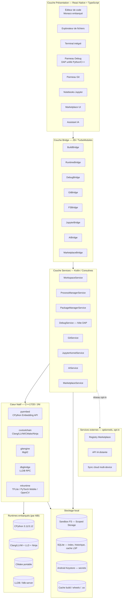
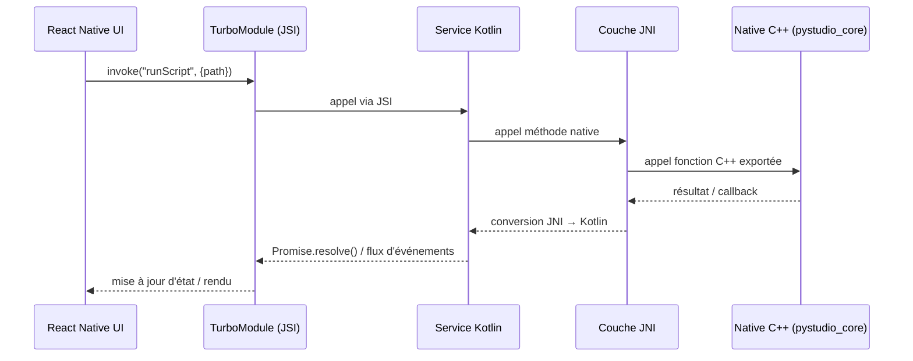
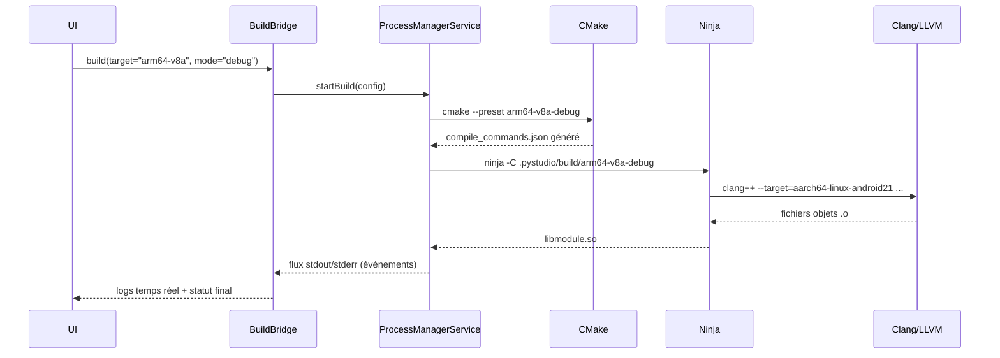
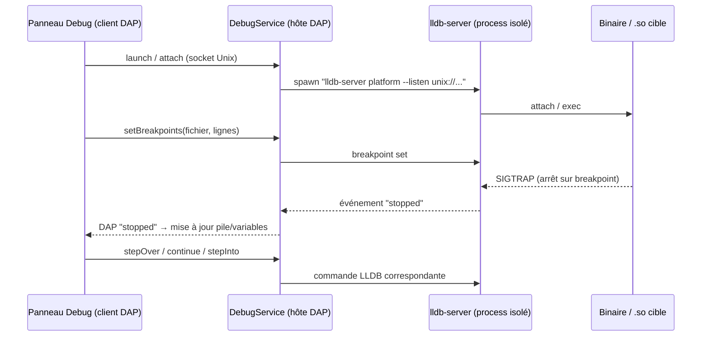
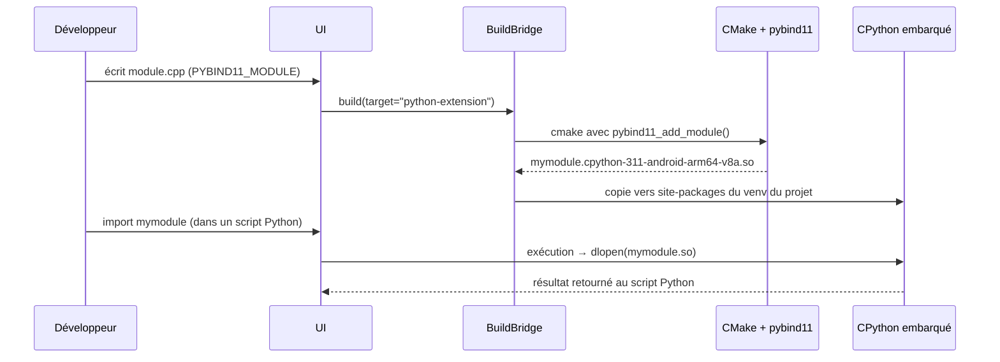
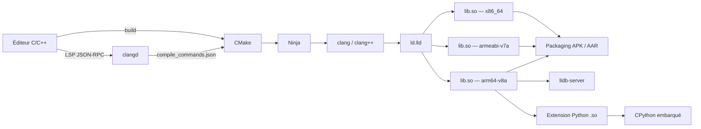
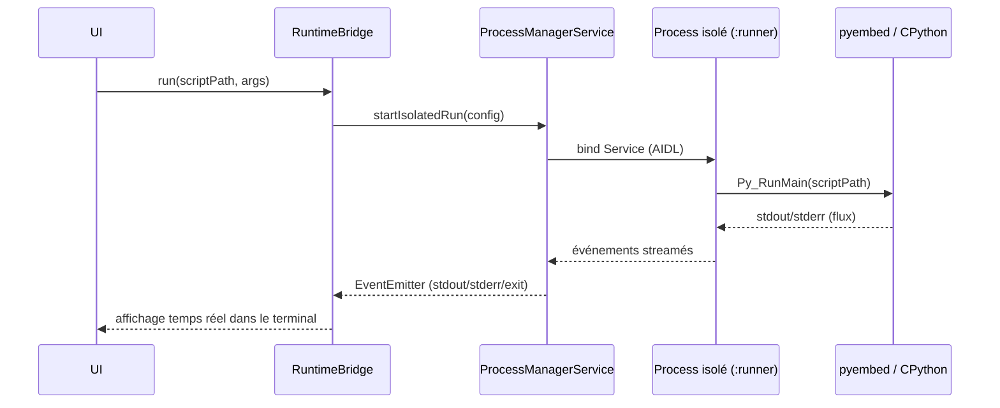
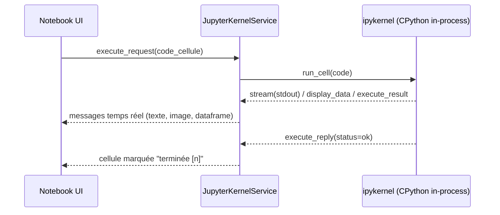
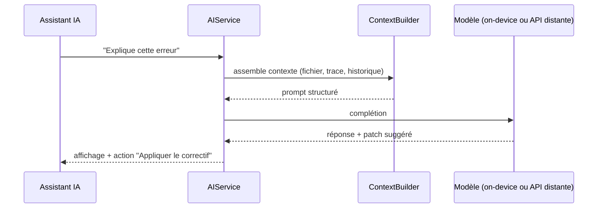
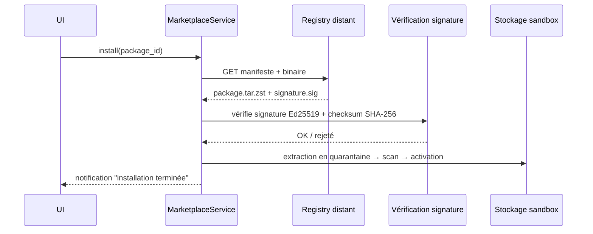

## 3. Exigences Spécifiques

### 3.1 Exigences d'Architecture
#### [REQ-ARCH-0001] PyStudio Mobile — Spécification d'Architecture

**Type de document :** Spécification technique d'architecture logicielle
**Version :** 1.0
**Date :** 12 juillet 2026
**Portée :** Application Android complète (IDE Python + C/C++), runtime embarqué, couche native, sécurité, performance, scalabilité

---

##### [REQ-ARCH-0002] Table des matières

0. Principes directeurs
1. Résumé exécutif
2. Architecture globale
3. Frontend — React Native / TypeScript
4. Couche de services applicatifs (« Backend » embarqué)
5. Runtime Python — CPython embarqué
6. Couche native — Kotlin / NDK / C++ / JNI
7. Support natif C/C++ (fonctionnalité de premier niveau)
8. Flux de données
9. Communication entre modules
10. Sécurité
11. Performances
12. Scalabilité & Marketplace
13. APIs internes
14. Structures de données
15. Arborescence du monorepo
16. Risques techniques & mitigations
17. Roadmap technique
18. Glossaire

---

##### [REQ-ARCH-0003] 0. Principes directeurs

| Principe | Description | Implication technique |
|---|---|---|
| **Offline-first** | Toute fonctionnalité cœur (édition, exécution, build, debug, Git local) fonctionne sans réseau | Toolchains, interpréteurs, index LSP et données ML embarqués ou mis en cache localement |
| **Android-first** | L'expérience est pensée pour le tactile, l'autonomie et les contraintes mémoire mobiles, avant toute portabilité future (iOS/Desktop) | Utilisation poussée du NDK, des services isolés Android, de Scoped Storage |
| **Parité Python / C++** | Le C/C++ n'est pas un "plugin" mais un citoyen de première classe au même titre que Python | Toolchains Clang/LLVM, CMake et LLDB embarqués au même niveau que CPython |
| **Séparation stricte des couches** | UI, orchestration, runtime et stockage sont découplés par des interfaces stables | Bridges typés, API internes versionnées (cf. §13) |
| **Isolation & résilience** | Un crash de code utilisateur (Python ou natif) ne doit jamais tuer l'IDE | Exécution en process Android isolé (`android:isolatedProcess`), communication par Binder/AIDL |
| **Sécurité par design** | Code tiers (marketplace, packages) et code utilisateur sont sandboxés et vérifiés | Signature cryptographique, permissions granulaires, Keystore Android |
| **Extensibilité** | L'IDE doit pouvoir grandir via un marketplace de packages, templates, plugins et thèmes | Registre versionné, API plugin stable, sandbox JS pour extensions tierces |
| **Performance perçue "desktop"** | Démarrage rapide, autocomplétion réactive, builds incrémentaux | Hermes, cache de compilation, indexation incrémentale, pooling de process |

---

##### [REQ-ARCH-0004] 1. Résumé exécutif

PyStudio Mobile est un IDE Android complet, inspiré de VS Code, permettant d'écrire, exécuter, déboguer et packager du code **Python** et **C/C++** directement sur un smartphone ou une tablette, sans connexion réseau obligatoire. L'application embarque un runtime **CPython** cross-compilé pour Android, une toolchain **Clang/LLVM + CMake + LLDB** complète, ainsi que les bibliothèques scientifiques et ML majeures (PyTorch, TensorFlow/TFLite, OpenCV, NLTK, scikit-learn). Elle intègre un client **Git** natif, un moteur de notebooks **Jupyter**, un **assistant IA** contextuel, et un **marketplace** de packages/plugins/templates.

L'architecture repose sur quatre strates : une couche de présentation React Native/TypeScript, une couche de bridge typée (JSI/TurboModules), une couche de services d'orchestration en Kotlin, et un cœur natif en C++ exposé via JNI qui héberge les runtimes embarqués (CPython, LLVM/Clang, CMake, LLDB, moteurs ML). Le C/C++ est traité comme une fonctionnalité de premier niveau : création de projets, compilation croisée multi-ABI (arm64-v8a, armeabi-v7a, x86_64), génération de bibliothèques `.so`, build CMake, débogage LLDB, et intégration bidirectionnelle avec Python via des extensions natives (C-API, pybind11, Cython, ctypes/cffi).

---

##### [REQ-ARCH-0005] 2. Architecture globale

Le système intègre désormais un support natif pour le calcul scientifique et la visualisation de données via la **PyStudio Visualization Layer**, qui vient s'ajouter aux couches de base existantes.



###### [REQ-ARCH-0006] 2.1 Vue par couches

| # | Couche | Technologies | Rôle |
|---|---|---|---|
| 1 | Présentation | React Native, TypeScript, Hermes, WebView Monaco | Interface desktop-like, tactile-first |
| 2 | Bridge | JSI, TurboModules, EventEmitter | Communication faible latence JS ↔ Native, streaming logs |
| 3 | Services | Kotlin, Coroutines, AIDL, WorkManager | Orchestration métier, cycle de vie, isolation process |
| 4 | Cœur natif | C++17/20, JNI, CMake, Ninja | Logique lourde, wrapping des toolchains |
| 5 | Runtimes | CPython, Clang/LLVM, CMake, LLDB | Exécution et outillage des langages supportés |
| 6 | Stockage | Scoped Storage, SQLite, EncryptedSharedPreferences | Persistance locale, cache, secrets |

###### [REQ-ARCH-0007] 2.2 Note sur le « Backend »

PyStudio Mobile étant **offline-first**, il n'existe pas de backend serveur obligatoire. Le terme « backend » désigne ici la **couche de services embarqués** (Kotlin, §4) qui orchestre les runtimes locaux. Un backend cloud existe uniquement pour des fonctions **opt-in** : registre marketplace, synchronisation multi-device, et appel à un modèle d'IA distant plus puissant que le modèle on-device.

---

##### [REQ-ARCH-0008] 3. Frontend — React Native / TypeScript

###### [REQ-ARCH-0009] 3.1 Arborescence fonctionnelle

| Module UI | Responsabilité |
|---|---|
| `editor/` | Édition de code, coloration syntaxique, LSP client (Python + C/C++), multi-onglets, split-view |
| `explorer/` | Arborescence de fichiers/projets, drag & drop, recherche full-text |
| `terminal/` | Émulateur de terminal (pty virtuel) relié au shell embarqué |
| `debugger-ui/` | Panneau de debug unifié (DAP) : breakpoints, variables, pile d'appels, watch |
| `git-panel/` | Diff viewer, staging, commit, branches, merge, historique |
| `jupyter-notebook-ui/` | Rendu de cellules (code/markdown), sorties riches (images, dataframes, plots) |
| `marketplace-ui/` | Recherche, fiche produit, installation, gestion des mises à jour |
| `ai-assistant-ui/` | Chat contextuel, suggestions inline, application de patchs |
| `settings/` | Préférences, gestion des toolchains, thèmes, raccourcis |

###### [REQ-ARCH-0010] 3.2 Éditeur de code

L'éditeur repose sur **Monaco Editor** hébergé dans une WebView optimisée (communication par `postMessage` sérialisé, pas de rechargement de page), choisi pour sa fidélité à l'expérience desktop (multi-curseurs, minimap, pliage de code, diff inline). Une grammaire TextMate dédiée est fournie pour Python et C/C++. L'éditeur se connecte à des serveurs de langage locaux :

- **Python** → `pylsp`/`pyright` embarqué (process isolé)
- **C/C++** → `clangd` embarqué (même toolchain LLVM que la compilation, §7.10)

###### [REQ-ARCH-0010-B] Gestion du clavier avec Monaco Editor (WebView)

L'utilisation de Monaco dans une WebView sur mobile pose des défis majeurs concernant la gestion du clavier virtuel (soft keyboard). Cependant, **pour préserver 100% des fonctionnalités avancées de Monaco (multi-curseurs, raccourcis complexes, Intellisense complet)**, la WebView doit impérativement conserver le focus natif. L'architecture s'appuiera sur les solutions suivantes :

1. **Redimensionnement OS-Level (adjustResize)** : Sur Android, le manifeste sera configuré avec `android:windowSoftInputMode="adjustResize"` pour que l'OS réduise physiquement la hauteur allouée à l'application sans la "pousser" vers le haut. Sur iOS, on utilisera les propriétés natives de la WebView pour éviter le défilement intempestif.
2. **Synchronisation Resize Observer / VisualViewport** : Dans le code JavaScript injecté dans la WebView, un écouteur sur `window.visualViewport.onresize` détectera les changements de hauteur au pixel près lorsque le clavier apparaît.
3. **Monaco Layout Callback direct** : Dès que l'événement de redimensionnement est capté dans la WebView, on exécute `editor.layout()` pour recalculer les dimensions de Monaco, suivi de `editor.revealPositionInCenterIfOutsideViewport()` pour scroller automatiquement vers le curseur. Monaco gère ainsi la frappe nativement sans aucun proxy.

###### [REQ-ARCH-0011] 3.3 Gestion d'état

- **Zustand** pour l'état global léger (onglets ouverts, thème, session courante)
- **Pattern query/async** type RTK Query pour les appels au Bridge (cache, invalidation, statut `loading/error/success`)
- Persistance de l'état de workspace en SQLite via `WorkspaceService`

###### [REQ-ARCH-0012] 3.4 Bridge Frontend ↔ Natif

| Type d'appel | Mécanisme | Cas d'usage |
|---|---|---|
| Synchrone rapide | JSI (accès direct mémoire) | Vérification d'existence de fichier, lecture de petite config |
| Asynchrone (Promise) | TurboModules | Build, exécution, opérations Git, installation marketplace |
| Streaming continu | EventEmitter natif → JS | Logs de build, stdout/stderr d'exécution, événements de debug (DAP), sorties de cellules Jupyter |

---

##### [REQ-ARCH-0013] 4. Couche de services applicatifs (« Backend » embarqué, Kotlin)

| Service | Responsabilité | Technologies clés |
|---|---|---|
| `WorkspaceService` | Cycle de vie des projets/workspaces, indexation, persistance | Kotlin Coroutines, SQLite |
| `FileSystemService` | Accès fichiers sandboxé, watch de fichiers, gestion des permissions | Scoped Storage, `FileObserver` |
| `ProcessManagerService` | Spawn et supervision des process isolés (Python, Clang, CMake, LLDB, Git) | `android:isolatedProcess`, AIDL, WorkManager |
| `PackageManagerService` | Résolution de dépendances Python (pip offline/online) et bibliothèques C/C++ | Résolveur de dépendances custom, cache de wheels |
| `GitService` | Opérations Git complètes (clone, commit, branch, merge, rebase, diff) | libgit2 via JNI |
| `JupyterKernelService` | Hébergement d'un kernel `ipykernel` in-process | CPython embarqué, protocole Jupyter simplifié en mémoire |
| `DebugService` | Hôte du protocole DAP, pont vers `debugpy` (Python) et LLDB (C/C++) | Debug Adapter Protocol |
| `AIService` | Construction de contexte, appel modèle (local ou distant), application de suggestions | ContextBuilder, client API |
| `MarketplaceService` | Recherche, téléchargement, vérification et installation de packages/plugins/templates | Vérification de signature, quarantaine |
| `TelemetryService` | Télémétrie anonymisée opt-in (crash reports, usage agrégé) | Stockage local avant envoi différé |

---

##### [REQ-ARCH-0014] 5. Runtime Python — CPython embarqué

###### [REQ-ARCH-0015] 5.1 Stratégie de build

CPython est **cross-compilé** pour Android via le NDK, pour chaque ABI cible, produisant `libpython3.x.so`, les modules d'extension standards (`.so`) et une bibliothèque standard packagée en zip (`python3xx.zip`) pour réduire le nombre de fichiers et accélérer les imports (`zipimport`).

###### [REQ-ARCH-0016] 5.2 Gestion multi-version et environnements

Chaque workspace référence une version de CPython (3.11 ou 3.12) et un environnement isolé, émulant le comportement `venv` par redirection de `PYTHONHOME`/`PYTHONPATH` vers un dossier sandboxé par projet (`/data/user/0/com.pystudio/files/envs/<envId>/`), sans dépendre de `fork()` (non fiable sur Android post-Zygote).

###### [REQ-ARCH-0017] 5.3 Bibliothèques scientifiques et ML — stratégie d'intégration

| Bibliothèque | Stratégie Android | Contraintes principales |
|---|---|---|
| **PyTorch** | Wheels précompilées (PyTorch Mobile / LibTorch Lite) cross-buildées NDK ; délégation possible vers ExecuTorch | Taille (~100–300 Mo), pas de CUDA, exécution CPU + délégués NNAPI/Vulkan |
| **TensorFlow** | Priorité à **TensorFlow Lite** (interpréteur + délégués NNAPI/GPU) ; TF complet disponible en wheel allégée si nécessaire | Pas de GPU CUDA, conversion `.tflite` recommandée pour l'inférence |
| **OpenCV** | `opencv-python` cross-compilé NDK, ou OpenCV Android SDK exposé via JNI + binding Python | Modules `contrib` optionnels (téléchargement à la demande) |
| **NLTK** | Pur Python, corpora (`nltk_data`) téléchargés à la demande et mis en cache local | Dépendance réseau au premier usage (bundle offline optionnel) |
| **scikit-learn** | `numpy`/`scipy` cross-compilés avec **OpenBLAS** (NDK), wheels distribuées via le registre interne | Chaîne BLAS/LAPACK complexe, temps de build long → wheels précompilées en cache |

###### [REQ-ARCH-0018] 5.4 Isolation d'exécution

Android interdisant l'usage classique de `fork()` après le démarrage de la Zygote, chaque exécution de code utilisateur est confiée à un **service Android isolé** (`android:process=":runner"`, `android:isolatedProcess="true"`), communiquant avec le process principal via **Binder/AIDL**. Ce service héberge une instance CPython dédiée, ce qui garantit qu'un crash du code utilisateur n'affecte jamais l'UI.

###### [REQ-ARCH-0019] 5.5 Concurrence

Le GIL de CPython limite le parallélisme intra-interpréteur ; le parallélisme réel est obtenu par plusieurs interpréteurs sous-processus isolés (pattern multiprocessing adapté à Android) plutôt que par le threading classique pour les charges CPU-bound (ex. entraînement ML).

---

##### [REQ-ARCH-0020] 6. Couche native — Kotlin / NDK / C++ / JNI

###### [REQ-ARCH-0021] 6.1 Modules Kotlin

- **Services Android** (Foreground Service pour builds longues et sessions de debug, afin d'éviter le kill par le système)
- **ContentProvider** dédié pour l'accès contrôlé aux fichiers du marketplace
- **WorkManager** pour les tâches différables (téléchargement de toolchains, indexation de gros projets)

###### [REQ-ARCH-0022] 6.2 Bridge JNI

Convention : chaque service Kotlin expose une interface `Native*Service`, implémentée via `System.loadLibrary`, avec gestion rigoureuse des références locales/globales JNI et libération explicite (`DeleteLocalRef`) pour éviter les fuites sur les sessions longues (builds, debug).



###### [REQ-ARCH-0023] 6.3 Modules du cœur natif C++

| Module | Rôle | Dépendances externes |
|---|---|---|
| `pystudio_core` | Orchestrateur C++ partagé, registre de services natifs | — |
| `pyembed` | Wrapper de l'API d'embedding CPython | CPython |
| `cxxtoolchain` | Wrapper Clang/LLVM libTooling, pilotage CMake/Ninja | LLVM, CMake, Ninja |
| `gitengine` | Wrapper libgit2 | libgit2 |
| `dbgbridge` | Pont RPC vers LLDB (protocole DAP) | LLDB |
| `mlruntime` | Dispatch vers TFLite / PyTorch Mobile / OpenCV | TFLite, LibTorch, OpenCV |

---

##### [REQ-ARCH-0024] 7. Support natif C/C++ — fonctionnalité de premier niveau

Le C/C++ dispose du **même statut que Python** : création de projet dédiée, toolchain complète embarquée, build system, débogueur natif, et intégration bidirectionnelle avec l'écosystème Python.

###### [REQ-ARCH-0025] 7.1 Modèle de projet C/C++

Templates disponibles à la création :

| Template | Sortie | Cas d'usage |
|---|---|---|
| Exécutable natif | binaire ELF | Programmes autonomes, exercices, algorithmique |
| Bibliothèque statique | `.a` | Composants réutilisables au sein d'un projet |
| Bibliothèque partagée | `.so` | Composants dynamiques, plugins |
| Bibliothèque Android NDK | `.so` + `.aar` | Intégration dans une app Android tierce |
| Extension Python native | `.so` (tag ABI `cpython-3xx-android-<abi>`) | Accélération de code Python, binding C/C++ |

Structure standard générée :

```
mon-projet-cpp/
├── CMakeLists.txt
├── CMakePresets.json
├── src/
│   └── main.cpp
├── include/
│   └── mon_projet/
├── tests/
├── .pystudio/
│   ├── build/            # répertoires de build par preset (généré, ignoré du VCS)
│   └── compile_commands.json
└── README.md
```

###### [REQ-ARCH-0026] 7.2 Toolchain Clang/LLVM embarquée

Le compilateur **Clang/LLVM tourne nativement sur le device** (hôte ARM64 ou x86_64 selon l'appareil) et effectue de la **cross-compilation** vers les trois ABI cibles, grâce à un sysroot NDK embarqué (headers + bibliothèques par ABI). Ce sysroot peut être livré avec l'APK ou téléchargé à la demande (Play Feature Delivery) afin de limiter la taille initiale, avec vérification de checksum SHA-256 avant activation.

| Composant | Rôle |
|---|---|
| `clang` / `clang++` | Compilation C / C++ |
| `lld` | Éditeur de liens LLVM (rapide, faible RAM) |
| `llvm-ar` | Création d'archives statiques |
| `llvm-strip` | Suppression des symboles en build release |
| `llvm-objdump`, `llvm-nm` | Inspection binaire (debug avancé) |
| `clangd` | Serveur de langage (autocomplétion, diagnostics) |
| `clang-format`, `clang-tidy` | Formatage et analyse statique |

###### [REQ-ARCH-0027] 7.3 Système de build CMake

**CMake** (porté pour tourner directement sur le device) pilote la génération avec **Ninja** comme générateur, choisi pour sa rapidité et sa faible empreinte mémoire — critique sur mobile. Le toolchain file standard `android.toolchain.cmake` (fourni par le NDK embarqué) est utilisé pour chaque ABI, avec des presets prédéfinis :

```json
// CMakePresets.json (généré automatiquement)
{
  "version": 6,
  "configurePresets": [
    {
      "name": "arm64-v8a-debug",
      "generator": "Ninja",
      "binaryDir": "${sourceDir}/.pystudio/build/arm64-v8a-debug",
      "cacheVariables": {
        "CMAKE_TOOLCHAIN_FILE": "$env{NDK_HOME}/build/cmake/android.toolchain.cmake",
        "ANDROID_ABI": "arm64-v8a",
        "ANDROID_PLATFORM": "android-21",
        "CMAKE_BUILD_TYPE": "Debug"
      }
    },
    {
      "name": "armeabi-v7a-release",
      "generator": "Ninja",
      "binaryDir": "${sourceDir}/.pystudio/build/armeabi-v7a-release",
      "cacheVariables": {
        "CMAKE_TOOLCHAIN_FILE": "$env{NDK_HOME}/build/cmake/android.toolchain.cmake",
        "ANDROID_ABI": "armeabi-v7a",
        "ANDROID_PLATFORM": "android-21",
        "CMAKE_BUILD_TYPE": "Release"
      }
    }
  ]
}
```

###### [REQ-ARCH-0028] 7.4 Génération de bibliothèques `.so` multi-ABI



Un **build "fat"** compile en parallèle (pool de threads borné pour limiter l'échauffement CPU) les trois ABI, puis fusionne les artefacts dans une structure `jniLibs/<abi>/lib*.so` prête à l'intégration ou à l'export. En mode debug, les symboles DWARF sont conservés dans un fichier `.so.debug` séparé (non embarqué en release) pour permettre le débogage LLDB sans alourdir les artefacts distribués.

###### [REQ-ARCH-0029] 7.5 Débogage LLDB



`lldb-server` s'exécute en process isolé, communiquant exclusivement par **socket Unix local** (jamais de port TCP exposé), avec vérification d'UID pour empêcher toute autre application du device d'y accéder. Le panneau de debug de l'UI est **unifié** avec celui utilisé pour Python (protocole DAP commun), offrant la même expérience (breakpoints, watch, pile d'appels, inspection mémoire/registres) pour les deux langages.

###### [REQ-ARCH-0030] 7.6 Intégration C/C++ ↔ Python — extensions natives

Quatre méthodes sont supportées, du plus bas niveau au plus haut niveau :

| Méthode | Complexité | Performance | Cas d'usage typique |
|---|---|---|---|
| Python C-API pur (`Python.h`) | Élevée | Maximale | Contrôle fin, zéro dépendance additionnelle |
| **pybind11** (recommandé) | Moyenne | Très bonne | Binding C++ moderne : classes, templates, STL |
| **Cython** | Moyenne | Bonne | Hybride Python/C typé progressivement |
| **ctypes / cffi** | Faible | Bonne (overhead de marshaling) | Réutiliser un `.so` existant sans recompiler l'interpréteur |



Le toolchain Clang reçoit automatiquement un sysroot additionnel « Python » (headers `Python.h` + `libpython3.x.so` issus du runtime embarqué), garantissant la compatibilité ABI (tag `cpython-3xx-android-<abi>`) entre l'extension compilée et l'interpréteur qui l'importera.

```cmake
# Exemple : CMakeLists.txt d'une extension Python via pybind11
cmake_minimum_required(VERSION 3.22)
project(mymodule LANGUAGES CXX)

set(CMAKE_CXX_STANDARD 20)
set(CMAKE_CXX_STANDARD_REQUIRED ON)

find_package(pybind11 REQUIRED)
pybind11_add_module(mymodule src/binding.cpp src/core.cpp)
target_include_directories(mymodule PRIVATE include)

if(CMAKE_BUILD_TYPE STREQUAL "Debug")
    target_compile_options(mymodule PRIVATE -fsanitize=address,undefined -g)
    target_link_options(mymodule PRIVATE -fsanitize=address,undefined)
endif()
```

###### [REQ-ARCH-0031] 7.7 SDK NDK intégré — bibliothèques Android natives

PyStudio Mobile permet de créer des **bibliothèques Android NDK** structurellement compatibles avec un projet Gradle/Android Studio externe (interopérabilité), avec génération automatique des stubs JNI depuis des interfaces Kotlin annotées, et export final sous forme d'**AAR** (contenant les `.so` multi-ABI + headers publics), publiable directement sur le Marketplace interne.

###### [REQ-ARCH-0032] 7.8 Matrice de compilation multi-cibles

| ABI | Triple Clang | API level min | Usage principal |
|---|---|---|---|
| **arm64-v8a** | `aarch64-linux-android21` | 21 | Cible principale — majorité des devices depuis 2018 |
| **armeabi-v7a** | `armv7a-linux-androideabi21` | 21 | Devices d'entrée de gamme / legacy |
| **x86_64** | `x86_64-linux-android21` | 21 | Émulateurs, tablettes/Chromebooks x86 |

###### [REQ-ARCH-0033] 7.9 Diagnostics et sanitizers

Les runtimes **ASan** (AddressSanitizer) et **UBSan** (UndefinedBehaviorSanitizer) fournis par le NDK sont activables par un simple bouton dans les paramètres du projet pour les builds *debug*, aidant à détecter fuites mémoire, dépassements de buffer et comportements indéfinis directement sur device.

###### [REQ-ARCH-0034] 7.10 Autocomplétion et analyse statique (LSP)

`clangd` (même toolchain LLVM que la compilation) s'exécute en process isolé et communique en LSP (JSON-RPC sur stdio) avec l'éditeur, en s'appuyant sur le `compile_commands.json` généré automatiquement par CMake à chaque configuration — garantissant que l'autocomplétion reflète exactement les flags de compilation réels du projet.

###### [REQ-ARCH-0035] 7.11 Vue d'ensemble du pipeline C/C++



---

##### [REQ-ARCH-0036] 8. Flux de données

###### [REQ-ARCH-0037] 8.1 Exécution d'un script Python



###### [REQ-ARCH-0038] 8.2 Session de débogage unifiée (Python et C++)

Le panneau de debug utilise un **client DAP unique** ; selon le langage du fichier actif, `DebugService` route vers `debugpy` (Python, in-process avec l'interpréteur embarqué) ou vers `dbgbridge`/LLDB (natif, cf. §7.5), en normalisant les événements (`stopped`, `breakpoint`, `variables`, `stackTrace`) dans un format commun pour l'UI.

###### [REQ-ARCH-0039] 8.3 Exécution Jupyter



###### [REQ-ARCH-0040] 8.4 Requête à l'assistant IA



###### [REQ-ARCH-0041] 8.5 Installation depuis le Marketplace



---

##### [REQ-ARCH-0042] 9. Communication entre modules

###### [REQ-ARCH-0043] 9.1 Protocoles internes standardisés

| Protocole | Usage | Transport | Format |
|---|---|---|---|
| **DAP** (Debug Adapter Protocol) | Debug Python et C++ unifié | Socket Unix local | JSON-RPC |
| **LSP** (Language Server Protocol) | Autocomplétion, diagnostics (pylsp, clangd) | stdio du process isolé | JSON-RPC |
| **AIDL/Binder** | IPC inter-process Android (UI ↔ process isolé d'exécution) | Binder kernel Android | Parcelable |
| **JSI/TurboModules** | Bridge JS ↔ Kotlin | Mémoire partagée / appel direct | Objets typés TS/Kotlin |
| Protocole kernel Jupyter simplifié | Exécution de cellules notebook | En mémoire (in-process) | Messages typés (struct) |

###### [REQ-ARCH-0044] 9.2 Bus d'événements interne

Un **Event Bus** (Kotlin `SharedFlow`) centralise les événements transverses (fin de build, résultat Git, notification marketplace) consommés par plusieurs services simultanément sans couplage direct.

| Topic | Émetteur | Consommateurs typiques |
|---|---|---|
| `build.completed` | ProcessManagerService | UI (BuildBridge), AIService (diagnostic d'erreurs) |
| `debug.stopped` | DebugService | UI (DebugBridge) |
| `git.status.changed` | GitService | UI (GitBridge), WorkspaceService (indexation) |
| `marketplace.installed` | MarketplaceService | WorkspaceService, PackageManagerService |
| `fs.changed` | FileSystemService | Editeur (rechargement), LSP (réindexation) |

---

##### [REQ-ARCH-0045] 10. Sécurité

| Menace | Mitigation |
|---|---|
| Exécution de code arbitraire (Python/C++ utilisateur ou packages tiers) | Process Android isolé (`isolatedProcess`), Scoped Storage, aucun accès réseau par défaut pour le code utilisateur (opt-in explicite) |
| Supply chain du Marketplace | Signature Ed25519 des packages, vérification de checksum, installation en quarantaine, scan heuristique statique avant activation |
| Stockage de secrets (tokens Git, clés API) | Android Keystore / `EncryptedSharedPreferences` |
| Intégrité des toolchains téléchargées (LLVM, sysroot NDK) | Vérification SHA-256 systématique avant activation |
| Permissions runtime | Modèle de permissions granulaire par projet (réseau, capteurs, fichiers hors sandbox) |
| Communication IPC | Sockets Unix locaux avec vérification d'UID ; aucun port TCP loopback exposé |
| Débogueur natif | `lldb-server` lié en local uniquement ; debug distant désactivé par défaut, activable avec appairage chiffré explicite |

---

##### [REQ-ARCH-0046] 11. Performances

| Métrique | Cible |
|---|---|
| Démarrage à froid de l'application | < 2 s |
| Ouverture d'un fichier < 1 Mo | < 100 ms |
| Latence d'autocomplétion (LSP) | < 150 ms (p50) |
| Build incrémental C++ (petit projet) | < 3 s |
| Résolution d'environnement Python (cache chaud) | < 5 s |
| Démarrage d'un kernel Jupyter | < 1,5 s |
| Attache du débogueur LLDB | < 2 s |

**Stratégies :** moteur JS Hermes, chargement différé des modules UI non critiques, `mmap` pour l'ouverture de gros fichiers, indexation incrémentale (cache LSP en SQLite), cache de compilation type *ccache* pour Clang, pool de process d'exécution « chauds » pour réduire la latence de démarrage d'un script, limitation dynamique du parallélisme de build selon la température/charge CPU du device.

---

##### [REQ-ARCH-0047] 12. Scalabilité & Marketplace

###### [REQ-ARCH-0048] 12.1 Types d'objets du Marketplace

| Type | Description |
|---|---|
| Package Python | Wheel précompilée (notamment pour les libs ML lourdes à build long) |
| Bibliothèque C/C++ précompilée | `.so`/`.a` multi-ABI + headers |
| Template de projet | Structure de départ (Python, C++, mixte) |
| Plugin UI/thème | Extension sandboxée de l'interface |
| Snippet / preset IA | Prompt ou configuration réutilisable pour l'assistant |

###### [REQ-ARCH-0049] 12.2 Extensibilité plugin

Les extensions tierces s'exécutent dans un **contexte JS sandboxé** (moteur type QuickJS isolé), sans accès direct au natif : elles ne peuvent invoquer que les capacités explicitement déclarées et validées dans leur manifeste (principe du moindre privilège).

###### [REQ-ARCH-0050] 12.3 Registre distribué

Le registre marketplace combine un **CDN** pour la distribution des binaires et un **cache local avec synchronisation différée**, permettant la consultation et la réinstallation de packages déjà téléchargés en mode totalement hors-ligne.

---

##### [REQ-ARCH-0051] 13. APIs internes

###### [REQ-ARCH-0052] 13.1 Interface TypeScript exposée à la Présentation

```typescript
export interface BuildOptions {
  projectId: string;
  target: 'python' | 'cpp' | 'python-extension' | 'ndk-library';
  abi?: 'arm64-v8a' | 'armeabi-v7a' | 'x86_64' | 'all';
  mode: 'debug' | 'release';
  cmakeArgs?: string[];
}

export interface BuildResult {
  success: boolean;
  artifacts: string[];   // chemins des .so / exécutables générés
  durationMs: number;
  logId: string;          // référence au flux de logs streamés
}

export interface PyStudioBuildBridge {
  build(options: BuildOptions): Promise<BuildResult>;
  cancelBuild(buildId: string): Promise<void>;
  onBuildLog(callback: (chunk: BuildLogChunk) => void): () => void; // unsubscribe
}

export interface BuildLogChunk {
  buildId: string;
  stream: 'stdout' | 'stderr';
  text: string;
  timestamp: number;
}
```

###### [REQ-ARCH-0053] 13.2 Interface Kotlin (côté service)

```kotlin
interface NativeBuildService {
    suspend fun build(options: BuildOptions): BuildResult
    suspend fun cancelBuild(buildId: String)
    fun logsFlow(buildId: String): Flow<BuildLogChunk>
}

data class BuildOptions(
    val projectId: String,
    val target: BuildTarget,     // PYTHON, CPP, PYTHON_EXTENSION, NDK_LIBRARY
    val abi: Abi = Abi.ARM64_V8A,
    val mode: BuildMode = BuildMode.DEBUG,
    val cmakeArgs: List<String> = emptyList()
)
```

###### [REQ-ARCH-0054] 13.3 En-tête JNI (C++)

```cpp
// pystudio_core_jni.h
extern "C" {

JNIEXPORT jobject JNICALL
Java_com_pystudio_core_NativeBuildService_nativeBuild(
    JNIEnv* env, jobject thiz, jobject buildOptions);

JNIEXPORT void JNICALL
Java_com_pystudio_core_NativeBuildService_nativeCancelBuild(
    JNIEnv* env, jobject thiz, jstring buildId);

JNIEXPORT jobject JNICALL
Java_com_pystudio_core_PyEmbed_nativeRunScript(
    JNIEnv* env, jobject thiz, jstring scriptPath, jobjectArray args);

} // extern "C"
```

###### [REQ-ARCH-0055] 13.4 Table récapitulative des modules de bridge

| Module JS (`NativeModules.X`) | Service natif associé | Type d'appel | Description |
|---|---|---|---|
| `BuildBridge` | ProcessManagerService + cxxtoolchain | async + stream | Build Python / C / C++ |
| `RuntimeBridge` | pyembed | async + stream | Exécution de scripts Python |
| `DebugBridge` | DebugService (DAP) | async + stream | Sessions de debug Python/C++ |
| `GitBridge` | GitService (libgit2) | async | Opérations Git |
| `FSBridge` | WorkspaceService | sync (JSI) + async | Accès fichiers sandbox |
| `JupyterBridge` | JupyterKernelService | async + stream | Notebooks |
| `AIBridge` | AIService | async + stream | Assistant IA |
| `MarketplaceBridge` | MarketplaceService | async | Installation packages/plugins |

---

##### [REQ-ARCH-0056] 14. Structures de données

###### [REQ-ARCH-0057] 14.1 `project.json`

```json
{
  "id": "proj_8f2a",
  "name": "mon-projet-cv",
  "type": "mixed",
  "languages": ["python", "cpp"],
  "pythonVersion": "3.11",
  "cppStandard": "c++20",
  "targets": [
    { "name": "core-native", "kind": "shared-library", "abi": ["arm64-v8a", "armeabi-v7a", "x86_64"] },
    { "name": "app-script", "kind": "python-entrypoint", "entry": "main.py" }
  ],
  "dependencies": {
    "python": ["numpy==1.26.4", "opencv-python", "scikit-learn"],
    "native": ["pybind11@2.12.0"]
  },
  "createdAt": "2026-05-01T10:00:00Z"
}
```

###### [REQ-ARCH-0058] 14.2 Autres schémas (champs principaux)

| Fichier | Champs clés | Rôle |
|---|---|---|
| `workspace.json` | `openTabs`, `activeProjectId`, `layout`, `theme` | État de session persistant |
| `build-target.json` | `abi`, `mode`, `cmakePreset`, `lastBuildStatus`, `artifacts[]` | Configuration et historique d'une cible de build |
| `pystudio.lock` | `resolvedPackages[]`, `hashes{}`, `pythonVersion` | Verrouillage reproductible des dépendances |
| Session de debug | `sessionId`, `language`, `breakpoints[]`, `callStack[]`, `variables{}` | État temps réel d'une session DAP |
| Contexte IA | `activeFile`, `selection`, `diagnostics[]`, `recentEdits[]` | Contexte assemblé avant appel modèle |

---

##### [REQ-ARCH-0059] 15. Arborescence du monorepo

```
pystudio-mobile/
├── apps/
│   └── mobile/                     # Application React Native
│       ├── src/
│       │   ├── screens/
│       │   ├── components/
│       │   ├── state/
│       │   └── bridges/
│       └── android/
│           └── app/src/main/
│               ├── kotlin/com/pystudio/services/
│               └── jni/
├── native/
│   ├── pystudio-core/               # Orchestrateur C++ partagé
│   ├── pyembed/
│   ├── cxxtoolchain/
│   ├── gitengine/
│   ├── dbgbridge/
│   └── mlruntime/
├── runtimes/
│   ├── cpython-android/             # scripts de cross-compilation CPython
│   ├── llvm-android/                # scripts de packaging Clang/LLVM
│   └── cmake-android/               # portage CMake on-device
├── services/
│   └── marketplace-registry/        # backend cloud optionnel
├── packages/
│   └── shared-types/                # types TS partagés Bridge ↔ UI
└── tools/
    └── build-scripts/
```

---

##### [REQ-ARCH-0060] 16. Risques techniques & mitigations

| Risque | Impact | Mitigation |
|---|---|---|
| Taille d'APK excessive (toolchains embarquées) | Élevé | Téléchargement à la demande (Play Feature Delivery), modules dynamiques par ABI |
| Fragmentation Android (versions OS, RAM disponible) | Moyen | Matrice de compatibilité explicite, dégradation gracieuse des fonctionnalités lourdes |
| Compilation C++ intensive sur mobile (CPU/RAM/chaleur) | Élevé | Cache incrémental agressif, parallélisme borné, throttling thermique adaptatif |
| Sécurité du Marketplace (code malveillant) | Élevé | Signature cryptographique, sandbox d'installation, revue statique automatique |
| Consommation batterie (builds, inférence ML) | Moyen | Planification via WorkManager, limitation stricte en arrière-plan |

---

##### [REQ-ARCH-0061] 17. Roadmap technique

| Phase | Contenu | Horizon indicatif |
|---|---|---|
| Phase 1 | Éditeur, FS sandboxé, exécution Python basique, Git minimal | T0 – T3 |
| Phase 2 | Support C/C++ complet (CMake, Clang/LLVM, LLDB, extensions Python) | T3 – T6 |
| Phase 3 | Bibliothèques ML (TFLite, OpenCV, scikit-learn), notebooks Jupyter | T6 – T9 |
| Phase 4 | Marketplace, plugins tiers, thèmes | T9 – T11 |
| Phase 5 | Assistant IA intégré, optimisations de performance avancées | T11 – T14 |

---

##### [REQ-ARCH-0062] 18. Glossaire

| Terme | Définition |
|---|---|
| **ABI** | Application Binary Interface — ici, l'architecture CPU cible (arm64-v8a, armeabi-v7a, x86_64) |
| **DAP** | Debug Adapter Protocol — protocole standardisé de communication avec un débogueur |
| **JNI** | Java Native Interface — pont d'appel entre code JVM/Kotlin et code natif C/C++ |
| **JSI** | JavaScript Interface — mécanisme React Native d'appel direct natif à faible latence |
| **LSP** | Language Server Protocol — protocole d'autocomplétion/diagnostics utilisé par les éditeurs |
| **NDK** | Native Development Kit — kit Android pour compiler du code natif C/C++ |
| **Sysroot** | Ensemble de headers et bibliothèques définissant l'environnement de compilation cible |
| **Offline-first** | Principe de conception où toute fonctionnalité cœur fonctionne sans réseau |

---

*Fin de la spécification.*


##### [REQ-ARCH-0063] 13. Architecture de Visualisation Scientifique

Afin d'assurer des performances optimales et une intégration native sur Android, l'architecture de visualisation repose sur le flux de rendu suivant, de haut en bas :

1. **Couches Applicatives (Python) :** Matplotlib / Seaborn / Plotly / Bokeh
   ↓
2. **Couche d'Interface :** PyStudio Visualization Layer (Intercepte les appels de rendu Python)
   ↓
3. **Couche de Rendu Android :** Android Rendering Layer (Traduit les primitives en composants système)
   ↓
4. **Couche Matérielle :** Canvas Android / OpenGL ES / Vulkan (Accélération matérielle native)


