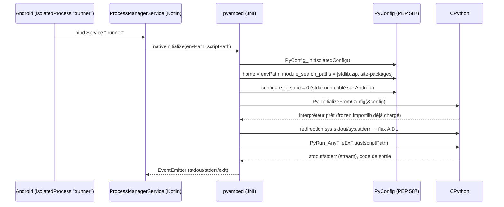
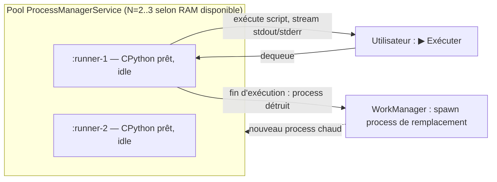
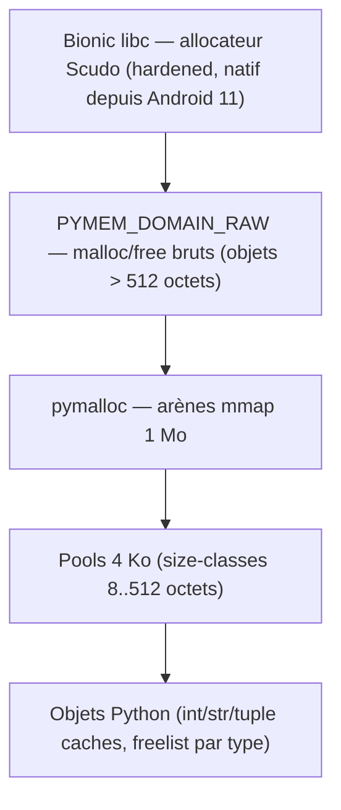
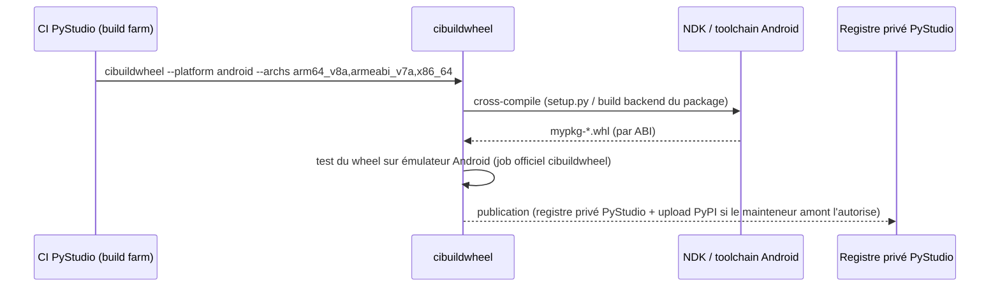
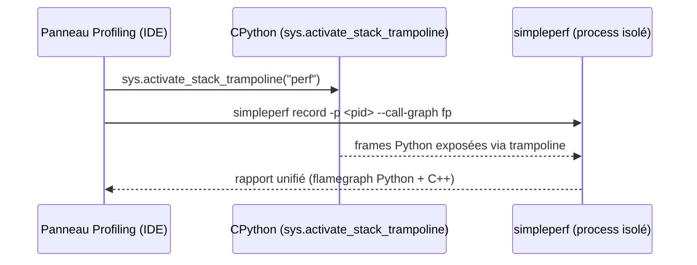

### 3.2 Exigences Fonctionnelles
#### [REQ-FUNC-0064] PyStudio Mobile — Spécification du Runtime Python

**Type de document :** Spécification technique — Runtime Python embarqué
**Auteur :** Principal Python Runtime Engineer
**Version :** 1.0
**Date :** 12 juillet 2026
**Portée :** CPython embarqué, cycle de démarrage, gestion mémoire, système d'import, packages, wheels, cache, concurrence, profilage, optimisations natives (ARM64/NEON/LTO/PGO/Vulkan/NNAPI)
**Dépend de :** `PyStudio_Mobile_Architecture_Specification.md` (§5 Runtime Python, §7.6 intégration C/C++, §13 APIs internes)
**Complète :** l'ADR-1 (isolation par `isolatedProcess`) de la spécification d'architecture

---

##### [REQ-FUNC-0065] Table des matières

0. Principes directeurs du runtime
1. Résumé exécutif
2. CPython embarqué — stratégie de build & versions cibles
3. Cycle de démarrage (cold start / warm start)
4. Gestion mémoire
5. Système d'import
6. Gestion des packages (résolveur de dépendances)
7. Wheels — format, tags, pipeline
8. Cache multi-niveaux
9. Multithreading & concurrence
10. Profilage
11. Optimisations natives
12. APIs internes (contrats)
13. Risques & ADRs runtime
14. Glossaire

---

##### [REQ-FUNC-0066] 0. Principes directeurs du runtime

| Principe | Description | Implication technique |
|---|---|---|
| **S'appuyer sur l'amont, ne pas le réinventer** | Depuis la PEP 738, Android est une plateforme Tier 3 officiellement supportée par CPython | Le build CPython part des scripts officiels (`Android/` dans le dépôt CPython), pas d'un pipeline de cross-compilation entièrement maison |
| **Démarrage perçu instantané** | L'utilisateur ne doit jamais attendre l'initialisation de l'interpréteur | Pool d'interpréteurs pré-chauffés, bytecode précompilé, import paresseux |
| **Mémoire disciplinée** | L'app cohabite avec le Low Memory Killer d'Android | Libération d'arènes, réaction à `onTrimMemory`, budgets explicites |
| **Isolation avant vitesse** | Le crash du code utilisateur ne doit jamais dégrader la fiabilité du runtime | Cohérent avec `isolatedProcess` (ADR-1) ; tout gain de perf (pool, sous-interpréteurs) est subordonné à cette contrainte |
| **Parité build officiel / build mobile** | Un package qui fonctionne sur desktop doit pouvoir tourner sur PyStudio sans patch ad hoc | Tags de wheel standard (PEP 738), résolveur conforme aux spécifications PyPA |
| **Mesurer avant d'optimiser** | Toute optimisation native (LTO/PGO/NEON/Vulkan/NNAPI) doit être justifiée par un profil réel | Chaîne de profilage bas-overhead systématiquement disponible (§10) |

---

##### [REQ-FUNC-0067] 1. Résumé exécutif

Ce document spécifie le runtime Python de PyStudio Mobile : la manière dont CPython est construit, démarré, exécuté, débogué et optimisé sur Android. Il s'appuie sur un changement de contexte majeur intervenu depuis la rédaction de la spécification d'architecture : **la PEP 738 (« Adding Android as a supported platform »)** a été acceptée et Android est une **plateforme Tier 3 officiellement supportée par CPython depuis la version 3.13**, avec des tags de wheel standardisés (`android_<api-level>_<abi>`) acceptés par PyPI, une chaîne d'outillage officielle (`cibuildwheel`), et un comportement runtime documenté (`sys.platform == "android"`, redirection stdout/stderr vers Logcat, absence d'exécutable `python3.x` — seul l'embarquement de `libpython3.x.so` est supporté).

Ce changement de fondation a trois conséquences architecturales majeures détaillées dans ce document :

1. **Le couple de versions cible (3.11/3.12) fixé dans la spécification d'architecture doit être révisé** — ces versions précèdent le support officiel Android et ne bénéficient pas de l'outillage upstream. Voir **ADR-2** (§13).
2. **La stratégie « cross-compilation NDK maison » du §5.1 de l'architecture doit être remplacée** par un build partant des scripts officiels CPython pour Android, réduisant la dette de maintenance.
3. **Le modèle hybride de wheels doit intégrer PyPI comme source primaire** pour tout package ayant déjà publié un wheel `android_<api>_<abi>` officiel, le registre privé PyStudio devenant un **complément** (packages non encore portés) plutôt que le chemin principal.

Par ailleurs, l'écosystème d'accélération matérielle a évolué : **NNAPI est déprécié depuis Android 15**, au profit de LiteRT (ex-TensorFlow Lite) avec délégué GPU (Vulkan) et délégués vendeur (Qualcomm QNN, etc.). Ce document en tient compte dans la section Optimisations (§11.6).

---

##### [REQ-FUNC-0068] 2. CPython embarqué — stratégie de build & versions cibles

###### [REQ-FUNC-0069] 2.1 Fondation officielle (PEP 738)

CPython fournit, depuis la 3.13, un support Tier 3 natif d'Android : scripts de build (`Android/README.md` dans le dépôt CPython), releases officielles téléchargeables sur `python.org/downloads/android/`, et une documentation runtime dédiée (`docs.python.org/3/using/android.html`). Le mode d'usage officiellement recommandé et le seul supporté est l'**embarquement de `libpython3.x.so` dans le process principal de l'app** via l'API d'embedding — il n'existe pas et il n'y aura pas d'exécutable `python3.x` autonome sur Android. Cela **confirme** l'approche déjà retenue dans l'architecture (`pyembed`, JNI, §6.3) : aucune correction nécessaire de ce côté, mais la base du build doit changer.

###### [REQ-FUNC-0070] 2.2 Révision de la stratégie de build (corrige §5.1 de l'architecture)

| Approche | Description | Verdict |
|---|---|---|
| **A — Cross-compilation NDK maison** (approche initiale de l'architecture) | Écrire son propre pipeline `configure`/patches à partir des sources CPython génériques | ❌ Abandonnée : réinvente un travail que CPython amont maintient déjà, dette de maintenance à chaque version mineure |
| **B — Partir des scripts officiels `Android/`** | Utiliser `Android/android-env.sh` + `Android/build_python.py` du dépôt CPython, qui pilotent `configure --host=<triple>` avec les bonnes options Android déjà validées par l'équipe cœur | ✅ **Retenue** — même mécanisme `configure`/Makefile POSIX que les autres plateformes, testé par la CI CPython elle-même |
| **C — Réutiliser les artefacts officiels `python.org/downloads/android/`** | Télécharger directement le préfixe (headers + `libpython3.x.so`) publié par python.org plutôt que de builder | ⚠️ Complémentaire à B, mais insuffisant seul : PyStudio a besoin d'options de build spécifiques (LTO, PGO/AutoFDO, désactivation de `Py_DEBUG`, choix des modules stdlib) que les artefacts génériques ne couvrent pas nécessairement pour les trois ABI |

**Décision :** pipeline CI basé sur **B**, avec les artefacts **C** utilisés comme référence de non-régression (le build interne doit produire un binaire fonctionnellement équivalent, testé par le test-suite CPython officiel via le projet `testbed` Gradle qu'expose le dépôt CPython).

###### [REQ-FUNC-0071] 2.3 Matrice ABI (inchangée, héritée de l'architecture §7.8)

| ABI | Triple | API level min | Usage |
|---|---|---|---|
| arm64-v8a | `aarch64-linux-android21` | 21 | Cible principale |
| armeabi-v7a | `armv7a-linux-androideabi21` | 21 | Entrée de gamme / legacy |
| x86_64 | `x86_64-linux-android21` | 21 | Émulateurs, tablettes x86 |

###### [REQ-FUNC-0072] 2.4 Packaging — `python3xx.zip` et bibliothèque standard

La bibliothèque standard est packagée en zip (`python3xx.zip`) pour réduire le nombre de fichiers ouverts au démarrage (`zipimport`) — décision héritée et confirmée. Une optimisation supplémentaire, utilisée par Chaquopy et directement applicable ici : **stocker les entrées du zip non compressées (`ZIP_STORED`)**. Cela permet de `mmap()` directement les fichiers `.pyc` depuis le zip sans étape de décompression ni copie vers le stockage privé de l'app, réduisant le temps de premier lancement après une mise à jour.

```
+----------------------------------------------------------+
| python3xx.zip (ZIP_STORED, embarqué dans l'APK)          |
|  ├─ importlib/__pycache__/*.pyc   (précompilés niveau 2) |
|  ├─ encodings/__pycache__/*.pyc                           |
|  ├─ collections/__pycache__/*.pyc                         |
|  └─ ... (stdlib pure Python uniquement)                   |
+----------------------------------------------------------+
| Modules d'extension stdlib (_ssl, _hashlib, _sqlite3...)  |
|  → livrés en .so séparés par ABI, jamais dans le zip      |
|    (dlopen ne fonctionne pas sur un fichier compressé)    |
+----------------------------------------------------------+
```

###### [REQ-FUNC-0073] 2.5 Environnements par projet

Chaque workspace référence une version de CPython et un environnement isolé émulant `venv` par redirection de `PYTHONHOME`/`PYTHONPATH` vers `/data/user/0/com.pystudio/files/envs/<envId>/` — décision héritée, cohérente avec la révision de version (§13, ADR-2).

---

##### [REQ-FUNC-0074] 3. Cycle de démarrage (cold start / warm start)

###### [REQ-FUNC-0075] 3.1 Séquence de démarrage à froid



###### [REQ-FUNC-0076] 3.2 Pseudo-code d'initialisation (C++, `pyembed`)

```cpp
// pyembed/init.cpp — initialisation d'un interpréteur pour un run isolé
PyStatus PyEmbedInit(const RunConfig& cfg) {
    PyConfig config;
    PyConfig_InitIsolatedConfig(&config);   // pas de site-packages système, pas d'env vars hôte

    config.home = towstr(cfg.envHome);                       // PYTHONHOME du venv projet
    config.write_bytecode = 0;                                // stdlib zip déjà pré-compilée en lecture seule
    config.buffered_stdio = 0;
    config.configure_c_stdio = 0;                              // Android : pas de tty, on redirige nous-mêmes

    PyWideStringList_Append(&config.module_search_paths, towstr(cfg.stdlibZipPath));
    PyWideStringList_Append(&config.module_search_paths, towstr(cfg.envSitePackages));
    config.module_search_paths_set = 1;

    PyStatus status = Py_InitializeFromConfig(&config);
    PyConfig_Clear(&config);
    if (PyStatus_Exception(status)) return status;

    InstallStdRedirect(cfg.aidlChannel);   // remplace sys.stdout / sys.stderr par un objet fichier
                                            // qui pousse chaque write() sur le canal AIDL (§8.1 archi)
    return PyStatus_Ok();
}
```

###### [REQ-FUNC-0077] 3.3 Optimisations de démarrage

| Technique | Effet | Détail |
|---|---|---|
| **`.pyc` pré-compilés niveau 2 (`-OO`)** dans le zip | Élimine la compilation à la volée + supprime docstrings/assertions | Le zip ne contient que les `.pyc`, jamais les `.py` sources (sauf mode debug pédagogique où les sources restent lisibles) |
| **Hash-based `.pyc` non vérifiés (PEP 552, mode `UNCHECKED_HASH`)** | Élimine le `stat()` de vérification de fraîcheur à chaque import | Sûr car le zip stdlib est en lecture seule et versionné avec le binaire — jamais modifié à chaud |
| **`-S` (skip `site`) + `sitecustomize` minimal explicite** | Évite le scan de tous les `.pth` et chemins candidats que fait le module `site` | Réduit les appels `stat()`/`access()` coûteux sur le stockage FUSE-émulé d'Android |
| **Pool d'interprètes pré-chauffés** | Amortit le coût de `Py_InitializeFromConfig` (~50–150 ms mesurés selon device) | Voir §3.4 |
| **`gc.freeze()` juste après le warm-up** | Sort les objets créés à l'init (modules stdlib) du scanning du GC cyclique | Voir §4.5 |

###### [REQ-FUNC-0078] 3.4 Pool d'interprètes pré-chauffés

Contrainte : chaque exécution utilisateur doit rester dans un process Android isolé (`isolatedProcess`, ADR-1) pour la sûreté — on ne peut donc pas simplement garder un unique interpréteur partagé entre exécutions successives sans perdre l'isolation en cas de crash. La solution retenue est un **pool de process de secours pré-spawnés**, chacun avec CPython déjà initialisé et bloqué en attente d'un appel AIDL, consommé puis recyclé en tâche de fond par un nouveau process chaud :



Le nombre de process chauds maintenus est adaptatif : réduit à 1 (voire 0) sous pression mémoire (`onTrimMemory`, §4.4), remonté à 2–3 quand l'app est au premier plan et la RAM disponible confortable.

---

##### [REQ-FUNC-0079] 4. Gestion mémoire

###### [REQ-FUNC-0080] 4.1 Hiérarchie de l'allocateur



**Décision :** ne pas réimplémenter d'allocateur custom. Depuis Android 11, Bionic utilise **Scudo** (allocateur durci) par défaut — `pymalloc` en hérite gratuitement via ses appels `malloc()`/`free()` sous-jacents pour les blocs hors arène. Aucune action requise, juste une vérification en CI que le lien se fait bien contre la libc Bionic standard (pas de libc alternative statique qui contournerait Scudo).

###### [REQ-FUNC-0081] 4.2 Libération d'arènes

Depuis CPython 3.9 (bpo-40072), les arènes `pymalloc` vides sont rendues à l'OS au lieu d'être conservées indéfiniment — comportement dont PyStudio dépend directement étant donné les contraintes mémoire mobiles. Ce point est un critère de non-régression explicite lors du choix de version (§13, ADR-2) : toute version candidate doit conserver ce comportement (c'est le cas pour 3.11 à 3.14).

###### [REQ-FUNC-0082] 4.3 Réglage du GC cyclique

| Paramètre | Défaut CPython | Recommandation PyStudio | Justification |
|---|---|---|---|
| `gc.get_threshold()` gen0 | 700 | **mesuré par profil, pas de valeur figée a priori** | Baisser réduit la mémoire de pointe mais augmente les réveils CPU (donc la conso batterie) ; à trancher par `tracemalloc`/`gc.get_stats()` sur des scripts représentatifs (§10) |
| `gc.freeze()` | non appelé | **appelé juste après le warm-up de l'interpréteur** (§3.4) | Les objets stdlib créés à l'init sont immuables pour la durée de vie du process — les exclure du scan cyclique réduit le coût de chaque collecte sans risque de fuite (ils ne référencent pas le code utilisateur) |

###### [REQ-FUNC-0083] 4.4 Réaction à la pression mémoire Android

```kotlin
// ProcessManagerService.kt
override fun onTrimMemory(level: Int) {
    when {
        level >= ComponentCallbacks2.TRIM_MEMORY_RUNNING_CRITICAL -> {
            warmPool.shrinkTo(0)                  // détruit tous les process chauds
            nativeRuntimeBridge.forceGcCollect()   // gc.collect() + libération d'arènes
        }
        level >= ComponentCallbacks2.TRIM_MEMORY_RUNNING_LOW -> {
            warmPool.shrinkTo(1)
        }
    }
}
```

```python
# côté runtime, exposé via RuntimeBridge.forceGcCollect()
import gc

def force_gc_collect() -> None:
    gc.collect()
    # NB : Python n'expose pas nativement un équivalent malloc_trim() portable ;
    # l'effet réel de la libération d'arènes dépend de la version de Bionic/Scudo.
    # À valider empiriquement par device sous test avant d'en faire une garantie documentée.
```

###### [REQ-FUNC-0084] 4.5 Budgets mémoire indicatifs

| Composant | Budget cible |
|---|---|
| Interpréteur CPython au repos (post warm-up, stdlib importée) | < 15 Mo par process |
| Pool de 2 process chauds | < 35 Mo cumulés |
| Cache wheels sur disque | 500 Mo par défaut, configurable (LRU, §8) |

---

##### [REQ-FUNC-0085] 5. Système d'import

###### [REQ-FUNC-0086] 5.1 Ordre d'assemblage de `sys.path`


###### [REQ-FUNC-0087] 5.2 `sys.platform` et marqueurs d'environnement

Depuis la PEP 738, CPython rapporte correctement `sys.platform == "android"` (au lieu de `"linux"` comme le faisaient les portages communautaires historiques). Les marqueurs d'environnement PEP 508 (`sys_platform == "android"`) fonctionnent donc **nativement**, sans hack de résolveur — ceci corrige une hypothèse initialement envisagée (nécessité d'un marqueur custom) qui n'est plus fondée depuis le support officiel.

###### [REQ-FUNC-0088] 5.3 Chargement des modules d'extension (`.so`) — options et décision

Le chargeur standard de CPython (`ExtensionFileLoader`) appelle `dlopen()` directement sur le chemin du `.so`. Sur Android, cela pose une contrainte réelle : le système impose des restrictions sur l'exécution de code depuis certains chemins (namespaces de linker, politiques SELinux variables selon OEM). Trois options :

| Option | Mécanisme | Robustesse | Flexibilité |
|---|---|---|---|
| **A — Tout embarquer dans `nativeLibraryDir` à la compilation de l'APK** | Modules d'extension stdlib et packages "cœur" livrés dans l'APK, chargés par le linker Android standard | ✅ Maximale (chemin officiellement supporté par le système) | ❌ Impossible d'ajouter un module après l'installation (marketplace, `pip install` dynamique) |
| **B — `dlopen()` direct depuis le stockage privé de l'app pour les `.so` installés dynamiquement** | Extraction du wheel vers `files/`, `dlopen()` par le chargeur Python standard | ⚠️ Fonctionne sur AOSP stock, mais dépend de politiques SELinux/OEM non garanties sur toutes les ROMs | ✅ Totale |
| **C — Chargement via `System.load(cheminAbsolu)` côté Kotlin/JNI, puis enregistrement manuel du module Python** | Le chemin officiellement documenté par Android pour charger une bibliothèque native depuis le stockage privé de l'app (mécanisme déjà utilisé par Chaquopy et les plugins Flutter natifs) ; le module Python est ensuite exposé via `PyModule_Create` appelé manuellement plutôt que de laisser `ExtensionFileLoader` faire son propre `dlopen()` | ✅ Chemin officiellement sanctionné, indépendant des variations OEM | ✅ Totale |

**Décision : Option C** comme mécanisme par défaut pour tout module installé après le build de l'APK (marketplace, wheels téléchargés) ; **Option A** conservée pour les extensions stdlib figées au moment du build (`_ssl`, `_hashlib`, `_sqlite3`...). L'option B est explicitement écartée en production (fragilité inter-OEM non acceptable) mais peut rester un mode de secours documenté pour le développement local.

###### [REQ-FUNC-0089] 5.4 Pseudo-code du chargeur custom

```python
# pystudio_runtime/_extension_loader.py
import sys, importlib.abc, importlib.util

class PyStudioExtensionLoader(importlib.abc.Loader):
    """Charge un module d'extension .so via System.load() (option C, §5.3)
    plutôt que via ExtensionFileLoader.dlopen() natif de CPython."""

    def __init__(self, name: str, so_path: str):
        self._name = name
        self._so_path = so_path

    def create_module(self, spec):
        handle = _native_bridge.system_load(self._so_path)   # appel JNI → System.load()
        return _native_bridge.pymodule_create_from_handle(handle, self._name)

    def exec_module(self, module):
        pass  # l'initialisation a déjà eu lieu côté natif (PyInit_<module>)


class PyStudioExtensionFinder(importlib.abc.MetaPathFinder):
    def find_spec(self, fullname, path, target=None):
        so_path = _registry.resolve_installed_extension(fullname)   # PackageManagerService
        if so_path is None:
            return None
        return importlib.util.spec_from_loader(
            fullname, PyStudioExtensionLoader(fullname, so_path)
        )

sys.meta_path.insert(0, PyStudioExtensionFinder())
```

---

##### [REQ-FUNC-0090] 6. Gestion des packages (résolveur de dépendances)

###### [REQ-FUNC-0091] 6.1 Entrées du résolveur

- `requirements.txt` ou table `[project.dependencies]` d'un `pyproject.toml`
- Contraintes de version PEP 440 (`numpy>=1.26,<2.0`)
- Marqueurs d'environnement PEP 508 (désormais fiables sur Android, §5.2)
- Verrou existant (`pystudio.lock`), pour une résolution incrémentale plutôt que complète à chaque `pip install`

###### [REQ-FUNC-0092] 6.2 Algorithme (PubGrub simplifié)

Le résolveur suit le même principe que celui de `pip` (≥ 20.3) et de `Poetry` — un solveur de type **PubGrub** (satisfaction de contraintes avec explications d'incompatibilité), plutôt qu'un algorithme glouton naïf de première version compatible, qui échoue silencieusement ou boucle sur des cas de dépendances diamant.

```python
# package_resolver/solve.py — squelette de l'algorithme (simplifié)
def resolve(root_requirements: list[Requirement]) -> dict[str, Version]:
    partial_solution: dict[str, Version] = {}
    incompatibilities: list[Incompatibility] = derive_initial(root_requirements)

    while True:
        term = next_undecided_term(partial_solution, incompatibilities)
        if term is None:
            return partial_solution   # solution complète trouvée

        candidate = select_candidate_version(term, registry_index=WHEEL_INDEX)
        if candidate is None:
            conflict = build_conflict_clause(term, incompatibilities)
            incompatibilities.append(conflict)
            if is_root_conflict(conflict):
                raise ResolutionImpossible(explain(incompatibilities))
            backtrack(partial_solution, conflict)
            continue

        partial_solution[term.package] = candidate
        incompatibilities += derive_from_metadata(candidate)  # dépendances transitives
```

###### [REQ-FUNC-0093] 6.3 Ordre des index consultés

1. Verrou local (`pystudio.lock`) si présent et compatible avec les contraintes déclarées → résolution instantanée, aucun réseau
2. Registre PyPI officiel (wheels `android_<api>_<abi>`, §7)
3. Registre privé PyStudio (packages non encore portés officiellement, §7.3)
4. Compilation on-device via la toolchain Clang/CMake (dernier recours, coûteux, §7 architecture)

---

##### [REQ-FUNC-0094] 7. Wheels — format, tags, pipeline

###### [REQ-FUNC-0095] 7.1 Tag standard (PEP 738)

```
{distribution}-{version}-{python_tag}-{abi_tag}-android_{api_level}_{abi}.whl

# Exemple :
numpy-1.26.4-cp313-cp313-android_21_arm64_v8a.whl
```

Ce tag est **officiellement reconnu par PyPI** depuis l'acceptation de la PEP 738 — corrige l'hypothèse initiale d'un tag privé nécessitant un index maison exclusif. Un `android_<N>_<abi>` donné est compatible avec toute app ciblant l'API level `N` ou plus ancien (même logique que les tags macOS versionnés).

###### [REQ-FUNC-0096] 7.2 Pipeline de build des wheels

**Outil retenu : `cibuildwheel`**, qui supporte officiellement la cross-compilation Android depuis l'acceptation de la PEP 738 — pas de `crossenv` ni de faux-Python maison à maintenir.



###### [REQ-FUNC-0097] 7.3 Priorité de résolution (corrige le modèle hybride de l'architecture §5.3)

| Rang | Source | Condition |
|---|---|---|
| 1 | **PyPI officiel**, wheel `android_<api>_<abi>` publié par le mainteneur amont | Le package a été porté à l'écosystème Android (couverture croissante mais encore partielle mi-2026, en particulier pour les piles numériques lourdes) |
| 2 | **Registre privé PyStudio** (miroir CDN + cache local différé, §12.3 architecture) | Package non encore porté officiellement — wheel construit et maintenu par l'équipe PyStudio via le pipeline §7.2 |
| 3 | **Compilation on-device** (Clang/CMake embarqués, §7 architecture) | Dernier recours : package pur source sans wheel disponible ni sur PyPI ni sur le registre privé |

Cette hiérarchie doit remplacer la formulation actuelle de l'architecture (« registre cloud prébuilt en chemin primaire ») par une consultation PyPI-first, le registre privé devenant un filet de sécurité plutôt que la source par défaut.

---

##### [REQ-FUNC-0098] 8. Cache multi-niveaux

| Niveau | Contenu | Invalidation |
|---|---|---|
| **Bytecode** | `.pyc` par fichier utilisateur (`__pycache__`) | Hash-based **checked** (PEP 552) pour le code utilisateur (peut changer), **unchecked** pour la stdlib zip en lecture seule (§3.3) |
| **Wheels** | `files/cache/wheels/<sha256>.whl` | LRU, budget configurable (500 Mo par défaut, §4.5) |
| **Build natif** | `ccache`-équivalent, partagé entre builds C++ utilisateur et extensions Python natives (toutes deux compilées par le même Clang, cf. architecture §11) | Clé = hash des sources + flags de compilation |
| **Index LSP** | SQLite (hérité de l'architecture §3.3) | Invalidé par `fs.changed` (bus d'événements, architecture §9.2) |

---

##### [REQ-FUNC-0099] 9. Multithreading & concurrence

###### [REQ-FUNC-0100] 9.1 Contrainte de base : pas de `fork()` fiable

Android interdit l'usage classique de `fork()` post-Zygote (hérité, confirmé). Le `multiprocessing` standard de CPython (mode `fork`) est donc **inutilisable tel quel**.

###### [REQ-FUNC-0101] 9.2 État du GIL selon version cible (2026)

| Build | Statut | Coût | Pertinence PyStudio |
|---|---|---|---|
| **CPython standard (GIL actif)** | Stable, tout l'écosystème compatible | — | ✅ Défaut recommandé |
| **CPython free-threaded (`3.14t`, PEP 703 + PEP 779)** | Officiellement supporté depuis 3.14 (phase II), **pas encore le build par défaut** | Surcoût mono-thread ~5–10 %, mémoire +15–20 % (en-tête `PyObject` élargi) ; nombreuses extensions C tierces se réactivent en mode GIL faute d'opt-in explicite | ⚠️ Trop tôt pour un défaut mobile : le surcoût mémoire est significatif sur devices contraints et la couverture des wheels ML (numpy/PyTorch mobile/TFLite) en variante libre de GIL n'est pas encore garantie. À proposer en **toolchain optionnelle avancée**, jamais par défaut |

###### [REQ-FUNC-0102] 9.3 Sous-interpréteurs — `concurrent.interpreters` (PEP 734, stable en 3.14)

Alternative légère à un vrai `multiprocessing` : depuis la 3.14, le module stdlib **`concurrent.interpreters`** expose au niveau Python le mécanisme de sous-interpréteurs à GIL isolé par interpréteur (bâti sur la PEP 684, dont l'infrastructure C existait déjà en 3.12). Chaque sous-interpréteur a son propre GIL, sa propre table de modules, son propre état — isolation mémoire proche d'un process, sans le coût d'IPC ni le besoin d'`isolatedProcess` séparé.

```python
# Exemple d'usage pour un calcul CPU-bound pur Python (pas d'extension C incompatible)
from concurrent.interpreters import create, InterpreterPoolExecutor

with InterpreterPoolExecutor(max_workers=4) as pool:
    results = pool.map(compute_heavy_chunk, chunks)
```

**Positionnement dans PyStudio :** utile pour paralléliser un notebook Jupyter multi-cellules ou un script pur Python CPU-bound **au sein d'un même process isolé**, sans dupliquer tout l'overhead d'un nouveau `isolatedProcess` Android. Ne remplace pas l'isolation `isolatedProcess` pour l'exécution du code utilisateur principal (celle-ci reste motivée par la sûreté face aux crashs natifs, pas seulement la performance).

###### [REQ-FUNC-0103] 9.4 Recommandation pragmatique — ne pas sur-investir dans le multiprocessing

Pour l'essentiel des charges mobiles réelles (NumPy, OpenCV, TFLite), le GIL n'est **pas** le facteur limitant : ces bibliothèques relâchent le GIL pendant leurs sections C/C++ lourdes, et le vrai parallélisme est déjà obtenu par leurs pools de threads natifs internes. Un `multiprocessing` complet au-dessus d'AIDL n'est justifié que pour du code CPU-bound **pur Python**, cas plus rare dans un IDE à vocation d'apprentissage/scripting. **Décision : ne pas construire de couche `multiprocessing`-sur-AIDL en phase 1** ; offrir `threading` + logique C qui relâche le GIL comme outil principal, et `concurrent.interpreters` (§9.3) comme option légère pour le pur Python parallèle. Un vrai backend multiprocessing par service Android reste en roadmap (backlog), à ne construire que si un besoin concret et mesuré apparaît.

---

##### [REQ-FUNC-0104] 10. Profilage

###### [REQ-FUNC-0105] 10.1 Panorama des outils

| Outil | Nature | Overhead | Cas d'usage |
|---|---|---|---|
| `cProfile` | Déterministe, par fonction | Modéré | Profil général d'un script |
| `tracemalloc` | Traçage des allocations | Faible-modéré | Fuites mémoire, pics d'allocation |
| **`sys.monitoring` (PEP 669, stable 3.12+)** | API de monitoring bas-overhead (remplace `sys.settrace`, ~10× plus lent) | Faible | Step-debugging et profil ligne-par-ligne dans le panneau Debug de l'IDE |
| **Perf trampoline natif (`sys.activate_stack_trampoline("perf")`, 3.12+)** | Expose les frames Python à un profileur natif via des trampolines assembleur | Faible | Corrélation Python ↔ natif (cf. ci-dessous) |

###### [REQ-FUNC-0106] 10.2 Flamegraphs mixtes Python + natif via `simpleperf`

Point de valeur fort pour un IDE qui traite Python et C/C++ à parité (principe directeur de l'architecture) : `simpleperf` (outil de profiling NDK, équivalent Android de `perf`) peut, combiné au trampoline CPython, produire un flamegraph unique mêlant les frames Python et les frames C/C++ natives — précieux pour diagnostiquer une extension pybind11 lente sans changer d'outil entre les deux langages.



###### [REQ-FUNC-0107] 10.3 Point d'attention UX (croise la spécification UI/UX)

Aucun écran « Profiling » n'apparaît dans les neuf écrans de la spécification UI/UX. Recommandation : une sous-vue du panneau Débogage (onglet supplémentaire à côté de Variables/Pile d'appels/Points d'arrêt) plutôt qu'un dixième écran dédié, pour ne pas alourdir l'Activity Bar. À trancher avec le propriétaire UX.

---

##### [REQ-FUNC-0108] 11. Optimisations natives

###### [REQ-FUNC-0109] 11.1 ARM64

`arm64-v8a` est la cible principale (triple `aarch64-linux-android21`, hérité). Options de `configure` pertinentes pour le build CPython lui-même (fait en CI, jamais sur device) :

```
--enable-optimizations       # active la passe PGO du build officiel (voir §11.4)
--with-lto                   # LTO au niveau du linker final (voir §11.3)
--with-computed-gotos        # dispatch du bytecode par goto calculé — gain mesuré ~15-20%,
                              # activé par défaut sur Clang/GCC modernes, à vérifier explicitement en CI
--disable-test-modules       # réduit la taille du binaire embarqué (modules de test stdlib exclus)
```

###### [REQ-FUNC-0110] 11.2 NEON

**Nuance importante :** NEON n'accélère pas directement la boucle de dispatch de l'interpréteur CPython (non vectorisable par nature — un bytecode à la fois). Son bénéfice réel se situe à deux niveaux :

1. **Indirect, via le compilateur** : auto-vectorisation par Clang de certaines routines C internes (comparaisons mémoire, opérations Unicode/UTF-8, `siphash`).
2. **Direct, dans la pile numérique** : c'est là que NEON compte vraiment — OpenBLAS (scikit-learn, NumPy) et OpenCV embarquent des noyaux NEON explicites, déjà couverts par l'architecture (§5.3 archi). Ne pas présenter NEON comme un levier d'optimisation de l'interpréteur lui-même serait trompeur.

###### [REQ-FUNC-0111] 11.3 LTO

Le LTO s'applique à **deux niveaux distincts, à ne pas confondre** :

| Niveau | Où | Quand | Réglage |
|---|---|---|---|
| CPython lui-même + stdlib C-extensions | Build farm CI (cross-compilation) | À chaque release du binaire embarqué | **ThinLTO** (via `lld`) — parallélisable, plus rapide qu'un LTO monolithique classique sur une build farm |
| Projets utilisateur (C/C++, extensions Python natives) | On-device, via CMake (architecture §7.3) | Uniquement en configuration **Release/export**, jamais en Debug | Opt-in par preset CMake (`CMAKE_INTERPROCEDURAL_OPTIMIZATION ON`) — coût CPU/thermique on-device trop élevé pour l'activer par défaut en Debug |

###### [REQ-FUNC-0112] 11.4 PGO / AutoFDO

Le PGO classique (`--enable-optimizations` de CPython) suppose de **faire tourner un binaire instrumenté sur l'architecture cible pendant le build** — problème classique de cross-compilation (le host CI est x86_64, la cible est ARM64). Trois options :

| Option | Mécanisme | Trade-off |
|---|---|---|
| **A — QEMU user-mode** | Exécuter le binaire ARM64 instrumenté sous émulation sur le host CI x86_64 | Automatisable, aucune infra device, mais profil moins fidèle (émulation) et plus lent |
| **B — Ferme de devices/émulateurs ARM64 réels** | Faire tourner l'instrumentation sur du matériel réel | Profil fidèle, mais coût d'infrastructure CI non négligeable |
| **C — AutoFDO / BOLT à partir de traces `simpleperf` de production (opt-in)** | Post-optimisation du binaire lié à partir d'échantillons collectés en usage réel (télémétrie opt-in déjà prévue par l'architecture, `TelemetryService`) | Élimine le problème d'œuf-et-poule de la cross-compilation, s'améliore en continu avec l'usage réel, respecte le principe offline/opt-in ; nécessite l'intégration de l'outillage BOLT dans le pipeline de release |

**Décision : A pour établir une base PGO dès la première release (rapide à mettre en place, aucune dépendance à des données de terrain) ; C en amélioration continue post-lancement**, une fois la télémétrie opt-in en place — cohérent avec le principe « offline-first / opt-in » de l'architecture. L'option B reste une option de secours si la fidélité de A s'avère insuffisante en pratique.

###### [REQ-FUNC-0113] 11.5 Vulkan

Vulkan n'est pas consommé directement par du code Python : il intervient comme **délégué de calcul GPU pour l'inférence ML**, au niveau du module natif `mlruntime` (architecture §6.3), exposé côté Python via le binding pybind11 du runtime ML.

```python
# Exposition côté Python (via mlruntime, binding pybind11)
interpreter = mlruntime.Interpreter(model_path="model.tflite", delegate="gpu")  # délégué GPU = Vulkan sous LiteRT
output = interpreter.run(input_tensor)
```

Point d'attention : la disponibilité et la performance du délégué GPU varient selon le vendeur/pilote — une vérification de capacité au runtime avec repli automatique (GPU → XNNPACK CPU) est nécessaire, cohérent avec le principe de dégradation gracieuse déjà présent dans l'architecture (§16, risques).

###### [REQ-FUNC-0114] 11.6 NNAPI — statut révisé (déprécié depuis Android 15)

**Correction majeure par rapport à la demande initiale :** NNAPI est officiellement **déprécié depuis Android 15**. Google recommande la migration vers **TensorFlow Lite / LiteRT en Google Play Services**, avec délégué GPU (Vulkan, §11.5) ou délégués spécifiques au vendeur (par ex. Qualcomm QNN) pour l'accélération NPU — LiteRT en Play Services ne fournit d'ailleurs **plus de délégué NNAPI du tout**.

| Chemin | Statut | Recommandation |
|---|---|---|
| **NNAPI direct** | Déprécié Android 15+, maintenu pour compatibilité descendante uniquement | ❌ À ne pas utiliser comme chemin principal pour du nouveau code |
| **LiteRT GPU delegate (Vulkan)** | Chemin recommandé actuel | ✅ Délégué par défaut pour l'accélération matérielle |
| **Délégués vendeur (Qualcomm QNN, etc.)** | Support NPU spécifique par SoC, en expansion | ✅ Optionnel, sélection automatique si le SoC est reconnu |
| **NNAPI en repli legacy** | Pour les devices anciens (API < 30) où le délégué GPU serait absent ou peu performant | ⚠️ Acceptable uniquement en repli explicite, jamais comme chemin par défaut |

**Décision :** la chaîne de délégués de `mlruntime` doit essayer, dans l'ordre : **GPU (Vulkan/LiteRT) → délégué vendeur si détecté → NNAPI (repli legacy, devices anciens) → XNNPACK CPU (repli final garanti)**. Ce point doit être remonté comme correction à la matrice d'optimisation initialement demandée par le produit, qui plaçait NNAPI au même niveau que Vulkan sans tenir compte de sa dépréciation.

---

##### [REQ-FUNC-0115] 12. APIs internes (contrats)

###### [REQ-FUNC-0116] 12.1 Extension de `RuntimeBridge` (TypeScript, complète l'archi §13.1)

```typescript
export interface PyStudioRuntimeBridge {
  run(scriptPath: string, options?: RunOptions): Promise<RunResult>;
  onOutput(callback: (chunk: OutputChunk) => void): () => void;
  poolStatus(): Promise<WarmPoolStatus>;          // nouveau
  forceGcCollect(envId: string): Promise<void>;    // nouveau — cf. §4.4
}

export interface RunOptions {
  pythonVersion: '3.13' | '3.14' | '3.14t';   // '3.14t' = build libre de GIL, opt-in explicite (§9.2)
  useWarmPool?: boolean;                        // défaut true
}

export interface WarmPoolStatus {
  warmProcesses: number;
  targetSize: number;
  lastShrinkReason?: 'memory_pressure' | 'background' | null;
}
```

###### [REQ-FUNC-0117] 12.2 Interface Kotlin du résolveur de packages

```kotlin
interface PackageResolverService {
    suspend fun resolve(requirements: List<Requirement>, lockFile: LockFile?): ResolvedSet
    suspend fun fetchWheel(pkg: ResolvedPackage): WheelArtifact   // ordre §7.3 : PyPI → registre privé → build local
}

data class ResolvedPackage(
    val name: String,
    val version: String,
    val source: WheelSource   // PYPI_OFFICIAL | PYSTUDIO_REGISTRY | LOCAL_BUILD
)
```

###### [REQ-FUNC-0118] 12.3 Table récapitulative (étend la table §13.4 de l'architecture)

| Module JS | Service natif associé | Nouveauté vs architecture |
|---|---|---|
| `RuntimeBridge` | `pyembed` + `ProcessManagerService` (pool chaud) | Ajout `poolStatus`, `forceGcCollect`, sélection de version incluant `3.14t` |
| `PackageBridge` *(nouveau)* | `PackageResolverService` | Résolveur PubGrub, ordre de source PyPI-first |
| `ProfilingBridge` *(nouveau)* | `sys.monitoring` + pont `simpleperf` | Flamegraphs mixtes Python/natif (§10.2) |

---

##### [REQ-FUNC-0119] 13. Risques & ADRs runtime

###### [REQ-FUNC-0120] ADR-2 : Versions CPython cibles — révision de 3.11/3.12 vers 3.13/3.14

**Contexte :** la spécification d'architecture fixait initialement 3.11/3.12 comme versions supportées. Or le support officiel Android (PEP 738, Tier 3) démarre à la **3.13**. Utiliser 3.11/3.12 signifierait s'appuyer sur des patches communautaires non upstreamés (approche historique Chaquopy/BeeWare) plutôt que sur l'outillage officiel — cela va à l'encontre du principe directeur « s'appuyer sur l'amont » (§0).

**Décision :** cibler **3.13 (baseline stable, LTS de facto de l'écosystème Android/PEP 738)** et **3.14 (dernière version, `concurrent.interpreters` stable, JIT expérimental, free-threading phase II)**. Le build `3.14t` (libre de GIL) est proposé en toolchain **opt-in avancée**, jamais par défaut (§9.2). 3.11/3.12 ne sont **pas** retenues, y compris en compatibilité descendante, sauf demande explicite motivée par un cas d'usage précis.

**Conséquence :** à répercuter sur la spécification d'architecture (§5.2 « 3.11 ou 3.12 ») et sur l'écran Paramètres de la spécification UI/UX (§4.9, sélecteur de version Python).

###### [REQ-FUNC-0121] Autres risques

| Risque | Impact | Mitigation |
|---|---|---|
| Couverture encore partielle des wheels Android officiels pour les packages numériques lourds (PyTorch, TensorFlow complet) | Moyen | Registre privé PyStudio en filet de sécurité (§7.3, rang 2) |
| Variabilité SELinux/OEM pour le chargement dynamique de `.so` (option B, §5.3, écartée en prod) | Faible (déjà mitigé par le choix de l'option C) | Tests CTS/VTS-like sur matrice d'OEM représentative avant chaque release |
| Immaturité de l'écosystème d'extensions compatibles free-threading | Moyen (si `3.14t` était poussé par défaut, ce qui n'est pas la décision retenue) | Statut opt-in strict (§9.2), aucune promesse de compatibilité universelle |
| Fiabilité empirique de la libération mémoire post-`gc.collect()` sur Bionic/Scudo | Faible | À valider par device réel avant d'en faire une garantie documentée (§4.4) |

---

##### [REQ-FUNC-0122] 14. Glossaire

| Terme | Définition |
|---|---|
| **PEP 738** | Proposition d'évolution CPython ayant fait d'Android une plateforme Tier 3 officiellement supportée (à partir de la 3.13) |
| **PEP 703 / 779** | Rendent le GIL optionnel (« free-threaded » build), passé en support officiel (phase II) avec la 3.14 |
| **PEP 734** | Ajoute le module stdlib `concurrent.interpreters` (sous-interpréteurs à GIL isolé), stable en 3.14 |
| **PEP 669** | `sys.monitoring` — API de traçage/profilage bas-overhead, stable depuis 3.12 |
| **PEP 552** | `.pyc` basés sur un hash du source plutôt que sur le mtime, pour un cache reproductible |
| **Tier 3** | Niveau de support CPython : la plateforme fait partie de l'amont officiel mais sans garantie de CI systématique à chaque commit |
| **Sous-interpréteur** | Instance CPython isolée (modules, état, GIL propre) au sein d'un même process OS |
| **AutoFDO / BOLT** | Optimisation post-lien d'un binaire à partir d'échantillons de profilage réels, sans nécessiter de build instrumenté séparé |
| **LiteRT** | Nom actuel de TensorFlow Lite, runtime d'inférence on-device recommandé par Google en remplacement du chemin NNAPI |

---

*Fin de la spécification.*


##### [REQ-FUNC-0123] Support Graphique et Redirection Matplotlib

La bibliothèque **Matplotlib** est officiellement supportée. PyStudio Mobile intègre un backend graphique natif qui remplace le backend par défaut de Matplotlib lors de l'initialisation du runtime.

**Comportement de `plt.show()` :**
Lorsqu'un utilisateur exécute le code suivant :
```python
import matplotlib.pyplot as plt
plt.show()
```
1. L'appel à `plt.show()` est intercepté par le backend personnalisé du Runtime Python.
2. Les instructions de tracé sont sérialisées et transmises à la couche d'interface native.
3. Cette action déclenche l'ouverture automatique d'une **vue graphique intégrée** (panneau de visualisation) au sein de PyStudio Mobile.
4. L'exécution du script n'est pas bloquée inutilement et le rendu est géré de façon asynchrone par l'interface Android.

