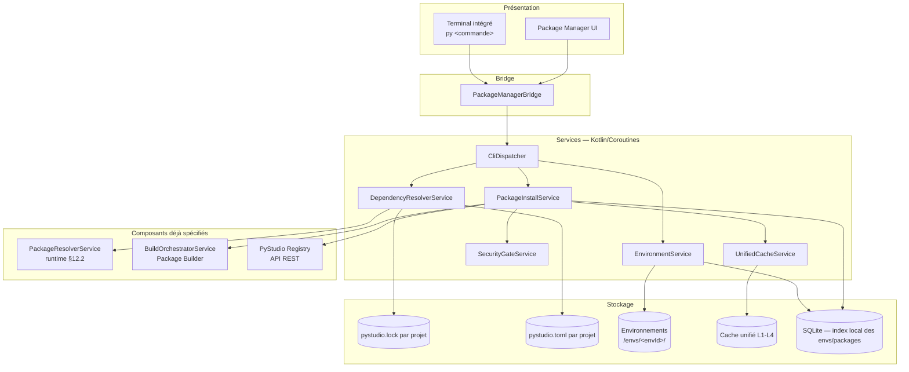
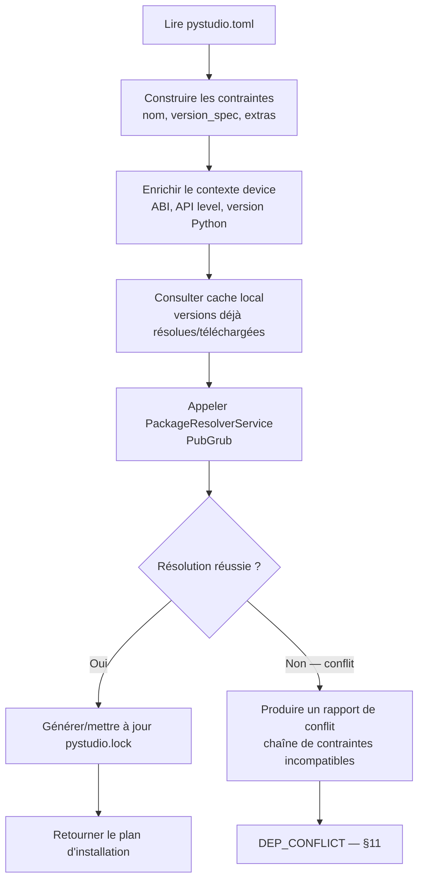
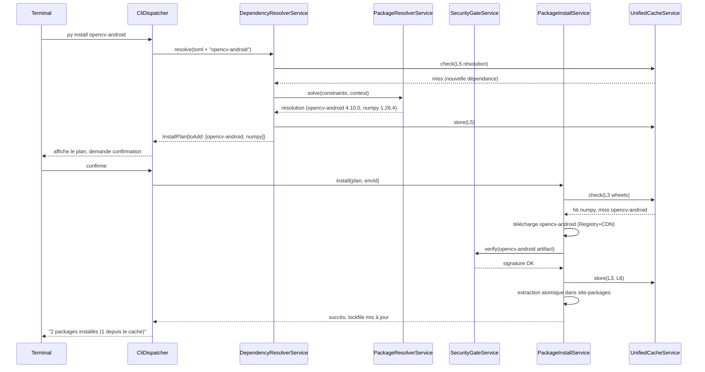
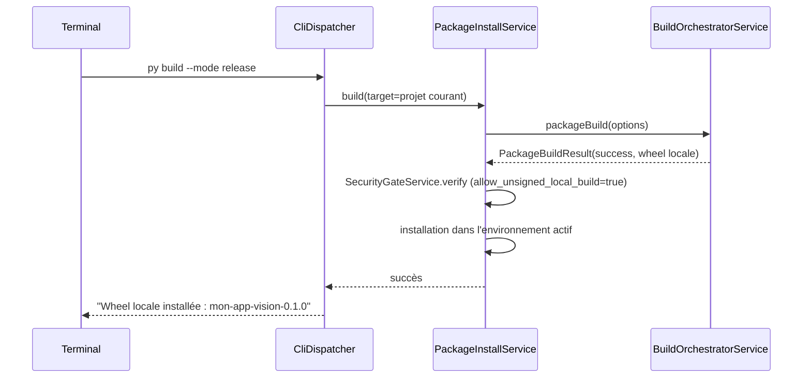
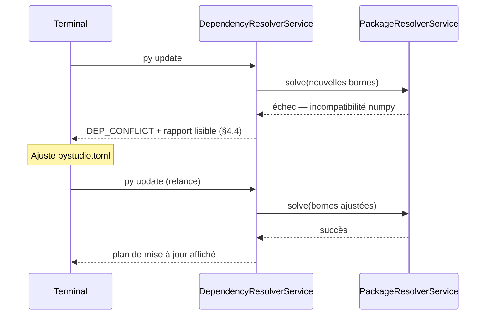

#### [REQ-FUNC-0124] PyStudio Mobile — Spécification du Gestionnaire Python (« py »)

**Type de document :** Spécification technique — Gestionnaire de packages & environnements Python
**Auteur :** Package Manager Architect
**Version :** 1.0
**Date :** 12 juillet 2026
**Portée :** Commandes `py install / uninstall / update / build / search / list` — résolution des dépendances, gestion des versions, environnements, cache, sécurité
**Dépend de :**
- `PyStudio_Mobile_Architecture_Specification.md` (§6-7 pyembed/cxxtoolchain, §13 API internes)
- `PyStudio_Mobile_Python_Runtime_Specification.md` (§6 résolveur PubGrub, §7 wheels, §12 PackageResolverService, ADR-2 CPython 3.13/3.14)
- `PyStudio_Mobile_Android_Package_Builder_Specification.md` (pipeline de build local, cache multi-niveaux L1-L4, taxonomie d'erreurs)
- `PyStudio_Mobile_Package_Registry_Specification.md` (API Simple Repository, signature registre, recherche)

---

##### [REQ-FUNC-0125] Table des matières

0. Principes directeurs
1. Résumé exécutif
2. Architecture globale
3. Commandes
4. Résolution des dépendances
5. Gestion des versions
6. Environnements
7. Cache
8. Sécurité
9. Formats de fichiers
10. API interne (contrats)
11. Gestion des erreurs
12. Diagrammes de séquence
13. Performances
14. Risques & mitigations
15. Glossaire

---

##### [REQ-FUNC-0126] 0. Principes directeurs

| Principe | Description | Implication technique |
|---|---|---|
| **Une seule source de vérité par projet** | Chaque projet a un fichier de verrouillage (`pystudio.lock`) qui fixe exactement ce qui est installé | Toute commande qui modifie l'état passe par une réécriture atomique du lockfile |
| **Reproductibilité stricte** | `py install` sur un projet verrouillé doit produire un environnement identique sur n'importe quel appareil | Résolution déterministe (hash des entrées, tri stable), pas de résolution "au mieux" silencieuse |
| **Hors-ligne d'abord** | Le gestionnaire doit fonctionner sans réseau si le lockfile et le cache le permettent | Toute commande réseau a un mode dégradé explicite (`--offline`), jamais un échec silencieux |
| **Environnements isolés par défaut** | Deux projets ne partagent jamais un environnement sauf demande explicite | Un environnement = un répertoire dédié, un identifiant, un `site-packages` propre |
| **Sécurité non contournable** | Aucune installation sans vérification de signature ou consentement explicite et journalisé | Cohérent avec Registry §6 et Package Builder §8.3 |
| **Transparence des actions** | Toute commande modifiant l'état affiche un plan avant exécution (diff des packages) | `py install`/`update` affichent un résumé "à ajouter / à mettre à jour / à supprimer" avant confirmation (sauf `--yes`) |
| **Compatibilité d'écosystème** | Le vocabulaire et les formats doivent rester proches de `pip`/`poetry`/`uv` pour ne pas dérouter les développeurs Python | Lockfile inspiré de PEP 665/751, tags de wheel `android_<api>_<abi>` (runtime §1) |

---

##### [REQ-FUNC-0127] 1. Résumé exécutif

**`py`** est le gestionnaire de packages et d'environnements Python intégré à PyStudio Mobile, exposé à la fois comme commande dans le terminal intégré de l'IDE et comme service backend consommé par l'UI (Package Manager, Marketplace). Il orchestre six commandes (`install`, `uninstall`, `update`, `build`, `search`, `list`) au-dessus des composants déjà spécifiés : le résolveur PubGrub et le `PackageResolverService` (runtime §6, §12.2), le pipeline de construction locale (Package Builder), et l'API du registre cloud (Registry). Sa valeur ajoutée propre est la couche de **résolution de dépendances**, de **gestion de versions et d'environnements multiples**, de **cache unifié**, et de **sécurité à l'installation** — le tout pensé pour un contexte mobile où le réseau est intermittent et les ressources (CPU, batterie, stockage) sont contraintes.

`py` s'appuie sur un fichier de configuration déclaratif par projet (`pystudio.toml`, dépendances voulues) et un fichier de verrouillage dérivé (`pystudio.lock`, résolution exacte figée) — modèle éprouvé (Poetry/uv/Cargo) adapté aux contraintes Android : wheels taguées par ABI/API level, résolution qui doit tenir compte de l'appareil cible réel, et environnements légers car le stockage mobile reste précieux.

---

##### [REQ-FUNC-0128] 2. Architecture globale



###### [REQ-FUNC-0129] 2.1 Positionnement

`py` est une couche d'orchestration **au-dessus** du `PackageResolverService` (déjà défini côté runtime pour la résolution brute PubGrub) et du `BuildOrchestratorService` (Package Builder, pour la construction locale quand aucune wheel précompilée n'est disponible). Elle ajoute ce qui manquait : la notion de **projet** (`pystudio.toml`/`pystudio.lock`), d'**environnement nommé**, de **cache unifié inter-projets**, et une **interface de commande** cohérente pour l'utilisateur final.

---

##### [REQ-FUNC-0130] 3. Commandes

###### [REQ-FUNC-0131] 3.1 `py install`

```
py install [package[==version]] [--dev] [--env <nom>] [--offline] [--yes]
```

| Cas | Comportement |
|---|---|
| Sans argument | Installe l'intégralité des dépendances figées dans `pystudio.lock` dans l'environnement actif |
| Avec `package` | Ajoute la dépendance à `pystudio.toml`, ré-exécute la résolution (§4), met à jour `pystudio.lock`, installe |
| `--dev` | Ajoute en dépendance de développement (non incluse dans un build `release`) |
| `--env <nom>` | Cible un environnement spécifique plutôt que celui actif (§6) |
| `--offline` | N'utilise que le cache local (L1-L4) et le registre local ; échoue explicitement (`NET_REQUIRED_OFFLINE`) si une donnée manquante nécessiterait le réseau |
| `--yes` | Saute la confirmation du plan d'installation |

###### [REQ-FUNC-0132] 3.2 `py uninstall`

```
py uninstall <package> [--env <nom>] [--yes]
```

Retire le package de `pystudio.toml`, recalcule si des dépendances transitives deviennent orphelines (plus référencées par aucun autre package), propose leur suppression, purge l'entrée du `site-packages` de l'environnement et invalidate le cache d'import.

###### [REQ-FUNC-0133] 3.3 `py update`

```
py update [package] [--env <nom>] [--dry-run]
```

| Cas | Comportement |
|---|---|
| Sans argument | Recalcule la résolution pour toutes les dépendances en respectant les contraintes de `pystudio.toml`, propose les mises à jour compatibles (respect SemVer/PEP 440 des bornes déclarées) |
| Avec `package` | Cible la mise à jour d'un seul package (et ses dépendants si nécessaire) |
| `--dry-run` | Affiche le plan de mise à jour sans l'appliquer ni modifier le lockfile |

###### [REQ-FUNC-0134] 3.4 `py build`

```
py build [--target <package-ou-projet>] [--abi <abi,...>] [--mode debug|release|profile]
```

Délègue directement au **Android Package Builder** (`packageBuild`, cf. sa spécification §12.1) pour compiler des extensions natives locales et produire une wheel installable dans l'environnement courant. `py build` sans `--target` construit le projet courant lui-même (cas d'un projet C/C++ ou d'une extension Python native en développement).

###### [REQ-FUNC-0135] 3.5 `py search`

```
py search <mot-clé> [--abi <abi>] [--category <cat>] [--json]
```

Interroge l'API de recherche du **Registry** (§7 de sa spécification) ; en mode `--offline`, se limite à une recherche par préfixe dans le cache local des métadonnées déjà résolues (moins riche mais fonctionnelle sans réseau).

###### [REQ-FUNC-0136] 3.6 `py list`

```
py list [--env <nom>] [--outdated] [--tree] [--json]
```

| Option | Comportement |
|---|---|
| (aucune) | Liste à plat les packages installés dans l'environnement actif (nom, version, taille) |
| `--outdated` | N'affiche que les packages ayant une version plus récente disponible (nécessite réseau ou cache récent) |
| `--tree` | Affiche l'arbre de dépendances (qui dépend de quoi) |
| `--json` | Sortie machine-lisible pour l'UI Package Manager |

###### [REQ-FUNC-0137] 3.7 Table récapitulative

| Commande | Réseau requis | Modifie le lockfile | Modifie l'environnement |
|---|---|---|---|
| `install` | Non si tout est en cache | Oui (si nouvelle dépendance) | Oui |
| `uninstall` | Non | Oui | Oui |
| `update` | Oui (sauf `--offline`, limité) | Oui | Oui |
| `build` | Non (sources déjà locales) | Non (sauf si `--install` implicite) | Oui si installé après build |
| `search` | Oui (sauf `--offline`, dégradé) | Non | Non |
| `list` | Non (sauf `--outdated`) | Non | Non |

---

##### [REQ-FUNC-0138] 4. Résolution des dépendances

###### [REQ-FUNC-0139] 4.1 Réutilisation du résolveur existant

`DependencyResolverService` **n'implémente pas** son propre solveur : il construit le problème de contraintes à partir de `pystudio.toml` et le délègue au `PackageResolverService` (résolveur **PubGrub**, déjà défini côté runtime §6) qui gère la résolution des versions selon PEP 440. La valeur ajoutée de `py` à ce niveau est la **construction du contexte de résolution** propre à Android :

- Filtrage des candidats par **ABI de l'appareil cible** (ou ABI(s) demandée(s) explicitement via `--abi` pour un `py build` multi-cible).
- Filtrage par **niveau d'API Android** minimal du projet.
- Filtrage par **version Python cible** du projet (3.13/3.14/3.14t, runtime ADR-2).
- Prise en compte des **dépendances déjà satisfaites** par le cache local (préférence de résolution vers ce qui est déjà téléchargé, pour limiter le réseau, sans violer les contraintes de version).

###### [REQ-FUNC-0140] 4.2 Algorithme (vue d'ensemble)



###### [REQ-FUNC-0141] 4.3 Ordre de résolution des sources d'un package (hérité, runtime §7)

`PyPI officiel (android_*_* tag) → PyStudio Registry → Build local (py build)`

`py install` applique cet ordre automatiquement ; `py build` court-circuite intentionnellement vers le build local, y compris si une wheel précompilée existe (cas du développement actif d'une extension).

###### [REQ-FUNC-0142] 4.4 Rapport de conflit

En cas d'échec de résolution, le rapport (inspiré du format lisible de PubGrub/Cargo) explique **pourquoin** aucune solution n'existe, sous forme de chaîne d'incompatibilités, plutôt qu'un simple message "no matching version" :

```
Résolution impossible :
  - projet requiert numpy>=2.0,<3.0
  - opencv-android 4.10.0 requiert numpy>=1.26,<2.0
  - projet requiert opencv-android==4.10.0
  → aucune version de numpy ne satisfait simultanément ces contraintes
Suggestion : assouplir la contrainte sur numpy ou choisir opencv-android<4.10.0
```

###### [REQ-FUNC-0143] 4.5 Extras et dépendances optionnelles

`pystudio.toml` supporte des groupes de dépendances nommés (`[dependencies]`, `[dev-dependencies]`, `[extras.ml]`) ; la résolution est effectuée **par environnement actif** (§6), un environnement ne matérialisant que les groupes qu'il a explicitement activés.

---

##### [REQ-FUNC-0144] 5. Gestion des versions

###### [REQ-FUNC-0145] 5.1 Contraintes supportées (PEP 440)

| Syntaxe | Exemple | Sémantique |
|---|---|---|
| Exacte | `==4.10.0` | Version unique |
| Compatible | `~=4.10` | `>=4.10, ==4.*` |
| Plage | `>=1.26,<2.0` | Intervalle |
| Exclusion | `!=4.9.1` | Exclut une version précise (ex. régression connue) |
| Non bornée | (aucune) | Dernière version compatible avec le reste du graphe |

###### [REQ-FUNC-0146] 5.2 Versions Python cibles du projet

Déclarées dans `pystudio.toml` (`requires-python = ">=3.13"`), cohérent avec l'ADR-2 du runtime. `py install`/`build` refusent une wheel dont le tag Python (`cp313`, `cp314`, `cp314t`) est incompatible, avec message explicite plutôt qu'un échec d'import différé au runtime.

###### [REQ-FUNC-0147] 5.3 Retrait logique (yank) côté Registry

Si une version consommée est marquée `yanked` côté **Registry** (§3.2 de sa spécification, PEP 592), `py update` ne la propose plus par défaut pour une nouvelle résolution, mais `py install` sur un lockfile existant qui la référence déjà continue de fonctionner (reproductibilité, §0) avec un avertissement non-bloquant.

###### [REQ-FUNC-0148] 5.4 Gestion de version de Python elle-même

`py` ne gère pas l'installation de multiples interpréteurs CPython arbitraires comme `pyenv` : le runtime embarqué (3.13/3.14/3.14t) est fourni par l'application PyStudio elle-même (runtime §0). `pystudio.toml` déclare simplement la contrainte de compatibilité, vérifiée à la résolution.

---

##### [REQ-FUNC-0149] 6. Environnements

###### [REQ-FUNC-0150] 6.1 Modèle

Un **environnement** (`env`) est l'équivalent mobile d'un `venv` : un répertoire isolé contenant un `site-packages` propre, un `pystudio.lock` associé, et une référence à une version de runtime Python. Un projet peut avoir plusieurs environnements (ex. `default`, `test`, `experimental-py314t`).

```
/data/user/0/com.pystudio/files/envs/<envId>/
├── env.json                  # métadonnées : version Python, ABI, date de création
├── site-packages/
│   └── <package>/...
├── pystudio.lock             # copie figée liée à cet environnement
└── bin/                      # scripts d'entrée si applicable
```

###### [REQ-FUNC-0151] 6.2 Commandes de gestion d'environnement (extension naturelle, non listée en §3 mais nécessaire)

```
py env create <nom> [--python 3.13|3.14|3.14t]
py env list
py env use <nom>
py env delete <nom>
```

###### [REQ-FUNC-0152] 6.3 Isolation

Chaque environnement a son propre `site-packages` — aucun package n'est partagé par défaut entre environnements, **mais** le cache de wheels (§7, niveau L3) est **partagé globalement** : créer un second environnement avec des dépendances qui se recoupent ne nécessite aucun re-téléchargement, seulement une ré-extraction locale (rapide, opération disque uniquement).

###### [REQ-FUNC-0153] 6.4 Environnement actif

Un seul environnement est « actif » par fenêtre de projet ouverte dans l'IDE (cohérent avec le modèle « un environnement par projet » par défaut décrit dans le runtime). Le terminal intégré affiche l'environnement actif dans son prompt (`(default) $`).

###### [REQ-FUNC-0154] 6.5 Résolution par environnement vs par projet

`pystudio.toml` est **par projet** (déclaratif, une seule vérité sur les dépendances voulues) ; `pystudio.lock` peut différer légèrement **par environnement** si des groupes optionnels (§4.5) sont activés différemment (ex. `test` active `[dev-dependencies]`, `default` ne les active pas).

---

##### [REQ-FUNC-0155] 7. Cache

###### [REQ-FUNC-0156] 7.1 Réutilisation du cache multi-niveaux existant

`py` **réutilise intégralement** le cache L1-L4 déjà défini dans la spécification du Package Builder (sources / objets de compilation / wheels résolues / artefacts signés) via `UnifiedCacheService` — il n'introduit pas un cache parallèle mais une **vue supplémentaire** orientée "packages installés" :

| Niveau ajouté par `py` | Contenu | Portée |
|---|---|---|
| **L5 — Résolutions** | Résultats de résolution PubGrub déjà calculés (clé = hash du `pystudio.toml` + contexte device) | Par projet, invalidé si `pystudio.toml` change |
| **L6 — Extractions d'environnement** | `site-packages` déjà matérialisés pour une combinaison exacte de packages | Partagé entre environnements ayant un lockfile identique (hash du lockfile) |

###### [REQ-FUNC-0157] 7.2 Bénéfice pour `py install`

Un `py install` sur un projet déjà résolu et déjà présent en cache L3 (wheels) et L6 (extraction) devient une opération **quasi instantanée et hors-ligne** : aucun appel réseau, aucune résolution PubGrub recalculée, simple lien/copie de `site-packages` déjà matérialisé.

###### [REQ-FUNC-0158] 7.3 Politique d'éviction

Alignée sur Package Builder §10.3 : L5/L6 sont évincés en priorité (peu coûteux à recalculer/réextraire) avant L3 (wheels, coûteuses à re-télécharger/reconstruire), jamais avant L1 (sources brutes, les moins critiques).

###### [REQ-FUNC-0159] 7.4 Commande de maintenance

```
py cache info                 # tailles par niveau, statistiques de hit
py cache clean [--level L1-L6] [--older-than <durée>]
```

---

##### [REQ-FUNC-0160] 8. Sécurité

###### [REQ-FUNC-0161] 8.1 Vérification à l'installation

Toute installation (`py install`, `py update`) applique la chaîne de vérification déjà définie côté Registry/Package Builder avant d'écrire quoi que ce soit dans `site-packages` :

1. Vérification du hash SHA-256 de l'artefact contre le `pystudio.lock` (si le package y figure déjà) ou contre la réponse de résolution (nouvelle dépendance).
2. Vérification de la signature du registre (obligatoire, non contournable — Registry §6.1).
3. Vérification de la signature développeur si présente (affichage du niveau de confiance dans `py install --verbose`, jamais bloquant en soi).
4. Pour une wheel construite localement (`py build`), vérification que l'artefact provient bien du `BuildOrchestratorService` de la session courante (référence de `buildId` dans le manifeste, Package Builder §7.3).

###### [REQ-FUNC-0162] 8.2 Politique de confiance configurable

| Réglage (`pystudio.toml [security]`) | Défaut | Effet |
|---|---|---|
| `allow_unsigned_local_build` | `true` | Les artefacts de `py build` sans signature développeur restent installables (usage local, cohérent Package Builder §8.1) |
| `allow_unsigned_registry` | `false`, non modifiable | La signature registre est **toujours** obligatoire, ce réglage n'existe pas comme option désactivable — seule une action explicite hors `pystudio.toml` (flag `--i-understand-the-risk`, journalisée) permet un contournement en développement pur |
| `require_developer_signature` | `false` | Si activé, refuse l'installation de tout package du Registry sans signature développeur en plus de celle du registre |

###### [REQ-FUNC-0163] 8.3 Sandbox d'installation

L'extraction d'une wheel (y compris exécution de scripts `.dist-info` légitimes comme entry points) se fait dans un répertoire temporaire avant `rename()` atomique (Package Builder §9.2) — aucune exécution de code arbitraire pendant l'installation elle-même ; `py` n'exécute jamais de `setup.py` arbitraire (modèle wheel uniquement, pas de build à l'installation côté device, cohérent avec le choix wheels-first du runtime).

###### [REQ-FUNC-0164] 8.4 Détection d'anomalies locales

`py list --outdated` et `py update` signalent si un package installé ne correspond plus au hash attendu par le `pystudio.lock` (corruption ou modification manuelle du `site-packages`), avec proposition de réparation (`py install --repair`).

###### [REQ-FUNC-0165] 8.5 Journalisation

Toute opération de sécurité significative (contournement de signature, résolution avec avertissement de version yankée, réparation d'environnement corrompu) est journalisée dans un fichier d'audit local (`pystudio-security.log`), consultable mais non modifiable par l'utilisateur depuis l'IDE.

---

##### [REQ-FUNC-0166] 9. Formats de fichiers

###### [REQ-FUNC-0167] 9.1 `pystudio.toml` (déclaratif, édité par l'utilisateur)

```toml
[project]
name = "mon-app-vision"
requires-python = ">=3.13"

[dependencies]
opencv-android = "~=4.10"
numpy = ">=1.26,<2.0"

[dev-dependencies]
pytest = "*"

[extras.ml]
torch-mobile = ">=2.4"

[security]
allow_unsigned_local_build = true
require_developer_signature = false
```

###### [REQ-FUNC-0168] 9.2 `pystudio.lock` (généré, ne pas éditer manuellement)

```json
{
  "lock_version": 1,
  "generated_at": "2026-07-12T08:00:00Z",
  "python_target": "3.13",
  "resolution_context": {
    "abi": "arm64-v8a",
    "api_level": 34
  },
  "packages": [
    {
      "name": "opencv-android",
      "version": "4.10.0",
      "source": "pystudio_registry",
      "sha256": "e3b0c4...",
      "wheel_tag": "cp313-cp313-android_21_arm64_v8a",
      "signature_verified": true,
      "dependencies": ["numpy"]
    },
    {
      "name": "numpy",
      "version": "1.26.4",
      "source": "pypi_official",
      "sha256": "af12ab...",
      "wheel_tag": "cp313-cp313-android_21_arm64_v8a",
      "signature_verified": true,
      "dependencies": []
    }
  ]
}
```

###### [REQ-FUNC-0169] 9.3 `env.json` (par environnement)

```json
{
  "env_id": "default",
  "python_version": "3.13.2",
  "target_abi": "arm64-v8a",
  "created_at": "2026-06-01T09:00:00Z",
  "lockfile_hash": "b7e2..."
}
```

---

##### [REQ-FUNC-0170] 10. API interne (contrats)

###### [REQ-FUNC-0171] 10.1 Bridge TypeScript

```typescript
export interface PyStudioPackageManagerBridge {
  runCommand(command: PyCommand): Promise<PyCommandResult>;
  onCommandOutput(callback: (chunk: PyOutputChunk) => void): () => void;

  createEnv(options: CreateEnvOptions): Promise<EnvInfo>;
  listEnvs(): Promise<EnvInfo[]>;
  useEnv(envId: string): Promise<void>;
  deleteEnv(envId: string): Promise<void>;
}

export type PyCommand =
  | { type: 'install'; package?: string; dev?: boolean; env?: string; offline?: boolean; yes?: boolean }
  | { type: 'uninstall'; package: string; env?: string; yes?: boolean }
  | { type: 'update'; package?: string; env?: string; dryRun?: boolean }
  | { type: 'build'; target?: string; abis?: Abi[]; mode?: 'debug' | 'release' | 'profile' }
  | { type: 'search'; query: string; abi?: Abi; category?: string }
  | { type: 'list'; env?: string; outdated?: boolean; tree?: boolean };

export interface PyCommandResult {
  success: boolean;
  plan?: InstallPlan;             // résumé avant confirmation (install/update/uninstall)
  packages?: PackageSummary[];    // pour list/search
  lockfileChanged: boolean;
  errorCode?: PyErrorCode;        // cf. §11
}

export interface InstallPlan {
  toAdd: PackageSummary[];
  toUpdate: { from: PackageSummary; to: PackageSummary }[];
  toRemove: PackageSummary[];
}

export interface PackageSummary {
  name: string;
  version: string;
  source: 'pypi_official' | 'pystudio_registry' | 'local_build';
  sizeBytes: number;
  signatureVerified: boolean;
}

export interface EnvInfo {
  envId: string;
  pythonVersion: string;
  targetAbi: Abi;
  active: boolean;
}
```

###### [REQ-FUNC-0172] 10.2 Interface Kotlin (services)

```kotlin
interface DependencyResolverService {
    suspend fun resolve(projectToml: PystudioToml, context: ResolutionContext): ResolutionOutcome
}

sealed class ResolutionOutcome {
    data class Success(val lockfile: PystudioLock) : ResolutionOutcome()
    data class Conflict(val report: ConflictReport) : ResolutionOutcome()
}

interface EnvironmentService {
    suspend fun create(name: String, pythonVersion: PythonVersion, abi: Abi): EnvInfo
    suspend fun activate(envId: String)
    suspend fun delete(envId: String)
    suspend fun list(): List<EnvInfo>
}

interface PackageInstallService {
    suspend fun install(plan: InstallPlan, envId: String): InstallOutcome
    suspend fun uninstall(packageName: String, envId: String): InstallOutcome
}

interface SecurityGateService {
    suspend fun verify(artifact: ArtifactRef): VerificationResult
}
```

###### [REQ-FUNC-0173] 10.3 Table récapitulative des délégations

| Commande `py` | Service `py` | Délègue à |
|---|---|---|
| `install` (résolution) | `DependencyResolverService` | `PackageResolverService` (runtime §12.2) |
| `install` (téléchargement) | `PackageInstallService` | API Registry (`GET /simple/{name}/`) + CDN |
| `build` | `PackageInstallService` | `BuildOrchestratorService.packageBuild` (Package Builder §12.1) |
| `install`/`update` (vérification) | `SecurityGateService` | Vérification signature (Registry §6, Package Builder §8) |
| `search` | — | API Registry `GET /v1/search` |

---

##### [REQ-FUNC-0174] 11. Gestion des erreurs

###### [REQ-FUNC-0175] 11.1 Taxonomie des codes d'erreur

| Code | Commande | Cause typique | Recoverable |
|---|---|---|---|
| `DEP_CONFLICT` | install/update | Contraintes de version incompatibles (§4.4) | Oui — assouplir contraintes, rapport fourni |
| `DEP_NOT_FOUND` | install/search | Package inexistant sur aucune source | Non |
| `NET_REQUIRED_OFFLINE` | install/update/search | Donnée manquante en cache alors que `--offline` est actif | Oui — relancer sans `--offline` |
| `SIG_VERIFICATION_FAILED` | install/update | Signature registre invalide (Registry §6, Package Builder §8.3) | Non (sauf override explicite journalisé) |
| `HASH_MISMATCH` | install | Corruption réseau ou cache | Oui — invalider cache, re-télécharger |
| `ENV_NOT_FOUND` | toutes (avec `--env`) | Environnement inexistant | Oui — `py env create` |
| `ENV_LOCK_CORRUPTED` | install/list | `pystudio.lock` illisible ou incohérent avec `env.json` | Oui — `py install --repair` |
| `BUILD_FAILED` | build | Échec du pipeline Package Builder (codes détaillés dans sa propre spec §13.2) | Dépend du sous-code remonté |
| `WHEEL_TAG_INCOMPATIBLE` | install | Wheel trouvée mais ABI/version Python incompatible avec le projet | Non — changer de version ou de contrainte |
| `YANKED_VERSION_WARNING` | install/update | Version verrouillée marquée `yanked` côté Registry | Oui (avertissement non-bloquant) |

###### [REQ-FUNC-0176] 11.2 Principe de remontée

Toute erreur provenant d'un service délégué (`PackageResolverService`, `BuildOrchestratorService`, API Registry) est **traduite** en un code `Py*`/réutilisé tel quel si déjà suffisamment explicite (ex. les codes du Package Builder §13.2 remontent directement pour `py build`), afin que l'utilisateur du terminal voie toujours un message actionnable plutôt qu'une erreur réseau ou un code de sortie de processus brut.

---

##### [REQ-FUNC-0177] 12. Diagrammes de séquence

###### [REQ-FUNC-0178] 12.1 `py install <package>` — cas nominal avec cache partiel



###### [REQ-FUNC-0179] 12.2 `py build` puis installation locale



###### [REQ-FUNC-0180] 12.3 Conflit de résolution



---

##### [REQ-FUNC-0181] 13. Performances

| Levier | Détail |
|---|---|
| **Résolution incrémentale** | Le cache L5 évite de relancer PubGrub si `pystudio.toml` et le contexte device n'ont pas changé depuis la dernière résolution réussie |
| **Extraction partagée (L6)** | Deux environnements avec un lockfile identique (hash) partagent l'extraction physique via lien dur/copie-sur-écriture plutôt qu'une duplication complète sur disque |
| **Téléchargements parallèles** | `py install` télécharge les artefacts manquants en parallèle borné (cohérent avec le throttling thermique/réseau déjà défini côté Package Builder) |
| **Feedback progressif** | `onCommandOutput` diffuse la progression en flux (résolution → téléchargement → vérification → extraction) plutôt qu'un blocage silencieux jusqu'au résultat final |
| **`list`/`search` en local** | Répond depuis l'index SQLite local sans réseau dans le cas commun (liste des packages installés), réseau uniquement pour `--outdated`/recherche registre |

---

##### [REQ-FUNC-0182] 14. Risques & mitigations

| Risque | Impact | Mitigation |
|---|---|---|
| Résolution PubGrub lente sur un graphe de dépendances profond (ex. stack ML complète) | Moyen | Cache L5 agressif, réutilisation des résolutions précédentes comme point de départ heuristique |
| Divergence entre `pystudio.lock` et l'état réel du `site-packages` (édition manuelle, crash pendant install) | Moyen | Vérification de hash à `py list`/`install --repair` (§8.4) |
| Explosion du nombre d'environnements sur un device au stockage limité | Faible-moyen | Cache L6 partagé par hash de lockfile, commande `py env delete` mise en avant dans l'UI Package Manager |
| Confusion utilisateur entre `py install <pkg>` (Registry/PyPI) et `py build` (local) pour un même nom de package en développement actif | Faible | Message explicite si une version locale plus récente que celle du Registry est détectée, proposant `py build` comme alternative |
| Dépendance à la disponibilité du Registry pour `py search`/`update` | Faible (device reste fonctionnel offline-first, cf. Registry §0) | Mode `--offline` explicite, cache de métadonnées de recherche best-effort |

---

##### [REQ-FUNC-0183] 15. Glossaire

| Terme | Définition |
|---|---|
| **`pystudio.toml`** | Fichier déclaratif des dépendances voulues par un projet (édité par l'utilisateur) |
| **`pystudio.lock`** | Fichier généré figeant la résolution exacte (versions, hash, source) — reproductibilité |
| **PubGrub** | Algorithme de résolution de dépendances utilisé par le `PackageResolverService` (runtime §6) |
| **Environnement (`env`)** | Espace isolé (site-packages propre) associé à un projet, équivalent mobile d'un `venv` |
| **Extra** | Groupe de dépendances optionnelles activable sélectivement par environnement |
| **Yank** | Retrait logique d'une version côté Registry (PEP 592) — n'empêche pas les lockfiles existants de continuer à fonctionner |
| **L5/L6** | Niveaux de cache ajoutés par `py` au-dessus du cache L1-L4 du Package Builder (résolutions et extractions d'environnement) |

---

*Fin de la spécification.*

