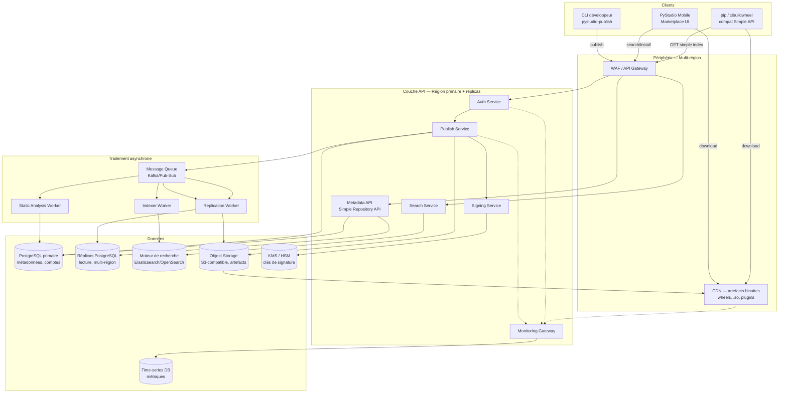
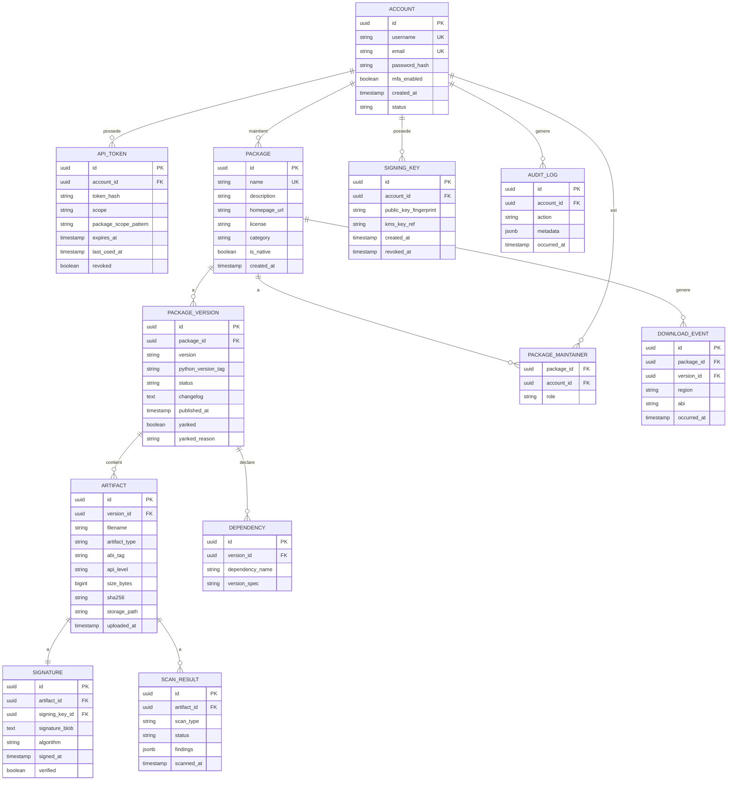
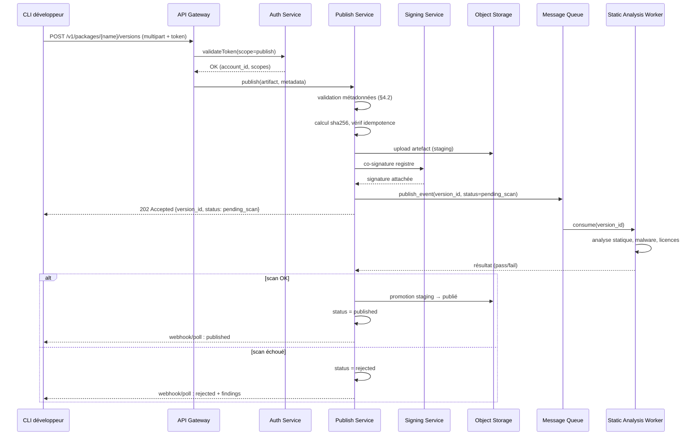
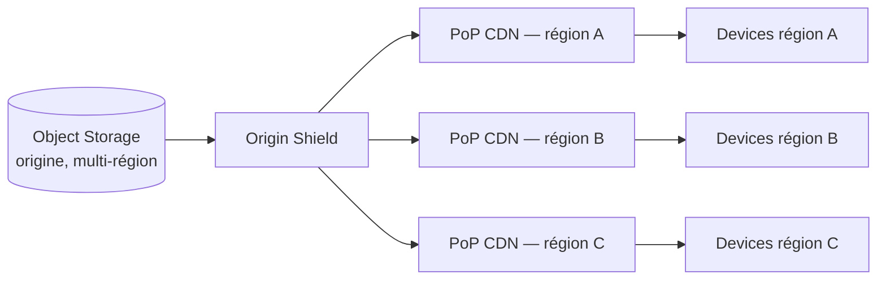
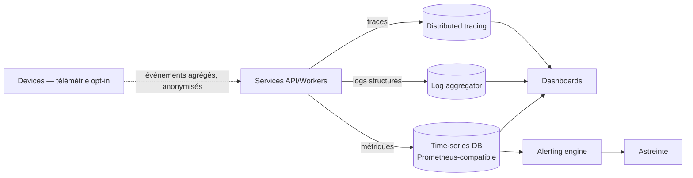

#### [REQ-FUNC-0184] PyStudio Mobile — Spécification du Registre de Packages (« PyStudio Registry »)

**Type de document :** Spécification technique — Service cloud (registre de packages type PyPI)
**Auteur :** Cloud Architect
**Version :** 1.0
**Date :** 12 juillet 2026
**Portée :** Publication, authentification, signature, recherche, CDN, réplication, monitoring — service cloud opt-in complétant le registre privé PyStudio déjà référencé dans l'architecture (§2, §12) et le runtime (§7, ordre de résolution PyPI → registre privé → build local)
**Dépend de :** `PyStudio_Mobile_Architecture_Specification.md` (§12 Scalabilité & Marketplace, §13 APIs internes), `PyStudio_Mobile_Python_Runtime_Specification.md` (§7 Wheels, tags `android_<api>_<abi>`), `PyStudio_Mobile_Android_Package_Builder_Specification.md` (§7-8 construction et signature des wheels, produites côté device puis publiées ici)

---

##### [REQ-FUNC-0185] Table des matières

0. Principes directeurs
1. Résumé exécutif
2. Architecture globale
3. Modèle de données
4. Publication de packages
5. Authentification & autorisation
6. Signature & chaîne de confiance
7. Recherche
8. CDN & distribution
9. Réplication & haute disponibilité
10. Monitoring & observabilité
11. API REST
12. Sécurité transverse
13. Scalabilité & capacité
14. Risques techniques & mitigations
15. Glossaire

---

##### [REQ-FUNC-0186] 0. Principes directeurs

| Principe | Description | Implication technique |
|---|---|---|
| **Complément, jamais dépendance bloquante** | Le device fonctionne offline-first (architecture §0) ; le registre est un service opt-in qui enrichit l'expérience sans jamais être un point de blocage | Cache local complet côté device (Package Builder §10), dégradation gracieuse si le registre est inaccessible |
| **Confiance vérifiable, pas supposée** | Aucun artefact n'est installable sans preuve cryptographique de provenance | Signature obligatoire à la publication, vérification obligatoire à l'installation (cohérent Package Builder §8.3) |
| **PyPI-compatible en surface, spécialisé en profondeur** | Les développeurs et outils existants (`pip`, `cibuildwheel`) doivent pouvoir interagir avec des concepts familiers | API respectant autant que possible le **Simple Repository API** (PEP 503/691) en plus de l'API REST enrichie propre à PyStudio |
| **Séparation lecture/écriture** | Les opérations de lecture (recherche, téléchargement) dominent largement en volume sur l'écriture (publication) | Architecture read-heavy : CDN agressif en lecture, chemin d'écriture isolé et plus strict |
| **Multi-région par défaut** | Les utilisateurs mobiles sont globalement distribués et sensibles à la latence et à la donnée mobile | Réplication multi-région, CDN en périphérie, réplicas en lecture proches de l'utilisateur |
| **Observabilité de bout en bout** | Un incident de disponibilité du registre affecte directement l'expérience offline-first du device (résolution de dépendances) | Monitoring corrélé publication → CDN → device, alerting proactif avant dégradation perçue |
| **Idempotence des publications** | Republier un même artefact (même hash) ne doit jamais créer d'état incohérent | Clé de version immuable, `PUT`-like idempotent, rejet explicite des re-publications avec contenu différent sous même version |

---

##### [REQ-FUNC-0187] 1. Résumé exécutif

**PyStudio Registry** est le service cloud opt-in qui héberge, indexe, sert et sécurise les packages (wheels Android taguées `android_<api>_<abi>`, plugins, thèmes, templates) que le **Android Package Builder** produit côté device et que l'IDE consomme via le **Marketplace**. Il joue le rôle de « registre privé PyStudio » déjà positionné en second rang après PyPI officiel dans l'ordre de résolution du runtime (`PYPI_OFFICIAL → PYSTUDIO_REGISTRY → LOCAL_BUILD`), et sert également l'ensemble non-Python du marketplace (plugins JS sandboxés, thèmes, templates de projet).

L'architecture retenue est un service multi-région composé de : une **API de publication** (chemin d'écriture strict, authentification forte, signature obligatoire), un **index de métadonnées** compatible Simple Repository API (PEP 503/691) pour l'interopérabilité `pip`, un **moteur de recherche** dédié pour l'expérience Marketplace de l'IDE, un **CDN** en périphérie pour la distribution des artefacts binaires, une **réplication multi-région** avec promotion de leader automatisée, et une chaîne complète de **monitoring** couvrant la publication, la propagation CDN et la consommation côté device. Le tout est conçu pour un ratio lecture/écriture très asymétrique typique d'un registre de packages (des millions de téléchargements pour quelques milliers de publications quotidiennes).

---

##### [REQ-FUNC-0188] 2. Architecture globale



###### [REQ-FUNC-0189] 2.1 Vue par couches

| # | Couche | Technologies indicatives | Rôle |
|---|---|---|---|
| 1 | Périphérie | CDN multi-CDN (origin shield), WAF/API Gateway | Distribution des artefacts, protection DDoS/abus |
| 2 | API | Services stateless conteneurisés (Kubernetes), autoscaling horizontal | Publication, auth, signature, recherche, métadonnées |
| 3 | Asynchrone | Message queue durable, workers autoscalés | Scan de sécurité, indexation, réplication différée |
| 4 | Données | PostgreSQL (source de vérité), Object Storage (binaires), moteur de recherche, KMS/HSM, TSDB | Persistance, recherche, secrets, métriques |

###### [REQ-FUNC-0190] 2.2 Positionnement vis-à-vis des specs existantes

Le Registry est le service qui **reçoit** les artefacts produits par l'étape 4 (construction wheel) et 5 (signature locale optionnelle) du Package Builder, et qui **ré-signe ou co-signe** avec la clé de confiance du registre avant publication effective (§6). Côté device, le `PackageResolverService` (runtime §12.2) et le `PackageBridge` interrogent ce service en second rang après PyPI officiel — aucune modification de leurs contrats n'est nécessaire, le Registry expose une API compatible.

---

##### [REQ-FUNC-0191] 3. Modèle de données

###### [REQ-FUNC-0192] 3.1 Schéma relationnel (PostgreSQL — source de vérité)



###### [REQ-FUNC-0193] 3.2 Notes sur les tables clés

| Table | Points d'attention |
|---|---|
| `PACKAGE_VERSION` | `(package_id, version)` unique. Le champ `yanked` implémente le retrait logique (PEP 592) : une version « yankée » reste installable explicitement mais n'est plus proposée par défaut par le résolveur |
| `ARTIFACT` | `sha256` unique par artefact — garantit l'idempotence de publication (§0) ; un upload avec même nom de fichier mais hash différent est rejeté (`409 Conflict`) |
| `SIGNATURE` | Séparée de `ARTIFACT` pour permettre une re-signature (rotation de clé, §6.4) sans réémettre l'artefact binaire |
| `SCAN_RESULT` | `scan_type` ∈ {`static_analysis`, `malware`, `license_check`, `dependency_confusion`} — un artefact n'est promu `status = published` que si tous les scans bloquants sont `passed` |
| `DOWNLOAD_EVENT` | Volumétrie élevée — candidate à un stockage en colonnes séparé (TSDB ou partitionnement mensuel) plutôt qu'une table transactionnelle classique |

###### [REQ-FUNC-0194] 3.3 Index de recherche (document, hors PostgreSQL)

```json
{
  "package_id": "uuid",
  "name": "opencv-android",
  "description": "OpenCV compiled for Android ABIs",
  "keywords": ["computer-vision", "image-processing", "native"],
  "category": "scientific",
  "is_native": true,
  "supported_abis": ["arm64-v8a", "armeabi-v7a", "x86_64"],
  "latest_version": "4.10.0",
  "download_count_30d": 128340,
  "maintainer_names": ["opencv-team"],
  "quality_score": 0.92,
  "last_published_at": "2026-07-01T10:00:00Z"
}
```

---

##### [REQ-FUNC-0195] 4. Publication de packages

###### [REQ-FUNC-0196] 4.1 Flux de publication



###### [REQ-FUNC-0197] 4.2 Validation des métadonnées à la publication

| Vérification | Rejet si |
|---|---|
| Nom de package | Ne respecte pas la regex PEP 508, ou en collision typosquattante avec un package à forte popularité (`dependency_confusion` scan) |
| Tag ABI/API | Ne correspond pas au format `android_<api-level>_<abi>` (runtime §1) |
| Version | Ne suit pas PEP 440, ou version déjà publiée avec un hash différent |
| Taille artefact | Dépasse le quota du compte (anti-abus, §12) |
| Dépendances déclarées | Références circulaires détectées, ou dépendance vers un package inexistant sans confirmation explicite |
| Licence | Absente ou non reconnue (SPDX) — avertissement non-bloquant, `published` mais signalé dans l'UI Marketplace |

###### [REQ-FUNC-0198] 4.3 Statuts du cycle de vie d'une version

`draft → pending_scan → published | rejected → yanked (optionnel, réversible) → deleted (rare, DMCA/légal uniquement)`

---

##### [REQ-FUNC-0199] 5. Authentification & autorisation

###### [REQ-FUNC-0200] 5.1 Mécanismes supportés

| Mécanisme | Usage | Détails |
|---|---|---|
| **Tokens API scopés** | Publication automatisée (CI), CLI développeur | `pystudio_pub_<random>`, scope `publish:<package-pattern>`, hashé (jamais stocké en clair, cf. `API_TOKEN.token_hash`) |
| **OAuth2 / OIDC** | Connexion interactive (Marketplace UI, dashboard développeur) | Authorization Code + PKCE, intégration SSO entreprise optionnelle |
| **MFA obligatoire** | Comptes avec droits de publication sur packages à forte popularité (> seuil de téléchargements) | TOTP ou clé matérielle (WebAuthn) |
| **Anonyme (lecture seule)** | Recherche, téléchargement de packages publics | Rate-limité par IP (§12) |

###### [REQ-FUNC-0201] 5.2 Modèle d'autorisation (RBAC par package)

| Rôle (`PACKAGE_MAINTAINER.role`) | Droits |
|---|---|
| `owner` | Publier, yanker, gérer les mainteneurs, transférer la propriété |
| `maintainer` | Publier, yanker |
| `viewer` | Consultation des statistiques privées uniquement |

###### [REQ-FUNC-0202] 5.3 Scopes de token

Un token est limité par un `package_scope_pattern` (ex. `mycompany-*`) — un token compromis ne peut jamais publier en dehors de son périmètre déclaré, limitant le rayon d'explosion d'une fuite de credentials (cohérent avec le principe « confiance vérifiable » §0).

---

##### [REQ-FUNC-0203] 6. Signature & chaîne de confiance

###### [REQ-FUNC-0204] 6.1 Modèle en double signature

Chaque artefact publié porte **deux signatures indépendantes** :

1. **Signature du développeur** (optionnelle mais recommandée), produite côté device par le Package Builder (§8 de sa spécification) ou côté CI via la clé du compte (`SIGNING_KEY`).
2. **Signature du registre** (obligatoire), apposée par le `Signing Service` après passage des scans (§4.1), prouvant que l'artefact a traversé le pipeline de vérification PyStudio.

Le device, à l'installation (Package Builder §8.3, §9.2), vérifie **au minimum** la signature du registre ; la signature développeur, si présente, est vérifiée en complément et affichée dans l'UI Marketplace comme signal de confiance additionnel (« Publié et vérifié par `opencv-team` »).

###### [REQ-FUNC-0205] 6.2 Gestion des clés (KMS/HSM)

- Les clés privées du registre ne quittent **jamais** le KMS/HSM en clair : toute opération de signature est un appel `Sign(digest)` distant, jamais une extraction de clé.
- Rotation programmée (ex. annuelle) avec chevauchement : les artefacts déjà signés restent vérifiables via l'historique de clés publiques (`SIGNING_KEY` conservée même après `revoked_at`).
- Séparation stricte entre la clé de signature « registre » (une par environnement : staging/prod) et les clés de comptes développeurs (une paire par compte, générée côté client, seule la clé publique est envoyée au registre).

###### [REQ-FUNC-0206] 6.3 Format de signature

Approche **Sigstore-compatible** (transparence via log d'audit append-only, cohérent avec la mention Sigstore-like du Package Builder §8.1) : signature détachée + certificat + entrée dans un **transparency log** consultable, permettant à quiconque de vérifier qu'un artefact donné a bien été signé par le registre à un instant donné, sans autorité de confiance opaque.

###### [REQ-FUNC-0207] 6.4 Révocation

En cas de compromission d'une clé de compte développeur : révocation immédiate (`SIGNING_KEY.revoked_at`), invalidation de la confiance affichée pour les artefacts déjà publiés avec cette clé (mais pas retrait automatique — décision manuelle de l'équipe de confiance/sécurité, cf. §12).

---

##### [REQ-FUNC-0208] 7. Recherche

###### [REQ-FUNC-0209] 7.1 Pipeline d'indexation

Toute publication réussie (`status = published`) déclenche un événement asynchrone consommé par l'`Indexer Worker`, qui met à jour le document de recherche (§3.3) dans le moteur (Elasticsearch/OpenSearch) : dénormalisation des métadonnées PostgreSQL + enrichissement (score de qualité, décompte de téléchargements agrégé).

###### [REQ-FUNC-0210] 7.2 Fonctionnalités de recherche

| Fonctionnalité | Mécanisme |
|---|---|
| Recherche textuelle (nom, description, mots-clés) | Analyse full-text avec pondération (nom > mots-clés > description) |
| Filtres facettés | Par ABI supportée, catégorie, licence, présence de signature développeur |
| Tri | Pertinence (défaut), popularité (téléchargements 30j), date de publication, score de qualité |
| Auto-complétion | Index de préfixes dédié pour la barre de recherche Marketplace UI |
| Recommandations liées | « Packages utilisant des dépendances similaires » — basé sur le graphe `DEPENDENCY` |

###### [REQ-FUNC-0211] 7.3 Score de qualité (`quality_score`)

Composite non-exhaustif : présence de tests CI déclarés, couverture des trois ABI, fraîcheur de la dernière publication, absence de vulnérabilités connues (`SCAN_RESULT`), taux de succès d'installation reporté par les devices (télémétrie opt-in, §10).

---

##### [REQ-FUNC-0212] 8. CDN & distribution

###### [REQ-FUNC-0213] 8.1 Stratégie de distribution



- **Origin shield** : une seule couche de cache intermédiaire absorbe les requêtes vers l'origine, évitant qu'un pic de popularité (« thundering herd » sur une release populaire) ne sature l'Object Storage.
- **Cache immuable** : chaque artefact est adressé par son `sha256` dans l'URL de CDN (`/artifacts/<sha256>/<filename>`) — `Cache-Control: immutable, max-age=31536000`, cohérent avec l'idempotence de publication (§0).
- **Métadonnées non-cachées agressivement** : l'index Simple Repository (liste des versions disponibles) a un TTL court (60-300s) pour refléter rapidement les nouvelles publications et les `yank`.

###### [REQ-FUNC-0214] 8.2 Compatibilité Simple Repository API (PEP 503/691)

```
GET /simple/{package}/
→ HTML (PEP 503) ou JSON (PEP 691, Accept: application/vnd.pypi.simple.v1+json)
   Liste des artefacts disponibles avec liens directs CDN + hash sha256 en fragment d'URL
```

Permet à `pip install --index-url https://registry.pystudio.dev/simple/ <package>` de fonctionner nativement, et à `cibuildwheel`/outils tiers déjà familiers avec PyPI de s'interfacer sans adaptation.

###### [REQ-FUNC-0215] 8.3 Résilience réseau mobile

Les téléchargements CDN supportent nativement les requêtes `Range` (reprise, cohérent Package Builder §4.2) et la négociation de compression (les wheels étant déjà `ZIP_STORED` en interne, la compression de transport HTTP reste bénéfique et n'affecte pas le `mmap()` local une fois décompressée sur device).

---

##### [REQ-FUNC-0216] 9. Réplication & haute disponibilité

###### [REQ-FUNC-0217] 9.1 Topologie multi-région

| Composant | Stratégie de réplication |
|---|---|
| **PostgreSQL** | Primaire dans une région, réplicas en lecture asynchrones dans chaque région servie ; promotion automatique d'un réplica en cas de panne du primaire (< 60s de RTO cible) |
| **Object Storage** | Réplication cross-région native (type S3 CRR) avec vérification de checksum post-réplication |
| **Moteur de recherche** | Cluster avec réplicas de shards répartis sur au moins 2 zones de disponibilité par région |
| **Message Queue** | Réplication intra-région multi-broker (facteur 3), pas de réplication cross-région (les événements sont ré-émis si nécessaire depuis PostgreSQL, source de vérité) |

###### [REQ-FUNC-0218] 9.2 Objectifs de service

| Métrique | Cible |
|---|---|
| Disponibilité en lecture (recherche + téléchargement) | 99.95% |
| Disponibilité en écriture (publication) | 99.9% (tolère une dégradation plus longue, moins critique que la lecture, cf. §0) |
| RPO (perte de données max en cas de panne primaire) | < 5 minutes (réplication asynchrone PostgreSQL) |
| RTO (temps de reprise) | < 60 secondes pour bascule lecture, < 5 minutes pour bascule écriture |

###### [REQ-FUNC-0219] 9.3 Cohérence

Le chemin d'écriture (publication) est **fortement cohérent** sur le primaire PostgreSQL. Le chemin de lecture accepte une **cohérence à terme** (réplicas, CDN, index de recherche) avec un délai de propagation cible < 5 minutes — acceptable car un package fraîchement publié passe de toute façon par le scan asynchrone (§4.1) avant d'être réellement consommable.

---

##### [REQ-FUNC-0220] 10. Monitoring & observabilité

###### [REQ-FUNC-0221] 10.1 Métriques clés par domaine

| Domaine | Métriques | Alerting |
|---|---|---|
| **Publication** | Taux de succès/échec par étape, latence p50/p95/p99 du pipeline, taux de rejet par scan | Alerte si taux d'échec > 5% sur 15 min |
| **Authentification** | Taux d'échec de connexion, tentatives MFA échouées, tokens révoqués utilisés | Alerte immédiate sur pic de tentatives (brute-force) |
| **Signature** | Latence d'appel KMS, taux d'échec de signature, âge de la clé active | Alerte si latence KMS > seuil (dépendance externe critique) |
| **Recherche** | Latence de requête, taux de hit du cache d'auto-complétion, fraîcheur de l'index (délai publication → indexé) | Alerte si fraîcheur > 10 min |
| **CDN** | Taux de hit/miss par PoP, latence de première octet (TTFB), taux d'erreur 4xx/5xx par région | Alerte si hit ratio < 90% (dégradation origine) |
| **Réplication** | Lag de réplication PostgreSQL (secondes), delta de checksum Object Storage | Alerte si lag > 30s |
| **Consommation device** (télémétrie opt-in) | Taux de succès d'installation reporté, taux de fallback vers build local | Alerte si taux de fallback en hausse anormale (signal de dégradation du registre perçue par les devices) |

###### [REQ-FUNC-0222] 10.2 Architecture d'observabilité



###### [REQ-FUNC-0223] 10.3 Traçage de bout en bout

Chaque publication porte un `trace_id` propagé depuis la requête CLI jusqu'à la promotion CDN, permettant de corréler un incident perçu côté développeur (« ma publication est bloquée ») avec l'étape exacte du pipeline asynchrone en cause.

---

##### [REQ-FUNC-0224] 11. API REST

###### [REQ-FUNC-0225] 11.1 Vue d'ensemble des endpoints

| Méthode | Chemin | Description | Auth requise |
|---|---|---|---|
| `POST` | `/v1/packages/{name}/versions` | Publier une nouvelle version (multipart : métadonnées + artefacts) | Token `publish:*` |
| `GET` | `/v1/packages/{name}` | Détails d'un package (versions, mainteneurs, stats) | Non (public) |
| `GET` | `/v1/packages/{name}/versions/{version}` | Détails d'une version (artefacts, dépendances, scans) | Non (public) |
| `POST` | `/v1/packages/{name}/versions/{version}/yank` | Retirer logiquement une version | Token `maintainer` |
| `DELETE` | `/v1/packages/{name}/versions/{version}` | Suppression définitive (cas légal uniquement) | Token `owner` + validation manuelle |
| `GET` | `/v1/search` | Recherche facettée | Non (public, rate-limité) |
| `GET` | `/simple/{name}/` | Index compatible PEP 503/691 | Non (public) |
| `GET` | `/v1/packages/{name}/stats` | Statistiques de téléchargement | Non (public, agrégé) |
| `POST` | `/v1/auth/tokens` | Créer un token API scopé | OAuth2 session |
| `DELETE` | `/v1/auth/tokens/{id}` | Révoquer un token | OAuth2 session |
| `POST` | `/v1/signing-keys` | Enregistrer une clé publique développeur | OAuth2 session + MFA |
| `GET` | `/v1/packages/{name}/maintainers` | Liste des mainteneurs | Non (public) |
| `POST` | `/v1/packages/{name}/maintainers` | Ajouter un mainteneur | Token `owner` |

###### [REQ-FUNC-0226] 11.2 Exemples de contrats

####### [REQ-FUNC-0227] `POST /v1/packages/{name}/versions`

```http
POST /v1/packages/opencv-android/versions HTTP/1.1
Authorization: Bearer pystudio_pub_xxx
Content-Type: multipart/form-data; boundary=----abc

------abc
Content-Disposition: form-data; name="metadata"
Content-Type: application/json

{
  "version": "4.10.0",
  "python_version_tag": "cp313",
  "license": "Apache-2.0",
  "changelog": "Ajout du support LiteRT GPU delegate",
  "dependencies": [
    {"name": "numpy", "version_spec": ">=1.26.0"}
  ]
}
------abc
Content-Disposition: form-data; name="artifact"; filename="opencv_android-4.10.0-cp313-cp313-android_21_arm64_v8a.whl"
Content-Type: application/octet-stream

<binaire wheel>
------abc
Content-Disposition: form-data; name="signature"; filename="opencv_android-4.10.0-...whl.sig"

<signature détachée développeur>
------abc--
```

Réponse :

```json
{
  "version_id": "b3f1...e2",
  "status": "pending_scan",
  "package": "opencv-android",
  "version": "4.10.0",
  "poll_url": "/v1/packages/opencv-android/versions/4.10.0"
}
```

####### [REQ-FUNC-0228] `GET /v1/search`

```http
GET /v1/search?q=opencv&abi=arm64-v8a&category=scientific&sort=popularity HTTP/1.1
```

```json
{
  "total": 3,
  "results": [
    {
      "name": "opencv-android",
      "description": "OpenCV compiled for Android ABIs",
      "latest_version": "4.10.0",
      "supported_abis": ["arm64-v8a", "armeabi-v7a", "x86_64"],
      "download_count_30d": 128340,
      "quality_score": 0.92,
      "has_developer_signature": true
    }
  ]
}
```

####### [REQ-FUNC-0229] `GET /simple/{name}/` (PEP 691, JSON)

```json
{
  "meta": { "api-version": "1.0" },
  "name": "opencv-android",
  "versions": ["4.9.0", "4.10.0"],
  "files": [
    {
      "filename": "opencv_android-4.10.0-cp313-cp313-android_21_arm64_v8a.whl",
      "url": "https://cdn.pystudio.dev/artifacts/<sha256>/opencv_android-4.10.0-cp313-cp313-android_21_arm64_v8a.whl",
      "hashes": { "sha256": "<sha256>" },
      "requires-python": ">=3.13",
      "yanked": false
    }
  ]
}
```

###### [REQ-FUNC-0230] 11.3 Codes d'erreur REST

| Code HTTP | Cas | Corps |
|---|---|---|
| `400` | Métadonnées invalides (§4.2) | `{"error": "invalid_metadata", "details": [...]}` |
| `401` | Token absent/invalide | `{"error": "unauthorized"}` |
| `403` | Scope insuffisant pour le package ciblé | `{"error": "forbidden_scope"}` |
| `409` | Version déjà publiée avec hash différent | `{"error": "version_conflict"}` |
| `413` | Artefact dépasse le quota | `{"error": "payload_too_large"}` |
| `422` | Scan de sécurité échoué | `{"error": "scan_failed", "findings": [...]}` |
| `429` | Rate limit dépassé (publication ou recherche anonyme) | `{"error": "rate_limited", "retry_after": 30}` |
| `503` | Dépendance critique indisponible (KMS, Object Storage) | `{"error": "service_unavailable"}` |

---

##### [REQ-FUNC-0231] 12. Sécurité transverse

| Dimension | Mesure |
|---|---|
| **Anti dependency-confusion** | Vérification de collision de nom avec des packages PyPI officiels à la publication ; réservation de namespace pour les organisations vérifiées |
| **Anti-abus** | Quotas par compte (taille, fréquence de publication), rate-limiting par IP sur recherche/téléchargement anonyme, CAPTCHA sur création de compte |
| **Scan de sécurité** | Analyse statique automatisée + scan malware sur chaque artefact avant `published` (§4.1), aucun artefact non scanné n'est jamais servi par le CDN |
| **Confidentialité des tokens** | Tokens hashés en base (jamais en clair), affichés une seule fois à la création |
| **Audit trail** | `AUDIT_LOG` immuable (append-only) pour toute action sensible (publication, yank, changement de mainteneur, révocation de clé) |
| **Conformité légale** | Procédure de retrait DMCA/légal distincte du `yank` standard, avec suppression réelle possible (`DELETE` §11.1) après validation manuelle |

---

##### [REQ-FUNC-0232] 13. Scalabilité & capacité

| Axe | Stratégie |
|---|---|
| **Lecture (recherche, téléchargement)** | Scaling horizontal des services stateless, CDN absorbant la quasi-totalité du trafic binaire, cache agressif sur artefacts immuables |
| **Écriture (publication)** | Volume intrinsèquement plus faible ; scaling vertical/horizontal modéré du Publish Service, découplage via message queue pour absorber les pics (ex. release simultanée de plusieurs packages populaires) |
| **Recherche** | Sharding du moteur de recherche par hash de nom de package, réplicas de lecture supplémentaires en période de forte charge Marketplace (ex. keynote produit) |
| **Stockage** | Croissance linéaire avec le nombre de versions publiées ; politique de rétention configurable pour les versions très anciennes peu téléchargées (déplacement vers stockage froid, jamais suppression sans action explicite) |
| **Multi-tenant futur** | Le modèle de données (`ACCOUNT`, scopes de token) est déjà compatible avec une isolation par organisation si PyStudio Registry devient multi-tenant (registres privés d'entreprise) |

---

##### [REQ-FUNC-0233] 14. Risques techniques & mitigations

| Risque | Impact | Mitigation |
|---|---|---|
| Indisponibilité prolongée du registre | Moyen (device reste fonctionnel offline-first, mais Marketplace dégradé) | Cache local device déjà robuste (Package Builder §10.3 — L3 jamais évincé automatiquement) ; statut public de disponibilité |
| Compromission d'une clé de signature registre | Critique | Clés en HSM jamais exportées, rotation planifiée, transparency log permettant détection de signatures anormales |
| Attaque de dependency confusion | Élevé | Vérification à la publication (§12), réservation de namespace, scan `dependency_confusion` bloquant |
| Pic de charge sur release populaire (thundering herd) | Moyen | Origin shield CDN (§8.1), cache immuable par hash |
| Dérive de cohérence entre réplicas et primaire | Faible-moyen | Monitoring du lag de réplication (§10.1), alerte à 30s, promotion automatique si primaire indisponible |
| Faux positifs du scan de sécurité bloquant des publications légitimes | Moyen | Processus d'appel manuel documenté, distinct de la procédure automatisée, SLA de review humaine |

---

##### [REQ-FUNC-0234] 15. Glossaire

| Terme | Définition |
|---|---|
| **PEP 503 / 691** | Spécifications du Simple Repository API (HTML puis JSON) utilisées par `pip` pour interroger un index de packages |
| **PEP 592** | Mécanisme de retrait logique (« yank ») d'une version sans la supprimer |
| **Origin shield** | Couche de cache intermédiaire entre les PoP CDN et le stockage d'origine, évitant la surcharge de l'origine |
| **RPO / RTO** | Recovery Point/Time Objective — perte de données maximale tolérée / temps de reprise maximal toléré |
| **Transparency log** | Journal public et infalsifiable des opérations de signature, permettant la détection d'anomalies (modèle Sigstore) |
| **Dependency confusion** | Attaque consistant à publier un package portant un nom identique/proche d'un package interne pour le faire résoudre à tort |
| **HSM / KMS** | Hardware/Key Management Service — infrastructure de gestion de clés cryptographiques n'exposant jamais la clé privée en clair |

---

*Fin de la spécification.*

