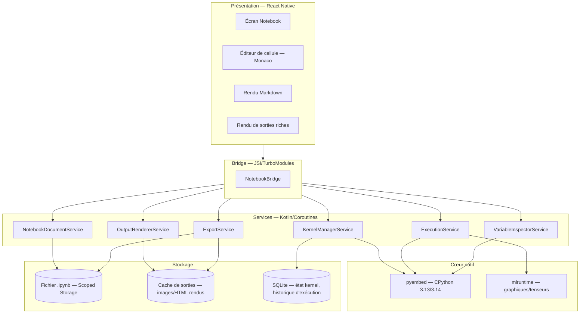
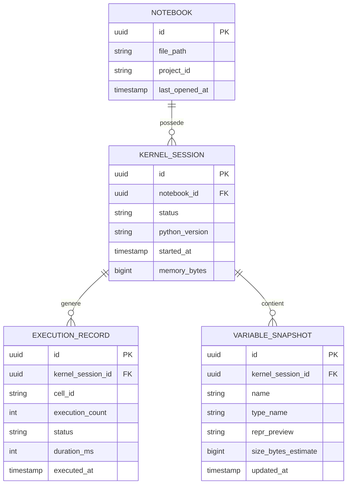
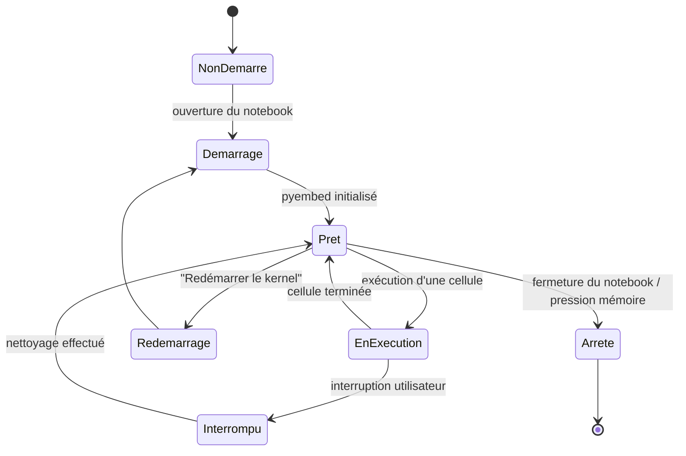
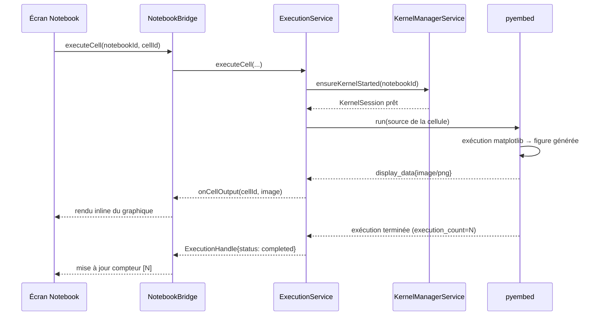
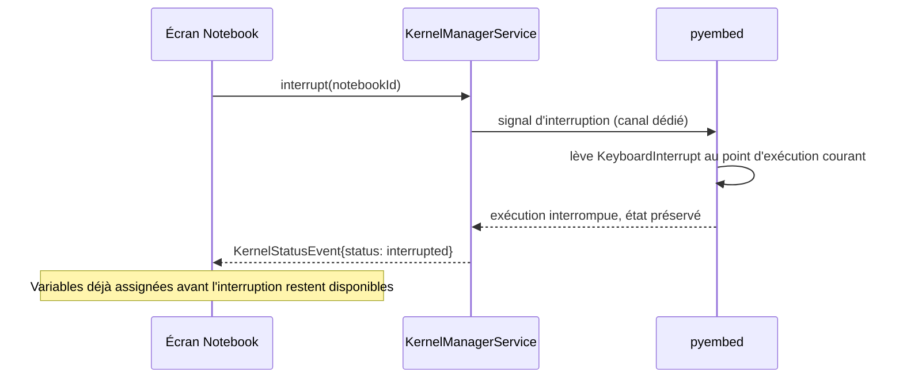
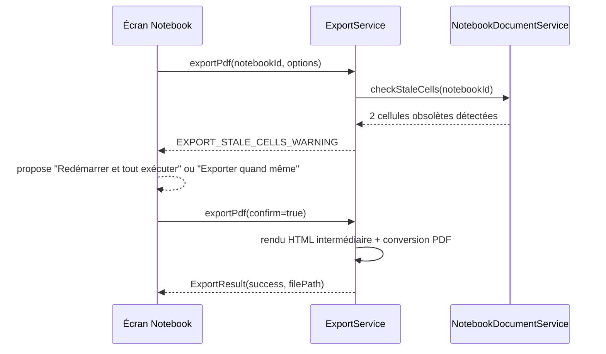

#### [REQ-FUNC-0235] PyStudio Mobile — Spécification du Système Notebook

**Type de document :** Spécification technique — Notebooks interactifs (type Jupyter)
**Version :** 1.0
**Date :** 12 juillet 2026
**Portée :** Cellules, Markdown, exécution, variables, graphiques, export HTML, export PDF
**Dépend de :**
- `PyStudio_Mobile_Architecture_Specification.md` (§2 module `pyembed`, §6 embedding CPython, §13 API internes)
- `PyStudio_Mobile_Python_Runtime_Specification.md` (§0 démarrage instantané, cible CPython 3.13/3.14, ADR-2)
- `PyStudio_Mobile_AI_Runtime_Specification.md` (§4-16 intégration OpenCV/PyTorch/TFLite pour les graphiques et sorties riches issus de modèles)
- `PyStudio_Mobile_UI_UX_Specification.md` (écrans, design system, adaptation tactile/clavier)

---

##### [REQ-FUNC-0236] Table des matières

0. Principes directeurs
1. Résumé exécutif
2. Architecture globale
3. Modèle de données du notebook
4. Cellules
5. Markdown
6. Exécution
7. Variables & inspection d'état
8. Graphiques & sorties riches
9. Export HTML
10. Export PDF
11. UI — écran Notebook
12. API interne (contrats)
13. Gestion des erreurs
14. Diagrammes de séquence
15. Performances
16. Risques & mitigations
17. Glossaire

---

##### [REQ-FUNC-0237] 0. Principes directeurs

| Principe | Description | Implication technique |
|---|---|---|
| **Un kernel Python unique et persistant par notebook** | L'état (variables, imports) doit survivre entre exécutions de cellules, comme dans Jupyter | Session `pyembed` dédiée par notebook ouvert, jamais réinitialisée entre cellules |
| **Exécution jamais bloquante pour l'UI** | Une cellule longue (entraînement, boucle lourde) ne doit pas geler l'éditeur ni empêcher l'annulation | Exécution en coroutine sur thread dédié au kernel, avec canal d'interruption |
| **Sorties riches de première classe** | Graphiques, images, tableaux, HTML doivent s'afficher inline, pas seulement du texte | Protocole de sortie structuré (type MIME) inspiré du protocole Jupyter (`display_data`) |
| **Fidélité du format `.pynb`** | Le fichier notebook doit rester interopérable avec l'écosystème Jupyter existant | Format `.ipynb` (nbformat) comme représentation de sérialisation, pas un format propriétaire |
| **Export fidèle et autonome** | Un notebook exporté (HTML/PDF) doit être lisible sans PyStudio ni connexion | Rendu statique complet, sorties déjà matérialisées, pas de dépendance à un kernel vivant |
| **Reproductibilité de l'ordre d'exécution** | L'utilisateur doit toujours savoir dans quel ordre les cellules ont réellement été exécutées, indépendamment de leur ordre visuel | Compteur d'exécution par cellule, avertissement visuel si l'ordre visuel diverge de l'ordre réel |
| **Coût mobile maîtrisé** | Un kernel par notebook ouvert a un coût mémoire ; plusieurs notebooks ouverts ne doivent pas cumuler sans contrôle | Gestion de cycle de vie de kernel alignée sur `MemoryBudgetService` (AI Runtime §16) |

---

##### [REQ-FUNC-0238] 1. Résumé exécutif

Le système Notebook de PyStudio Mobile offre une expérience de calcul interactif type Jupyter entièrement native sur Android, combinant des **cellules de code** exécutées par un kernel Python persistant (`pyembed`), des **cellules Markdown** pour la documentation, un **inspecteur de variables** en temps réel, un support natif pour les **graphiques et sorties riches** (matplotlib, images, tableaux, sorties de modèles IA via le runtime décrit précédemment), et des capacités d'**export HTML et PDF** autonomes et fidèles à la mise en page d'origine.

Le format de fichier est le standard **`.ipynb`** (nbformat 4.x), garantissant l'interopérabilité avec l'écosystème Jupyter existant (import/export possibles avec JupyterLab, Colab, VS Code) — PyStudio n'invente pas un format propriétaire mais construit une expérience mobile-first (cellules tactiles, exécution optimisée batterie/thermique, sorties adaptées petit écran) au-dessus de ce standard. Chaque notebook ouvert possède son propre **kernel isolé**, avec un cycle de vie explicite (démarrage, interruption, redémarrage, arrêt) exposé à l'utilisateur, cohérent avec la gestion mémoire déjà définie pour le runtime IA.

---

##### [REQ-FUNC-0239] 2. Architecture globale



###### [REQ-FUNC-0240] 2.1 Positionnement vis-à-vis de l'architecture existante

Le module `pyembed` (architecture §2, §6) fournit déjà l'embedding CPython — le système Notebook ajoute la couche manquante : gestion de **sessions kernel multiples et persistantes** (une par notebook, vs un usage plus ponctuel envisagé initialement), un **protocole de sortie riche**, et l'**orchestration cellule par cellule**. Le module `mlruntime` (spécification AI Runtime) est réutilisé tel quel pour l'exécution de tout code faisant appel aux frameworks IA depuis une cellule — aucune duplication de logique d'inférence.

---

##### [REQ-FUNC-0241] 3. Modèle de données du notebook

###### [REQ-FUNC-0242] 3.1 Structure `.ipynb` (nbformat 4.x, standard)

```json
{
  "nbformat": 4,
  "nbformat_minor": 5,
  "metadata": {
    "kernelspec": { "name": "pystudio-python3", "display_name": "Python 3 (PyStudio)" },
    "language_info": { "name": "python", "version": "3.13.2" },
    "pystudio": { "created_with": "1.0", "target_abi": "arm64-v8a" }
  },
  "cells": [
    {
      "cell_type": "markdown",
      "id": "a1b2",
      "source": ["# Analyse exploratoire\n", "Chargement des données..."]
    },
    {
      "cell_type": "code",
      "id": "c3d4",
      "execution_count": 1,
      "source": ["import pandas as pd\n", "df = pd.read_csv('data.csv')\n", "df.head()"],
      "outputs": [
        {
          "output_type": "execute_result",
          "execution_count": 1,
          "data": { "text/plain": ["..."], "text/html": ["<table>...</table>"] }
        }
      ]
    }
  ]
}
```

###### [REQ-FUNC-0243] 3.2 État local complémentaire (SQLite, hors `.ipynb`)



Cet état complète (sans jamais remplacer) le fichier `.ipynb`, qui reste la seule source de vérité pour le contenu et les sorties persistées du notebook.

---

##### [REQ-FUNC-0244] 4. Cellules

###### [REQ-FUNC-0245] 4.1 Types de cellules

| Type | Rôle | Exécutable |
|---|---|---|
| **Code** | Code Python exécuté par le kernel | Oui |
| **Markdown** | Documentation, texte formaté, LaTeX | Non (rendu seulement) |
| **Raw** | Contenu brut non traité (rare, compatibilité nbformat) | Non |

###### [REQ-FUNC-0246] 4.2 Opérations sur cellule

| Opération | Description |
|---|---|
| Ajouter | Insertion au-dessus/en dessous de la cellule courante, ou en fin de notebook |
| Supprimer | Avec confirmation si la cellule a des sorties non triviales (graphique volumineux, etc.) |
| Déplacer | Réordonnancement par glisser-déposer (tactile) ou raccourcis clavier (`Alt+↑/↓`) |
| Fusionner | Combine deux cellules adjacentes de même type |
| Scinder | Coupe une cellule en deux au niveau du curseur |
| Changer de type | Code ↔ Markdown ↔ Raw |
| Dupliquer | Copie la cellule avec ses sorties (marquées comme non réexécutées) |

###### [REQ-FUNC-0247] 4.3 États visuels d'une cellule de code

| État | Indicateur |
|---|---|
| Non exécutée | `[ ]` |
| En cours d'exécution | `[*]` avec indicateur d'activité animé |
| Exécutée avec succès | `[N]` — N = compteur d'exécution global du kernel |
| Exécutée avec erreur | `[N]` en rouge + traceback affiché en sortie |
| Obsolète (code modifié après dernière exécution) | Bordure/pastille distincte signalant que la sortie affichée peut ne plus correspondre au code actuel |

###### [REQ-FUNC-0248] 4.4 Édition

L'éditeur de cellule réutilise le composant **Monaco** déjà défini côté UI/UX pour l'éditeur principal (coloration syntaxique, auto-complétion, mais sans les fonctionnalités lourdes de navigation multi-fichiers non pertinentes dans une cellule isolée) — cohérence visuelle et de raccourcis entre l'éditeur de fichiers et l'éditeur de cellules.

---

##### [REQ-FUNC-0249] 5. Markdown

###### [REQ-FUNC-0250] 5.1 Fonctionnalités supportées

| Fonctionnalité | Détail |
|---|---|
| Markdown standard | Titres, listes, emphase, liens, images, blocs de code avec coloration syntaxique |
| **LaTeX** | Rendu d'expressions mathématiques (`$...$` inline, `$$...$$` bloc) via un moteur de rendu embarqué (type KaTeX), sans dépendance réseau |
| Tableaux Markdown | Rendu natif |
| HTML inline | Autorisé mais sandboxé au rendu (§5.3) — même politique de sécurité que les sorties riches (§8) |
| Références d'images locales | Résolues relativement au répertoire du notebook |

###### [REQ-FUNC-0251] 5.2 Édition et bascule d'affichage

Une cellule Markdown bascule entre **mode édition** (texte brut dans Monaco) et **mode rendu** (WYSIWYG) au double-tap (tactile) ou `Shift+Enter` (clavier) — cohérent avec le modèle Jupyter standard (exécuter une cellule Markdown = la rendre, pas d'exécution kernel).

###### [REQ-FUNC-0252] 5.3 Sandboxing du rendu

Le rendu Markdown (y compris HTML inline autorisé) s'exécute dans un contexte de rendu isolé (WebView sandboxée sans accès au système de fichiers ni à des API sensibles), pour éviter qu'un notebook partagé/téléchargé contenant du HTML malveillant n'accède à des données du device — cohérent avec les principes de sécurité déjà établis dans les spécifications précédentes (sandbox marketplace, isolation de process).

---

##### [REQ-FUNC-0253] 6. Exécution

###### [REQ-FUNC-0254] 6.1 Cycle de vie du kernel



###### [REQ-FUNC-0255] 6.2 Modes d'exécution

| Mode | Déclencheur | Comportement |
|---|---|---|
| **Cellule unique** | Bouton "Exécuter" / `Shift+Enter` | Exécute la cellule courante, avance à la suivante |
| **Exécuter et rester** | `Ctrl+Enter` | Exécute sans avancer le focus |
| **Exécuter tout** | Menu notebook | Exécute toutes les cellules de code dans l'ordre visuel, du haut vers le bas |
| **Exécuter depuis ici** | Menu contextuel de cellule | Exécute la cellule courante et toutes les suivantes |
| **Redémarrer et tout exécuter** | Menu notebook | Redémarre le kernel (état vierge) puis exécute tout — recommandé avant export (§9-10) pour garantir la reproductibilité |

###### [REQ-FUNC-0256] 6.3 Interruption

Une exécution en cours peut être interrompue (`KeyboardInterrupt` propagé au kernel via canal d'interruption dédié, pas un `kill` brutal du process) — l'état des variables déjà assignées avant l'interruption est préservé, cohérent avec le comportement Jupyter standard.

###### [REQ-FUNC-0257] 6.4 File d'exécution

Les demandes d'exécution (ex. "Exécuter tout" déclenché puis nouvelle cellule ajoutée entre-temps) sont traitées en **file d'attente séquentielle** par kernel — un seul calcul actif à la fois par kernel (le kernel Python lui-même est mono-thread pour l'exécution utilisateur, cohérent avec le modèle d'exécution CPython standard), mais plusieurs kernels de notebooks différents s'exécutent en parallèle sans interférence.

###### [REQ-FUNC-0258] 6.5 Détection d'ordre d'exécution divergent

Si l'utilisateur exécute les cellules dans un ordre différent de leur ordre visuel (ex. cellule 3 avant cellule 1), les compteurs d'exécution affichés (`[3]`, `[1]`, `[2]`...) reflètent l'ordre réel — un bandeau d'avertissement discret propose "Redémarrer et tout exécuter" si l'écart devient significatif, pour éviter les faux positifs de reproductibilité (cohérent §0).

---

##### [REQ-FUNC-0259] 7. Variables & inspection d'état

###### [REQ-FUNC-0260] 7.1 Panneau d'inspection

Un panneau dédié (accessible en overlay ou onglet latéral selon le mode d'affichage, cohérent adaptation UI/UX) liste en temps réel toutes les variables du namespace du kernel :

| Colonne | Contenu |
|---|---|
| Nom | Nom de la variable |
| Type | Type Python (`DataFrame`, `ndarray`, `int`, `Model`, etc.) |
| Aperçu | Représentation courte (`repr()` tronqué) |
| Taille estimée | Utile pour repérer les objets volumineux (gros tenseurs, DataFrames) avant qu'ils ne pèsent sur la mémoire |

###### [REQ-FUNC-0261] 7.2 Mise à jour

Le panneau se met à jour après chaque exécution de cellule terminée (pas en continu pendant l'exécution, pour éviter une surcharge d'introspection sur du code qui boucle) — implémenté via une introspection du namespace global du kernel (`globals()` filtré des éléments internes) exécutée côté kernel puis sérialisée vers l'UI.

###### [REQ-FUNC-0262] 7.3 Inspection approfondie

Tap sur une variable → vue détaillée adaptée au type :

| Type | Vue détaillée |
|---|---|
| `DataFrame`/tableau | Grille paginée (viewport-based pour les gros tableaux, cohérent avec l'approche de rendu performant déjà utilisée pour les diffs Git et l'éditeur) |
| `ndarray`/tenseur | Résumé statistique (shape, dtype, min/max/mean) + aperçu visuel si 2D/3D (heatmap) |
| Objet modèle IA (TFLite/ONNX/PyTorch) | Résumé d'architecture (nombre de paramètres, backend utilisé — réutilise `ModelHandle` du runtime IA) |
| Type simple | Valeur complète si courte, tronquée avec option "voir tout" sinon |

###### [REQ-FUNC-0263] 7.4 Actions sur variable

Menu contextuel par variable : **supprimer** (`del`), **copier la valeur**, **envoyer vers une nouvelle cellule** (génère `nom_variable` dans une cellule pour ré-affichage rapide).

---

##### [REQ-FUNC-0264] 8. Graphiques & sorties riches

###### [REQ-FUNC-0265] 8.1 Protocole de sortie (inspiré Jupyter `display_data`)

Chaque sortie de cellule est structurée par type MIME, permettant à l'UI de choisir le meilleur rendu disponible :

```json
{
  "output_type": "display_data",
  "data": {
    "image/png": "<base64>",
    "text/html": "<div>...</div>",
    "application/json": { "...": "..." },
    "text/plain": "repr() de secours"
  }
}
```

###### [REQ-FUNC-0266] 8.2 Bibliothèques de graphiques supportées

| Bibliothèque | Mécanisme de capture |
|---|---|
| **Matplotlib** | Backend `Agg` (rendu non interactif) capturé en PNG/SVG après chaque `plt.show()` implicite en fin de cellule |
| **Plotly** | Sortie `text/html` (widget interactif autonome, JS embarqué), rendu dans une WebView sandboxée (cohérent §5.3) |
| **Sorties OpenCV** (`cv2.imshow` équivalent mobile) | Conversion automatique `Mat`/`ndarray` → PNG affiché inline, pas de fenêtre native (non pertinent mobile) |
| **Sorties de modèles IA** (AI Runtime) | Visualisations spécifiques (bounding boxes sur image pour détection d'objet, heatmap d'attention pour NLP) via des helpers dédiés fournis par le module `mlruntime` |

###### [REQ-FUNC-0267] 8.3 Tableaux enrichis

Les objets `DataFrame` (pandas) affichent automatiquement un rendu `text/html` (table stylée) plutôt que le simple `repr()` texte, avec pagination intégrée pour les grands tableaux (cohérent §7.3).

###### [REQ-FUNC-0268] 8.4 Gestion mémoire des sorties

Les images/graphiques générés sont **encodés et stockés** (cache de sorties, D2 en §2) plutôt que conservés en mémoire vive sous forme d'objets Python vivants après affichage — le kernel peut libérer la figure matplotlib source (`plt.close()` automatique post-capture) sans perdre la sortie déjà affichée, cohérent avec la gestion mémoire stricte définie côté AI Runtime.

###### [REQ-FUNC-0269] 8.5 Limite de taille de sortie

Une sortie individuelle dépassant un seuil configurable (ex. 5 Mo, image très haute résolution) déclenche un avertissement et une option de compression/réduction plutôt qu'un blocage silencieux de l'UI ou une explosion de la taille du fichier `.ipynb`.

---

##### [REQ-FUNC-0270] 9. Export HTML

###### [REQ-FUNC-0271] 9.1 Flux d'export

1. Vérification de fraîcheur : si des cellules sont marquées obsolètes (§4.3), avertissement proposant "Redémarrer et tout exécuter" avant export (cohérent §0, reproductibilité).
2. Rendu de chaque cellule (Markdown → HTML final, code → bloc avec coloration syntaxique statique, sorties → images/HTML déjà matérialisées).
3. Assemblage en un document HTML **autonome** (CSS et scripts minimaux inlinés, pas de dépendance CDN externe — cohérent avec le principe offline-first général de l'application).
4. Écriture du fichier dans Scoped Storage, proposition de partage immédiat (intent Android standard).

###### [REQ-FUNC-0272] 9.2 Fidélité de rendu

Le CSS d'export reprend la palette et la typographie du thème actif de l'IDE (cohérent design system UI/UX), avec un mode d'impression dédié (`@media print`) distinct du mode écran pour anticiper une impression ultérieure ou une conversion PDF externe.

###### [REQ-FUNC-0273] 9.3 Contenu interactif

Les sorties Plotly (§8.2) conservent leur interactivité JS dans l'export HTML (zoom, survol) — seul l'export PDF (§10) les convertit en image statique, limitation intrinsèque du format PDF.

###### [REQ-FUNC-0274] 9.4 Table des matières générée

Génération automatique d'une table des matières navigable à partir des titres Markdown (`#`, `##`, ...), placée en en-tête ou en panneau latéral repliable dans le HTML exporté.

---

##### [REQ-FUNC-0275] 10. Export PDF

###### [REQ-FUNC-0276] 10.1 Flux d'export

1. Même étape de vérification de fraîcheur que l'export HTML (§9.1).
2. Génération d'un document HTML intermédiaire optimisé impression (réutilise le rendu §9, avec CSS `@media print` dédié : sauts de page évitant de couper une figure en deux, marges adaptées).
3. Conversion HTML → PDF via un moteur de rendu embarqué headless (rendu de pagination côté device, pas de dépendance à un service cloud).
4. Sorties interactives (Plotly) automatiquement figées en image statique (capture du rendu au moment de l'export) pour ce format.

###### [REQ-FUNC-0277] 10.2 Options d'export

| Option | Effet |
|---|---|
| Inclure/exclure le code source | Permet un export "résultats uniquement" pour un public non technique |
| Inclure/exclure les cellules Markdown | Rare, mais utile pour un export "code uniquement" |
| Orientation | Portrait (défaut) / Paysage (utile pour de larges tableaux/graphiques) |
| Numérotation de page | Activable, avec en-tête/pied de page configurable (nom du notebook, date d'export) |

###### [REQ-FUNC-0278] 10.3 Gestion des grands tableaux/graphiques

Un tableau ou graphique plus large que la page est automatiquement **redimensionné à l'échelle** (pas de coupure horizontale silencieuse) ; si la mise à l'échelle rendrait le contenu illisible (ex. tableau à 50 colonnes), une pagination horizontale du tableau sur plusieurs pages est proposée en alternative, avec avertissement explicite du choix appliqué.

---

##### [REQ-FUNC-0279] 11. UI — écran Notebook

###### [REQ-FUNC-0280] 11.1 Structure de l'écran

```
┌─────────────────────────────────┐
│ mon_analyse.ipynb        [•••]  │  Titre + menu (Exécuter tout, Export, Redémarrer)
├─────────────────────────────────┤
│ ● Kernel : Prêt                 │  Statut du kernel + bouton interrompre/redémarrer
├─────────────────────────────────┤
│ [M] # Analyse exploratoire      │  Cellule Markdown rendue
├─────────────────────────────────┤
│ [1] import pandas as pd         │  Cellule code + compteur d'exécution
│     df = pd.read_csv(...)       │
│ ▸ Sortie : tableau df.head()    │  Sortie riche (tableau paginé)
├─────────────────────────────────┤
│ [2] df.plot(...)                │
│ ▸ Sortie : [graphique matplotlib]│
├─────────────────────────────────┤
│ [+ Code]  [+ Markdown]          │  Ajout de cellule en fin de notebook
└─────────────────────────────────┘
        [📊 Variables] [📤 Export]     Actions flottantes / barre inférieure
```

###### [REQ-FUNC-0281] 11.2 Panneau Variables (overlay ou panneau latéral)

Accessible via une action dédiée, superposé (téléphone) ou en panneau latéral permanent (tablette/desktop externe) — cohérent avec le modèle d'adaptation par mode d'affichage déjà défini côté UI/UX.

###### [REQ-FUNC-0282] 11.3 Adaptation tactile/clavier

| Action | Tactile | Clavier |
|---|---|---|
| Exécuter la cellule | Tap sur bouton ▶ de la cellule | `Shift+Enter` |
| Ajouter une cellule | Bouton `+` en bas de cellule | `Esc` puis `B` (en dessous) / `A` (au-dessus), cohérent raccourcis type Jupyter/VS Code déjà évoqués UI/UX |
| Réordonner | Glisser-déposer par poignée dédiée | `Alt+↑/↓` |
| Basculer Markdown édition/rendu | Double-tap | `Shift+Enter` (identique à l'exécution, cohérent modèle Jupyter) |

###### [REQ-FUNC-0283] 11.4 Indicateur de statut kernel persistant

Un badge de statut kernel (Prêt / En exécution / Interrompu / Arrêté) reste visible en permanence en haut de l'écran, avec accès rapide aux actions de cycle de vie (§6.1), pour que l'utilisateur ne perde jamais le fil de l'état de calcul en cours, particulièrement important sur une exécution longue où l'utilisateur peut naviguer ailleurs dans l'IDE entre-temps.

---

##### [REQ-FUNC-0284] 12. API interne (contrats)

###### [REQ-FUNC-0285] 12.1 Bridge TypeScript

```typescript
export interface PyStudioNotebookBridge {
  openNotebook(path: string): Promise<NotebookHandle>;
  closeNotebook(notebookId: string): Promise<void>;

  addCell(notebookId: string, type: CellType, index: number): Promise<Cell>;
  updateCellSource(notebookId: string, cellId: string, source: string): Promise<void>;
  deleteCell(notebookId: string, cellId: string): Promise<void>;
  moveCell(notebookId: string, cellId: string, newIndex: number): Promise<void>;

  executeCell(notebookId: string, cellId: string): Promise<ExecutionHandle>;
  executeAll(notebookId: string): Promise<ExecutionHandle[]>;
  interruptExecution(notebookId: string): Promise<void>;
  restartKernel(notebookId: string): Promise<void>;

  onCellOutput(callback: (evt: CellOutputEvent) => void): () => void;
  onKernelStatus(callback: (evt: KernelStatusEvent) => void): () => void;

  getVariables(notebookId: string): Promise<VariableInfo[]>;
  inspectVariable(notebookId: string, name: string): Promise<VariableDetail>;

  exportNotebook(notebookId: string, options: ExportOptions): Promise<ExportResult>;
}

export type CellType = 'code' | 'markdown' | 'raw';

export interface Cell {
  id: string;
  type: CellType;
  source: string;
  executionCount?: number;
  outputs: CellOutput[];
  stale: boolean;   // cohérent §4.3
}

export interface CellOutput {
  outputType: 'execute_result' | 'display_data' | 'stream' | 'error';
  data: Record<string, string>;   // clé = type MIME
}

export interface ExecutionHandle {
  cellId: string;
  executionCount: number;
  status: 'queued' | 'running' | 'completed' | 'error' | 'interrupted';
}

export interface CellOutputEvent {
  cellId: string;
  output: CellOutput;
  isFinal: boolean;
}

export interface KernelStatusEvent {
  notebookId: string;
  status: 'starting' | 'ready' | 'running' | 'interrupted' | 'restarting' | 'stopped';
  memoryBytes: number;
}

export interface VariableInfo {
  name: string;
  typeName: string;
  reprPreview: string;
  sizeBytesEstimate: number;
}

export interface VariableDetail extends VariableInfo {
  shape?: number[];
  columns?: string[];
  detailData: Record<string, string>;   // rendu adapté au type, cf. §7.3
}

export interface ExportOptions {
  format: 'html' | 'pdf';
  includeCode: boolean;
  includeMarkdown: boolean;
  orientation?: 'portrait' | 'landscape';   // pertinent PDF
}

export interface ExportResult {
  filePath: string;
  sizeBytes: number;
  staleWarningAcknowledged: boolean;
}
```

###### [REQ-FUNC-0286] 12.2 Interface Kotlin (services)

```kotlin
interface NotebookDocumentService {
    suspend fun open(path: String): NotebookHandle
    suspend fun close(notebookId: String)
    suspend fun addCell(notebookId: String, type: CellType, index: Int): Cell
    suspend fun updateCellSource(notebookId: String, cellId: String, source: String)
}

interface KernelManagerService {
    suspend fun ensureKernelStarted(notebookId: String): KernelSession
    suspend fun interrupt(notebookId: String)
    suspend fun restart(notebookId: String)
    fun statusFlow(notebookId: String): Flow<KernelStatusEvent>
}

interface ExecutionService {
    suspend fun executeCell(notebookId: String, cellId: String): ExecutionHandle
    suspend fun executeAll(notebookId: String): List<ExecutionHandle>
    fun outputFlow(notebookId: String): Flow<CellOutputEvent>
}

interface VariableInspectorService {
    suspend fun listVariables(notebookId: String): List<VariableInfo>
    suspend fun inspect(notebookId: String, name: String): VariableDetail
}

interface ExportService {
    suspend fun exportHtml(notebookId: String, options: ExportOptions): ExportResult
    suspend fun exportPdf(notebookId: String, options: ExportOptions): ExportResult
}
```

---

##### [REQ-FUNC-0287] 13. Gestion des erreurs

| Code | Cause typique | Recoverable |
|---|---|---|
| `KERNEL_START_FAILED` | Échec d'initialisation `pyembed` (runtime corrompu, mémoire insuffisante) | Oui — nouvelle tentative, ou libération mémoire puis retry |
| `EXECUTION_ERROR` | Exception Python levée par le code utilisateur | Non — traceback affiché, comportement normal attendu |
| `EXECUTION_TIMEOUT` | Cellule dépassant une durée maximale configurée (protection contre boucle infinie oubliée) | Oui — interruption automatique proposée, ou augmentation du seuil |
| `KERNEL_MEMORY_EXCEEDED` | Namespace du kernel dépassant le budget mémoire alloué (AI Runtime §16) | Oui — suggestion de suppression de variables volumineuses ou redémarrage |
| `OUTPUT_TOO_LARGE` | Sortie individuelle dépassant le seuil (§8.5) | Oui — compression proposée |
| `MARKDOWN_RENDER_UNSAFE_CONTENT` | HTML inline dans une cellule Markdown contenant un pattern potentiellement dangereux (détection heuristique) | Oui — rendu en mode restreint, avertissement affiché |
| `EXPORT_STALE_CELLS_WARNING` | Export demandé avec des cellules obsolètes (§4.3) | Oui — non-bloquant, confirmation "exporter quand même" |
| `EXPORT_PDF_RENDER_FAILED` | Échec du moteur de rendu PDF headless | Oui — repli vers export HTML proposé |
| `NBFORMAT_PARSE_ERROR` | Fichier `.ipynb` corrompu ou format non supporté | Non — ouverture en mode texte brut proposée en dernier recours |

---

##### [REQ-FUNC-0288] 14. Diagrammes de séquence

###### [REQ-FUNC-0289] 14.1 Exécution d'une cellule avec sortie graphique



###### [REQ-FUNC-0290] 14.2 Interruption d'une cellule longue



###### [REQ-FUNC-0291] 14.3 Export PDF avec cellules obsolètes



---

##### [REQ-FUNC-0292] 15. Performances

| Levier | Détail |
|---|---|
| **Démarrage de kernel rapide** | Réutilise le principe de démarrage instantané déjà acté côté runtime Python (`.pyc` `mmap()`, wheels `ZIP_STORED`) — un notebook s'ouvre sans latence perceptible même avec des imports lourds déjà en cache |
| **Rendu de sortie viewport-based** | Les grands tableaux/graphiques ne sont entièrement rendus que dans la zone visible, cohérent avec l'approche déjà appliquée pour les diffs Git et l'éditeur Monaco |
| **Kernel par notebook, pas par cellule** | Aucun overhead de redémarrage entre cellules — seul un redémarrage explicite (§6.1) réinitialise l'état |
| **Compression des sorties en cache** | Les images de sortie sont stockées compressées (PNG optimisé) dans le cache de sorties plutôt qu'en base64 brut dans le `.ipynb` à chaque sauvegarde intermédiaire |
| **Export en arrière-plan** | La génération HTML/PDF s'exécute en coroutine avec barre de progression, jamais un blocage de l'UI pour un notebook volumineux |

---

##### [REQ-FUNC-0293] 16. Risques & mitigations

| Risque | Impact | Mitigation |
|---|---|---|
| Accumulation de kernels ouverts épuisant la mémoire disponible | Élevé | Intégration avec `MemoryBudgetService` (AI Runtime) : arrêt proposé des kernels inactifs depuis longtemps avant refus d'ouverture d'un nouveau notebook |
| Confusion utilisateur sur l'ordre réel d'exécution (numérotation non séquentielle) | Moyen | Avertissement explicite + action "Redémarrer et tout exécuter" mise en avant (§6.5) |
| Fichier `.ipynb` corrompu par une sauvegarde interrompue | Moyen | Écriture atomique (temp + rename, cohérent avec le pattern déjà utilisé ailleurs dans PyStudio) |
| Export PDF illisible sur contenu très large (tableaux, graphiques) | Moyen | Mise à l'échelle automatique + pagination horizontale de secours (§10.3) |
| HTML inline malveillant dans un notebook partagé/téléchargé | Moyen-élevé | Sandboxing systématique du rendu Markdown/sorties riches (§5.3, §8), cohérent avec les principes de sécurité transverses déjà établis |
| Sorties volumineuses gonflant excessivement la taille du fichier `.ipynb` | Moyen | Seuil d'avertissement (§8.5), option de "vider les sorties" avant commit Git (intégration naturelle avec `gitengine`, éviter de committer des sorties binaires lourdes) |

---

##### [REQ-FUNC-0294] 17. Glossaire

| Terme | Définition |
|---|---|
| **nbformat** | Format de sérialisation standard des notebooks Jupyter (`.ipynb`), basé JSON |
| **Kernel** | Processus/session d'exécution Python persistant associé à un notebook, conservant l'état entre exécutions de cellules |
| **`display_data`** | Type de sortie du protocole Jupyter représentant un contenu riche multi-format (image, HTML, JSON...) |
| **Cellule obsolète (stale)** | Cellule dont le code a été modifié depuis sa dernière exécution, dont la sortie affichée peut ne plus être à jour |
| **Compteur d'exécution** | Numéro incrémental global du kernel, reflétant l'ordre réel d'exécution des cellules (pas leur ordre visuel) |
| **WYSIWYG** | "What You See Is What You Get" — mode de rendu Markdown affichant le résultat formaté plutôt que la syntaxe brute |

---

*Fin de la spécification.*


##### [REQ-FUNC-0295] Visualisation Interactive et Exportation

L'implémentation du Notebook Jupyter dans PyStudio Mobile garantit une parité de fonctionnalités avec la version bureau pour le calcul scientifique :

- **Rendu inline :** Affichage automatique et intégré des graphiques générés directement sous la cellule de code active.
- **Rendu interactif :** Support complet pour les bibliothèques interactives web (Plotly, Bokeh) via des composants WebView embarqués, permettant le survol, la sélection d'outils et l'interaction tactile.
- **Options d'exportation de cellules graphiques :** Tous les rendus peuvent être extraits de manière unitaire selon les formats suivants :
  - **HTML** : Pour conserver l'interactivité.
  - **PDF** : Exportation vectorielle pour des rapports.
  - **PNG** : Image matricielle standard.
  - **SVG** : Graphique vectoriel haute définition.

