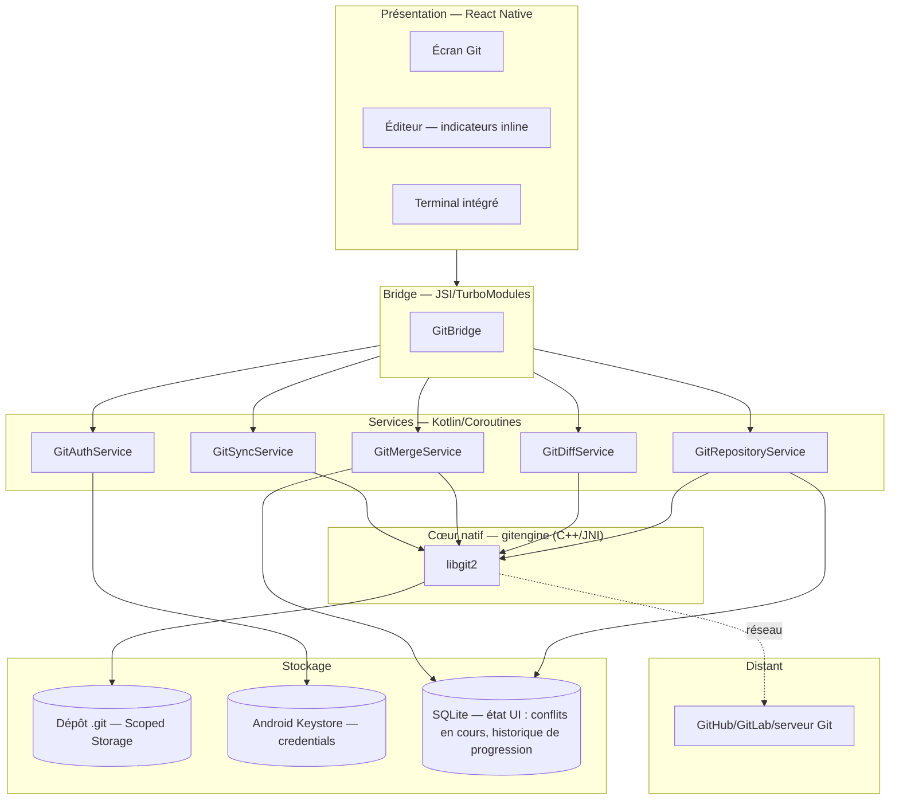
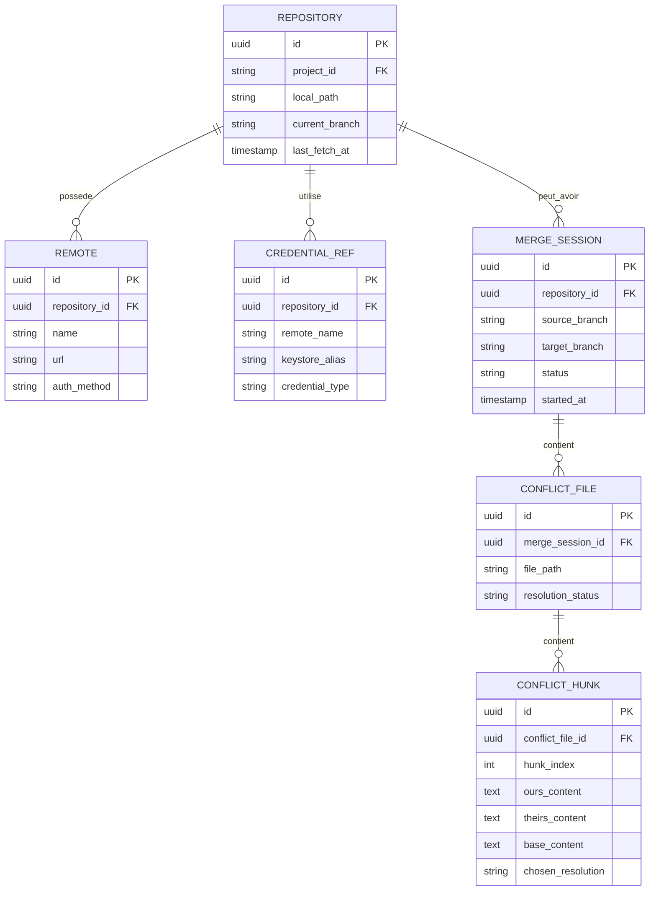
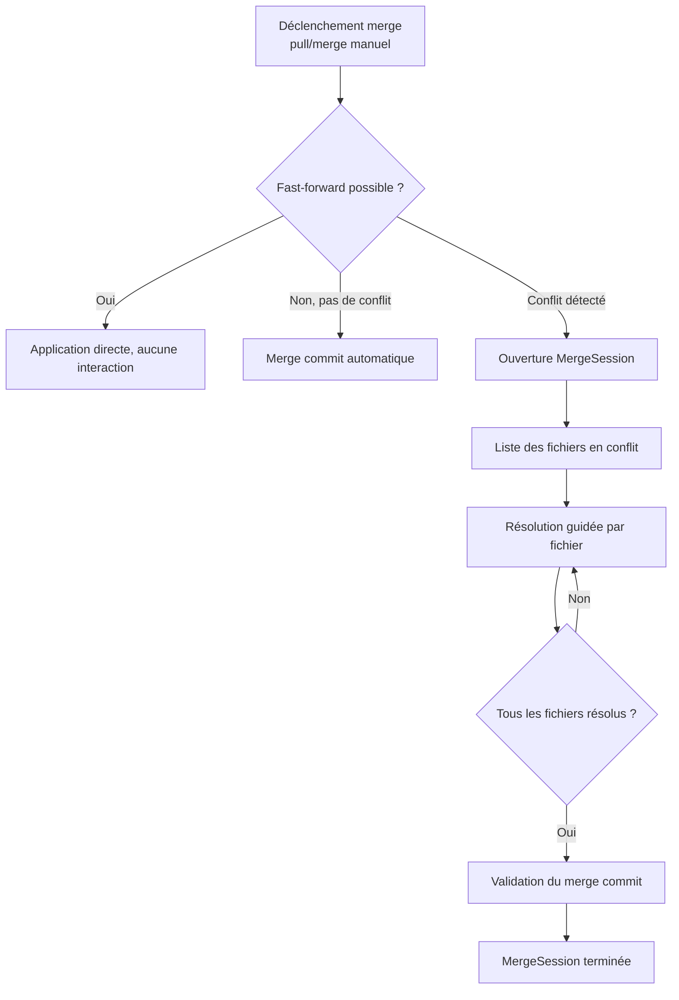
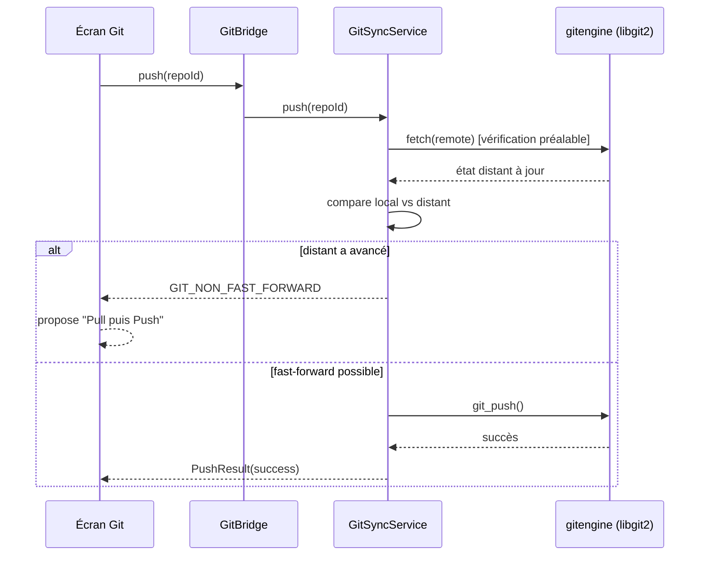
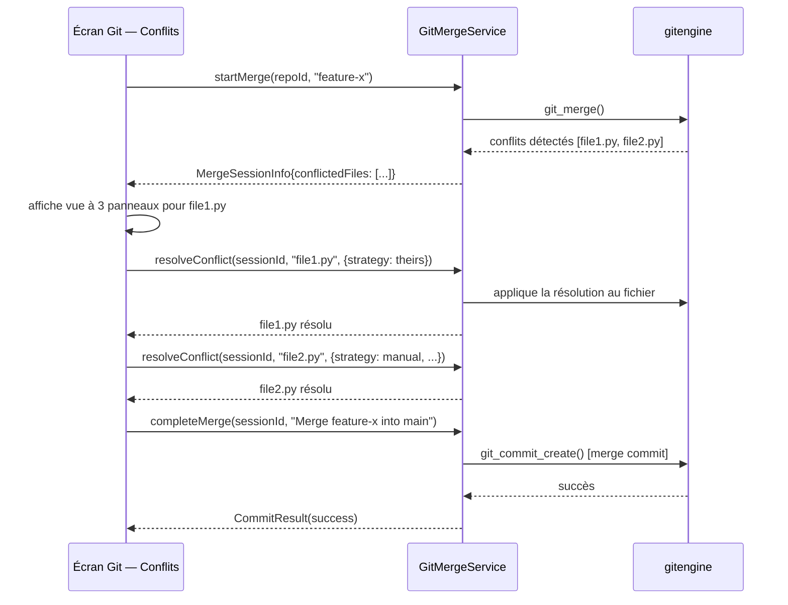
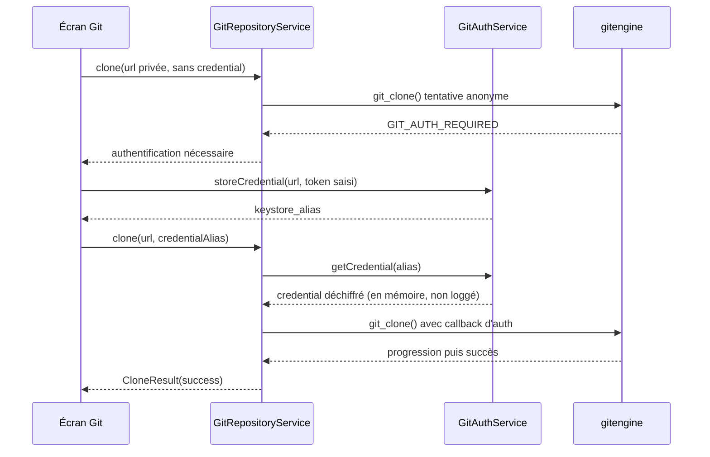

#### [REQ-FUNC-0296] PyStudio Mobile — Spécification de l'Intégration Git (« gitengine »)

**Type de document :** Spécification technique — Contrôle de version intégré
**Version :** 1.0
**Date :** 12 juillet 2026
**Portée :** Clone, commit, push, pull, branches, diff, merge — architecture, UI et flux utilisateur
**Dépend de :**
- `PyStudio_Mobile_Architecture_Specification.md` (§2 module `gitengine` : libgit2, §5-6 UI/écrans, §13 API internes)
- `PyStudio_Mobile_UI_UX_Specification.md` (écran Git dans l'Activity Bar, adaptation tactile/clavier, design system)
- `PyStudio_Mobile_Android_Package_Builder_Specification.md` (§4.1 acquisition de sources Git, réutilise `gitengine` pour le clone de dépendances)

---

##### [REQ-FUNC-0297] Table des matières

0. Principes directeurs
1. Résumé exécutif
2. Architecture globale
3. Modèle de données local
4. Clone
5. Commit
6. Push
7. Pull
8. Branches
9. Diff
10. Merge & résolution de conflits
11. Authentification & sécurité
12. UI — écran Git
13. Flux utilisateur détaillés
14. API interne (contrats)
15. Gestion des erreurs
16. Diagrammes de séquence
17. Performances
18. Risques & mitigations
19. Glossaire

---

##### [REQ-FUNC-0298] 0. Principes directeurs

| Principe | Description | Implication technique |
|---|---|---|
| **Git réel, pas une simulation** | Le dépôt produit doit être binaire-compatible avec tout client Git standard (GitHub, GitLab, serveur auto-hébergé) | Utilisation de **libgit2** (déjà défini architecture §2), pas de réimplémentation du format objet |
| **Opérations longues jamais bloquantes pour l'UI** | Clone d'un gros dépôt, push volumineux : ne doivent jamais geler l'éditeur | Toutes les opérations réseau/lourdes en coroutines, progression en flux vers l'UI |
| **Sécurité des identifiants non négociable** | Tokens/clés SSH ne doivent jamais transiter en clair ni être loggés | Android Keystore pour le stockage, jamais de log de credentials (cohérent avec les principes de sécurité déjà établis dans les specs précédentes) |
| **Résolution de conflit guidée, jamais une boîte de dialogue texte brute** | Un merge conflictuel sur petit écran doit rester exploitable | UI dédiée de résolution de conflit adaptée tactile (cf. UI/UX §2 modes d'entrée) |
| **État Git toujours visible, jamais caché** | L'utilisateur doit savoir en permanence où en est son dépôt (branche, ahead/behind, fichiers modifiés) | Barre de statut Git persistante, cohérente avec le design system existant |
| **Dégradation gracieuse hors-ligne** | Commit, diff, branches locales doivent fonctionner sans réseau ; seuls push/pull/clone le requièrent | Distinction claire opérations locales vs distantes dans l'UI et l'API |
| **Traçabilité et réversibilité** | Toute opération destructive potentielle (reset, force-push, suppression de branche) doit être confirmée explicitement | Modale de confirmation avec résumé de l'impact avant exécution |

---

##### [REQ-FUNC-0299] 1. Résumé exécutif

L'intégration Git de PyStudio Mobile s'appuie sur le module natif **`gitengine`** (libgit2 via JNI, déjà positionné dans l'architecture globale) pour offrir un contrôle de version complet et fidèle au standard Git, exposé à travers un écran dédié de l'Activity Bar (cohérent UI/UX §écrans) et un ensemble de commandes accessibles également depuis le terminal intégré. Les sept opérations couvertes — **clone, commit, push, pull, branches, diff, merge** — sont conçues pour fonctionner de façon fluide sur petit écran tactile tout en restant entièrement compatibles clavier/souris en mode desktop externe (cohérent avec les deux axes d'adaptation orthogonaux déjà définis côté UI/UX).

L'accent est mis sur trois aspects spécifiquement mobiles : (1) des **opérations réseau jamais bloquantes**, avec progression en flux et reprise sur coupure ; (2) une **résolution de conflits visuelle et guidée**, remplaçant les marqueurs `<<<<<<< HEAD` bruts par une interface de sélection tactile ; et (3) une **gestion sécurisée des identifiants** (Android Keystore) pour l'authentification HTTPS/SSH, sans jamais exposer de secret en clair, y compris dans les logs de débogage.

---

##### [REQ-FUNC-0300] 2. Architecture globale



###### [REQ-FUNC-0301] 2.1 Positionnement vis-à-vis de l'architecture existante

`gitengine` était déjà défini comme module natif (architecture §2). Cette spécification en détaille l'usage applicatif complet : les services Kotlin (`GitRepositoryService`, etc.) constituent la couche d'orchestration manquante entre le binding JNI brut de libgit2 et l'expérience utilisateur de l'écran Git défini côté UI/UX. Le Package Builder réutilise déjà `gitengine` pour l'acquisition de sources (sa spec §4.1) — cette spécification ne duplique pas ce chemin mais l'étend pour l'usage "dépôt de projet utilisateur" (vs "dépendance vendored").

---

##### [REQ-FUNC-0302] 3. Modèle de données local

###### [REQ-FUNC-0303] 3.1 État persisté (SQLite, complète le `.git` natif)



###### [REQ-FUNC-0304] 3.2 Notes

- Le `.git` réel (objets, refs, index) reste entièrement géré par libgit2 dans son format standard — la couche SQLite ci-dessus ne fait que **projeter un état pour l'UI** (session de merge en cours, credentials associés), jamais une source de vérité concurrente au dépôt Git lui-même.
- `CREDENTIAL_REF` ne stocke **jamais** le secret lui-même, uniquement une référence (`keystore_alias`) vers l'entrée Android Keystore correspondante (§11.1).

---

##### [REQ-FUNC-0305] 4. Clone

###### [REQ-FUNC-0306] 4.1 Flux

1. Saisie de l'URL du dépôt (HTTPS ou SSH) — auto-détection du type d'authentification requis.
2. Sélection/validation des identifiants (§11) si le dépôt est privé.
3. Sélection du répertoire de destination (Scoped Storage, proposé automatiquement sous `/projects/<nom-repo>/`).
4. Clone via `git_clone()` (libgit2), avec callback de progression (`git_indexer_progress_cb`) traduit en pourcentage exploitable par l'UI.
5. Détection automatique de la branche par défaut distante et checkout.
6. Ouverture immédiate du projet dans l'IDE une fois le clone terminé.

###### [REQ-FUNC-0307] 4.2 Options avancées

| Option | Effet |
|---|---|
| Clone superficiel (`--depth`) | Réduit la taille téléchargée pour les gros historiques — recommandé par défaut sur réseau mobile pour dépôts volumineux, avec avertissement explicite (perte d'historique complet, opérations comme `blame` profond limitées) |
| Clone d'une branche spécifique | Évite de récupérer toutes les branches distantes si non nécessaire |
| Sous-modules | Proposés en clone récursif optionnel, jamais automatique par défaut (coût réseau/stockage supplémentaire) |

###### [REQ-FUNC-0308] 4.3 Reprise sur coupure

Un clone interrompu (perte réseau, app tuée) est **repris** plutôt que redémarré depuis zéro lorsque possible : les objets déjà transférés dans le répertoire `.git/objects` partiel restent valides (format Git standard), un nouveau `git_clone()` sur le même répertoire complète le transfert.

---

##### [REQ-FUNC-0309] 5. Commit

###### [REQ-FUNC-0310] 5.1 Flux

1. L'écran Git affiche automatiquement les fichiers modifiés/ajoutés/supprimés (`git_status_list_new()`), regroupés par statut (modifié, nouveau, supprimé, en conflit).
2. Sélection tactile des fichiers/hunks à inclure dans le commit (staging partiel supporté, cf. §9.3 pour le staging par hunk).
3. Saisie du message de commit — champ résumé (première ligne, limite visuelle à 50 caractères indicative) + description étendue optionnelle.
4. Validation → `git_commit_create()` avec l'auteur configuré (nom/email du profil PyStudio ou configuration Git locale explicite).

###### [REQ-FUNC-0311] 5.2 Staging

| Granularité | Mécanisme |
|---|---|
| Fichier entier | Case à cocher par fichier dans la liste de statut |
| Hunk individuel | Sélection dans la vue diff (§9), équivalent de `git add -p` mais avec sélection tactile directe plutôt que séquence de prompts |
| Ligne individuelle | Support optionnel pour les cas fins (ex. un hunk mêlant une correction et un changement non lié) |

###### [REQ-FUNC-0312] 5.3 Commit amend

Option "modifier le dernier commit" proposée si aucun push n'a encore eu lieu sur ce commit (détection ahead/behind, §8.2) — masquée/avertie si le commit est déjà poussé, pour éviter une réécriture d'historique partagé accidentelle.

---

##### [REQ-FUNC-0313] 6. Push

###### [REQ-FUNC-0314] 6.1 Flux

1. Vérification préalable de l'état ahead/behind par rapport à la branche distante suivie.
2. Si le dépôt distant a avancé (behind) : proposition de `pull`/`rebase` avant push plutôt qu'un échec Git brut.
3. Authentification (§11) si nécessaire (token expiré, première utilisation).
4. `git_push()` avec callback de progression réseau.
5. Confirmation visuelle + mise à jour immédiate de l'indicateur ahead/behind dans la barre de statut.

###### [REQ-FUNC-0315] 6.2 Force-push

Toujours **désactivé par défaut** et nécessitant une action explicite en deux étapes : (1) activer "mode avancé" pour cette opération, (2) confirmer via une modale listant explicitement les commits distants qui seraient perdus — cohérent avec le principe de traçabilité/réversibilité (§0).

###### [REQ-FUNC-0316] 6.3 Push de nouvelle branche

Propose automatiquement la création de la branche distante correspondante (`--set-upstream` équivalent) si la branche locale n'a pas encore de suivi distant configuré.

---

##### [REQ-FUNC-0317] 7. Pull

###### [REQ-FUNC-0318] 7.1 Flux

1. `git_fetch()` (récupération des refs/objets distants) suivi de la stratégie de merge/rebase choisie par l'utilisateur (préférence configurable par dépôt : merge par défaut, rebase en option).
2. Si fast-forward possible : application directe, aucune interaction requise.
3. Si divergence : lancement du flux de merge (§10) ou de rebase avec résolution de conflits guidée.
4. Mise à jour de l'index et du working directory, rafraîchissement immédiat des fichiers ouverts dans l'éditeur si modifiés par le pull (rechargement transparent, avec préservation du curseur si le fichier est ouvert).

###### [REQ-FUNC-0319] 7.2 Pull automatique en arrière-plan (fetch seul)

Un `fetch` périodique léger (sans merge automatique) peut être activé pour maintenir l'indicateur ahead/behind à jour sans action utilisateur — jamais de modification du working directory sans action explicite de l'utilisateur.

---

##### [REQ-FUNC-0320] 8. Branches

###### [REQ-FUNC-0321] 8.1 Opérations supportées

| Opération | Description |
|---|---|
| Créer | Depuis HEAD actuel ou depuis une autre branche/tag/commit spécifique |
| Basculer (checkout) | Avec détection de modifications non commitées (proposition de stash automatique, §8.3) |
| Renommer | Locale uniquement par défaut, option de renommer la branche distante associée |
| Supprimer | Locale (avec avertissement si commits non fusionnés ailleurs), distante (confirmation explicite) |
| Comparer | Sélection de deux branches → vue diff agrégée (§9) |

###### [REQ-FUNC-0322] 8.2 Indicateurs visuels

La liste des branches affiche pour chacune : nombre de commits ahead/behind par rapport à sa branche distante suivie, date du dernier commit, auteur, et un badge "branche courante".

###### [REQ-FUNC-0323] 8.3 Stash automatique au changement de branche

Si des modifications non commitées existent lors d'un changement de branche : proposition automatique de stash temporaire plutôt qu'un blocage — restauration automatique du stash si l'utilisateur revient sur la branche d'origine avant tout autre changement, avec conservation explicite (stash nommé) si l'utilisateur bascule ailleurs.

---

##### [REQ-FUNC-0324] 9. Diff

###### [REQ-FUNC-0325] 9.1 Modes de visualisation

| Mode | Usage |
|---|---|
| **Unifié** | Défaut sur petit écran (téléphone) — lignes ajoutées/supprimées empilées |
| **Côte à côte** | Défaut en mode tablette/desktop externe (largeur suffisante), cohérent avec l'adaptation par mode d'affichage déjà définie UI/UX §2 |
| **Inline dans l'éditeur** | Indicateurs de marge (barres colorées) sur les lignes modifiées directement dans Monaco, sans quitter le fichier |

###### [REQ-FUNC-0326] 9.2 Portée du diff

- Working directory vs index (modifications non stagées)
- Index vs HEAD (modifications stagées)
- Commit vs commit (historique, deux points sélectionnés)
- Branche vs branche (§8.1)

###### [REQ-FUNC-0327] 9.3 Interaction (staging par hunk)

Chaque hunk affiché dans la vue diff porte des actions tactiles : « stager ce hunk », « annuler ce hunk » (discard), « stager cette ligne » — équivalents directs de `git add -p`/`git checkout -p` sans passer par une séquence de prompts textuels.

###### [REQ-FUNC-0328] 9.4 Rendu des diffs binaires/gros fichiers

Détection automatique des fichiers binaires (images, assets) : affichage d'une comparaison visuelle côte-à-côte (avant/après) plutôt qu'un diff textuel illisible ; pour les fichiers texte très volumineux, chargement progressif du diff (viewport-based, cohérent avec l'approche générale de performance de l'éditeur Monaco déjà décrite en UI/UX).

---

##### [REQ-FUNC-0329] 10. Merge & résolution de conflits

###### [REQ-FUNC-0330] 10.1 Flux général



###### [REQ-FUNC-0331] 10.2 Interface de résolution par hunk conflictuel

Pour chaque section en conflit, l'UI présente trois panneaux distincts (adaptés en empilement vertical sur téléphone, côte-à-côte sur tablette/desktop, cf. UI/UX §2) :

| Panneau | Contenu | Action tactile |
|---|---|---|
| **Ours** (`HEAD`) | Version locale | Bouton "garder celle-ci" |
| **Base commune** | Ancêtre commun (si disponible, diff3 style) | Référence visuelle uniquement |
| **Theirs** | Version entrante (distante/branche fusionnée) | Bouton "garder celle-ci" |

Option supplémentaire « éditer manuellement » ouvrant le fichier dans Monaco avec les marqueurs de conflit visibles et surlignés, pour les cas où aucune des deux versions seules n'est correcte (fusion manuelle nécessaire).

###### [REQ-FUNC-0332] 10.3 Suivi de progression

`CONFLICT_FILE.resolution_status` (`unresolved`/`resolved`/`skipped`) piloté par l'UI ; le bouton de validation finale du merge reste désactivé tant qu'au moins un fichier a le statut `unresolved` — empêche la validation accidentelle d'un merge partiellement résolu.

###### [REQ-FUNC-0333] 10.4 Rebase (cas particulier de résolution de conflit)

Le rebase suit le même modèle de résolution par hunk (§10.2), mais itère commit par commit rejoué — l'UI affiche explicitement "commit X/Y en cours de rebase" avec possibilité d'abandonner (`git_rebase_abort()`) à tout moment, restaurant l'état d'avant rebase.

---

##### [REQ-FUNC-0334] 11. Authentification & sécurité

###### [REQ-FUNC-0335] 11.1 Méthodes supportées

| Méthode | Stockage | Usage |
|---|---|---|
| **HTTPS + Personal Access Token** | Android Keystore, référencé par `CREDENTIAL_REF.keystore_alias` | Le plus courant (GitHub/GitLab modernes) |
| **SSH (clé privée)** | Clé générée ou importée, stockée chiffrée via Keystore | Utilisateurs avancés, cohérent avec le workflow développeur habituel |
| **OAuth (device flow)** | Token d'accès + refresh token en Keystore | Connexion simplifiée sans copier-coller manuel de token, si le fournisseur (GitHub App) le supporte |

###### [REQ-FUNC-0336] 11.2 Principes de sécurité

- Aucun secret n'est jamais écrit dans les logs de build/diagnostic (masquage systématique, cohérent avec le principe déjà établi côté Registry §12 et Package Builder §15).
- Les credentials sont associés à un **remote spécifique** d'un **dépôt spécifique** — pas de credential global partagé implicitement entre tous les dépôts, limitant le rayon d'exposition en cas de token compromis.
- Génération de clé SSH proposée directement dans l'IDE (paire Ed25519 par défaut), avec export facilité de la clé publique à ajouter sur GitHub/GitLab (affichage + bouton copier).

###### [REQ-FUNC-0337] 11.3 Vérification d'identité du serveur distant

Vérification de l'empreinte de clé d'hôte SSH (`known_hosts` équivalent) avant première connexion, avec avertissement explicite si l'empreinte change entre deux connexions (protection contre le détournement de connexion), plutôt qu'une acceptation silencieuse.

---

##### [REQ-FUNC-0338] 12. UI — écran Git

###### [REQ-FUNC-0339] 12.1 Structure de l'écran (cohérent UI/UX §écrans, Activity Bar)

```
┌─────────────────────────────────┐
│ ← Git                    [•••]  │  Barre de titre + menu contextuel
├─────────────────────────────────┤
│ 🔀 main  ↑2 ↓0                  │  Branche courante + ahead/behind
├─────────────────────────────────┤
│ [Changements] [Historique] [Branches] │  Onglets
├─────────────────────────────────┤
│ ☑ src/app.py           M        │  Liste des fichiers modifiés
│ ☐ src/utils.py         M        │
│ ☐ new_module.py        A        │
│ ⚠ src/conflict.py      C        │  Fichier en conflit (badge distinct)
├─────────────────────────────────┤
│ [Message de commit...........]  │
│         [Commit]  [Commit+Push] │
└─────────────────────────────────┘
```

###### [REQ-FUNC-0340] 12.2 Indicateurs inline dans l'éditeur

- Barres colorées en marge gauche : vert (ajout), bleu (modification), rouge (suppression) — cliquables pour ouvrir le diff du hunk correspondant sans quitter l'éditeur.
- Badge de nom de branche persistant dans la barre de statut globale de l'IDE (toujours visible, quel que soit l'écran actif).

###### [REQ-FUNC-0341] 12.3 Barre de progression réseau

Toute opération réseau (clone/push/pull/fetch) affiche une barre de progression non bloquante (bannière discrète en haut de l'écran Git), avec possibilité d'annulation explicite (`git_indexer_progress_cb` → callback d'annulation propagé jusqu'à l'UI).

###### [REQ-FUNC-0342] 12.4 Adaptation tactile/clavier

Cohérent avec les deux axes d'adaptation orthogonaux (UI/UX §2) : en mode clavier/souris (tablette + clavier, desktop externe), raccourcis calqués sur VS Code (`Ctrl+Shift+G` pour ouvrir l'écran Git, `Ctrl+Enter` pour commit) avec équivalents tactiles systématiques (gestes de tap/swipe pour stage/unstage un fichier).

---

##### [REQ-FUNC-0343] 13. Flux utilisateur détaillés

###### [REQ-FUNC-0344] 13.1 Premier clone d'un dépôt privé

1. Utilisateur ouvre l'écran Git depuis un projet vide → bouton "Cloner un dépôt".
2. Saisie de l'URL HTTPS.
3. Détection dépôt privé (réponse 401 à la première tentative anonyme) → invite à s'authentifier.
4. Choix de la méthode (§11.1) → génération/saisie de token.
5. Reprise automatique du clone avec les credentials fournis.
6. Barre de progression avec pourcentage et vitesse de transfert.
7. Ouverture automatique du projet une fois terminé.

###### [REQ-FUNC-0345] 13.2 Cycle quotidien commit/push

1. Édition de fichiers dans l'éditeur (indicateurs inline apparaissent en temps réel, §12.2).
2. Ouverture de l'écran Git → revue des changements groupés par fichier.
3. Staging sélectif (fichiers entiers ou hunks spécifiques, §5.2/§9.3).
4. Rédaction du message de commit.
5. Bouton "Commit + Push" (action combinée fréquente) → commit local suivi immédiatement d'un push, avec gestion automatique du cas "distant a avancé" (proposition de pull avant, §6.1).

###### [REQ-FUNC-0346] 13.3 Résolution de conflit lors d'un pull

1. `py`/utilisateur déclenche un pull → conflit détecté sur 2 fichiers.
2. L'écran Git bascule automatiquement sur l'onglet "Conflits" (nouvel état visuel, badge rouge sur l'icône Git de l'Activity Bar).
3. Sélection du premier fichier en conflit → vue à trois panneaux (§10.2).
4. Résolution hunk par hunk (choix "ours"/"theirs" ou édition manuelle).
5. Fichier marqué résolu, passage au fichier suivant.
6. Une fois tous les fichiers résolus, bouton "Valider le merge" activé → merge commit créé.

###### [REQ-FUNC-0347] 13.4 Création et travail sur une nouvelle branche de fonctionnalité

1. Onglet "Branches" → bouton "Nouvelle branche".
2. Nom de branche saisi (validation du format Git en temps réel).
3. Checkout automatique sur la nouvelle branche.
4. Travail normal (édition, commits locaux).
5. Push avec création automatique du suivi distant (§6.3).
6. Retour sur `main`, éventuel merge ultérieur via la comparaison de branches (§8.1).

---

##### [REQ-FUNC-0348] 14. API interne (contrats)

###### [REQ-FUNC-0349] 14.1 Bridge TypeScript

```typescript
export interface PyStudioGitBridge {
  clone(options: CloneOptions): Promise<CloneResult>;
  onCloneProgress(callback: (progress: TransferProgress) => void): () => void;

  getStatus(repoId: string): Promise<GitStatus>;
  stageFiles(repoId: string, paths: string[]): Promise<void>;
  stageHunk(repoId: string, filePath: string, hunkId: string): Promise<void>;
  commit(repoId: string, message: string, options?: CommitOptions): Promise<CommitResult>;

  push(repoId: string, options?: PushOptions): Promise<PushResult>;
  pull(repoId: string, options?: PullOptions): Promise<PullResult>;
  onTransferProgress(callback: (progress: TransferProgress) => void): () => void;

  listBranches(repoId: string): Promise<BranchInfo[]>;
  createBranch(repoId: string, name: string, from?: string): Promise<void>;
  checkoutBranch(repoId: string, name: string): Promise<CheckoutResult>;
  deleteBranch(repoId: string, name: string, remote?: boolean): Promise<void>;

  getDiff(repoId: string, options: DiffOptions): Promise<DiffResult>;

  startMerge(repoId: string, sourceBranch: string): Promise<MergeSessionInfo>;
  resolveConflict(repoId: string, sessionId: string, filePath: string, resolution: ConflictResolution): Promise<void>;
  completeMerge(repoId: string, sessionId: string, commitMessage: string): Promise<CommitResult>;
  abortMerge(repoId: string, sessionId: string): Promise<void>;
}

export interface CloneOptions {
  url: string;
  destinationPath: string;
  depth?: number;
  branch?: string;
  credentialAlias?: string;
}

export interface GitStatus {
  currentBranch: string;
  ahead: number;
  behind: number;
  files: FileStatus[];
}

export interface FileStatus {
  path: string;
  status: 'modified' | 'added' | 'deleted' | 'renamed' | 'conflicted' | 'untracked';
  staged: boolean;
}

export interface DiffOptions {
  filePath?: string;
  from: 'working' | 'index' | string;   // string = SHA ou nom de branche
  to: 'index' | 'head' | string;
  mode: 'unified' | 'side_by_side';
}

export interface DiffResult {
  hunks: DiffHunk[];
  isBinary: boolean;
}

export interface DiffHunk {
  id: string;
  oldStart: number;
  oldLines: number;
  newStart: number;
  newLines: number;
  content: string;
  staged: boolean;
}

export interface MergeSessionInfo {
  sessionId: string;
  conflictedFiles: string[];
  fastForward: boolean;
}

export interface ConflictResolution {
  strategy: 'ours' | 'theirs' | 'manual';
  hunkResolutions?: { hunkIndex: number; chosen: 'ours' | 'theirs' | 'manual'; manualContent?: string }[];
}

export interface TransferProgress {
  operation: 'clone' | 'push' | 'pull' | 'fetch';
  bytesTransferred: number;
  totalBytes?: number;
  objectsProcessed: number;
  totalObjects?: number;
}
```

###### [REQ-FUNC-0350] 14.2 Interface Kotlin (services)

```kotlin
interface GitRepositoryService {
    suspend fun clone(options: CloneOptions): CloneResult
    suspend fun status(repoId: String): GitStatus
    suspend fun commit(repoId: String, message: String, options: CommitOptions?): CommitResult
    fun cloneProgress(): Flow<TransferProgress>
}

interface GitSyncService {
    suspend fun push(repoId: String, options: PushOptions?): PushResult
    suspend fun pull(repoId: String, options: PullOptions?): PullResult
    fun transferProgress(): Flow<TransferProgress>
}

interface GitDiffService {
    suspend fun diff(repoId: String, options: DiffOptions): DiffResult
    suspend fun stageHunk(repoId: String, filePath: String, hunkId: String)
}

interface GitMergeService {
    suspend fun startMerge(repoId: String, sourceBranch: String): MergeSessionInfo
    suspend fun resolveConflict(sessionId: String, filePath: String, resolution: ConflictResolution)
    suspend fun completeMerge(sessionId: String, commitMessage: String): CommitResult
    suspend fun abortMerge(sessionId: String)
}

interface GitAuthService {
    suspend fun storeCredential(remoteUrl: String, credential: GitCredential): String  // retourne keystore_alias
    suspend fun getCredential(alias: String): GitCredential
    suspend fun generateSshKeyPair(): SshKeyPair
}
```

###### [REQ-FUNC-0351] 14.3 En-tête JNI (extrait)

```cpp
// gitengine_jni.h
extern "C" {

JNIEXPORT jobject JNICALL
Java_com_pystudio_core_GitRepositoryService_nativeClone(
    JNIEnv* env, jobject thiz, jstring url, jstring destPath, jobject options);

JNIEXPORT jobject JNICALL
Java_com_pystudio_core_GitSyncService_nativePush(
    JNIEnv* env, jobject thiz, jstring repoPath, jobject pushOptions);

JNIEXPORT jobject JNICALL
Java_com_pystudio_core_GitMergeService_nativeMerge(
    JNIEnv* env, jobject thiz, jstring repoPath, jstring sourceBranch);

} // extern "C"
```

---

##### [REQ-FUNC-0352] 15. Gestion des erreurs

| Code | Opération | Cause typique | Recoverable |
|---|---|---|---|
| `GIT_AUTH_REQUIRED` | Clone/Push/Pull | Dépôt privé, credentials absents/expirés | Oui — proposer authentification (§11) |
| `GIT_AUTH_INVALID` | Clone/Push/Pull | Token/clé rejetés par le serveur distant | Oui — ressaisir/regénérer |
| `GIT_HOST_KEY_MISMATCH` | Clone/Push/Pull (SSH) | Empreinte de clé d'hôte modifiée (§11.3) | Non par défaut — confirmation explicite requise |
| `GIT_NETWORK_INTERRUPTED` | Clone/Push/Pull | Coupure réseau en cours de transfert | Oui — reprise (§4.3) |
| `GIT_NON_FAST_FORWARD` | Push | Distant a avancé depuis le dernier fetch | Oui — proposer pull avant push (§6.1) |
| `GIT_MERGE_CONFLICT` | Pull/Merge | Divergence non triviale entre branches | Oui — flux de résolution guidée (§10) |
| `GIT_DIRTY_WORKING_TREE` | Checkout | Modifications non commitées bloquant le changement de branche | Oui — stash automatique proposé (§8.3) |
| `GIT_BRANCH_NOT_FULLY_MERGED` | Suppression de branche | Commits présents uniquement sur cette branche | Oui — confirmation explicite ou annulation |
| `GIT_REPOSITORY_CORRUPTED` | Toutes | Objets `.git` corrompus (rare, coupure pendant écriture) | Oui — `git fsck` guidé, ou re-clone en dernier recours |
| `GIT_LARGE_FILE_WARNING` | Commit | Fichier volumineux ajouté sans Git LFS configuré | Oui — avertissement non-bloquant, suggestion Git LFS |

---

##### [REQ-FUNC-0353] 16. Diagrammes de séquence

###### [REQ-FUNC-0354] 16.1 Push avec détection de divergence



###### [REQ-FUNC-0355] 16.2 Résolution de conflit guidée



###### [REQ-FUNC-0356] 16.3 Clone avec authentification différée



---

##### [REQ-FUNC-0357] 17. Performances

| Levier | Détail |
|---|---|
| **Clone superficiel par défaut** | Réduit drastiquement le volume transféré sur réseau mobile pour les gros dépôts (§4.2) |
| **Fetch incrémental** | Seuls les objets manquants sont transférés lors des pulls suivants (comportement natif Git/libgit2, pas de retéléchargement complet) |
| **Diff paresseux (lazy)** | Le calcul de diff pour de gros fichiers n'est effectué que pour la portion visible à l'écran, recalculé au scroll |
| **Statut incrémental** | `git_status_list_new()` optimisé avec cache d'index pour éviter un rescan complet du working directory à chaque frappe (debounce sur les changements de fichiers) |
| **Opérations réseau en arrière-plan planifié** | Le fetch périodique léger (§7.2) est planifié via WorkManager, respectant les contraintes de batterie de l'OS, jamais en polling agressif |

---

##### [REQ-FUNC-0358] 18. Risques & mitigations

| Risque | Impact | Mitigation |
|---|---|---|
| Corruption du dépôt local suite à un arrêt brutal de l'app pendant une écriture Git | Moyen | libgit2 utilise des écritures atomiques pour les objets/refs (garantie native du format Git) ; `GIT_REPOSITORY_CORRUPTED` propose `fsck` guidé |
| Perte de commits locaux lors d'un changement de branche mal compris par l'utilisateur | Moyen | Stash automatique (§8.3) plutôt que blocage ou perte silencieuse |
| Force-push accidentel écrasant le travail d'un collaborateur | Élevé | Désactivé par défaut, confirmation en deux étapes listant explicitement les commits perdus (§6.2) |
| Fichiers volumineux commités sans LFS, dégradant les performances de clone/fetch futurs | Moyen | Avertissement `GIT_LARGE_FILE_WARNING` au commit, suggestion proactive de Git LFS |
| Fatigue de résolution de conflit sur petit écran (nombreux fichiers/hunks) | Moyen | Vue dédiée avec compteur de progression clair, possibilité de "passer" un fichier non-bloquant pour y revenir plus tard |

---

##### [REQ-FUNC-0359] 19. Glossaire

| Terme | Définition |
|---|---|
| **libgit2** | Bibliothèque C portable implémentant le cœur du format et du protocole Git, sans dépendance à un binaire `git` externe |
| **Fast-forward** | Cas de merge où la branche cible peut simplement avancer son pointeur sans créer de commit de fusion |
| **Hunk** | Bloc contigu de lignes modifiées dans un diff, unité de granularité pour le staging partiel |
| **Stash** | Mise de côté temporaire de modifications non commitées, restaurable ultérieurement |
| **Ahead/Behind** | Nombre de commits qu'une branche locale a en avance/retard par rapport à sa branche distante suivie |
| **Diff3 / base commune** | Ancêtre commun utilisé pour présenter un conflit à trois panneaux (ours/base/theirs) |
| **Git LFS** | Extension Git pour la gestion efficace de fichiers volumineux hors du dépôt d'objets standard |

---

*Fin de la spécification.*

