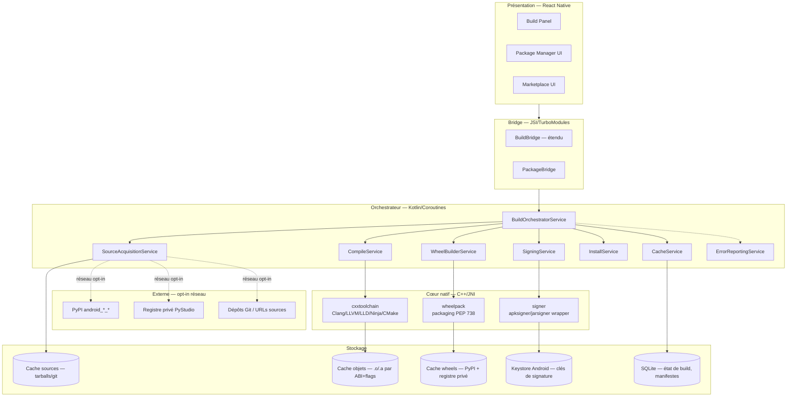
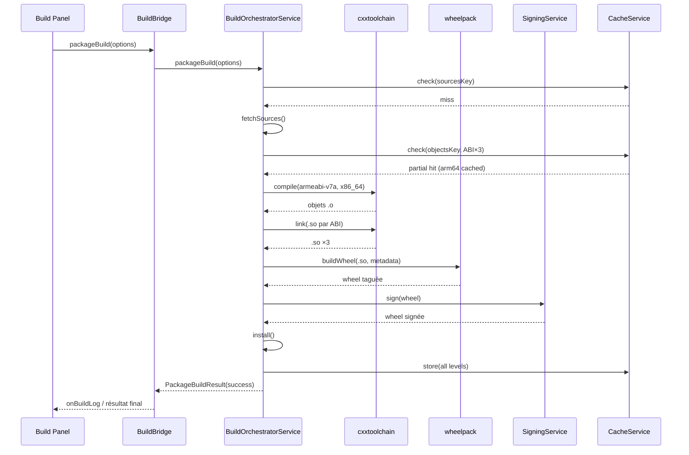
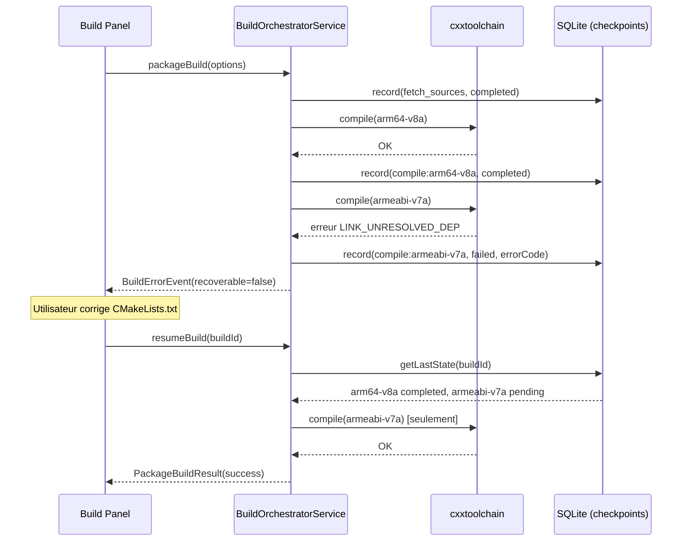
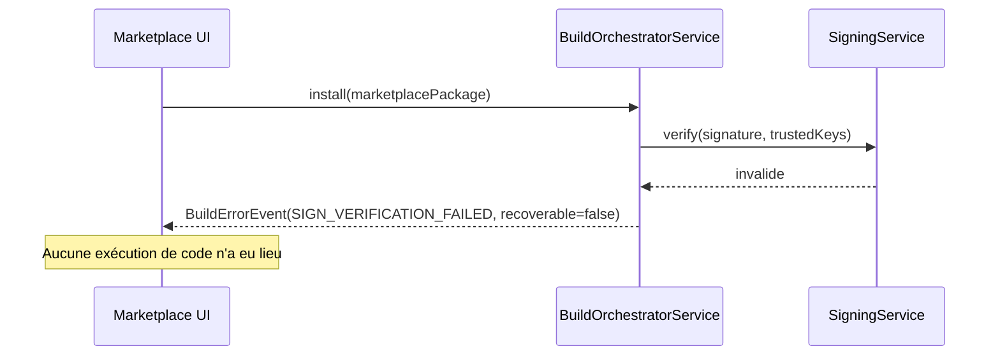

#### [REQ-FUNC-0360] PyStudio Mobile — Spécification du Build System : Android Package Builder

**Type de document :** Spécification technique — Système de build & packaging
**Auteur :** Build System Architect
**Version :** 1.0
**Date :** 12 juillet 2026
**Portée :** Téléchargement des sources, compilation C/C++, génération de bibliothèques `.so`, construction de wheels Android, signature, installation, mise en cache — support multi-ABI (arm64-v8a, armeabi-v7a, x86_64)
**Dépend de :** `PyStudio_Mobile_Architecture_Specification.md` (§7 Support C/C++, §13 APIs internes), `PyStudio_Mobile_Python_Runtime_Specification.md` (§6-7 Packages & Wheels, §13 ADR-2 versions CPython)
**Complète :** le module `cxxtoolchain` et le `BuildBridge` déjà définis dans l'architecture

---

##### [REQ-FUNC-0361] Table des matières

0. Principes directeurs du build system
1. Résumé exécutif
2. Architecture globale
3. Pipeline de build — vue d'ensemble
4. Étape 1 : Acquisition des sources
5. Étape 2 : Compilation C/C++
6. Étape 3 : Génération des bibliothèques `.so`
7. Étape 4 : Construction des wheels Android
8. Étape 5 : Signature
9. Étape 6 : Installation
10. Étape 7 : Mise en cache multi-niveaux
11. Support multi-ABI
12. API internes (contrats)
13. Gestion des erreurs
14. Diagrammes de séquence
15. Sécurité
16. Performances & parallélisme
17. Risques techniques & mitigations
18. Glossaire

---

##### [REQ-FUNC-0362] 0. Principes directeurs du build system

| Principe | Description | Implication technique |
|---|---|---|
| **Idempotence** | Relancer un build avec les mêmes entrées doit produire un artefact bit-identique (ou fonctionnellement identique) | Hashing des entrées (sources, flags, toolchain), clé de cache déterministe |
| **Résumabilité** | Un build interrompu (app tuée, batterie faible, réseau coupé) doit pouvoir reprendre sans tout refaire | État persistant par étape, checkpoints en SQLite |
| **Échec rapide et explicite** | Toute erreur doit être détectée au plus tôt et remontée avec un code et un contexte exploitables | Taxonomie d'erreurs typée (§13), validation en amont de chaque étape |
| **Aucun réseau obligatoire pour rebuild** | Un projet déjà résolu doit pouvoir être rebuild hors-ligne | Cache local complet des sources, wheels et toolchains déjà téléchargées |
| **Isolation des builds** | Le build d'un projet ne doit jamais corrompre le cache ou l'espace d'un autre projet | Répertoires de build par `projectId` + `buildId`, sandboxing FS |
| **Parité multi-ABI** | Les trois ABI supportées doivent produire des artefacts de qualité équivalente, testés de façon symétrique | Matrice de build systématique, pas d'ABI "citoyen de seconde zone" |
| **Traçabilité complète** | Chaque artefact produit doit pouvoir être retracé jusqu'à ses sources, ses flags et sa toolchain exacts | Manifeste de build (`build-manifest.json`) attaché à chaque `.so`/wheel |

---

##### [REQ-FUNC-0363] 1. Résumé exécutif

L'**Android Package Builder** est le sous-système de PyStudio Mobile responsable de transformer du code source (Python pur, extensions natives C/C++, ou projets C/C++ autonomes) en artefacts exécutables ou installables sur Android : bibliothèques partagées `.so`, wheels Python taguées `android_<api>_<abi>` (conformes PEP 738), et exécutables natifs. Il orchestre sept étapes séquentielles mais partiellement parallélisables — **acquisition des sources → compilation C/C++ → génération de `.so` → construction de wheel → signature → installation → mise en cache** — au-dessus des toolchains déjà décrites dans l'architecture (`cxxtoolchain` : Clang/LLVM/CMake/Ninja) et conformément aux décisions du runtime Python (CPython 3.13/3.14, wheels PyPI-first, ADR-2).

Il s'agit d'un service Kotlin (`BuildOrchestratorService`) exposé au frontend via l'existant `BuildBridge` (étendu ici), qui délègue les opérations lourdes au cœur natif C++ (`cxxtoolchain`) via JNI, et persiste son état dans SQLite pour permettre reprise et cache multi-niveaux. Le système supporte nativement les trois ABI cibles (arm64-v8a, armeabi-v7a, x86_64) avec une matrice de build symétrique, et intègre une taxonomie d'erreurs structurée permettant à l'IDE d'afficher des diagnostics actionnables plutôt que des logs bruts de `ld`/`clang`.

---

##### [REQ-FUNC-0364] 2. Architecture globale



###### [REQ-FUNC-0365] 2.1 Positionnement vis-à-vis de l'architecture existante

Le Package Builder **ne remplace pas** `cxxtoolchain` ni `pyembed` (architecture §2, §6-7) : il les **orchestre**. `BuildOrchestratorService` devient le point d'entrée unique pour toute opération de build/packaging, remplaçant l'appel direct que l'architecture initiale envisageait entre `ProcessManagerService` et `cxxtoolchain`. Cela introduit une couche d'orchestration à état explicite, nécessaire pour la reprise sur erreur et le cache multi-niveaux (absents de la spécification d'architecture initiale).

---

##### [REQ-FUNC-0366] 3. Pipeline de build — vue d'ensemble


| # | Étape | Entrée | Sortie | Parallélisable par |
|---|---|---|---|---|
| 1 | Acquisition des sources | URL/Git ref/nom de package | Répertoire source vérifié (checksum) | Source indépendante |
| 2 | Compilation C/C++ | Sources + `CMakeLists.txt`/flags | Objets `.o`/`.a` | ABI × cible |
| 3 | Génération `.so` | Objets + libs liées | `.so` par ABI | ABI |
| 4 | Construction wheel | `.so` + métadonnées + stdlib pure Python | Wheel `.whl` taguée | ABI × version Python |
| 5 | Signature | Artefact (wheel/apk/`.so`) | Artefact signé + signature détachée | — (séquentiel, clé unique) |
| 6 | Installation | Artefact signé | Package actif dans l'environnement projet | — |
| 7 | Mise en cache | Tout artefact intermédiaire ou final | Entrée de cache indexée | — |

Chaque étape produit un **enregistrement d'état** (`BuildStepRecord`) persisté en SQLite, permettant une reprise à l'étape exacte d'échec plutôt qu'un redémarrage complet (cf. §13.4).

---

##### [REQ-FUNC-0367] 4. Étape 1 : Acquisition des sources

###### [REQ-FUNC-0368] 4.1 Sources supportées

| Type de source | Mécanisme | Vérification d'intégrité |
|---|---|---|
| Package PyPI (`sdist`/wheel source) | Résolveur PubGrub (cf. runtime §6) → téléchargement HTTPS | Hash SHA-256 comparé au `pystudio.lock` |
| Dépôt Git (projet utilisateur ou dépendance vendored) | `libgit2` (déjà présent via `gitengine`, architecture §2) | Vérification du commit SHA après clone |
| Archive tarball/zip fournie par URL directe | Téléchargement HTTPS + extraction sandboxée | Hash SHA-256 si fourni, sinon avertissement non-bloquant |
| Sources locales (projet C/C++ de l'utilisateur) | Copie/lien depuis Scoped Storage | Aucune (confiance dans le sandbox utilisateur) |

###### [REQ-FUNC-0369] 4.2 Séquence

1. Résolution de l'URL/référence exacte (via `PackageResolverService`, déjà défini dans le runtime §12.2).
2. Vérification en cache (§10) — si déjà présent et hash valide, court-circuite le téléchargement.
3. Téléchargement en flux (streaming) avec reprise sur coupure (`Range` HTTP, `partial-download.tmp`).
4. Vérification du hash/signature (si disponible, ex. signature PyPI Sigstore).
5. Extraction dans un répertoire de build isolé (`/data/user/0/com.pystudio/files/builds/<buildId>/src/`).
6. Écriture d'un manifeste de provenance (`source-manifest.json` : URL, hash, date, méthode).

###### [REQ-FUNC-0370] 4.3 Cas hors-ligne

Si aucune source réseau n'est disponible et que le cache local ne contient pas l'entrée demandée : échec explicite `SRC_UNAVAILABLE_OFFLINE` (§13.2) plutôt qu'une tentative silencieuse — cohérent avec le principe « offline-first » de l'architecture, qui suppose la disponibilité du cache et non une dégradation silencieuse.

---

##### [REQ-FUNC-0371] 5. Étape 2 : Compilation C/C++

###### [REQ-FUNC-0372] 5.1 Toolchain

Réutilise intégralement `cxxtoolchain` (architecture §2, §7) : Clang/LLVM + LLD + Ninja + CMake portable, avec sysroots par ABI issus du NDK embarqué. Le Package Builder ajoute au-dessus :

- Un **planificateur de compilation** qui détermine, pour chaque unité de compilation, si un objet en cache peut être réutilisé (cf. §10.2).
- Un **wrapper de flags** qui injecte automatiquement les flags requis par la parité build officiel/build mobile (runtime §0) : `-fPIC`, `--target=<triple>`, `-D__ANDROID_API__=<niveau>`, et les optimisations décidées par profilage (LTO/PGO, runtime §11) uniquement en mode `release`.

###### [REQ-FUNC-0373] 5.2 Modes de build

| Mode | Flags additionnels | Usage |
|---|---|---|
| `debug` | `-g -O0 -fno-omit-frame-pointer` | Développement, débogage LLDB (DAP) |
| `release` | `-O2 -flto=thin`, PGO si profil disponible | Distribution, marketplace |
| `profile` | `-O2 -fprofile-instr-generate` | Génération de profils pour PGO/AutoFDO (runtime §11) |

###### [REQ-FUNC-0374] 5.3 Invocation CMake standard

```bash
cmake -S "$SRC_DIR" -B "$BUILD_DIR/$ABI" \
  -DCMAKE_TOOLCHAIN_FILE="$NDK/build/cmake/android.toolchain.cmake" \
  -DANDROID_ABI="$ABI" \
  -DANDROID_PLATFORM="android-21" \
  -DCMAKE_BUILD_TYPE="$MODE" \
  -DBUILD_SHARED_LIBS=ON \
  -G Ninja

cmake --build "$BUILD_DIR/$ABI" --target "$TARGET" -j"$JOBS"
```

###### [REQ-FUNC-0375] 5.4 Compilation d'extensions Python natives

Pour les extensions liant Python (C-API, pybind11, Cython, ctypes/cffi — architecture §7.10), la compilation inclut automatiquement les headers `Python.h` de la version CPython ciblée (3.13/3.14, runtime ADR-2) et lie contre `libpython3.1x.so` en mode `-shared -undefined dynamic_lookup` équivalent Android (résolution au chargement via `dlopen`, cohérent avec le modèle d'embedding officiel PEP 738).

---

##### [REQ-FUNC-0376] 6. Étape 3 : Génération des bibliothèques `.so`

###### [REQ-FUNC-0377] 6.1 Séquence

1. Édition de liens (`LLD`) des objets `.o`/`.a` en `.so` par cible × ABI.
2. Strip conditionnel des symboles de debug (conservés à part en `.so.debug` pour symbolication de crash différée, jamais expédiés en `release`).
3. Vérification des dépendances dynamiques (`readelf -d`) : toute dépendance non résolue vers une bibliothèque système absente du sysroot Android déclenche une erreur `LINK_UNRESOLVED_DEP` (§13.2) avant d'aller plus loin.
4. Apposition d'un identifiant de build unique dans une section ELF dédiée (`.note.pystudio-build-id`) pour traçabilité post-mortem (crash reports).

###### [REQ-FUNC-0378] 6.2 Structure de sortie par ABI

```
build/<buildId>/out/
├── arm64-v8a/
│   ├── libcore-native.so
│   └── libcore-native.so.debug
├── armeabi-v7a/
│   ├── libcore-native.so
│   └── libcore-native.so.debug
└── x86_64/
    ├── libcore-native.so
    └── libcore-native.so.debug
```

---

##### [REQ-FUNC-0379] 7. Étape 4 : Construction des wheels Android

###### [REQ-FUNC-0380] 7.1 Conformité PEP 738 / tags de wheel

Le module natif `wheelpack` construit des wheels conformes au tag standardisé **`android_<api-level>_<abi>`** (ex. `android_21_arm64_v8a`), aligné sur `cibuildwheel` et acceptés par PyPI (runtime §1, §7). Ordre de résolution déjà défini côté runtime (PyPI officiel → registre privé PyStudio → build local) — le Package Builder est le composant qui **produit** l'artefact du troisième cas.

###### [REQ-FUNC-0381] 7.2 Structure d'une wheel produite

```
mon_package-1.0.0-cp313-cp313-android_21_arm64_v8a.whl
├── mon_package/
│   ├── __init__.py
│   ├── _native.cpython-313-android_21_arm64_v8a.so   # ZIP_STORED, non compressé
│   └── ...
├── mon_package-1.0.0.dist-info/
│   ├── METADATA
│   ├── RECORD
│   ├── WHEEL
│   └── pystudio-build-manifest.json   # provenance, flags, hash sources, toolchain
```

Cohérent avec la décision runtime §2.4 : entrées **`ZIP_STORED`** (non compressées) pour permettre le `mmap()` direct des `.pyc`/`.so`, y compris pour les wheels tierces construites localement.

###### [REQ-FUNC-0382] 7.3 Étapes internes

1. Assemblage de l'arborescence `dist-info` (métadonnées PEP 427/658).
2. Copie des `.so` compilés (§6) sous le nom taggé correct par ABI.
3. Compilation bytecode niveau 2 (`compileall -O2`, cohérent runtime §2.4) des modules Python purs additionnels.
4. Génération du `RECORD` (hash SHA-256 + taille de chaque fichier, requis par la spec wheel).
5. Zippage `ZIP_STORED`.
6. Écriture du `pystudio-build-manifest.json` (traçabilité, §0).

###### [REQ-FUNC-0383] 7.4 Wheels multi-ABI

Si le projet cible plusieurs ABI simultanément (ex. distribution marketplace), le Package Builder produit **une wheel par ABI** (le standard wheel ne supporte pas le fat-binary multi-ABI) plutôt qu'un artefact unique — cohérent avec le comportement PyPI standard pour Android.

---

##### [REQ-FUNC-0384] 8. Étape 5 : Signature

###### [REQ-FUNC-0385] 8.1 Objets à signer

| Artefact | Mécanisme | Clé |
|---|---|---|
| Wheel (registre privé PyStudio) | Signature détachée Sigstore-like (`.whl.sig`) | Clé de signing du compte développeur, stockée hors device (registre) |
| `.so` produit localement pour usage interne au projet | Signature optionnelle (empreinte SHA-256 dans le manifeste) | Aucune clé requise (usage local, pas de distribution) |
| Package marketplace destiné à publication | Signature cryptographique obligatoire (architecture §10, §16) | Clé développeur dans **Android Keystore** |
| APK/AAB final (si build d'application complète) | `apksigner` (v2/v3 scheme) | Clé de release dans Keystore |

###### [REQ-FUNC-0386] 8.2 Séquence de signature (marketplace)

1. Calcul du digest (SHA-256) de l'archive complète.
2. Signature du digest via la clé privée du Keystore (jamais exportée en clair, accès via `AndroidKeyStore` provider JCA).
3. Attachement de la signature + certificat public au manifeste.
4. Vérification immédiate (`verify()`) avant de considérer l'étape complète — un signe-puis-vérifie systématique, pas de confiance aveugle dans l'opération de signature.

###### [REQ-FUNC-0387] 8.3 Politique de rejet

Toute tentative d'installation (§9) d'un artefact marketplace dont la signature ne correspond pas à une clé de confiance connue (chaîne de certification vers le registre PyStudio ou clé développeur vérifiée) est **bloquée** avant exécution de tout code, avec erreur `SIGN_VERIFICATION_FAILED` (§13.2) — non contournable par l'utilisateur final sans action explicite de type « désactiver la vérification pour sources locales de développement », journalisée.

---

##### [REQ-FUNC-0388] 9. Étape 6 : Installation

###### [REQ-FUNC-0389] 9.1 Cibles d'installation

| Cible | Emplacement | Mécanisme |
|---|---|---|
| Environnement projet (venv émulé) | `/data/user/0/com.pystudio/files/envs/<envId>/site-packages/` | Extraction wheel + mise à jour de `RECORD`/`INSTALLER` |
| `.so` natif pour usage runtime immédiat | Répertoire de libs de l'environnement, chargé via `dlopen` par `pyembed` | Copie + `chmod` exécutable |
| Package marketplace (plugin/thème/template) | Registre local de plugins (SQLite + Scoped Storage) | Extraction + enregistrement dans `PackageManagerService` |

###### [REQ-FUNC-0390] 9.2 Séquence

1. Vérification de compatibilité (version Python cible, ABI de l'appareil détecté via `Build.SUPPORTED_ABIS`).
2. Vérification de signature si applicable (§8.3).
3. Résolution de conflits avec packages déjà installés (version déjà présente → skip ou mise à jour selon `pystudio.lock`).
4. Extraction atomique : écriture dans un répertoire temporaire puis `rename()` atomique vers la destination finale (jamais d'état partiellement installé visible).
5. Mise à jour du `pystudio.lock` (runtime §6) et invalidation du cache d'import (`sys.path` / `zipimport` cache, runtime §5).
6. Émission d'un événement `onPackageInstalled` (streaming, cf. §12.1) consommé par l'UI Marketplace/Package Manager.

###### [REQ-FUNC-0391] 9.3 Rollback

En cas d'échec à toute sous-étape de l'installation (5.x), le répertoire temporaire est purgé et l'état antérieur du `pystudio.lock` restauré à partir du dernier checkpoint SQLite (§13.4) — aucune installation partielle ne doit rester visible au système d'import.

---

##### [REQ-FUNC-0392] 10. Étape 7 : Mise en cache multi-niveaux

###### [REQ-FUNC-0393] 10.1 Niveaux de cache

| Niveau | Contenu | Clé de cache | Éviction |
|---|---|---|---|
| **L1 — Sources** | Tarballs/clones Git déjà téléchargés | Hash de l'URL/ref + hash du contenu | LRU, budget configurable (défaut 500 Mo) |
| **L2 — Objets de compilation** | `.o`/`.a` intermédiaires | Hash(flags + version toolchain + hash fichier source) | LRU par ABI, budget par projet |
| **L3 — Wheels résolues** | Wheels PyPI/registre privé/locales déjà construites | `(nom, version, tag ABI/API/Python)` exact | Jamais évincé automatiquement sauf pression mémoire critique (packages = coûteux à reconstruire) |
| **L4 — Artefacts signés** | Wheels/`.so` déjà signés | Hash de l'artefact non signé + clé utilisée | Lié au cycle de vie de la clé (invalidé si rotation de clé) |

###### [REQ-FUNC-0394] 10.2 Réutilisation incrémentale (compilation)

Avant toute compilation d'une unité, le planificateur (§5.1) calcule une clé composite `hash(source, flags_normalisés, version_clang, version_ndk, ABI)` et consulte L2. Un **hit** court-circuite entièrement l'appel à Clang pour cette unité — cohérent avec le principe de performance « cache de compilation, indexation incrémentale » déjà énoncé dans l'architecture (§0).

###### [REQ-FUNC-0395] 10.3 Réaction à la pression mémoire/stockage

Sur `onTrimMemory`/espace disque faible : éviction en priorité L1 > L2 > jamais L3/L4 sauf confirmation utilisateur explicite (reconstruire une wheel scientifique lourde comme PyTorch Mobile peut prendre plusieurs minutes ; les sources tarball sont re-téléchargeables à faible coût).

###### [REQ-FUNC-0396] 10.4 Invalidation

Toute mise à jour de la toolchain (nouvelle version Clang/CMake embarquée) invalide automatiquement L2 (clé de cache incluant la version toolchain) mais **pas** L1/L3 (les sources et wheels restent valides indépendamment de la toolchain locale).

---

##### [REQ-FUNC-0397] 11. Support multi-ABI

###### [REQ-FUNC-0398] 11.1 Matrice ABI (héritée et étendue, architecture §7.8 / runtime §2.3)

| ABI | Triple Clang | API level min | Usage | Statut dans le pipeline |
|---|---|---|---|---|
| **arm64-v8a** | `aarch64-linux-android21` | 21 | Cible principale (quasi-totalité des devices modernes) | Build + tests systématiques, bloquant en CI |
| **armeabi-v7a** | `armv7a-linux-androideabi21` | 21 | Entrée de gamme / legacy | Build systématique, tests best-effort (matrice OEM réduite) |
| **x86_64** | `x86_64-linux-android21` | 21 | Émulateurs, tablettes/Chromebooks x86 | Build systématique, tests sur émulateur uniquement |

###### [REQ-FUNC-0399] 11.2 Stratégie de build symétrique

Chaque exécution du pipeline (§3) itère sur les trois ABI par défaut pour toute cible destinée au marketplace ou à une release. Pour un build de **développement local**, seule l'ABI de l'appareil connecté est construite par défaut (`ANDROID_ABI` auto-détectée via `Build.SUPPORTED_ABIS[0]`), avec option explicite « Build toutes les ABI » dans le Build Panel — évite un gaspillage de CPU/batterie en boucle d'édition rapide, cohérent avec le principe runtime « démarrage perçu instantané » appliqué ici à l'itération de développement.

###### [REQ-FUNC-0400] 11.3 Parallélisation inter-ABI

Les trois ABI sont **indépendantes par construction** (répertoires de build, caches et sysroots distincts) : elles sont compilées en parallèle via un pool de coroutines borné (`ProcessManagerService`, architecture §4), avec un budget de parallélisme adaptatif selon le nombre de cœurs disponibles et la température thermique de l'appareil (throttling, cohérent architecture §16 risques).

---

##### [REQ-FUNC-0401] 12. API internes (contrats)

###### [REQ-FUNC-0402] 12.1 Extension du `BuildBridge` (TypeScript, étend architecture §13.1/§13.4)

```typescript
export interface PyStudioBuildBridge {
  // Existant (architecture §13.1), inchangé
  build(options: BuildOptions): Promise<BuildResult>;
  cancelBuild(buildId: string): Promise<void>;
  onBuildLog(callback: (chunk: BuildLogChunk) => void): () => void;

  // Nouveau — Package Builder
  packageBuild(options: PackageBuildOptions): Promise<PackageBuildResult>;
  resumeBuild(buildId: string): Promise<BuildResult>;
  getBuildState(buildId: string): Promise<BuildStateSnapshot>;
  onPackageInstalled(callback: (evt: PackageInstalledEvent) => void): () => void;
  onBuildError(callback: (err: BuildErrorEvent) => void): () => void;
}

export interface PackageBuildOptions {
  projectId: string;
  targetAbis: Abi[];                    // défaut : ABI de l'appareil en mode dev
  pythonVersion: '3.13' | '3.14' | '3.14t';
  mode: 'debug' | 'release' | 'profile';
  steps: BuildStep[];                   // sous-ensemble du pipeline, ex. ['compile','so','wheel']
  signAfterBuild?: boolean;
  installAfterBuild?: boolean;
}

export type BuildStep =
  | 'fetch_sources' | 'compile' | 'generate_so'
  | 'build_wheel' | 'sign' | 'install' | 'cache';

export interface PackageBuildResult {
  buildId: string;
  status: 'success' | 'partial' | 'failed';
  artifactsByAbi: Record<Abi, BuildArtifact[]>;
  manifestPath: string;                 // pystudio-build-manifest.json
  durationMs: number;
  cacheHits: CacheHitStats;
}

export interface BuildArtifact {
  path: string;
  type: 'so' | 'wheel' | 'apk' | 'aab';
  signed: boolean;
  sizeBytes: number;
  sha256: string;
}

export interface CacheHitStats {
  sourcesHit: number;
  objectsHit: number;
  wheelsHit: number;
  totalUnits: number;
}

export interface BuildStateSnapshot {
  buildId: string;
  currentStep: BuildStep;
  completedSteps: BuildStep[];
  resumable: boolean;
}

export interface PackageInstalledEvent {
  packageName: string;
  version: string;
  abi: Abi;
  envId: string;
}

export interface BuildErrorEvent {
  buildId: string;
  step: BuildStep;
  errorCode: BuildErrorCode;            // cf. §13.2
  message: string;
  context: Record<string, string>;
  recoverable: boolean;
}
```

###### [REQ-FUNC-0403] 12.2 Interface Kotlin (côté service)

```kotlin
interface BuildOrchestratorService {
    suspend fun packageBuild(options: PackageBuildOptions): PackageBuildResult
    suspend fun resumeBuild(buildId: String): BuildResult
    suspend fun getState(buildId: String): BuildStateSnapshot
    fun errorsFlow(buildId: String): Flow<BuildErrorEvent>
    fun installEventsFlow(): Flow<PackageInstalledEvent>
}

data class PackageBuildOptions(
    val projectId: String,
    val targetAbis: List<Abi> = listOf(Abi.detectDeviceAbi()),
    val pythonVersion: PythonVersion = PythonVersion.PY_313,
    val mode: BuildMode = BuildMode.DEBUG,
    val steps: List<BuildStep> = BuildStep.ALL,
    val signAfterBuild: Boolean = false,
    val installAfterBuild: Boolean = true
)

sealed class BuildOutcome {
    data class Success(val result: PackageBuildResult) : BuildOutcome()
    data class Failure(val error: BuildErrorEvent, val checkpoint: BuildStateSnapshot) : BuildOutcome()
}
```

###### [REQ-FUNC-0404] 12.3 En-tête JNI (C++) — extension de `cxxtoolchain`/`wheelpack`

```cpp
// package_builder_jni.h
extern "C" {

JNIEXPORT jobject JNICALL
Java_com_pystudio_core_BuildOrchestratorService_nativeCompile(
    JNIEnv* env, jobject thiz, jobject compileOptions);

JNIEXPORT jobject JNICALL
Java_com_pystudio_core_BuildOrchestratorService_nativeLinkSharedLib(
    JNIEnv* env, jobject thiz, jobjectArray objectFiles, jstring abi);

JNIEXPORT jobject JNICALL
Java_com_pystudio_core_BuildOrchestratorService_nativeBuildWheel(
    JNIEnv* env, jobject thiz, jobject wheelSpec);

JNIEXPORT jobject JNICALL
Java_com_pystudio_core_BuildOrchestratorService_nativeSignArtifact(
    JNIEnv* env, jobject thiz, jstring artifactPath, jstring keyAlias);

} // extern "C"
```

###### [REQ-FUNC-0405] 12.4 Table récapitulative des modules (étend architecture §13.4)

| Module JS | Service natif associé | Type d'appel | Description |
|---|---|---|---|
| `BuildBridge.packageBuild` | `BuildOrchestratorService` → `cxxtoolchain`/`wheelpack` | async + stream | Pipeline complet §3 |
| `BuildBridge.resumeBuild` | `BuildOrchestratorService` + `CacheService` | async | Reprise depuis checkpoint SQLite |
| `PackageBridge.fetchWheel` | `PackageResolverService` (runtime §12.2) | async | Résolution amont, réutilisée telle quelle |

---

##### [REQ-FUNC-0406] 13. Gestion des erreurs

###### [REQ-FUNC-0407] 13.1 Principes

- Chaque erreur porte un **code stable** (namespace par étape), un **message humain**, un **contexte structuré** (fichier, ABI, ligne de commande exécutée tronquée), et un indicateur **`recoverable`**.
- Aucune erreur native (signal, code de sortie non-zéro de `clang`/`cmake`) ne doit remonter brute à l'UI : elle est toujours traduite en `BuildErrorCode` avant traversée du Bridge.
- Les erreurs `recoverable: true` proposent une action de résolution (ex. "Nettoyer le cache et réessayer", "Basculer en mode hors-ligne").

###### [REQ-FUNC-0408] 13.2 Taxonomie des codes d'erreur

| Code | Étape | Cause typique | Recoverable |
|---|---|---|---|
| `SRC_UNAVAILABLE_OFFLINE` | Acquisition | Source non en cache, pas de réseau | Oui — réessayer en ligne |
| `SRC_HASH_MISMATCH` | Acquisition | Corruption réseau ou source altérée | Oui — re-télécharger |
| `SRC_AUTH_REQUIRED` | Acquisition | Dépôt privé sans identifiants | Oui — fournir des credentials |
| `COMPILE_SYNTAX_ERROR` | Compilation | Erreur de syntaxe C/C++ | Non — corriger le code |
| `COMPILE_TOOLCHAIN_MISSING` | Compilation | Toolchain non installée pour l'ABI demandée | Oui — déclencher téléchargement toolchain |
| `COMPILE_OOM_KILLED` | Compilation | Process de compilation tué par le Low Memory Killer | Oui — réduire le parallélisme, réessayer |
| `LINK_UNRESOLVED_DEP` | Génération `.so` | Symbole/bibliothèque manquante au link | Non — corriger les dépendances CMake |
| `LINK_ABI_MISMATCH` | Génération `.so` | Objet compilé pour une ABI incohérente avec la cible | Oui — recompiler proprement |
| `WHEEL_METADATA_INVALID` | Construction wheel | `project.json`/métadonnées incomplètes | Non — corriger la configuration projet |
| `WHEEL_TAG_UNSUPPORTED` | Construction wheel | Combinaison Python/ABI non couverte par PEP 738 | Non — changer de version cible |
| `SIGN_KEY_NOT_FOUND` | Signature | Alias de clé absent du Keystore | Oui — générer/importer une clé |
| `SIGN_VERIFICATION_FAILED` | Signature/Installation | Signature invalide ou clé non fiable | Non (sauf override explicite journalisé) |
| `INSTALL_CONFLICT` | Installation | Version déjà installée incompatible | Oui — proposer résolution (upgrade/downgrade) |
| `INSTALL_DISK_FULL` | Installation | Stockage insuffisant | Oui — libérer du cache (§10.3) puis réessayer |
| `CACHE_CORRUPTED` | Cache | Entrée de cache invalide (hash mismatch au hit) | Oui — invalidation + reconstruction |
| `BUILD_CANCELLED` | Toutes | Annulation utilisateur | Oui — état préservé pour reprise |
| `BUILD_THERMAL_THROTTLED` | Compilation | Limitation thermique de l'appareil | Oui — réduction auto du parallélisme, poursuite différée |

###### [REQ-FUNC-0409] 13.3 Stratégie de retry

| Catégorie | Politique |
|---|---|
| Erreurs réseau (`SRC_*`) | Retry exponentiel (3 tentatives, backoff 2s/4s/8s), puis échec explicite |
| Erreurs de ressource (`COMPILE_OOM_KILLED`, `BUILD_THERMAL_THROTTLED`) | Réduction automatique du parallélisme (§16) puis un seul retry automatique |
| Erreurs de code utilisateur (`COMPILE_SYNTAX_ERROR`, `LINK_UNRESOLVED_DEP`) | Aucun retry automatique — remontée directe à l'éditeur avec localisation |
| Erreurs de sécurité (`SIGN_VERIFICATION_FAILED`) | Jamais de retry automatique ni de contournement silencieux |

###### [REQ-FUNC-0410] 13.4 Checkpoints & reprise

Chaque étape complétée écrit un `BuildStepRecord` en SQLite : `{buildId, step, status, artifactRefs[], timestamp}`. `resumeBuild(buildId)` relit le dernier enregistrement `status = completed` et reprend à l'étape suivante — évite de recompiler des ABI déjà réussies si une seule échoue (ex. échec `armeabi-v7a` uniquement : `arm64-v8a` et `x86_64` déjà en cache L2/L3 ne sont pas refaits).

---

##### [REQ-FUNC-0411] 14. Diagrammes de séquence

###### [REQ-FUNC-0412] 14.1 Build complet réussi (nominal)



###### [REQ-FUNC-0413] 14.2 Échec en compilation avec reprise



###### [REQ-FUNC-0414] 14.3 Installation bloquée par signature invalide



---

##### [REQ-FUNC-0415] 15. Sécurité

| Dimension | Mesure |
|---|---|
| **Intégrité des sources** | Vérification de hash systématique (§4.2), rejet silencieux impossible — toujours un `BuildErrorEvent` |
| **Provenance** | `pystudio-build-manifest.json` attaché à chaque artefact (sources, flags, toolchain, horodatage) |
| **Signature** | Clés jamais exportées en clair (Android Keystore, JCA provider), signe-puis-vérifie systématique (§8.2) |
| **Sandbox de compilation** | Compilation exécutée dans un process isolé (`isolatedProcess`, cohérent ADR-1 architecture), pas d'accès réseau pendant la compilation elle-même (seule l'étape 1 en a besoin) |
| **Marketplace** | Aucune installation sans vérification de signature réussie (§8.3) ; revue statique automatique en amont côté registre (architecture §16) |
| **Secrets de build** | Clés de signature développeur jamais en clair dans les logs de build (masquage systématique dans `BuildLogChunk`) |

---

##### [REQ-FUNC-0416] 16. Performances & parallélisme

- **Parallélisme intra-build** : compilation multi-fichiers via Ninja (`-j<N>`), `N` borné par `min(coeurs_disponibles, budget_thermique_actuel)`.
- **Parallélisme inter-ABI** : les trois ABI compilées en coroutines concurrentes bornées (§11.3), avec dégradation automatique (réduction du nombre d'ABI en parallèle) si `BUILD_THERMAL_THROTTLED` est détecté.
- **Cache incrémental** : réutilisation systématique L1-L4 (§10) avant toute opération coûteuse — un rebuild après un seul changement de fichier ne recompile que l'unité modifiée et ses dépendants directs.
- **Budget batterie** : builds de fond planifiés via WorkManager (cohérent architecture §16), jamais de compilation intensive silencieuse hors premier plan sans consentement explicite.

---

##### [REQ-FUNC-0417] 17. Risques techniques & mitigations

| Risque | Impact | Mitigation |
|---|---|---|
| Divergence entre wheel produite localement et wheel officielle PyPI pour le même package | Moyen | `pystudio-build-manifest.json` traçable, tests de non-régression contre artefacts officiels (runtime §2.2, option C) |
| Corruption de cache multi-niveaux après crash pendant écriture | Moyen | Écriture atomique (temp + rename), checksum de validation à chaque lecture de cache (`CACHE_CORRUPTED` §13.2) |
| Compilation C++ intensive → surchauffe/latence perçue | Élevé | Throttling thermique adaptatif (§16), mode dev limité à l'ABI de l'appareil (§11.2) |
| Rotation de clé de signature invalidant des artefacts déjà en cache L4 | Faible | Invalidation ciblée L4 uniquement (§10.4), pas de purge globale |
| Fragmentation OEM affectant la disponibilité de `dlopen`/SELinux pour certains `.so` | Moyen | Reprend la mitigation déjà actée côté runtime (§13, option C retenue) : tests CTS/VTS-like sur matrice représentative |

---

##### [REQ-FUNC-0418] 18. Glossaire

| Terme | Définition |
|---|---|
| **ABI** | Application Binary Interface — architecture CPU cible (arm64-v8a, armeabi-v7a, x86_64) |
| **Wheel** | Format de distribution binaire Python (PEP 427), ici tagué `android_<api>_<abi>` (PEP 738) |
| **`.so`** | Bibliothèque partagée ELF, format natif Android pour code C/C++ compilé |
| **PGO/LTO** | Profile-Guided / Link-Time Optimization, optimisations de compilation basées sur profils réels ou visibilité inter-modules |
| **Checkpoint** | Enregistrement d'état persistant permettant la reprise d'un build interrompu |
| **`ZIP_STORED`** | Mode de stockage zip sans compression, permettant le `mmap()` direct des fichiers contenus |
| **Sigstore-like** | Mécanisme de signature détachée avec vérification de chaîne de confiance, inspiré de Sigstore |
| **Idempotence** | Propriété garantissant qu'un rebuild à entrées identiques produit un résultat équivalent |

---

*Fin de la spécification.*


##### [REQ-FUNC-0419] Compilation et Dépendances Natives pour la Data Science

Le **Package Builder** est conçu pour prendre en charge de manière robuste la compilation de l'écosystème scientifique :

- **Compilation automatique des dépendances :** Il compile automatiquement les dépendances C, C++ ou Fortran nécessaires (libpng, freetype, etc.) lors de l'installation de paquets complexes.
- **Production de Wheels Android :** Il produira des fichiers d'archives (wheels `.whl`) 100% compatibles avec l'environnement Android.
- **Gestion des dépendances natives :** Prise en charge des chemins de bibliothèques dynamiques (SO) via le mécanisme `auditwheel` ou équivalent adapté pour Android.
- **Support Multi-Architecture :** Le constructeur gère nativement la compilation croisée pour générer des binaires compatibles avec les architectures matérielles cibles : **ARM64, ARMv7, et x86_64**.

