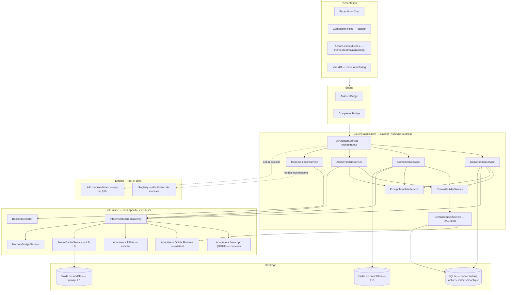
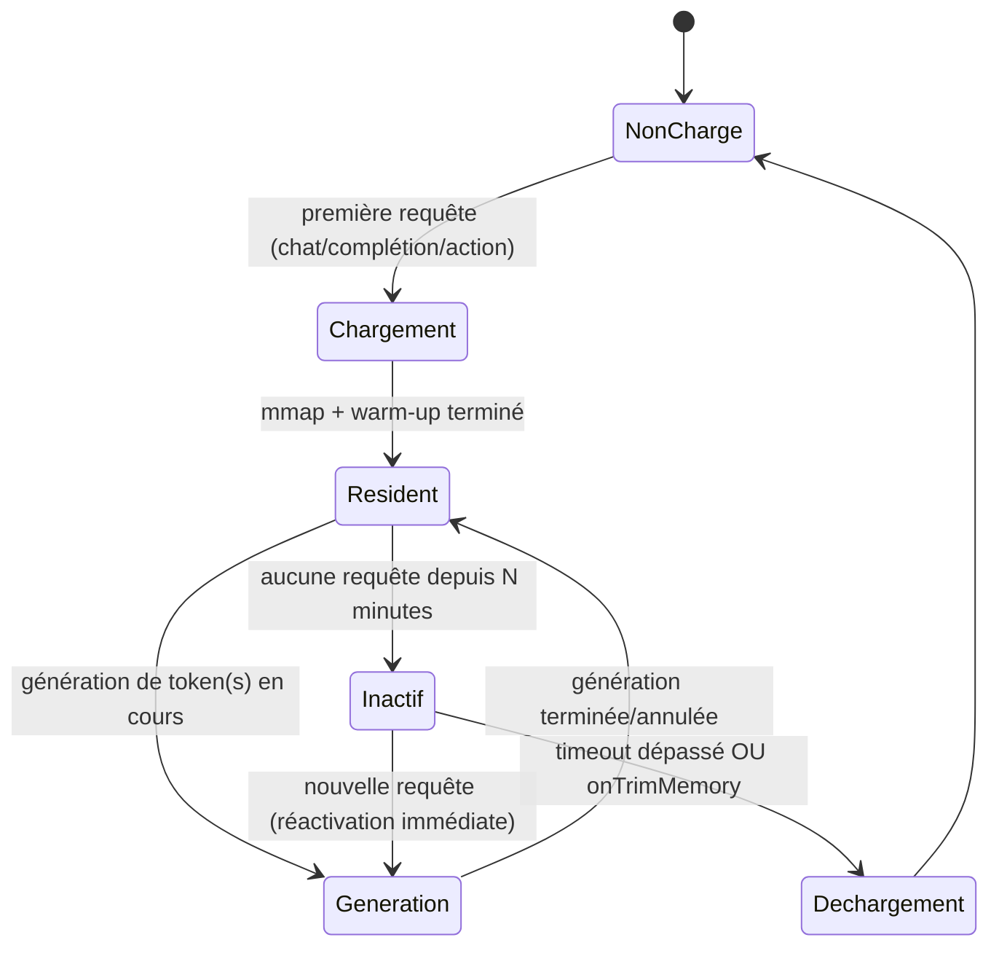
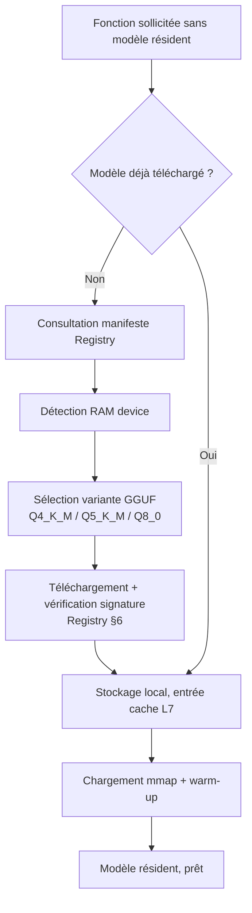
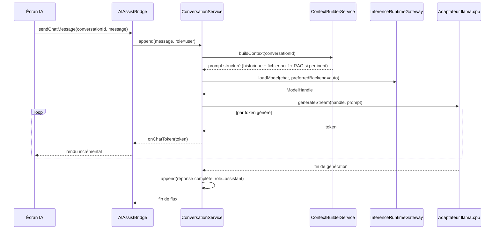
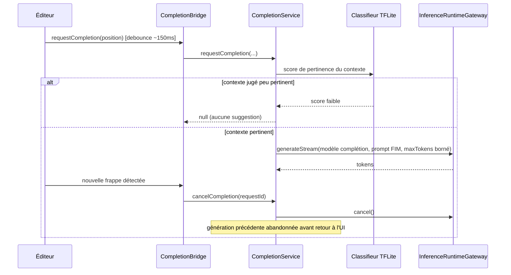
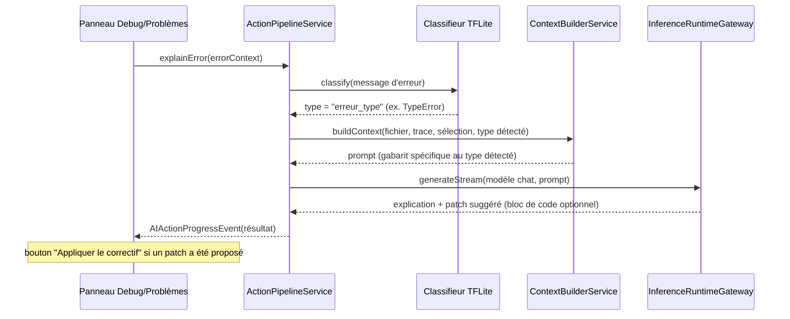
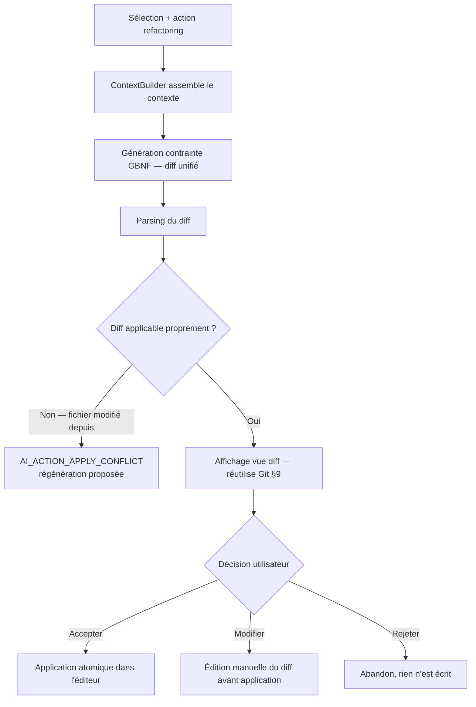
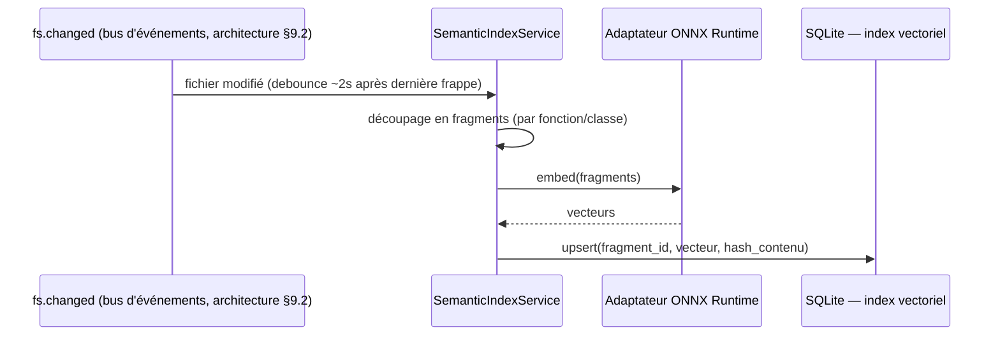
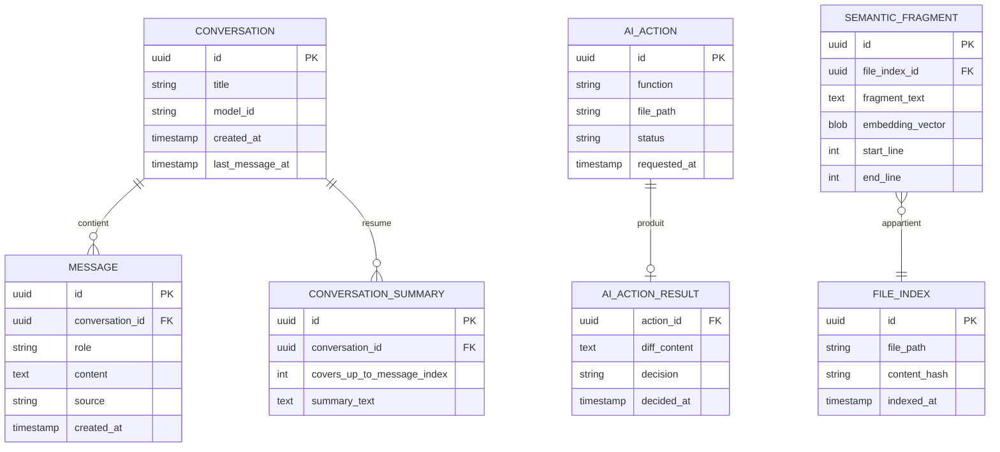

#### [REQ-FUNC-0420] PyStudio Mobile — Spécification du Système IA Intégré (« aiassist »)

**Type de document :** Spécification technique — Assistant IA intégré à l'IDE
**Auteur :** AI Assistant Systems Architect
**Version :** 1.0
**Date :** 12 juillet 2026
**Portée :** Chat, complétion, explication d'erreurs, génération de tests, refactoring, documentation automatique — support de modèles locaux (GGUF/llama.cpp, ONNX, TensorFlow Lite)
**Dépend de :**
- `PyStudio_Mobile_Architecture_Specification.md` (§2 `AIService`/`AIBridge`, §7 support C/C++, §8.4 séquence IA, §12.1 « modèles IA » comme objet Marketplace)
- `PyStudio_Mobile_AI_Runtime_Specification.md` (« mlruntime » : `InferenceRuntimeGateway`, `BackendSelector`, `ModelCacheService` L7-L9, `MemoryBudgetService`, chaîne de délégués GPU→vendeur→NNAPI→CPU, KV-cache §16.4)
- `PyStudio_Mobile_Python_Runtime_Specification.md` (ADR-2 CPython 3.13/3.14, cache multi-niveaux, `mmap` des poids)
- `PyStudio_Mobile_Android_Package_Builder_Specification.md` (compilation native de `llama.cpp` en `.so`, cache L1-L4)
- `PyStudio_Mobile_Package_Registry_Specification.md` (distribution des modèles comme artefacts signés)
- `PyStudio_Mobile_Git_Integration_Specification.md` (réutilisation de la vue diff pour la revue des propositions de refactoring)
- `PyStudio_Mobile_UI_UX_Specification.md` (écran IA §4.8, deux axes d'adaptation affichage/entrée)
**Complète :** le module `mlruntime` avec un nouvel adaptateur **`llama.cpp` (GGUF)**, et le module `AIService`/`AIBridge` déjà positionnés (mais non détaillés) dans l'architecture

---

##### [REQ-FUNC-0421] Table des matières

0. Principes directeurs
1. Résumé exécutif
2. Architecture globale
3. Support des formats de modèles
4. Sélection et cycle de vie des modèles
5. Construction du contexte (`ContextBuilder`)
6. Fonction — Chat
7. Fonction — Complétion
8. Fonction — Explication d'erreurs
9. Fonction — Génération de tests
10. Fonction — Refactoring
11. Fonction — Documentation automatique
12. Recherche sémantique de code (RAG local)
13. Gestion mémoire
14. Cache
15. Sécurité & confidentialité
16. Repli cloud (opt-in)
17. API interne (contrats)
18. Structures de données
19. Gestion des erreurs
20. Performances
21. Risques & mitigations
22. Glossaire

---

##### [REQ-FUNC-0422] 0. Principes directeurs

| Principe | Description | Implication technique |
|---|---|---|
| **Local par défaut, cloud jamais implicite** | Le code de l'utilisateur ne quitte l'appareil que sur consentement explicite et réversible | Tous les modèles cités dans cette spécification tournent on-device ; tout accès réseau est un choix opt-in distinct (§16) |
| **Une seule passerelle d'inférence** | L'assistant ne doit jamais dupliquer la logique de sélection de backend déjà définie côté `mlruntime` | Toute génération transite par `InferenceRuntimeGateway` (AI Runtime §2), jamais d'appel direct à un moteur natif depuis `aiassist` |
| **Le bon format pour le bon usage** | GGUF, ONNX et TFLite ne sont pas interchangeables : chacun sert une classe de tâche précise | Répartition explicite par fonction (§3.5), pas de choix arbitraire |
| **Latence perçue avant tout pour la complétion** | Une suggestion inline lente est pire qu'une absence de suggestion | Budget de latence dur, annulation systématique, modèle dédié plus petit (§7) |
| **Aucune action destructive silencieuse** | Refactoring, tests générés, documentation : toujours une proposition à valider, jamais une écriture directe | Réutilisation du modèle de revue par diff déjà établi côté Git (§10) |
| **Sortie contrainte plutôt qu'analyse a posteriori** | Un parsing fragile de texte libre est une source d'erreurs évitable | Grammaires GBNF (llama.cpp) pour contraindre la sortie du modèle au format attendu (diff, JSON) plutôt que de tenter de le deviner |
| **Confidentialité vérifiable** | L'utilisateur doit pouvoir constater, pas seulement croire, que rien ne part sans son accord | Indicateur permanent « Local » / « Cloud » dans l'UI (§16.2), journal d'audit des requêtes sortantes |

---

##### [REQ-FUNC-0423] 1. Résumé exécutif

Le système IA intégré de PyStudio Mobile (`aiassist`) fournit six fonctions — **chat, complétion, explication d'erreurs, génération de tests, refactoring, documentation automatique** — entièrement exécutables **on-device**, sans dépendance réseau obligatoire, cohérent avec le principe offline-first de l'ensemble de l'application. Il s'appuie sur trois formats de modèles complémentaires, chacun choisi pour ses forces propres : **GGUF** (via `llama.cpp`) pour les modèles génératifs de langage qui portent le chat, la complétion et les quatre fonctions d'action contextuelle ; **ONNX** pour les modèles d'embeddings qui alimentent la recherche sémantique de code (RAG local) et le classement de suggestions ; et **TensorFlow Lite** pour des classifieurs légers de filtrage (type d'erreur, langage détecté) qui évitent de solliciter un LLM pour des décisions triviales.

Architecturalement, `aiassist` **n'introduit pas** de nouveau moteur d'inférence bas-niveau : il étend le module `mlruntime` déjà spécifié avec un adaptateur `llama.cpp`, et construit par-dessus une couche applicative — construction de contexte, gabarits de prompt, sortie contrainte par grammaire, gestion de conversation, pipeline de revue par diff — propre aux besoins d'un assistant de codage plutôt qu'à l'inférence générique de modèles. Chaque fonction a un profil de latence et de contexte différent (la complétion tolère quelques centaines de millisecondes et un contexte étroit ; le chat tolère plusieurs secondes et un contexte large) : le document détaille pour chacune le modèle recommandé, le gabarit de prompt, et le flux de bout en bout.

---

##### [REQ-FUNC-0424] 2. Architecture globale



###### [REQ-FUNC-0425] 2.1 Positionnement

`aiassist` est une couche applicative qui **consomme** `InferenceRuntimeGateway` (AI Runtime §2) exactement comme le ferait du code Python utilisateur — pas de chemin privilégié ni de duplication de la logique de sélection de backend (`BackendSelector`, chaîne GPU/vendeur/NNAPI/CPU déjà actée AI Runtime §7.2/§13/§14). Sa valeur ajoutée propre est en amont (construction de contexte, gabarits de prompt, gestion de conversation) et en aval (parsing contraint par grammaire, pipeline de revue) de l'appel d'inférence lui-même.

---

##### [REQ-FUNC-0426] 3. Support des formats de modèles

###### [REQ-FUNC-0427] 3.1 Vue d'ensemble — répartition par format

| Format | Runtime | Rôle dans `aiassist` | Poids typique |
|---|---|---|---|
| **GGUF** | `llama.cpp` (nouvel adaptateur `mlruntime`) | Génération de langage : chat, complétion, explication, tests, refactoring, documentation | 300 Mo (complétion) à 4 Go (chat, quantifié Q4_K_M) |
| **ONNX** | ONNX Runtime (AI Runtime §11, existant) | Modèles d'embeddings pour la recherche sémantique de code (§12), ranking de suggestions | 50-150 Mo |
| **TensorFlow Lite** | TFLite (AI Runtime §7, existant) | Classifieurs légers : type d'erreur, langage détecté, filtrage de pertinence pré-génération | < 10 Mo |

###### [REQ-FUNC-0428] 3.2 GGUF / `llama.cpp` — modèles génératifs

`llama.cpp` est compilé en `.so` par ABI via le **Package Builder** (mode `release`, LTO activé, cohérent Package Builder §5.2/§11.1), exposant une API C (`llama.h`) enveloppée par un nouvel adaptateur `mlruntime` :

```cpp
// mlruntime/adapters/llama_adapter.h — nouvel adaptateur, complète AI Runtime §2
class LlamaAdapter : public InferenceAdapter {
public:
    ModelHandle load(const LoadModelOptions& options) override;
    // Génération en flux (spécifique aux LLM, contrairement à l'inférence tenseur-in/tenseur-out
    // de TFLite/ONNX) — un callback par token produit, pas un résultat unique
    void generateStream(ModelHandle handle, const GenerationRequest& req,
                         std::function<void(const Token&)> onToken);
    void cancel(ModelHandle handle);
    void release(ModelHandle handle) override;
};
```

Caractéristiques exploitées :

- **`mmap()` natif des poids** — cohérent avec le choix déjà acté pour les `.pyc`/wheels (runtime §2.4) et les autres formats de modèle (AI Runtime §16.2), sans action supplémentaire côté `aiassist`.
- **Quantification K-quants** (`Q4_K_M`, `Q5_K_M`, `Q8_0`) — le manifeste de modèle (§18.2) déclare plusieurs variantes ; `ModelSelectionService` choisit la variante selon la RAM disponible du device (§4.2).
- **Grammaires GBNF** — contrainte de sortie au format attendu (diff unifié, JSON) directement au niveau du sampling, éliminant la classe d'erreurs « le modèle n'a pas respecté le format demandé » plutôt que de la corriger après coup (§10.3, §19).
- **Fenêtre de contexte bornée** (4096-8192 tokens selon le modèle) — `ContextBuilderService` (§5) gère activement ce budget plutôt que de le laisser déborder silencieusement.

###### [REQ-FUNC-0429] 3.3 ONNX — modèles d'embeddings et de ranking

Réutilise intégralement l'adaptateur ONNX Runtime déjà spécifié (AI Runtime §11), sans extension nécessaire côté `mlruntime` : un modèle d'embeddings de code (type `all-MiniLM`/`code-embedding` exporté en ONNX, quantifié INT8) produit un vecteur par fragment de code, consommé par `SemanticIndexService` (§12) pour la recherche sémantique locale et, optionnellement, pour reclasser plusieurs suggestions de complétion candidates par similarité au contexte récent.

###### [REQ-FUNC-0430] 3.4 TensorFlow Lite — classifieurs légers

Réutilise l'adaptateur TFLite existant (AI Runtime §7) pour des modèles de classification très légers (< 10 Mo, quelques ms d'inférence CPU) :

| Classifieur | Usage |
|---|---|
| Type d'erreur (syntaxe / type / logique / import / native) | Oriente le gabarit de prompt d'explication d'erreurs (§8.2) sans solliciter le LLM pour cette décision |
| Langage détecté (utile en notebook multi-langage ou fichier ambigu) | Sélectionne le gabarit de prompt et les conventions de style pour tests/documentation |
| Score de pertinence pré-génération | Filtre les demandes de complétion sur un contexte jugé trop pauvre (ex. ligne vide en tout début de fichier) avant de solliciter le LLM, économisant latence et batterie |

###### [REQ-FUNC-0431] 3.5 Modèles locaux — principe transverse

« Modèle local » n'est pas un format supplémentaire mais l'**état par défaut** des trois formats ci-dessus : tous s'exécutent on-device via `InferenceRuntimeGateway`, avec la même chaîne de délégués matériels (GPU/Vulkan → vendeur → NNAPI legacy → CPU/XNNPACK, AI Runtime §7.2) que le reste du runtime IA. Le repli vers un modèle distant (§16) est une capacité additionnelle, jamais une dépendance.

###### [REQ-FUNC-0432] 3.6 Table de décision — fonction → format

| Fonction | Format principal | Format auxiliaire |
|---|---|---|
| Chat | GGUF | ONNX (recherche sémantique de contexte, §12) |
| Complétion | GGUF (modèle dédié, plus petit) | TFLite (filtre de pertinence pré-génération) |
| Explication d'erreurs | GGUF | TFLite (classification du type d'erreur) |
| Génération de tests | GGUF | — |
| Refactoring | GGUF (sortie contrainte par grammaire) | — |
| Documentation automatique | GGUF | — |

---

##### [REQ-FUNC-0433] 4. Sélection et cycle de vie des modèles

###### [REQ-FUNC-0434] 4.1 `ModelSelectionService`

Pour chaque fonction, un modèle par défaut est proposé (téléchargeable depuis le **Registry**, §17.1) mais reste substituable par l'utilisateur (paramètre par fonction, écran Paramètres). La sélection tient compte de :

- La RAM totale du device (tiers indicatifs : < 4 Go / 4-8 Go / > 8 Go), déterminant la variante de quantification GGUF proposée par défaut.
- La disponibilité d'un délégué GPU performant (AI Runtime §13.2) — un device sans GPU Vulkan viable est orienté vers une variante plus fortement quantifiée pour compenser en CPU.
- Le modèle déjà résident en mémoire (§4.2) — éviter un rechargement coûteux si le modèle demandé est déjà chargé pour une autre fonction compatible.

###### [REQ-FUNC-0435] 4.2 Cycle de vie mémoire



Un seul modèle génératif (GGUF) est maintenu **résident** à la fois par défaut sur les devices à RAM contrainte (< 4 Go) ; les devices plus généreux peuvent maintenir simultanément le modèle de chat et le modèle de complétion (plus petit) résidents pour éviter tout rechargement lors d'un usage alterné. Cette politique est déléguée à `MemoryBudgetService` (AI Runtime §16.1), `aiassist` ne fait que déclarer son budget estimé par modèle au moment du chargement.

###### [REQ-FUNC-0436] 4.3 Téléchargement et sélection de variante



---

##### [REQ-FUNC-0437] 5. Construction du contexte (`ContextBuilder`)

###### [REQ-FUNC-0438] 5.1 Rôle

`ContextBuilderService` assemble, pour chaque appel d'inférence, un contexte structuré à partir de sources hétérogènes, puis le sérialise selon le gabarit de la fonction sollicitée (§5.3). C'est le composant partagé par les six fonctions — chacune en consomme un sous-ensemble différent.

###### [REQ-FUNC-0439] 5.2 Sources de contexte

| Source | Contenu | Fonctions consommatrices |
|---|---|---|
| Fichier actif | Contenu complet ou fenêtré autour du curseur | Toutes |
| Sélection | Plage de texte sélectionnée par l'utilisateur | Explication, tests, refactoring, documentation |
| Diagnostics LSP | Erreurs/avertissements du fichier actif (architecture §3.2) | Explication d'erreurs |
| Trace d'exécution | Stack trace du panneau Débogage | Explication d'erreurs |
| Historique de conversation | Tours précédents du chat en cours | Chat |
| Index sémantique | Fragments de code similaires du projet (§12) | Chat (questions transverses au projet) |
| Conventions détectées | Style de test existant, style de docstring dominant | Génération de tests, documentation |
| Statut Git | Fichiers modifiés récents (indice de pertinence) | Chat (questions type « qu'ai-je changé ? ») |

###### [REQ-FUNC-0440] 5.3 Budget de tokens

Chaque gabarit déclare un budget maximal (fonction de la fenêtre de contexte du modèle actif, §3.2). `ContextBuilderService` applique, dans l'ordre, une **troncature par priorité** (fenêtre du fichier actif > sélection > diagnostics > historique récent > index sémantique), puis, si l'historique de conversation dépasse encore le budget, une **résumé compressif** des tours les plus anciens (génération d'un résumé court par le même modèle, mis en cache par conversation) plutôt qu'une simple coupe silencieuse qui ferait perdre le fil au modèle.

---

##### [REQ-FUNC-0441] 6. Fonction — Chat

###### [REQ-FUNC-0442] 6.1 Flux



###### [REQ-FUNC-0443] 6.2 Conversation multi-tour

Chaque conversation est persistée (SQLite, §18.1) avec son historique complet ; le KV-cache (AI Runtime §16.4) est réutilisé d'un tour à l'autre **tant que la conversation reste active et que le modèle reste résident**, évitant de retraiter tout l'historique à chaque message — bascule vers un retraitement complet uniquement si le modèle a été déchargé entre-temps (§4.2) ou si la conversation dépasse la fenêtre de contexte (résumé compressif, §5.3).

###### [REQ-FUNC-0444] 6.3 Actions depuis le chat

Une réponse peut contenir un ou plusieurs blocs de code proposés : chacun porte une action **« Appliquer »** (insertion/remplacement dans l'éditeur actif via le même mécanisme que les autres fonctions d'action, §10.4) et **« Copier »**, jamais d'application automatique sans confirmation (cohérent §0).

---

##### [REQ-FUNC-0445] 7. Fonction — Complétion

###### [REQ-FUNC-0446] 7.1 Contraintes spécifiques

La complétion (suggestion inline, style « ghost text ») a un profil radicalement différent du chat : déclenchement à chaque pause de frappe, budget de latence dur, annulation quasi systématique (l'utilisateur continue de taper avant la fin de la génération précédente).

###### [REQ-FUNC-0447] 7.2 Flux avec annulation



###### [REQ-FUNC-0448] 7.3 Gabarit FIM (Fill-In-the-Middle)

```
<|fim_prefix|>{texte avant le curseur, fenêtré}<|fim_suffix|>{texte après le curseur, fenêtré}<|fim_middle|>
```

Le modèle de complétion est délibérément plus petit (§3.6) et sa génération bornée à un faible nombre de tokens (une ligne à quelques lignes), jamais un bloc de fonction complet — au-delà, l'utilisateur est orienté vers le chat ou la génération de tests/documentation selon le cas.

###### [REQ-FUNC-0449] 7.4 Acceptation partielle

Cohérent avec l'expérience desktop attendue (UI/UX §7.2) : `Tab` accepte la suggestion complète, `Ctrl+→` accepte mot par mot — géré côté éditeur sans nouvel appel au modèle (la suggestion complète est déjà reçue, l'acceptation partielle est un découpage local du texte déjà généré).

---

##### [REQ-FUNC-0450] 8. Fonction — Explication d'erreurs

###### [REQ-FUNC-0451] 8.1 Déclenchement

Depuis le panneau Problèmes, le panneau Débogage (sur exception non gérée), ou une action contextuelle sur une ligne en erreur dans l'éditeur.

###### [REQ-FUNC-0452] 8.2 Flux



###### [REQ-FUNC-0453] 8.3 Gabarits par type d'erreur

Le classifieur TFLite (§3.4) oriente vers un gabarit de prompt spécialisé (ex. gabarit « TypeError » qui demande explicitement au modèle de vérifier la cohérence de signature, gabarit « ImportError » qui vérifie d'abord si le package est installé via `PackageManagerBridge` avant de solliciter le LLM) — évite des explications génériques peu actionnables.

---

##### [REQ-FUNC-0454] 9. Fonction — Génération de tests

###### [REQ-FUNC-0455] 9.1 Détection de convention

Avant génération, `ActionPipelineService` inspecte le répertoire `tests/` du projet (ou équivalent déclaré) pour détecter le framework en usage (`pytest` fixtures/paramétrage vs `unittest.TestCase`) et le style de nommage dominant, injectés comme exemples few-shot dans le prompt plutôt que laissés au choix implicite du modèle.

###### [REQ-FUNC-0456] 9.2 Portée

| Cible | Comportement |
|---|---|
| Fonction/méthode unique | Génère un jeu de cas (nominal, limites, erreurs) pour la cible sélectionnée |
| Classe entière | Génère un test par méthode publique, regroupés dans une classe de test cohérente avec la convention détectée |
| Fichier entier | Traitement séquentiel par unité testable, avec barre de progression (cohérent modèle des opérations longues déjà établi, ex. Package Builder) |

###### [REQ-FUNC-0457] 9.3 Insertion

Le résultat est proposé en **diff** sur le fichier de test cible (existant ou nouveau), jamais écrit directement — réutilise le composant de revue de diff déjà spécifié côté Git (§10.4).

---

##### [REQ-FUNC-0458] 10. Fonction — Refactoring

###### [REQ-FUNC-0459] 10.1 Types de refactoring proposés

| Action | Description |
|---|---|
| Renommage sémantique | Renomme un symbole en respectant toutes ses références dans le fichier/projet (s'appuie sur les diagnostics LSP pour la portée, pas seulement une recherche textuelle) |
| Extraction de fonction | Isole une plage sélectionnée en fonction nommée, avec signature inférée |
| Simplification | Réduction de complexité (ex. conditions imbriquées → garde-fous), sans changement de comportement revendiqué |
| Modernisation | Ex. ajout d'annotations de type, conversion en `dataclass`, f-strings |

###### [REQ-FUNC-0460] 10.2 Sortie contrainte par grammaire

Pour fiabiliser le parsing, la génération de refactoring utilise une **grammaire GBNF** contraignant la sortie à un format diff unifié strict (`--- a/... +++ b/... @@ ...`) — le modèle ne peut littéralement pas produire de token en dehors de cette structure, éliminant la classe d'erreurs de format côté parsing (cohérent §0).

###### [REQ-FUNC-0461] 10.3 Flux avec revue obligatoire



###### [REQ-FUNC-0462] 10.4 Application

L'application d'un diff accepté suit le même mécanisme d'écriture que toute modification éditeur standard — passe par l'historique d'annulation (`Ctrl+Z` défait un refactoring appliqué comme toute autre édition), aucun contournement de la pile d'undo native.

---

##### [REQ-FUNC-0463] 11. Fonction — Documentation automatique

###### [REQ-FUNC-0464] 11.1 Styles supportés

| Langage | Styles proposés | Détection |
|---|---|---|
| Python | Google, NumPy, reST | Style dominant détecté sur les docstrings existantes du fichier/projet, sinon préférence explicite dans les paramètres |
| C/C++ | Doxygen (`/** ... */`, `@param`, `@return`) | Détection similaire sur les commentaires existants |

###### [REQ-FUNC-0465] 11.2 Comportement sur docstring partielle

Trois modes configurables : **compléter uniquement** (ajoute les sections manquantes, ex. un `@param` pour un argument ajouté depuis), **régénérer entièrement**, ou **suggérer sans toucher** (affiche la proposition en info-bulle sans modifier le fichier tant que non acceptée) — le mode « compléter uniquement » est la valeur par défaut, la plus respectueuse du travail déjà présent.

###### [REQ-FUNC-0466] 11.3 Portée batch

Comme la génération de tests (§9.2), applicable à une fonction, une classe, ou un fichier entier, toujours via diff de revue (§10.3), jamais d'écriture directe.

---

##### [REQ-FUNC-0467] 12. Recherche sémantique de code (RAG local)

###### [REQ-FUNC-0468] 12.1 Motivation

Pour les questions de chat portant sur l'ensemble du projet (« où est gérée l'authentification ? »), le contexte du seul fichier actif est insuffisant, et injecter tout le projet dépasserait toute fenêtre de contexte réaliste sur mobile. `SemanticIndexService` maintient un index vectoriel local permettant de ne récupérer que les fragments pertinents.

###### [REQ-FUNC-0469] 12.2 Pipeline d'indexation



###### [REQ-FUNC-0470] 12.3 Requête

À la construction du contexte d'un message de chat (§5.2), `ContextBuilderService` embed la question elle-même puis interroge l'index par similarité cosinus (recherche exhaustive par balayage, suffisant pour la taille d'un projet mobile typique — quelques milliers de fragments — sans nécessiter de structure ANN dédiée), retenant les *k* fragments les plus proches sous le budget de tokens alloué (§5.3).

###### [REQ-FUNC-0471] 12.4 Portée et confidentialité

L'index reste **strictement local** (SQLite, §18.1), jamais synchronisé — cohérent avec le principe de confidentialité par défaut (§0, §15).

---

##### [REQ-FUNC-0472] 13. Gestion mémoire

Entièrement déléguée à `MemoryBudgetService` (AI Runtime §16), `aiassist` s'y intègre en :

- Déclarant un budget mémoire estimé par modèle GGUF au chargement (poids + KV-cache maximal selon la fenêtre de contexte configurée), cohérent avec le modèle de budget déjà en place pour les autres frameworks.
- Répondant à `onTrimMemory`/`MemoryPressureEvent` (AI Runtime §16.5) en déchargeant en priorité les conversations inactives (purge de leur KV-cache, §6.2) avant d'envisager le déchargement complet du modèle résident.
- N'exécutant **jamais** de fine-tuning ou d'entraînement on-device dans le cadre de cette spécification (hors périmètre — les frameworks lourds PyTorch/TensorFlow complets pour ce cas d'usage restent ceux déjà positionnés en AI Runtime §5-6, sans lien avec `aiassist`).

---

##### [REQ-FUNC-0473] 14. Cache

| Niveau | Contenu | Clé | Relation aux niveaux existants |
|---|---|---|---|
| **L7 (réutilisé)** | Poids GGUF/ONNX/TFLite | `(modèle, variante_quantification)` | Identique à AI Runtime §15.1 |
| **L8 (réutilisé)** | Graphe compilé/délégué GPU pour les modèles ONNX/TFLite du RAG et des classifieurs | Identique à AI Runtime §15.1 | — |
| **L9 (réutilisé)** | Sessions d'inférence actives | Identique à AI Runtime §15.1 | Étendu ici aux sessions `llama.cpp` (contexte KV par conversation) |
| **L10 — nouveau : Cache de complétion** | Dernières suggestions générées, clé = hash(préfixe, suffixe) | LRU, très court TTL (quelques secondes) | Évite une régénération identique si l'utilisateur annule puis reprend la frappe au même endroit |
| **L11 — nouveau : Résumés de conversation** | Résumés compressifs de tours anciens (§5.3) | `hash(plage de tours résumée)` | Invalidé uniquement si l'historique de la conversation est purgé |

---

##### [REQ-FUNC-0474] 15. Sécurité & confidentialité

| Dimension | Mesure |
|---|---|
| **Exécution locale par défaut** | Aucune donnée de code ne quitte l'appareil pour les six fonctions tant que le repli cloud (§16) n'est pas explicitement activé |
| **Aucune exécution automatique de code généré** | Tests, refactorings, correctifs : toujours une proposition en diff, jamais une exécution ou écriture directe (cohérent §0, Git §0) |
| **Provenance des modèles** | Modèles distribués via le Registry, vérification de signature obligatoire avant chargement (Registry §6, cohérent Package Builder §8.3) |
| **Sandboxing de l'index sémantique** | L'index vectoriel ne contient que des embeddings (représentations numériques), jamais le code source en clair dans une couche additionnelle exposée |
| **Journal d'audit** | Toute requête sortante vers un modèle distant (§16) est journalisée (horodatage, taille de payload, pas le contenu) dans le même fichier d'audit local que les autres opérations de sécurité sensibles |
| **Isolation d'exécution** | Le chargement/l'inférence GGUF s'exécute dans le même modèle de process que le reste de `mlruntime` (cohérent AI Runtime, pas d'isolation supplémentaire nécessaire — un LLM ne exécute pas de code arbitraire par nature, contrairement au code Python/C++ utilisateur) |

---

##### [REQ-FUNC-0475] 16. Repli cloud (opt-in)

###### [REQ-FUNC-0476] 16.1 Positionnement

L'architecture (§2 `AIService`) envisageait déjà un appel optionnel à une API distante pour les tâches dépassant les capacités d'un modèle local. Cette spécification **ne détaille pas** ce chemin (hors périmètre de la demande, centrée sur les modèles locaux) mais en précise le contrat d'intégration : le repli cloud est un **quatrième adaptateur possible** au même niveau que `llama.cpp`/ONNX/TFLite du point de vue de `InferenceRuntimeGateway`, sélectionné uniquement si l'utilisateur l'a activé explicitement pour la fonction concernée.

###### [REQ-FUNC-0477] 16.2 Garanties d'interface utilisateur

- Indicateur permanent et non-ambigu (« Local » vs « Cloud ») visible pour toute réponse générée, jamais un mélange silencieux au sein d'une même conversation.
- Activation par fonction, pas un interrupteur global (ex. chat en cloud pour des questions générales, complétion toujours locale pour la latence).
- Aucune activation automatique en cas d'échec du modèle local (`AI_MODEL_NOT_FOUND`, etc.) — un échec local reste un échec explicite, jamais un repli silencieux vers le réseau.

---

##### [REQ-FUNC-0478] 17. API interne (contrats)

###### [REQ-FUNC-0479] 17.1 Bridge TypeScript

```typescript
export type AIFunction = 'chat' | 'completion' | 'explain_error' | 'generate_tests' | 'refactor' | 'generate_docs';

export interface PyStudioAIAssistBridge {
  // Chat
  newConversation(): Promise<string>;
  sendChatMessage(conversationId: string, message: string): Promise<void>;
  onChatToken(callback: (evt: ChatTokenEvent) => void): () => void;
  listConversations(): Promise<ConversationSummary[]>;
  deleteConversation(conversationId: string): Promise<void>;

  // Actions contextuelles (explication, tests, refactoring, documentation)
  runAction(action: AIActionRequest): Promise<string>; // retourne actionId
  onActionProgress(callback: (evt: AIActionProgressEvent) => void): () => void;
  applyActionResult(actionId: string, decision: 'accept' | 'reject' | 'edit', editedDiff?: string): Promise<void>;

  // Modèles
  listAvailableModels(): Promise<AIModelInfo[]>;
  downloadModel(modelId: string): Promise<void>;
  onModelDownloadProgress(callback: (evt: ModelDownloadProgress) => void): () => void;
  setActiveModel(fn: AIFunction, modelId: string): Promise<void>;
  getModelStatus(): Promise<ModelStatus[]>;

  // Confidentialité (§16)
  setCloudFallback(fn: AIFunction, enabled: boolean): Promise<void>;
}

export interface PyStudioCompletionBridge {
  requestCompletion(request: CompletionRequest): Promise<CompletionSuggestion | null>;
  cancelCompletion(requestId: string): Promise<void>;
}

export interface ChatTokenEvent {
  conversationId: string;
  token: string;
  isFinal: boolean;
  source: 'local' | 'cloud';
}

export interface ConversationSummary {
  conversationId: string;
  title: string;
  lastMessageAt: number;
  messageCount: number;
}

export interface AIActionRequest {
  function: Exclude<AIFunction, 'chat' | 'completion'>;
  filePath: string;
  selectionRange?: { startLine: number; endLine: number };
  errorContext?: { message: string; stackTrace: string };
}

export interface AIActionProgressEvent {
  actionId: string;
  status: 'building_context' | 'generating' | 'parsing' | 'ready_for_review' | 'error';
  diffPreview?: string;
  errorCode?: AIErrorCode;
}

export interface CompletionRequest {
  requestId: string;
  filePath: string;
  cursorLine: number;
  cursorColumn: number;
  prefixWindow: string;
  suffixWindow: string;
}

export interface CompletionSuggestion {
  requestId: string;
  text: string;
  confidence: number;
}

export interface AIModelInfo {
  modelId: string;
  format: 'gguf' | 'onnx' | 'tflite';
  function: AIFunction[];
  variants: { quantization: string; sizeBytes: number; recommendedMinRamMb: number }[];
  downloaded: boolean;
}

export interface ModelStatus {
  function: AIFunction;
  modelId: string;
  resident: boolean;
  backendUsed?: 'gpu_vulkan' | 'gpu_vendor' | 'nnapi' | 'cpu_xnnpack';
}
```

###### [REQ-FUNC-0480] 17.2 Interface Kotlin (services)

```kotlin
interface AIAssistantService {
    suspend fun runAction(request: AIActionRequest): String   // actionId
    suspend fun applyActionResult(actionId: String, decision: ActionDecision, editedDiff: String?)
    fun actionProgress(): Flow<AIActionProgressEvent>
}

interface ConversationService {
    suspend fun newConversation(): String
    suspend fun sendMessage(conversationId: String, message: String)
    fun tokenStream(conversationId: String): Flow<ChatTokenEvent>
}

interface CompletionService {
    suspend fun requestCompletion(request: CompletionRequest): CompletionSuggestion?
    suspend fun cancel(requestId: String)
}

interface ContextBuilderService {
    suspend fun buildContext(scope: ContextScope): PromptContext
}

interface ActionPipelineService {
    suspend fun buildDiff(function: AIFunction, context: PromptContext): DiffResult
    suspend fun applyDiff(diff: DiffResult, decision: ActionDecision)
}

interface ModelSelectionService {
    suspend fun selectVariant(modelId: String, deviceCapabilities: DeviceCapabilities): ModelVariant
    suspend fun resolveModelForFunction(fn: AIFunction): AIModelInfo
}

interface SemanticIndexService {
    suspend fun indexFile(path: String)
    suspend fun query(text: String, k: Int): List<SemanticFragment>
}
```

---

##### [REQ-FUNC-0481] 18. Structures de données

###### [REQ-FUNC-0482] 18.1 Schéma SQLite — conversations et actions



###### [REQ-FUNC-0483] 18.2 Manifeste de modèle (extension du type d'artefact Registry)

```json
{
  "model_id": "pystudio-coder-chat",
  "format": "gguf",
  "functions": ["chat", "explain_error", "generate_tests", "refactor", "generate_docs"],
  "context_window": 8192,
  "variants": [
    { "quantization": "Q4_K_M", "size_bytes": 2147483648, "recommended_min_ram_mb": 4096 },
    { "quantization": "Q5_K_M", "size_bytes": 2684354560, "recommended_min_ram_mb": 6144 },
    { "quantization": "Q8_0",   "size_bytes": 4294967296, "recommended_min_ram_mb": 8192 }
  ],
  "prompt_format": "chatml",
  "signature_verified": true
}
```

###### [REQ-FUNC-0484] 18.3 Requête de génération (interne, native)

```json
{
  "model_handle": "sess_9a3f",
  "prompt": "...",
  "grammar": "diff.gbnf",
  "max_tokens": 512,
  "temperature": 0.2,
  "stop_sequences": ["<|endoftext|>"]
}
```

---

##### [REQ-FUNC-0485] 19. Gestion des erreurs

| Code | Fonction | Cause typique | Recoverable |
|---|---|---|---|
| `AI_MODEL_NOT_FOUND` | Toutes | Aucun modèle téléchargé pour la fonction demandée | Oui — proposer le téléchargement |
| `AI_MODEL_DOWNLOAD_FAILED` | Toutes | Échec réseau pendant le téléchargement depuis le Registry | Oui — retry (Registry §8.3, reprise `Range`) |
| `AI_CONTEXT_TOO_LARGE` | Chat, actions | Contexte dépassant le budget même après troncature/résumé (§5.3) | Oui — proposer une portée réduite (ex. fonction plutôt que fichier entier) |
| `AI_GENERATION_TIMEOUT` | Toutes | Génération dépassant un seuil configuré | Oui — annulation propre, message explicite |
| `AI_GRAMMAR_CONSTRAINT_VIOLATION` | Refactoring, tests | Échec interne rare du sampling contraint (grammaire invalide) | Oui — nouvelle tentative avec grammaire simplifiée |
| `AI_MEMORY_BUDGET_EXCEEDED` | Toutes | Réutilise le code AI Runtime §18 tel quel | Oui — décharger une conversation/modèle inactif |
| `AI_ACTION_APPLY_CONFLICT` | Tests, refactoring, documentation | Le fichier a été modifié entre la génération et la tentative d'application | Oui — régénération sur le contenu actuel |
| `AI_CLOUD_FALLBACK_DISABLED` | Toutes (si sollicité par erreur) | Tentative de repli cloud alors que non activé pour cette fonction (§16) | Non — comportement attendu, pas une erreur système |

---

##### [REQ-FUNC-0486] 20. Performances

| Fonction | Budget de latence cible | Levier principal |
|---|---|---|
| Complétion (premier token) | < 200 ms | Modèle dédié plus petit, filtre TFLite pré-génération (§7.2), cache L10 |
| Chat (premier token) | < 1 s | Cache de graphe compilé (L8, réutilisé), KV-cache de conversation (§6.2) |
| Explication d'erreurs | < 2 s | Classification TFLite rapide en amont, contexte étroit (erreur + quelques lignes) |
| Génération de tests / refactoring / documentation (par unité) | < 5 s | Sortie contrainte par grammaire (évite les régénérations pour cause de format invalide) |

**Leviers transverses :** réutilisation du modèle déjà résident entre fonctions compatibles (§4.2) pour éviter un rechargement (plusieurs secondes) ; warm-up asynchrone du modèle de complétion au lancement d'un projet Python/C++ (cohérent AI Runtime §15.4) ; débit de génération borné par le nombre de threads « performance » (AI Runtime §12.2), jamais au détriment de la fluidité de l'éditeur.

---

##### [REQ-FUNC-0487] 21. Risques & mitigations

| Risque | Impact | Mitigation |
|---|---|---|
| Hallucination du modèle local (explication ou correctif incorrect) | Moyen | Aucune application automatique (§0), revue par diff systématique pour toute action de modification de fichier |
| Latence de complétion perçue comme un ralentissement de l'éditeur | Élevé | Budget dur + annulation systématique (§7.2), filtre TFLite pré-génération |
| Taille cumulée des modèles téléchargés sur un device au stockage limité | Moyen | Un seul modèle GGUF « chat » recommandé par défaut, variantes de quantification adaptées à la RAM (§4.1), suppression facilitée depuis Paramètres |
| Confusion utilisateur entre réponse locale et réponse cloud | Moyen | Indicateur permanent non-ambigu (§16.2), jamais de mélange silencieux |
| Dérive de l'index sémantique par rapport au code réel (fichiers modifiés hors IDE) | Faible | Ré-indexation sur `fs.changed` (§12.2), hash de contenu pour détecter les entrées obsolètes |
| Échec de contrainte grammaticale sur un cas limite non anticipé | Faible | Repli vers génération non contrainte + validation de format a posteriori en dernier recours, avec avertissement explicite plutôt qu'une application silencieuse d'un format non garanti |

---

##### [REQ-FUNC-0488] 22. Glossaire

| Terme | Définition |
|---|---|
| **GGUF** | Format de fichier de modèles quantifiés utilisé par `llama.cpp`, optimisé pour l'inférence CPU/GPU edge |
| **`llama.cpp`** | Bibliothèque C/C++ d'inférence de modèles de langage, source de l'adaptateur GGUF de `mlruntime` |
| **FIM (Fill-In-the-Middle)** | Format de prompt où le modèle génère un contenu entre un préfixe et un suffixe donnés, utilisé pour la complétion de code |
| **GBNF** | Format de grammaire supporté par `llama.cpp` permettant de contraindre la sortie du modèle à une syntaxe précise |
| **KV-cache** | Cache des clés/valeurs d'attention réutilisé entre tours de génération, déjà défini côté AI Runtime §16.4 |
| **RAG (Retrieval-Augmented Generation)** | Technique consistant à injecter dans le prompt des fragments pertinents récupérés par recherche sémantique plutôt que tout le contenu disponible |
| **Quantification K-quants** | Familles de quantification de `llama.cpp` (`Q4_K_M`, `Q5_K_M`, `Q8_0`...) équilibrant taille et qualité |
| **Résumé compressif** | Remplacement de tours de conversation anciens par un résumé généré, pour rester sous le budget de contexte sans perdre l'information essentielle |

---

*Fin de la spécification.*

