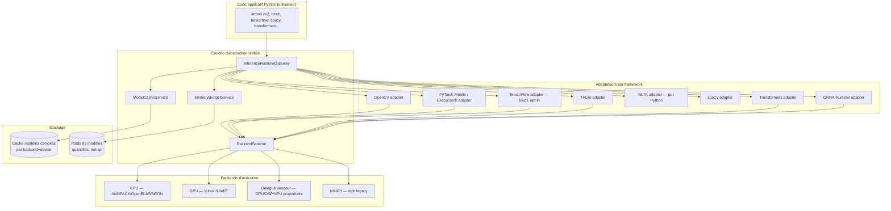
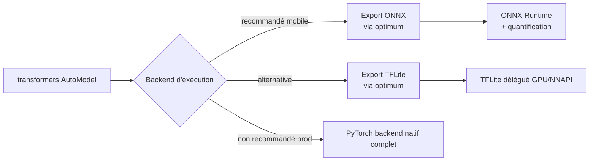
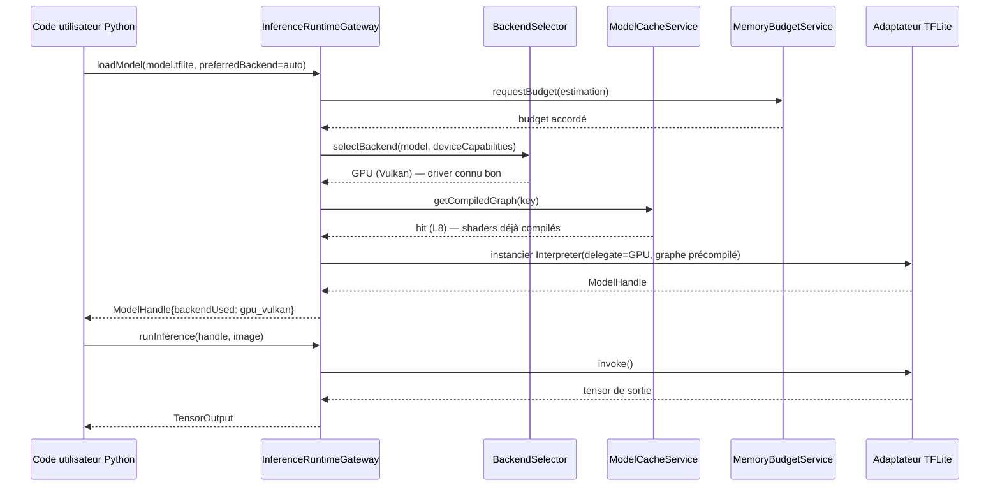
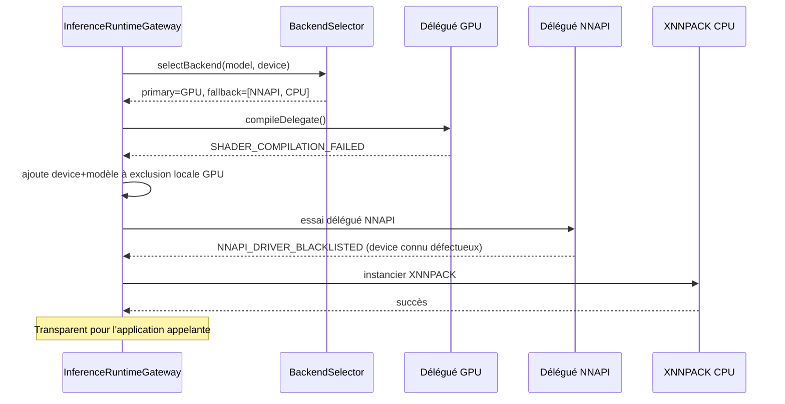
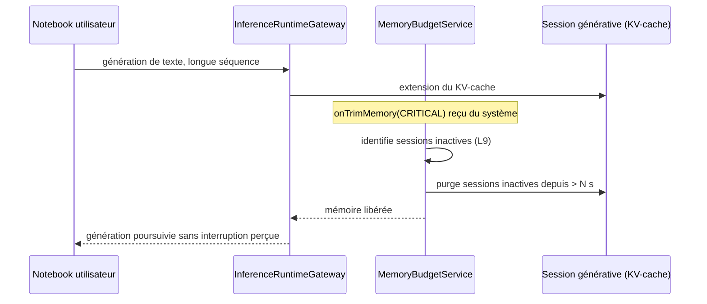

#### [REQ-FUNC-0489] PyStudio Mobile — Spécification du Runtime IA (« mlruntime »)

**Type de document :** Spécification technique — Intégration & optimisation des frameworks IA
**Auteur :** AI Runtime Architect
**Version :** 1.0
**Date :** 12 juillet 2026
**Portée :** Intégration et optimisation de OpenCV, PyTorch, TensorFlow, TensorFlow Lite, NLTK, spaCy, Transformers, ONNX Runtime — objectif performances maximales sur Android (CPU, GPU, NNAPI, Vulkan, cache, gestion mémoire)
**Dépend de :**
- `PyStudio_Mobile_Architecture_Specification.md` (§2 module `mlruntime` : TFLite/PyTorch Mobile/OpenCV, §7 isolation par process, §16 throttling thermique)
- `PyStudio_Mobile_Python_Runtime_Specification.md` (§11 chaîne de délégués GPU/NNAPI/XNNPACK, dépréciation NNAPI Android 15+, ADR-2 CPython 3.13/3.14)
- `PyStudio_Mobile_Android_Package_Builder_Specification.md` (compilation native `.so`, wheels `android_<api>_<abi>`)
- `PyStudio_Mobile_Package_Registry_Specification.md` (distribution des wheels volumineuses type PyTorch Mobile)

---

##### [REQ-FUNC-0490] Table des matières

0. Principes directeurs
1. Résumé exécutif
2. Architecture globale du runtime IA
3. Matrice frameworks × backends
4. OpenCV
5. PyTorch (Mobile / ExecuTorch)
6. TensorFlow
7. TensorFlow Lite
8. NLTK
9. spaCy
10. Transformers (Hugging Face)
11. ONNX Runtime
12. Backends d'exécution : CPU
13. Backends d'exécution : GPU (Vulkan/LiteRT)
14. NNAPI
15. Cache
16. Gestion mémoire
17. API interne (contrats)
18. Gestion des erreurs
19. Diagrammes de séquence
20. Risques & mitigations
21. Glossaire

---

##### [REQ-FUNC-0491] 0. Principes directeurs

| Principe | Description | Implication technique |
|---|---|---|
| **Un seul point d'entrée d'inférence** | L'application ne doit jamais choisir un backend au hasard par framework ; une couche d'abstraction commune décide | `InferenceRuntimeGateway` unique, quel que soit le framework appelant |
| **Dégradation gracieuse, jamais d'échec silencieux** | Si le meilleur backend n'est pas disponible, on redescend dans la chaîne de délégués sans que l'utilisateur ne le remarque autrement qu'en performance | Chaîne **GPU (Vulkan/LiteRT) → vendeur → NNAPI (legacy) → CPU (XNNPACK)** déjà actée côté runtime, appliquée uniformément à tous les frameworks compatibles |
| **Empreinte mémoire prévisible** | Un modèle IA ne doit jamais provoquer un OOM-kill de l'application hôte | Budget mémoire par session d'inférence, déchargement proactif, quantification par défaut |
| **Poids des frameworks lourds = coût explicite** | PyTorch/TensorFlow complets pèsent plusieurs centaines de Mo ; ils ne sont jamais embarqués par défaut | Installation à la demande via `py install` (registre), jamais dans l'APK de base |
| **Un seul format d'échange interne** | Éviter une prolifération de conversions ad hoc entre frameworks | ONNX comme format pivot pour l'interopérabilité entre PyTorch/TensorFlow et l'exécution optimisée (TFLite/ONNX Runtime) |
| **Priorité à la latence perçue, pas seulement au débit** | L'utilisateur interagit en temps réel (édition de code assistée par IA, vision par caméra) | Time-to-first-inference minimisé (cache de modèle compilé, warm-up asynchrone) |
| **Thermique avant tout** | Un device mobile ne peut pas soutenir une charge IA continue sans throttling | Réutilisation du throttling thermique déjà défini côté architecture (§16) et Package Builder (§16), appliqué à l'inférence continue |

---

##### [REQ-FUNC-0492] 1. Résumé exécutif

Le runtime IA de PyStudio Mobile unifie huit frameworks aux profils très différents — de la vision par ordinateur classique (**OpenCV**) au NLP symbolique (**NLTK**, **spaCy**) en passant par le deep learning complet (**PyTorch**, **TensorFlow**), l'inférence mobile optimisée (**TensorFlow Lite**, **ONNX Runtime**) et les grands modèles de langage (**Transformers**) — derrière une couche d'abstraction unique : l'**`InferenceRuntimeGateway`**. Cette couche décide, pour chaque appel d'inférence, du backend d'exécution optimal (CPU/XNNPACK, GPU via Vulkan/LiteRT, ou NNAPI en repli legacy) selon le modèle, l'appareil, la charge thermique et la disponibilité mémoire — sans que le code applicatif Python n'ait à connaître ces détails.

La stratégie retenue distingue clairement deux familles : les **frameworks d'entraînement/recherche complets** (PyTorch, TensorFlow), lourds et rarement nécessaires en production mobile, installés à la demande et utilisés principalement pour du fine-tuning léger ou de la conversion de modèles ; et les **runtimes d'inférence optimisés** (TensorFlow Lite, ONNX Runtime, PyTorch Mobile/ExecuTorch), légers, quantifiés, et seuls réellement exécutés en continu dans l'application. **ONNX** sert de format pivot pour convertir un modèle entraîné avec l'un des frameworks lourds vers une exécution optimisée, évitant une prolifération d'implémentations spécifiques par framework dans la couche de cache et de gestion mémoire.

---

##### [REQ-FUNC-0493] 2. Architecture globale du runtime IA



###### [REQ-FUNC-0494] 2.1 Positionnement vis-à-vis de l'architecture existante

Le module `mlruntime` (architecture §2) est étendu ici avec une couche d'orchestration explicite (`InferenceRuntimeGateway`) qui n'existait pas dans la spécification initiale — elle devient le point de passage unique pour tout appel d'inférence, quel que soit le framework Python utilisé côté utilisateur, garantissant une politique cohérente de sélection de backend, de cache et de mémoire à travers les huit frameworks.

---

##### [REQ-FUNC-0495] 3. Matrice frameworks × backends

| Framework | CPU | GPU (Vulkan/LiteRT) | NNAPI | Poids typique | Statut d'intégration |
|---|---|---|---|---|---|
| **OpenCV** | Natif (NEON optimisé) | Module `cv2.dnn` avec backend Vulkan si modèle DNN chargé | Non applicable directement (via conversion TFLite si besoin) | ~15-40 Mo (build modulaire) | Embarqué par défaut (vision de base) |
| **PyTorch (Mobile/ExecuTorch)** | Oui (XNNPACK backend) | Oui (Vulkan backend PyTorch Mobile) | Non (PyTorch ne s'appuie pas sur NNAPI nativement) | ~150-300 Mo (complet), ~20-50 Mo (ExecuTorch + runtime minimal) | Opt-in via `py install torch-mobile` |
| **TensorFlow (complet)** | Oui | Limité (pas optimisé mobile) | Non recommandé en direct | ~400-600 Mo | Opt-in, usage recherche/conversion uniquement, jamais en production embarquée |
| **TensorFlow Lite** | Oui (XNNPACK) | Oui (délégué GPU LiteRT) | Oui (délégué NNAPI, legacy) | ~5-15 Mo (runtime) | Embarqué par défaut — runtime d'inférence de référence |
| **NLTK** | CPU uniquement (pur Python/algorithmes classiques) | Non applicable | Non applicable | ~10-30 Mo (corpus sélectifs) | Opt-in via `py install`, léger |
| **spaCy** | CPU (Cython optimisé), GPU optionnel via Thinc/CuPy (non pertinent sur mobile) | Non pertinent sur mobile | Non applicable | ~15-50 Mo par modèle de langue | Opt-in via `py install`, modèles téléchargés séparément |
| **Transformers (Hugging Face)** | Oui, via backend PyTorch/TF ou conversion ONNX | Oui, via ONNX Runtime ou TFLite après conversion | Oui, via TFLite/NNAPI après conversion | Variable (Mo à Go selon modèle) | Opt-in, usage recommandé : modèles convertis en ONNX/TFLite quantifiés, jamais le framework complet en inférence continue |
| **ONNX Runtime** | Oui (optimisé, multi-thread) | Oui (délégué GPU/Vulkan via `ORT` execution providers) | Oui (NNAPI execution provider) | ~8-20 Mo (runtime) | Embarqué par défaut — runtime pivot pour modèles convertis |

---

##### [REQ-FUNC-0496] 4. OpenCV

###### [REQ-FUNC-0497] 4.1 Stratégie d'intégration

Build modulaire (pas le module complet `opencv-contrib`) : `core`, `imgproc`, `imgcodecs`, `videoio`, `dnn` uniquement, compilé via le **Package Builder** en `.so` par ABI (arm64-v8a prioritaire, cohérent avec la matrice ABI de sa spécification §11.1). Distribution comme wheel `opencv-android` sur le **Registry** (déjà utilisé comme exemple dans sa spécification §3.3/§4.1).

###### [REQ-FUNC-0498] 4.2 Optimisations

- Compilation avec **NEON** activé (ARM) et **IPP** désactivé (licence propriétaire non pertinente mobile) — flags injectés automatiquement par le wrapper de flags du Package Builder (§5.1 de sa spécification).
- Module `cv2.dnn` configuré pour utiliser le backend **Vulkan** quand un modèle de vision (détection d'objet, segmentation) est chargé, avec repli automatique CPU si l'appareil ne supporte pas Vulkan 1.1+.
- Traitement d'image en `UMat` (OpenCL/Vulkan-backed) plutôt que `Mat` pur CPU lorsque le pipeline GPU est actif, transparent pour le code utilisateur.

###### [REQ-FUNC-0499] 4.3 Interopérabilité

Conversion directe `numpy.ndarray ↔ cv2.Mat` sans copie mémoire (buffer partagé) — critique pour éviter une duplication mémoire lors du passage entre OpenCV et un modèle TFLite/ONNX Runtime consommant la même image.

---

##### [REQ-FUNC-0500] 5. PyTorch (Mobile / ExecuTorch)

###### [REQ-FUNC-0501] 5.1 Stratégie d'intégration

Le PyTorch **complet** (entraînement, autograd) n'est jamais exécuté en continu sur device : trop lourd (§3), pertinent seulement pour du fine-tuning ponctuel à faible échelle ou de l'expérimentation dans un notebook PyStudio. Pour l'inférence en production, PyStudio privilégie **ExecuTorch** (runtime d'inférence minimal de l'écosystème PyTorch, successeur de TorchScript Mobile), nettement plus léger.

###### [REQ-FUNC-0502] 5.2 Pipeline recommandé


###### [REQ-FUNC-0503] 5.3 Optimisations

- Quantification **post-training INT8** par défaut pour les modèles de vision, **FP16** pour les modèles sensibles à la précision (NLP), décision exposée comme paramètre explicite plutôt qu'implicite.
- Délégué **Vulkan** d'ExecuTorch activé si disponible, repli **XNNPACK** CPU sinon — cohérent avec la chaîne générale (§13).
- Le framework PyTorch complet, si installé pour du fine-tuning, s'exécute dans un **process isolé** dédié (cohérent architecture §7, `isolatedProcess`) pour éviter qu'un pic mémoire d'entraînement n'affecte le process principal de l'IDE.

---

##### [REQ-FUNC-0504] 6. TensorFlow

###### [REQ-FUNC-0505] 6.1 Positionnement

TensorFlow **complet** est traité comme un outil de **conversion et de prototypage**, jamais comme runtime d'inférence embarqué en continu — son poids (§3) et son absence d'optimisation mobile native en font un mauvais candidat pour l'exécution répétée sur device. Son rôle principal dans PyStudio Mobile : permettre à un notebook d'entraîner ou fine-tuner un petit modèle, puis de le convertir immédiatement en **TensorFlow Lite** (§7) pour l'exécution réelle.

###### [REQ-FUNC-0506] 6.2 Isolation

Comme PyTorch complet, exécuté en **process isolé** avec un budget mémoire strict (§16.3) ; l'`InferenceRuntimeGateway` refuse par défaut de router une inférence de production vers TensorFlow complet et suggère la conversion TFLite si un appel répété est détecté (heuristique : > N appels/minute sur le même modèle non converti).

---

##### [REQ-FUNC-0507] 7. TensorFlow Lite

###### [REQ-FUNC-0508] 7.1 Rôle central

TFLite est le **runtime d'inférence de référence** de PyStudio Mobile pour les modèles de vision et une partie du NLP — le plus mature sur Android, embarqué par défaut (contrairement aux frameworks complets).

###### [REQ-FUNC-0509] 7.2 Chaîne de délégués (héritée du runtime, §11)

```
GPU (Vulkan/LiteRT) → délégué vendeur (GPU/DSP/NPU propriétaire) → NNAPI (repli legacy) → XNNPACK (CPU)
```

Cette chaîne, déjà actée côté spécification runtime suite à la dépréciation de NNAPI sur Android 15+, est appliquée ici comme **la** politique de sélection par défaut de tout modèle TFLite chargé via `InferenceRuntimeGateway` (§13-14 détaillent chaque maillon).

###### [REQ-FUNC-0510] 7.3 Optimisations spécifiques

- **Modèles quantifiés INT8** privilégiés (taille divisée par ~4 vs FP32, latence CPU/GPU réduite), avec fallback FP16 si la précision INT8 dégrade trop les résultats (mesuré via un jeu de validation embarqué avec le modèle).
- **Compilation de délégué anticipée** (`InterpreterOptions` avec délégué pré-résolu) au premier chargement, résultat mis en cache (§15) pour éviter de recompiler le graphe GPU à chaque lancement d'app.
- **Threads CPU bornés** au nombre de cœurs "performance" (big.LITTLE aware) plutôt qu'à tous les cœurs disponibles, pour éviter de saturer les cœurs "efficiency" utilisés par l'UI.

---

##### [REQ-FUNC-0511] 8. NLTK

###### [REQ-FUNC-0512] 8.1 Stratégie d'intégration

NLTK est un ensemble d'algorithmes **CPU pur Python**, sans notion de backend GPU/NNAPI — son intégration porte principalement sur la gestion de ses **corpus et ressources téléchargeables** (WordNet, tokenizers, etc.), potentiellement volumineux.

###### [REQ-FUNC-0513] 8.2 Optimisations

- Téléchargement des corpus NLTK via le mécanisme de **cache L1 du Package Builder** (sources) plutôt qu'un téléchargement ad hoc à chaque premier usage (`nltk.download()` standard) — interception via un adaptateur qui redirige `nltk.data.path` vers le cache unifié PyStudio.
- Corpus volumineux (ex. WordNet complet) proposés en **téléchargement différé à la demande**, jamais préchargés, avec avertissement de taille avant téléchargement sur réseau mobile.
- Pas de parallélisation GPU pertinente ; l'optimisation porte sur la **latence d'import** (lazy loading des sous-modules NLTK, cohérent avec l'objectif de démarrage perçu instantané du runtime Python).

---

##### [REQ-FUNC-0514] 9. spaCy

###### [REQ-FUNC-0515] 9.1 Stratégie d'intégration

spaCy est **CPU-first** par conception (Cython optimisé) — son usage GPU via Thinc/CuPy n'est pas pertinent sur mobile (CuPy nécessite CUDA, absent d'Android). L'intégration porte sur la **gestion des modèles de langue** (`en_core_web_sm`, etc.), distribués comme wheels via le **Registry**, au même titre que tout autre package Python.

###### [REQ-FUNC-0516] 9.2 Optimisations

- Modèles **`_sm`** (small) recommandés par défaut sur mobile (quelques Mo) plutôt que `_lg`/`_trf` (transformer-based, bien plus lourds) ; l'IDE avertit si un modèle `_trf` est sélectionné, suggérant une conversion Transformers → ONNX Runtime (§10-11) pour de meilleures performances mobiles.
- Pipeline spaCy configuré pour désactiver les composants non utilisés (`nlp.select_pipes`) automatiquement selon les besoins déclarés par le code utilisateur (détection statique des appels `.ents`, `.pos_`, etc. dans le notebook/script, à la manière d'un tree-shaking).

---

##### [REQ-FUNC-0517] 10. Transformers (Hugging Face)

###### [REQ-FUNC-0518] 10.1 Stratégie d'intégration

La bibliothèque `transformers` elle-même (couche Python de haut niveau) reste utilisable pour le **chargement et la tokenisation**, mais l'**exécution du modèle** est systématiquement déléguée à un backend optimisé :



###### [REQ-FUNC-0519] 10.2 Optimisations

- Utilisation de la bibliothèque **`optimum`** (Hugging Face) pour l'export automatique vers **ONNX** avec quantification dynamique/statique INT8, plutôt que l'exécution du modèle PyTorch/TF complet en direct.
- **Cache des tokenizers** (vocabulaires, souvent plusieurs Mo) séparé du cache des poids de modèle — un tokenizer change rarement, un modèle peut être remplacé/mis à jour indépendamment.
- Pour les modèles de génération de texte (LLM légers embarqués), **KV-cache** géré explicitement par l'`InferenceRuntimeGateway` avec un budget mémoire dédié (§16.4), car sa croissance est proportionnelle à la longueur de séquence et peut dominer l'empreinte mémoire totale.

---

##### [REQ-FUNC-0520] 11. ONNX Runtime

###### [REQ-FUNC-0521] 11.1 Rôle de pivot

ONNX Runtime est le **runtime d'inférence pivot** de PyStudio Mobile : tout modèle issu de PyTorch, TensorFlow, ou Transformers, une fois converti au format ONNX, peut être exécuté via ce runtime unique, réduisant la surface de maintenance des adaptateurs de backend à un seul point pour ces trois écosystèmes.

###### [REQ-FUNC-0522] 11.2 Execution providers (chaîne de délégués)

| Priorité | Execution Provider | Condition |
|---|---|---|
| 1 | `NNAPIExecutionProvider` en mode délégué vendeur si disponible, sinon `VulkanExecutionProvider`/GPU custom | Selon disponibilité device (cf. §13-14) |
| 2 | `XNNPACKExecutionProvider` | CPU, repli universel |
| 3 | `CPUExecutionProvider` (référence) | Repli ultime si XNNPACK indisponible pour l'opérateur concerné |

Note : contrairement à TFLite où NNAPI est positionné comme repli legacy *avant* CPU pur, ONNX Runtime réévalue par graphe/opérateur quel provider est réellement le plus performant (certains opérateurs ne sont pas supportés par tous les providers) — la sélection est donc **par sous-graphe**, pas uniquement globale.

###### [REQ-FUNC-0523] 11.3 Optimisations

- **Graph optimization level = ALL** (fusion d'opérateurs, constant folding) appliquée à la compilation, résultat mis en cache (§15).
- **Quantification** via `onnxruntime.quantization` (dynamique pour NLP, statique avec jeu de calibration pour vision).
- **Session partagée** entre appels successifs du même modèle (pas de recréation de session ONNX Runtime par inférence), gérée par `ModelCacheService`.

---

##### [REQ-FUNC-0524] 12. Backends d'exécution : CPU

###### [REQ-FUNC-0525] 12.1 Bibliothèques d'accélération

| Bibliothèque | Frameworks l'utilisant | Optimisation clé |
|---|---|---|
| **XNNPACK** | TFLite, ONNX Runtime, PyTorch/ExecuTorch | Noyaux optimisés NEON/SIMD pour convolutions et opérations matricielles quantifiées |
| **NEON (ARM SIMD)** | OpenCV, tous les runtimes ci-dessus en interne | Vectorisation des opérations pixel/tenseur |
| **Ruy / gemmlowp** | TFLite (fallback interne si XNNPACK non applicable) | Multiplication matricielle quantifiée |

###### [REQ-FUNC-0526] 12.2 Gestion des threads

- Détection **big.LITTLE** via `sched_getaffinity`/lecture de la topologie CPU (`/sys/devices/system/cpu/cpu*/cpufreq/`), affinité des threads d'inférence fixée sur les cœurs "performance" en priorité.
- Nombre de threads d'inférence borné par défaut à `nombre_coeurs_performance - 1` (laisse un cœur libre pour l'UI/le thread principal), configurable par l'utilisateur avancé.
- **Priorité de thread abaissée** (`Process.THREAD_PRIORITY_BACKGROUND` ou équivalent) pour les inférences non interactives (traitement par lot) afin de ne jamais dégrader la fluidité de l'éditeur de code.

---

##### [REQ-FUNC-0527] 13. Backends d'exécution : GPU (Vulkan/LiteRT)

###### [REQ-FUNC-0528] 13.1 Stratégie

Vulkan est le backend GPU **cross-vendeur** privilégié (vs OpenGL ES compute, en déclin) pour tous les frameworks qui le supportent (TFLite via délégué LiteRT-Vulkan, ONNX Runtime, ExecuTorch), cohérent avec le choix déjà acté côté runtime.

###### [REQ-FUNC-0529] 13.2 Conditions d'éligibilité

| Condition | Vérification |
|---|---|
| Vulkan 1.1+ disponible | `vkEnumerateInstanceVersion` au démarrage du `BackendSelector`, résultat mis en cache par device |
| Mémoire GPU suffisante | Estimation heuristique basée sur la taille du modèle × facteur de marge (§16.2) |
| Modèle compatible délégué GPU | Certains opérateurs (contrôle de flux complexe, certains NLP) ne sont pas supportables par le délégué GPU — détection automatique avec repli partiel (certaines couches sur GPU, d'autres CPU) si le framework le permet (TFLite/ONNX Runtime le supportent nativement) |

###### [REQ-FUNC-0530] 13.3 Optimisations

- **Compilation de shader différée mais mise en cache** (§15) : la première inférence GPU d'un modèle donné sur un device donné est plus lente (compilation des shaders Vulkan), les suivantes réutilisent le cache.
- **Précision FP16 sur GPU** par défaut (la plupart des GPU mobiles sont nettement plus rapides en FP16 qu'en FP32), avec repli FP32 uniquement si la précision FP16 est explicitement insuffisante pour le cas d'usage.
- **Batching différé** : les inférences GPU ponctuelles (une image à la fois, typique d'une app interactive) ne bénéficient pas autant du batching que l'entraînement — le `BackendSelector` ne force pas de batching artificiel qui augmenterait la latence perçue.

---

##### [REQ-FUNC-0531] 14. NNAPI

###### [REQ-FUNC-0532] 14.1 Statut : repli legacy, pas backend privilégié

Conformément à la décision déjà actée côté runtime (dépréciation NNAPI Android 15+), NNAPI est positionné dans la chaîne de délégués comme **repli intermédiaire** — utilisé uniquement quand :
1. Aucun délégué GPU/vendeur n'est disponible ou compatible avec le modèle, **et**
2. L'appareil tourne sur une version d'Android où NNAPI reste fonctionnel et où un pilote NNAPI vendeur de qualité existe (souvent les appareils plus anciens où NNAPI a été davantage optimisé par le fabricant).

###### [REQ-FUNC-0533] 14.2 Détection de qualité de pilote

Certains pilotes NNAPI OEM sont connus pour être peu performants voire buggés sur certains opérateurs. `BackendSelector` maintient une **liste d'exclusion par modèle de device** (mise à jour via le Registry, similaire à un fichier de configuration distribué) pour éviter de router vers un pilote NNAPI défectueux connu — repli direct vers XNNPACK CPU dans ce cas plutôt qu'un délégué NNAPI qui produirait des résultats incorrects ou une latence anormale.

###### [REQ-FUNC-0534] 14.3 Dépréciation progressive

Sur Android 15+, où NNAPI est officiellement déprécié côté plateforme, la chaîne saute directement de GPU/vendeur à XNNPACK CPU (§7.2), sans tenter NNAPI — cohérent avec le choix runtime déjà documenté. Le module `mlruntime` conserve le code d'intégration NNAPI **uniquement pour la compatibilité descendante** (appareils Android < 15 encore en usage significatif).

---

##### [REQ-FUNC-0535] 15. Cache

###### [REQ-FUNC-0536] 15.1 Niveaux de cache spécifiques à l'inférence (complètent L1-L6 déjà définis)

| Niveau | Contenu | Clé de cache | Éviction |
|---|---|---|---|
| **L7 — Poids de modèle** | Fichiers de poids quantifiés (`.tflite`, `.onnx`, `.pte`) | `(nom_modèle, version, quantification)` | LRU, jamais évincé pendant une session active |
| **L8 — Graphe compilé/délégué** | Résultat de la compilation de délégué GPU (shaders Vulkan compilés) ou du plan d'exécution ONNX Runtime optimisé | `hash(modèle + backend + version_driver_GPU + device_model)` | Invalidé si mise à jour de driver GPU/OS détectée |
| **L9 — Sessions d'inférence actives** | Sessions/interpréteurs déjà instanciés (TFLite `Interpreter`, ONNX `InferenceSession`) | En mémoire uniquement, pas persisté disque | LRU par pression mémoire (§16) |

###### [REQ-FUNC-0537] 15.2 Bénéfice du cache L8

Le **time-to-first-inference** d'un modèle GPU peut être dominé par la compilation de shaders (parfois plusieurs centaines de ms) : un hit L8 réduit ce délai à un simple chargement de binaire compilé pré-existant, transparent pour l'utilisateur — particulièrement important pour l'objectif de latence perçue (§0).

###### [REQ-FUNC-0538] 15.3 Invalidation liée au driver

Une mise à jour du pilote GPU (OTA du fabricant) ou de la version d'Android invalide automatiquement L8 (clé incluant la version driver) — un shader compilé pour un ancien pilote n'est pas garanti compatible/optimal avec le nouveau.

###### [REQ-FUNC-0539] 15.4 Précharge et warm-up

`ModelCacheService` propose un **warm-up asynchrone** : au lancement d'un projet déclarant une dépendance à un modèle IA (détecté statiquement dans le code ou déclaré dans `pystudio.toml`), la compilation de délégué GPU peut être lancée en arrière-plan pendant que l'utilisateur navigue dans l'IDE, avant le premier appel d'inférence réel.

---

##### [REQ-FUNC-0540] 16. Gestion mémoire

###### [REQ-FUNC-0541] 16.1 Budget mémoire par session d'inférence

Chaque session d'inférence (`InferenceSession`, `Interpreter`) déclare un **budget mémoire estimé** avant instanciation (taille des poids + estimation des tenseurs intermédiaires + marge GPU si applicable). `MemoryBudgetService` refuse ou reporte l'instanciation si le budget cumulé de toutes les sessions actives dépasserait un seuil dérivé de `ActivityManager.getMemoryInfo()`.

###### [REQ-FUNC-0542] 16.2 mmap des poids de modèle

Les fichiers de poids (`.tflite`, `.onnx`, `.pte`) sont chargés via **`mmap()`** plutôt que lus intégralement en mémoire heap — cohérent avec le choix déjà acté côté runtime Python pour les `.pyc`/wheels (`ZIP_STORED`), appliqué ici aux poids de modèles : permet au système de paginer/décharger les poids sous pression mémoire sans que l'application ne gère elle-même un cache mémoire manuel.

###### [REQ-FUNC-0543] 16.3 Isolation mémoire des frameworks lourds

PyTorch complet et TensorFlow complet, quand installés (opt-in, §5-6), s'exécutent dans un **process isolé** avec une limite mémoire dédiée (`android:process` séparé, cohérent architecture §7 ADR-1) — un pic mémoire d'entraînement/fine-tuning ne peut jamais provoquer l'OOM-kill du process principal de l'IDE.

###### [REQ-FUNC-0544] 16.4 KV-cache (modèles génératifs / Transformers)

Le cache clé-valeur des modèles de génération de texte croît linéairement avec la longueur de séquence générée — `MemoryBudgetService` impose une **longueur de séquence maximale** par défaut (configurable) et purge proactivement le KV-cache des sessions inactives depuis plus de N secondes, plutôt que de le laisser croître sans borne.

###### [REQ-FUNC-0545] 16.5 Réaction à la pression mémoire système

Sur `onTrimMemory(TRIM_MEMORY_RUNNING_CRITICAL)` ou équivalent : `MemoryBudgetService` décharge en priorité (1) les sessions d'inférence inactives (L9), (2) le cache de graphe compilé non réutilisé récemment (L8, reconstructible), en préservant en dernier recours les poids de modèle actifs (L7, coûteux à recharger depuis le réseau si absent du stockage local).

###### [REQ-FUNC-0546] 16.6 Détection de fuite mémoire inter-appels

Un compteur de sessions non fermées explicitement (`Interpreter.close()` jamais appelé côté Python) déclenche un avertissement dans les logs de développement de l'IDE — pattern fréquent d'erreur utilisateur en notebook interactif où les cellules sont ré-exécutées sans nettoyage.

---

##### [REQ-FUNC-0547] 17. API interne (contrats)

###### [REQ-FUNC-0548] 17.1 Bridge TypeScript

```typescript
export interface PyStudioMLRuntimeBridge {
  loadModel(options: LoadModelOptions): Promise<ModelHandle>;
  runInference(handle: ModelHandle, input: TensorInput): Promise<TensorOutput>;
  releaseModel(handle: ModelHandle): Promise<void>;
  getBackendInfo(): Promise<BackendInfo>;
  onMemoryPressure(callback: (evt: MemoryPressureEvent) => void): () => void;
}

export interface LoadModelOptions {
  modelPath: string;
  framework: 'tflite' | 'onnxruntime' | 'executorch' | 'opencv_dnn';
  preferredBackend?: 'gpu' | 'nnapi' | 'cpu' | 'auto';   // 'auto' par défaut (chaîne de délégués)
  quantization?: 'int8' | 'fp16' | 'fp32';
  maxSequenceLength?: number;   // pertinent pour modèles génératifs (§16.4)
}

export interface ModelHandle {
  sessionId: string;
  framework: string;
  backendUsed: 'gpu_vulkan' | 'gpu_vendor' | 'nnapi' | 'cpu_xnnpack';
  estimatedMemoryBytes: number;
}

export interface BackendInfo {
  vulkanAvailable: boolean;
  vulkanVersion?: string;
  nnapiAvailable: boolean;
  nnapiDriverQuality: 'good' | 'known_issues' | 'unknown';
  performanceCoreCount: number;
}

export interface MemoryPressureEvent {
  level: 'moderate' | 'critical';
  sessionsEvicted: string[];
}
```

###### [REQ-FUNC-0549] 17.2 Interface Kotlin (services)

```kotlin
interface InferenceRuntimeGateway {
    suspend fun loadModel(options: LoadModelOptions): ModelHandle
    suspend fun runInference(handle: ModelHandle, input: TensorInput): TensorOutput
    suspend fun releaseModel(handle: ModelHandle)
}

interface BackendSelector {
    suspend fun selectBackend(model: ModelDescriptor, device: DeviceCapabilities): BackendChoice
}

data class BackendChoice(
    val primary: Backend,
    val fallbackChain: List<Backend>,
    val perSubgraphOverrides: Map<String, Backend> = emptyMap()  // ONNX Runtime, §11.2
)

interface ModelCacheService {
    suspend fun getCompiledGraph(key: CacheKey): CompiledGraph?
    suspend fun storeCompiledGraph(key: CacheKey, graph: CompiledGraph)
    suspend fun warmUp(model: ModelDescriptor)
}

interface MemoryBudgetService {
    suspend fun requestBudget(estimatedBytes: Long): BudgetDecision
    fun pressureEvents(): Flow<MemoryPressureEvent>
}
```

---

##### [REQ-FUNC-0550] 18. Gestion des erreurs

| Code | Cause typique | Recoverable |
|---|---|---|
| `MODEL_LOAD_FAILED` | Fichier de modèle corrompu/format invalide | Non — re-télécharger/reconstruire |
| `BACKEND_UNAVAILABLE` | Backend demandé explicitement (`preferredBackend`) non disponible sur le device | Oui — repli automatique vers la chaîne par défaut si `auto` n'était pas déjà utilisé |
| `NNAPI_DRIVER_BLACKLISTED` | Device figurant dans la liste d'exclusion NNAPI (§14.2) | Oui — repli CPU automatique, transparent |
| `MEMORY_BUDGET_EXCEEDED` | Chargement refusé car dépasserait le budget mémoire global | Oui — libérer des sessions inactives ou réduire la taille du modèle (quantification plus agressive) |
| `SHADER_COMPILATION_FAILED` | Échec de compilation du délégué GPU (driver bugué) | Oui — repli CPU automatique, entrée ajoutée à la liste d'exclusion locale |
| `SEQUENCE_LENGTH_EXCEEDED` | Génération dépassant la longueur max configurée (§16.4) | Oui — tronquer ou augmenter la limite explicitement |
| `UNSUPPORTED_OPERATOR` | Opérateur du graphe non supporté par le backend choisi | Oui (ONNX Runtime : repli par sous-graphe, §11.2) / Non (frameworks sans repli partiel) |

---

##### [REQ-FUNC-0551] 19. Diagrammes de séquence

###### [REQ-FUNC-0552] 19.1 Chargement et inférence — cas nominal avec cache de graphe



###### [REQ-FUNC-0553] 19.2 Repli en cascade sur échec GPU



###### [REQ-FUNC-0554] 19.3 Pression mémoire pendant une session générative (Transformers)



---

##### [REQ-FUNC-0555] 20. Risques & mitigations

| Risque | Impact | Mitigation |
|---|---|---|
| Fragmentation des pilotes GPU/NNAPI selon les OEM | Élevé | Liste d'exclusion mise à jour à distance (§14.2), tests sur matrice représentative (cohérent Package Builder §17) |
| Poids embarqué excessif si plusieurs frameworks lourds installés simultanément | Moyen | Installation strictement opt-in par `py install` (jamais dans l'APK de base), avertissement de taille avant installation |
| Latence de première inférence (compilation shader/graphe) perçue comme un bug de lenteur | Moyen | Cache L8 + warm-up proactif (§15.4) |
| OOM sur modèles génératifs à contexte long | Élevé | Budget mémoire strict + purge KV-cache proactive (§16.4) |
| Divergence de précision entre modèle original et version quantifiée (INT8) | Moyen | Validation automatique contre un jeu de test embarqué avec le modèle avant activation par défaut de la quantification agressive |
| Incohérence de résultats entre backends (GPU vs CPU) sur certains opérateurs custom | Faible-moyen | Détection d'opérateur non supporté (`UNSUPPORTED_OPERATOR`) avant tentative d'exécution silencieuse incorrecte |

---

##### [REQ-FUNC-0556] 21. Glossaire

| Terme | Définition |
|---|---|
| **XNNPACK** | Bibliothèque de noyaux optimisés CPU pour l'inférence de réseaux de neurones quantifiés/flottants |
| **Délégué (delegate)** | Mécanisme TFLite/ExecuTorch permettant de déporter tout ou partie de l'exécution d'un graphe vers un backend matériel spécifique |
| **Execution Provider** | Équivalent ONNX Runtime du concept de délégué |
| **ExecuTorch** | Runtime d'inférence léger de l'écosystème PyTorch, successeur de TorchScript Mobile pour le déploiement edge |
| **KV-cache** | Cache des clés/valeurs d'attention réutilisé à chaque étape de génération d'un modèle de langage, croissant avec la longueur de séquence |
| **Quantification** | Réduction de la précision numérique des poids/activations (ex. FP32 → INT8) pour réduire taille et latence, au prix d'une perte de précision |
| **mmap** | Projection d'un fichier en mémoire virtuelle, permettant un accès paginé sans chargement complet en heap |
| **Liste d'exclusion (denylist) driver** | Registre des combinaisons device/driver connues pour produire des résultats incorrects ou des performances anormales sur un backend donné |

---

*Fin de la spécification.*

