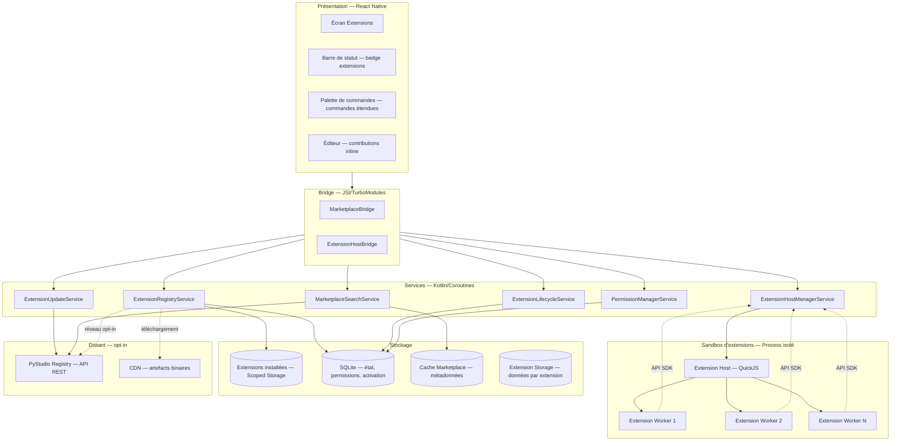
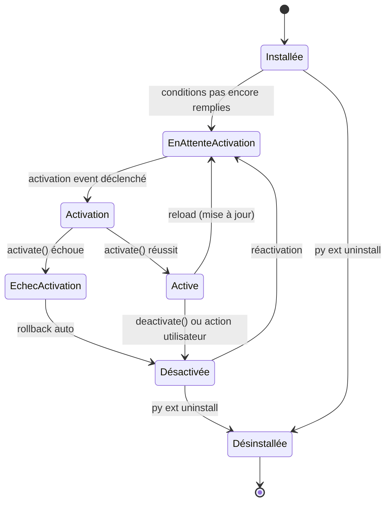
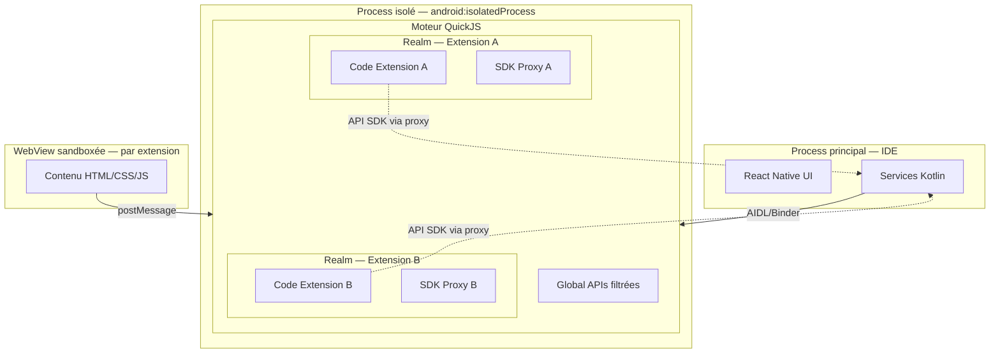
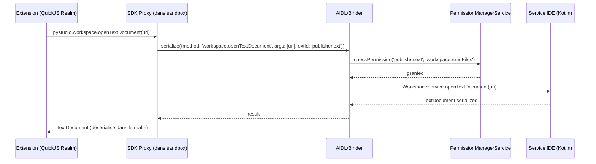
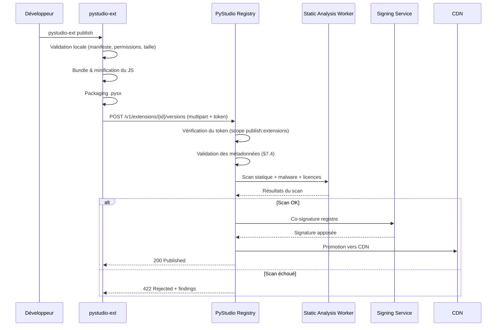
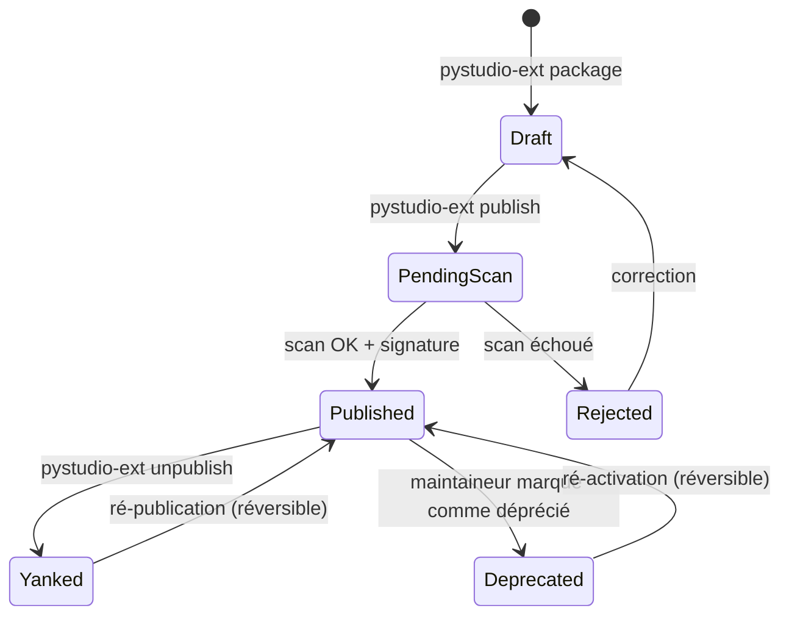
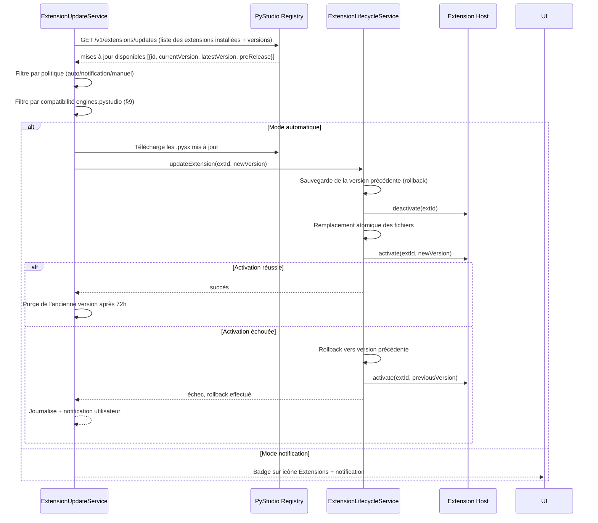
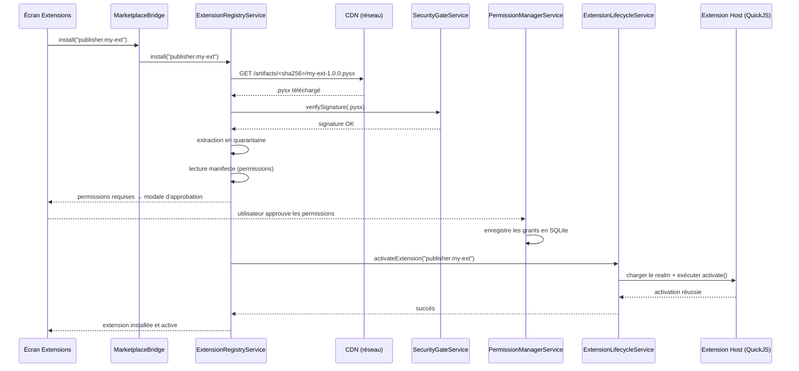
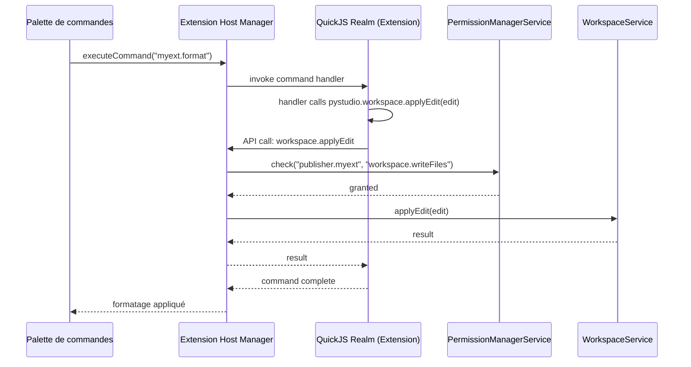
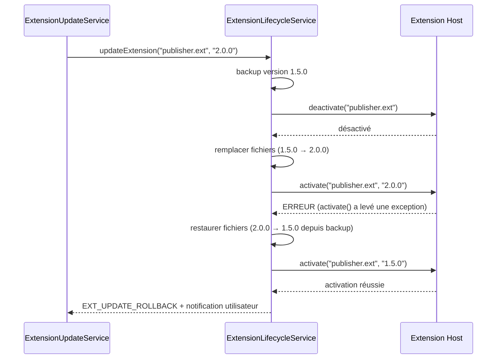

#### [REQ-FUNC-0564] PyStudio Mobile — Spécification du Marketplace & Système d'Extensions

**Type de document :** Spécification technique — Marketplace, SDK d'extensions, sandbox, publication & mises à jour
**Auteur :** Platform Architect
**Version :** 1.0
**Date :** 12 juillet 2026
**Portée :** SDK d'extensions, types d'extensions, modèle de permissions, sandbox d'exécution, pipeline de publication, mises à jour automatiques, compatibilité multi-version
**Dépend de :**
- `PyStudio_Mobile_Architecture_Specification.md` (§0 Extensibilité, §10 Sécurité, §12 Scalabilité & Marketplace, §13 APIs internes)
- `PyStudio_Mobile_UI_UX_Specification.md` (§4.7 Écran Extensions, design system, adaptation tactile/clavier)
- `PyStudio_Mobile_Package_Registry_Specification.md` (§4-6 Publication & signature, §7 Recherche, §8 CDN, §11 API REST)
- `PyStudio_Mobile_Android_Package_Builder_Specification.md` (§7-8 Construction wheels & signature)
- `PyStudio_Mobile_Python_Runtime_Specification.md` (§6-7 Packages & Wheels, ADR-2 CPython 3.13/3.14)
- `PyStudio_Mobile_AI_Assistant_System_Specification.md` (§ points d'intégration IA extensibles)

---

##### [REQ-FUNC-0565] Table des matières

0. Principes directeurs
1. Résumé exécutif
2. Architecture globale du Marketplace
3. SDK d'extensions (Extension SDK)
4. Types d'extensions
5. Modèle de permissions
6. Sandbox & isolation
7. Pipeline de publication
8. Mises à jour
9. Compatibilité
10. Format du manifeste (`extension.json`)
11. API interne (contrats)
12. Gestion des erreurs
13. Diagrammes de séquence
14. Performances
15. Sécurité transverse
16. UI — écran Extensions
17. Risques techniques & mitigations
18. Glossaire

---

##### [REQ-FUNC-0566] 0. Principes directeurs

| Principe | Description | Implication technique |
|---|---|---|
| **Moindre privilège par défaut** | Une extension n'a accès à rien qu'elle n'ait explicitement déclaré et que l'utilisateur n'ait approuvé | Manifeste de permissions granulaire, refus par défaut de tout accès non déclaré |
| **Sandbox non contournable** | Aucune extension tierce ne peut contourner l'isolation, quelle que soit sa complexité | Exécution dans un moteur JS isolé (QuickJS), pas d'accès JNI/NDK direct, communication uniquement via l'API du SDK |
| **Parité avec VS Code en esprit, pas en surface** | L'expérience développeur (contribution points, activation events, API riche) doit être familière pour un développeur VS Code, sans copier les limitations d'une architecture desktop | Modèle d'extension JS inspiré de `vscode.*`, mais adapté aux contraintes Android (mémoire, batterie, offline) |
| **Confiance vérifiable, jamais supposée** | L'utilisateur doit pouvoir évaluer la confiance d'une extension avant installation (badges, permissions, signature, audit) | Double signature (développeur + registre), scan statique automatisé, affichage explicite des permissions demandées |
| **Offline-first** | Les extensions installées fonctionnent sans réseau ; le Marketplace reste consultable hors-ligne pour les métadonnées déjà en cache | Cache local des métadonnées, activation sans appel réseau, pas de licence en ligne obligatoire |
| **Performance perçue « zéro coût »** | L'installation d'extensions ne doit pas dégrader perceptiblement le démarrage ni la réactivité de l'IDE | Activation paresseuse (lazy), chargement conditionnel, budget mémoire par extension |
| **Réversibilité totale** | Toute extension peut être désactivée, désinstallée ou restaurée sans laisser de résidu ni corrompre l'état de l'IDE | Isolation des données par extension, rollback automatique en cas d'échec d'activation |
| **Transparence des actions** | Toute modification de l'état de l'IDE par une extension est visible et explicable à l'utilisateur | Journal d'activité par extension, indicateur d'état dans la barre de statut |

---

##### [REQ-FUNC-0567] 1. Résumé exécutif

Le **Marketplace PyStudio Mobile** est un écosystème d'extensions comparable à celui de VS Code, adapté au contexte mobile Android. Il permet aux développeurs tiers (et à l'équipe PyStudio) de publier des **extensions** qui enrichissent l'IDE — support de langages, thèmes, snippets, outils de débogage, intégrations IA, templates de projet — sans nécessiter de modification du cœur de l'application.

Le système repose sur cinq piliers :

1. **Un SDK d'extensions** (`@pystudio/extension-api`) exposant un ensemble d'APIs TypeScript fortement typées, organisées autour de **contribution points** (commandes, menus, vues, langages, thèmes, snippets, debuggers, task providers, settings) et d'**activation events** (déclencheurs paresseux pour ne charger une extension qu'au moment où elle est réellement utile).

2. **Une sandbox non contournable** basée sur un moteur JavaScript isolé (QuickJS, exécuté dans un process Android dédié), où chaque extension s'exécute dans un contexte sans accès au système de fichiers host, au réseau ou aux APIs natives — sauf via les APIs du SDK explicitement autorisées par les permissions déclarées.

3. **Un modèle de permissions granulaire** inspiré d'Android/Chrome OS, où chaque capacité (accès aux fichiers du workspace, réseau, terminal, IA, stockage persistant) est déclarée dans le manifeste et présentée à l'utilisateur pour approbation lors de l'installation.

4. **Un pipeline de publication** intégré au PyStudio Registry existant, avec signature obligatoire, scan statique automatisé (détection de code malveillant, vérification de licence), et cycle de vie complet (`draft → review → published → yanked`).

5. **Un système de mises à jour automatiques** avec politique de compatibilité sémantique, support de canaux (stable/preview), et rollback automatique en cas de régression détectée.

---

##### [REQ-FUNC-0568] 2. Architecture globale du Marketplace



###### [REQ-FUNC-0569] 2.1 Positionnement vis-à-vis de l'architecture existante

L'architecture (§12) positionne déjà le `MarketplaceService` comme service Kotlin avec `MarketplaceBridge` côté JS. Cette spécification **détaille et étend** cette position avec : un `ExtensionHostManagerService` (gestion du process sandbox), un `PermissionManagerService` (décision d'autorisation), et un `ExtensionLifecycleService` (activation/désactivation/mise à jour). Le `MarketplaceSearchService` réutilise l'API de recherche du Registry (§7 de sa spécification) sans duplication.

###### [REQ-FUNC-0570] 2.2 Extension Host — le cœur de la sandbox

L'**Extension Host** est un process Android dédié (`android:isolatedProcess="true"`) qui héberge un moteur **QuickJS** — un interpréteur JavaScript léger et entièrement sandboxé, sans accès à `eval()` dynamique non contrôlé ni à des APIs système. Chaque extension s'exécute dans un **realm** QuickJS distinct, avec son propre namespace global, garantissant l'isolation inter-extensions.

Ce choix (vs V8/Hermes) est motivé par :
- **Empreinte mémoire** : ~2 Mo par realm vs ~20+ Mo pour un isolate V8
- **Sécurité** : pas de JIT (compilation machine), éliminant une classe entière de vulnérabilités
- **Déterminisme** : pas de garbage collector concurrent, comportement prévisible sur device mobile

L'Extension Host communique avec le process principal (IDE) via **AIDL/Binder** (canal IPC Android sécurisé, cf. architecture §9.1), et non via des sockets ou mémoire partagée directe — garantissant l'isolation au niveau OS.

---

##### [REQ-FUNC-0571] 3. SDK d'extensions (Extension SDK)

###### [REQ-FUNC-0572] 3.1 Vue d'ensemble

Le SDK d'extensions (`@pystudio/extension-api`) est la surface d'API que toute extension peut invoquer. Il est inspiré de l'API `vscode.*` de VS Code mais adapté au contexte mobile Android. Le SDK est **fortement typé** (TypeScript) et versionné selon le versioning sémantique.

```typescript
// Exemple minimal d'extension
import * as pystudio from '@pystudio/extension-api';

export function activate(context: pystudio.ExtensionContext): void {
  const disposable = pystudio.commands.registerCommand(
    'myext.helloWorld',
    () => pystudio.window.showInformationMessage('Hello from PyStudio!')
  );
  context.subscriptions.push(disposable);
}

export function deactivate(): void {
  // Cleanup
}
```

###### [REQ-FUNC-0573] 3.2 Namespaces du SDK

| Namespace | Description | Equivalent VS Code |
|---|---|---|
| `pystudio.commands` | Enregistrement et exécution de commandes | `vscode.commands` |
| `pystudio.window` | Fenêtres, notifications, barre de statut, quick picks, panneaux de sortie | `vscode.window` |
| `pystudio.workspace` | Fichiers du workspace, configuration, événements FS, tâches (tasks) | `vscode.workspace` |
| `pystudio.languages` | Langages, diagnostics, complétion, hover, définitions, formatage | `vscode.languages` |
| `pystudio.debug` | Sessions de débogage, breakpoints, adaptateurs | `vscode.debug` |
| `pystudio.scm` | Source Control Management (Git intégration) | `vscode.scm` |
| `pystudio.notebooks` | API notebooks (cellules, kernels, sorties) | `vscode.notebooks` |
| `pystudio.ai` | Intégration IA (participants au chat, actions inline, complétion) | `vscode.chat` / `vscode.lm` |
| `pystudio.tests` | Framework de test (découverte, exécution, résultats) | `vscode.tests` |
| `pystudio.env` | Informations sur l'environnement (device, ABI, version IDE, langue) | `vscode.env` |
| `pystudio.extensions` | Accès aux autres extensions (inter-extension API) | `vscode.extensions` |
| `pystudio.authentication` | Fournisseurs d'authentification (OAuth, tokens) | `vscode.authentication` |
| `pystudio.tasks` | Définition et exécution de tâches (build, lint, etc.) | `vscode.tasks` |
| `pystudio.terminal` | Création et interaction avec des terminaux (permission requise) | `vscode.terminal` |

###### [REQ-FUNC-0574] 3.3 Contribution Points

Les **contribution points** sont des déclarations statiques dans le manifeste (`extension.json`) qui permettent à une extension de contribuer du contenu à l'IDE sans exécuter de code. Ils sont lus au démarrage et intégrés à l'UI de façon paresseuse.

| Contribution Point | Description | Exemple |
|---|---|---|
| `contributes.commands` | Commandes accessibles depuis la palette | `{ "command": "myext.format", "title": "Format with MyTool" }` |
| `contributes.menus` | Éléments de menus contextuels | Ajout d'une action au clic droit dans l'explorateur |
| `contributes.keybindings` | Raccourcis clavier | `{ "command": "myext.format", "key": "ctrl+alt+f" }` |
| `contributes.languages` | Déclaration d'un langage (id, extensions, configuration) | Support `.toml`, `.yaml`, etc. |
| `contributes.grammars` | Grammaires TextMate pour la coloration syntaxique | Fichier `.tmLanguage.json` |
| `contributes.themes` | Thèmes de couleurs (éditeur + UI) | Fichier `.json` de thème |
| `contributes.iconThemes` | Thèmes d'icônes de fichiers | Association type de fichier → icône |
| `contributes.snippets` | Fragments de code réutilisables par langage | Snippets `.json` par langage |
| `contributes.configuration` | Settings contribués par l'extension | Ajout de préférences dans Paramètres |
| `contributes.viewsContainers` | Conteneurs de vues dans l'Activity Bar | Ajout d'un nouvel onglet dans la barre latérale |
| `contributes.views` | Vues arborescentes ou listes dans les conteneurs | Arbre de dépendances, liste de tâches |
| `contributes.debuggers` | Adaptateurs de débogage (DAP) | Support de débogage pour un nouveau langage |
| `contributes.taskDefinitions` | Types de tâches personnalisées | `{ "type": "myTool", "properties": {...} }` |
| `contributes.problemMatchers` | Patterns de parsing de sortie (erreurs/avertissements) | Regex pour parser les erreurs d'un linter |
| `contributes.walkthroughs` | Tutoriels interactifs pas-à-pas | Onboarding d'une extension complexe |
| `contributes.chatParticipants` | Participants au chat IA | Un agent IA spécialisé (ex. « @database ») |
| `contributes.notebookRenderers` | Rendus personnalisés de sorties notebook | Renderer pour un type MIME spécifique |

###### [REQ-FUNC-0575] 3.4 Activation Events

Les **activation events** définissent quand une extension est chargée en mémoire. Avant son activation, une extension consomme **zéro ressource** (ses contributions statiques sont injectées depuis le manifeste sans exécution de code).

| Activation Event | Déclencheur |
|---|---|
| `onLanguage:<languageId>` | Un fichier du langage spécifié est ouvert |
| `onCommand:<commandId>` | La commande spécifiée est exécutée par l'utilisateur |
| `workspaceContains:<glob>` | Le workspace contient un fichier correspondant au glob |
| `onView:<viewId>` | La vue contribuée spécifiée est rendue visible |
| `onDebug` | Une session de débogage est lancée |
| `onDebugResolve:<type>` | Un type de débogage spécifique est résolu |
| `onFileSystem:<scheme>` | Un fichier avec le scheme spécifié est accédé |
| `onStartupFinished` | L'IDE a terminé son démarrage (activation différée, dernier) |
| `onNotebook:<notebookType>` | Un notebook du type spécifié est ouvert |
| `onAuthenticationRequest:<providerId>` | Une demande d'authentification est faite |
| `onChatParticipant:<participantId>` | Le participant au chat IA est invoqué (ex. `@database`) |
| `*` | Activation immédiate — **fortement déconseillé**, réduit le score de qualité de l'extension au Marketplace |

###### [REQ-FUNC-0576] 3.5 Cycle de vie d'une extension



###### [REQ-FUNC-0577] 3.6 API détaillée — principaux modules

####### [REQ-FUNC-0578] 3.6.1 `pystudio.commands`

```typescript
export namespace commands {
  /** Enregistre une commande invocable depuis la palette ou les menus */
  function registerCommand(command: string, callback: (...args: any[]) => any): Disposable;
  
  /** Enregistre une commande éditeur (reçoit le TextEditor actif) */
  function registerTextEditorCommand(
    command: string,
    callback: (editor: TextEditor, edit: TextEditorEdit, ...args: any[]) => void
  ): Disposable;
  
  /** Exécute une commande (y compris celles d'autres extensions) */
  function executeCommand<T>(command: string, ...args: any[]): Thenable<T>;
  
  /** Retourne la liste de toutes les commandes enregistrées */
  function getCommands(filterInternal?: boolean): Thenable<string[]>;
}
```

####### [REQ-FUNC-0579] 3.6.2 `pystudio.window`

```typescript
export namespace window {
  /** L'éditeur de texte actif (undefined si aucun n'est ouvert) */
  const activeTextEditor: TextEditor | undefined;
  
  /** Affiche une notification d'information */
  function showInformationMessage(message: string, ...items: string[]): Thenable<string | undefined>;
  
  /** Affiche une notification d'avertissement */
  function showWarningMessage(message: string, ...items: string[]): Thenable<string | undefined>;
  
  /** Affiche une notification d'erreur */
  function showErrorMessage(message: string, ...items: string[]): Thenable<string | undefined>;
  
  /** Affiche une sélection rapide (quick pick) */
  function showQuickPick(items: QuickPickItem[], options?: QuickPickOptions): Thenable<QuickPickItem | undefined>;
  
  /** Affiche un champ de saisie */
  function showInputBox(options?: InputBoxOptions): Thenable<string | undefined>;
  
  /** Crée un élément dans la barre de statut */
  function createStatusBarItem(alignment?: StatusBarAlignment, priority?: number): StatusBarItem;
  
  /** Crée un panneau de sortie */
  function createOutputChannel(name: string): OutputChannel;
  
  /** Crée une vue arborescente */
  function createTreeView<T>(viewId: string, options: TreeViewOptions<T>): TreeView<T>;
  
  /** Crée un panneau Webview (HTML sandboxé) */
  function createWebviewPanel(
    viewType: string, title: string,
    showOptions: ViewColumn,
    options?: WebviewPanelOptions & WebviewOptions
  ): WebviewPanel;
  
  /** Affiche une barre de progression */
  function withProgress<T>(
    options: ProgressOptions,
    task: (progress: Progress<{message?: string; increment?: number}>, token: CancellationToken) => Thenable<T>
  ): Thenable<T>;
  
  /** Événement de changement de l'éditeur actif */
  const onDidChangeActiveTextEditor: Event<TextEditor | undefined>;
}
```

####### [REQ-FUNC-0580] 3.6.3 `pystudio.workspace`

```typescript
export namespace workspace {
  /** Dossiers du workspace ouvert */
  const workspaceFolders: readonly WorkspaceFolder[] | undefined;
  
  /** Lit un fichier (nécessite permission `workspace.readFiles`) */
  function openTextDocument(uri: Uri): Thenable<TextDocument>;
  
  /** Applique un WorkspaceEdit (modifications multi-fichiers, atomique) */
  function applyEdit(edit: WorkspaceEdit): Thenable<boolean>;
  
  /** Accède à la configuration (globale ou par scope) */
  function getConfiguration(section?: string, scope?: ConfigurationScope): WorkspaceConfiguration;
  
  /** Événement de sauvegarde de fichier */
  const onDidSaveTextDocument: Event<TextDocument>;
  
  /** Événement de changement de fichier dans le workspace */
  const onDidChangeTextDocument: Event<TextDocumentChangeEvent>;
  
  /** Crée un FileSystemWatcher */
  function createFileSystemWatcher(
    globPattern: GlobPattern, ignoreCreate?: boolean, ignoreChange?: boolean, ignoreDelete?: boolean
  ): FileSystemWatcher;
  
  /** Enregistre un TaskProvider */
  function registerTaskProvider(type: string, provider: TaskProvider): Disposable;
}
```

####### [REQ-FUNC-0581] 3.6.4 `pystudio.languages`

```typescript
export namespace languages {
  /** Enregistre un fournisseur de complétion */
  function registerCompletionItemProvider(
    selector: DocumentSelector, provider: CompletionItemProvider, ...triggerCharacters: string[]
  ): Disposable;
  
  /** Enregistre un fournisseur de hover */
  function registerHoverProvider(selector: DocumentSelector, provider: HoverProvider): Disposable;
  
  /** Enregistre un fournisseur de définitions (Go to Definition) */
  function registerDefinitionProvider(selector: DocumentSelector, provider: DefinitionProvider): Disposable;
  
  /** Enregistre un fournisseur de formatage */
  function registerDocumentFormattingEditProvider(
    selector: DocumentSelector, provider: DocumentFormattingEditProvider
  ): Disposable;
  
  /** Enregistre un fournisseur de diagnostics */
  function createDiagnosticCollection(name: string): DiagnosticCollection;
  
  /** Enregistre un fournisseur de symboles */
  function registerDocumentSymbolProvider(selector: DocumentSelector, provider: DocumentSymbolProvider): Disposable;
  
  /** Enregistre un Code Action provider (quick fixes, refactoring) */
  function registerCodeActionsProvider(
    selector: DocumentSelector, provider: CodeActionProvider, metadata?: CodeActionProviderMetadata
  ): Disposable;
  
  /** Enregistre un Code Lens provider */
  function registerCodeLensProvider(selector: DocumentSelector, provider: CodeLensProvider): Disposable;
  
  /** Enregistre un Inlay Hints provider */
  function registerInlayHintsProvider(selector: DocumentSelector, provider: InlayHintsProvider): Disposable;
}
```

####### [REQ-FUNC-0582] 3.6.5 `pystudio.ai`

```typescript
export namespace ai {
  /** Enregistre un participant au chat IA */
  function registerChatParticipant(
    id: string, handler: ChatRequestHandler
  ): ChatParticipant;
  
  /** Enregistre un fournisseur d'actions IA inline (ex. « Explain this code ») */
  function registerInlineActionProvider(
    selector: DocumentSelector, provider: InlineActionProvider
  ): Disposable;
  
  /** Accède au modèle de langage local (nécessite permission `ai.localModel`) */
  function selectLanguageModel(selector: LanguageModelSelector): Thenable<LanguageModelChat[]>;
  
  /** Envoie une requête au modèle (streaming) */
  interface LanguageModelChat {
    sendRequest(messages: LanguageModelChatMessage[], options?: LanguageModelChatRequestOptions): Thenable<LanguageModelChatResponse>;
    readonly maxInputTokens: number;
    readonly name: string;
    readonly vendor: string;
  }
}
```

###### [REQ-FUNC-0583] 3.7 Extension Context & Storage

```typescript
export interface ExtensionContext {
  /** URI du répertoire d'installation de l'extension (lecture seule) */
  readonly extensionUri: Uri;
  
  /** URI du répertoire de données persistantes de l'extension (lecture/écriture) */
  readonly storageUri: Uri;
  
  /** URI du répertoire de données globales (partagé entre workspaces) */
  readonly globalStorageUri: Uri;
  
  /** Clé-valeur persistant par workspace */
  readonly workspaceState: Memento;
  
  /** Clé-valeur persistant globalement */
  readonly globalState: Memento;
  
  /** Gestionnaire de secrets sécurisé (Android Keystore) */
  readonly secrets: SecretStorage;
  
  /** Tableau de disposables nettoyés à la désactivation */
  subscriptions: Disposable[];
  
  /** Mode d'extension (normal, restricted, testing) */
  readonly extensionMode: ExtensionMode;
  
  /** Version de l'extension en cours d'exécution */
  readonly extension: Extension<any>;
}
```

###### [REQ-FUNC-0584] 3.8 Inter-Extension API

Les extensions peuvent exposer une API publique consommable par d'autres extensions :

```typescript
// Extension A expose une API
export function activate(context: pystudio.ExtensionContext) {
  return {
    getFormatter: (language: string) => { /* ... */ },
    version: '2.0.0'
  };
}

// Extension B consomme l'API de A
const extA = pystudio.extensions.getExtension('publisher.extensionA');
if (extA) {
  const api = await extA.activate();
  const formatter = api.getFormatter('python');
}
```

L'accès inter-extension nécessite la déclaration `extensionDependencies` dans le manifeste (§10) de l'extension consommatrice.

---

##### [REQ-FUNC-0585] 4. Types d'extensions

###### [REQ-FUNC-0586] 4.1 Classification

| Type | Contenu | Activation | Sandbox |
|---|---|---|---|
| **Language Support** | Grammaires, snippets, complétion, diagnostics, formatage | `onLanguage:<id>` | Extension Host (QuickJS) |
| **Thème** | Couleurs éditeur + UI, icônes de fichiers | Contribution statique uniquement (pas de code exécuté) | Aucun (données passives) |
| **Snippets Pack** | Collections de fragments de code | Contribution statique uniquement | Aucun (données passives) |
| **Debugger Adapter** | Protocole DAP pour un langage/runtime spécifique | `onDebug`, `onDebugResolve:<type>` | Extension Host + process DAP isolé |
| **Linter / Formatter** | Analyse statique ou reformatage de code | `onLanguage:<id>` | Extension Host |
| **Tool Integration** | Intégration d'outils externes (linters, task runners) | `onCommand:*`, `workspaceContains:*` | Extension Host |
| **AI Participant** | Agent IA spécialisé dans le chat | `onChatParticipant:<id>` | Extension Host |
| **Notebook Renderer** | Rendu personnalisé de sorties notebook | `onNotebook:<type>` | WebView sandboxée |
| **UI Extension** | Vues arborescentes, panneaux Webview, status bar | `onView:<id>`, `onCommand:*` | Extension Host + WebView sandboxée |
| **Template Pack** | Templates de projet (structure + fichiers) | `onCommand:*` (ex. « New Project from Template ») | Extension Host |
| **Python Package** | Wheel Python précompilée (lib scientifique, ML, etc.) | Installation directe dans l'environnement Python | Sandbox Python (`isolatedProcess`) |
| **Native Library** | `.so` / `.a` C/C++ précompilée multi-ABI | Installation dans le sysroot utilisateur | Sandbox native |
| **AI Model** | Modèle GGUF/ONNX/TFLite pour l'assistant IA (cf. AI Assistant §18.2) | Téléchargement à la demande depuis le Registry | Isolation via le runtime ML dédié |

###### [REQ-FUNC-0587] 4.2 Extensions purement déclaratives vs programmatiques

| Catégorie | Code exécuté | Exemples |
|---|---|---|
| **Déclarative** | Non — le manifeste suffit | Thèmes, snippets, grammaires TextMate, keybindings |
| **Programmatique** | Oui — `activate()` / `deactivate()` | Language servers, debuggers, outils, intégrations IA |
| **Hybride** | Code + contributions déclaratives | Support de langage complet (grammaire + complétion dynamique) |

Les extensions purement déclaratives sont **plus rapides à charger** (aucune exécution de code), **plus sûres** (aucune surface d'attaque programmatique), et reçoivent un **score de confiance plus élevé** dans le Marketplace.

###### [REQ-FUNC-0588] 4.3 Extension Packs

Un **extension pack** est une méta-extension qui déclare une liste d'extensions comme dépendances, installées ensemble. Il ne contient pas de code propre mais une liste `extensionPack` dans son manifeste :

```json
{
  "extensionPack": [
    "pystudio.python-language-support",
    "pystudio.python-debugger",
    "pystudio.python-test-adapter",
    "pystudio.jupyter-renderer"
  ]
}
```

###### [REQ-FUNC-0589] 4.4 Chargement des extensions natives (Python packages & native libraries)

Les extensions de type **Python Package** et **Native Library** contiennent des binaires `.so` qui nécessitent un mécanisme de chargement spécifique sur Android. Conformément au Runtime Python §5.3 (Option C — officielle), le chargement s'effectue ainsi :

1. **Côté Kotlin/JNI** : `System.load(absolutePath)` charge le `.so` depuis le répertoire Scoped Storage de l'extension (pas depuis le répertoire de l'APK).
2. **Côté Python** : Un `PyStudioExtensionFinder` enregistré sur `sys.meta_path` redirige les imports vers les modules `.so` chargés.
3. **Pas de `dlopen()` direct** (Option B rejetée pour fragmentation SELinux sur certains OEM).

Ce mécanisme garantit que les wheels installées depuis le Marketplace sont importables en Python de façon identique à celles pré-intégrées dans l'APK.

###### [REQ-FUNC-0590] 4.5 Formats d'artefacts par type

Chaque type de marketplace utilise un format d'archive adapté :

| Type | Format d'archive | Extension de fichier | Compression |
|---|---|---|---|
| Extension JS (Language, Theme, Tool, etc.) | ZIP structuré | `.pysx` | Deflate |
| Python Package (Wheel) | ZIP (standard PEP 427) | `.whl` | Deflate/`ZIP_STORED` pour `mmap` |
| Native Library | Tar compressé | `.tar.zst` | Zstandard |
| AI Model | Binaire direct + manifeste | `.gguf` / `.onnx` / `.tflite` | Non compressé (déjà optimisé) |
| Template Pack | `.pysx` (même structure que les extensions JS) | `.pysx` | Deflate |

Le format `.tar.zst` mentionné dans l'architecture §8.5 correspond au pipeline générique de téléchargement du Marketplace. Pour les extensions JS, le `.pysx` est un cas particulier optimisé (lecture aléatoire ZIP, extraction partielle).

---

##### [REQ-FUNC-0591] 5. Modèle de permissions

###### [REQ-FUNC-0592] 5.1 Philosophie

Le modèle de permissions est inspiré du système Android (permissions granulaires déclarées dans le manifeste, présentées à l'installation) et de l'approche Chrome Extensions (refus par défaut, moindre privilège). Contrairement à VS Code où les extensions ont un accès quasi-total au système de fichiers et au réseau, **PyStudio refuse tout accès non déclaré**.

###### [REQ-FUNC-0593] 5.2 Taxonomie des permissions

| Permission | Portée | Niveau de risque | Description |
|---|---|---|---|
| **`workspace.readFiles`** | Lecture des fichiers du workspace ouvert | Faible | Nécessaire pour la plupart des extensions de langage |
| **`workspace.writeFiles`** | Modification des fichiers du workspace | Moyen | Formatage, refactoring, génération de code |
| **`workspace.readConfig`** | Lecture de la configuration du workspace | Faible | Accès aux settings du projet |
| **`workspace.writeConfig`** | Modification de la configuration du workspace | Moyen | Contribution de settings |
| **`filesystem.readExternal`** | Lecture de fichiers hors workspace (Scoped Storage) | Élevé | Import de données, templates, projets externes |
| **`filesystem.writeExternal`** | Écriture de fichiers hors workspace | Élevé | Export, sauvegarde |
| **`network.outbound`** | Requêtes HTTP/HTTPS sortantes | Élevé | API distantes, téléchargements, telemetrie |
| **`network.domains`** | Restreint `network.outbound` à une liste de domaines | Moyen (réduit le risque) | Whitelist de domaines autorisés |
| **`terminal.create`** | Création et interaction avec des terminaux | Élevé | Exécution de commandes shell |
| **`terminal.readOnly`** | Lecture de la sortie du terminal actif | Moyen | Analyse de sortie de build/test |
| **`process.spawn`** | Exécution de processus enfants (via task providers) | Élevé | Linters, formatters externes |
| **`ai.localModel`** | Accès au modèle IA local (inférence) | Moyen | Chat participants, actions inline |
| **`ai.chatHistory`** | Lecture de l'historique de conversation IA | Élevé | Extensions analytiques |
| **`scm.read`** | Lecture de l'état Git (branches, diff, statut) | Faible | Extensions de workflow Git |
| **`scm.write`** | Opérations Git (commit, push, branch) | Élevé | Automatisation Git |
| **`debug.sessions`** | Accès aux sessions de débogage | Moyen | Extensions de débogage avancées |
| **`notebooks.kernels`** | Interaction avec les kernels de notebook | Moyen | Renderers personnalisés, kernel providers |
| **`clipboard.read`** | Lecture du presse-papiers | Moyen | Outils de productivité |
| **`clipboard.write`** | Écriture dans le presse-papiers | Faible | Copie de résultats |
| **`storage.local`** | Stockage persistant local (par extension) | Faible | Cache, préférences, état |
| **`storage.secrets`** | Accès au stockage sécurisé (Android Keystore) | Moyen | Tokens, credentials |
| **`authentication.providers`** | Enregistrement de fournisseurs d'authentification | Élevé | OAuth, SSO |
| **`env.deviceInfo`** | Accès aux informations du device (ABI, API level, RAM) | Faible | Extensions adaptatives |
| **`webview.create`** | Création de panneaux Webview | Moyen | UIs complexes, renderers |

###### [REQ-FUNC-0594] 5.3 Niveaux de risque et comportement

| Niveau | Icône | Comportement à l'installation | Comportement au runtime |
|---|---|---|---|
| **Faible** | 🟢 | Accordé automatiquement, affiché dans le résumé | Accès direct sans prompt |
| **Moyen** | 🟡 | Affiché avec explication, accordé par défaut sauf refus explicite | Accès direct après approbation initiale |
| **Élevé** | 🔴 | Avertissement explicite, requiert approbation active de l'utilisateur | Prompt de confirmation au premier usage, puis mémorisé |

###### [REQ-FUNC-0595] 5.4 Affichage des permissions à l'installation

```
┌──────────────────────────────────────┐
│ Installer « Python Linter Pro » ?    │
│ par linter-team · ★ 4.8 · 12k inst. │
├──────────────────────────────────────┤
│ PERMISSIONS DEMANDÉES :              │
│                                      │
│ 🟢 Lire les fichiers du workspace   │
│ 🟢 Lire la configuration            │
│ 🟡 Modifier les fichiers (formatage)│
│ 🔴 Accès réseau : linter-api.com    │
│    ↳ Pour vérifier les mises à jour │
│      des règles de lint              │
│ 🔴 Exécuter des processus           │
│    ↳ Pour exécuter le linter         │
│      en sous-processus               │
├──────────────────────────────────────┤
│    [Annuler]  [Voir le code source]  │
│              [Installer]             │
└──────────────────────────────────────┘
```

###### [REQ-FUNC-0596] 5.5 Justification des permissions (`permissionJustification`)

Pour chaque permission de niveau **Moyen** ou **Élevé**, le manifeste **doit** inclure une justification en langage naturel expliquant pourquoi la permission est nécessaire :

```json
{
  "permissions": [
    {
      "name": "network.outbound",
      "domains": ["linter-api.com"],
      "justification": "Téléchargement des règles de lint mises à jour"
    },
    {
      "name": "process.spawn",
      "justification": "Exécution du binaire de lint en sous-processus isolé"
    }
  ]
}
```

Les extensions sans justification pour les permissions élevées sont **rejetées** lors de la publication (§7).

###### [REQ-FUNC-0597] 5.6 Permissions dynamiques (runtime)

Certaines permissions peuvent être demandées dynamiquement au runtime (ex. une extension de formatage qui, face à un nouveau langage, demande `process.spawn` pour la première fois). Le mécanisme est identique à celui d'Android :

```typescript
const granted = await pystudio.permissions.request('network.outbound', {
  domains: ['api.example.com'],
  justification: 'Fetching language grammar updates'
});
if (granted) {
  // proceed
}
```

L'utilisateur voit une modale de confirmation ; sa décision est mémorisée et modifiable depuis Paramètres → Extensions → [Extension] → Permissions.

###### [REQ-FUNC-0598] 5.7 Révocation

L'utilisateur peut révoquer n'importe quelle permission à tout moment depuis l'écran de gestion de l'extension. L'extension reçoit un événement `onDidChangePermissions` et doit gérer gracieusement le refus (message d'erreur explicatif plutôt que crash).

---

##### [REQ-FUNC-0599] 6. Sandbox & isolation

###### [REQ-FUNC-0600] 6.1 Architecture multi-couches de la sandbox



###### [REQ-FUNC-0601] 6.2 Garanties d'isolation

| Dimension | Garantie | Mécanisme |
|---|---|---|
| **Isolation inter-extensions** | Une extension ne peut accéder à la mémoire/variables d'une autre | Realms QuickJS séparés (namespaces globals indépendants) |
| **Isolation extension ↔ IDE** | Une extension ne peut accéder à la mémoire du process IDE | Process Android séparé (`isolatedProcess`), communication AIDL uniquement |
| **Isolation réseau** | Pas d'accès réseau sauf si `network.outbound` déclaré et approuvé | Process `isolatedProcess` sans `INTERNET` permission Android ; les requêtes réseau autorisées sont proxifiées via le process principal |
| **Isolation système de fichiers** | Pas d'accès au FS host sauf via l'API SDK avec permissions | Process sans `READ_EXTERNAL_STORAGE`/`WRITE_EXTERNAL_STORAGE` ; accès fichiers via le SDK uniquement, vérifié par `PermissionManagerService` |
| **Isolation CPU/mémoire** | Une extension ne peut monopoliser les ressources du device | Budget mémoire par extension (défaut 32 Mo, configurable), timeout d'exécution (30s par appel API), watchdog qui tue les extensions non-répondantes |
| **Isolation des données persistantes** | Le stockage d'une extension est inaccessible aux autres | Répertoire de données par `extensionId`, cloisonné par Scoped Storage |
| **Pas de JIT** | Élimine les exploits de type ROP/JOP via la JIT | QuickJS en mode interpréteur pur, pas de compilation machine |
| **Pas de `eval()` arbitraire** | Empêche l'injection de code dynamique non contrôlé | `eval()` désactivé dans le realm QuickJS de chaque extension |

###### [REQ-FUNC-0602] 6.3 Communication sandbox ↔ host



Chaque appel d'API est **intercepté** par le `PermissionManagerService` avant d'atteindre le service IDE. Les appels non autorisés sont rejetés avec une erreur `PermissionDenied` plutôt que silencieusement ignorés.

###### [REQ-FUNC-0603] 6.4 WebView sandbox (pour les UI extensions)

Les extensions qui créent des panneaux Webview (UI riche) s'exécutent dans une **Android WebView sandboxée** distincte :
- Pas d'accès au réseau (sauf si `network.outbound` + `webview.create` approuvés)
- `Content-Security-Policy` stricte injectée automatiquement par l'IDE
- Communication avec l'extension uniquement via `postMessage()` / `onDidReceiveMessage`
- Pas d'accès à `localStorage`/`IndexedDB` du WebView host
- Scripts locaux uniquement (pas de scripts distants chargés)

###### [REQ-FUNC-0604] 6.5 Budgets de ressources

| Ressource | Budget par extension | Action si dépassé |
|---|---|---|
| Mémoire (heap QuickJS) | 32 Mo (défaut, configurable par l'utilisateur) | `ExtensionHostMemoryExceeded` → désactivation avec proposition de redémarrage |
| Temps CPU par appel API | 30 secondes | `ExtensionHostTimeout` → annulation de l'appel, extension marquée comme lente |
| Temps d'activation (`activate()`) | 10 secondes | `ExtensionActivationTimeout` → échec d'activation, proposition à l'utilisateur |
| Nombre de fichiers surveillés (FileSystemWatcher) | 500 par extension | Rejet silencieux des watchers excédentaires, avertissement dans le journal |
| Stockage persistant | 50 Mo par extension (défaut) | Écriture refusée avec `StorageQuotaExceeded` |

###### [REQ-FUNC-0605] 6.6 Watchdog & auto-récupération

Un **watchdog** dans le process principal surveille la santé de l'Extension Host :

1. **Heartbeat** : le process sandbox envoie un signal de vie toutes les 5 secondes. Absence de 3 heartbeats consécutifs = process considéré gelé.
2. **Redémarrage sélectif** : le process sandbox peut être tué et redémarré sans affecter l'IDE. Les extensions sont ré-activées en suivant leurs activation events.
3. **Isolation de crash** : le crash d'une extension (exception non capturée) n'affecte pas les autres extensions dans le même process — le realm QuickJS défaillant est détruit individuellement.
4. **Journalisation** : tout incident (crash, timeout, dépassement mémoire) est loggé dans le journal de l'extension, accessible depuis l'écran Extensions.

---

##### [REQ-FUNC-0606] 7. Pipeline de publication

###### [REQ-FUNC-0607] 7.1 Outil CLI : `pystudio-ext` (inspiré de `vsce` pour VS Code)

```bash
# Packaging d'une extension
pystudio-ext package          # Produit un fichier .pysx (PyStudio Extension)
pystudio-ext package --pre-release  # Version pre-release

# Publication
pystudio-ext publish          # Publie sur le PyStudio Registry
pystudio-ext publish --pre-release

# Gestion
pystudio-ext login            # Authentification (token API scopé)
pystudio-ext unpublish <version>   # Retrait (yank)
pystudio-ext show <extension-id>   # Informations publiques
```

###### [REQ-FUNC-0608] 7.2 Format `.pysx` (PyStudio Extension Archive)

Un fichier `.pysx` est une archive ZIP contenant :

```
my-extension-1.0.0.pysx
├── extension.json              # Manifeste (§10)
├── dist/
│   └── extension.js            # Code compilé (bundle unique, tree-shaken)
├── assets/
│   ├── icon.png                # 256×256, PNG
│   ├── themes/                 # Fichiers de thème
│   ├── grammars/               # Grammaires TextMate
│   └── snippets/               # Fichiers de snippets
├── l10n/                       # Localisations (clé→traduction)
│   ├── bundle.l10n.fr.json
│   └── bundle.l10n.en.json
├── CHANGELOG.md                # Historique des modifications
├── README.md                   # Description longue (rendue dans le Marketplace)
├── LICENSE                     # Licence
└── pystudio-build-manifest.json  # Provenance (hash des sources, date, toolchain)
```

###### [REQ-FUNC-0609] 7.3 Pipeline de publication complet



###### [REQ-FUNC-0610] 7.4 Vérifications à la publication

| Vérification | Bloquante | Description |
|---|---|---|
| Manifeste valide | Oui | `extension.json` conforme au schéma, version PEP 440, identifiant unique |
| Permissions justifiées | Oui | Toute permission `Moyen`/`Élevé` doit avoir un `permissionJustification` |
| Taille du bundle JS | Oui | Maximum 5 Mo (minifié) — les extensions plus lourdes doivent télécharger des ressources à l'activation |
| Taille totale du `.pysx` | Oui | Maximum 50 Mo (assets inclus) |
| Scan statique du code | Oui | Détection de patterns dangereux (`eval()`, obfuscation, network access non déclaré) |
| Scan malware | Oui | Analyse antivirus des binaires inclus |
| Vérification de licence | Avertissement | Licence SPDX reconnue recommandée |
| Collision de nom | Oui | Pas de typosquatting avec des extensions populaires |
| Version déjà publiée | Oui | Rejet si même version avec hash différent (idempotence) |
| Compatibilité moteur | Oui | `engines.pystudio` doit être satisfaisable par au moins une version publiée |
| Assets valides | Oui | Icône 256×256 PNG obligatoire, README.md non vide |

###### [REQ-FUNC-0611] 7.5 Statuts du cycle de vie



###### [REQ-FUNC-0612] 7.6 Pre-release channel

Les extensions peuvent publier des versions **pre-release** (`1.2.0-beta.1`) sur un canal séparé, visible uniquement par les utilisateurs ayant opté pour les pré-versions pour cette extension :

```json
{
  "version": "1.2.0-beta.1",
  "preRelease": true
}
```

Le Marketplace affiche un toggle « Installer la version pré-release » sur la fiche de l'extension, similaire à VS Code.

---

##### [REQ-FUNC-0613] 8. Mises à jour

###### [REQ-FUNC-0614] 8.1 Stratégie de mise à jour automatique

| Mode | Comportement | Configurable par |
|---|---|---|
| **Automatique (défaut)** | Les extensions sont mises à jour en arrière-plan lorsque le device est en Wi-Fi et en charge, sans intervention utilisateur | Paramètres globaux |
| **Notification seule** | L'IDE notifie qu'une mise à jour est disponible, l'utilisateur décide d'installer | Paramètres globaux ou par extension |
| **Manuel** | Aucune vérification automatique, l'utilisateur vérifie manuellement via l'écran Extensions | Paramètres globaux |

###### [REQ-FUNC-0615] 8.2 Séquence de mise à jour



###### [REQ-FUNC-0616] 8.3 Rollback automatique

Chaque mise à jour conserve la version précédente pendant **72 heures** (ou jusqu'à la prochaine mise à jour réussie). En cas de :
- **Échec d'activation** de la nouvelle version
- **Crash répété** de l'extension après mise à jour (3 crashes en 10 minutes)
- **Demande explicite de l'utilisateur** (bouton « Revenir à la version précédente »)

...le système **restaure automatiquement** la version précédente sans perte de données (le stockage persistant de l'extension est compatible entre versions mineures, cf. §9.4).

###### [REQ-FUNC-0617] 8.4 Mise à jour sélective

L'utilisateur peut :
- **Épingler une version** (« Ne pas mettre à jour cette extension »)
- **Choisir entre stable et pre-release** par extension
- **Mettre à jour tout** en une action depuis l'écran Extensions

###### [REQ-FUNC-0618] 8.5 Vérification de compatibilité avant mise à jour

Avant d'appliquer une mise à jour, le service vérifie :

1. **Compatibilité moteur** : `engines.pystudio` de la nouvelle version est satisfait par la version IDE installée.
2. **Compatibilité SDK API** : la version du SDK API utilisée par l'extension (`apiVersion`) est supportée par l'IDE.
3. **Dépendances inter-extensions** : toutes les `extensionDependencies` sont installées et dans des versions compatibles.
4. **Espace disque** : suffisant pour le `.pysx` + marge de sécurité.

Si une incompatibilité est détectée, la mise à jour est **bloquée** avec un message explicite (ex. « Cette version requiert PyStudio 2.3+, vous avez 2.1 — mise à jour de l'IDE nécessaire »).

###### [REQ-FUNC-0619] 8.6 Fréquence de vérification

| Condition | Fréquence |
|---|---|
| Wi-Fi + en charge | Toutes les 4 heures |
| Wi-Fi sans charge | Toutes les 12 heures |
| Données mobiles | Toutes les 24 heures (notification seule, pas de téléchargement auto) |
| Hors-ligne | Aucune vérification (reprise au retour du réseau) |

Implémenté via **WorkManager** (cohérent avec la gestion de batterie de l'architecture §16).

###### [REQ-FUNC-0620] 8.7 Délai de révocation (supply chain security)

Inspiré des mesures récentes de VS Code Marketplace (2024-2026), un **délai de révocation de 2 heures** est imposé entre la publication d'une mise à jour et sa distribution automatique :

1. Une nouvelle version est publiée et passe les scans (§7.3-7.4).
2. Elle entre dans une **période d'observation de 2 heures** pendant laquelle elle n'est proposée en mise à jour automatique qu'aux utilisateurs ayant opté pour les « early updates ».
3. Pendant cette fenêtre, l'équipe de sécurité du registre peut **révoquer** (yank) la version si une alerte est levée (signalement communautaire, détection tardive par analyse dynamique).
4. Après 2 heures sans révocation, la version est promue pour distribution automatique à tous les utilisateurs.

Ce délai ne s'applique pas aux installations manuelles explicites (l'utilisateur qui cherche et installe une extension volontairement reçoit la dernière version immédiatement).

###### [REQ-FUNC-0621] 8.8 Extension Bisect — diagnostic de performance

Inspirée de VS Code, une fonctionnalité **Extension Bisect** permet à l'utilisateur de diagnostiquer quelle extension cause un problème de performance ou de stabilité :

1. L'utilisateur active le mode depuis la palette de commandes : `PyStudio: Start Extension Bisect`
2. L'IDE désactive la moitié des extensions et demande si le problème persiste.
3. Par dichotomie, l'extension fautive est identifiée en `log₂(N)` itérations.
4. L'extension identifiée est proposée à la désactivation, avec un bouton pour signaler le problème au développeur.

---

##### [REQ-FUNC-0622] 9. Compatibilité

###### [REQ-FUNC-0623] 9.1 Versioning de l'API du SDK

Le SDK d'extensions suit le **versioning sémantique** avec les garanties suivantes :

| Type de changement | Version bump | Garantie |
|---|---|---|
| Ajout de nouvelles APIs | Mineure (ex. 1.3 → 1.4) | Toutes les APIs existantes restent identiques |
| Correction de bugs d'API | Patch (ex. 1.3.1 → 1.3.2) | Aucun changement d'interface |
| Suppression/modification d'API existante | Majeure (ex. 1.x → 2.0) | Cycle de dépréciation de 6 mois minimum avant suppression |
| Ajout d'un nouveau namespace | Mineure | Transparent pour les extensions existantes |

###### [REQ-FUNC-0624] 9.2 Champ `engines.pystudio`

Chaque extension déclare dans son manifeste la plage de versions de l'IDE avec lesquelles elle est compatible :

```json
{
  "engines": {
    "pystudio": "^1.2.0"
  }
}
```

| Syntaxe | Signification |
|---|---|
| `^1.2.0` | Compatible avec 1.2.0 et toutes les versions 1.x ultérieures |
| `>=1.3.0 <2.0.0` | Plage explicite |
| `*` | Toute version (déconseillé sauf pour les extensions purement déclaratives) |

Le Marketplace ne propose une extension à un utilisateur que si la version de son IDE satisfait la contrainte `engines.pystudio`.

###### [REQ-FUNC-0625] 9.3 Champ `apiVersion`

Distinct de `engines.pystudio`, le champ `apiVersion` déclare la version minimale du **SDK API** utilisée par l'extension :

```json
{
  "apiVersion": "1.4"
}
```

Cela permet à l'IDE de savoir quelles APIs l'extension attend. Si l'IDE supporte l'API 1.6 et que l'extension déclare `apiVersion: 1.4`, l'IDE fournit un **shim de compatibilité** si nécessaire pour les APIs dont le comportement a évolué entre 1.4 et 1.6.

###### [REQ-FUNC-0626] 9.4 Compatibilité de stockage entre versions

Les migrations de données persistantes (`workspaceState`, `globalState`) entre versions d'une même extension sont de la **responsabilité de l'extension** :

```typescript
export function activate(context: pystudio.ExtensionContext) {
  const storedVersion = context.globalState.get<string>('version');
  if (storedVersion && semver.lt(storedVersion, '2.0.0')) {
    // Migration depuis le format v1
    migrateV1ToV2(context);
  }
  context.globalState.update('version', currentVersion);
}
```

L'IDE garantit uniquement que le répertoire `storageUri` est **préservé** entre versions mineures et **sauvegardé** avant une migration majeure (pour permettre le rollback §8.3).

###### [REQ-FUNC-0627] 9.5 Compatibilité multi-plateforme (anticipation)

Bien que PyStudio soit actuellement Android-first, le manifeste inclut un champ optionnel `platform` pour anticiper les portages futurs :

```json
{
  "platform": {
    "os": ["android"],
    "abi": ["arm64-v8a", "armeabi-v7a", "x86_64"],
    "minApiLevel": 26
  }
}
```

| Champ | Description |
|---|---|
| `os` | Systèmes d'exploitation supportés (actuellement `["android"]` uniquement) |
| `abi` | ABI Android supportées (pertinent uniquement pour les extensions contenant des binaires natifs) |
| `minApiLevel` | Niveau d'API Android minimum (défaut : 21, cohérent architecture §7.8) |

Les extensions purement JavaScript (pas de binaires natifs) déclarent `"abi": ["*"]` et sont universelles.

###### [REQ-FUNC-0628] 9.6 Compatibilité Python

Les extensions de type **Python Package** (wheels) déclarent la compatibilité Python via les tags de wheel standard (`cp313`, `cp314`, `cp314t`), déjà gérés par le runtime Python (ADR-2) et le gestionnaire `py` :

```json
{
  "pythonCompat": {
    "versions": ["3.13", "3.14"],
    "wheelTags": ["cp313-cp313-android_21_arm64_v8a"]
  }
}
```

###### [REQ-FUNC-0629] 9.7 Matrice de dépréciation d'API

| Version API | Statut | Fin de support |
|---|---|---|
| 1.0 | Supportée | Jusqu'à la sortie de la version majeure 3.0 |
| 1.x (chaque mineure) | Supportée | 12 mois après la sortie de la version mineure suivante |
| APIs marquées `@deprecated` | Avertissement à la publication | Suppression possible 6 mois après la dépréciation |

Les extensions utilisant des APIs dépréciées reçoivent un **avertissement non-bloquant** lors de la publication, visible dans le Marketplace (badge « Utilise des APIs dépréciées »).

---

##### [REQ-FUNC-0630] 10. Format du manifeste (`extension.json`)

###### [REQ-FUNC-0631] 10.1 Schéma complet

```json
{
  "$schema": "https://registry.pystudio.dev/schemas/extension-manifest-v1.json",

  "id": "publisher.extension-name",
  "publisher": "publisher-username",
  "name": "extension-name",
  "displayName": "Mon Extension",
  "description": "Description courte (max 200 caractères)",
  "version": "1.2.0",
  "preRelease": false,

  "engines": {
    "pystudio": "^1.2.0"
  },
  "apiVersion": "1.4",

  "categories": ["Language Support", "Themes", "Linters", "Formatters", "Debuggers",
                  "AI", "Notebooks", "Testing", "Tools", "Templates", "Snippets",
                  "Keymaps", "Extension Packs", "Python Packages", "Native Libraries"],

  "keywords": ["python", "linting", "code-quality"],

  "icon": "assets/icon.png",
  "license": "MIT",
  "homepage": "https://github.com/publisher/extension",
  "repository": {
    "type": "git",
    "url": "https://github.com/publisher/extension.git"
  },
  "bugs": "https://github.com/publisher/extension/issues",

  "main": "dist/extension.js",

  "permissions": [
    { "name": "workspace.readFiles" },
    { "name": "workspace.writeFiles", "justification": "Applies formatting edits" },
    {
      "name": "network.outbound",
      "domains": ["api.linter.dev"],
      "justification": "Fetches updated lint rules"
    }
  ],

  "activationEvents": [
    "onLanguage:python",
    "onCommand:myext.runLint"
  ],

  "contributes": {
    "commands": [
      {
        "command": "myext.runLint",
        "title": "Run Lint",
        "category": "Linting",
        "icon": "$(check)"
      }
    ],
    "menus": {
      "editor/context": [
        { "command": "myext.runLint", "when": "editorLangId == python" }
      ],
      "commandPalette": [
        { "command": "myext.runLint", "when": "editorLangId == python" }
      ]
    },
    "keybindings": [
      { "command": "myext.runLint", "key": "ctrl+shift+l", "when": "editorLangId == python" }
    ],
    "configuration": {
      "title": "My Linter",
      "properties": {
        "myext.maxLineLength": {
          "type": "number",
          "default": 120,
          "description": "Longueur maximale de ligne"
        },
        "myext.enabled": {
          "type": "boolean",
          "default": true,
          "description": "Activer le linter"
        }
      }
    },
    "languages": [
      {
        "id": "toml",
        "aliases": ["TOML"],
        "extensions": [".toml"],
        "configuration": "./language-configuration.json"
      }
    ],
    "grammars": [
      {
        "language": "toml",
        "scopeName": "source.toml",
        "path": "./grammars/toml.tmLanguage.json"
      }
    ],
    "themes": [
      {
        "label": "Dracula Pro",
        "uiTheme": "pystudio-dark",
        "path": "./themes/dracula-pro.json"
      }
    ],
    "snippets": [
      {
        "language": "python",
        "path": "./snippets/python.json"
      }
    ],
    "debuggers": [
      {
        "type": "myDebugger",
        "label": "My Debugger",
        "program": "./dist/debugAdapter.js",
        "runtime": "quickjs",
        "languages": ["python"],
        "configurationAttributes": {}
      }
    ],
    "chatParticipants": [
      {
        "id": "myext.database-expert",
        "name": "database",
        "description": "Expert en bases de données",
        "isSticky": false
      }
    ],
    "walkthroughs": [
      {
        "id": "myext.getting-started",
        "title": "Démarrer avec My Linter",
        "steps": [
          { "id": "install", "title": "Configuration", "description": "..." }
        ]
      }
    ]
  },

  "extensionDependencies": [
    "pystudio.python-language-support"
  ],

  "extensionPack": [],

  "platform": {
    "os": ["android"],
    "abi": ["*"],
    "minApiLevel": 21
  },

  "l10n": "l10n",

  "pricing": "free"
}
```

###### [REQ-FUNC-0632] 10.2 Champs obligatoires

| Champ | Obligatoire | Validation |
|---|---|---|
| `id` | Oui | Format `publisher.name`, lowercase, alphanumérique + tirets |
| `publisher` | Oui | Doit correspondre au compte authentifié |
| `name` | Oui | Unique par publisher |
| `displayName` | Oui | 1-100 caractères |
| `description` | Oui | 1-200 caractères |
| `version` | Oui | PEP 440 / SemVer |
| `engines.pystudio` | Oui | Range SemVer valide |
| `icon` | Oui | PNG 256×256 |
| `license` | Oui | Identifiant SPDX ou `SEE LICENSE IN <fichier>` |
| `categories` | Oui | Au moins une catégorie de la liste autorisée |
| `permissions` | Oui (peut être `[]`) | Liste valide de permissions connues |

---

##### [REQ-FUNC-0633] 11. API interne (contrats)

###### [REQ-FUNC-0634] 11.1 Bridge TypeScript (étend l'architecture §13.1)

```typescript
export interface PyStudioMarketplaceBridge {
  // Recherche & consultation
  search(query: string, filters?: SearchFilters): Promise<ExtensionSearchResult>;
  getExtensionDetails(extensionId: string): Promise<ExtensionDetails>;
  getRecommendations(context?: RecommendationContext): Promise<ExtensionSummary[]>;

  // Installation & gestion
  install(extensionId: string, version?: string): Promise<InstallResult>;
  uninstall(extensionId: string): Promise<void>;
  enable(extensionId: string): Promise<void>;
  disable(extensionId: string): Promise<void>;
  update(extensionId: string): Promise<UpdateResult>;
  updateAll(): Promise<UpdateResult[]>;

  // Extensions installées
  getInstalled(): Promise<InstalledExtension[]>;
  getExtensionState(extensionId: string): Promise<ExtensionState>;

  // Permissions
  getPermissions(extensionId: string): Promise<PermissionGrant[]>;
  revokePermission(extensionId: string, permission: string): Promise<void>;
  grantPermission(extensionId: string, permission: string): Promise<void>;

  // Événements
  onDidInstallExtension(callback: (evt: ExtensionInstallEvent) => void): () => void;
  onDidUninstallExtension(callback: (evt: ExtensionUninstallEvent) => void): () => void;
  onDidUpdateExtension(callback: (evt: ExtensionUpdateEvent) => void): () => void;
  onDidChangeExtensionState(callback: (evt: ExtensionStateChangeEvent) => void): () => void;
}

export interface SearchFilters {
  category?: string;
  sortBy?: 'relevance' | 'installs' | 'rating' | 'updated';
  targetAbi?: string;
  pystudioVersion?: string;
}

export interface ExtensionSearchResult {
  total: number;
  results: ExtensionSummary[];
}

export interface ExtensionSummary {
  id: string;
  displayName: string;
  publisher: string;
  description: string;
  version: string;
  iconUrl: string;
  installs: number;
  rating: number;
  categories: string[];
  preRelease: boolean;
  hasDeveloperSignature: boolean;
}

export interface ExtensionDetails extends ExtensionSummary {
  readme: string;
  changelog: string;
  license: string;
  repository?: string;
  permissions: PermissionDeclaration[];
  dependencies: string[];
  engines: { pystudio: string };
  platform: PlatformRequirements;
  versions: VersionInfo[];
  ratings: RatingDistribution;
}

export interface InstalledExtension {
  id: string;
  displayName: string;
  version: string;
  enabled: boolean;
  state: 'active' | 'inactive' | 'activating' | 'errored' | 'disabled';
  permissions: PermissionGrant[];
  sizeBytes: number;
  hasUpdate: boolean;
  latestVersion?: string;
}

export interface ExtensionState {
  state: 'active' | 'inactive' | 'activating' | 'errored' | 'disabled';
  activationTime?: number;
  memoryUsageBytes?: number;
  lastError?: string;
  journal: ExtensionLogEntry[];
}

export interface PermissionGrant {
  name: string;
  granted: boolean;
  grantedAt?: string;
  justification: string;
}

export type InstallResult = {
  success: boolean;
  extensionId: string;
  version: string;
  requiresReload: boolean;
  rollbackAvailable: boolean;
};
```

###### [REQ-FUNC-0635] 11.2 Interface Kotlin (services)

```kotlin
interface ExtensionRegistryService {
    suspend fun search(query: String, filters: SearchFilters?): ExtensionSearchResult
    suspend fun getDetails(extensionId: String): ExtensionDetails
    suspend fun install(extensionId: String, version: String?): InstallResult
    suspend fun uninstall(extensionId: String)
    suspend fun getInstalled(): List<InstalledExtension>
    fun installEventsFlow(): Flow<ExtensionInstallEvent>
}

interface ExtensionHostManagerService {
    suspend fun ensureHostStarted(): ExtensionHostState
    suspend fun activateExtension(extensionId: String): ActivationResult
    suspend fun deactivateExtension(extensionId: String)
    suspend fun restartHost()
    fun hostStateFlow(): Flow<ExtensionHostState>
}

interface ExtensionLifecycleService {
    suspend fun enable(extensionId: String)
    suspend fun disable(extensionId: String)
    suspend fun updateExtension(extensionId: String, newVersion: String): UpdateResult
    suspend fun rollback(extensionId: String): RollbackResult
    suspend fun getState(extensionId: String): ExtensionState
    fun stateChangesFlow(): Flow<ExtensionStateChangeEvent>
}

interface PermissionManagerService {
    suspend fun checkPermission(extensionId: String, permission: String): Boolean
    suspend fun requestPermission(extensionId: String, permission: String, justification: String): Boolean
    suspend fun revokePermission(extensionId: String, permission: String)
    suspend fun getGrants(extensionId: String): List<PermissionGrant>
}

interface ExtensionUpdateService {
    suspend fun checkForUpdates(): List<AvailableUpdate>
    suspend fun applyUpdate(extensionId: String): UpdateResult
    suspend fun applyAllUpdates(): List<UpdateResult>
    fun updatesFlow(): Flow<List<AvailableUpdate>>
}
```

###### [REQ-FUNC-0636] 11.3 Table récapitulative des modules (étend architecture §13.4)

| Module JS | Service natif | Type d'appel | Description |
|---|---|---|---|
| `MarketplaceBridge.search` | `ExtensionRegistryService` → Registry API | async | Recherche facettée |
| `MarketplaceBridge.install` | `ExtensionRegistryService` → CDN → `ExtensionLifecycleService` | async + stream | Téléchargement + installation |
| `MarketplaceBridge.getInstalled` | `ExtensionRegistryService` (SQLite local) | async | Liste locale |
| `ExtensionHostBridge.*` | `ExtensionHostManagerService` → AIDL → QuickJS | async | Communication avec la sandbox |

---

##### [REQ-FUNC-0637] 12. Gestion des erreurs

| Code | Contexte | Cause typique | Recoverable |
|---|---|---|---|
| `EXT_MANIFEST_INVALID` | Installation | Manifeste `extension.json` corrompu ou non conforme | Non — corriger le manifeste |
| `EXT_SIGNATURE_FAILED` | Installation | Signature registre ou développeur invalide | Non (sauf override explicite journalisé) |
| `EXT_INCOMPATIBLE_ENGINE` | Installation/Mise à jour | Version IDE trop ancienne pour l'extension | Oui — mettre à jour l'IDE |
| `EXT_DEPENDENCY_MISSING` | Installation | `extensionDependencies` non satisfaites | Oui — installer les dépendances d'abord |
| `EXT_ACTIVATION_TIMEOUT` | Activation | `activate()` n'a pas retourné dans les 10 secondes | Oui — désactiver et signaler |
| `EXT_ACTIVATION_ERROR` | Activation | Exception levée dans `activate()` | Oui — désactiver, journaliser |
| `EXT_HOST_CRASHED` | Runtime | Le process Extension Host a crashé | Oui — redémarrage automatique du host |
| `EXT_HOST_OOM` | Runtime | Extension dépasse le budget mémoire | Oui — désactivation, proposition d'augmenter le budget |
| `EXT_PERMISSION_DENIED` | Runtime | Appel d'API sans permission accordée | Oui — demande de permission à l'utilisateur |
| `EXT_STORAGE_QUOTA` | Runtime | Stockage persistant plein | Oui — libérer de l'espace |
| `EXT_UPDATE_ROLLBACK` | Mise à jour | Nouvelle version incompatible, rollback effectué | Oui (rollback automatique) |
| `EXT_NETWORK_OFFLINE` | Marketplace | Recherche/installation impossible hors-ligne | Oui — utiliser le cache local |
| `EXT_INSTALL_DISK_FULL` | Installation | Stockage insuffisant | Oui — libérer du cache |
| `EXT_SCAN_REJECTED` | Publication | Scan de sécurité échoué | Non — corriger les findings |

---

##### [REQ-FUNC-0638] 13. Diagrammes de séquence

###### [REQ-FUNC-0639] 13.1 Installation d'une extension depuis le Marketplace



###### [REQ-FUNC-0640] 13.2 Exécution d'une commande d'extension



###### [REQ-FUNC-0641] 13.3 Rollback après échec de mise à jour



---

##### [REQ-FUNC-0642] 14. Performances

| Levier | Détail |
|---|---|
| **Activation paresseuse** | Aucune extension n'est chargée au démarrage sauf si son `activationEvent` est `*` (déconseillé) ; les contributions statiques (menus, commandes, thèmes) sont lues depuis le manifeste sans exécution de code |
| **Contributions statiques indexées** | Au premier démarrage après installation, le manifeste est parsé et les contribution points sont indexés en SQLite pour un accès O(1) au démarrage |
| **Bundle unique minifié** | Le code de l'extension est un bundle JS unique tree-shaken, minimisant le temps de parsing QuickJS |
| **Extension Host mutualisé** | Un seul process QuickJS héberge toutes les extensions (dans des realms séparés), évitant le coût de N process isolés |
| **Cache des métadonnées Marketplace** | Les résultats de recherche et les fiches d'extensions sont cachés localement (TTL 1h), évitant des appels réseau répétitifs |
| **Téléchargement en arrière-plan** | Les mises à jour sont téléchargées via WorkManager en arrière-plan, jamais pendant l'édition active |
| **Budget mémoire par extension** | Le watchdog empêche une seule extension de monopoliser la mémoire du device |

###### [REQ-FUNC-0643] 14.1 Budgets de temps au démarrage

| Phase | Budget |
|---|---|
| Lecture des manifestes indexés (SQLite) | < 50 ms |
| Injection des contributions statiques (menus, commandes, thèmes) | < 100 ms |
| Démarrage du process Extension Host | < 200 ms |
| Activation de la première extension (on-demand) | < 500 ms (p95) |

---

##### [REQ-FUNC-0644] 15. Sécurité transverse

| Dimension | Mesure |
|---|---|
| **Signature obligatoire** | Tout `.pysx` publié porte la double signature développeur + registre (Registry §6.1) ; aucune installation sans vérification réussie |
| **Scan statique automatisé** | Détection de patterns dangereux (obfuscation, accès réseau non déclaré, `eval()`, minification suspecte) avant publication |
| **Sandbox non contournable** | Process `isolatedProcess` Android + QuickJS sans JIT + eval() désactivé |
| **Permissions vérifiées à chaque appel** | Chaque invocation d'API SDK traverse le `PermissionManagerService` |
| **Pas de code natif dans les extensions JS** | Les extensions ne peuvent pas inclure de binaires `.so` arbitraires ; les extensions nécessitant du natif doivent passer par le type « Python Package » ou « Native Library » avec le pipeline de signature du Package Builder |
| **Quarantaine à l'installation** | L'extraction et la vérification se font dans un répertoire temporaire avant activation |
| **Audit trail** | Toute opération sensible (installation, permission accordée/révoquée, activation/désactivation) est journalisée dans un log d'audit local |
| **Isolation des données** | Chaque extension a son propre répertoire de stockage ; `SecretStorage` utilise Android Keystore (jamais en clair) |
| **Rate limiting** | Les appels API SDK sont rate-limités par extension (100 appels/seconde) pour éviter qu'une extension malveillante ne spamme les services IDE |

---

##### [REQ-FUNC-0645] 16. UI — écran Extensions

###### [REQ-FUNC-0646] 16.1 Structure de l'écran (complète UI/UX §4.7)

```
┌──────────────────────────────────────┐
│ ← Extensions              [🔎] [⚙]  │  Barre de titre + recherche + paramètres
├──────────────────────────────────────┤
│ [Installées] [Marketplace] [Recomm.] │  Onglets
├──────────────────────────────────────┤
│ INSTALLÉES (7)  · 2 mises à jour     │
│                                      │
│ ┌──────────────────────────────┐     │
│ │ 🎨 Dracula Pro         v2.1 │     │  Carte extension
│ │    Thème · publisher   [⚙]  │     │
│ │    ● Actif                   │     │
│ └──────────────────────────────┘     │
│ ┌──────────────────────────────┐     │
│ │ 🐍 Python Linter       v3.0 │     │
│ │    Linter · team  [↑ 3.1]   │     │  Badge mise à jour disponible
│ │    ● Actif · 3 permissions   │     │
│ └──────────────────────────────┘     │
│                                      │
│ [Tout mettre à jour]                 │
└──────────────────────────────────────┘
```

###### [REQ-FUNC-0647] 16.2 Fiche détaillée d'une extension

```
┌──────────────────────────────────────┐
│ ← Python Linter Pro                  │
├──────────────────────────────────────┤
│  🐍  Python Linter Pro   v3.0.1     │
│  par linter-team                     │
│  ★★★★☆ (4.3)  ·  45,200 installs   │
│  ✅ Signé par le développeur         │
├──────────────────────────────────────┤
│ [Installer] ou [Désinstaller]        │
│ [☐ Version pré-release]             │
├──────────────────────────────────────┤
│ [Description] [Changelog] [Permissions] │
├──────────────────────────────────────┤
│ # Python Linter Pro                  │
│                                      │
│ Un linter Python puissant avec       │
│ support de ruff, flake8, et mypy...  │
│                                      │
│ ## Fonctionnalités                   │
│ - Lint en temps réel                 │
│ - Auto-fix configurable              │
│ ...                                  │
├──────────────────────────────────────┤
│ PERMISSIONS (3) :                    │
│ 🟢 Lire les fichiers du workspace   │
│ 🟡 Modifier les fichiers            │
│ 🔴 Réseau : linter-api.com          │
└──────────────────────────────────────┘
```

###### [REQ-FUNC-0648] 16.3 Indicateurs dans l'IDE

| Indicateur | Emplacement | Information |
|---|---|---|
| Badge numérique | Icône Extensions dans l'Activity Bar | Nombre de mises à jour disponibles |
| Pastille de statut | Barre de statut | Nom de l'extension active qui a contribué la dernière action |
| Suggestion contextuelle | Notification | « Installer l'extension X pour le support .toml ? » (quand un fichier sans support de langage est ouvert) |
| Journal d'extension | Panneau de sortie | Logs de l'extension sélectionnée (debug, erreurs) |

---

##### [REQ-FUNC-0649] 17. Risques techniques & mitigations

| Risque | Impact | Mitigation |
|---|---|---|
| Extension malveillante contournant la sandbox QuickJS | Critique | Audit de sécurité du moteur QuickJS, pas de JIT, process `isolatedProcess` Android comme filet de sécurité, scan statique pré-publication |
| Accumulation d'extensions dégradant la performance de démarrage | Élevé | Activation paresseuse systématique, budget de démarrage (aucune extension ne bloque le rendu initial), score de performance visible sur le Marketplace |
| Extension monopolisant la mémoire/CPU et dégradant l'expérience | Élevé | Budgets de ressources par extension (§6.5), watchdog, désactivation automatique des extensions non-répondantes |
| Développeur tiers ne respectant pas les migrations de stockage | Moyen | Backup automatique du storage avant mise à jour majeure, rollback disponible |
| Fragmentation de l'API SDK (trop de versions à supporter) | Moyen | Cycle de dépréciation clair (6 mois), shims de compatibilité, pas plus d'une version majeure par an |
| Extensions dépendant les unes des autres créant des chaînes de défaillance | Moyen | Activation indépendante, erreurs de dépendances manquantes non-bloquantes pour l'IDE, seule l'extension dépendante est désactivée |
| Confiance excessive de l'utilisateur dans les badges de signature | Faible | Affichage distinct entre « signé par le registre » (automatique) et « signé par le développeur » (volontaire, confiance plus forte), documentation explicite |
| Incompatibilité silencieuse après mise à jour de l'IDE | Moyen | Vérification `engines.pystudio` à l'installation et après chaque mise à jour IDE, désactivation proactive avec message explicatif |

---

##### [REQ-FUNC-0650] 18. Glossaire

| Terme | Définition |
|---|---|
| **Contribution Point** | Déclaration statique dans le manifeste permettant à une extension de contribuer du contenu à l'IDE (commandes, menus, thèmes, snippets) sans exécuter de code |
| **Activation Event** | Déclencheur conditionnel qui détermine quand le code d'une extension est chargé en mémoire |
| **Extension Host** | Process Android isolé hébergeant le moteur QuickJS et les realms de toutes les extensions actives |
| **Realm** | Contexte d'exécution JavaScript isolé au sein du moteur QuickJS, avec son propre namespace global |
| **QuickJS** | Interpréteur JavaScript léger et entièrement sandboxé (pas de JIT), utilisé comme moteur d'exécution des extensions |
| **`.pysx`** | Format d'archive des extensions PyStudio (ZIP contenant le manifeste, le code compilé et les assets) |
| **SDK Proxy** | Couche d'interception dans la sandbox qui traduit les appels d'API SDK en messages AIDL/Binder vers le process IDE |
| **Permission Grant** | Enregistrement de l'approbation d'une permission par l'utilisateur pour une extension donnée |
| **Rollback** | Restauration automatique de la version précédente d'une extension après un échec de mise à jour |
| **Pre-release** | Canal de distribution alternatif pour les versions expérimentales d'une extension |
| **Shim de compatibilité** | Couche d'adaptation injectée par l'IDE pour garantir le fonctionnement d'une extension utilisant une ancienne version de l'API SDK |
| **Watchdog** | Surveillant du process Extension Host détectant les crashes, les timeouts et les dépassements de mémoire |

---

*Fin de la spécification.*


