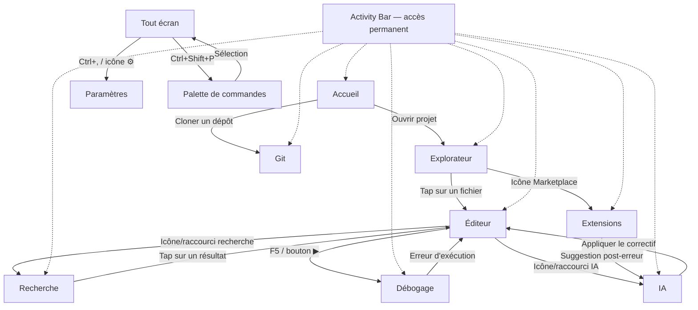

### 3.3 Exigences d'Interfaces Externes
#### [REQ-INTF-0651] PyStudio Mobile — Spécification de l'Interface Utilisateur (UX/UI)

**Type de document :** Spécification UX/UI
**Version :** 1.0
**Date :** 12 juillet 2026
**Inspiration principale :** Visual Studio Code (layout, terminologie, raccourcis)

---

##### [REQ-INTF-0652] Table des matières

0. Principes directeurs UX
1. Résumé exécutif
2. Axes d'adaptation : modes d'affichage & modes d'entrée
3. Système de navigation global
4. Spécification des écrans
5. États des composants (design system)
6. Accessibilité
7. Raccourcis clavier
8. Glossaire

---

##### [REQ-INTF-0653] 0. Principes directeurs UX

| Principe | Description |
|---|---|
| **Fidélité à VS Code** | Terminologie (Activity Bar, Explorer, Command Palette, Problems, Watch...), disposition en volets, palette de commandes universelle |
| **Un seul modèle, quatre présentations** | La même arborescence d'écrans s'adapte par *réagencement* (pas de fonctionnalité perdue) entre téléphone, tablette et écran externe |
| **Pouce d'abord, souris ensuite** | Les zones d'action critiques restent atteignables au pouce en mode téléphone ; les affordances souris (hover, clic-droit) n'apparaissent que si un pointeur est détecté |
| **Aucune fonctionnalité orpheline** | Toute action accessible au clavier (raccourci) doit avoir un équivalent tactile explicite, et vice versa |
| **Continuité d'état** | Changer de mode (rotation, branchement écran/clavier) ne doit jamais faire perdre le focus, la sélection ou le scroll |
| **Densité progressive** | Plus l'espace est grand, plus l'information est dense (volets simultanés, panneaux secondaires), sans jamais surcharger le mode téléphone |

---

##### [REQ-INTF-0654] 1. Résumé exécutif

L'interface de PyStudio Mobile reprend fidèlement les repères mentaux de **Visual Studio Code** — Activity Bar, Explorateur, éditeur à onglets, panneau inférieur (Terminal/Problèmes/Débogage), Command Palette — tout en se réorganisant selon **deux axes indépendants** :

1. **Le mode d'affichage** (taille d'écran) : Téléphone → Tablette → Écran externe, qui détermine le nombre de volets visibles simultanément.
2. **Le mode d'entrée** (périphérique connecté) : Tactile (par défaut) → Clavier → Souris/trackpad, qui détermine les affordances actives (focus visible, hover, clic-droit, raccourcis).

Neuf écrans composent l'application — Accueil, Explorateur, Éditeur, Recherche, Git, Débogage, Extensions, IA, Paramètres — tous accessibles en permanence depuis l'Activity Bar, quel que soit le mode.

---

##### [REQ-INTF-0655] 2. Axes d'adaptation : modes d'affichage & modes d'entrée

###### [REQ-INTF-0656] 2.1 Vue comparative des breakpoints

| Mode d'affichage | Largeur logique | Layout | Navigation principale | Entrée typique |
|---|---|---|---|---|
| **Téléphone (portrait)** | < 600dp | Un seul volet plein écran | Barre de navigation inférieure | Tactile |
| **Téléphone (paysage) / tablette étroite** | 600–839dp | Deux volets (rail + contenu) | Rail d'activités latéral compact | Tactile |
| **Tablette** | 840–1199dp | Trois volets (rail + sidebar + éditeur) | Rail + sidebar rétractable | Tactile, clavier/souris optionnels |
| **Écran externe** (DeX / HDMI / sans fil) | ≥ 1200dp | Quatre volets + barre de menu | Barre de menu complète | Clavier + souris/trackpad |

Les **modes d'entrée** (clavier, souris) sont orthogonaux à l'affichage : un téléphone posé sur un dock avec clavier Bluetooth active immédiatement les affordances "clavier" sans changer de layout d'écran tant que la taille physique reste petite.

###### [REQ-INTF-0657] 2.2 Mode téléphone

Disposition **single-pane** : un seul écran plein cadre à la fois. L'interface reprend l'esprit strict de VS Code. L'Activity Bar (Extensions, Explorer, etc.) est **verticalement placée à gauche** de façon permanente et **ultra-compacte** (uniquement les icônes). Il n'y a **pas de menu hamburger**.
Les menus classiques (File, Edit, etc.) sont accessibles via un bouton `[⋮]` dans la barre de titre ou directement via la Palette de commandes.
Une barre de titre (Title Bar) et une barre d'état (Status Bar) reproduisent les caractéristiques de VS Code, adaptées à l'écran.

Afin de garantir que ce layout s'affiche correctement sur un écran de téléphone (typiquement 360-400dp de large), les contraintes suivantes s'appliquent :
- **Activity Bar :** Largeur fixe de **48dp** (taille minimale pour l'accessibilité tactile).
- **Gouttière (numéros de ligne) :** Réduite au maximum pour maximiser l'espace du code source (~300dp restants).
- **Masquage intelligent :** L'Activity Bar se masque automatiquement lorsque le clavier virtuel s'ouvre, libérant 100% de la largeur pour la saisie de code, et réapparaît à la fermeture du clavier.
- **Barre d'état :** Si le contenu dépasse la largeur de l'écran, elle défile horizontalement (swipe).

```
+--------------------------------------+
| PyStudio Mobile               [🔍][⋮]| <- Barre de titre (Title Bar)
+----+---------------------------------+
| [📁]|                                |
| [🔎]|                                |
| [⎇]|     ZONE DE CONTENU ACTIVE     |
| [▶]|                                |
| [🧩]|                                |
+----+---------------------------------+
| ⎇ main*  Py 3.11  Ln 4, Col 20    🔔 | <- Barre d'état (Status Bar)
+--------------------------------------+
```

###### [REQ-INTF-0658] 2.3 Mode tablette

Disposition **dual/tri-pane**, proche de VS Code réduit : rail d'icônes fixe + panneau latéral rétractable + éditeur. Le panneau inférieur reste ancré (non masqué par défaut).

```
+----+----------------+------------------------------------+
| ⌂  |  EXPLORATEUR    |            ÉDITEUR                  |
| 📁 |-----------------|--------------------------------------|
| </>| v projet/       | main.py                        ×    |
| 🔎 |   src/          |----------------------------------------|
| ⎇  |     main.py     | 1  import numpy as np                |
| 🐞 |     utils.py    | 2                                     |
| 🧩 |   tests/        | 3  def main():                       |
| 🤖 |                 | 4      pass                          |
| ⚙  |                 |                                       |
+----+-----------------+---------------------------------------+
| TERMINAL | SORTIE | PROBLÈMES                        [×]    |
+-------------------------------------------------------------+
| ⎇ main | Python 3.11 | UTF-8 | Ln 4, Col 5    [IA] [Git ✓]  |
+-------------------------------------------------------------+
```

###### [REQ-INTF-0659] 2.4 Mode écran externe

Disposition **complète type desktop**, avec barre de menu déroulante, panneau secondaire (IA, Debug détaillé) ancrable à droite, et multi-fenêtrage logique (splits d'éditeur).

```
+-----------------------------------------------------------------------------------+
| PyStudio Mobile   Fichier  Édition  Affichage  Exécuter  Terminal  Aide      _ □ x |
+----+---------------+------------------------------------------+--------------------+
| ⌂  | EXPLORATEUR    |  main.py  ×   utils.py                   |  IA ASSISTANT      |
|    |----------------|--------------------------------------------|--------------------|
| 📁 | v projet-cv/    | 1  import numpy as np                     | > Explique cette   |
| </>|   > src/        | 2                                          |   erreur           |
| 🔎 |   > tests/      | 3  def compute(x):                        |                    |
| ⎇  |     README.md   | 4      return x ** 2                      | [Réponse du        |
| 🐞 |                 | 5                                          |  modèle...]        |
| 🧩 |                 |                                            |                    |
| 🤖 |                 |                                            |                    |
| ⚙  |                 |                                            |                    |
+----+-----------------+--------------------------------------------+--------------------+
|  TERMINAL  PROBLÈMES  SORTIE  CONSOLE DE DÉBOGAGE                                       |
+-------------------------------------------------------------------------------------------+
| ⎇ main*  Python 3.11 (venv)  UTF-8  LF  Ln 4, Col 20      🔔  IA ●  Git ✓  Build ✓        |
+-------------------------------------------------------------------------------------------+
```

###### [REQ-INTF-0660] 2.5 Mode clavier

Dès qu'un clavier physique (Bluetooth ou USB-C) est détecté, l'interface active : anneaux de focus visibles (2dp, couleur d'accent), navigation `Tab`/`Shift+Tab` entre volets, flèches directionnelles dans les listes/arborescences, `Échap` pour fermer toute superposition, et surtout la **Palette de commandes** comme point d'entrée universel.

```
+------------------------------------------------+
|  🔎  > Rechercher un fichier, une commande...   |
+------------------------------------------------+
|  > Ouvrir un fichier récent                     |
|  > Git : Valider (Commit)                       |
|  > Déboguer : Démarrer                          |
|  > Préférences : Ouvrir les paramètres           |
|  > Terminal : Nouveau terminal                  |
+------------------------------------------------+
```

###### [REQ-INTF-0661] 2.6 Mode souris

Dès qu'un pointeur (souris/trackpad) est détecté : apparition des **états de survol** (highlight de ligne, tooltips différés 500 ms), **clic-droit** ouvrant les menus contextuels (remplaçant l'appui long tactile), poignées de redimensionnement entre volets (curseur `↔`), et scrollbars visibles au survol (auto-masquées sinon).

```
+----------------------------+
| main.py            (survol)|----> menu contextuel (clic droit)
+----------------------------+      +----------------------+
                                     | Ouvrir                |
                                     | Renommer      F2      |
                                     | Supprimer     Suppr   |
                                     | Copier le chemin      |
                                     +----------------------+
```

---

##### [REQ-INTF-0662] 3. Système de navigation global

###### [REQ-INTF-0663] 3.1 Activity Bar (barre d'activités)

Conformément à VS Code, l'Activity Bar est disposée **verticalement à gauche**. Dans cette version, elle est **épinglée de façon permanente et ultra-compacte** (icônes uniquement) sur téléphone comme sur tablette/écran externe. Elle donne accès aux écrans suivants :

| Icône | Écran | Raccourci (clavier) |
|---|---|---|
| 🏠 | Accueil | `Ctrl+Shift+H` |
| 📁 | Explorateur | `Ctrl+Shift+E` |
| `</>` | Éditeur (dernier fichier actif) | `Ctrl+1` |
| 🔎 | Recherche | `Ctrl+Shift+F` |
| ⎇ | Git | `Ctrl+Shift+G` |
| 🐞 | Débogage | `Ctrl+Shift+D` |
| 🧩 | Extensions | `Ctrl+Shift+X` |
| 🤖 | IA | `Ctrl+Shift+I` |
| ⚙ | Paramètres | `Ctrl+,` |

###### [REQ-INTF-0664] 3.2 Flux de navigation



###### [REQ-INTF-0665] 3.3 Table des entrées / sorties par écran

| Écran | Entrées principales | Sorties principales |
|---|---|---|
| Accueil | Lancement de l'app, retour depuis tout écran (logo) | Explorateur, Git (clone), Éditeur (nouveau fichier) |
| Explorateur | Accueil, Activity Bar | Éditeur (tap fichier), menu contextuel (renommer/supprimer) |
| Éditeur | Explorateur, Recherche, Git (diff), Débogage (saut de ligne), IA (patch) | Débogage (▶), Recherche, IA |
| Recherche | Raccourci/icône, résultats depuis Problèmes | Éditeur (à la ligne du résultat) |
| Git | Activity Bar, notification "changements détectés" | Éditeur (diff), historique de commits |
| Débogage | F5 depuis l'Éditeur, Activity Bar | Éditeur (arrêt sur breakpoint), Console |
| Extensions | Activity Bar, suggestion contextuelle ("Installer OpenCV ?") | Installation → notification WorkspaceService |
| IA | Icône contextuelle (Éditeur/Debug/Terminal), Activity Bar | Application du patch → Éditeur |
| Paramètres | `Ctrl+,`, icône ⚙ (Accueil) | Retour (`←`) vers l'écran précédent |

---

##### [REQ-INTF-0666] 4. Spécification des écrans

###### [REQ-INTF-0667] 4.1 Accueil

**Objectif :** point d'entrée, accès rapide aux projets récents, création/ouverture/clonage, découverte de templates.

```text
+--+-----------------------------------+
|  | PyStudio Mobile            [🔍][⋮]|
|🏠| Welcome                           |
|  | PyStudio Mobile                   |
|📁|                                   |
|  | [ + New Project ]                 |
|🔎| [ 📂 Open Folder ]                |
|  | [ ⎇ Clone Git Repository ]        |
|⎇|                                   |
|  | Recent                            |
|▶| 📄 main.py               2h ago   |
|  | 📄 data_analysis        Yesterday |
|🧩|                                   |
+--+-----------------------------------+
```

*Adaptation tablette/externe :* les "Récents" et "Modèles" s'affichent en grille de cartes (2 à 4 colonnes) plutôt qu'en liste verticale.

---

###### [REQ-INTF-0668] 4.2 Explorateur

**Objectif :** naviguer, créer, renommer, supprimer les fichiers/dossiers du projet actif.

```text
+--+-----------------------------------+
|  | PyStudio Mobile            [🔍][⋮]|
|🏠| EXPLORER                     [...] |
|  | v my_project                      |
|📁|   v src                           |
|  |     📄 main.py                    |
|🔎|   v native                        |
|  |     ⚙ CMakeLists.txt              |
|⎇|   > tests                         |
|  |                                   |
|▶|                                   |
|  |                                   |
|🧩|                                   |
+--+-----------------------------------+
```

Appui long (tactile) / clic-droit (souris) sur un élément → menu contextuel : *Ouvrir, Renommer (`F2`), Supprimer (`Suppr`), Nouveau fichier, Nouveau dossier, Copier le chemin*.

---

###### [REQ-INTF-0669] 4.3 Éditeur

**Objectif :** édition de code avec coloration syntaxique, autocomplétion (LSP), breakpoints inline, exécution/débogage rapides.

```text
+--+-----------------------------------+
|  | PyStudio Mobile            [🔍][⋮]|
|🏠| 📄 main.py x                [▶][⋮]|
|  |  1 import requests                |
|📁|  2 from flask import Flask        |
|  |  3                                |
|🔎|  4 app = Flask(__name__)          |
|  |  5                                |
|⎇|  6 def fetch_user_data(id):       |
|  |  7     url = f"https..."          |
|▶|                                   |
|  |                                   |
|🧩|                                   |
+--+-----------------------------------+
| ⎇ main*  [X]0 [!]0   Ln 15, Col 21   |
+--------------------------------------+
```

Barre d'outils contextuelle flottante lors d'une sélection tactile : `[✂ Couper] [⧉ Copier] [Coller] [# Commenter] [🤖 IA]`. En mode externe, l'éditeur supporte le **split view** (division verticale/horizontale d'un même onglet).

---

###### [REQ-INTF-0670] 4.4 Recherche

**Objectif :** recherche/remplacement dans l'ensemble du projet, avec filtres (casse, regex, inclusion/exclusion).

```text
+--+-----------------------------------+
|  | Search                        [⋮] |
|🏠| [ compute                   ][🔍] |
|  | compute               [Aa][][.*]|
|📁|                                   |
|  | 📄 src/analytics.js               |
|🔎| Line 143: function computeScore() |
|  | Line 210: value = computeData()   |
|⎇|                                   |
|  | 📄 README.md                      |
|▶| Line 55: The algorithm to compute |
|  |                                   |
|🧩|                                   |
+--+-----------------------------------+
| ⎇ main*  [X]1 [!]1                 🔔|
+--------------------------------------+
```

---

###### [REQ-INTF-0671] 4.5 Git

**Objectif :** cycle de vie Git complet (staging, commit, branches, historique, diff).

```text
+--+-----------------------------------+
|  | Source Control             [↻][⋮] |
|🏠|                                   |
|  | [ feat: add user profile page   ] |
|📁| [ navigation                  ] |
|  |                [ Commit > ]       |
|🔎|                                   |
|  | Staged Changes (2)                |
|⎇|  [M] 📄 components/UserProfile.js |
|  |  [A] 📄 services/api.js           |
|▶|                                   |
|  | Changes (3)                       |
|🧩|  [M] 📄 routes/AppRoutes.js       |
+--+-----------------------------------+
```

*Adaptation externe :* le diff s'affiche en **vue côte-à-côte** (avant/après) dans le volet éditeur plutôt qu'en unifié.

---

###### [REQ-INTF-0672] 4.6 Débogage

**Objectif :** panneau de debug unifié Python/C++ (DAP) : contrôle d'exécution, variables, pile d'appels, breakpoints.

```text
+--+-----------------------------------+
|  | Run and Debug                     |
|🏠| [▶][⏸][⏭][⏮][↻][■]            |
|  | v VARIABLES                   [+] |
|📁|   v Locals                        |
|  |     v self (dict) {x:4, y:10}     |
|🔎|       x = 4                       |
|  |                                   |
|⎇| v CALL STACK                    [+]|
|  |   v main.py      stopped at line24|
|▶|      start_process            L20  |
|  |      initialize_app           L12  |
|🧩| v BREAKPOINTS                     |
+--+-----------------------------------+
| ⎇ main*  [X]0 [!]0      Ln 24, Col 5 |
+--------------------------------------+
```

*Adaptation externe :* Variables, Pile d'appels, Points d'arrêt et Watch s'affichent en **quatre panneaux ancrés distincts** simultanément (comme VS Code desktop).

---

###### [REQ-INTF-0673] 4.7 Extensions (Marketplace)

**Objectif :** rechercher, installer, gérer packages/plugins/templates.

```text
+--+-----------------------------------+
|  | Extensions                 [🔍][⋮]|
|🏠| [ 🔍 Search Extensions in Mark...] |
|  |                                   |
|📁| v INSTALLED                    2  |
|  |  📦 Python v2024.18.0             |
|🔎|     Microsoft          [Uninstall]|
|  |  📦 C/C++ v1.22.0                 |
|⎇|     Microsoft          [Uninstall]|
|  |                                   |
|▶| v RECOMMENDED                  3  |
|  |  📦 GitHub Copilot v1.23.0        |
|🧩|     Microsoft          [ Install ]|
+--+-----------------------------------+
```

---

###### [REQ-INTF-0674] 4.8 IA

**Objectif :** assistant contextuel (explication d'erreurs, génération de code, application de correctifs).

```text
+--+-----------------------------------+
|  | AI Assistant                  [+] |
|🏠|                                   |
|  | 👤 User                           |
|📁| how do I center a div in CSS?     |
|  |                                   |
|🔎| 🤖 AI Assistant                   |
|  | You can easily center a div...    |
|⎇|                                   |
|  | .container {                      |
|▶|    display: flex;                  |
|  |    justify-content: center;       |
|🤖| }                                 |
|  |          [ Apply Fix -> ]         |
+--+-----------------------------------+
| [ Ask AI...                   ][>][m]|
+--------------------------------------+
```

*Adaptation externe :* panneau ancré en permanence à droite de l'éditeur (cf. §2.4), permettant de suivre le code et la conversation simultanément.

---

###### [REQ-INTF-0675] 4.9 Paramètres

**Objectif :** configuration éditeur, toolchains (Python/Clang/CMake), apparence, comptes.

```text
+--+-----------------------------------+
|  | Settings                   [•••] S|
|🏠| [ 🔍 Search settings...          ] |
|  | TEXT EDITOR                       |
|📁| Cursor                            |
|  | Files                             |
|🔎| Auto Save           [afterDelay v]|
|  | Render Whitespace     [Enabled (O)]|
|⎇| WORKBENCH                         |
|  | Appearance                        |
|▶| Side Bar Position          [Right (O)]|
|  | PYTHON TOOLCHAIN                  |
|⚙| Python Path    Set python path... >|
+--+-----------------------------------+
```

---

##### [REQ-INTF-0676] 5. États des composants (design system)

| Composant | Défaut | Survol (souris) | Focus (clavier) | Actif/Pressé | Désactivé | Chargement | Erreur | Vide |
|---|---|---|---|---|---|---|---|---|
| **Bouton primaire** | Fond plein, texte blanc | Assombrissement 8% | Anneau 2dp | Assombrissement 16% | Opacité 40%, non cliquable | Spinner remplace le libellé | — | — |
| **Élément d'arborescence** | Fond transparent | Fond gris clair 4% | Anneau 2dp autour de la ligne | Fond accent 12% (sélectionné) | Texte grisé | Icône squelette | Icône ⚠ rouge | "Dossier vide" en italique |
| **Onglet d'éditeur** | Fond secondaire | Bouton × visible | Anneau 2dp | Fond primaire, indicateur de modif `●` | — | — | Pastille rouge (erreur de syntaxe) | — |
| **Champ de recherche/texte** | Bordure fine | Bordure accentuée | Bordure accent + anneau | — | Fond grisé | Barre de progression fine sous le champ | Bordure rouge + message | Placeholder visible |
| **Toggle (switch)** | Position off, gris | Halo léger | Anneau 2dp | Position on, couleur accent | Opacité 40% | — | — | — |
| **Carte package (Marketplace)** | Ombre légère | Ombre accentuée, curseur pointer | Anneau 2dp | Bouton "Installer" → "Installation..." | — | Barre de progression | Icône ⚠ + "Réessayer" | — |
| **Panneau inférieur (Terminal/Debug)** | Hauteur réduite (28dp, barre d'onglets) | Poignée de redimensionnement visible | — | Hauteur étendue | — | — | — | "Aucune sortie" |
| **Bulle de chat IA** | Fond neutre | — | — | — | — | Points de saisie animés (…) | Bandeau "Échec de la requête, réessayer" | — |

---

##### [REQ-INTF-0677] 6. Accessibilité

Conformité visée : **WCAG 2.1 niveau AA**, compatibilité **TalkBack** et **Switch Access** (Android).

| Dimension | Exigences |
|---|---|
| **Perceptible** | Contraste texte ≥ 4,5:1, composants d'interface ≥ 3:1 ; thèmes clair, sombre et haut-contraste ; redimensionnement du texte jusqu'à 200% sans perte de contenu ni troncature ; alternative textuelle (`accessibilityLabel`) pour chaque icône |
| **Utilisable** | Cibles tactiles ≥ 48×48dp avec espacement ≥ 8dp ; navigation clavier complète (ordre de tabulation logique, aucun piège de focus) ; anneau de focus visible (2dp, couleur d'accent) ; tout geste de balayage a un équivalent bouton/menu |
| **Compréhensible** | Libellés explicites (pas de "OK/Annuler" ambigu) ; erreurs signalées par texte + icône (jamais par la couleur seule) ; cohérence de la navigation entre les neuf écrans |
| **Robuste** | Rôles sémantiques (`accessibilityRole`) pour listes, onglets, boutons, régions live ; annonce des changements d'état asynchrones (fin de build, arrêt sur breakpoint, réponse IA) via régions live |
| **Mouvement réduit** | Respect du paramètre système "Supprimer les animations" ; désactivation des transitions non essentielles (garde les transitions fonctionnelles comme le changement d'onglet) |
| **Retour haptique** | Vibration courte sur : arrêt sur breakpoint, fin de build (succès/échec), erreur de compilation |

###### [REQ-INTF-0678] 6.1 Table des attributs par composant

| Composant | Attribut d'accessibilité |
|---|---|
| Icônes de l'Activity Bar | `accessibilityLabel` explicite ("Explorateur de fichiers"), rôle "tab", état "sélectionné" annoncé |
| Éditeur de code | Lecture ligne par ligne activable, annonce vocale du numéro de ligne/colonne, annonce des diagnostics LSP au focus |
| Boutons de débogage (F5, F9...) | Taille ≥ 48dp, libellé vocal explicite en plus de l'icône |
| Arborescence de fichiers | Rôle "liste"/"élément de liste", annonce de la profondeur et du type (dossier/fichier) |
| Chat IA | Région live "polie" pour annoncer les nouveaux messages sans interrompre l'utilisateur |
| Barre de statut | Région live "polie" pour annoncer fin de build / erreurs Git |

---

##### [REQ-INTF-0679] 7. Raccourcis clavier

###### [REQ-INTF-0680] 7.1 Globaux

| Action | Raccourci | Équivalent tactile (sans clavier) |
|---|---|---|
| Palette de commandes | `Ctrl+Shift+P` | Appui long sur le logo / bouton "⋮" |
| Ouverture rapide de fichier | `Ctrl+P` | Icône loupe (barre supérieure) |
| Paramètres | `Ctrl+,` | Icône ⚙ (Accueil / Activity Bar) |
| Basculer la barre latérale | `Ctrl+B` | Glissement depuis le bord gauche |
| Basculer le panneau inférieur | `Ctrl+J` | Glissement depuis le bas |
| Nouveau terminal | `` Ctrl+` `` | Onglet "Terminal" du tiroir inférieur |
| Fermer l'onglet actif | `Ctrl+W` | Bouton "×" sur l'onglet |
| Onglet suivant / précédent | `Ctrl+Tab` / `Ctrl+Shift+Tab` | Glissement horizontal sur la barre d'onglets |

###### [REQ-INTF-0681] 7.2 Éditeur

| Action | Raccourci | Équivalent tactile |
|---|---|---|
| Enregistrer | `Ctrl+S` | Auto-save par défaut + bouton "✓" |
| Annuler / Rétablir | `Ctrl+Z` / `Ctrl+Y` | Boutons ↺ / ↻ de la barre d'outils |
| Rechercher dans le fichier | `Ctrl+F` | Icône loupe de l'éditeur |
| Remplacer | `Ctrl+H` | Bouton "Remplacer" du panneau recherche |
| Sélection multiple (occurrence suivante) | `Ctrl+D` | Appui long + "Sélectionner tout" dans le menu contextuel |
| Commenter / décommenter la ligne | `Ctrl+/` | Bouton "#" de la barre flottante contextuelle |
| Déplacer la ligne | `Alt+↑` / `Alt+↓` | Poignée de glissement sur la ligne sélectionnée |
| Dupliquer la ligne | `Shift+Alt+↓` | Bouton "⧉" de la barre flottante |
| Aller à la définition | `F12` | Appui long sur le symbole → "Aller à la définition" |
| Trouver toutes les références | `Shift+F12` | Menu contextuel → "Trouver les références" |
| Déclencher l'autocomplétion | `Ctrl+Space` | Automatique à la frappe |

###### [REQ-INTF-0682] 7.3 Débogage

| Action | Raccourci | Équivalent tactile |
|---|---|---|
| Démarrer / Continuer | `F5` | Bouton `▶` |
| Basculer un point d'arrêt | `F9` | Tap sur la gouttière (marge gauche) de la ligne |
| Pas à pas principal | `F10` | Bouton `⏭` |
| Pas à pas détaillé | `F11` | Bouton `⏬` (barre étendue) |
| Sortir de la fonction | `Shift+F11` | Bouton `⏮` (barre étendue) |
| Arrêter | `Shift+F5` | Bouton `■` |

###### [REQ-INTF-0683] 7.4 Git

| Action | Raccourci | Équivalent tactile |
|---|---|---|
| Valider (commit) | `Ctrl+Enter` (dans le champ message) | Bouton "✓ Valider" |
| Ajouter à l'index (stage) tout | `Ctrl+Shift+G` puis `+` | Bouton "+all" |
| Actualiser le statut | `Ctrl+R` (dans l'écran Git) | Bouton "↻" |

###### [REQ-INTF-0684] 7.5 Navigation entre écrans

Voir la table complète en **§3.1** (icônes de l'Activity Bar et raccourcis associés, ex. `Ctrl+Shift+E` pour l'Explorateur, `Ctrl+Shift+X` pour les Extensions).

---

##### [REQ-INTF-0685] 8. Glossaire

| Terme | Définition |
|---|---|
| **Activity Bar** | Barre d'icônes permanente donnant accès aux neuf écrans principaux (bas en téléphone, rail latéral en tablette/externe) |
| **Bottom sheet** | Panneau rétractable glissant depuis le bas de l'écran, utilisé en mode téléphone pour Terminal/Débogage/Problèmes |
| **Command Palette** | Palette de commandes universelle (`Ctrl+Shift+P`), point d'entrée clavier vers toute action de l'application |
| **DAP** | Debug Adapter Protocol — protocole unifiant l'expérience de débogage Python et C++ |
| **Gouttière** | Marge gauche de l'éditeur affichant numéros de ligne et points d'arrêt |
| **LSP** | Language Server Protocol — fournit l'autocomplétion et les diagnostics dans l'éditeur |
| **Mode d'affichage** | Axe déterminant le nombre de volets visibles simultanément (téléphone/tablette/écran externe) |
| **Mode d'entrée** | Axe déterminant les affordances actives selon le périphérique connecté (tactile/clavier/souris) |

---

*Fin de la spécification.*


##### [REQ-INTF-0686] Panneau de Visualisation Scientifique

Pour interagir de façon optimale avec les sorties graphiques générées, un **Panneau de visualisation** spécifique a été ajouté à l'interface utilisateur.

Ce panneau fournit des contrôles natifs adaptés aux interfaces tactiles :
- **Zoom interactif :** Pincer pour zoomer ("pinch-to-zoom") sur des zones spécifiques du graphique.
- **Panoramique (Pan) :** Défilement et navigation libre à un doigt sur la zone rendue.
- **Plein écran :** Mode immersif maximisant l'espace alloué au rendu graphique en masquant l'éditeur et les barres d'outils.
- **Export :** Menu dédié pour enregistrer la visualisation générée vers le système de fichiers.
- **Capture d'écran :** Raccourci rapide pour sauvegarder instantanément une image de la vue actuelle dans la galerie Android.

