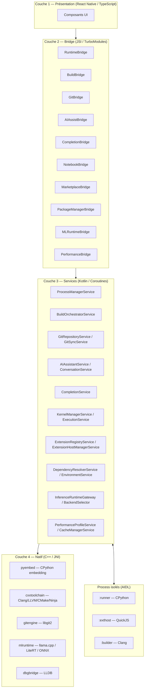
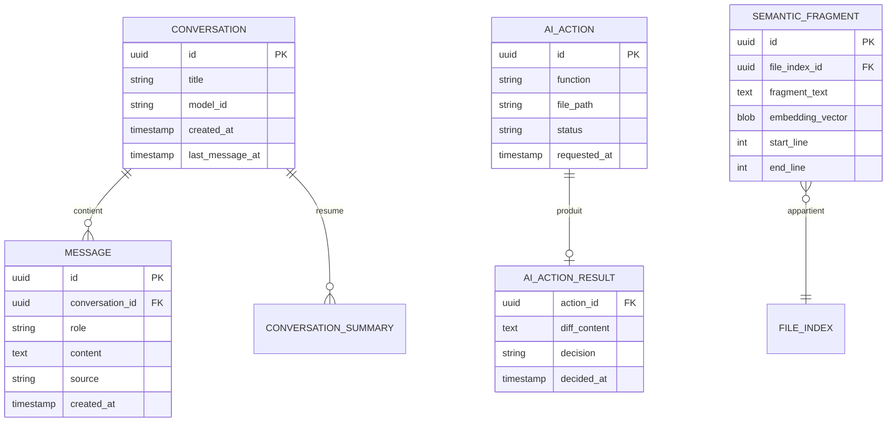
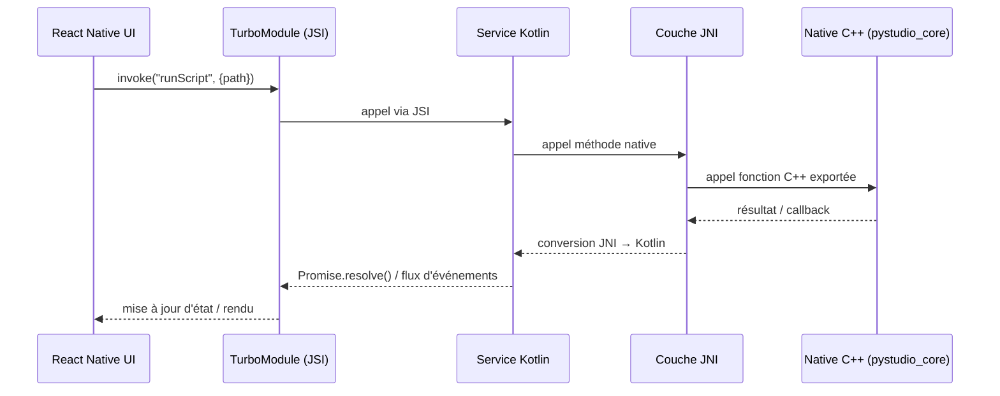
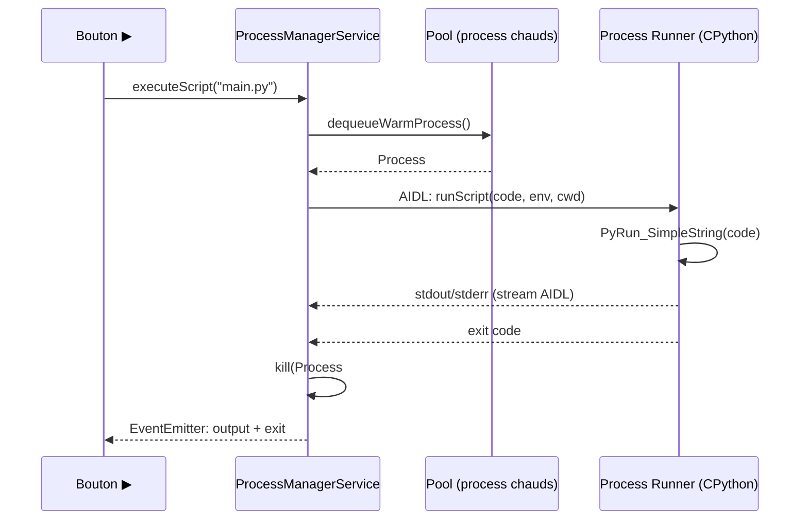
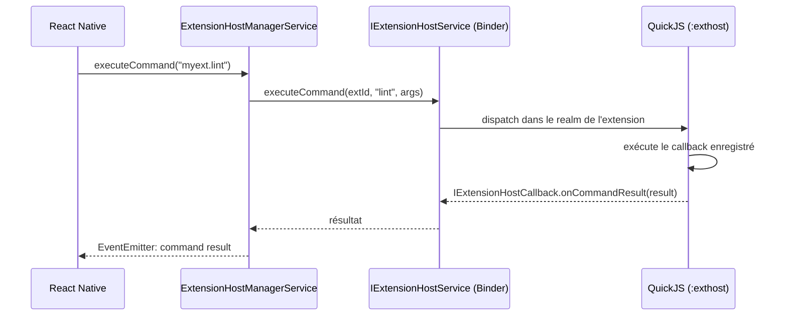

#### [REQ-INTF-0687] PyStudio Mobile — Spécification des API Internes

**Type de document :** Spécification technique — API internes
**Version :** 1.0
**Date :** 12 juillet 2026
**Portée :** Consolidation exhaustive de toutes les interfaces, services, événements, mécanismes IPC, bridges JNI, contrats et structures de données de PyStudio Mobile
**Sources :**
- `PyStudio_Mobile_Architecture_Specification.md` — architecture de référence
- `PyStudio_Mobile_Python_Runtime_Specification.md` — runtime CPython
- `PyStudio_Mobile_Android_Package_Builder_Specification.md` — build natif
- `PyStudio_Mobile_Python_Package_Manager_Specification.md` — gestionnaire `py`
- `PyStudio_Mobile_Git_Integration_Specification.md` — Git
- `PyStudio_Mobile_AI_Assistant_System_Specification.md` — assistant IA
- `PyStudio_Mobile_AI_Runtime_Specification.md` — runtime ML
- `PyStudio_Mobile_Notebook_System_Specification.md` — notebooks Jupyter
- `PyStudio_Mobile_Marketplace_Extensions_Specification.md` — marketplace & extensions
- `PyStudio_Mobile_Security_Specification.md` — sécurité
- `PyStudio_Mobile_Performance_Specification.md` — performance

---

##### [REQ-INTF-0688] Table des matières

0. Principes directeurs d'API
1. Vue d'ensemble de l'architecture d'API
2. Couche Bridge — TypeScript (Présentation ↔ Natif)
3. Couche Services — Kotlin (Logique métier)
4. Couche JNI — C++/NDK (Cœur natif)
5. IPC — Communication inter-process
6. Bus d'événements
7. Structures de données
8. SDK d'extensions (API publique pour les développeurs tiers)
9. Contrats d'erreur
10. Diagrammes de séquence
11. Table de traçabilité
12. Glossaire

---

##### [REQ-INTF-0689] 0. Principes directeurs d'API

| Principe | Description | Implication |
|---|---|---|
| **Flux unidirectionnel** | Les données descendent du Bridge vers les Services vers le Natif ; les événements remontent en sens inverse | Pas de référence circulaire entre couches |
| **Typage strict bout en bout** | Chaque interface TypeScript a un miroir Kotlin, et chaque service Kotlin a un miroir JNI | Pas de `any`, pas de `Object` non typé traversant le bridge |
| **Async par défaut** | Toute opération pouvant prendre > 1 ms est `suspend` (Kotlin) / `Promise` (TS) | Le thread UI n'est jamais bloqué |
| **Streaming pour les flux longs** | Les opérations de longue durée émettent des événements via `Flow` (Kotlin) / `EventEmitter` (TS) | stdout, logs de build, tokens IA : toujours en streaming |
| **Erreurs typées** | Chaque domaine définit un `enum` d'erreurs avec un code stable, un message et un indicateur `recoverable` | Aucune exception brute ne traverse le bridge |
| **Disposable pattern** | Les subscriptions retournent un `Disposable` / `() => void` pour le nettoyage | Pas de fuite d'écouteurs |
| **Isolation process** | Les opérations dangereuses (exécution utilisateur, build, extensions) s'exécutent dans des process Android isolés | Communication exclusivement par AIDL/Binder |
| **Versionning sémantique** | Les APIs du SDK d'extension suivent SemVer avec période de dépréciation de 6 mois | Pas de cassure sans avertissement préalable |

---

##### [REQ-INTF-0690] 1. Vue d'ensemble de l'architecture d'API

###### [REQ-INTF-0691] 1.1 Pile d'API par couche



###### [REQ-INTF-0692] 1.2 Types d'appel

| Mécanisme | Direction | Usage | Latence |
|---|---|---|---|
| **JSI (synchrone)** | TS → Kotlin | Lecture rapide (config, existence de fichier) | < 1 ms |
| **TurboModule (async)** | TS → Kotlin → TS | Opérations métier (build, run, git, install) | Variable |
| **EventEmitter** | Kotlin → TS | Streaming (stdout, logs, tokens IA) | Temps réel |
| **AIDL/Binder** | Service → Process isolé | IPC Android (exécution, extension host, build) | ~0.5 ms par appel |
| **JNI** | Kotlin → C++ | Appel natif (libgit2, pyembed, mlruntime) | ~0.1 ms overhead |
| **Socket Unix** | Service → LLDB | Debug natif (DAP) | ~1 ms |
| **stdio** | Service → LSP server | Autocomplétion (pylsp, clangd) | Variable |
| **SharedFlow** | Service → Service | Bus d'événements interne | ~0 ms |

###### [REQ-INTF-0693] 1.3 Inventaire complet

| Domaine | Bridges TS | Services Kotlin | Interfaces JNI | Événements | Structures de données |
|---|---|---|---|---|---|
| **Runtime Python** | 1 | 2 | 1 | 2 | 4 |
| **Build C/C++** | 1 | 1 | 1 | 3 | 7 |
| **Git** | 1 | 5 | 1 | 3 | 9 |
| **Assistant IA** | 2 | 7 | 0 (via mlruntime) | 3 | 6 |
| **Runtime ML** | 1 | 4 | 0 (encapsulé) | 1 | 5 |
| **Notebook** | 1 | 5 | 0 | 2 | 8 |
| **Marketplace** | 1 | 5 | 0 | 4 | 10 |
| **Package Manager** | 1 | 4 | 0 | 1 | 5 |
| **Performance** | 1 | 2 | 0 | 3 | 4 |
| **Total** | **10** | **35** | **3** | **22** | **58** |

---

##### [REQ-INTF-0694] 2. Couche Bridge — TypeScript (Présentation ↔ Natif)

###### [REQ-INTF-0695] 2.1 `PyStudioRuntimeBridge` — exécution Python

**Source :** Runtime §12.1

```typescript
export interface PyStudioRuntimeBridge {
  run(scriptPath: string, options?: RunOptions): Promise<RunResult>;
  onOutput(callback: (chunk: OutputChunk) => void): () => void;
  poolStatus(): Promise<WarmPoolStatus>;
  forceGcCollect(envId: string): Promise<void>;
}

export interface RunOptions {
  pythonVersion: '3.13' | '3.14' | '3.14t';
  useWarmPool?: boolean;   // défaut true
}

export interface WarmPoolStatus {
  warmProcesses: number;
  targetSize: number;
  lastShrinkReason?: 'memory_pressure' | 'background' | null;
}
```

###### [REQ-INTF-0696] 2.2 `PyStudioBuildBridge` — build C/C++ & wheels

**Source :** Builder §12.1

```typescript
export interface PyStudioBuildBridge {
  build(options: BuildOptions): Promise<BuildResult>;
  cancelBuild(buildId: string): Promise<void>;
  onBuildLog(callback: (chunk: BuildLogChunk) => void): () => void;

  packageBuild(options: PackageBuildOptions): Promise<PackageBuildResult>;
  resumeBuild(buildId: string): Promise<BuildResult>;
  getBuildState(buildId: string): Promise<BuildStateSnapshot>;
  onPackageInstalled(callback: (evt: PackageInstalledEvent) => void): () => void;
  onBuildError(callback: (err: BuildErrorEvent) => void): () => void;
}

export interface PackageBuildOptions {
  projectId: string;
  targetAbis: Abi[];
  pythonVersion: '3.13' | '3.14' | '3.14t';
  mode: 'debug' | 'release' | 'profile';
  steps: BuildStep[];
  signAfterBuild?: boolean;
  installAfterBuild?: boolean;
}

export type BuildStep =
  | 'fetch_sources' | 'compile' | 'generate_so'
  | 'build_wheel' | 'sign' | 'install' | 'cache';

export interface PackageBuildResult {
  buildId: string;
  status: 'success' | 'partial' | 'failed';
  artifactsByAbi: Record<Abi, BuildArtifact[]>;
  manifestPath: string;
  durationMs: number;
  cacheHits: CacheHitStats;
}

export interface BuildArtifact {
  path: string;
  type: 'so' | 'wheel' | 'apk' | 'aab';
  signed: boolean;
  sizeBytes: number;
  sha256: string;
}

export interface CacheHitStats {
  sourcesHit: number;
  objectsHit: number;
  wheelsHit: number;
  totalUnits: number;
}

export interface BuildStateSnapshot {
  buildId: string;
  currentStep: BuildStep;
  completedSteps: BuildStep[];
  resumable: boolean;
}

export interface BuildErrorEvent {
  buildId: string;
  step: BuildStep;
  errorCode: BuildErrorCode;
  message: string;
  context: Record<string, string>;
  recoverable: boolean;
}
```

###### [REQ-INTF-0697] 2.3 `PyStudioGitBridge` — opérations Git

**Source :** Git §14.1

```typescript
export interface PyStudioGitBridge {
  clone(options: CloneOptions): Promise<CloneResult>;
  onCloneProgress(callback: (progress: TransferProgress) => void): () => void;

  getStatus(repoId: string): Promise<GitStatus>;
  stageFiles(repoId: string, paths: string[]): Promise<void>;
  stageHunk(repoId: string, filePath: string, hunkId: string): Promise<void>;
  commit(repoId: string, message: string, options?: CommitOptions): Promise<CommitResult>;

  push(repoId: string, options?: PushOptions): Promise<PushResult>;
  pull(repoId: string, options?: PullOptions): Promise<PullResult>;
  onTransferProgress(callback: (progress: TransferProgress) => void): () => void;

  listBranches(repoId: string): Promise<BranchInfo[]>;
  createBranch(repoId: string, name: string, from?: string): Promise<void>;
  checkoutBranch(repoId: string, name: string): Promise<CheckoutResult>;
  deleteBranch(repoId: string, name: string, remote?: boolean): Promise<void>;

  getDiff(repoId: string, options: DiffOptions): Promise<DiffResult>;

  startMerge(repoId: string, sourceBranch: string): Promise<MergeSessionInfo>;
  resolveConflict(repoId: string, sessionId: string, filePath: string, resolution: ConflictResolution): Promise<void>;
  completeMerge(repoId: string, sessionId: string, commitMessage: string): Promise<CommitResult>;
  abortMerge(repoId: string, sessionId: string): Promise<void>;
}

export interface CloneOptions {
  url: string;
  destinationPath: string;
  depth?: number;
  branch?: string;
  credentialAlias?: string;
}

export interface GitStatus {
  currentBranch: string;
  ahead: number;
  behind: number;
  files: FileStatus[];
}

export interface FileStatus {
  path: string;
  status: 'modified' | 'added' | 'deleted' | 'renamed' | 'conflicted' | 'untracked';
  staged: boolean;
}

export interface DiffOptions {
  filePath?: string;
  from: 'working' | 'index' | string;
  to: 'index' | 'head' | string;
  mode: 'unified' | 'side_by_side';
}

export interface DiffResult {
  hunks: DiffHunk[];
  isBinary: boolean;
}

export interface DiffHunk {
  id: string;
  oldStart: number;
  oldLines: number;
  newStart: number;
  newLines: number;
  content: string;
  staged: boolean;
}

export interface MergeSessionInfo {
  sessionId: string;
  conflictedFiles: string[];
  fastForward: boolean;
}

export interface ConflictResolution {
  strategy: 'ours' | 'theirs' | 'manual';
  hunkResolutions?: { hunkIndex: number; chosen: 'ours' | 'theirs' | 'manual'; manualContent?: string }[];
}

export interface TransferProgress {
  operation: 'clone' | 'push' | 'pull' | 'fetch';
  bytesTransferred: number;
  totalBytes?: number;
  objectsProcessed: number;
  totalObjects?: number;
}
```

###### [REQ-INTF-0698] 2.4 `PyStudioAIAssistBridge` — assistant IA (chat & actions)

**Source :** AI Assistant §17.1

```typescript
export interface PyStudioAIAssistBridge {
  // Chat
  newConversation(): Promise<string>;
  sendMessage(conversationId: string, message: string): Promise<void>;
  onChatToken(callback: (evt: ChatTokenEvent) => void): () => void;
  listConversations(): Promise<ConversationSummary[]>;

  // Actions contextuelles
  runAction(request: AIActionRequest): Promise<string>;   // actionId
  applyActionResult(actionId: string, decision: ActionDecision, editedDiff?: string): Promise<void>;
  onActionProgress(callback: (evt: AIActionProgressEvent) => void): () => void;

  // Modèles
  listModels(): Promise<AIModelInfo[]>;
  downloadModel(modelId: string, variant: string): Promise<void>;
  deleteModel(modelId: string): Promise<void>;
  getModelStatus(fn: AIFunction): Promise<ModelStatus>;
}

export type AIFunction = 'chat' | 'completion' | 'explain_error' | 'generate_tests' | 'refactor' | 'generate_docs';

export type ActionDecision = 'accept' | 'reject' | 'edit_then_accept';

export interface AIActionRequest {
  function: AIFunction;
  filePath: string;
  selectionRange?: { startLine: number; endLine: number };
  additionalContext?: string;
}

export interface ChatTokenEvent {
  conversationId: string;
  token: string;
  isFinal: boolean;
  tokenIndex: number;
}

export interface AIActionProgressEvent {
  actionId: string;
  phase: 'context_building' | 'inference' | 'diff_generation' | 'complete' | 'error';
  diffPreview?: string;
}

export interface AIModelInfo {
  modelId: string;
  format: 'gguf' | 'onnx' | 'tflite';
  function: AIFunction[];
  variants: { quantization: string; sizeBytes: number; recommendedMinRamMb: number }[];
  downloaded: boolean;
}

export interface ModelStatus {
  function: AIFunction;
  modelId: string;
  resident: boolean;
  backendUsed?: 'gpu_vulkan' | 'gpu_vendor' | 'nnapi' | 'cpu_xnnpack';
}
```

###### [REQ-INTF-0699] 2.5 `PyStudioCompletionBridge` — complétion inline (FIM)

**Source :** AI Assistant §17.1

```typescript
export interface PyStudioCompletionBridge {
  requestCompletion(request: CompletionRequest): Promise<CompletionSuggestion | null>;
  cancel(requestId: string): Promise<void>;
  onCompletionReady(callback: (suggestion: CompletionSuggestion) => void): () => void;
}

export interface CompletionRequest {
  requestId: string;
  filePath: string;
  cursorLine: number;
  cursorColumn: number;
  prefixWindow: string;
  suffixWindow: string;
}

export interface CompletionSuggestion {
  requestId: string;
  text: string;
  confidence: number;
}
```

###### [REQ-INTF-0700] 2.6 `PyStudioNotebookBridge` — notebooks Jupyter

**Source :** Notebook §12.1

```typescript
export interface PyStudioNotebookBridge {
  openNotebook(path: string): Promise<NotebookHandle>;
  closeNotebook(notebookId: string): Promise<void>;

  addCell(notebookId: string, type: CellType, index: number): Promise<Cell>;
  updateCellSource(notebookId: string, cellId: string, source: string): Promise<void>;
  deleteCell(notebookId: string, cellId: string): Promise<void>;
  moveCell(notebookId: string, cellId: string, newIndex: number): Promise<void>;

  executeCell(notebookId: string, cellId: string): Promise<ExecutionHandle>;
  executeAll(notebookId: string): Promise<ExecutionHandle[]>;
  interruptExecution(notebookId: string): Promise<void>;
  restartKernel(notebookId: string): Promise<void>;

  onCellOutput(callback: (evt: CellOutputEvent) => void): () => void;
  onKernelStatus(callback: (evt: KernelStatusEvent) => void): () => void;

  getVariables(notebookId: string): Promise<VariableInfo[]>;
  inspectVariable(notebookId: string, name: string): Promise<VariableDetail>;

  exportNotebook(notebookId: string, options: ExportOptions): Promise<ExportResult>;
}

export type CellType = 'code' | 'markdown' | 'raw';

export interface Cell {
  id: string;
  type: CellType;
  source: string;
  executionCount?: number;
  outputs: CellOutput[];
  stale: boolean;
}

export interface CellOutput {
  outputType: 'execute_result' | 'display_data' | 'stream' | 'error';
  data: Record<string, string>;
}

export interface ExecutionHandle {
  cellId: string;
  executionCount: number;
  status: 'queued' | 'running' | 'completed' | 'error' | 'interrupted';
}

export interface CellOutputEvent {
  cellId: string;
  output: CellOutput;
  isFinal: boolean;
}

export interface KernelStatusEvent {
  notebookId: string;
  status: 'starting' | 'ready' | 'running' | 'interrupted' | 'restarting' | 'stopped';
  memoryBytes: number;
}

export interface VariableInfo {
  name: string;
  typeName: string;
  reprPreview: string;
  sizeBytesEstimate: number;
}

export interface VariableDetail extends VariableInfo {
  shape?: number[];
  columns?: string[];
  detailData: Record<string, string>;
}

export interface ExportOptions {
  format: 'html' | 'pdf';
  includeCode: boolean;
  includeMarkdown: boolean;
  orientation?: 'portrait' | 'landscape';
}

export interface ExportResult {
  filePath: string;
  sizeBytes: number;
  staleWarningAcknowledged: boolean;
}
```

###### [REQ-INTF-0701] 2.7 `PyStudioMarketplaceBridge` — marketplace & extensions

**Source :** Marketplace §11.1

```typescript
export interface PyStudioMarketplaceBridge {
  search(query: string, filters?: SearchFilters): Promise<ExtensionSearchResult>;
  getExtensionDetails(extensionId: string): Promise<ExtensionDetails>;
  getRecommendations(context?: RecommendationContext): Promise<ExtensionSummary[]>;

  install(extensionId: string, version?: string): Promise<InstallResult>;
  uninstall(extensionId: string): Promise<void>;
  enable(extensionId: string): Promise<void>;
  disable(extensionId: string): Promise<void>;
  update(extensionId: string): Promise<UpdateResult>;
  updateAll(): Promise<UpdateResult[]>;

  getInstalled(): Promise<InstalledExtension[]>;
  getExtensionState(extensionId: string): Promise<ExtensionState>;

  getPermissions(extensionId: string): Promise<PermissionGrant[]>;
  revokePermission(extensionId: string, permission: string): Promise<void>;
  grantPermission(extensionId: string, permission: string): Promise<void>;

  onDidInstallExtension(callback: (evt: ExtensionInstallEvent) => void): () => void;
  onDidUninstallExtension(callback: (evt: ExtensionUninstallEvent) => void): () => void;
  onDidUpdateExtension(callback: (evt: ExtensionUpdateEvent) => void): () => void;
  onDidChangeExtensionState(callback: (evt: ExtensionStateChangeEvent) => void): () => void;
}

export interface SearchFilters {
  category?: string;
  sortBy?: 'relevance' | 'installs' | 'rating' | 'updated';
  targetAbi?: string;
  pystudioVersion?: string;
}

export interface ExtensionSearchResult {
  total: number;
  results: ExtensionSummary[];
}

export interface ExtensionSummary {
  id: string;
  displayName: string;
  publisher: string;
  description: string;
  version: string;
  iconUrl: string;
  installs: number;
  rating: number;
  categories: string[];
  preRelease: boolean;
  hasDeveloperSignature: boolean;
}

export interface ExtensionDetails extends ExtensionSummary {
  readme: string;
  changelog: string;
  license: string;
  repository?: string;
  permissions: PermissionDeclaration[];
  dependencies: string[];
  engines: { pystudio: string };
  platform: PlatformRequirements;
  versions: VersionInfo[];
  ratings: RatingDistribution;
}

export interface InstalledExtension {
  id: string;
  displayName: string;
  version: string;
  enabled: boolean;
  state: 'active' | 'inactive' | 'activating' | 'errored' | 'disabled';
  permissions: PermissionGrant[];
  sizeBytes: number;
  hasUpdate: boolean;
  latestVersion?: string;
}

export interface ExtensionState {
  state: 'active' | 'inactive' | 'activating' | 'errored' | 'disabled';
  activationTime?: number;
  memoryUsageBytes?: number;
  lastError?: string;
  journal: ExtensionLogEntry[];
}

export interface PermissionGrant {
  name: string;
  granted: boolean;
  grantedAt?: string;
  justification: string;
}

export type InstallResult = {
  success: boolean;
  extensionId: string;
  version: string;
  requiresReload: boolean;
  rollbackAvailable: boolean;
};
```

###### [REQ-INTF-0702] 2.8 `PyStudioPackageManagerBridge` — gestionnaire de packages Python

**Source :** Package Manager §10.1

```typescript
export interface PyStudioPackageManagerBridge {
  runCommand(command: PyCommand): Promise<PyCommandResult>;
  onCommandOutput(callback: (chunk: PyOutputChunk) => void): () => void;

  createEnv(options: CreateEnvOptions): Promise<EnvInfo>;
  listEnvs(): Promise<EnvInfo[]>;
  useEnv(envId: string): Promise<void>;
  deleteEnv(envId: string): Promise<void>;
}

export type PyCommand =
  | { type: 'install'; package?: string; dev?: boolean; env?: string; offline?: boolean; yes?: boolean }
  | { type: 'uninstall'; package: string; env?: string; yes?: boolean }
  | { type: 'update'; package?: string; env?: string; dryRun?: boolean }
  | { type: 'build'; target?: string; abis?: Abi[]; mode?: 'debug' | 'release' | 'profile' }
  | { type: 'search'; query: string; abi?: Abi; category?: string }
  | { type: 'list'; env?: string; outdated?: boolean; tree?: boolean };

export interface PyCommandResult {
  success: boolean;
  plan?: InstallPlan;
  packages?: PackageSummary[];
  lockfileChanged: boolean;
  errorCode?: PyErrorCode;
}

export interface InstallPlan {
  toAdd: PackageSummary[];
  toUpdate: { from: PackageSummary; to: PackageSummary }[];
  toRemove: PackageSummary[];
}

export interface PackageSummary {
  name: string;
  version: string;
  source: 'pypi_official' | 'pystudio_registry' | 'local_build';
  sizeBytes: number;
  signatureVerified: boolean;
}

export interface EnvInfo {
  envId: string;
  pythonVersion: string;
  targetAbi: Abi;
  active: boolean;
}
```

###### [REQ-INTF-0703] 2.9 `PyStudioMLRuntimeBridge` — runtime ML

**Source :** AI Runtime §17.1

```typescript
export interface PyStudioMLRuntimeBridge {
  loadModel(options: LoadModelOptions): Promise<ModelHandle>;
  runInference(handle: ModelHandle, input: TensorInput): Promise<TensorOutput>;
  releaseModel(handle: ModelHandle): Promise<void>;
  getBackendInfo(): Promise<BackendInfo>;
  onMemoryPressure(callback: (evt: MemoryPressureEvent) => void): () => void;
}

export interface LoadModelOptions {
  modelPath: string;
  framework: 'tflite' | 'onnxruntime' | 'executorch' | 'opencv_dnn';
  preferredBackend?: 'gpu' | 'nnapi' | 'cpu' | 'auto';
  quantization?: 'int8' | 'fp16' | 'fp32';
  maxSequenceLength?: number;
}

export interface ModelHandle {
  sessionId: string;
  framework: string;
  backendUsed: 'gpu_vulkan' | 'gpu_vendor' | 'nnapi' | 'cpu_xnnpack';
  estimatedMemoryBytes: number;
}

export interface BackendInfo {
  vulkanAvailable: boolean;
  vulkanVersion?: string;
  nnapiAvailable: boolean;
  nnapiDriverQuality: 'good' | 'known_issues' | 'unknown';
  performanceCoreCount: number;
}

export interface MemoryPressureEvent {
  level: 'moderate' | 'critical';
  sessionsEvicted: string[];
}
```

###### [REQ-INTF-0704] 2.10 `PerformanceBridge` — performance et monitoring

**Source :** Performance §14.3

```typescript
export interface PerformanceBridge {
  getDeviceProfile(): Promise<DeviceProfile>;
  getThermalStatus(): Promise<ThermalStatus>;
  getCacheStats(): Promise<Record<CacheLevel, CacheStats>>;
  forceGlobalGc(): Promise<void>;
  getMemoryUsage(): Promise<MemoryUsage>;

  onThermalStatusChanged(callback: (status: ThermalStatus) => void): Disposable;
  onMemoryPressure(callback: (level: MemoryPressureLevel) => void): Disposable;
  onFrameDrop(callback: (dropCount: number) => void): Disposable;
}
```

---

##### [REQ-INTF-0705] 3. Couche Services — Kotlin (Logique métier)

###### [REQ-INTF-0706] 3.1 Services d'exécution

####### [REQ-INTF-0707] ProcessManagerService

**Source :** Architecture §4

```kotlin
interface ProcessManagerService {
    suspend fun startIsolatedRun(config: RunConfig): RunSession
    suspend fun kill(sessionId: String)
    fun outputFlow(sessionId: String): Flow<OutputChunk>
    val warmPool: WarmPoolManager
}

// Réaction à la pression mémoire (Runtime §4.4)
override fun onTrimMemory(level: Int) {
    when {
        level >= TRIM_MEMORY_RUNNING_CRITICAL -> {
            warmPool.shrinkTo(0)
            nativeRuntimeBridge.forceGcCollect()
        }
        level >= TRIM_MEMORY_RUNNING_LOW -> warmPool.shrinkTo(1)
    }
}
```

####### [REQ-INTF-0708] PackageResolverService

**Source :** Runtime §12.2

```kotlin
interface PackageResolverService {
    suspend fun resolve(requirements: List<Requirement>, lockFile: LockFile?): ResolvedSet
    suspend fun fetchWheel(pkg: ResolvedPackage): WheelArtifact
}

data class ResolvedPackage(
    val name: String,
    val version: String,
    val source: WheelSource   // PYPI_OFFICIAL | PYSTUDIO_REGISTRY | LOCAL_BUILD
)
```

###### [REQ-INTF-0709] 3.2 Services de build

####### [REQ-INTF-0710] BuildOrchestratorService

**Source :** Builder §12.2

```kotlin
interface BuildOrchestratorService {
    suspend fun packageBuild(options: PackageBuildOptions): PackageBuildResult
    suspend fun resumeBuild(buildId: String): BuildResult
    suspend fun getState(buildId: String): BuildStateSnapshot
    fun errorsFlow(buildId: String): Flow<BuildErrorEvent>
    fun installEventsFlow(): Flow<PackageInstalledEvent>
}

data class PackageBuildOptions(
    val projectId: String,
    val targetAbis: List<Abi> = listOf(Abi.detectDeviceAbi()),
    val pythonVersion: PythonVersion = PythonVersion.PY_313,
    val mode: BuildMode = BuildMode.DEBUG,
    val steps: List<BuildStep> = BuildStep.ALL,
    val signAfterBuild: Boolean = false,
    val installAfterBuild: Boolean = true
)

sealed class BuildOutcome {
    data class Success(val result: PackageBuildResult) : BuildOutcome()
    data class Failure(val error: BuildErrorEvent, val checkpoint: BuildStateSnapshot) : BuildOutcome()
}
```

###### [REQ-INTF-0711] 3.3 Services Git

**Source :** Git §14.2

```kotlin
interface GitRepositoryService {
    suspend fun clone(options: CloneOptions): CloneResult
    suspend fun status(repoId: String): GitStatus
    suspend fun commit(repoId: String, message: String, options: CommitOptions?): CommitResult
    fun cloneProgress(): Flow<TransferProgress>
}

interface GitSyncService {
    suspend fun push(repoId: String, options: PushOptions?): PushResult
    suspend fun pull(repoId: String, options: PullOptions?): PullResult
    fun transferProgress(): Flow<TransferProgress>
}

interface GitDiffService {
    suspend fun diff(repoId: String, options: DiffOptions): DiffResult
    suspend fun stageHunk(repoId: String, filePath: String, hunkId: String)
}

interface GitMergeService {
    suspend fun startMerge(repoId: String, sourceBranch: String): MergeSessionInfo
    suspend fun resolveConflict(sessionId: String, filePath: String, resolution: ConflictResolution)
    suspend fun completeMerge(sessionId: String, commitMessage: String): CommitResult
    suspend fun abortMerge(sessionId: String)
}

interface GitAuthService {
    suspend fun storeCredential(remoteUrl: String, credential: GitCredential): String
    suspend fun getCredential(alias: String): GitCredential
    suspend fun generateSshKeyPair(): SshKeyPair
}
```

###### [REQ-INTF-0712] 3.4 Services IA

**Source :** AI Assistant §17.2

```kotlin
interface AIAssistantService {
    suspend fun runAction(request: AIActionRequest): String
    suspend fun applyActionResult(actionId: String, decision: ActionDecision, editedDiff: String?)
    fun actionProgress(): Flow<AIActionProgressEvent>
}

interface ConversationService {
    suspend fun newConversation(): String
    suspend fun sendMessage(conversationId: String, message: String)
    fun tokenStream(conversationId: String): Flow<ChatTokenEvent>
}

interface CompletionService {
    suspend fun requestCompletion(request: CompletionRequest): CompletionSuggestion?
    suspend fun cancel(requestId: String)
}

interface ContextBuilderService {
    suspend fun buildContext(scope: ContextScope): PromptContext
}

interface ActionPipelineService {
    suspend fun buildDiff(function: AIFunction, context: PromptContext): DiffResult
    suspend fun applyDiff(diff: DiffResult, decision: ActionDecision)
}

interface ModelSelectionService {
    suspend fun selectVariant(modelId: String, deviceCapabilities: DeviceCapabilities): ModelVariant
    suspend fun resolveModelForFunction(fn: AIFunction): AIModelInfo
}

interface SemanticIndexService {
    suspend fun indexFile(path: String)
    suspend fun query(text: String, k: Int): List<SemanticFragment>
}
```

###### [REQ-INTF-0713] 3.5 Services ML Runtime

**Source :** AI Runtime §17.2

```kotlin
interface InferenceRuntimeGateway {
    suspend fun loadModel(options: LoadModelOptions): ModelHandle
    suspend fun runInference(handle: ModelHandle, input: TensorInput): TensorOutput
    suspend fun releaseModel(handle: ModelHandle)
}

interface BackendSelector {
    suspend fun selectBackend(model: ModelDescriptor, device: DeviceCapabilities): BackendChoice
}

data class BackendChoice(
    val primary: Backend,
    val fallbackChain: List<Backend>,
    val perSubgraphOverrides: Map<String, Backend> = emptyMap()
)

interface ModelCacheService {
    suspend fun getCompiledGraph(key: CacheKey): CompiledGraph?
    suspend fun storeCompiledGraph(key: CacheKey, graph: CompiledGraph)
    suspend fun warmUp(model: ModelDescriptor)
}

interface MemoryBudgetService {
    suspend fun requestBudget(estimatedBytes: Long): BudgetDecision
    fun pressureEvents(): Flow<MemoryPressureEvent>
}
```

###### [REQ-INTF-0714] 3.6 Services Notebook

**Source :** Notebook §12.2

```kotlin
interface NotebookDocumentService {
    suspend fun open(path: String): NotebookHandle
    suspend fun close(notebookId: String)
    suspend fun addCell(notebookId: String, type: CellType, index: Int): Cell
    suspend fun updateCellSource(notebookId: String, cellId: String, source: String)
}

interface KernelManagerService {
    suspend fun ensureKernelStarted(notebookId: String): KernelSession
    suspend fun interrupt(notebookId: String)
    suspend fun restart(notebookId: String)
    fun statusFlow(notebookId: String): Flow<KernelStatusEvent>
}

interface ExecutionService {
    suspend fun executeCell(notebookId: String, cellId: String): ExecutionHandle
    suspend fun executeAll(notebookId: String): List<ExecutionHandle>
    fun outputFlow(notebookId: String): Flow<CellOutputEvent>
}

interface VariableInspectorService {
    suspend fun listVariables(notebookId: String): List<VariableInfo>
    suspend fun inspect(notebookId: String, name: String): VariableDetail
}

interface ExportService {
    suspend fun exportHtml(notebookId: String, options: ExportOptions): ExportResult
    suspend fun exportPdf(notebookId: String, options: ExportOptions): ExportResult
}
```

###### [REQ-INTF-0715] 3.7 Services Marketplace

**Source :** Marketplace §11.2

```kotlin
interface ExtensionRegistryService {
    suspend fun search(query: String, filters: SearchFilters?): ExtensionSearchResult
    suspend fun getDetails(extensionId: String): ExtensionDetails
    suspend fun install(extensionId: String, version: String?): InstallResult
    suspend fun uninstall(extensionId: String)
    suspend fun getInstalled(): List<InstalledExtension>
    fun installEventsFlow(): Flow<ExtensionInstallEvent>
}

interface ExtensionHostManagerService {
    suspend fun ensureHostStarted(): ExtensionHostState
    suspend fun activateExtension(extensionId: String): ActivationResult
    suspend fun deactivateExtension(extensionId: String)
    suspend fun restartHost()
    fun hostStateFlow(): Flow<ExtensionHostState>
}

interface ExtensionLifecycleService {
    suspend fun enable(extensionId: String)
    suspend fun disable(extensionId: String)
    suspend fun updateExtension(extensionId: String, newVersion: String): UpdateResult
    suspend fun rollback(extensionId: String): RollbackResult
    suspend fun getState(extensionId: String): ExtensionState
    fun stateChangesFlow(): Flow<ExtensionStateChangeEvent>
}

interface PermissionManagerService {
    suspend fun checkPermission(extensionId: String, permission: String): Boolean
    suspend fun requestPermission(extensionId: String, permission: String, justification: String): Boolean
    suspend fun revokePermission(extensionId: String, permission: String)
    suspend fun getGrants(extensionId: String): List<PermissionGrant>
}

interface ExtensionUpdateService {
    suspend fun checkForUpdates(): List<AvailableUpdate>
    suspend fun applyUpdate(extensionId: String): UpdateResult
    suspend fun applyAllUpdates(): List<UpdateResult>
    fun updatesFlow(): Flow<List<AvailableUpdate>>
}
```

###### [REQ-INTF-0716] 3.8 Services Package Manager

**Source :** Package Manager §10.2

```kotlin
interface DependencyResolverService {
    suspend fun resolve(projectToml: PystudioToml, context: ResolutionContext): ResolutionOutcome
}

sealed class ResolutionOutcome {
    data class Success(val lockfile: PystudioLock) : ResolutionOutcome()
    data class Conflict(val report: ConflictReport) : ResolutionOutcome()
}

interface EnvironmentService {
    suspend fun create(name: String, pythonVersion: PythonVersion, abi: Abi): EnvInfo
    suspend fun activate(envId: String)
    suspend fun delete(envId: String)
    suspend fun list(): List<EnvInfo>
}

interface PackageInstallService {
    suspend fun install(plan: InstallPlan, envId: String): InstallOutcome
    suspend fun uninstall(packageName: String, envId: String): InstallOutcome
}

interface SecurityGateService {
    suspend fun verify(artifact: ArtifactRef): VerificationResult
}
```

###### [REQ-INTF-0717] 3.9 Services Performance

**Source :** Performance §14.1

```kotlin
interface PerformanceProfileService {
    val deviceProfile: DeviceProfile
    fun thermalStatusFlow(): Flow<ThermalStatus>
    fun currentParallelism(): Int
    fun memoryBudget(domain: MemoryDomain): Long
    fun registerMetricObserver(observer: PerfMetricObserver)
    suspend fun forceGlobalGc()
    val gpuCapabilities: GpuCapabilities
    fun selectMlDelegate(model: ModelInfo): MlDelegate
}

interface CacheManagerService {
    suspend fun stats(): Map<CacheLevel, CacheStats>
    suspend fun evict(level: CacheLevel, percent: Int = 100)
    suspend fun evictAll(level: CacheLevel)
    suspend fun totalDiskUsage(): Long
    suspend fun setMaxSize(level: CacheLevel, sizeBytes: Long)
}

data class DeviceProfile(
    val tier: DeviceTier,
    val totalRamMb: Int,
    val availableRamMb: Int,
    val cpuCores: Int,
    val perfCores: Int,
    val effCores: Int,
    val maxFreqMhz: Int,
    val socVendor: SocVendor,
    val gpuCapabilities: GpuCapabilities,
    val storageType: StorageType,
    val batteryCapacityMah: Int
)

data class CacheStats(
    val level: CacheLevel,
    val hitCount: Long,
    val missCount: Long,
    val hitRate: Float,
    val currentSizeBytes: Long,
    val maxSizeBytes: Long,
    val evictionCount: Long
)

enum class DeviceTier { HIGH, MID, LOW }
enum class MemoryDomain { IDE_CORE, PYTHON_RUNNER, EXTENSION_HOST, LSP, BUILD, AI_RUNTIME, NOTEBOOK }
enum class CacheLevel { PYTHON_HOT, LSP_MEMORY, BYTECODE, BUILD, LSP_DISK, WHEELS, VULKAN_PIPELINE }
```

---

##### [REQ-INTF-0718] 4. Couche JNI — C++/NDK (Cœur natif)

###### [REQ-INTF-0719] 4.1 Convention de nommage

Chaque service Kotlin expose une interface `Native*Service`, implémentée via `System.loadLibrary`, avec gestion rigoureuse des références locales/globales JNI (`DeleteLocalRef`) pour éviter les fuites sur les sessions longues.

###### [REQ-INTF-0720] 4.2 `pyembed` — CPython embedding

**Source :** Runtime §3.2, Architecture §6.2

```cpp
// pyembed/init.cpp
PyStatus PyEmbedInit(const RunConfig& cfg) {
    PyConfig config;
    PyConfig_InitIsolatedConfig(&config);
    config.home = towstr(cfg.envHome);
    config.write_bytecode = 0;
    config.buffered_stdio = 0;
    config.configure_c_stdio = 0;
    PyWideStringList_Append(&config.module_search_paths, towstr(cfg.stdlibZipPath));
    PyWideStringList_Append(&config.module_search_paths, towstr(cfg.envSitePackages));
    config.module_search_paths_set = 1;
    PyStatus status = Py_InitializeFromConfig(&config);
    PyConfig_Clear(&config);
    if (PyStatus_Exception(status)) return status;
    InstallStdRedirect(cfg.aidlChannel);
    return PyStatus_Ok();
}
```

###### [REQ-INTF-0721] 4.3 `gitengine` — libgit2

**Source :** Git §14.3

```cpp
// gitengine_jni.h
extern "C" {

JNIEXPORT jobject JNICALL
Java_com_pystudio_core_GitRepositoryService_nativeClone(
    JNIEnv* env, jobject thiz, jstring url, jstring destPath, jobject options);

JNIEXPORT jobject JNICALL
Java_com_pystudio_core_GitSyncService_nativePush(
    JNIEnv* env, jobject thiz, jstring repoPath, jobject pushOptions);

JNIEXPORT jobject JNICALL
Java_com_pystudio_core_GitMergeService_nativeMerge(
    JNIEnv* env, jobject thiz, jstring repoPath, jstring sourceBranch);

} // extern "C"
```

###### [REQ-INTF-0722] 4.4 `cxxtoolchain` / `wheelpack` — build natif

**Source :** Builder §12.3

```cpp
// package_builder_jni.h
extern "C" {

JNIEXPORT jobject JNICALL
Java_com_pystudio_core_BuildOrchestratorService_nativeCompile(
    JNIEnv* env, jobject thiz, jobject compileOptions);

JNIEXPORT jobject JNICALL
Java_com_pystudio_core_BuildOrchestratorService_nativeLinkSharedLib(
    JNIEnv* env, jobject thiz, jobjectArray objectFiles, jstring abi);

JNIEXPORT jobject JNICALL
Java_com_pystudio_core_BuildOrchestratorService_nativeBuildWheel(
    JNIEnv* env, jobject thiz, jobject wheelSpec);

JNIEXPORT jobject JNICALL
Java_com_pystudio_core_BuildOrchestratorService_nativeSignArtifact(
    JNIEnv* env, jobject thiz, jstring artifactPath, jstring keyAlias);

} // extern "C"
```

###### [REQ-INTF-0723] 4.5 Table récapitulative des modules natifs

| Module C++ | Bibliothèque externe | Service Kotlin consommateur | Rôle |
|---|---|---|---|
| `pystudio_core` | — | Tous (registre de services natifs) | Orchestrateur C++ partagé |
| `pyembed` | CPython | `ProcessManagerService` | Embedding de l'interpréteur Python |
| `cxxtoolchain` | Clang/LLVM, CMake, Ninja | `BuildOrchestratorService` | Compilation C/C++ |
| `gitengine` | libgit2 | `GitRepositoryService`, `GitSyncService`, `GitMergeService` | Opérations Git |
| `dbgbridge` | LLDB | `DebugService` | Debug natif (protocole DAP) |
| `mlruntime` | LiteRT, ONNX Runtime, llama.cpp | `InferenceRuntimeGateway` | Inférence ML multi-backend |

---

##### [REQ-INTF-0724] 5. IPC — Communication inter-process

###### [REQ-INTF-0725] 5.1 Mécanismes IPC utilisés

```mermaid
graph TB
    subgraph MAIN["Process principal (com.pystudio)"]
        UI[React Native UI]
        SVC[Services Kotlin]
    end

    subgraph RUNNER[":runner (isolatedProcess)"]
        PY[CPython]
    end

    subgraph EXTHOST[":exthost (isolatedProcess)"]
        QJS[QuickJS Runtime]
    end

    subgraph LLDB_PROC[":debugger"]
        LLDB[lldb-server]
    end

    subgraph LSP_PROC[":lsp-py / :lsp-cpp"]
        PYLSP[pylsp]
        CLANGD[clangd]
    end

    SVC <-->|AIDL/Binder| RUNNER
    SVC <-->|AIDL/Binder| EXTHOST
    SVC <-->|Socket Unix| LLDB_PROC
    SVC <-->|stdio (JSON-RPC)| LSP_PROC
    UI <-->|JSI / TurboModules| SVC
```

###### [REQ-INTF-0726] 5.2 Protocoles IPC par usage

| Protocole | Transport | Format | Direction | Usage |
|---|---|---|---|---|
| **AIDL/Binder** | Kernel Binder Android | Parcelable | Bidirectionnel | Exécution Python, Extension Host, builds en process isolé |
| **Socket Unix local** | Fichier socket | Binaire (protocole LLDB) | Bidirectionnel | Debug natif LLDB |
| **stdio** | pipe stdin/stdout | JSON-RPC | Bidirectionnel | LSP (pylsp, clangd) |
| **JSI/TurboModules** | Mémoire partagée | Objets typés TS/Kotlin | Bidirectionnel | Bridge UI ↔ Services |
| **Protocole Jupyter simplifié** | En mémoire | Structs typés | Bidirectionnel | Exécution de cellules notebook |

###### [REQ-INTF-0727] 5.3 Contrat AIDL — Runner Python

```aidl
// IRunnerService.aidl
interface IRunnerService {
    void runScript(in String scriptPath, in String envPath, in Bundle options);
    void interrupt();
    void forceGcCollect();
}

// IRunnerCallback.aidl
interface IRunnerCallback {
    void onOutput(in String text, int streamType);   // 0=stdout, 1=stderr
    void onExit(int exitCode);
    void onError(in String errorCode, in String message);
}
```

###### [REQ-INTF-0728] 5.4 Contrat AIDL — Extension Host

```aidl
// IExtensionHostService.aidl
interface IExtensionHostService {
    void loadExtension(in String extensionId, in String bundlePath);
    void activateExtension(in String extensionId, in String activationEvent);
    void deactivateExtension(in String extensionId);
    void executeCommand(in String extensionId, in String command, in String argsJson);
    void dispatchEvent(in String eventType, in String payloadJson);
}

// IExtensionHostCallback.aidl
interface IExtensionHostCallback {
    void onCommandResult(in String requestId, in String resultJson);
    void onApiCall(in String namespace, in String method, in String argsJson, in String callbackId);
    void onError(in String extensionId, in String errorCode, in String message);
    void onMemoryReport(long usedBytes, long budgetBytes);
}
```

###### [REQ-INTF-0729] 5.5 Sécurité IPC

| Mesure | Description |
|---|---|
| **`isolatedProcess`** | Les process :runner et :exthost n'ont accès ni au réseau, ni aux fichiers hors sandbox, ni aux autres services Android |
| **Vérification d'UID** | Les sockets Unix vérifient l'UID de l'appelant (même app uniquement) |
| **Pas de port TCP** | Aucun port loopback exposé — tout est socket Unix ou Binder |
| **Timeout** | Chaque appel AIDL a un timeout configurable (défaut 30s pour l'exécution, 5s pour les commandes) |
| **Rate limiting** | Les appels API de l'Extension Host sont limités (100 appels/s par extension) |

---

##### [REQ-INTF-0730] 6. Bus d'événements

###### [REQ-INTF-0731] 6.1 Architecture

Le bus d'événements interne repose sur Kotlin `SharedFlow` (hot flow, replay = 0) :

```kotlin
object EventBus {
    private val _events = MutableSharedFlow<AppEvent>(
        replay = 0,
        extraBufferCapacity = 64,
        onBufferOverflow = BufferOverflow.DROP_OLDEST
    )
    val events: SharedFlow<AppEvent> = _events.asSharedFlow()

    suspend fun emit(event: AppEvent) = _events.emit(event)
}

sealed class AppEvent {
    data class BuildCompleted(val buildId: String, val result: BuildResult) : AppEvent()
    data class DebugStopped(val sessionId: String, val reason: String) : AppEvent()
    data class GitStatusChanged(val repoId: String, val status: GitStatus) : AppEvent()
    data class MarketplaceInstalled(val extensionId: String, val version: String) : AppEvent()
    data class FileSystemChanged(val paths: List<String>, val changeType: ChangeType) : AppEvent()
    data class ThermalStatusChanged(val status: ThermalStatus) : AppEvent()
    data class MemoryPressure(val level: Int) : AppEvent()
    data class KernelStatusChanged(val notebookId: String, val status: KernelStatus) : AppEvent()
}
```

###### [REQ-INTF-0732] 6.2 Table des événements

| Topic | Événement | Émetteur | Consommateurs |
|---|---|---|---|
| `build.completed` | `BuildCompleted` | `BuildOrchestratorService` | UI (BuildBridge), AIService (diagnostic) |
| `build.error` | `BuildErrorEvent` | `BuildOrchestratorService` | UI, AIService |
| `debug.stopped` | `DebugStopped` | `DebugService` | UI (DebugBridge) |
| `git.status.changed` | `GitStatusChanged` | `GitRepositoryService` | UI (GitBridge), WorkspaceService |
| `marketplace.installed` | `MarketplaceInstalled` | `ExtensionRegistryService` | WorkspaceService, PackageManagerService |
| `marketplace.updated` | `ExtensionUpdateEvent` | `ExtensionUpdateService` | UI, ExtensionHostManagerService |
| `marketplace.state_changed` | `ExtensionStateChangeEvent` | `ExtensionLifecycleService` | UI, DebugService |
| `fs.changed` | `FileSystemChanged` | `FileSystemService` | Éditeur (rechargement), LSP (réindexation) |
| `thermal.changed` | `ThermalStatusChanged` | `ThermalMonitor` | BuildThrottleController, AIRuntime, Pool |
| `memory.pressure` | `MemoryPressure` | Android `onTrimMemory` | ProcessPool, AIRuntime, CacheManager |
| `kernel.status` | `KernelStatusChanged` | `KernelManagerService` | NotebookUI |
| `script.output` | `OutputChunk` | `ProcessManagerService` | UI (terminal) |
| `ai.token` | `ChatTokenEvent` | `ConversationService` | UI (chat IA) |
| `ai.action.progress` | `AIActionProgressEvent` | `AIAssistantService` | UI (actions IA) |
| `package.installed` | `PackageInstalledEvent` | `PackageInstallService` | UI, WorkspaceService |
| `completion.ready` | `CompletionSuggestion` | `CompletionService` | UI (éditeur) |
| `transfer.progress` | `TransferProgress` | `GitSyncService` | UI (barre de progression) |
| `clone.progress` | `TransferProgress` | `GitRepositoryService` | UI (barre de progression) |
| `cell.output` | `CellOutputEvent` | `ExecutionService` | UI (notebook) |
| `extension.host.state` | `ExtensionHostState` | `ExtensionHostManagerService` | UI (status bar) |
| `model.download.progress` | `DownloadProgress` | `ModelSelectionService` | UI (paramètres IA) |
| `build.log` | `BuildLogChunk` | `BuildOrchestratorService` | UI (panneau build) |

---

##### [REQ-INTF-0733] 7. Structures de données

###### [REQ-INTF-0734] 7.1 Enums partagés

```kotlin
// Utilisés à travers toute l'application
enum class Abi { ARM64_V8A, ARMEABI_V7A, X86_64 }
enum class PythonVersion { PY_313, PY_314, PY_314T }
enum class BuildMode { DEBUG, RELEASE, PROFILE }
enum class WheelSource { PYPI_OFFICIAL, PYSTUDIO_REGISTRY, LOCAL_BUILD }
enum class SocVendor { QUALCOMM, MEDIATEK, SAMSUNG, GOOGLE, OTHER }
enum class GpuVendor { ADRENO, MALI, XCLIPSE, POWERVR, IMG, OTHER }
enum class StorageType { UFS_3, UFS_4, EMMC }
enum class ThermalStatus { NONE, LIGHT, MODERATE, SEVERE, CRITICAL, EMERGENCY, SHUTDOWN }
enum class ChangeType { CREATED, MODIFIED, DELETED }
```

###### [REQ-INTF-0735] 7.2 Schéma SQLite — Conversations IA

**Source :** AI Assistant §18.1



###### [REQ-INTF-0736] 7.3 Schéma SQLite — Git (état local)

**Source :** Git §3.1

| Table | Clé primaire | Colonnes principales |
|---|---|---|
| `git_repos` | `repo_id` | `workspace_id`, `path`, `default_remote`, `created_at` |
| `git_credentials` | `alias` | `remote_url_pattern`, `type` (token/ssh), `keystore_alias`, `created_at` |
| `git_merge_sessions` | `session_id` | `repo_id`, `source_branch`, `status`, `conflicted_files_json`, `created_at` |

###### [REQ-INTF-0737] 7.4 Schéma SQLite — Extensions

| Table | Clé primaire | Colonnes principales |
|---|---|---|
| `installed_extensions` | `extension_id` | `version`, `enabled`, `state`, `installed_at`, `size_bytes`, `manifest_json` |
| `extension_permissions` | `extension_id, permission` | `granted`, `granted_at`, `justification` |
| `extension_versions` | `extension_id, version` | `bundle_path`, `backup_path`, `installed_at` |
| `extension_logs` | `id` | `extension_id`, `level`, `message`, `timestamp` |

###### [REQ-INTF-0738] 7.5 Schéma SQLite — Environnements Python

| Table | Clé primaire | Colonnes principales |
|---|---|---|
| `environments` | `env_id` | `name`, `python_version`, `abi`, `path`, `active`, `created_at` |
| `installed_packages` | `env_id, package_name` | `version`, `source`, `wheel_hash`, `installed_at` |

###### [REQ-INTF-0739] 7.6 Manifeste de modèle IA

**Source :** AI Assistant §18.2

```json
{
  "model_id": "pystudio-coder-chat",
  "format": "gguf",
  "functions": ["chat", "explain_error", "generate_tests", "refactor", "generate_docs"],
  "context_window": 8192,
  "variants": [
    { "quantization": "Q4_K_M", "size_bytes": 2147483648, "recommended_min_ram_mb": 4096 },
    { "quantization": "Q5_K_M", "size_bytes": 2684354560, "recommended_min_ram_mb": 6144 }
  ],
  "signature": { "algorithm": "Ed25519", "public_key_id": "pystudio-models-2026" }
}
```

###### [REQ-INTF-0740] 7.7 Manifeste d'extension (`extension.json`)

**Source :** Marketplace §10.1

```json
{
  "$schema": "https://registry.pystudio.dev/schemas/extension-manifest-v1.json",
  "id": "publisher.extension-name",
  "publisher": "publisher-username",
  "name": "extension-name",
  "displayName": "Mon Extension",
  "version": "1.2.0",
  "engines": { "pystudio": "^1.2.0" },
  "apiVersion": "1.4",
  "categories": ["Language Support"],
  "permissions": [
    { "name": "workspace.readFiles" },
    { "name": "network.outbound", "domains": ["api.example.com"], "justification": "..." }
  ],
  "activationEvents": ["onLanguage:python"],
  "main": "dist/extension.js",
  "contributes": { "commands": [], "menus": {}, "configuration": {} }
}
```

###### [REQ-INTF-0741] 7.8 Manifeste de build (`pystudio-build-manifest.json`)

**Source :** Builder §12.1

```json
{
  "buildId": "b-20260712-001",
  "projectId": "numpy-android",
  "pythonVersion": "3.14",
  "artifacts": {
    "arm64-v8a": [
      { "path": "numpy-1.26.4-cp314-cp314-android_21_arm64_v8a.whl", "sha256": "abc123...", "signed": true }
    ]
  },
  "cacheHits": { "sourcesHit": 42, "objectsHit": 38, "wheelsHit": 0, "totalUnits": 50 },
  "durationMs": 45000
}
```

---

##### [REQ-INTF-0742] 8. SDK d'extensions (API publique)

###### [REQ-INTF-0743] 8.1 Vue d'ensemble des namespaces

**Source :** Marketplace §3.2–3.6

| Namespace | Description | Permission requise |
|---|---|---|
| `pystudio.commands` | Enregistrement et exécution de commandes | Aucune |
| `pystudio.window` | Notifications, quick pick, status bar, output channel, webview | Aucune |
| `pystudio.workspace` | Accès au workspace, fichiers, configuration, watchers | `workspace.readFiles` / `workspace.writeFiles` |
| `pystudio.languages` | Fournisseurs LSP (complétion, hover, diagnostics, formatage) | Aucune |
| `pystudio.ai` | Participants au chat IA, accès au modèle local | `ai.localModel` |
| `pystudio.debug` | Enregistrement de débuggeurs custom | Aucune |
| `pystudio.env` | Accès aux variables d'environnement du projet | `env.read` |
| `pystudio.tasks` | Enregistrement de task providers | Aucune |

###### [REQ-INTF-0744] 8.2 API clés (résumé des signatures)

```typescript
// pystudio.commands
function registerCommand(command: string, callback: (...args: any[]) => any): Disposable;
function executeCommand<T>(command: string, ...args: any[]): Thenable<T>;

// pystudio.window
function showInformationMessage(message: string, ...items: string[]): Thenable<string | undefined>;
function showQuickPick(items: QuickPickItem[], options?: QuickPickOptions): Thenable<QuickPickItem | undefined>;
function createWebviewPanel(viewType: string, title: string, showOptions: ViewColumn, options?: WebviewOptions): WebviewPanel;
function withProgress<T>(options: ProgressOptions, task: (progress: Progress, token: CancellationToken) => Thenable<T>): Thenable<T>;

// pystudio.workspace
function openTextDocument(uri: Uri): Thenable<TextDocument>;
function applyEdit(edit: WorkspaceEdit): Thenable<boolean>;
function getConfiguration(section?: string): WorkspaceConfiguration;
function createFileSystemWatcher(globPattern: GlobPattern): FileSystemWatcher;

// pystudio.languages
function registerCompletionItemProvider(selector: DocumentSelector, provider: CompletionItemProvider, ...triggerCharacters: string[]): Disposable;
function registerHoverProvider(selector: DocumentSelector, provider: HoverProvider): Disposable;
function registerDefinitionProvider(selector: DocumentSelector, provider: DefinitionProvider): Disposable;
function createDiagnosticCollection(name: string): DiagnosticCollection;

// pystudio.ai
function registerChatParticipant(id: string, handler: ChatRequestHandler): ChatParticipant;
function selectLanguageModel(selector: LanguageModelSelector): Thenable<LanguageModelChat[]>;
```

###### [REQ-INTF-0745] 8.3 Extension Context

```typescript
export interface ExtensionContext {
  readonly extensionUri: Uri;
  readonly storageUri: Uri;
  readonly globalStorageUri: Uri;
  readonly workspaceState: Memento;
  readonly globalState: Memento;
  readonly secrets: SecretStorage;
  subscriptions: Disposable[];
  readonly extensionMode: ExtensionMode;
  readonly extension: Extension<any>;
}
```

---

##### [REQ-INTF-0746] 9. Contrats d'erreur

###### [REQ-INTF-0747] 9.1 Codes d'erreur par domaine

| Domaine | Préfixe | Codes |
|---|---|---|
| **Runtime Python** | `PY_` | `PY_INIT_FAILED`, `PY_SCRIPT_ERROR`, `PY_TIMEOUT`, `PY_OOM` |
| **Build** | `BUILD_` | `BUILD_CMAKE_CONFIG`, `BUILD_COMPILE_ERROR`, `BUILD_LINK_ERROR`, `BUILD_THERMAL_THROTTLED`, `BUILD_SIGN_FAILED`, `BUILD_CACHE_CORRUPTED` |
| **Git** | `GIT_` | `GIT_AUTH_REQUIRED`, `GIT_AUTH_INVALID`, `GIT_HOST_KEY_MISMATCH`, `GIT_NETWORK_INTERRUPTED`, `GIT_NON_FAST_FORWARD`, `GIT_MERGE_CONFLICT`, `GIT_DIRTY_WORKING_TREE`, `GIT_BRANCH_NOT_FULLY_MERGED`, `GIT_REPOSITORY_CORRUPTED`, `GIT_LARGE_FILE_WARNING` |
| **AI** | `AI_` | `AI_MODEL_NOT_FOUND`, `AI_MODEL_TOO_LARGE`, `AI_INFERENCE_TIMEOUT`, `AI_GPU_DRIVER_CRASH`, `AI_CONTEXT_TOO_LONG` |
| **ML Runtime** | `ML_` | `ML_MODEL_LOAD_FAILED`, `ML_BACKEND_UNAVAILABLE`, `ML_OOM`, `ML_GPU_CRASH`, `ML_INVALID_INPUT` |
| **Notebook** | `NB_` | `NB_KERNEL_CRASH`, `NB_KERNEL_OOM`, `NB_EXECUTION_TIMEOUT`, `NB_EXPORT_FAILED`, `NB_FORMAT_UNSUPPORTED` |
| **Marketplace** | `EXT_` | `EXT_NOT_FOUND`, `EXT_INCOMPATIBLE`, `EXT_SIGNATURE_INVALID`, `EXT_INSTALL_FAILED`, `EXT_ACTIVATION_FAILED`, `EXT_HOST_CRASH`, `EXT_PERMISSION_DENIED`, `EXT_BUDGET_EXCEEDED` |
| **Package Manager** | `DEP_` / `ENV_` | `DEP_CONFLICT`, `DEP_NOT_FOUND`, `NET_REQUIRED_OFFLINE`, `SIG_VERIFICATION_FAILED`, `HASH_MISMATCH`, `ENV_NOT_FOUND`, `ENV_LOCK_CORRUPTED`, `WHEEL_TAG_INCOMPATIBLE` |

###### [REQ-INTF-0748] 9.2 Structure d'erreur standard

```kotlin
data class PyStudioError(
    val code: String,           // ex. "GIT_AUTH_REQUIRED"
    val domain: ErrorDomain,    // RUNTIME, BUILD, GIT, AI, ML, NOTEBOOK, MARKETPLACE, PACKAGE
    val message: String,        // message humain localisé
    val context: Map<String, String>,  // métadonnées (fichier, ABI, commande)
    val recoverable: Boolean,   // l'utilisateur peut-il corriger et réessayer ?
    val suggestedAction: String? // ex. "Veuillez vous authentifier"
)
```

---

##### [REQ-INTF-0749] 10. Diagrammes de séquence

###### [REQ-INTF-0750] 10.1 Traversée complète d'un appel API (TS → Kotlin → JNI → C++)



###### [REQ-INTF-0751] 10.2 IPC vers process isolé (exécution Python)



###### [REQ-INTF-0752] 10.3 Communication Extension Host (AIDL)



---

##### [REQ-INTF-0753] 11. Table de traçabilité

###### [REQ-INTF-0754] 11.1 Bridge ↔ Service ↔ Natif

| Bridge TypeScript | Service Kotlin | Module natif C++ | Spécification source |
|---|---|---|---|
| `RuntimeBridge` | `ProcessManagerService` | `pyembed` | Runtime §12 |
| `BuildBridge` | `BuildOrchestratorService` | `cxxtoolchain`, `wheelpack` | Builder §12 |
| `GitBridge` | `GitRepositoryService`, `GitSyncService`, `GitDiffService`, `GitMergeService`, `GitAuthService` | `gitengine` | Git §14 |
| `AIAssistBridge` | `AIAssistantService`, `ConversationService`, `ActionPipelineService`, `ModelSelectionService` | — (via `mlruntime`) | AI Assistant §17 |
| `CompletionBridge` | `CompletionService`, `ContextBuilderService` | — (via `mlruntime`) | AI Assistant §17 |
| `NotebookBridge` | `NotebookDocumentService`, `KernelManagerService`, `ExecutionService`, `VariableInspectorService`, `ExportService` | — | Notebook §12 |
| `MarketplaceBridge` | `ExtensionRegistryService`, `ExtensionHostManagerService`, `ExtensionLifecycleService`, `PermissionManagerService`, `ExtensionUpdateService` | — | Marketplace §11 |
| `PackageManagerBridge` | `DependencyResolverService`, `EnvironmentService`, `PackageInstallService`, `SecurityGateService` | — | Package Manager §10 |
| `MLRuntimeBridge` | `InferenceRuntimeGateway`, `BackendSelector`, `ModelCacheService`, `MemoryBudgetService` | `mlruntime` | AI Runtime §17 |
| `PerformanceBridge` | `PerformanceProfileService`, `CacheManagerService` | — | Performance §14 |

###### [REQ-INTF-0755] 11.2 Délégations inter-services

| Service appelant | Service appelé | Raison |
|---|---|---|
| `PackageInstallService` | `BuildOrchestratorService` | Build local quand aucune wheel n'est disponible |
| `PackageInstallService` | `SecurityGateService` | Vérification de signature avant installation |
| `AIAssistantService` | `InferenceRuntimeGateway` | Exécution de l'inférence (jamais d'appel direct au moteur) |
| `AIAssistantService` | `ContextBuilderService` | Construction du prompt avec le code source |
| `CompletionService` | `InferenceRuntimeGateway` | Complétion FIM |
| `ExtensionRegistryService` | `SecurityGateService` | Vérification de signature du `.pysx` |
| `ExtensionHostManagerService` | `PermissionManagerService` | Vérification avant chaque appel API d'une extension |
| `BuildOrchestratorService` | `CacheManagerService` | Consultation/écriture du cache de build L4 |
| `KernelManagerService` | `ProcessManagerService` | Spawn du process CPython pour le kernel |

---

##### [REQ-INTF-0756] 12. Glossaire

| Terme | Définition |
|---|---|
| **Bridge** | Interface TypeScript exposée aux composants React Native, communiquant avec le natif via JSI/TurboModules |
| **TurboModule** | Mécanisme de React Native New Architecture pour les appels JS → natif avec typage codegen |
| **JSI (JavaScript Interface)** | API C++ permettant un accès synchrone direct entre JS et natif, sans sérialisation |
| **AIDL** | Android Interface Definition Language — mécanisme officiel de communication inter-process Android via Binder |
| **Binder** | Mécanisme IPC du noyau Android, sous-jacent à AIDL |
| **JNI** | Java Native Interface — pont entre le code Kotlin/Java et le code C/C++ natif |
| **isolatedProcess** | Attribut Android isolant un service dans un process sans permissions (pas de réseau, pas de fichiers système) |
| **SharedFlow** | Primitive Kotlin Coroutines pour les flux chauds (hot stream), utilisée comme bus d'événements |
| **Flow** | Primitive Kotlin Coroutines pour les flux asynchrones (cold stream) |
| **Disposable** | Pattern de nettoyage : objet dont la méthode `dispose()` libère les ressources associées |
| **DAP** | Debug Adapter Protocol — protocole standard pour la communication avec les débuggeurs |
| **LSP** | Language Server Protocol — protocole standard pour l'autocomplétion, diagnostics et navigation de code |
| **QuickJS** | Moteur JavaScript léger utilisé comme sandbox pour l'Extension Host |
| **Parcelable** | Interface Android pour la sérialisation d'objets traversant les frontières de process via Binder |
| **EventEmitter** | Mécanisme React Native pour pousser des événements du natif vers JavaScript |
| **Realm** | Contexte d'exécution isolé dans QuickJS, un par extension |
| **GBNF** | Grammaire BNF utilisée par llama.cpp pour contraindre la sortie du modèle à un format structuré |

---

*Fin de la spécification des API internes.*


