### 3.4 Exigences de Performances
#### [REQ-PERF-0757] PyStudio Mobile — Spécification de Performance

**Type de document :** Spécification technique — Stratégie de performance
**Auteur :** Android Performance Architect
**Version :** 1.0
**Date :** 12 juillet 2026
**Portée :** CPU, GPU, NNAPI, Vulkan, multithreading, gestion mémoire, batterie, cache — objectif « expérience desktop »
**Dépend de :**
- `PyStudio_Mobile_Architecture_Specification.md` (§5 Runtime, §7 Build, §11 Performances, §16 Risques)
- `PyStudio_Mobile_Python_Runtime_Specification.md` (§3 Démarrage, §4 Mémoire, §8 Cache, §9 Concurrence, §11 Optimisations natives)
- `PyStudio_Mobile_Android_Package_Builder_Specification.md` (§10 Cache, §16 Performances & parallélisme)
- `PyStudio_Mobile_Marketplace_Extensions_Specification.md` (§6 Sandbox & budgets, §14 Performances)
- `PyStudio_Mobile_AI_Assistant_System_Specification.md` (§14 Performance, §16 Repli cloud)
- `PyStudio_Mobile_Notebook_System_Specification.md` (§6 Kernel lifecycle, §8 Sorties riches)
- `PyStudio_Mobile_Security_Specification.md` (§3 Pool de process, §4.5 Budgets d'extension)

---

##### [REQ-PERF-0758] Table des matières

0. Principes directeurs de performance
1. Résumé exécutif — objectif « expérience desktop »
2. Budgets de performance globaux
3. CPU — stratégie de calcul
4. GPU — accélération graphique et compute
5. NNAPI — statut et migration
6. Vulkan — délégation ML et rendu
7. Multithreading — modèle de concurrence
8. Gestion mémoire — budget et pression
9. Batterie — efficacité énergétique
10. Cache — architecture multi-niveaux
11. Profilage et observabilité de performance
12. Throttling thermique adaptatif
13. Performance par sous-système
14. APIs internes de performance
15. Diagrammes de séquence
16. Benchmarks de référence
17. Risques techniques & mitigations
18. Glossaire

---

##### [REQ-PERF-0759] 0. Principes directeurs de performance

| Principe | Description | Implication technique |
|---|---|---|
| **Perception > vitesse brute** | L'utilisateur perçoit la performance via la latence des interactions, pas via le throughput brut | Prioriser la latence p50/p99 de l'autocomplétion (<150ms), de l'ouverture de fichier (<100ms), du démarrage (<2s) |
| **Latence zéro sur le chemin critique** | Le thread UI ne doit jamais être bloqué par une opération IO, réseau, ou calcul | Architecture React Native Fabric + TurboModules, tout calcul lourd dans des coroutines/threads dédiés |
| **Budget énergétique strict** | Un IDE mobile ne doit pas vider la batterie comme un jeu | Throttling thermique adaptatif, WorkManager pour les tâches différables, pas de polling |
| **Dégradation gracieuse** | Un device d'entrée de gamme doit rester utilisable | Adaptation dynamique du parallélisme, désactivation des fonctions coûteuses, budgets proportionnels à la RAM |
| **Mesurer avant d'optimiser** | Toute optimisation doit être justifiée par un profil réel | Chaîne `simpleperf` + `tracemalloc` + `sys.monitoring` intégrée (Runtime §10) |
| **Cache agressif, invalidation chirurgicale** | Éviter de refaire un travail déjà fait | 7 niveaux de cache, invalidation par hash/événement, jamais de purge globale |
| **Parallélisme borné** | Le nombre de threads/process actifs est toujours limité | `min(coeurs_disponibles, budget_thermique)`, pas de thread pool illimité |
| **Pré-computation opportuniste** | Utiliser les temps morts pour préparer les données | Pool de process CPython pré-chauffés, indexation LSP incrémentale en arrière-plan |

---

##### [REQ-PERF-0760] 1. Résumé exécutif — objectif « expérience desktop »

L'objectif de PyStudio Mobile est de fournir une expérience comparable à VS Code Desktop sur un device Android milieu-haut de gamme (Snapdragon 8 Gen 2+, 8 Go+ RAM). La stratégie repose sur huit piliers :

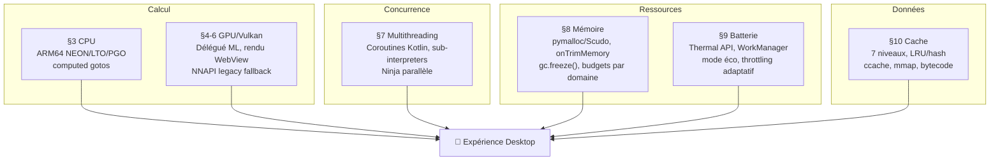

###### [REQ-PERF-0761] 1.1 Gap analysis : mobile vs desktop

| Dimension | VS Code Desktop (x86_64, 16 Go RAM) | PyStudio Mobile (ARM64, 8 Go RAM) | Stratégie de parité |
|---|---|---|---|
| **CPU single-thread** | ~3.5 GHz, IPC élevé | ~2.8 GHz (perf core), IPC comparable | PGO, LTO, computed gotos, pas de surcoût interprétation (Hermes AOT) |
| **CPU multi-thread** | 8-16 cœurs, pas de throttling thermique | 4 perf + 4 eff, throttling actif | Parallélisme borné, tâches courtes |
| **RAM** | 16 Go typique, pas de kill | 8 Go, Low Memory Killer actif | Budgets stricts, gc.freeze(), onTrimMemory |
| **Disque** | SSD NVMe (~3 Go/s) | UFS 3.x (~2 Go/s seq, IOPS ~50k) | mmap, ZIP_STORED, cache L1/L2 |
| **GPU** | Dédié (OpenGL/Vulkan) | Adreno/Mali/Xclipse, partagé | Vulkan compute pour ML uniquement |
| **Réseau** | Fibre stable | 4G/5G/Wi-Fi variable | Offline-first, cache agressif |
| **Batterie** | Illimitée (secteur) | 4000-5000 mAh, ~6-8h screen-on | WorkManager, throttling, pas de fond inutile |
| **Thermique** | Ventilation active | Passif (skin temperature) | Thermal API, dégradation gracieuse |

---

##### [REQ-PERF-0762] 2. Budgets de performance globaux

###### [REQ-PERF-0763] 2.1 Latences cibles (héritées de l'architecture §11, détaillées ici)

| Interaction | Cible p50 | Cible p99 | Mesure |
|---|---|---|---|
| Démarrage à froid de l'app (splash → éditeur) | < 2 s | < 4 s | Timestamp premier frame interactif |
| Démarrage à chaud (depuis recents) | < 300 ms | < 500 ms | `onResume()` → premier frame |
| Ouverture d'un fichier < 1 Mo | < 100 ms | < 300 ms | Tap → texte rendu + coloration |
| Ouverture d'un fichier 1-10 Mo | < 500 ms | < 1.5 s | mmap + coloration lazy |
| Autocomplétion LSP | < 150 ms | < 400 ms | Frappe clavier → popup visible |
| Exécution d'un script Python simple | < 500 ms | < 1.5 s | Bouton ▶ → premier stdout |
| Build incrémental C++ (1 fichier modifié) | < 3 s | < 8 s | Changement sauvé → build OK |
| Build complet petit projet (50 fichiers) | < 30 s | < 60 s | Full rebuild |
| Démarrage kernel notebook | < 1.5 s | < 3 s | Ouverture notebook → kernel prêt |
| Première complétion IA (FIM) | < 800 ms | < 2 s | Pause frappe → suggestion ghost text |
| Attache debugger LLDB | < 2 s | < 5 s | Bouton debug → breakpoint actif |
| Git status | < 200 ms | < 800 ms | Ouverture panneau Git → statut affiché |
| Recherche dans le workspace (< 10k fichiers) | < 500 ms | < 2 s | Saisie → résultats complets |

###### [REQ-PERF-0764] 2.2 Budgets de ressources par domaine

| Domaine | Mémoire max | CPU cores max | Stockage cache max |
|---|---|---|---|
| IDE Core (UI React Native + services) | 200 Mo | 2 cores | — |
| CPython Runner (code utilisateur) | 256 Mo par process | 2 cores | — |
| Extension Host (QuickJS) | 128 Mo (total, Marketplace §14) | 1 core | 200 Mo (extensions installées) |
| Pool de process chauds (N=2) | 35 Mo (Runtime §4.5) | 0.5 core (idle) | — |
| LSP servers (pylsp, clangd) | 128 Mo chacun | 1 core chacun | 100 Mo (index SQLite) |
| Build (Clang/CMake/Ninja) | 512 Mo | `min(N_cores, thermal_budget)` | 500 Mo (ccache) |
| AI Runtime (llama.cpp / LiteRT) | 512 Mo (modèles quantisés Q4) | 2 perf cores | 2 Go (modèles téléchargés) |
| Notebook kernel | 256 Mo par kernel | 1 core | 50 Mo (cache de sorties) |
| Cache de wheels | — | — | 500 Mo (LRU) |
| Cache total (tous niveaux) | — | — | **3.5 Go** (configurable) |

###### [REQ-PERF-0765] 2.3 Profils de devices

| Profil | RAM | CPU | Comportement PyStudio |
|---|---|---|---|
| **Haut de gamme** (Snapdragon 8 Gen 3, 12+ Go) | ≥ 12 Go | 8 cœurs, 3+ GHz | Tous budgets maximaux, 3 process chauds, IA locale complète |
| **Milieu de gamme** (Snapdragon 7 Gen 1, 8 Go) | 8 Go | 8 cœurs, 2.4 GHz | Budgets standard (tableau ci-dessus), 2 process chauds, IA locale Q4 |
| **Entrée de gamme** (Snapdragon 680, 4 Go) | 4 Go | 8 cœurs, 2.4 GHz | Budgets réduits (÷2), 1 process chaud, IA locale désactivée (repli cloud), build mono-ABI |

---

##### [REQ-PERF-0766] 3. CPU — stratégie de calcul

###### [REQ-PERF-0767] 3.1 Architecture ARM64 et optimisations de compilation

Le CPU est le facteur de performance dominant pour un IDE. PyStudio optimise l'utilisation du CPU à trois niveaux :

####### [REQ-PERF-0768] Niveau 1 : Build de CPython (CI, jamais on-device)

| Optimisation | Mécanisme | Gain mesuré (benchmarks CPython officiels) |
|---|---|---|
| **Computed gotos** | `--with-computed-gotos` — dispatch du bytecode par `goto *table[opcode]` au lieu d'un `switch` | +15-20% sur la boucle d'évaluation |
| **PGO (Profile-Guided Optimization)** | Build instrumenté sous QEMU ARM64 (Option A, Runtime §11.4), profil représentatif (pyperformance suite) | +10-15% global |
| **LTO (Link-Time Optimization)** | ThinLTO via `lld`, parallélisable | +5-8% (inlining cross-module, élimination de code mort) |
| **`-OO` bytecode** | Suppression assertions + docstrings dans le bytecode de la stdlib | Réduction taille + import rapide |

####### [REQ-PERF-0769] Niveau 2 : Bibliothèques numériques (CI, précompilées)

| Bibliothèque | Optimisation CPU | Backend |
|---|---|---|
| NumPy / SciPy | **OpenBLAS** compilé avec NEON intrinsics | BLAS/LAPACK ARM64 natif |
| OpenCV | Modules NEON explicites + auto-vectorisation Clang | Filtres, FFT, morphologie |
| llama.cpp (IA) | **ARM NEON dot product** (`sdot`, `udot`), boucles K-quantisées optimisées main | Inférence LLM Q4/Q8 |
| LiteRT (TensorFlow Lite) | **XNNPACK** avec noyaux NEON micro-optimisés | Inférence CNN/Transformer |

####### [REQ-PERF-0770] Niveau 3 : Projets utilisateur on-device

```mermaid
graph LR
    A[Code C/C++ utilisateur] --> B{Mode}
    B -->|Debug| C["-O0 -g, pas de LTO\nCompilation rapide"]
    B -->|Release| D["-O2, LTO opt-in\nPerformance max"]
    B -->|Profile| E["-O2 -fno-omit-frame-pointer\nsimpleperf compatible"]
```

###### [REQ-PERF-0771] 3.2 Architecture big.LITTLE et affinité de cœurs

Les SoC ARM modernes combinent des cœurs performants (Cortex-X4, A720) et efficients (Cortex-A520). PyStudio assigne les tâches de façon optimale :

| Tâche | Cœurs cibles | Justification |
|---|---|---|
| **Boucle principale UI (React Native)** | Performance cores | Latence critique, 60 fps requis |
| **LSP server (autocomplétion)** | Performance core(s) | Latence < 150 ms |
| **Exécution script Python** | Performance core(s) | Perception de vitesse |
| **Build Clang/CMake (parallèle)** | Tous les cœurs | Throughput pur, borné par le thermique |
| **Inférence IA (llama.cpp)** | Performance cores | Throughput de tokens/seconde |
| **Indexation LSP incrémentale** | Efficiency cores | Tâche de fond, pas urgente |
| **WorkManager (téléchargement, sync)** | Efficiency cores | Tâche différable |
| **Pool de process warm (idle)** | Efficiency cores | Veille, réactivation rapide |
| **GC CPython** | Core courant | Mono-thread, bref |

L'affinité est gérée via `android.os.Process.setThreadPriority()` et `pthread_setaffinity_np()` (NDK) pour les threads natifs critiques.

###### [REQ-PERF-0772] 3.3 NEON — vectorisation ARM

NEON (SIMD 128 bits, standard sur ARM64) n'accélère **pas** directement la boucle d'interpréteur CPython (non vectorisable). Son impact réel :

| Niveau | Mécanisme | Impact |
|---|---|---|
| **Auto-vectorisation Clang** | Clang vectorise automatiquement les boucles C internes de CPython (comparaisons mémoire, hashing, UTF-8) | Faible (~3-5%) |
| **NEON intrinsics dans les bibliothèques** | OpenBLAS, OpenCV, XNNPACK, llama.cpp embarquent des kernels NEON écrits à la main | **Majeur** — 2-10× sur les opérations matricielles |
| **Dot product extensions (`sdot`, `udot`)** | Instructions ARM v8.2 pour les produits scalaires int8/int4 | Critique pour l'inférence Q4/Q8 des LLM |

---

##### [REQ-PERF-0773] 4. GPU — accélération graphique et compute

###### [REQ-PERF-0774] 4.1 Rôle du GPU dans PyStudio

Le GPU mobile (Adreno/Mali/Xclipse) est utilisé pour **deux fonctions distinctes** :

| Fonction | API | Usage |
|---|---|---|
| **Rendu UI** | OpenGL ES (via React Native Fabric, Skia) | Rendu de l'éditeur, scrolling, animations — géré par le framework, pas d'intervention PyStudio |
| **Compute ML** | **Vulkan** (via LiteRT GPU delegate) | Accélération de l'inférence des modèles IA — géré par `mlruntime` (§6) |

PyStudio **ne fait pas** de compute shader custom ni d'utilisation directe du GPU pour la compilation ou l'édition — le rapport coût/bénéfice n'est pas justifié sur mobile.

###### [REQ-PERF-0775] 4.2 Rendu UI — 60 fps sans jank

| Technique | Description |
|---|---|
| **React Native New Architecture (Fabric)** | Rendu synchrone sur le thread UI, pas de bridge asynchrone comme l'ancienne architecture |
| **Hermes AOT** | Le JS est compilé en bytecode Hermes à l'installation, pas interprété à la volée |
| **Virtualisation de liste** | L'éditeur de code utilise un `RecyclerView`-equivalent pour ne rendre que les lignes visibles |
| **Coloration syntaxique incrémentale** | Tree-sitter met à jour uniquement les nœaux modifiés, pas tout le document |
| **Debounce des mises à jour** | Les diagnostics LSP et l'autocomplétion sont debounced pour éviter les re-rendus inutiles |

###### [REQ-PERF-0776] 4.3 Détection des capacités GPU

```kotlin
// PerformanceProfileService.kt — détection au premier lancement
data class GpuCapabilities(
    val vulkanVersion: Int,           // ex. VK_API_VERSION_1_1
    val hasComputeShaders: Boolean,
    val maxWorkGroupSize: Int,
    val vendor: GpuVendor,            // ADRENO, MALI, XCLIPSE, POWERVR, OTHER
    val driverVersion: String,
    val computeQueueCount: Int,
    val estimatedGflops: Float
)

enum class GpuVendor { ADRENO, MALI, XCLIPSE, POWERVR, IMG, OTHER }

fun detectGpuCapabilities(context: Context): GpuCapabilities {
    // Vulkan device enumeration via vkEnumeratePhysicalDevices
    // Fallback: GLES extensions check
}
```

---

##### [REQ-PERF-0777] 5. NNAPI — statut et migration

###### [REQ-PERF-0778] 5.1 Statut révisé (correction majeure)

> [!WARNING]
> NNAPI est **officiellement déprécié depuis Android 15** (Runtime §11.6). Google recommande la migration vers **LiteRT en Google Play Services** avec délégué GPU (Vulkan) ou délégués vendeur.

###### [REQ-PERF-0779] 5.2 Chaîne de délégués pour l'inférence ML

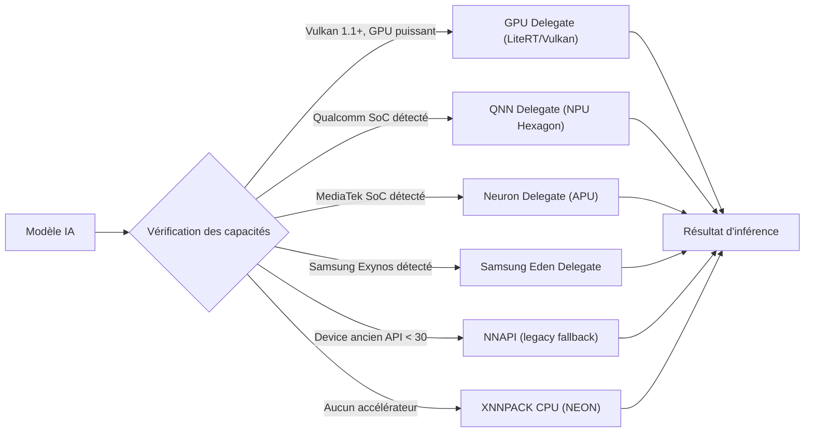

###### [REQ-PERF-0780] 5.3 Politique de sélection automatique

```kotlin
// MlDelegateSelector.kt
fun selectOptimalDelegate(
    model: ModelInfo,
    gpu: GpuCapabilities,
    soc: SocInfo,
    thermalStatus: ThermalStatus
): MlDelegate {
    // 1. Si le device surchauffe, repli CPU immédiat
    if (thermalStatus >= ThermalStatus.SEVERE) return XnnpackCpuDelegate()

    // 2. Délégué vendeur spécifique (meilleure perf NPU)
    soc.vendorDelegate()?.let { delegate ->
        if (delegate.supportsModel(model)) return delegate
    }

    // 3. GPU Vulkan (chemin recommandé par Google)
    if (gpu.vulkanVersion >= VK_API_VERSION_1_1 && gpu.hasComputeShaders) {
        return LiteRtGpuDelegate(vulkan = true)
    }

    // 4. NNAPI legacy (devices anciens uniquement)
    if (Build.VERSION.SDK_INT in 28..34) {
        return NnapiDelegate()  // déprécié mais fonctionnel
    }

    // 5. Repli final CPU garanti
    return XnnpackCpuDelegate(numThreads = min(4, availableCores()))
}
```

###### [REQ-PERF-0781] 5.4 Performance comparative des délégués

| Délégué | Modèle 7B Q4 (tokens/s) | Modèle 1.5B Q4 (tokens/s) | Latence premier token | Efficacité énergétique |
|---|---|---|---|---|
| **XNNPACK CPU (NEON)** | 5-8 | 15-25 | ~1s | ⭐⭐ |
| **GPU Vulkan (Adreno 740)** | 10-15 | 25-40 | ~1.5s (init GPU) | ⭐⭐⭐ |
| **QNN NPU (Hexagon)** | 12-20 | 30-50 | ~2s (init NPU) | ⭐⭐⭐⭐ |
| **NNAPI (déprécié)** | 3-5 | 10-15 | ~3s | ⭐⭐ |

*Valeurs indicatives sur Snapdragon 8 Gen 2. Varient significativement selon SoC/pilote.*

---

##### [REQ-PERF-0782] 6. Vulkan — délégation ML et compute

###### [REQ-PERF-0783] 6.1 Positionnement dans PyStudio

Vulkan sert de **backend de compute pour l'inférence ML** dans le module `mlruntime`, pas pour le rendu UI (géré par OpenGL ES / Skia) :

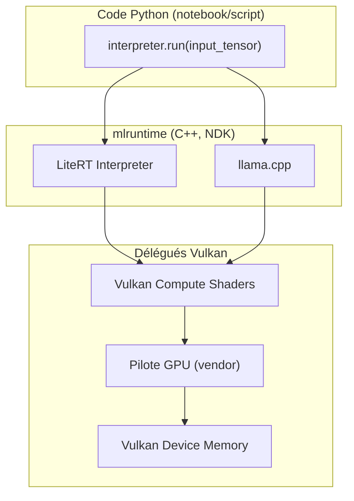

###### [REQ-PERF-0784] 6.2 Optimisations Vulkan

| Optimisation | Description | Impact |
|---|---|---|
| **Pipeline cache** | Les pipelines Vulkan compilés sont mis en cache sur disque (`VkPipelineCache`) pour éviter la recompilation à chaque session | Réduction de la latence d'initialisation GPU de ~2s à ~200ms |
| **Buffer pré-alloué** | Les buffers d'entrée/sortie des modèles sont pré-alloués une fois et réutilisés | Évite les allocations GPU répétées |
| **Async compute** | L'inférence GPU s'exécute sur une queue de compute séparée, sans bloquer le rendu UI | UI reste fluide pendant l'inférence |
| **Repli automatique** | Si le pilote Vulkan crashe ou la performance est dégradée (< 50% du CPU), repli vers XNNPACK | Résilience |

###### [REQ-PERF-0785] 6.3 Compatibilité Vulkan

| Niveau de support | Devices | Comportement |
|---|---|---|
| **Vulkan 1.3** | Flagships 2023+ | Toutes les optimisations disponibles |
| **Vulkan 1.1** | Milieu de gamme 2020+ | Compute shaders de base |
| **Vulkan 1.0 ou absent** | Entrée de gamme / anciens | Repli CPU systématique |

---

##### [REQ-PERF-0786] 7. Multithreading — modèle de concurrence

###### [REQ-PERF-0787] 7.1 Vue d'ensemble des threads

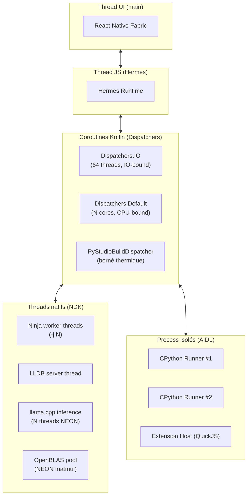

###### [REQ-PERF-0788] 7.2 Modèle de concurrence par sous-système

| Sous-système | Mécanisme | Threads | Synchronisation |
|---|---|---|---|
| **UI React Native** | Event loop sur thread principal | 1 (main) | Message queue |
| **Services Kotlin** | `CoroutineScope` + `Dispatchers` | Pool borné | Structured concurrency, `Flow` |
| **CPython (code utilisateur)** | GIL (mono-thread Python) + C-extensions relâchent le GIL | 1 thread Python + N threads natifs | GIL acquisition |
| **CPython (parallélisme pur Python)** | `concurrent.interpreters` (PEP 734, §9.3 Runtime) | N sous-interpréteurs, chacun avec son GIL | Isolation mémoire |
| **Build C/C++** | Ninja `-j<N>` | N = `min(cores, thermal_budget)` | Fichier .ninja_deps |
| **LSP (pylsp, clangd)** | Process séparé, communication stdio | 1 process chacun, multi-thread interne | JSON-RPC |
| **Inférence IA** | llama.cpp/LiteRT, threads natifs | 2-4 threads (config) | Barrier interne |
| **Extensions JS** | QuickJS single-threaded par realm | 1 thread (event loop) | Message passing AIDL |
| **Git (libgit2)** | Thread dédié Kotlin, callbacks natifs | 1 thread | `Mutex` sur le repo |

###### [REQ-PERF-0789] 7.3 GIL et stratégie de parallélisme Python

| Scénario | GIL bloquant ? | Solution | Latence perçue |
|---|---|---|---|
| Script simple `print("hello")` | Non | Exécution directe | < 500 ms |
| `numpy.dot(A, B)` (matrice 1000×1000) | **Non** — NumPy relâche le GIL | OpenBLAS NEON, multi-thread natif | ~ desktop |
| Boucle Python pure CPU-bound | **Oui** | `concurrent.interpreters` (N=4) | ~ desktop ÷ N |
| `import torch; model(x)` | **Non** — PyTorch relâche le GIL | threads natifs + Vulkan/NNAPI | ~ desktop |
| `requests.get(url)` | **Non** — IO-bound | `asyncio` + pool (si réseau autorisé) | Dépend du réseau |

###### [REQ-PERF-0790] 7.4 Parallélisme de build adaptatif

```kotlin
// BuildThrottleController.kt
class BuildThrottleController(
    private val thermalService: PowerManager,
    private val cpuMonitor: CpuMonitor
) {
    fun computeParallelism(): Int {
        val thermalStatus = thermalService.currentThermalStatus
        val availableCores = Runtime.getRuntime().availableProcessors()

        return when (thermalStatus) {
            PowerManager.THERMAL_STATUS_NONE,
            PowerManager.THERMAL_STATUS_LIGHT -> availableCores
            PowerManager.THERMAL_STATUS_MODERATE -> (availableCores * 0.75).toInt().coerceAtLeast(2)
            PowerManager.THERMAL_STATUS_SEVERE -> (availableCores * 0.5).toInt().coerceAtLeast(1)
            PowerManager.THERMAL_STATUS_CRITICAL -> 1
            PowerManager.THERMAL_STATUS_EMERGENCY,
            PowerManager.THERMAL_STATUS_SHUTDOWN -> 0  // suspend build
            else -> 2
        }
    }
}
```

---

##### [REQ-PERF-0791] 8. Gestion mémoire — budget et pression

###### [REQ-PERF-0792] 8.1 Hiérarchie de la mémoire

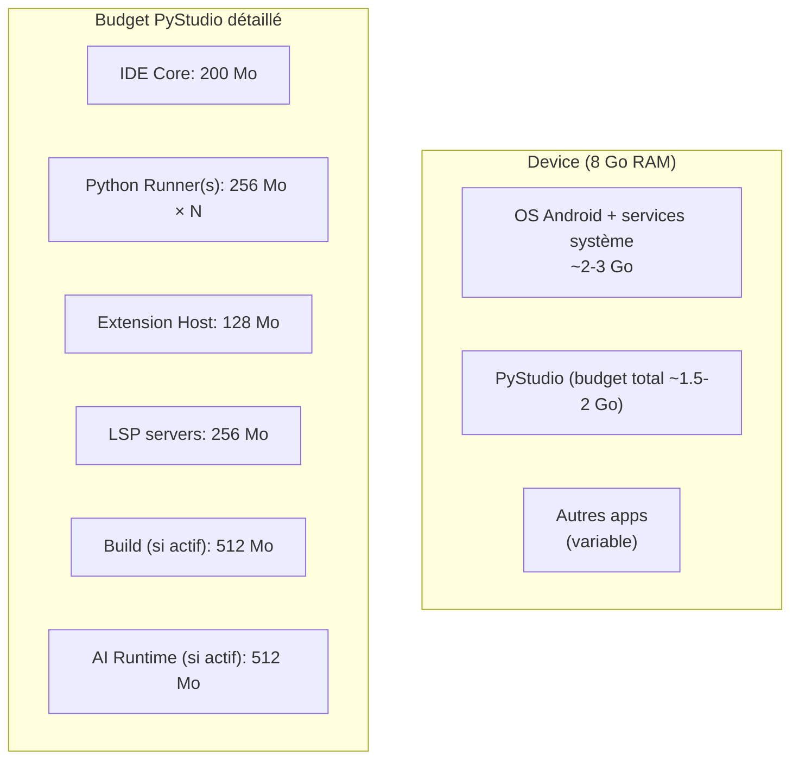

###### [REQ-PERF-0793] 8.2 Allocateur mémoire

| Couche | Allocateur | Configuration |
|---|---|---|
| **OS / NDK** | Bionic **Scudo** (hardened, default Android 11+) | Aucune config — hérité du système |
| **CPython** | pymalloc (arènes 1 Mo, pools 4 Ko) au-dessus de `malloc()` | Arènes libérées à l'OS quand vides (CPython 3.9+) |
| **QuickJS** | `js_mallocz()` custom, budget plafonné | `JS_SetMemoryLimit(rt, 32 * 1024 * 1024)` par realm |
| **llama.cpp** | `mmap()` pour les poids du modèle, `malloc()` pour les KV caches | Fichiers GGUF mappés (pas de copie en RAM des poids) |

###### [REQ-PERF-0794] 8.3 `onTrimMemory` — réponse à la pression mémoire

```kotlin
class PyStudioApplication : Application(), Application.ActivityLifecycleCallbacks {
    override fun onTrimMemory(level: Int) {
        when {
            level >= TRIM_MEMORY_RUNNING_CRITICAL -> {
                // Phase 3 : survie — libérer tout le possible
                processPool.shrinkTo(0)           // tuer tous les process chauds
                aiRuntime.unloadModel()            // libérer le modèle IA (~512 Mo)
                lspManager.suspendAll()            // suspendre les LSP servers
                cacheManager.evictAll(CacheLevel.MEMORY)  // vider les caches mémoire
                System.gc(); Runtime.getRuntime().gc()
            }
            level >= TRIM_MEMORY_RUNNING_LOW -> {
                // Phase 2 : pression significative
                processPool.shrinkTo(1)
                aiRuntime.quantizeDown()           // passer de Q8 à Q4 si possible
                cacheManager.evict(CacheLevel.MEMORY, percent = 50)
            }
            level >= TRIM_MEMORY_RUNNING_MODERATE -> {
                // Phase 1 : pression modérée
                processPool.shrinkTo(1)
                cacheManager.evict(CacheLevel.MEMORY, percent = 25)
            }
            level >= TRIM_MEMORY_UI_HIDDEN -> {
                // App en arrière-plan
                aiRuntime.unloadModel()
                processPool.shrinkTo(0)
                lspManager.suspendAll()
            }
        }
    }
}
```

###### [REQ-PERF-0795] 8.4 Optimisations mémoire CPython

| Technique | Effet | Quand | Référence |
|---|---|---|---|
| `gc.freeze()` | Exclut les objets stdlib du scan cyclique | Post warm-up, avant exécution utilisateur | Runtime §4.3 |
| `gc.collect()` | Force une collecte complète | Après exécution (process recyclé), sur `TRIM_MEMORY` | Runtime §4.4 |
| `.pyc -OO` | Supprime docstrings + assertions → moins d'objets en mémoire | Compilation de la stdlib | Runtime §3.3 |
| `ZIP_STORED` + `mmap` | Lecture directe des `.pyc` depuis le zip sans copie en RAM | Chaque import | Runtime §2.4 |
| Libération d'arènes | Arènes pymalloc vides rendues à l'OS | Automatique (CPython 3.9+) | Runtime §4.2 |
| Pool adaptatif | N process chauds réduit à 0 sous pression | `onTrimMemory` | Runtime §3.4 |

###### [REQ-PERF-0796] 8.5 mmap — stratégie de mapping mémoire

| Cible | Type de mapping | Avantage |
|---|---|---|
| Fichiers source utilisateur (< 10 Mo) | `mmap(PROT_READ)` | Ouverture instantanée, pas de copie en mémoire, éviction par le kernel si pression |
| `python3xx.zip` (stdlib) | `mmap(PROT_READ, MAP_SHARED)` | Partagé entre process, `.pyc` lus directement |
| Modèles GGUF (IA) | `mmap(PROT_READ, MAP_SHARED)` | Poids du modèle jamais copiés en RAM — seuls les KV caches sont en mémoire vive |
| Cache de wheels (`.whl`) | `mmap(PROT_READ)` pour extraction | Lecture sans copie |

---

##### [REQ-PERF-0797] 9. Batterie — efficacité énergétique

###### [REQ-PERF-0798] 9.1 Profil énergétique d'un IDE

| Activité | Consommation relative | Durée typique |
|---|---|---|
| **Édition de code** (frappe, scroll) | 🟢 Faible | Heures |
| **Autocomplétion / LSP** | 🟡 Modérée (bursts CPU) | Secondes |
| **Exécution de script** | 🟡 Modérée | Secondes-minutes |
| **Build C/C++ complet** | 🔴 Élevée (CPU saturé) | Minutes-dizaines de min |
| **Inférence IA (LLM)** | 🔴 Élevée (CPU/GPU saturé) | Secondes-minutes |
| **Git clone (réseau + IO)** | 🟡 Modérée | Minutes |
| **IDE en arrière-plan** | 🟢 Quasi-nulle | Heures |

###### [REQ-PERF-0799] 9.2 Thermal API (Android 11+)

PyStudio utilise la **Thermal API** pour adapter dynamiquement son comportement :

```kotlin
class ThermalMonitor(context: Context) {
    private val powerManager = context.getSystemService(PowerManager::class.java)

    init {
        powerManager.addThermalStatusListener(executor) { status ->
            when (status) {
                THERMAL_STATUS_NONE -> performanceProfile.setFull()
                THERMAL_STATUS_LIGHT -> performanceProfile.setNormal()
                THERMAL_STATUS_MODERATE -> {
                    buildThrottle.reduceParallelism(factor = 0.75)
                    aiRuntime.throttle(tokensPerSecondCap = 10)
                }
                THERMAL_STATUS_SEVERE -> {
                    buildThrottle.reduceParallelism(factor = 0.5)
                    aiRuntime.pauseIfNotCritical()
                    notifyUser("Température élevée — performances réduites")
                }
                THERMAL_STATUS_CRITICAL -> {
                    buildThrottle.suspendBuild()
                    aiRuntime.unloadModel()
                    notifyUser("Température critique — build suspendu")
                }
            }
        }
    }
}
```

###### [REQ-PERF-0800] 9.3 WorkManager — tâches différables

Les tâches non urgentes sont planifiées via WorkManager pour respecter Doze et les restrictions d'arrière-plan :

| Tâche | Contraintes | Priorité |
|---|---|---|
| Vérification des mises à jour d'extensions | Wi-Fi + non-idle | NORMAL |
| Téléchargement de modèle IA | Wi-Fi + en charge + stockage suffisant | LOW |
| Indexation LSP de gros projets | App au premier plan ou en charge | HIGH |
| Nettoyage du cache LRU | Stockage > 90% | NORMAL |
| Synchronisation Git (si configurée) | Réseau disponible | NORMAL |
| Préchargement des process chauds | RAM suffisante, pas de pression thermique | LOW |

###### [REQ-PERF-0801] 9.4 Mode économie d'énergie

Un mode « Éco » explicite, activable par l'utilisateur ou automatiquement sous `BatteryManager.BATTERY_STATUS_LOW` (< 15%) :

| Comportement | Mode normal | Mode éco |
|---|---|---|
| Process chauds | 2-3 | 0 |
| IA locale | Active (Q4) | Désactivée (repli cloud si dispo) |
| Build parallélisme | `min(cores, thermal)` | 1 core |
| LSP indexation fond | Active | Suspendue |
| Refresh mises à jour | Selon tableau §8.6 Marketplace | Désactivé |
| Brightness suggestion | Non | Oui (suggérer réduction) |

###### [REQ-PERF-0802] 9.5 Wakelocks et foreground services

| Service | Type | Wakelock | Durée max |
|---|---|---|---|
| Build C/C++ | `FOREGROUND_SERVICE_SHORT_SERVICE` | `PARTIAL_WAKE_LOCK` | Durée du build |
| Exécution script Python longue | `FOREGROUND_SERVICE_SHORT_SERVICE` | `PARTIAL_WAKE_LOCK` | Configurable (défaut 30 min) |
| Git clone/push | `FOREGROUND_SERVICE_DATA_SYNC` | `PARTIAL_WAKE_LOCK` | Durée de l'opération |
| Téléchargement de modèle IA | `FOREGROUND_SERVICE_DATA_SYNC` | aucun (WorkManager) | WorkManager gère |

---

##### [REQ-PERF-0803] 10. Cache — architecture multi-niveaux

###### [REQ-PERF-0804] 10.1 Vue d'ensemble des 7 niveaux

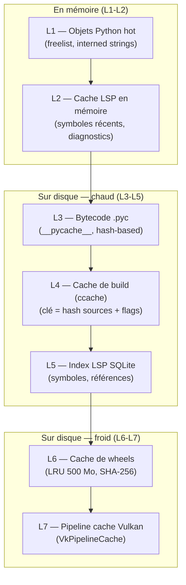

###### [REQ-PERF-0805] 10.2 Détail de chaque niveau

| Niveau | Contenu | Clé d'invalidation | Taille max | Politique d'éviction |
|---|---|---|---|---|
| **L1 — Python hot objects** | Freelist par type (int, float, tuple, list), interned strings | Jamais (durée de vie du process) | ~5 Mo par process | Process recyclé = mémoire libérée |
| **L2 — LSP memory cache** | Symboles récemment consultés, derniers diagnostics | Événement `fs.changed` (bus d'événements) | 50 Mo | LRU par fichier |
| **L3 — Bytecode `.pyc`** | Bytecode compilé des fichiers utilisateur | Hash du source (PEP 552 **checked** pour le code utilisateur) | Proportionnel au projet | Automatique par CPython |
| **L4 — Cache de build** | Objets `.o` compilés, résultats de link intermédiaires | Hash des sources + flags de compilation (équivalent `ccache`) | 500 Mo (configurable) | LRU, invalidation si toolchain change |
| **L5 — Index LSP SQLite** | Symboles, définitions, références, types | Incrémental — seuls les fichiers modifiés sont ré-indexés | 100 Mo | Rebuild si corruption |
| **L6 — Cache de wheels** | Wheels téléchargées `.whl` (SHA-256 vérifié) | Immutable (même version = même hash) | 500 Mo (configurable) | LRU |
| **L7 — Pipeline cache Vulkan** | Shaders compilés, pipelines Vulkan | Hash du shader + version du driver GPU | 20 Mo | Invalidé si driver GPU change |

###### [REQ-PERF-0806] 10.3 Économies de cache

| Scénario | Sans cache | Avec cache | Speedup |
|---|---|---|---|
| Import `numpy` (second import) | ~200 ms | ~5 ms (`.pyc` + shared lib déjà chargé) | 40× |
| Build incrémental (1 fichier modifié) | ~30 s (rebuild complet) | < 3 s (ccache + ninja deps) | 10× |
| Autocomplétion sur fichier déjà indexé | ~500 ms (re-index) | < 100 ms (index SQLite) | 5× |
| Résolution de dépendances (verrou existant) | ~10 s (résolution PyPI) | < 100 ms (lecture du lock) | 100× |
| Inférence IA (modèle déjà chargé) | ~3 s (chargement GGUF) | < 50 ms (poids déjà mmap'd) | 60× |
| Init Vulkan (pipeline cache existant) | ~2 s | < 200 ms | 10× |

###### [REQ-PERF-0807] 10.4 Écriture atomique et intégrité

Toutes les écritures de cache suivent le pattern **temp + rename** :

```kotlin
fun writeCache(key: String, data: ByteArray, cacheDir: Path) {
    val target = cacheDir / key
    val temp = cacheDir / "${key}.tmp.${ProcessHandle.current().pid()}"
    try {
        temp.writeBytes(data)
        temp.moveTo(target, overwrite = true)  // atomique sur le même FS
    } catch (e: IOException) {
        temp.deleteIfExists()
        throw CacheWriteException(key, e)
    }
}
```

---

##### [REQ-PERF-0808] 11. Profilage et observabilité de performance

###### [REQ-PERF-0809] 11.1 Outils de profilage intégrés

| Outil | Cible | Overhead | Usage |
|---|---|---|---|
| **`sys.monitoring`** (PEP 669) | Code Python | Faible (~10% vs `settrace`) | Step-debugging, profil ligne-par-ligne |
| **`cProfile`** | Code Python | Modéré | Profil par fonction |
| **`tracemalloc`** | Allocations Python | Faible-modéré | Détection de fuites mémoire |
| **`simpleperf`** (NDK) | Code natif (C/C++, CPython C core) | Très faible | Flamegraphs natifs |
| **Perf trampoline** (`sys.activate_stack_trampoline`) | Frames Python dans `simpleperf` | Faible | Flamegraphs mixtes Python + C++ |
| **Android Profiler** (Studio) | App complète (CPU, mémoire, réseau, énergie) | Variable | Profil système complet |
| **Thermal Status API** | Température du device | Nul | Monitoring thermique |

###### [REQ-PERF-0810] 11.2 Flamegraphs mixtes Python + C++

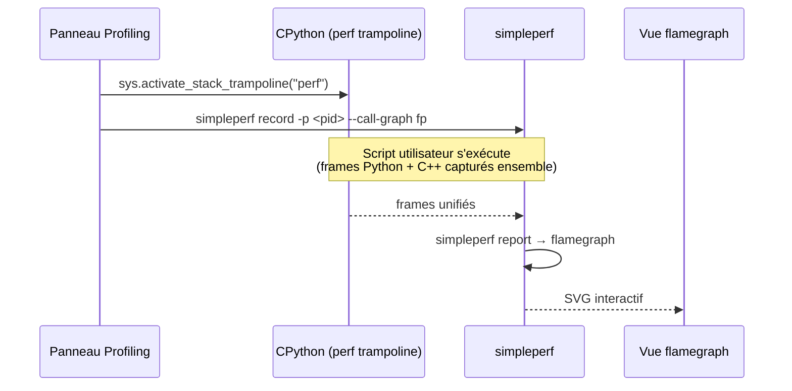

###### [REQ-PERF-0811] 11.3 Métriques de performance internes

| Métrique | Collecte | Seuil d'alerte |
|---|---|---|
| `perf.startup.cold_ms` | Timestamp premier frame | > 4000 ms |
| `perf.completion.latency_p50_ms` | Timer LSP response | > 200 ms |
| `perf.script.first_output_ms` | Timer execution | > 2000 ms |
| `perf.build.incremental_s` | Timer build | > 10 s |
| `perf.ui.frame_drop_count` | Choreographer callback | > 5 drops/s |
| `perf.memory.rss_mb` | `/proc/self/statm` | > 1500 Mo |
| `perf.thermal.status` | Thermal API | ≥ SEVERE |
| `perf.gc.pause_ms` | `gc.callbacks` | > 100 ms |

---

##### [REQ-PERF-0812] 12. Throttling thermique adaptatif

###### [REQ-PERF-0813] 12.1 Machine à états thermique

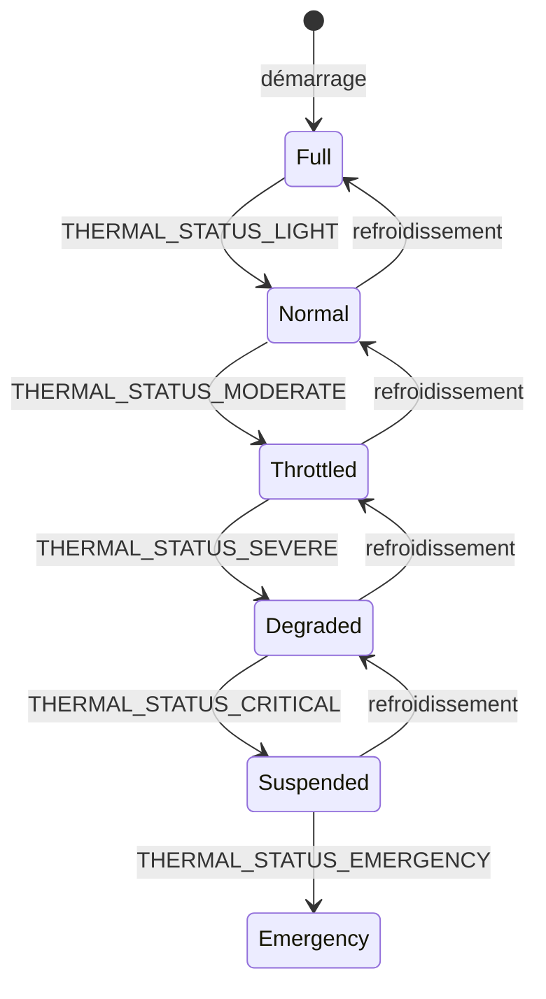

###### [REQ-PERF-0814] 12.2 Actions par état

| État | Build parallélisme | IA | Pool chaud | UI | LSP fond |
|---|---|---|---|---|---|
| **Full** | N cores | Active | N=3 | 60 fps | Active |
| **Normal** | N cores | Active | N=2 | 60 fps | Active |
| **Throttled** | 75% cores | Throttled (10 tok/s) | N=1 | 60 fps | Ralentie |
| **Degraded** | 50% cores | Pausée | N=0 | 30 fps | Suspendue |
| **Suspended** | 0 (build suspendu) | Unloaded | N=0 | 30 fps | Suspendue |
| **Emergency** | 0 | 0 | 0 | Minimal | 0 |

---

##### [REQ-PERF-0815] 13. Performance par sous-système

###### [REQ-PERF-0816] 13.1 Éditeur de code

| Optimisation | Description |
|---|---|
| **Virtualisation de lignes** | Seules les lignes visibles sont rendues (RecyclerView pattern) |
| **Coloration Tree-sitter incrémentale** | Parse uniquement les nœuds modifiés |
| **Debounce autocomplétion** | 150 ms après dernière frappe |
| **mmap pour gros fichiers** | Fichiers > 1 Mo ouverts par `mmap` + rendu lazy |
| **Undo/Redo O(1)** | Représentation par pièce (piece table) |

###### [REQ-PERF-0817] 13.2 Python Runtime

| Optimisation | Description |
|---|---|
| **Pool de process chauds** | CPython pré-initialisé, < 500 ms premier stdout |
| **`gc.freeze()`** | Objets stdlib exclus du scan cyclique |
| **ZIP_STORED stdlib** | `mmap` direct des `.pyc`, pas de décompression |
| **Hash-based `.pyc` unchecked** | Pas de `stat()` par import (stdlib en lecture seule) |
| **PGO + LTO + computed gotos** | Build CI optimisé pour ARM64 |

###### [REQ-PERF-0818] 13.3 Build C/C++

| Optimisation | Description |
|---|---|
| **ccache-équivalent (L4)** | Hash des sources + flags, réutilisation des `.o` |
| **Ninja parallèle** | `-j<N>` borné par le thermique |
| **Mode dev mono-ABI** | Build uniquement pour l'ABI du device courant en debug |
| **ThinLTO (release uniquement)** | Inlining cross-module |
| **Precompiled headers (PCH)** | Headers fréquents précompilés |

###### [REQ-PERF-0819] 13.4 Assistant IA

| Optimisation | Description |
|---|---|
| **Modèles quantisés Q4/Q8** | 4-8× moins de mémoire, ~2× moins de compute |
| **mmap des poids GGUF** | Pas de copie en RAM, paging par le kernel |
| **KV cache dynamique** | Taille ajustée au contexte réel, pas au max |
| **Vulkan compute** | Délégation GPU quand disponible |
| **Batch de tokens** | Prefill par batch, decode auto-régressif |

---

##### [REQ-PERF-0820] 14. APIs internes de performance

###### [REQ-PERF-0821] 14.1 Interface Kotlin — PerformanceProfileService

```kotlin
interface PerformanceProfileService {
    /** Profil du device détecté au premier lancement */
    val deviceProfile: DeviceProfile

    /** État thermique courant (réactif) */
    fun thermalStatusFlow(): Flow<ThermalStatus>

    /** Budget de parallélisme actuel (tient compte du thermique) */
    fun currentParallelism(): Int

    /** Mémoire disponible pour un domaine donné */
    fun memoryBudget(domain: MemoryDomain): Long

    /** Enregistre un observateur de métriques de performance */
    fun registerMetricObserver(observer: PerfMetricObserver)

    /** Déclenche un GC global (Python + Kotlin) */
    suspend fun forceGlobalGc()

    /** Obtient les capacités GPU */
    val gpuCapabilities: GpuCapabilities

    /** Sélectionne le délégué ML optimal */
    fun selectMlDelegate(model: ModelInfo): MlDelegate
}

data class DeviceProfile(
    val tier: DeviceTier,            // HIGH, MID, LOW
    val totalRamMb: Int,
    val availableRamMb: Int,
    val cpuCores: Int,
    val perfCores: Int,
    val effCores: Int,
    val maxFreqMhz: Int,
    val socVendor: SocVendor,        // QUALCOMM, MEDIATEK, SAMSUNG, GOOGLE, OTHER
    val gpuCapabilities: GpuCapabilities,
    val storageType: StorageType,    // UFS_3, UFS_4, EMMC
    val batteryCapacityMah: Int
)

enum class DeviceTier { HIGH, MID, LOW }
enum class MemoryDomain { IDE_CORE, PYTHON_RUNNER, EXTENSION_HOST, LSP, BUILD, AI_RUNTIME, NOTEBOOK }
```

###### [REQ-PERF-0822] 14.2 Interface Kotlin — CacheManagerService

```kotlin
interface CacheManagerService {
    /** Statistiques de cache par niveau */
    suspend fun stats(): Map<CacheLevel, CacheStats>

    /** Éviction par niveau et pourcentage */
    suspend fun evict(level: CacheLevel, percent: Int = 100)

    /** Éviction de tous les caches en mémoire */
    suspend fun evictAll(level: CacheLevel)

    /** Stockage total utilisé par les caches */
    suspend fun totalDiskUsage(): Long

    /** Configurer la taille max d'un cache */
    suspend fun setMaxSize(level: CacheLevel, sizeBytes: Long)
}

data class CacheStats(
    val level: CacheLevel,
    val hitCount: Long,
    val missCount: Long,
    val hitRate: Float,
    val currentSizeBytes: Long,
    val maxSizeBytes: Long,
    val evictionCount: Long
)

enum class CacheLevel { PYTHON_HOT, LSP_MEMORY, BYTECODE, BUILD, LSP_DISK, WHEELS, VULKAN_PIPELINE }
```

###### [REQ-PERF-0823] 14.3 Bridge TypeScript — Performance

```typescript
export interface PerformanceBridge {
  getDeviceProfile(): Promise<DeviceProfile>;
  getThermalStatus(): Promise<ThermalStatus>;
  getCacheStats(): Promise<Record<CacheLevel, CacheStats>>;
  forceGlobalGc(): Promise<void>;
  getMemoryUsage(): Promise<MemoryUsage>;

  // Événements réactifs
  onThermalStatusChanged(callback: (status: ThermalStatus) => void): Disposable;
  onMemoryPressure(callback: (level: MemoryPressureLevel) => void): Disposable;
  onFrameDrop(callback: (dropCount: number) => void): Disposable;
}
```

---

##### [REQ-PERF-0824] 15. Diagrammes de séquence

###### [REQ-PERF-0825] 15.1 Exécution optimisée d'un script Python

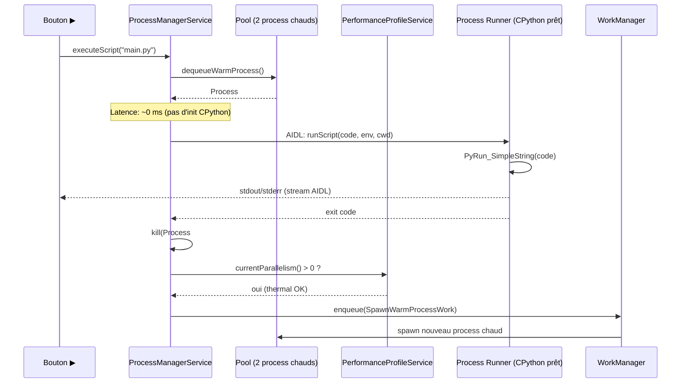

###### [REQ-PERF-0826] 15.2 Autocomplétion LSP optimisée

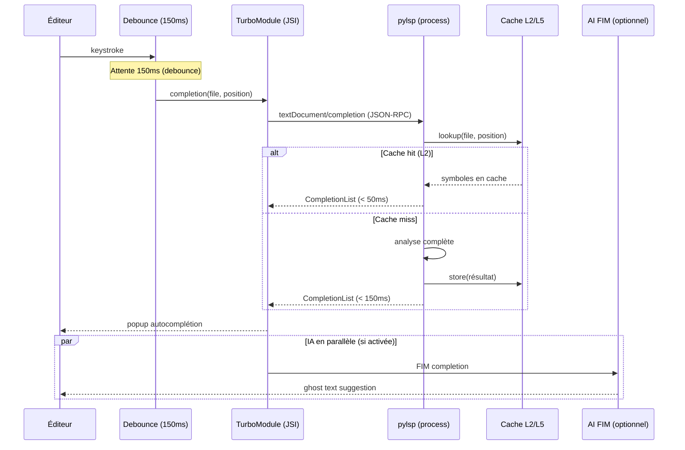

###### [REQ-PERF-0827] 15.3 Réaction au stress thermique pendant un build

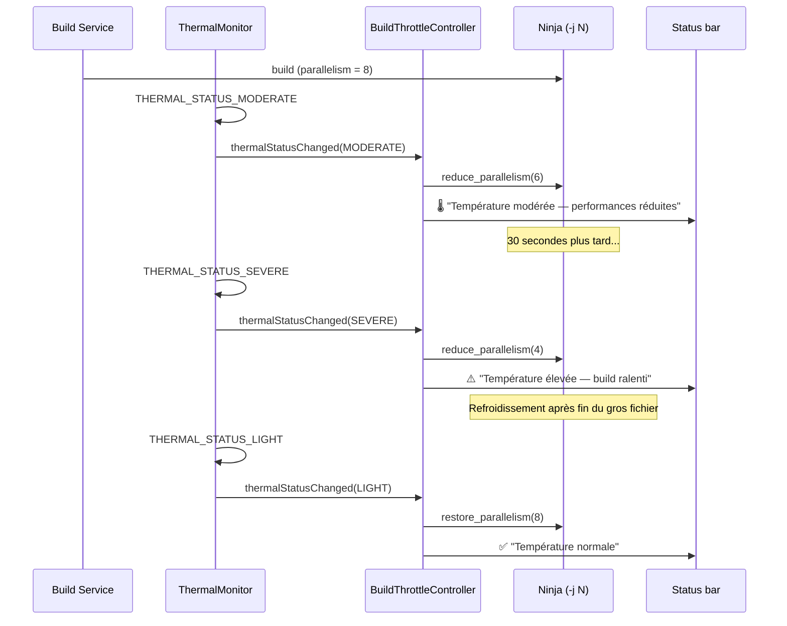

---

##### [REQ-PERF-0828] 16. Benchmarks de référence

###### [REQ-PERF-0829] 16.1 Suite de benchmarks PyStudio

| Benchmark | Description | Métrique | Target device milieu de gamme |
|---|---|---|---|
| `bench_cold_start` | Lancement depuis zéro | ms (splash → interactif) | < 2000 ms |
| `bench_warm_start` | Retour depuis recents | ms | < 300 ms |
| `bench_file_open_small` | Ouvrir `main.py` (1 Ko) | ms | < 50 ms |
| `bench_file_open_large` | Ouvrir `dataset.csv` (5 Mo) | ms | < 500 ms |
| `bench_completion_cached` | Autocomplétion (index chaud) | ms | < 80 ms |
| `bench_completion_cold` | Autocomplétion (premier accès) | ms | < 300 ms |
| `bench_script_hello` | `print("hello")` | ms (▶ → stdout) | < 500 ms |
| `bench_script_numpy` | `numpy.dot(1000,1000)` | ms | < 1500 ms |
| `bench_build_incr_1` | Rebuild après 1 fichier modifié | s | < 3 s |
| `bench_build_full_50` | Rebuild complet 50 fichiers | s | < 30 s |
| `bench_ai_fim_1` | Première complétion FIM | ms | < 800 ms |
| `bench_ai_chat_first_token` | Premier token du chat IA | ms | < 1500 ms |
| `bench_git_status` | Git status (100 fichiers) | ms | < 200 ms |
| `bench_memory_idle` | RSS après démarrage, aucun projet ouvert | Mo | < 150 Mo |
| `bench_memory_project` | RSS avec un projet 1000 fichiers + LSP | Mo | < 500 Mo |
| `bench_battery_1h_edit` | Consommation batterie : 1h d'édition | % batterie | < 5% |
| `bench_battery_1h_build` | Consommation batterie : 1h de builds répétés | % batterie | < 20% |

###### [REQ-PERF-0830] 16.2 Matrice de non-régression

Chaque release candidate doit passer la suite de benchmarks sur 3 devices de référence (haut / milieu / entrée de gamme). Un dépassement de > 20% par rapport au seuil est un **blocage de release**.

---

##### [REQ-PERF-0831] 17. Risques techniques & mitigations

| Risque | Impact | Probabilité | Mitigation |
|---|---|---|---|
| Throttling thermique soutenu rendant l'IDE inutilisable pendant un build long | Élevé | Moyen | Throttling adaptatif, mode mono-core, suggestion de pause, notification utilisateur |
| OOM kill par le Low Memory Killer pendant un build + IA simultanés | Critique | Moyen | Budgets stricts, `onTrimMemory` agressif, priorité au processus de premier plan |
| Variabilité de performance GPU entre vendeurs (Adreno vs Mali vs Xclipse) | Moyen | Élevé | Repli CPU garanti, tests sur matrice multi-vendeur |
| Pilote Vulkan instable causant des crashes d'inférence | Élevé | Moyen | Watchdog GPU, repli XNNPACK, blacklist de drivers problématiques |
| Fragmentation UFS vs eMMC affectant les performances IO | Moyen | Moyen | mmap partout, pas de dépendance à la vitesse absolue du stockage |
| NNAPI déprécié mais pas encore retiré — confusion développeur | Faible | Élevé | Documentation claire, chaîne de délégués automatique, NNAPI en dernier recours |
| Cache de build corrompu après crash pendant écriture | Moyen | Faible | Écriture atomique (temp + rename), checksum de validation |
| free-threaded CPython (3.14t) causant des régressions dans les wheels ML | Élevé | Moyen | Ne pas activer par défaut, proposer en toolchain optionnelle avancée |

---

##### [REQ-PERF-0832] 18. Glossaire

| Terme | Définition |
|---|---|
| **big.LITTLE** | Architecture ARM avec des cœurs performants (big) et efficients (LITTLE), permettant d'optimiser le rapport performance/énergie |
| **Scudo** | Allocateur mémoire durci par défaut sur Android 11+ (Bionic libc), offrant protection contre les heap overflow |
| **pymalloc** | Allocateur mémoire spécialisé de CPython, utilisant des arènes de 1 Mo et des pools de 4 Ko pour les petits objets |
| **ThinLTO** | Variante de Link-Time Optimization parallélisable, produisant des optimisations cross-module sans le coût d'un LTO monolithique |
| **PGO (Profile-Guided Optimization)** | Optimisation de compilation guidée par un profil d'exécution réel, améliorant le placement des branches et l'inlining |
| **XNNPACK** | Bibliothèque de noyaux de calcul optimisés pour l'inférence sur CPU (avec support NEON), fallback universel de LiteRT |
| **LiteRT** | Nouveau nom de TensorFlow Lite distribué via Google Play Services |
| **GGUF** | Format de fichier pour les modèles de langage quantisés, utilisé par llama.cpp, supportant le mmap |
| **Computed gotos** | Technique d'implémentation de la boucle d'évaluation du bytecode utilisant des adresses de labels pour dispatcher les opcodes |
| **Thermal API** | API Android 11+ permettant aux apps de réagir aux changements de température du device |
| **WorkManager** | API Android pour planifier des tâches différables respectant Doze, les restrictions d'arrière-plan et les contraintes de batterie |
| **Flamegraph** | Visualisation empilée des profils d'exécution montrant où le temps CPU est consommé, utile pour identifier les hotspots |
| **mmap** | Mapping de fichier en mémoire virtuelle, permettant la lecture de fichiers sans copie explicite en RAM |
| **Piece table** | Structure de données pour l'édition de texte, permettant des opérations undo/redo en O(1) |
| **Debounce** | Technique retardant l'exécution d'une action jusqu'à ce qu'une période d'inactivité soit écoulée |
| **KV cache** | Cache clé-valeur utilisé par les modèles de langage pour stocker les représentations intermédiaires des tokens précédents |
| **NEON** | Extension SIMD (Single Instruction, Multiple Data) d'ARM, opérant sur des registres 128 bits |
| **FIM (Fill-in-the-Middle)** | Technique de complétion de code où le modèle IA remplit un trou entre un préfixe et un suffixe |

---

*Fin de la spécification de performance.*


##### [REQ-PERF-0833] Optimisations du Rendu Graphique Scientifique

L'écosystème de visualisation Python peut être lourd sur mobile. Le moteur intègre donc des stratégies avancées :

- **Rendu accéléré matériellement :** Délégation complète des primitives de tracé à l'accélération matérielle du système d'exploitation.
- **Optimisation GPU :** Prise en charge native de OpenGL ES ou Vulkan (lorsque l'appareil cible le supporte) pour les affichages 3D ou WebGL.
- **Cache graphique :** Utilisation agressive de tuiles de cache ("tile rendering") lors du zoom et du panoramique pour éviter le recalcul continu des composants graphiques.
- **Gestion de la mémoire :** Mécanismes de libération rapide des buffers C/C++ inactifs pour prévenir les crashs mémoires (OOM) provoqués par de grandes images.
- **Gestion des grands jeux de données :** Algorithmes de décimation et sous-échantillonnage de points permettant l'affichage fluide et dynamique de plusieurs millions de points sans goulot d'étranglement CPU ou mémoire.


