### 3.5 Exigences de Sécurité
#### [REQ-SEC-0834] PyStudio Mobile — Spécification de Sécurité

**Type de document :** Spécification technique — Architecture de sécurité
**Auteur :** Security Architect
**Version :** 1.0
**Date :** 12 juillet 2026
**Portée :** Sandbox Python, isolation des extensions, signature des packages, permissions Android, gestion des secrets, sécurité réseau, protection du code utilisateur
**Dépend de :**
- `PyStudio_Mobile_Architecture_Specification.md` (§0 Principes, §5 Runtime, §10 Sécurité, §12 Marketplace)
- `PyStudio_Mobile_Python_Runtime_Specification.md` (§5 Système d'import, ADR-1 `isolatedProcess`, §3 Pool de process)
- `PyStudio_Mobile_Marketplace_Extensions_Specification.md` (§5 Permissions, §6 Sandbox QuickJS, §15 Sécurité transverse)
- `PyStudio_Mobile_Package_Registry_Specification.md` (§5 Auth, §6 Signature & Trust Chain, §12 Sécurité transverse)
- `PyStudio_Mobile_Android_Package_Builder_Specification.md` (§8 Signature, §15 Sécurité)
- `PyStudio_Mobile_AI_Assistant_System_Specification.md` (§15 Sécurité & confidentialité)
- `PyStudio_Mobile_Git_Integration_Specification.md` (§11 Authentification & sécurité)
- `PyStudio_Mobile_Notebook_System_Specification.md` (§5.3 Sandboxing du rendu, §6 Kernel)

---

##### [REQ-SEC-0835] Table des matières

0. Principes directeurs de sécurité
1. Résumé exécutif
2. Modèle de menaces
3. Sandbox Python
4. Isolation des extensions
5. Signature des packages
6. Permissions Android
7. Gestion des secrets
8. Sécurité réseau
9. Protection du code utilisateur
10. Sécurité du notebook
11. Sécurité de l'assistant IA
12. Audit & observabilité
13. Réponse aux incidents
14. Conformité & supply chain
15. APIs internes de sécurité
16. Diagrammes de séquence
17. Matrice de contrôle
18. Risques techniques & mitigations
19. Glossaire

---

##### [REQ-SEC-0836] 0. Principes directeurs de sécurité

| Principe | Description | Implication technique |
|---|---|---|
| **Défense en profondeur** | Chaque actif est protégé par plusieurs couches de sécurité indépendantes ; la compromission d'une couche ne suffit jamais à atteindre l'actif | Process isolé (couche OS) + sandbox applicative (QuickJS/CPython) + permissions granulaires (couche service) + signature (couche données) |
| **Moindre privilège** | Tout composant, extension ou code utilisateur ne reçoit que les permissions strictement nécessaires à sa fonction | Refus par défaut de tout accès non déclaré ; pas de capacité « admin » pour les extensions ; process utilisateur sans permissions Android système |
| **Zéro confiance par défaut** | Aucun artefact (package, extension, modèle IA) n'est considéré fiable avant vérification cryptographique | Double signature obligatoire (développeur + registre), scan statique pré-publication, quarantaine à l'installation |
| **Séparation des domaines de confiance** | L'IDE (code de confiance), le code utilisateur (semi-confiance), les extensions tierces (confiance conditionnelle) et les données distantes (non fiables) sont dans des domaines de sécurité distincts | Process séparés, IPC contrôlé, jamais de mémoire partagée entre domaines |
| **Isolation non contournable** | L'isolation par `isolatedProcess` Android ne peut être désactivée par l'utilisateur final ni par une extension | Attribut système Android, pas de flag « dev mode » qui supprimerait l'isolation |
| **Transparence des actions** | Toute action sensible (accès réseau, écriture FS, exécution de processus) est traçable et auditable | Journal d'audit local immuable (append-only), masquage des secrets dans les logs |
| **Résilience au crash** | Un crash de code utilisateur, d'extension ou de package tiers ne doit jamais corrompre l'état de l'IDE | Exécution dans des process distincts, rollback transactionnel, écriture atomique |
| **Offline-first security** | Les mécanismes de sécurité fonctionnent sans réseau ; la vérification de signature, l'isolation et les permissions ne dépendent jamais d'un service distant | Clés publiques embarquées dans l'app, cache de CRL, pas de licence en ligne |
| **Données utilisateur sacrées** | Le code source de l'utilisateur ne quitte jamais l'appareil sauf action volontaire et explicite (Git push, export, repli cloud IA activé manuellement) | Pas de telemetrie de code, pas de sync automatique, index sémantique strictement local |

---

##### [REQ-SEC-0837] 1. Résumé exécutif

Cette spécification définit l'architecture de sécurité complète de PyStudio Mobile. Elle consolide, approfondit et étend les mesures de sécurité décrites dans les onze spécifications existantes du projet en un document unique faisant autorité.

Le modèle de sécurité repose sur **quatre domaines de confiance** avec des frontières d'isolation strictes :

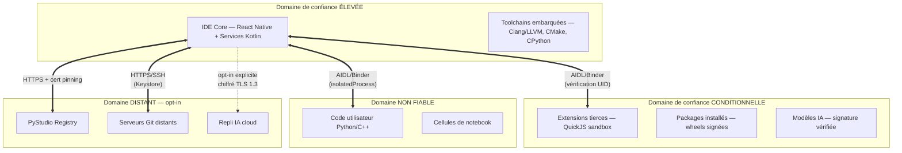

Les **sept piliers** de cette architecture sont :

1. **Sandbox Python** (§3) : CPython s'exécute dans un process Android `isolatedProcess` sans accès réseau, FS limité, pas de permissions système. Pool de process pré-chauffés pour la latence.

2. **Isolation des extensions** (§4) : Les extensions JS s'exécutent dans un moteur QuickJS sandboxé au sein d'un second process `isolatedProcess`. Chaque extension dans un realm isolé. Toute API traverse un `PermissionManagerService`.

3. **Signature des packages** (§5) : Chaîne de confiance à double signature (développeur Ed25519 + registre), vérification obligatoire avant toute installation, approche Sigstore avec transparency log.

4. **Permissions Android** (§6) : Modèle de permissions minimal pour l'app PyStudio (12 permissions runtime), modèle de permissions granulaire pour les extensions (22 permissions), aucune permission système pour le code utilisateur.

5. **Gestion des secrets** (§7) : Android Keystore comme unique backend, `EncryptedSharedPreferences` pour les données sensibles non-clés, jamais de secret en clair dans les logs ou le stockage.

6. **Sécurité réseau** (§8) : Pas d'accès réseau par défaut pour le code utilisateur ni les extensions (opt-in). TLS 1.3 minimum, certificate pinning pour les services PyStudio, pas de port TCP/loopback exposé.

7. **Protection du code utilisateur** (§9) : Le code source ne quitte jamais l'appareil sauf action explicite. Chiffrement au repos, isolation par projet, pas de telemetrie de contenu.

---

##### [REQ-SEC-0838] 2. Modèle de menaces

###### [REQ-SEC-0839] 2.1 Acteurs menaçants

| Acteur | Motivation | Capacité | Cible principale |
|---|---|---|---|
| **Attaquant supply chain** | Distribution de malware via packages/extensions populaires | Publication de packages légitimes en apparence, typosquatting | Code source utilisateur, secrets, credentials Git |
| **Extension malveillante** | Exfiltration de données, minage crypto | Code JS exécuté dans la sandbox avec permissions obtenues | Système de fichiers, réseau, secrets |
| **Package natif compromis** | Exécution de code natif arbitraire | `.so` embarqué dans une wheel, chargé via `System.load()` | Mémoire du process, données du device |
| **Notebook malveillant partagé** | XSS via HTML/JS dans les sorties ou le Markdown | HTML inline dans les cellules Markdown, sorties `text/html` | Session utilisateur, cookies du WebView |
| **Attaquant réseau (MitM)** | Interception de communications Git/Registry/Cloud IA | Position réseau privilégiée (Wi-Fi public, proxy corporate) | Credentials Git, code source, requêtes IA |
| **Application tierce sur le device** | Accès aux données PyStudio via IPC ou FS partagé | App installée sur le même device | Code source, secrets, historique Git |
| **Utilisateur malveillant (multi-utilisateur)** | Accès au code/secrets d'un autre profil Android | Profil Android sur le même device | Projets d'autres profils |

###### [REQ-SEC-0840] 2.2 Actifs à protéger

| Actif | Criticité | Propriétaire | Localisation |
|---|---|---|---|
| Code source utilisateur | Critique | Utilisateur | Scoped Storage (`files/projects/`) |
| Secrets et credentials (Git tokens, SSH keys, API keys) | Critique | Utilisateur | Android Keystore |
| Configuration IDE et préférences | Faible | Utilisateur | `EncryptedSharedPreferences` |
| Historique de conversation IA | Moyen | Utilisateur | SQLite local (chiffré) |
| Index sémantique (embeddings) | Faible | Utilisateur | SQLite local |
| Notebooks et sorties | Moyen | Utilisateur | Scoped Storage |
| Extensions installées et leur état | Faible | IDE | Scoped Storage (répertoire extensions) |
| Clés de signature développeur | Critique | Développeur d'extension | Android Keystore |
| Cache de packages (wheels, `.so`) | Faible | IDE | Scoped Storage (cache) |

###### [REQ-SEC-0841] 2.3 Surface d'attaque

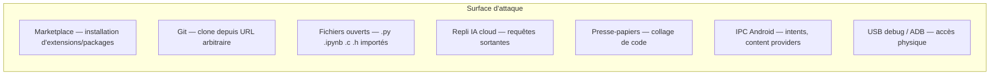

---

##### [REQ-SEC-0842] 3. Sandbox Python

###### [REQ-SEC-0843] 3.1 Architecture d'isolation

Le runtime Python s'exécute dans un **process Android isolé** (`android:isolatedProcess="true"`), distinct du process de l'IDE. Ce choix, documenté comme ADR-1 dans la spécification d'architecture, garantit une isolation au niveau du noyau Linux :

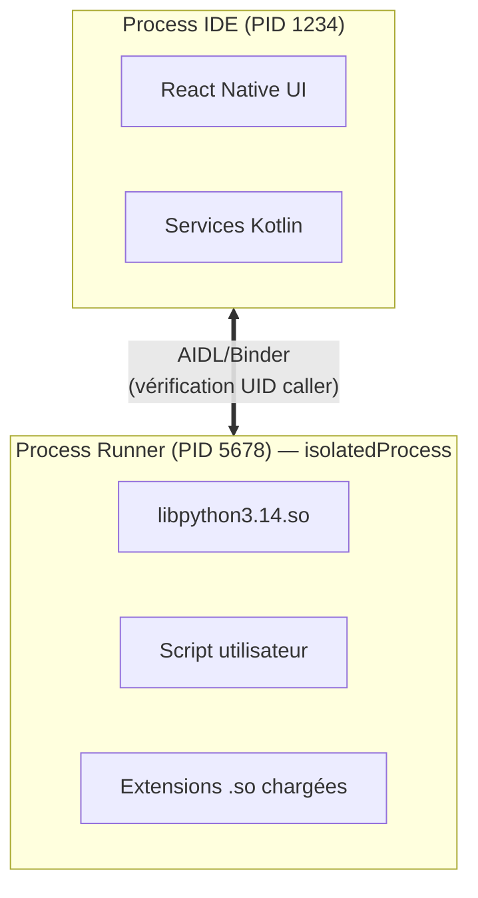

###### [REQ-SEC-0844] 3.2 Restrictions du process isolé

| Restriction | Mécanisme Android | Conséquence |
|---|---|---|
| **Pas d'accès réseau** | Pas de permission `INTERNET` sur le process isolé | Un script Python ne peut pas ouvrir de socket, faire de requête HTTP, ni communiquer avec un serveur distant — sauf via l'API réseau opt-in de l'IDE (§8.4) |
| **Pas de permissions système** | `isolatedProcess` n'hérite d'aucune permission runtime de l'app | Pas d'accès caméra, micro, GPS, contacts, Bluetooth |
| **Système de fichiers limité** | Scoped Storage Android | Accès uniquement au répertoire du projet en cours (`files/envs/<envId>/`), pas au FS global |
| **Pas d'accès à d'autres process** | Isolation PID namespace | Pas de `ptrace`, pas de `/proc` d'autres process |
| **Pas de services système sensibles** | `isolatedProcess` restreint les APIs système accessibles | Pas d'accès à `AccountManager`, `PackageManager` (limité), `ActivityManager` |
| **Pas de Binder arbitraire** | Le process isolé ne peut communiquer qu'avec le process IDE via l'interface AIDL déclarée | Pas de communication avec d'autres apps ou services système |

###### [REQ-SEC-0845] 3.3 Pool de process pré-chauffés

Pour garantir un démarrage rapide (< 500ms pour exécuter un script) tout en maintenant l'isolation, un **pool de process « chauds »** est maintenu (Runtime §3.3) :

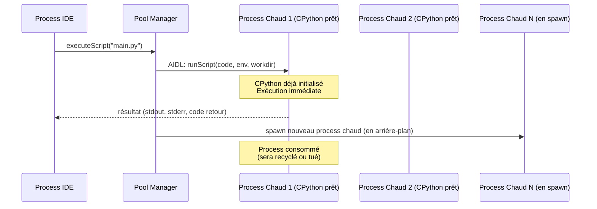

**Invariant de sécurité** : chaque process est usage unique — après exécution, le process est tué et jamais réutilisé pour un autre script. Cela empêche la fuite d'état entre exécutions successives (un script malveillant ne peut pas laisser de code en mémoire qui serait exécuté par le script suivant).

###### [REQ-SEC-0846] 3.4 Isolation mémoire CPython

| Mécanisme | Description | Référence |
|---|---|---|
| **`PyConfig_InitIsolatedConfig()`** | Le process Python est initialisé en mode isolé : pas de lecture des variables d'environnement de l'hôte (`PYTHONPATH`, `PYTHONSTARTUP`), pas de `site-packages` système | Runtime §3.1 |
| **`sys.path` contrôlé** | Seuls quatre chemins autorisés : répertoire du script, `envSitePackages` du projet, `python3xx.zip` (stdlib), extensions stdlib `.so` | Runtime §5.1 |
| **Pas de `subprocess`/`os.system()` efficace** | `fork()` ne fonctionne pas sur Android post-Zygote (Runtime §0) ; `subprocess.Popen` échouera — pas de shell escape possible | Architecture §5.4 |
| **Sous-interpréteurs à GIL isolé** | CPython 3.14 `concurrent.interpreters` pour le parallélisme intra-process, chaque sous-interpréteur avec sa propre table de modules et son propre GIL — isolation mémoire sans IPC | Runtime §9.2 |

###### [REQ-SEC-0847] 3.5 Chargement sécurisé des extensions natives

Le chargement de modules `.so` (extensions C/Python) suit l'**Option C** (Runtime §5.3) — le seul chemin officiel :

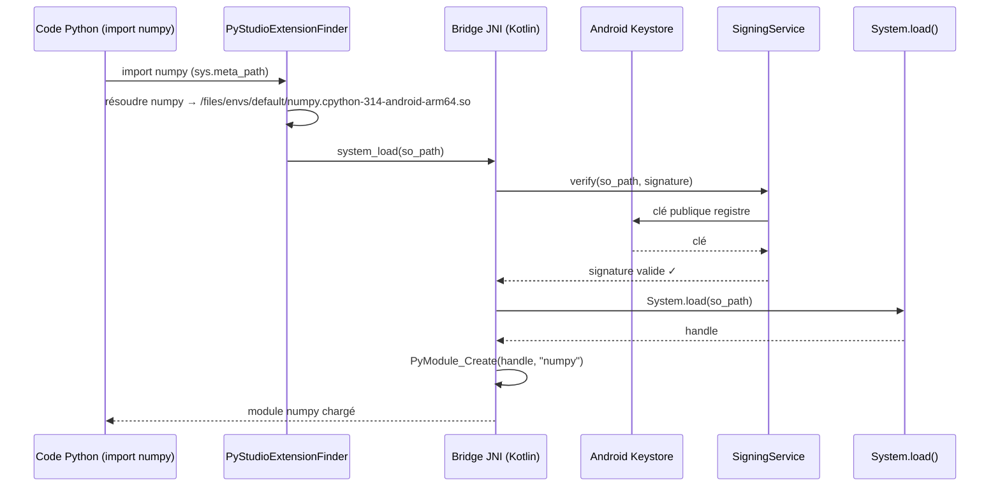

**Invariants de sécurité** :
1. Seuls les `.so` dont la signature est vérifiée sont chargés. Un `.so` modifié post-installation est rejeté.
2. `dlopen()` direct (Option B) est **interdit** en production — élimine les variations SELinux/OEM.
3. Le chargeur custom (`PyStudioExtensionFinder`) est enregistré comme **premier** finder sur `sys.meta_path`, interceptant tout import avant le finder standard de CPython.

###### [REQ-SEC-0848] 3.6 Restrictions supplémentaires du runtime

| API Python | Comportement dans la sandbox | Justification |
|---|---|---|
| `socket.*` | Bloqué au niveau OS (pas de `INTERNET`) | Pas d'accès réseau par défaut |
| `os.exec*()` | Échoue (pas de binaire exécutable dans le chemin) | Pas d'exécution arbitraire de binaires |
| `subprocess.Popen()` | Échoue (`fork()` non disponible post-Zygote) | Architecture Android |
| `ctypes.CDLL(path)` | Fonctionne uniquement si `path` est dans les chemins autorisés ET signé | Pas de chargement de `.so` arbitraires |
| `open(path)` | Restreint au Scoped Storage du projet | Pas d'accès au FS global |
| `os.environ` | Vide (config isolée) | Pas de fuite d'environnement |
| `signal.*` | Limité (pas de `SIGKILL` vers d'autres process) | Isolation PID |
| `multiprocessing` | Non fonctionnel (pas de `fork()`) ; remplacé par `concurrent.interpreters` | Architecture Android |
| `eval()` / `exec()` | Autorisé (c'est du Python standard) mais dans la sandbox du process isolé | L'isolation OS protège le device même en cas d'exécution de code arbitraire |

---

##### [REQ-SEC-0849] 4. Isolation des extensions

###### [REQ-SEC-0850] 4.1 Architecture d'isolation (synthèse de Marketplace §6)

Les extensions tierces s'exécutent dans un **second process `isolatedProcess`** distinct de celui du code utilisateur, hébergeant le moteur **QuickJS** :

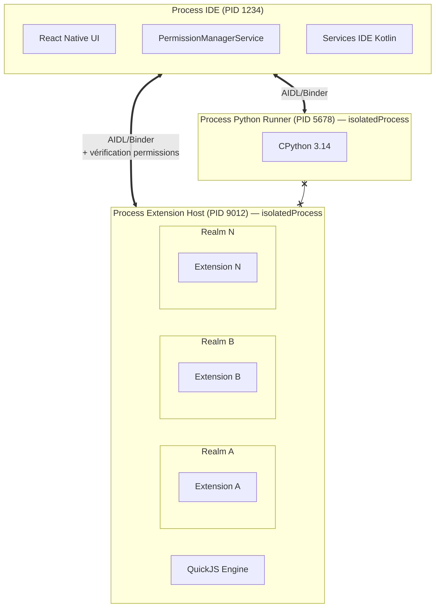

**Invariant critique** : les process Python Runner et Extension Host ne peuvent **jamais** communiquer directement entre eux. Toute interaction passe par le process IDE, qui vérifie les permissions à chaque appel.

###### [REQ-SEC-0851] 4.2 Trois couches d'isolation

| Couche | Mécanisme | Ce qu'elle protège |
|---|---|---|
| **OS (process)** | `android:isolatedProcess="true"` | Extensions ↔ IDE : pas de mémoire partagée, pas d'accès FS/réseau |
| **Application (realm)** | Realms QuickJS avec namespaces globaux séparés | Extension A ↔ Extension B : pas d'accès aux variables de l'autre |
| **Service (permissions)** | `PermissionManagerService` vérifie chaque appel API | Extension ↔ ressources IDE : seules les APIs autorisées sont accessibles |

###### [REQ-SEC-0852] 4.3 Propriétés de sécurité de QuickJS

| Propriété | Implication sécurité |
|---|---|
| **Pas de JIT** | Élimine les attaques ROP/JOP via la compilation machine (contrairement à V8/SpiderMonkey). L'exécution est purement interprétée — pas de page mémoire W+X |
| **`eval()` désactivé par realm** | Empêche l'injection de code dynamique par une extension compromise |
| **Empreinte mémoire ~2 Mo/realm** | Un realm ne peut pas consommer la mémoire sans être détecté par le budget (Marketplace §6.5) |
| **Pas d'APIs système** | QuickJS n'expose aucune API système (pas de `fs`, `net`, `os`, `process`) — les seules APIs disponibles sont celles injectées par le SDK proxy |
| **Déterministe** | Pas de garbage collector concurrent, comportement prévisible — facilite l'audit |

###### [REQ-SEC-0853] 4.4 Interception des appels API

Chaque appel de l'extension vers l'API SDK est **intercepté et vérifié** :

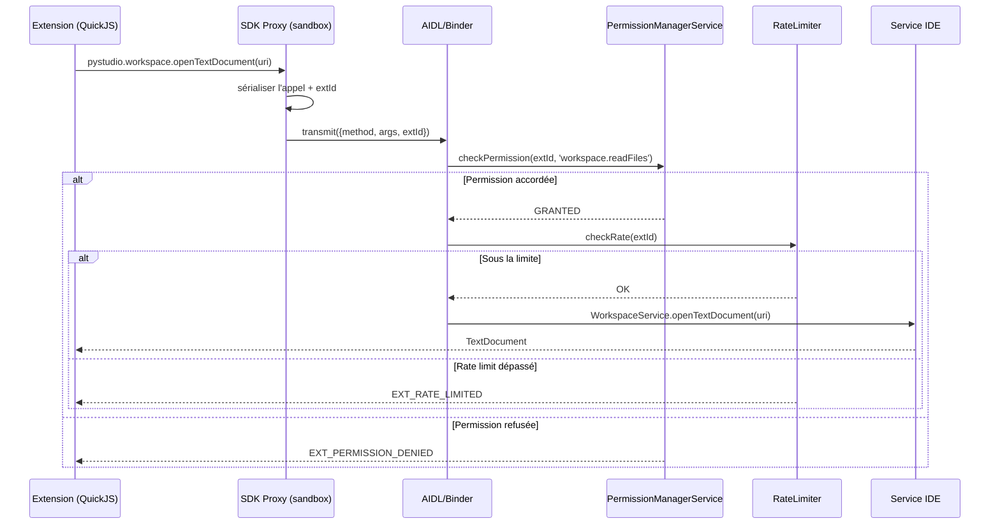

###### [REQ-SEC-0854] 4.5 Budget de ressources par extension

| Ressource | Limite par défaut | Configurable | Action si dépassé |
|---|---|---|---|
| Mémoire heap | 32 Mo | Oui (Paramètres) | Désactivation + notification |
| CPU par appel API | 30 s | Non | Annulation de l'appel |
| Temps d'activation | 10 s | Non | Échec d'activation |
| FileSystemWatcher | 500 fichiers | Non | Rejet silencieux |
| Stockage persistant | 50 Mo | Oui (Paramètres) | `StorageQuotaExceeded` |
| Appels API/seconde | 100 | Non | `EXT_RATE_LIMITED` |

###### [REQ-SEC-0855] 4.6 Watchdog et récupération

Le watchdog surveille le process Extension Host :
1. **Heartbeat** : signal de vie toutes les 5 secondes. Absence de 3 heartbeats = process gelé.
2. **Crash individuel** : le realm QuickJS défaillant est détruit individuellement sans affecter les autres.
3. **Crash du process** : le process entier est redémarré, toutes les extensions ré-activées selon leurs activation events.
4. **Crash répété** (3 fois en 10 minutes) : l'extension fautive est désactivée automatiquement avec notification.

###### [REQ-SEC-0856] 4.7 WebView sandboxée (extensions UI)

Les panneaux Webview des extensions sont dans une **Android WebView** isolée :
- `Content-Security-Policy: default-src 'none'; script-src 'nonce-<random>'; style-src 'unsafe-inline'` injectée automatiquement
- Pas d'accès réseau (sauf `network.outbound` accordée)
- Pas de `localStorage`/`IndexedDB` du host
- Communication uniquement via `postMessage()` (canal contrôlé)
- Pas de scripts distants — uniquement les scripts locaux de l'extension

---

##### [REQ-SEC-0857] 5. Signature des packages

###### [REQ-SEC-0858] 5.1 Chaîne de confiance

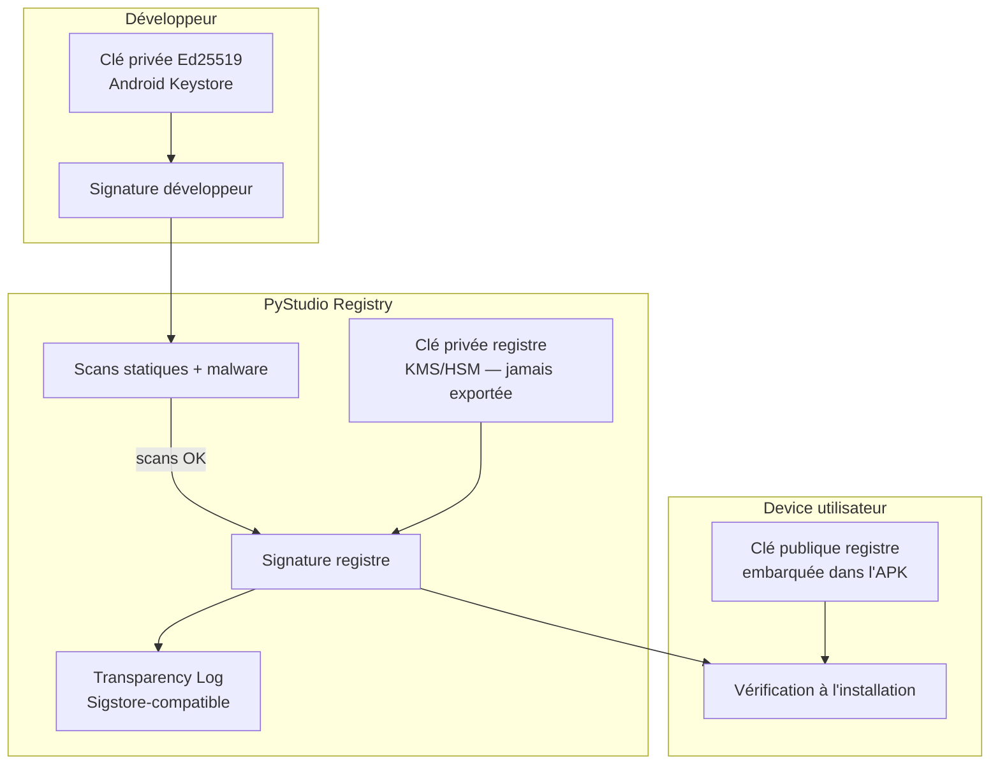

###### [REQ-SEC-0859] 5.2 Algorithmes et formats

| Composant | Algorithme | Format | Taille de clé |
|---|---|---|---|
| Signature développeur | **Ed25519** | Détachée (`.sig`) | 256 bits |
| Signature registre | **Ed25519** | Détachée + certificat | 256 bits |
| Hash d'intégrité | **SHA-256** | Hexadécimal dans le manifeste | 256 bits |
| Transparency log | **RFC 6962** (Merkle tree) | Entrée append-only + preuve d'inclusion | N/A |
| Stockage de la clé privée développeur | **Android Keystore** (JCA provider) | Jamais exportable en clair | Hardware-backed si TEE disponible |
| Stockage de la clé privée registre | **KMS/HSM** | Jamais exportable | FIPS 140-2 Level 2+ |

###### [REQ-SEC-0860] 5.3 Processus de signature (côté développeur — Package Builder §8)

1. Le Package Builder (étape 5) calcule le digest **SHA-256** de l'artefact complet.
2. Le digest est signé via la clé privée Ed25519 stockée dans le **Android Keystore** — la clé ne quitte jamais le hardware TEE si disponible.
3. La signature est apposée dans le manifeste (`pystudio-build-manifest.json`).
4. **Vérification immédiate** (`verify()` après `sign()`) — invariant « signe-puis-vérifie » systématique.
5. L'artefact signé est uploadé vers le Registry.

###### [REQ-SEC-0861] 5.4 Processus de co-signature (côté registre — Registry §6)

1. Le Registry reçoit l'artefact + signature développeur.
2. **Scans automatisés** : analyse statique, scan malware, vérification de licence, détection de dependency confusion.
3. Si scans OK : le `Signing Service` calcule le digest et signe avec la clé registre (opération `Sign(digest)` vers KMS — la clé ne quitte jamais le KMS).
4. Entrée dans le **transparency log** (Sigstore-compatible) : horodatage + hash + identité.
5. Promotion vers CDN pour distribution.

###### [REQ-SEC-0862] 5.5 Vérification à l'installation (côté device)

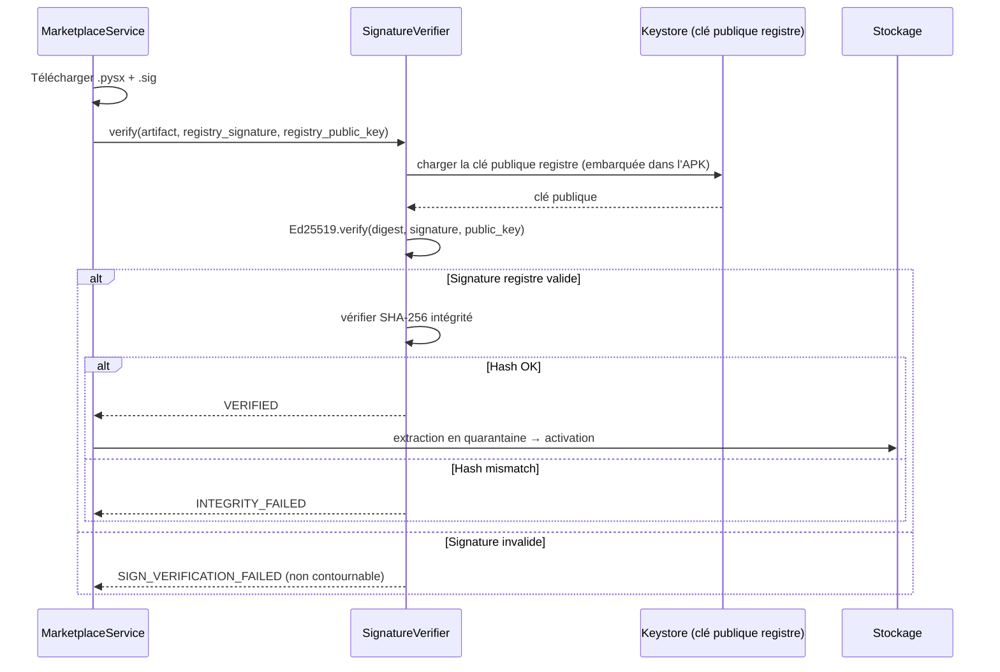

###### [REQ-SEC-0863] 5.6 Invariants de signature

| Invariant | Description | Conséquence d'une violation |
|---|---|---|
| **Signature registre obligatoire** | Aucun artefact marketplace ne peut être installé sans signature registre valide | Blocage total de l'installation (erreur `SIGN_VERIFICATION_FAILED`, non contournable) |
| **Clé publique registre embarquée** | La clé publique est compilée dans l'APK, pas téléchargée | Pas d'attaque MitM sur la distribution de la clé |
| **Rotation avec chevauchement** | Nouvelle clé annoncée 3 mois avant activation ; ancienne clé acceptée pendant la période de transition | Les artefacts existants restent vérifiables |
| **Idempotence** | Même version + même hash = même signature. Même version + hash différent = rejet `409 Conflict` | Pas de remplacement silencieux d'artefact |
| **Signe-puis-vérifie** | Toute signature est immédiatement vérifiée par le signataire | Détection de corruption mémoire ou bug crypto |

###### [REQ-SEC-0864] 5.7 Révocation

| Scénario | Action | Délai |
|---|---|---|
| Compromission clé développeur | Révocation `SIGNING_KEY.revoked_at`, alerte sur les artefacts affectés | Immédiat |
| Compromission clé registre | Rotation d'urgence KMS, re-signature de tous les artefacts actifs, push de mise à jour de l'app avec nouvelle clé publique | < 24h |
| Artefact malveillant détecté post-publication | `yank` de la version, notification push aux utilisateurs installés, désactivation automatique de l'extension au prochain démarrage | < 2h (fenêtre de révocation §8.7 Marketplace) |

---

##### [REQ-SEC-0865] 6. Permissions Android

###### [REQ-SEC-0866] 6.1 Permissions déclarées par l'application PyStudio

L'application PyStudio déclare le **minimum** de permissions Android runtime nécessaires :

| Permission Android | Usage | Obligatoire |
|---|---|---|
| `android.permission.INTERNET` | Réseau pour Git, Registry, repli IA cloud | Oui (process principal uniquement) |
| `android.permission.FOREGROUND_SERVICE` | Services de build longue durée | Oui |
| `android.permission.FOREGROUND_SERVICE_DATA_SYNC` | Synchronisation Git en arrière-plan | Oui |
| `android.permission.POST_NOTIFICATIONS` | Notifications de build, téléchargement | Oui |
| `android.permission.RECEIVE_BOOT_COMPLETED` | Reprise des tâches WorkManager au redémarrage | Oui |
| `android.permission.WAKE_LOCK` | Maintien du CPU pendant les builds | Oui |
| `android.permission.USE_BIOMETRIC` | Déverrouillage du Keystore pour secrets sensibles | Non — opt-in |
| `android.permission.READ_EXTERNAL_STORAGE` | Import de projets depuis le stockage (API < 30) | Non — ciblé API 30+ |
| `android.permission.MANAGE_EXTERNAL_STORAGE` | Import/export de projets (API 30+, scénarios spécifiques) | Non — opt-in |
| `android.permission.CAMERA` | Scan QR pour authentification Git OAuth device flow | Non — opt-in |
| `android.permission.VIBRATE` | Retour haptique sur actions tactiles | Non — opt-in |

###### [REQ-SEC-0867] 6.2 Permissions par domaine de confiance

| Domaine | Permissions Android effectives | Mécanisme |
|---|---|---|
| **Process IDE** | Toutes les permissions déclarées ci-dessus | Process principal de l'app |
| **Process Python Runner** (`isolatedProcess`) | **Aucune** | `isolatedProcess` n'hérite d'aucune permission |
| **Process Extension Host** (`isolatedProcess`) | **Aucune** | `isolatedProcess` n'hérite d'aucune permission |
| **WebView sandboxée** | Dépend de la permission `network.outbound` de l'extension | Le réseau est proxifié via le process IDE |

###### [REQ-SEC-0868] 6.3 Permissions granulaires pour les extensions (22 permissions SDK)

Le modèle de permissions des extensions (Marketplace §5) ajoute une couche applicative au-dessus de l'isolation Android :

| Catégorie | Permissions | Niveau de risque |
|---|---|---|
| **Workspace** | `workspace.readFiles`, `workspace.writeFiles`, `workspace.readConfig`, `workspace.writeConfig` | 🟢-🟡 |
| **Système de fichiers** | `filesystem.readExternal`, `filesystem.writeExternal` | 🔴 |
| **Réseau** | `network.outbound`, `network.domains` | 🔴-🟡 |
| **Terminal** | `terminal.create`, `terminal.readOnly` | 🔴-🟡 |
| **Processus** | `process.spawn` | 🔴 |
| **IA** | `ai.localModel`, `ai.chatHistory` | 🟡-🔴 |
| **Git** | `scm.read`, `scm.write` | 🟢-🔴 |
| **Debug** | `debug.sessions` | 🟡 |
| **Notebook** | `notebooks.kernels` | 🟡 |
| **Presse-papiers** | `clipboard.read`, `clipboard.write` | 🟡-🟢 |
| **Stockage** | `storage.local`, `storage.secrets` | 🟢-🟡 |
| **Auth** | `authentication.providers` | 🔴 |
| **Environnement** | `env.deviceInfo` | 🟢 |
| **UI** | `webview.create` | 🟡 |

###### [REQ-SEC-0869] 6.4 Comportement par niveau de risque

| Niveau | Comportement à l'installation | Comportement au runtime |
|---|---|---|
| 🟢 Faible | Accordé automatiquement, listé dans le résumé | Accès direct |
| 🟡 Moyen | Affiché avec explication, accordé par défaut sauf refus explicite | Accès direct après approbation initiale |
| 🔴 Élevé | Avertissement explicite, **requiert approbation active** | Prompt de confirmation au premier usage |

###### [REQ-SEC-0870] 6.5 Interactions permissions Android ↔ permissions SDK

Les permissions SDK sont vérifiées **au niveau applicatif** (dans le process IDE) et ne contournent jamais les restrictions Android. Exemple : même si une extension a la permission SDK `network.outbound`, la requête réseau est effectuée **par le process IDE** (qui a `INTERNET`) pour le compte de l'extension — le process `isolatedProcess` de l'Extension Host n'a toujours pas accès au réseau directement.

---

##### [REQ-SEC-0871] 7. Gestion des secrets

###### [REQ-SEC-0872] 7.1 Backend : Android Keystore

Tous les secrets cryptographiques sont gérés via le **Android Keystore System** (JCA provider `"AndroidKeyStore"`) :

| Type de secret | Stockage | Opérations autorisées | Extractible |
|---|---|---|---|
| Clé privée Ed25519 (signature développeur) | Keystore hardware-backed (TEE/StrongBox si disponible) | `Sign()`, `Verify()` | **Non** (jamais exportable en clair) |
| Clé privée SSH (Git) | Keystore | `Sign()` pour auth SSH | **Non** |
| Clé symétrique AES-256 (chiffrement local) | Keystore | `Encrypt()`, `Decrypt()` | **Non** |
| Token Git (HTTPS PAT) | `EncryptedSharedPreferences` (clé maître dans Keystore) | Lecture déchiffrée en mémoire | Uniquement via API SDK |
| Refresh token OAuth | `EncryptedSharedPreferences` | Lecture déchiffrée pour renouvellement | Uniquement via API SDK |
| API keys (extensions) | `SecretStorage` de l'extension (chiffré par Keystore) | Lecture déchiffrée par l'extension | Uniquement par l'extension propriétaire |

###### [REQ-SEC-0873] 7.2 `EncryptedSharedPreferences`

Les données sensibles non-clés (tokens, préférences chiffrées) sont stockées via `EncryptedSharedPreferences` (bibliothèque AndroidX Security) :

```kotlin
val masterKey = MasterKey.Builder(context)
    .setKeyScheme(MasterKey.KeyScheme.AES256_GCM)
    .setUserAuthenticationRequired(false)  // ou true pour exiger biométrie
    .build()

val encryptedPrefs = EncryptedSharedPreferences.create(
    context,
    "pystudio_secrets",
    masterKey,
    EncryptedSharedPreferences.PrefKeyEncryptionScheme.AES256_SIV,
    EncryptedSharedPreferences.PrefValueEncryptionScheme.AES256_GCM
)
```

###### [REQ-SEC-0874] 7.3 Invariants de la gestion des secrets

| Invariant | Description | Mécanisme de vérification |
|---|---|---|
| **Jamais en clair dans les logs** | Tout secret est masqué (`***`) avant écriture dans les logs de build, debug, diagnostic | Masquage dans `BuildLogChunk` (Builder §15), filtre global dans le logger |
| **Jamais en clair dans le stockage** | Aucun fichier de configuration ne contient de secret en clair | Chiffrement systématique via `EncryptedSharedPreferences` ou Keystore |
| **Jamais transmis en clair sur le réseau** | TLS 1.3 minimum pour toute communication réseau transportant des secrets | Certificate pinning (§8.2) |
| **Clé privée non extractible** | Les clés privées dans le Keystore sont marquées `setUserAuthenticationRequired` si possible | Flag Keystore, vérification TEE |
| **Portée minimale des credentials** | Chaque credential Git est associé à un remote spécifique d'un dépôt spécifique (Git §11.2) | CREDENTIAL_REF par remote, pas de credential global |
| **Secret détruit à la désinstallation** | La désinstallation de l'app supprime le Keystore et les `EncryptedSharedPreferences` | Comportement Android standard pour le Scoped Storage |

###### [REQ-SEC-0875] 7.4 Cycle de vie des credentials Git

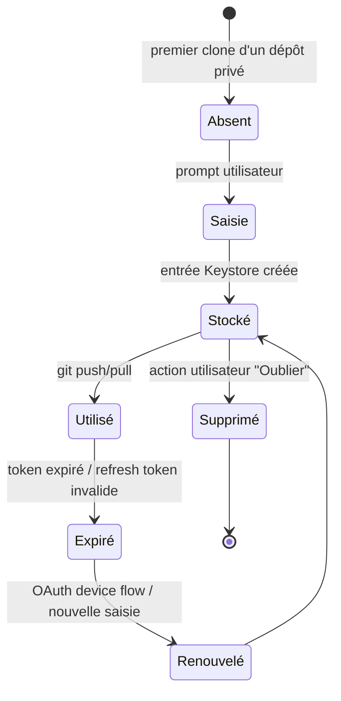

###### [REQ-SEC-0876] 7.5 Protection biométrique (opt-in)

Pour les secrets les plus sensibles (clés de signature de publication), l'utilisateur peut activer la **protection biométrique** :

```kotlin
val keyGenSpec = KeyGenParameterSpec.Builder("dev_signing_key", PURPOSE_SIGN)
    .setDigests(KeyProperties.DIGEST_SHA256)
    .setAlgorithmParameterSpec(ECGenParameterSpec("ed25519"))
    .setUserAuthenticationRequired(true)
    .setUserAuthenticationParameters(300, AUTH_BIOMETRIC_STRONG)  // 5 min
    .setIsStrongBoxBacked(true)  // si StrongBox disponible
    .build()
```

Après activation, chaque opération de signature requiert une empreinte ou un visage pour déverrouiller la clé.

---

##### [REQ-SEC-0877] 8. Sécurité réseau

###### [REQ-SEC-0878] 8.1 Principe : pas de réseau par défaut

| Composant | Accès réseau par défaut | Comment obtenir l'accès |
|---|---|---|
| Code utilisateur Python/C++ | **Non** | API SDK opt-in (future) |
| Extensions tierces | **Non** | Permission `network.outbound` déclarée + approuvée |
| Services IDE (Git, Registry, Marketplace) | **Oui** (process principal) | Permissions Android `INTERNET` |
| Repli IA cloud | **Non** | Activation explicite par l'utilisateur dans Paramètres |
| Process de compilation | **Non** (sauf étape 1 : acquisition des sources) | Étape 1 uniquement, via le process IDE |

###### [REQ-SEC-0879] 8.2 TLS et certificate pinning

| Destination | Version TLS min. | Certificate pinning | Rotation |
|---|---|---|---|
| `registry.pystudio.dev` | TLS 1.3 | **Oui** — pin sur la clé publique du certificat leaf + backup pin | Backup pin pré-déployé, rotation sans mise à jour de l'app |
| `cdn.pystudio.dev` | TLS 1.3 | **Oui** — pin sur l'AC intermédiaire | Rotation annuelle |
| `api.pystudio.dev` | TLS 1.3 | **Oui** — pin sur la clé publique leaf | Backup pin |
| Serveurs Git distants (github.com, gitlab.com, etc.) | TLS 1.2+ | **Non** (trop de serveurs) | CA système Android |
| Domaines d'extensions (`network.domains`) | TLS 1.2+ | **Non** (tiers) | CA système Android |

Implémenté via **OkHttp CertificatePinner** (Kotlin) :

```kotlin
val client = OkHttpClient.Builder()
    .certificatePinner(CertificatePinner.Builder()
        .add("registry.pystudio.dev",
             "sha256/AAAA...=",   // pin actif
             "sha256/BBBB...=")   // backup pin
        .build())
    .build()
```

###### [REQ-SEC-0880] 8.3 Network Security Config

```xml
<!-- res/xml/network_security_config.xml -->
<network-security-config>
    <!-- Interdire le trafic en clair (HTTP) pour tout domaine -->
    <base-config cleartextTrafficPermitted="false">
        <trust-anchors>
            <certificates src="system" />
        </trust-anchors>
    </base-config>

    <!-- Certificate pinning pour les services PyStudio -->
    <domain-config>
        <domain includeSubdomains="true">pystudio.dev</domain>
        <pin-set expiration="2027-07-01">
            <pin digest="SHA-256">AAAA...=</pin>
            <pin digest="SHA-256">BBBB...=</pin>
        </pin-set>
    </domain-config>
</network-security-config>
```

###### [REQ-SEC-0881] 8.4 Proxy réseau pour les extensions

Les extensions avec `network.outbound` ne font **jamais** de requêtes directement — leurs requêtes sont proxifiées via le process IDE :

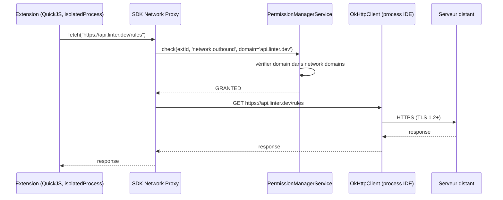

**Avantage** : le process IDE peut auditer, logger et rate-limiter toutes les requêtes réseau des extensions. Un domaine non déclaré dans `network.domains` est automatiquement bloqué.

###### [REQ-SEC-0882] 8.5 IPC sécurisé

| Canal | Mécanisme | Protection |
|---|---|---|
| IDE ↔ Python Runner | AIDL/Binder | Vérification UID du caller, pas de socket |
| IDE ↔ Extension Host | AIDL/Binder | Vérification UID du caller, pas de socket |
| IDE ↔ LSP servers (pylsp, clangd) | Socket Unix local (stdio) | Pas d'écoute sur loopback TCP — aucun port ouvert |
| IDE ↔ DAP (débogueur) | Socket Unix local | `lldb-server` lié en local uniquement |
| Extension ↔ WebView | `postMessage()` | Canal contrôlé, pas de bridge JS ↔ natif |

**Invariant : aucun port TCP loopback n'est exposé.** Cela empêche toute app tierce sur le device de se connecter aux services internes de l'IDE.

---

##### [REQ-SEC-0883] 9. Protection du code utilisateur

###### [REQ-SEC-0884] 9.1 Le code ne quitte jamais l'appareil (par défaut)

| Action | Code transmis | Opt-in explicite | Journal d'audit |
|---|---|---|---|
| Édition, exécution, debug | Non | — | — |
| Git push | Oui, vers le serveur distant choisi | Oui (action explicite de l'utilisateur) | Horodatage + remote dans le log Git |
| Export de projet (ZIP) | Oui, vers le stockage choisi | Oui (action de partage/export) | — |
| Repli IA cloud | Oui, le contexte envoyé au modèle distant | Activation manuelle dans Paramètres | Horodatage + taille du payload (pas le contenu) |
| Telemetrie IDE | **Jamais de code** — métriques anonymisées uniquement | Opt-in | — |
| Extensions tierces | Via les permissions SDK (`workspace.readFiles`) | Approbation à l'installation | Journal d'activité de l'extension |

###### [REQ-SEC-0885] 9.2 Chiffrement au repos

| Donnée | Mécanisme de chiffrement | Clé |
|---|---|---|
| Code source (fichiers `.py`, `.c`, `.h`) | **Chiffrement au niveau fichier FS** (Android FBE — File-Based Encryption) | Clé de chiffrement du profil utilisateur Android (transparente pour l'app) |
| Secrets et tokens | `EncryptedSharedPreferences` (AES-256-GCM) | Clé maître dans Keystore |
| Base de données SQLite (état, historique, index) | **SQLCipher** (AES-256-CBC) | Clé dérivée de la clé maître Keystore |
| Cache de packages (wheels) | FBE Android (pas de chiffrement applicatif supplémentaire) | Clé profil |
| Historique IA | SQLCipher | Clé Keystore |

###### [REQ-SEC-0886] 9.3 Isolation par projet

Chaque projet utilisateur a son propre espace isolé :

```
/data/user/0/com.pystudio/files/
├── projects/
│   ├── project-a/              # Code source projet A
│   │   ├── src/
│   │   └── pystudio.toml
│   └── project-b/              # Code source projet B (isolé de A)
├── envs/
│   ├── project-a-default/      # Environnement Python (site-packages)
│   └── project-b-custom/
├── cache/
│   └── wheels/                 # Cache partagé entre projets (lecture seule)
└── extensions/
    └── <extensionId>/          # Données par extension (isolé)
```

Une extension avec `workspace.readFiles` n'a accès qu'au **projet actuellement ouvert** — jamais aux autres projets ni au répertoire parent.

###### [REQ-SEC-0887] 9.4 Protection contre l'exfiltration par extensions

| Vecteur d'exfiltration | Mitigation |
|---|---|
| Lecture du code + envoi réseau | Nécessite deux permissions distinctes (`workspace.readFiles` + `network.outbound`), toutes deux visibles à l'installation |
| Lecture du code + écriture presse-papiers | Nécessite `workspace.readFiles` + `clipboard.write`, détectable par l'utilisateur |
| Lecture du code + stockage dans l'extension | Limité par le quota de stockage (50 Mo par défaut) |
| Lecture du code via un processus enfant | `process.spawn` (permission 🔴) + pas de `fork()` dans le process isolé |
| Lecture du code d'un autre projet | Impossible — l'extension n'a accès qu'au workspace ouvert |

###### [REQ-SEC-0888] 9.5 Suppression sécurisée

Lors de la suppression d'un projet, PyStudio :
1. Supprime les fichiers du projet (`files/projects/<id>/`)
2. Supprime l'environnement Python associé (`files/envs/<id>/`)
3. Supprime les entrées de configuration liées
4. Supprime les credentials Git associés au projet du Keystore
5. Ne supprime **pas** le cache de wheels partagé (pas de données spécifiques au projet)

La suppression est **non récupérable** — pas de corbeille (les données sont chiffrées par FBE, donc le simple `unlink()` suffit car les blocs chiffrés deviennent illisibles sans la clé).

---

##### [REQ-SEC-0889] 10. Sécurité du notebook

###### [REQ-SEC-0890] 10.1 Sandboxing du rendu Markdown/HTML

Les cellules Markdown (y compris le HTML inline autorisé) sont rendues dans une **WebView sandboxée** (Notebook §5.3) :

| Restriction | Mécanisme |
|---|---|
| Pas d'exécution de scripts arbitraires | CSP stricte : `script-src 'none'` |
| Pas d'accès au réseau | WebView sans `INTERNET`, images chargées depuis le cache local |
| Pas d'accès aux APIs du device | Pas de bridge `JavascriptInterface` |
| Pas de cookies/storage partagé | WebView isolée par notebook |
| Pas de navigation vers des URLs externes | Liens ouverts dans le navigateur externe, pas dans la WebView |

###### [REQ-SEC-0891] 10.2 Sorties riches (Plotly, matplotlib)

Les sorties `text/html` interactives (Plotly) sont rendues dans une **WebView sandboxée distincte** par sortie, avec une CSP minimale autorisant les scripts Plotly embarqués (JS inline avec nonce) mais aucun accès réseau ni à des APIs système.

###### [REQ-SEC-0892] 10.3 Kernel isolation

Chaque notebook possède son propre kernel Python dans le process Runner `isolatedProcess` — un notebook malveillant partagé ne peut :
- Accéder aux variables d'un autre notebook (kernels séparés)
- Accéder au FS hors du workspace (Scoped Storage)
- Contacter le réseau (pas de permission `INTERNET`)
- Affecter l'IDE (process séparé)

---

##### [REQ-SEC-0893] 11. Sécurité de l'assistant IA

###### [REQ-SEC-0894] 11.1 Exécution locale par défaut

| Fonction IA | Exécution locale | Données transmises hors device |
|---|---|---|
| Complétion de code (FIM) | Oui (GGUF/llama.cpp) | Aucune |
| Chat contextuel | Oui (GGUF) | Aucune |
| Explication d'erreurs | Oui | Aucune |
| Refactoring/correction | Oui | Aucune |
| Génération de tests | Oui | Aucune |
| Recherche sémantique (RAG) | Oui (embeddings locaux) | Aucune |
| **Repli cloud** (opt-in explicite) | Non — modèle distant | Contexte envoyé (code sélectionné, messages) |

###### [REQ-SEC-0895] 11.2 Garanties de l'IA locale

| Dimension | Garantie |
|---|---|
| **Provenance des modèles** | Distribués via le Registry, signature vérifiée avant chargement — un modèle modifié est rejeté |
| **Index sémantique** | Contient uniquement des embeddings numériques, jamais le code source en clair ; stocké en SQLite local, jamais synchronisé |
| **Code généré** | Jamais exécuté automatiquement — toujours présenté comme diff pour approbation utilisateur |
| **Pas de fine-tuning sur les données utilisateur** | Le modèle local ne s'adapte pas au code de l'utilisateur — pas de fuite de données par le modèle |
| **Journal d'audit** | Toute requête vers le repli cloud est journalisée (horodatage + taille, pas le contenu) |

###### [REQ-SEC-0896] 11.3 Repli cloud — protections

Quand le repli cloud est activé :
- **TLS 1.3** pour le transport
- **Pas de stockage côté serveur** des requêtes (policy contractuelle)
- **Pas d'entraînement** sur les données transmises
- L'utilisateur peut **voir l'historique** des requêtes sortantes dans le journal d'audit
- L'utilisateur peut **révoquer** l'activation du repli cloud à tout moment

---

##### [REQ-SEC-0897] 12. Audit & observabilité

###### [REQ-SEC-0898] 12.1 Journal d'audit local

Un journal d'audit **append-only** est maintenu localement dans une base SQLite chiffrée :

| Événement | Données enregistrées | Données exclues |
|---|---|---|
| Installation d'extension | extensionId, version, permissions accordées, horodatage | — |
| Révocation de permission | extensionId, permission, horodatage | — |
| Accès réseau (extension) | extensionId, domaine, méthode HTTP, code retour, horodatage | Contenu de la requête/réponse |
| Git push/pull | remote URL, branche, horodatage | Contenu du diff |
| Requête IA cloud | modèle, taille du payload, horodatage | Contenu du contexte/réponse |
| Erreur de signature | artefact concerné, type d'erreur, horodatage | — |
| Échec d'activation d'extension | extensionId, erreur, horodatage | — |
| Modification de paramètre de sécurité | paramètre, ancienne valeur, nouvelle valeur, horodatage | — |

###### [REQ-SEC-0899] 12.2 Masquage des secrets dans les logs

Tous les logs (build, debug, extension, diagnostic) passent par un **filtre de masquage** :

```kotlin
object SecretMasker {
    private val patterns = listOf(
        Regex("(ghp_|gho_|github_pat_)[A-Za-z0-9_]+"),    // GitHub tokens
        Regex("(glpat-)[A-Za-z0-9_-]+"),                    // GitLab tokens
        Regex("(pystudio_pub_)[A-Za-z0-9]+"),               // PyStudio tokens
        Regex("-----BEGIN (RSA |EC |OPENSSH )?PRIVATE KEY-----[\\s\\S]*?-----END"),
        Regex("Bearer [A-Za-z0-9._~+/=-]+"),                // Bearer tokens
        Regex("(password|secret|token|key)\\s*[:=]\\s*\\S+", RegexOption.IGNORE_CASE)
    )

    fun mask(input: String): String {
        var result = input
        patterns.forEach { pattern ->
            result = pattern.replace(result, "***MASKED***")
        }
        return result
    }
}
```

###### [REQ-SEC-0900] 12.3 Métriques de sécurité (opt-in)

Si l'utilisateur a activé les métriques anonymisées :

| Métrique | Description | Usage |
|---|---|---|
| `security.signature_failures` | Nombre de vérifications de signature échouées | Détection d'attaques supply chain |
| `security.permission_denials` | Nombre de refus de permissions par extensions | Détection d'extensions abusives |
| `security.extension_crashes` | Nombre de crashes par extension | Qualité de l'écosystème |
| `security.host_restarts` | Nombre de redémarrages du process Extension Host | Stabilité du sandbox |

---

##### [REQ-SEC-0901] 13. Réponse aux incidents

###### [REQ-SEC-0902] 13.1 Scénarios de réponse

| Scénario | Détection | Réponse automatique | Réponse manuelle |
|---|---|---|---|
| Extension malveillante détectée post-publication | Signalement communautaire, analyse dynamique | Yank de la version, notification push, désactivation au prochain démarrage | Enquête, suppression du compte si confirmé |
| Package wheel avec `.so` compromis | Scan malware, signalement | Yank + blocage du hash dans la liste de révocation | Re-scan de tous les artefacts du publisher |
| Compromission de la clé de signature registre | Monitoring du transparency log, alerte interne | Rotation d'urgence KMS | Mise à jour de l'app avec nouvelle clé publique (< 24h) |
| Token développeur compromis | Tentative de publication depuis IP inhabituelle, MFA manquant | Verrouillage du compte, révocation du token | Confirmation d'identité, re-émission de token |
| Fuite de credential Git utilisateur | Détection externe (GitHub abuse report) | — (hors périmètre IDE) | Notification utilisateur si email connu |

###### [REQ-SEC-0903] 13.2 Procédure de yank d'urgence

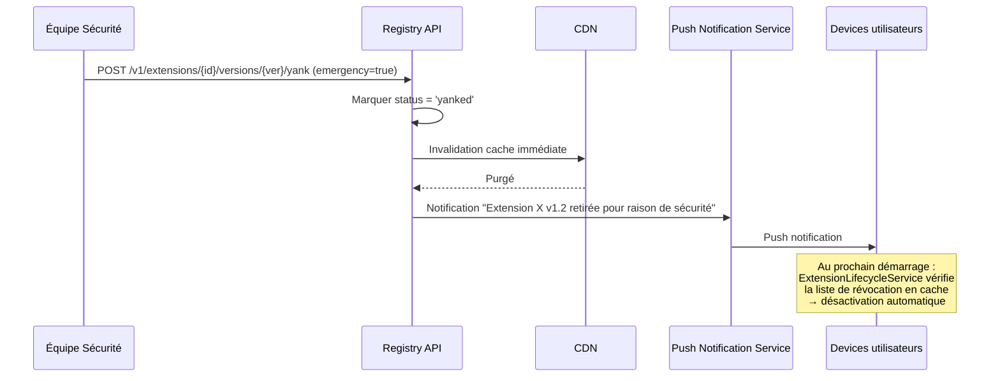

---

##### [REQ-SEC-0904] 14. Conformité & supply chain

###### [REQ-SEC-0905] 14.1 Protection supply chain

| Mesure | Description | Référence |
|---|---|---|
| **Double signature** | Développeur + registre — un seul signataire compromis ne suffit pas | Registry §6.1 |
| **Scan pré-publication** | Analyse statique + malware + licence + dependency confusion | Registry §4.1, §12 |
| **Typosquatting** | Vérification de collision de nom avec PyPI et les extensions populaires | Registry §4.2, §12 |
| **Namespace reservation** | Les organisations vérifiées réservent leur namespace | Registry §12 |
| **Transparency log** | Toute signature est enregistrée dans un log immuable vérifiable | Registry §6.3 |
| **Fenêtre de révocation 2h** | Les mises à jour automatiques ont un délai de 2h pour permettre la détection | Marketplace §8.7 |
| **Provenance (SLSA-like)** | `pystudio-build-manifest.json` attaché à chaque artefact : sources, flags, toolchain, horodatage | Builder §15 |
| **MFA obligatoire** | Pour les comptes publiant des packages populaires | Registry §5.1 |
| **Tokens scopés** | Périmètre limité par `package_scope_pattern` | Registry §5.3 |

###### [REQ-SEC-0906] 14.2 Conformité Android

| Exigence | Mesure PyStudio |
|---|---|
| Scoped Storage (API 30+) | Tout le stockage dans le répertoire privé de l'app ; accès externe uniquement via `MANAGE_EXTERNAL_STORAGE` opt-in |
| Network Security Config | HTTP interdit, TLS 1.2+ minimum, certificate pinning pour les domaines PyStudio |
| Background restrictions (API 31+) | Utilisation de `ForegroundService` pour les builds longues, `WorkManager` pour les tâches différables |
| Exact alarm restrictions (API 31+) | Pas d'alarme exacte — utilisation de `WorkManager` avec contraintes |
| Photo picker (API 33+) | Non applicable — PyStudio n'accède pas aux médias |
| Notification permission (API 33+) | `POST_NOTIFICATIONS` demandée au runtime, build/download notifications |

---

##### [REQ-SEC-0907] 15. APIs internes de sécurité

###### [REQ-SEC-0908] 15.1 Interface Kotlin — SecurityGateService

```kotlin
interface SecurityGateService {
    /** Vérifie la signature d'un artefact avant installation */
    suspend fun verifySignature(
        artifactPath: Path,
        signaturePath: Path,
        trustStore: TrustStore = TrustStore.REGISTRY_AND_DEVELOPER
    ): SignatureVerificationResult

    /** Vérifie l'intégrité d'un fichier via son hash SHA-256 */
    suspend fun verifyIntegrity(filePath: Path, expectedSha256: String): Boolean

    /** Calcule le digest SHA-256 d'un fichier */
    suspend fun computeDigest(filePath: Path): String
}

enum class TrustStore {
    REGISTRY_ONLY,           // Uniquement la clé publique du registre
    REGISTRY_AND_DEVELOPER,  // Registre + clé développeur (si présente)
    LOCAL_DEVELOPMENT        // Mode développement local (signature optionnelle, journalisé)
}

sealed class SignatureVerificationResult {
    data class Verified(
        val signerIdentity: String,
        val signedAt: Instant,
        val registrySigned: Boolean,
        val developerSigned: Boolean
    ) : SignatureVerificationResult()

    data class Failed(
        val error: SignatureError,
        val details: String
    ) : SignatureVerificationResult()
}

enum class SignatureError {
    SIGNATURE_INVALID,
    KEY_NOT_TRUSTED,
    KEY_REVOKED,
    ARTIFACT_TAMPERED,
    CERTIFICATE_EXPIRED
}
```

###### [REQ-SEC-0909] 15.2 Interface Kotlin — PermissionManagerService

```kotlin
interface PermissionManagerService {
    /** Vérifie si une permission est accordée pour une extension */
    suspend fun checkPermission(extensionId: String, permission: String): Boolean

    /** Vérifie si une permission est accordée pour un domaine réseau spécifique */
    suspend fun checkNetworkPermission(extensionId: String, domain: String): Boolean

    /** Demande une permission dynamiquement (affiche un prompt à l'utilisateur) */
    suspend fun requestPermission(
        extensionId: String,
        permission: String,
        justification: String
    ): PermissionRequestResult

    /** Révoque une permission précédemment accordée */
    suspend fun revokePermission(extensionId: String, permission: String)

    /** Retourne toutes les permissions et leur état pour une extension */
    suspend fun getGrants(extensionId: String): List<PermissionGrant>

    /** Flux d'événements de changement de permissions */
    fun permissionChangesFlow(): Flow<PermissionChangeEvent>
}

enum class PermissionRequestResult {
    GRANTED,
    DENIED_BY_USER,
    DENIED_PERMANENTLY,   // L'utilisateur a coché "Ne plus demander"
    ALREADY_GRANTED
}
```

###### [REQ-SEC-0910] 15.3 Interface Kotlin — SecretStorageService

```kotlin
interface SecretStorageService {
    /** Stocke un secret dans le Keystore pour un scope donné */
    suspend fun store(scope: SecretScope, key: String, value: ByteArray)

    /** Récupère un secret déchiffré en mémoire */
    suspend fun retrieve(scope: SecretScope, key: String): ByteArray?

    /** Supprime un secret */
    suspend fun delete(scope: SecretScope, key: String)

    /** Liste les clés existantes pour un scope */
    suspend fun listKeys(scope: SecretScope): List<String>

    /** Génère une paire de clés Ed25519 */
    suspend fun generateSigningKeyPair(alias: String): PublicKey

    /** Signe un digest avec une clé privée du Keystore */
    suspend fun sign(alias: String, digest: ByteArray): ByteArray

    /** Vérifie une signature avec une clé publique */
    suspend fun verify(publicKey: PublicKey, digest: ByteArray, signature: ByteArray): Boolean
}

sealed class SecretScope {
    data class Extension(val extensionId: String) : SecretScope()
    data class Git(val remoteUrl: String) : SecretScope()
    object Developer : SecretScope()  // Clés de signature de publication
    object System : SecretScope()     // Secrets internes de l'IDE
}
```

###### [REQ-SEC-0911] 15.4 Interface Kotlin — AuditLogService

```kotlin
interface AuditLogService {
    /** Enregistre un événement d'audit */
    suspend fun log(event: AuditEvent)

    /** Requête les événements d'audit avec filtres */
    suspend fun query(
        filter: AuditFilter,
        limit: Int = 100,
        offset: Int = 0
    ): List<AuditEvent>

    /** Export du journal d'audit (pour diagnostic) */
    suspend fun export(format: ExportFormat): Path
}

data class AuditEvent(
    val timestamp: Instant,
    val category: AuditCategory,
    val action: String,
    val subject: String,          // ex. extensionId, packageName
    val details: Map<String, String>,
    val severity: AuditSeverity
)

enum class AuditCategory {
    EXTENSION_LIFECYCLE, PERMISSION_CHANGE, NETWORK_ACCESS,
    SIGNATURE_VERIFICATION, GIT_OPERATION, AI_CLOUD_REQUEST,
    SECRET_ACCESS, SECURITY_SETTING_CHANGE
}

enum class AuditSeverity { INFO, WARNING, CRITICAL }
```

---

##### [REQ-SEC-0912] 16. Diagrammes de séquence

###### [REQ-SEC-0913] 16.1 Exécution sécurisée d'un script Python

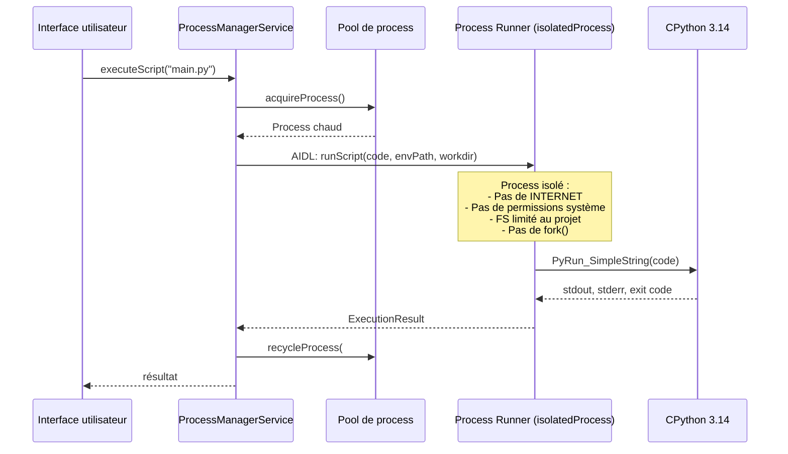

###### [REQ-SEC-0914] 16.2 Installation sécurisée d'une extension

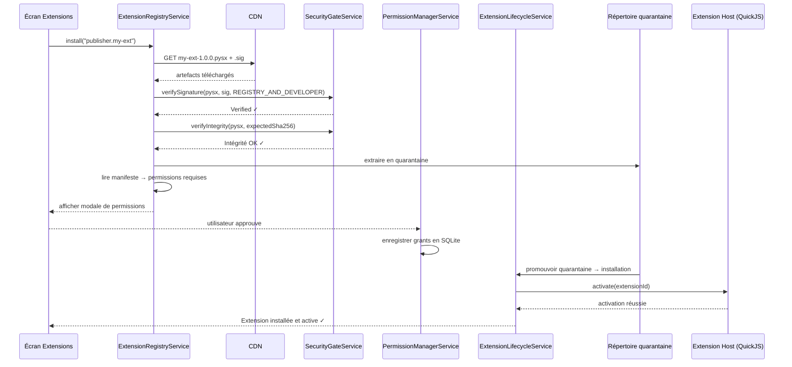

###### [REQ-SEC-0915] 16.3 Détection et réponse à une extension malveillante

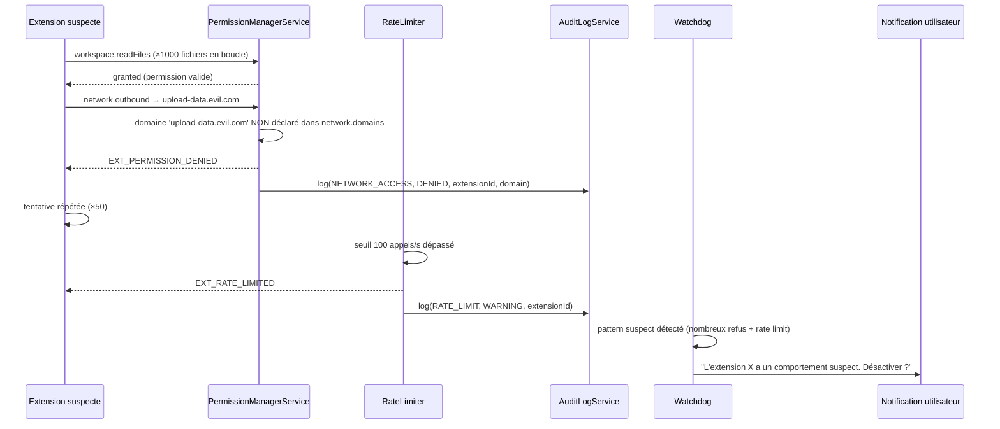

---

##### [REQ-SEC-0916] 17. Matrice de contrôle

| Menace | Contrôle 1 (prévention) | Contrôle 2 (détection) | Contrôle 3 (réponse) |
|---|---|---|---|
| Code Python malveillant | `isolatedProcess` sans réseau/FS (§3) | Process usage unique, pas d'état résiduel (§3.3) | Kill du process, pas d'impact sur l'IDE |
| Extension exfiltrant du code | Permissions granulaires (§4.4, §6.3) | Journal d'audit, rate limiting (§12) | Désactivation, signalement |
| Package wheel avec .so compromis | Double signature obligatoire (§5) | Scan malware pré-publication (§14.1) | Yank + révocation (§13.2) |
| MitM sur Git push | TLS 1.2+ (§8.2) | Vérification clé d'hôte SSH (Git §11.3) | Alerte + rejet de connexion |
| MitM sur Registry | TLS 1.3 + certificate pinning (§8.2) | Échec de pin = connexion refusée | Basculement vers cache local |
| Fuite de token Git | Keystore non extractible (§7.1) | Masquage dans les logs (§12.2) | Révocation du token |
| Notebook malveillant (XSS) | WebView sandboxée, CSP stricte (§10) | Pas de `JavascriptInterface` | Isolation par notebook |
| App tierce lisant les données | Scoped Storage, pas de Content Provider public (§9.3) | — | Chiffrement FBE Android |
| Compromission clé registre | KMS/HSM, rotation programmée (§5.2) | Transparency log (§5.4) | Rotation d'urgence < 24h (§5.7) |
| Dependency confusion | Typosquatting check, namespace reservation (§14.1) | Scan pré-publication | Yank + notification |

---

##### [REQ-SEC-0917] 18. Risques techniques & mitigations

| Risque | Impact | Probabilité | Mitigation |
|---|---|---|---|
| Vulnérabilité dans QuickJS permettant un escape de sandbox | Critique | Faible (pas de JIT, surface réduite) | Audit de sécurité externe, `isolatedProcess` comme filet OS, bounty program |
| Variabilité SELinux/OEM cassant `System.load()` (Option C) | Élevé | Faible (chemin officiel Android) | Matrice de tests OEM, Option A comme fallback pour la stdlib |
| Dépassement de budget mémoire par une extension causant un OOM du process Host | Moyen | Moyen | Watchdog, budget strict, désactivation automatique |
| Rotation de clé registre invalidant des artefacts en cache | Faible | Faible | Chevauchement de clés, invalidation ciblée du cache L4 |
| Certificate pinning bloquant l'accès au Registry après changement de certificat | Élevé | Faible | Backup pin pré-déployé, expiration progressive des pins |
| Attaque par downgrade TLS | Élevé | Faible | TLS 1.3 minimum pour les services PyStudio, Network Security Config |
| Extension accumulant des données utilisateur dans son storage | Moyen | Moyen | Quota 50 Mo, transparence du stockage utilisé dans l'UI |
| Clé Keystore inaccessible après changement de biométrie | Moyen | Faible | Fallback vers PIN/mot de passe Android, documentation utilisateur |

---

##### [REQ-SEC-0918] 19. Glossaire

| Terme | Définition |
|---|---|
| **`isolatedProcess`** | Attribut Android qui crée un process sans aucune permission, incapable d'accéder au réseau, aux fichiers système, ou aux services Android non explicitement partagés via Binder |
| **TEE (Trusted Execution Environment)** | Environnement matériel sécurisé du processeur (ex. ARM TrustZone) où les clés Keystore sont stockées et les opérations crypto exécutées — le secret ne quitte jamais le hardware |
| **StrongBox** | Sous-ensemble du TEE avec un processeur dédié et une mémoire isolée (puce sécurisée) — niveau de protection supérieur au TEE logiciel |
| **FBE (File-Based Encryption)** | Chiffrement au niveau fichier d'Android, transparent pour les applications — chaque profil utilisateur a sa propre clé |
| **Certificate Pinning** | Vérification que le certificat TLS d'un serveur correspond à une clé publique pré-enregistrée dans l'app — empêche les MitM même avec un CA compromis |
| **Transparency Log** | Journal cryptographique append-only (Merkle tree) où chaque signature est enregistrée, permettant la détection de signatures frauduleuses |
| **Realm (QuickJS)** | Contexte d'exécution JavaScript isolé avec son propre namespace global, dans lequel s'exécute une extension |
| **Scoped Storage** | Modèle de stockage Android (API 30+) limitant l'accès de chaque app à son propre répertoire privé |
| **KMS/HSM** | Key Management Service / Hardware Security Module — service gérant les clés cryptographiques du registre sans les exposer en clair |
| **Ed25519** | Algorithme de signature numérique basé sur les courbes elliptiques (Curve25519), performant et sûr |
| **SQLCipher** | Extension SQLite ajoutant le chiffrement AES-256 transparent des bases de données |
| **AIDL (Android Interface Definition Language)** | Langage de définition d'interfaces pour la communication inter-process sur Android via le mécanisme Binder du noyau |
| **CSP (Content-Security-Policy)** | En-tête HTTP restreignant les sources de contenu exécutable dans une page web — protège contre les XSS |
| **Quarantaine** | Répertoire temporaire isolé où un artefact est extrait et analysé avant activation |
| **Yank** | Retrait d'une version publiée du Marketplace — l'artefact n'est plus téléchargeable mais les métadonnées restent visibles |
| **Supply chain attack** | Attaque visant la chaîne d'approvisionnement logicielle (injection de code malveillant dans un package légitime) |

---

*Fin de la spécification de sécurité.*


